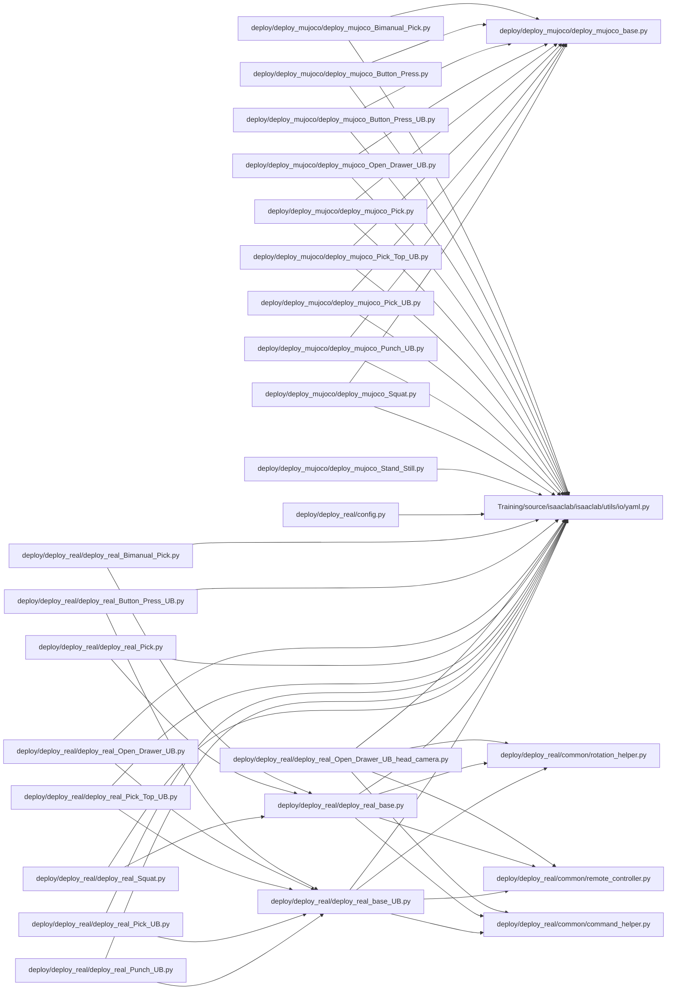

```mermaid
graph LR
  P1["scripts/benchmarks/benchmark_cameras.py"] --> P2["source/isaaclab/isaaclab/app/__init__.py"]
  P3["scripts/benchmarks/benchmark_load_robot.py"] --> P2["source/isaaclab/isaaclab/app/__init__.py"]
  P4["scripts/benchmarks/benchmark_non_rl.py"] --> P2["source/isaaclab/isaaclab/app/__init__.py"]
  P5["scripts/benchmarks/benchmark_rlgames.py"] --> P2["source/isaaclab/isaaclab/app/__init__.py"]
  P6["scripts/benchmarks/benchmark_rsl_rl.py"] --> P2["source/isaaclab/isaaclab/app/__init__.py"]
  P7["scripts/demos/h1_locomotion.py"] --> P2["source/isaaclab/isaaclab/app/__init__.py"]
  P8["scripts/demos/multi_asset.py"] --> P2["source/isaaclab/isaaclab/app/__init__.py"]
  P9["scripts/demos/sensors/cameras.py"] --> P2["source/isaaclab/isaaclab/app/__init__.py"]
  P10["scripts/demos/sensors/contact_sensor.py"] --> P2["source/isaaclab/isaaclab/app/__init__.py"]
  P11["scripts/demos/sensors/frame_transformer_sensor.py"] --> P2["source/isaaclab/isaaclab/app/__init__.py"]
  P12["scripts/demos/sensors/imu_sensor.py"] --> P2["source/isaaclab/isaaclab/app/__init__.py"]
  P13["scripts/demos/sensors/raycaster_sensor.py"] --> P2["source/isaaclab/isaaclab/app/__init__.py"]
  P14["scripts/environments/teleoperation/teleop_se3_agent.py"] --> P2["source/isaaclab/isaaclab/app/__init__.py"]
  P15["scripts/imitation_learning/isaaclab_mimic/annotate_demos.py"] --> P2["source/isaaclab/isaaclab/app/__init__.py"]
  P16["scripts/imitation_learning/isaaclab_mimic/consolidated_demo.py"] --> P2["source/isaaclab/isaaclab/app/__init__.py"]
  P17["scripts/reinforcement_learning/rl_games/play.py"] --> P2["source/isaaclab/isaaclab/app/__init__.py"]
  P18["scripts/reinforcement_learning/rl_games/train.py"] --> P2["source/isaaclab/isaaclab/app/__init__.py"]
  P19["scripts/reinforcement_learning/rsl_rl/play.py"] --> P2["source/isaaclab/isaaclab/app/__init__.py"]
  P20["scripts/reinforcement_learning/rsl_rl/play_camera.py"] --> P2["source/isaaclab/isaaclab/app/__init__.py"]
  P21["scripts/reinforcement_learning/rsl_rl/play_eval.py"] --> P2["source/isaaclab/isaaclab/app/__init__.py"]
  P22["scripts/reinforcement_learning/rsl_rl/play_eval_camera.py"] --> P2["source/isaaclab/isaaclab/app/__init__.py"]
  P23["scripts/reinforcement_learning/rsl_rl/play_full_body.py"] --> P2["source/isaaclab/isaaclab/app/__init__.py"]
  P24["scripts/reinforcement_learning/rsl_rl/play_pick.py"] --> P2["source/isaaclab/isaaclab/app/__init__.py"]
  P25["scripts/reinforcement_learning/rsl_rl/train.py"] --> P2["source/isaaclab/isaaclab/app/__init__.py"]
  P26["scripts/reinforcement_learning/sb3/play.py"] --> P2["source/isaaclab/isaaclab/app/__init__.py"]
  P27["scripts/reinforcement_learning/sb3/train.py"] --> P2["source/isaaclab/isaaclab/app/__init__.py"]
  P28["scripts/reinforcement_learning/skrl/play.py"] --> P2["source/isaaclab/isaaclab/app/__init__.py"]
  P29["scripts/reinforcement_learning/skrl/train.py"] --> P2["source/isaaclab/isaaclab/app/__init__.py"]
  P30["scripts/tools/record_demos.py"] --> P2["source/isaaclab/isaaclab/app/__init__.py"]
  P31["scripts/tutorials/01_assets/add_new_robot.py"] --> P2["source/isaaclab/isaaclab/app/__init__.py"]
  P32["scripts/tutorials/03_envs/create_cartpole_base_env.py"] --> P2["source/isaaclab/isaaclab/app/__init__.py"]
  P33["scripts/tutorials/03_envs/create_cube_base_env.py"] --> P2["source/isaaclab/isaaclab/app/__init__.py"]
  P34["scripts/tutorials/03_envs/create_quadruped_base_env.py"] --> P2["source/isaaclab/isaaclab/app/__init__.py"]
  P35["scripts/tutorials/04_sensors/add_sensors_on_robot.py"] --> P2["source/isaaclab/isaaclab/app/__init__.py"]
  P36["scripts/tutorials/04_sensors/run_frame_transformer.py"] --> P2["source/isaaclab/isaaclab/app/__init__.py"]
  P37["scripts/tutorials/04_sensors/run_ray_caster.py"] --> P2["source/isaaclab/isaaclab/app/__init__.py"]
  P38["scripts/tutorials/04_sensors/run_ray_caster_camera.py"] --> P2["source/isaaclab/isaaclab/app/__init__.py"]
  P39["scripts/tutorials/04_sensors/run_usd_camera.py"] --> P2["source/isaaclab/isaaclab/app/__init__.py"]
  P40["scripts/tutorials/05_controllers/run_diff_ik.py"] --> P2["source/isaaclab/isaaclab/app/__init__.py"]
  P41["scripts/tutorials/05_controllers/run_osc.py"] --> P2["source/isaaclab/isaaclab/app/__init__.py"]
  P42["source/isaaclab/isaaclab/markers/config/__init__.py"] --> P43["source/isaaclab/isaaclab/sim/__init__.py"]
  P43["source/isaaclab/isaaclab/sim/__init__.py"] --> P44["source/isaaclab/isaaclab/sim/converters/__init__.py"]
  P45["source/isaaclab/test/assets/test_articulation.py"] --> P2["source/isaaclab/isaaclab/app/__init__.py"]
  P46["source/isaaclab/test/controllers/test_operational_space.py"] --> P2["source/isaaclab/isaaclab/app/__init__.py"]
  P47["source/isaaclab/test/envs/check_manager_based_env_anymal_locomotion.py"] --> P2["source/isaaclab/isaaclab/app/__init__.py"]
  P48["source/isaaclab/test/envs/check_manager_based_env_floating_cube.py"] --> P2["source/isaaclab/isaaclab/app/__init__.py"]
  P49["source/isaaclab/test/envs/test_scale_randomization.py"] --> P2["source/isaaclab/isaaclab/app/__init__.py"]
  P50["source/isaaclab/test/envs/test_texture_randomization.py"] --> P2["source/isaaclab/isaaclab/app/__init__.py"]
  P51["source/isaaclab/test/markers/check_markers_visibility.py"] --> P2["source/isaaclab/isaaclab/app/__init__.py"]
  P52["source/isaaclab/test/scene/check_interactive_scene.py"] --> P2["source/isaaclab/isaaclab/app/__init__.py"]
  P53["source/isaaclab/test/scene/test_interactive_scene.py"] --> P2["source/isaaclab/isaaclab/app/__init__.py"]
  P54["source/isaaclab/test/sensors/check_ray_caster.py"] --> P2["source/isaaclab/isaaclab/app/__init__.py"]
  P55["source/isaaclab/test/sensors/test_contact_sensor.py"] --> P2["source/isaaclab/isaaclab/app/__init__.py"]
  P56["source/isaaclab/test/sensors/test_frame_transformer.py"] --> P2["source/isaaclab/isaaclab/app/__init__.py"]
  P57["source/isaaclab/test/sensors/test_imu.py"] --> P2["source/isaaclab/isaaclab/app/__init__.py"]
  P58["source/isaaclab/test/sensors/test_ray_caster_camera.py"] --> P2["source/isaaclab/isaaclab/app/__init__.py"]
  P59["source/isaaclab_assets/isaaclab_assets/robots/anymal.py"] --> P43["source/isaaclab/isaaclab/sim/__init__.py"]
  P60["source/isaaclab_tasks/isaaclab_tasks/manager_based/interactive_motion_tracking/g1/motion_tracking_interactive_base.py"] --> P43["source/isaaclab/isaaclab/sim/__init__.py"]
  P61["source/isaaclab_tasks/isaaclab_tasks/manager_based/interactive_motion_tracking/g1/motion_tracking_interactive_base_real.py"] --> P43["source/isaaclab/isaaclab/sim/__init__.py"]
  P62["source/isaaclab_tasks/isaaclab_tasks/manager_based/motion_tracking/g1/motion_tracking_env.py"] --> P43["source/isaaclab/isaaclab/sim/__init__.py"]
```

```mermaid
graph LR
  P1["eval/eval_humanml.py"] --> P2["data_loaders/humanml/scripts/motion_process.py"]
  P1["eval/eval_humanml.py"] --> P3["utils/dist_util.py"]
  P1["eval/eval_humanml.py"] --> P4["utils/model_util.py"]
  P5["sample/Bimanual_Pick_real/refine_motions.py"] --> P6["Training/isaac_utils/isaac_utils/rotations.py"]
  P5["sample/Bimanual_Pick_real/refine_motions.py"] --> P7["Training/source/isaaclab/isaaclab/terrains/trimesh/__init__.py"]
  P8["sample/Bimanual_Pick_sim/retarget.py"] --> P6["Training/isaac_utils/isaac_utils/rotations.py"]
  P9["sample/Bimanual_Pick_sim1/refine_motions.py"] --> P6["Training/isaac_utils/isaac_utils/rotations.py"]
  P9["sample/Bimanual_Pick_sim1/refine_motions.py"] --> P7["Training/source/isaaclab/isaaclab/terrains/trimesh/__init__.py"]
  P10["sample/Bimanual_Pick_sim2/refine_motions_for_real.py"] --> P6["Training/isaac_utils/isaac_utils/rotations.py"]
  P10["sample/Bimanual_Pick_sim2/refine_motions_for_real.py"] --> P7["Training/source/isaaclab/isaaclab/terrains/trimesh/__init__.py"]
  P11["sample/Button_Press_real/retarget.py"] --> P6["Training/isaac_utils/isaac_utils/rotations.py"]
  P12["sample/Button_Press_real1/refine_motions.py"] --> P6["Training/isaac_utils/isaac_utils/rotations.py"]
  P12["sample/Button_Press_real1/refine_motions.py"] --> P7["Training/source/isaaclab/isaaclab/terrains/trimesh/__init__.py"]
  P13["sample/Button_Press_sim/retarget.py"] --> P6["Training/isaac_utils/isaac_utils/rotations.py"]
  P14["sample/Button_Press_sim1/refine_motions.py"] --> P6["Training/isaac_utils/isaac_utils/rotations.py"]
  P14["sample/Button_Press_sim1/refine_motions.py"] --> P7["Training/source/isaaclab/isaaclab/terrains/trimesh/__init__.py"]
  P15["sample/Ground_Pick_Top_sim/retarget.py"] --> P6["Training/isaac_utils/isaac_utils/rotations.py"]
  P16["sample/Ground_Pick_Top_sim1/refine_motions.py"] --> P6["Training/isaac_utils/isaac_utils/rotations.py"]
  P16["sample/Ground_Pick_Top_sim1/refine_motions.py"] --> P7["Training/source/isaaclab/isaaclab/terrains/trimesh/__init__.py"]
  P17["sample/Ground_Pick_sim/retarget.py"] --> P6["Training/isaac_utils/isaac_utils/rotations.py"]
  P18["sample/Ground_Pick_sim1/refine_motions.py"] --> P6["Training/isaac_utils/isaac_utils/rotations.py"]
  P18["sample/Ground_Pick_sim1/refine_motions.py"] --> P7["Training/source/isaaclab/isaaclab/terrains/trimesh/__init__.py"]
  P19["sample/Jump_sim/retarget.py"] --> P6["Training/isaac_utils/isaac_utils/rotations.py"]
  P20["sample/Jump_sim1/refine_motions.py"] --> P6["Training/isaac_utils/isaac_utils/rotations.py"]
  P20["sample/Jump_sim1/refine_motions.py"] --> P7["Training/source/isaaclab/isaaclab/terrains/trimesh/__init__.py"]
  P21["sample/Kick_sim/retarget.py"] --> P6["Training/isaac_utils/isaac_utils/rotations.py"]
  P22["sample/Kick_sim1/refine_motions.py"] --> P6["Training/isaac_utils/isaac_utils/rotations.py"]
  P22["sample/Kick_sim1/refine_motions.py"] --> P7["Training/source/isaaclab/isaaclab/terrains/trimesh/__init__.py"]
  P23["sample/Open_Door_sim/generate_motions_squat.py"] --> P6["Training/isaac_utils/isaac_utils/rotations.py"]
  P23["sample/Open_Door_sim/generate_motions_squat.py"] --> P7["Training/source/isaaclab/isaaclab/terrains/trimesh/__init__.py"]
  P24["sample/Open_Door_sim/generate_motions_stand.py"] --> P6["Training/isaac_utils/isaac_utils/rotations.py"]
  P25["sample/Open_Drawer_sim/generate_motions_squat.py"] --> P6["Training/isaac_utils/isaac_utils/rotations.py"]
  P25["sample/Open_Drawer_sim/generate_motions_squat.py"] --> P7["Training/source/isaaclab/isaaclab/terrains/trimesh/__init__.py"]
  P26["sample/Open_Drawer_sim/generate_motions_stand.py"] --> P6["Training/isaac_utils/isaac_utils/rotations.py"]
  P26["sample/Open_Drawer_sim/generate_motions_stand.py"] --> P7["Training/source/isaaclab/isaaclab/terrains/trimesh/__init__.py"]
  P27["sample/Pick_Place_sim/retarget.py"] --> P6["Training/isaac_utils/isaac_utils/rotations.py"]
  P28["sample/Pick_Place_sim1/refine_motions.py"] --> P6["Training/isaac_utils/isaac_utils/rotations.py"]
  P28["sample/Pick_Place_sim1/refine_motions.py"] --> P7["Training/source/isaaclab/isaaclab/terrains/trimesh/__init__.py"]
  P29["sample/Pick_real/retarget.py"] --> P6["Training/isaac_utils/isaac_utils/rotations.py"]
  P30["sample/Pick_real1/refine_motions.py"] --> P6["Training/isaac_utils/isaac_utils/rotations.py"]
  P30["sample/Pick_real1/refine_motions.py"] --> P7["Training/source/isaaclab/isaaclab/terrains/trimesh/__init__.py"]
  P31["sample/Pick_real1/refine_motions_top.py"] --> P6["Training/isaac_utils/isaac_utils/rotations.py"]
  P31["sample/Pick_real1/refine_motions_top.py"] --> P7["Training/source/isaaclab/isaaclab/terrains/trimesh/__init__.py"]
  P32["sample/Pick_sim/retarget.py"] --> P6["Training/isaac_utils/isaac_utils/rotations.py"]
  P33["sample/Pick_sim1/refine_motions.py"] --> P6["Training/isaac_utils/isaac_utils/rotations.py"]
  P33["sample/Pick_sim1/refine_motions.py"] --> P7["Training/source/isaaclab/isaaclab/terrains/trimesh/__init__.py"]
  P34["sample/Punch_real/retarget.py"] --> P6["Training/isaac_utils/isaac_utils/rotations.py"]
  P35["sample/Punch_real1/refine_motions.py"] --> P6["Training/isaac_utils/isaac_utils/rotations.py"]
  P35["sample/Punch_real1/refine_motions.py"] --> P7["Training/source/isaaclab/isaaclab/terrains/trimesh/__init__.py"]
  P36["sample/Punch_sim/retarget.py"] --> P6["Training/isaac_utils/isaac_utils/rotations.py"]
  P37["sample/Punch_sim1/refine_motions.py"] --> P6["Training/isaac_utils/isaac_utils/rotations.py"]
  P37["sample/Punch_sim1/refine_motions.py"] --> P7["Training/source/isaaclab/isaaclab/terrains/trimesh/__init__.py"]
  P38["sample/Sit_sim/retarget.py"] --> P6["Training/isaac_utils/isaac_utils/rotations.py"]
  P39["sample/Sit_sim1/refine_motions.py"] --> P6["Training/isaac_utils/isaac_utils/rotations.py"]
  P39["sample/Sit_sim1/refine_motions.py"] --> P7["Training/source/isaaclab/isaaclab/terrains/trimesh/__init__.py"]
  P40["sample/generate.py"] --> P2["data_loaders/humanml/scripts/motion_process.py"]
  P40["sample/generate.py"] --> P4["utils/model_util.py"]
  P41["sample/retarget_helpers/_utils.py"] --> P6["Training/isaac_utils/isaac_utils/rotations.py"]
  P42["visualize/joints2smpl/fit_seq.py"] --> P7["Training/source/isaaclab/isaaclab/terrains/trimesh/__init__.py"]
  P43["visualize/vis_utils.py"] --> P7["Training/source/isaaclab/isaaclab/terrains/trimesh/__init__.py"]
```

# 📖 Codebase Overview: `DreamControl`

> Auto-generated code map. Files scanned: **782**

## 📑 Table of Contents

- [Directory Tree](#-directory-tree)
- [Dependency Graph](#-dependency-graph-python)
- [File Details](#-file-details)

---
## 🗂 Directory Tree

```
📁 **(root)/**
  📄 CODEBASE_OVERVIEW.md
  📄 README.md
  📄 generate_codebase_overview.py
📁 **Sim2Real/**
  📄 README.md
  📄 setup.py
  📄 test.py
        📁 **Sim2Real/deploy/deploy_mujoco/**
          📄 deploy_mujoco_Bimanual_Pick.py
          📄 deploy_mujoco_Button_Press.py
          📄 deploy_mujoco_Button_Press_UB.py
          📄 deploy_mujoco_Open_Drawer_UB.py
          📄 deploy_mujoco_Pick.py
          📄 deploy_mujoco_Pick_Top_UB.py
          📄 deploy_mujoco_Pick_UB.py
          📄 deploy_mujoco_Punch_UB.py
          📄 deploy_mujoco_Squat.py
          📄 deploy_mujoco_Stand_Still.py
          📄 deploy_mujoco_base.py
            📁 **Sim2Real/deploy/deploy_mujoco/configs/**
              📄 g1.yaml
              📄 g1_full_body.yaml
              📄 g1_full_body_29dof.yaml
        📁 **Sim2Real/deploy/deploy_real/**
          📄 config.py
          📄 deploy_real_Bimanual_Pick.py
          📄 deploy_real_Button_Press_UB.py
          📄 deploy_real_Open_Drawer_UB.py
          📄 deploy_real_Open_Drawer_UB_head_camera.py
          📄 deploy_real_Pick.py
          📄 deploy_real_Pick_Top_UB.py
          📄 deploy_real_Pick_UB.py
          📄 deploy_real_Punch_UB.py
          📄 deploy_real_Squat.py
          📄 deploy_real_base.py
          📄 deploy_real_base_UB.py
            📁 **Sim2Real/deploy/deploy_real/common/**
              📄 command_helper.py
              📄 remote_controller.py
              📄 rotation_helper.py
            📁 **Sim2Real/deploy/deploy_real/configs/**
              📄 g1.yaml
              📄 g1_full_body.yaml
              📄 g1_full_body_new.yaml
            📁 **Sim2Real/resources/robots/g1_description/**
              📄 README.md
📁 **Training/**
  📄 isaaclab.bat
  📄 isaaclab.sh
  📄 pyproject.toml
                    📁 **Training/HumanoidVerse/humanoidverse/data/robots/g1/**
                      📄 change_revolute_to_fixed.py
                      📄 config.yaml
    📁 **Training/isaac_utils/**
      📄 setup.py
        📁 **Training/isaac_utils/isaac_utils/**
          📄 __init__.py
          📄 maths.py
          📄 rotations.py
    📁 **Training/record_videos/**
      📄 collect_sim_videos.bash
      📄 record_videos.bash
      📄 record_videos_bimanual_pick.bash
      📄 record_videos_button_press.bash
      📄 record_videos_ground_pick.bash
      📄 record_videos_ground_pick_new.bash
      📄 record_videos_jump.bash
      📄 record_videos_kick.bash
      📄 record_videos_open_drawer.bash
      📄 record_videos_pick_place.bash
      📄 record_videos_punch.bash
      📄 record_videos_sit.bash
        📁 **Training/scripts/benchmarks/**
          📄 benchmark_cameras.py
          📄 benchmark_load_robot.py
          📄 benchmark_non_rl.py
          📄 benchmark_rlgames.py
          📄 benchmark_rsl_rl.py
          📄 utils.py
        📁 **Training/scripts/demos/**
          📄 arms.py
          📄 bipeds.py
          📄 deformables.py
          📄 h1_locomotion.py
          📄 hands.py
          📄 markers.py
          📄 multi_asset.py
          📄 procedural_terrain.py
          📄 quadcopter.py
          📄 quadrupeds.py
            📁 **Training/scripts/demos/sensors/**
              📄 cameras.py
              📄 contact_sensor.py
              📄 frame_transformer_sensor.py
              📄 imu_sensor.py
              📄 raycaster_sensor.py
        📁 **Training/scripts/environments/**
          📄 list_envs.py
          📄 random_agent.py
          📄 zero_agent.py
            📁 **Training/scripts/environments/state_machine/**
              📄 lift_cube_sm.py
              📄 lift_teddy_bear.py
              📄 open_cabinet_sm.py
            📁 **Training/scripts/environments/teleoperation/**
              📄 teleop_se3_agent.py
            📁 **Training/scripts/imitation_learning/isaaclab_mimic/**
              📄 annotate_demos.py
              📄 consolidated_demo.py
              📄 generate_dataset.py
            📁 **Training/scripts/imitation_learning/robomimic/**
              📄 play.py
              📄 train.py
            📁 **Training/scripts/reinforcement_learning/ray/**
              📄 grok_cluster_with_kubectl.py
              📄 launch.py
              📄 mlflow_to_local_tensorboard.py
              📄 submit_job.py
              📄 tuner.py
              📄 util.py
              📄 wrap_resources.py
                📁 **Training/scripts/reinforcement_learning/ray/hyperparameter_tuning/**
                  📄 vision_cartpole_cfg.py
                  📄 vision_cfg.py
            📁 **Training/scripts/reinforcement_learning/rl_games/**
              📄 play.py
              📄 train.py
            📁 **Training/scripts/reinforcement_learning/rsl_rl/**
              📄 button_detect.py
              📄 button_press.py
              📄 cli_args.py
              📄 play.py
              📄 play_camera.py
              📄 play_eval.py
              📄 play_eval_camera.py
              📄 play_full_body.py
              📄 play_pick.py
              📄 train.py
            📁 **Training/scripts/reinforcement_learning/sb3/**
              📄 play.py
              📄 train.py
            📁 **Training/scripts/reinforcement_learning/skrl/**
              📄 play.py
              📄 train.py
        📁 **Training/scripts/tools/**
          📄 blender_obj.py
          📄 check_instanceable.py
          📄 convert_instanceable.py
          📄 convert_mesh.py
          📄 convert_mjcf.py
          📄 convert_urdf.py
          📄 merge_hdf5_datasets.py
          📄 pretrained_checkpoint.py
          📄 process_meshes_to_obj.py
          📄 record_demos.py
          📄 replay_demos.py
            📁 **Training/scripts/tutorials/00_sim/**
              📄 create_empty.py
              📄 launch_app.py
              📄 log_time.py
              📄 set_rendering_mode.py
              📄 spawn_prims.py
            📁 **Training/scripts/tutorials/01_assets/**
              📄 add_new_robot.py
              📄 run_articulation.py
              📄 run_deformable_object.py
              📄 run_rigid_object.py
            📁 **Training/scripts/tutorials/02_scene/**
              📄 create_scene.py
            📁 **Training/scripts/tutorials/03_envs/**
              📄 create_cartpole_base_env.py
              📄 create_cube_base_env.py
              📄 create_quadruped_base_env.py
              📄 policy_inference_in_usd.py
              📄 run_cartpole_rl_env.py
            📁 **Training/scripts/tutorials/04_sensors/**
              📄 add_sensors_on_robot.py
              📄 run_frame_transformer.py
              📄 run_ray_caster.py
              📄 run_ray_caster_camera.py
              📄 run_usd_camera.py
            📁 **Training/scripts/tutorials/05_controllers/**
              📄 run_diff_ik.py
              📄 run_osc.py
        📁 **Training/source/isaaclab/**
          📄 pyproject.toml
          📄 setup.py
            📁 **Training/source/isaaclab/config/**
              📄 extension.toml
            📁 **Training/source/isaaclab/docs/**
              📄 README.md
            📁 **Training/source/isaaclab/isaaclab/**
              📄 __init__.py
                📁 **Training/source/isaaclab/isaaclab/actuators/**
                  📄 __init__.py
                  📄 actuator_base.py
                  📄 actuator_cfg.py
                  📄 actuator_net.py
                  📄 actuator_pd.py
                📁 **Training/source/isaaclab/isaaclab/app/**
                  📄 __init__.py
                  📄 app_launcher.py
                📁 **Training/source/isaaclab/isaaclab/assets/**
                  📄 __init__.py
                  📄 asset_base.py
                  📄 asset_base_cfg.py
                    📁 **Training/source/isaaclab/isaaclab/assets/articulation/**
                      📄 __init__.py
                      📄 articulation.py
                      📄 articulation_cfg.py
                      📄 articulation_data.py
                    📁 **Training/source/isaaclab/isaaclab/assets/deformable_object/**
                      📄 __init__.py
                      📄 deformable_object.py
                      📄 deformable_object_cfg.py
                      📄 deformable_object_data.py
                    📁 **Training/source/isaaclab/isaaclab/assets/rigid_object/**
                      📄 __init__.py
                      📄 rigid_object.py
                      📄 rigid_object_cfg.py
                      📄 rigid_object_data.py
                    📁 **Training/source/isaaclab/isaaclab/assets/rigid_object_collection/**
                      📄 __init__.py
                      📄 rigid_object_collection.py
                      📄 rigid_object_collection_cfg.py
                      📄 rigid_object_collection_data.py
                📁 **Training/source/isaaclab/isaaclab/controllers/**
                  📄 __init__.py
                  📄 differential_ik.py
                  📄 differential_ik_cfg.py
                  📄 joint_impedance.py
                  📄 operational_space.py
                  📄 operational_space_cfg.py
                  📄 pink_ik.py
                  📄 pink_ik_cfg.py
                  📄 rmp_flow.py
                  📄 utils.py
                    📁 **Training/source/isaaclab/isaaclab/controllers/config/**
                      📄 __init__.py
                      📄 rmp_flow.py
                📁 **Training/source/isaaclab/isaaclab/devices/**
                  📄 __init__.py
                  📄 device_base.py
                  📄 retargeter_base.py
                    📁 **Training/source/isaaclab/isaaclab/devices/gamepad/**
                      📄 __init__.py
                      📄 se2_gamepad.py
                      📄 se3_gamepad.py
                    📁 **Training/source/isaaclab/isaaclab/devices/keyboard/**
                      📄 __init__.py
                      📄 se2_keyboard.py
                      📄 se3_keyboard.py
                    📁 **Training/source/isaaclab/isaaclab/devices/openxr/**
                      📄 __init__.py
                      📄 common.py
                      📄 openxr_device.py
                      📄 xr_cfg.py
                        📁 **Training/source/isaaclab/isaaclab/devices/openxr/retargeters/**
                          📄 __init__.py
                            📁 **Training/source/isaaclab/isaaclab/devices/openxr/retargeters/dex/**
                              📄 dex_retargeter.py
                                📁 **Training/source/isaaclab/isaaclab/devices/openxr/retargeters/humanoid/fourier/**
                                  📄 gr1_t2_dex_retargeting_utils.py
                                  📄 gr1t2_retargeter.py
                                            📁 **Training/source/isaaclab/isaaclab/devices/openxr/retargeters/humanoid/fourier/data/configs/dex-retargeting/**
                                              📄 fourier_hand_left_dexpilot.yml
                                              📄 fourier_hand_right_dexpilot.yml
                            📁 **Training/source/isaaclab/isaaclab/devices/openxr/retargeters/manipulator/**
                              📄 __init__.py
                              📄 gripper_retargeter.py
                              📄 se3_abs_retargeter.py
                              📄 se3_rel_retargeter.py
                    📁 **Training/source/isaaclab/isaaclab/devices/spacemouse/**
                      📄 __init__.py
                      📄 se2_spacemouse.py
                      📄 se3_spacemouse.py
                      📄 utils.py
                📁 **Training/source/isaaclab/isaaclab/envs/**
                  📄 __init__.py
                  📄 common.py
                  📄 direct_marl_env.py
                  📄 direct_marl_env_cfg.py
                  📄 direct_rl_env.py
                  📄 direct_rl_env_cfg.py
                  📄 manager_based_env.py
                  📄 manager_based_env_cfg.py
                  📄 manager_based_rl_env.py
                  📄 manager_based_rl_env_cfg.py
                  📄 manager_based_rl_mimic_env.py
                  📄 mimic_env_cfg.py
                    📁 **Training/source/isaaclab/isaaclab/envs/mdp/**
                      📄 __init__.py
                      📄 curriculums.py
                      📄 events.py
                      📄 observations.py
                      📄 rewards.py
                      📄 terminations.py
                        📁 **Training/source/isaaclab/isaaclab/envs/mdp/actions/**
                          📄 __init__.py
                          📄 actions_cfg.py
                          📄 binary_joint_actions.py
                          📄 joint_actions.py
                          📄 joint_actions_to_limits.py
                          📄 non_holonomic_actions.py
                          📄 pink_actions_cfg.py
                          📄 pink_task_space_actions.py
                          📄 task_space_actions.py
                        📁 **Training/source/isaaclab/isaaclab/envs/mdp/commands/**
                          📄 __init__.py
                          📄 commands_cfg.py
                          📄 null_command.py
                          📄 pose_2d_command.py
                          📄 pose_command.py
                          📄 velocity_command.py
                        📁 **Training/source/isaaclab/isaaclab/envs/mdp/recorders/**
                          📄 __init__.py
                          📄 recorders.py
                          📄 recorders_cfg.py
                    📁 **Training/source/isaaclab/isaaclab/envs/ui/**
                      📄 __init__.py
                      📄 base_env_window.py
                      📄 empty_window.py
                      📄 manager_based_rl_env_window.py
                      📄 viewport_camera_controller.py
                    📁 **Training/source/isaaclab/isaaclab/envs/utils/**
                      📄 __init__.py
                      📄 marl.py
                      📄 spaces.py
                📁 **Training/source/isaaclab/isaaclab/managers/**
                  📄 __init__.py
                  📄 action_manager.py
                  📄 command_manager.py
                  📄 curriculum_manager.py
                  📄 event_manager.py
                  📄 manager_base.py
                  📄 manager_term_cfg.py
                  📄 observation_manager.py
                  📄 recorder_manager.py
                  📄 reward_manager.py
                  📄 scene_entity_cfg.py
                  📄 termination_manager.py
                📁 **Training/source/isaaclab/isaaclab/markers/**
                  📄 __init__.py
                  📄 visualization_markers.py
                    📁 **Training/source/isaaclab/isaaclab/markers/config/**
                      📄 __init__.py
                📁 **Training/source/isaaclab/isaaclab/scene/**
                  📄 __init__.py
                  📄 interactive_scene.py
                  📄 interactive_scene_cfg.py
                📁 **Training/source/isaaclab/isaaclab/sensors/**
                  📄 __init__.py
                  📄 sensor_base.py
                  📄 sensor_base_cfg.py
                    📁 **Training/source/isaaclab/isaaclab/sensors/camera/**
                      📄 __init__.py
                      📄 camera.py
                      📄 camera_cfg.py
                      📄 camera_data.py
                      📄 tiled_camera.py
                      📄 tiled_camera_cfg.py
                      📄 utils.py
                    📁 **Training/source/isaaclab/isaaclab/sensors/contact_sensor/**
                      📄 __init__.py
                      📄 contact_sensor.py
                      📄 contact_sensor_cfg.py
                      📄 contact_sensor_data.py
                    📁 **Training/source/isaaclab/isaaclab/sensors/frame_transformer/**
                      📄 __init__.py
                      📄 frame_transformer.py
                      📄 frame_transformer_cfg.py
                      📄 frame_transformer_data.py
                    📁 **Training/source/isaaclab/isaaclab/sensors/imu/**
                      📄 __init__.py
                      📄 imu.py
                      📄 imu_cfg.py
                      📄 imu_data.py
                    📁 **Training/source/isaaclab/isaaclab/sensors/ray_caster/**
                      📄 __init__.py
                      📄 ray_caster.py
                      📄 ray_caster_camera.py
                      📄 ray_caster_camera_cfg.py
                      📄 ray_caster_cfg.py
                      📄 ray_caster_data.py
                        📁 **Training/source/isaaclab/isaaclab/sensors/ray_caster/patterns/**
                          📄 __init__.py
                          📄 patterns.py
                          📄 patterns_cfg.py
                📁 **Training/source/isaaclab/isaaclab/sim/**
                  📄 __init__.py
                  📄 simulation_cfg.py
                  📄 simulation_context.py
                  📄 utils.py
                    📁 **Training/source/isaaclab/isaaclab/sim/converters/**
                      📄 __init__.py
                      📄 asset_converter_base.py
                      📄 asset_converter_base_cfg.py
                      📄 mesh_converter.py
                      📄 mesh_converter_cfg.py
                      📄 mjcf_converter.py
                      📄 mjcf_converter_cfg.py
                      📄 urdf_converter.py
                      📄 urdf_converter_cfg.py
                    📁 **Training/source/isaaclab/isaaclab/sim/schemas/**
                      📄 __init__.py
                      📄 schemas.py
                      📄 schemas_cfg.py
                    📁 **Training/source/isaaclab/isaaclab/sim/spawners/**
                      📄 __init__.py
                      📄 spawner_cfg.py
                        📁 **Training/source/isaaclab/isaaclab/sim/spawners/from_files/**
                          📄 __init__.py
                          📄 from_files.py
                          📄 from_files_cfg.py
                        📁 **Training/source/isaaclab/isaaclab/sim/spawners/lights/**
                          📄 __init__.py
                          📄 lights.py
                          📄 lights_cfg.py
                        📁 **Training/source/isaaclab/isaaclab/sim/spawners/materials/**
                          📄 __init__.py
                          📄 physics_materials.py
                          📄 physics_materials_cfg.py
                          📄 visual_materials.py
                          📄 visual_materials_cfg.py
                        📁 **Training/source/isaaclab/isaaclab/sim/spawners/meshes/**
                          📄 __init__.py
                          📄 meshes.py
                          📄 meshes_cfg.py
                        📁 **Training/source/isaaclab/isaaclab/sim/spawners/sensors/**
                          📄 __init__.py
                          📄 sensors.py
                          📄 sensors_cfg.py
                        📁 **Training/source/isaaclab/isaaclab/sim/spawners/shapes/**
                          📄 __init__.py
                          📄 shapes.py
                          📄 shapes_cfg.py
                        📁 **Training/source/isaaclab/isaaclab/sim/spawners/wrappers/**
                          📄 __init__.py
                          📄 wrappers.py
                          📄 wrappers_cfg.py
                📁 **Training/source/isaaclab/isaaclab/terrains/**
                  📄 __init__.py
                  📄 terrain_generator.py
                  📄 terrain_generator_cfg.py
                  📄 terrain_importer.py
                  📄 terrain_importer_cfg.py
                  📄 utils.py
                    📁 **Training/source/isaaclab/isaaclab/terrains/config/**
                      📄 __init__.py
                      📄 rough.py
                    📁 **Training/source/isaaclab/isaaclab/terrains/height_field/**
                      📄 __init__.py
                      📄 hf_terrains.py
                      📄 hf_terrains_cfg.py
                      📄 utils.py
                    📁 **Training/source/isaaclab/isaaclab/terrains/trimesh/**
                      📄 __init__.py
                      📄 mesh_terrains.py
                      📄 mesh_terrains_cfg.py
                      📄 utils.py
                    📁 **Training/source/isaaclab/isaaclab/ui/widgets/**
                      📄 __init__.py
                      📄 image_plot.py
                      📄 line_plot.py
                      📄 manager_live_visualizer.py
                      📄 ui_visualizer_base.py
                      📄 ui_widget_wrapper.py
                    📁 **Training/source/isaaclab/isaaclab/ui/xr_widgets/**
                      📄 __init__.py
                      📄 instruction_widget.py
                📁 **Training/source/isaaclab/isaaclab/utils/**
                  📄 __init__.py
                  📄 array.py
                  📄 assets.py
                  📄 configclass.py
                  📄 dict.py
                  📄 math.py
                  📄 pretrained_checkpoint.py
                  📄 sensors.py
                  📄 string.py
                  📄 timer.py
                  📄 types.py
                    📁 **Training/source/isaaclab/isaaclab/utils/buffers/**
                      📄 __init__.py
                      📄 circular_buffer.py
                      📄 delay_buffer.py
                      📄 timestamped_buffer.py
                    📁 **Training/source/isaaclab/isaaclab/utils/datasets/**
                      📄 __init__.py
                      📄 dataset_file_handler_base.py
                      📄 episode_data.py
                      📄 hdf5_dataset_file_handler.py
                    📁 **Training/source/isaaclab/isaaclab/utils/interpolation/**
                      📄 __init__.py
                      📄 linear_interpolation.py
                    📁 **Training/source/isaaclab/isaaclab/utils/io/**
                      📄 __init__.py
                      📄 pkl.py
                      📄 yaml.py
                    📁 **Training/source/isaaclab/isaaclab/utils/modifiers/**
                      📄 __init__.py
                      📄 modifier.py
                      📄 modifier_base.py
                      📄 modifier_cfg.py
                    📁 **Training/source/isaaclab/isaaclab/utils/noise/**
                      📄 __init__.py
                      📄 noise_cfg.py
                      📄 noise_model.py
                    📁 **Training/source/isaaclab/isaaclab/utils/warp/**
                      📄 __init__.py
                      📄 kernels.py
                      📄 ops.py
                📁 **Training/source/isaaclab/test/app/**
                  📄 test_argparser_launch.py
                  📄 test_env_var_launch.py
                  📄 test_kwarg_launch.py
                📁 **Training/source/isaaclab/test/assets/**
                  📄 check_external_force.py
                  📄 check_fixed_base_assets.py
                  📄 check_ridgeback_franka.py
                  📄 test_articulation.py
                  📄 test_deformable_object.py
                  📄 test_rigid_object.py
                  📄 test_rigid_object_collection.py
                📁 **Training/source/isaaclab/test/controllers/**
                  📄 test_differential_ik.py
                  📄 test_operational_space.py
                  📄 test_pink_ik.py
                📁 **Training/source/isaaclab/test/deps/**
                  📄 test_scipy.py
                  📄 test_torch.py
                    📁 **Training/source/isaaclab/test/deps/isaacsim/**
                      📄 check_camera.py
                      📄 check_floating_base_made_fixed.py
                      📄 check_legged_robot_clone.py
                      📄 check_ref_count.py
                      📄 check_rep_texture_randomizer.py
                📁 **Training/source/isaaclab/test/devices/**
                  📄 check_keyboard.py
                  📄 test_oxr_device.py
                📁 **Training/source/isaaclab/test/envs/**
                  📄 check_manager_based_env_anymal_locomotion.py
                  📄 check_manager_based_env_floating_cube.py
                  📄 test_action_state_recorder_term.py
                  📄 test_direct_marl_env.py
                  📄 test_env_rendering_logic.py
                  📄 test_manager_based_env.py
                  📄 test_manager_based_rl_env_ui.py
                  📄 test_null_command_term.py
                  📄 test_scale_randomization.py
                  📄 test_spaces_utils.py
                  📄 test_texture_randomization.py
                📁 **Training/source/isaaclab/test/managers/**
                  📄 test_event_manager.py
                  📄 test_observation_manager.py
                  📄 test_recorder_manager.py
                  📄 test_reward_manager.py
                📁 **Training/source/isaaclab/test/markers/**
                  📄 check_markers_visibility.py
                  📄 test_visualization_markers.py
                📁 **Training/source/isaaclab/test/performance/**
                  📄 test_kit_startup_performance.py
                  📄 test_robot_load_performance.py
                📁 **Training/source/isaaclab/test/scene/**
                  📄 check_interactive_scene.py
                  📄 test_interactive_scene.py
                📁 **Training/source/isaaclab/test/sensors/**
                  📄 check_contact_sensor.py
                  📄 check_imu_sensor.py
                  📄 check_ray_caster.py
                  📄 test_camera.py
                  📄 test_contact_sensor.py
                  📄 test_frame_transformer.py
                  📄 test_imu.py
                  📄 test_multi_tiled_camera.py
                  📄 test_outdated_sensor.py
                  📄 test_ray_caster_camera.py
                  📄 test_tiled_camera.py
                  📄 test_tiled_camera_env.py
                📁 **Training/source/isaaclab/test/sim/**
                  📄 check_meshes.py
                  📄 test_build_simulation_context_headless.py
                  📄 test_build_simulation_context_nonheadless.py
                  📄 test_mesh_converter.py
                  📄 test_mjcf_converter.py
                  📄 test_schemas.py
                  📄 test_simulation_context.py
                  📄 test_simulation_render_config.py
                  📄 test_spawn_from_files.py
                  📄 test_spawn_lights.py
                  📄 test_spawn_materials.py
                  📄 test_spawn_meshes.py
                  📄 test_spawn_sensors.py
                  📄 test_spawn_shapes.py
                  📄 test_spawn_wrappers.py
                  📄 test_urdf_converter.py
                  📄 test_utils.py
                📁 **Training/source/isaaclab/test/terrains/**
                  📄 check_height_field_subterrains.py
                  📄 check_mesh_subterrains.py
                  📄 check_terrain_importer.py
                  📄 test_terrain_generator.py
                  📄 test_terrain_importer.py
                📁 **Training/source/isaaclab/test/utils/**
                  📄 test_assets.py
                  📄 test_circular_buffer.py
                  📄 test_configclass.py
                  📄 test_delay_buffer.py
                  📄 test_dict.py
                  📄 test_episode_data.py
                  📄 test_hdf5_dataset_file_handler.py
                  📄 test_math.py
                  📄 test_modifiers.py
                  📄 test_noise.py
                  📄 test_string.py
                  📄 test_timer.py
        📁 **Training/source/isaaclab_assets/**
          📄 pyproject.toml
          📄 setup.py
            📁 **Training/source/isaaclab_assets/config/**
              📄 extension.toml
            📁 **Training/source/isaaclab_assets/docs/**
              📄 README.md
            📁 **Training/source/isaaclab_assets/isaaclab_assets/**
              📄 __init__.py
                📁 **Training/source/isaaclab_assets/isaaclab_assets/robots/**
                  📄 __init__.py
                  📄 allegro.py
                  📄 ant.py
                  📄 anymal.py
                  📄 cart_double_pendulum.py
                  📄 cartpole.py
                  📄 cassie.py
                  📄 fourier.py
                  📄 franka.py
                  📄 humanoid.py
                  📄 humanoid_28.py
                  📄 kinova.py
                  📄 quadcopter.py
                  📄 ridgeback_franka.py
                  📄 sawyer.py
                  📄 shadow_hand.py
                  📄 spot.py
                  📄 unitree.py
                  📄 unitree2.py
                  📄 universal_robots.py
                📁 **Training/source/isaaclab_assets/isaaclab_assets/sensors/**
                  📄 __init__.py
                  📄 velodyne.py
            📁 **Training/source/isaaclab_assets/test/**
              📄 test_valid_configs.py
        📁 **Training/source/isaaclab_mimic/**
          📄 pyproject.toml
          📄 setup.py
            📁 **Training/source/isaaclab_mimic/config/**
              📄 extension.toml
            📁 **Training/source/isaaclab_mimic/isaaclab_mimic/**
              📄 __init__.py
                📁 **Training/source/isaaclab_mimic/isaaclab_mimic/datagen/**
                  📄 __init__.py
                  📄 data_generator.py
                  📄 datagen_info.py
                  📄 datagen_info_pool.py
                  📄 generation.py
                  📄 selection_strategy.py
                  📄 utils.py
                  📄 waypoint.py
                📁 **Training/source/isaaclab_mimic/isaaclab_mimic/envs/**
                  📄 __init__.py
                  📄 franka_stack_ik_abs_mimic_env.py
                  📄 franka_stack_ik_abs_mimic_env_cfg.py
                  📄 franka_stack_ik_rel_blueprint_mimic_env_cfg.py
                  📄 franka_stack_ik_rel_mimic_env.py
                  📄 franka_stack_ik_rel_mimic_env_cfg.py
                  📄 franka_stack_ik_rel_visuomotor_mimic_env_cfg.py
                    📁 **Training/source/isaaclab_mimic/isaaclab_mimic/envs/pinocchio_envs/**
                      📄 __init__.py
                      📄 pickplace_gr1t2_mimic_env.py
                      📄 pickplace_gr1t2_mimic_env_cfg.py
                📁 **Training/source/isaaclab_mimic/isaaclab_mimic/ui/**
                  📄 instruction_display.py
            📁 **Training/source/isaaclab_mimic/test/**
              📄 test_generate_dataset.py
              📄 test_selection_strategy.py
        📁 **Training/source/isaaclab_rl/**
          📄 pyproject.toml
          📄 setup.py
            📁 **Training/source/isaaclab_rl/config/**
              📄 extension.toml
            📁 **Training/source/isaaclab_rl/isaaclab_rl/**
              📄 __init__.py
              📄 rl_games.py
              📄 sb3.py
              📄 skrl.py
                📁 **Training/source/isaaclab_rl/isaaclab_rl/rsl_rl/**
                  📄 __init__.py
                  📄 distillation_cfg.py
                  📄 exporter.py
                  📄 rl_cfg.py
                  📄 rnd_cfg.py
                  📄 symmetry_cfg.py
                  📄 vecenv_wrapper.py
            📁 **Training/source/isaaclab_rl/test/**
              📄 test_rl_games_wrapper.py
              📄 test_rsl_rl_wrapper.py
              📄 test_sb3_wrapper.py
              📄 test_skrl_wrapper.py
        📁 **Training/source/isaaclab_tasks/**
          📄 pyproject.toml
          📄 setup.py
            📁 **Training/source/isaaclab_tasks/config/**
              📄 extension.toml
            📁 **Training/source/isaaclab_tasks/docs/**
              📄 README.md
            📁 **Training/source/isaaclab_tasks/isaaclab_tasks/**
              📄 __init__.py
                📁 **Training/source/isaaclab_tasks/isaaclab_tasks/manager_based/**
                  📄 __init__.py
                    📁 **Training/source/isaaclab_tasks/isaaclab_tasks/manager_based/interactive_motion_tracking/**
                      📄 __init__.py
                        📁 **Training/source/isaaclab_tasks/isaaclab_tasks/manager_based/interactive_motion_tracking/g1/**
                          📄 __init__.py
                          📄 motion_tracking_bimanual_pick_env.py
                          📄 motion_tracking_bimanual_pick_real_env.py
                          📄 motion_tracking_button_press_env.py
                          📄 motion_tracking_button_press_real_env.py
                          📄 motion_tracking_button_press_ub_real_env.py
                          📄 motion_tracking_ground_pick_env.py
                          📄 motion_tracking_ground_pick_top_env.py
                          📄 motion_tracking_interactive_base.py
                          📄 motion_tracking_interactive_base_real.py
                          📄 motion_tracking_jump_env.py
                          📄 motion_tracking_kick_env.py
                          📄 motion_tracking_open_door_env.py
                          📄 motion_tracking_open_drawer_env.py
                          📄 motion_tracking_open_drawer_ub_real_env.py
                          📄 motion_tracking_pick_env.py
                          📄 motion_tracking_pick_place_env.py
                          📄 motion_tracking_pick_real_env.py
                          📄 motion_tracking_pick_top_ub_real_env.py
                          📄 motion_tracking_pick_ub_real_env.py
                          📄 motion_tracking_punch_env.py
                          📄 motion_tracking_punch_ub_real_env.py
                          📄 motion_tracking_sit_env.py
                          📄 motion_tracking_squat_open_drawer_real_env.py
                          📄 motion_tracking_squat_real_env.py
                            📁 **Training/source/isaaclab_tasks/isaaclab_tasks/manager_based/interactive_motion_tracking/g1/agents/**
                              📄 __init__.py
                              📄 rsl_rl_ppo_cfg.py
                              📄 skrl_flat_ppo_cfg.yaml
                              📄 skrl_rough_ppo_cfg.yaml
                    📁 **Training/source/isaaclab_tasks/isaaclab_tasks/manager_based/locomotion/**
                      📄 __init__.py
                        📁 **Training/source/isaaclab_tasks/isaaclab_tasks/manager_based/locomotion/velocity/**
                          📄 __init__.py
                          📄 velocity_env_cfg.py
                            📁 **Training/source/isaaclab_tasks/isaaclab_tasks/manager_based/locomotion/velocity/mdp/**
                              📄 __init__.py
                              📄 curriculums.py
                              📄 rewards.py
                              📄 terminations.py
                    📁 **Training/source/isaaclab_tasks/isaaclab_tasks/manager_based/motion_tracking/**
                      📄 __init__.py
                        📁 **Training/source/isaaclab_tasks/isaaclab_tasks/manager_based/motion_tracking/g1/**
                          📄 __init__.py
                          📄 motion_tracking_env.py
                            📁 **Training/source/isaaclab_tasks/isaaclab_tasks/manager_based/motion_tracking/g1/agents/**
                              📄 __init__.py
                              📄 rsl_rl_ppo_cfg.py
                              📄 skrl_flat_ppo_cfg.yaml
                              📄 skrl_rough_ppo_cfg.yaml
                📁 **Training/source/isaaclab_tasks/isaaclab_tasks/utils/**
                  📄 __init__.py
                  📄 hydra.py
                  📄 importer.py
                  📄 parse_cfg.py
                    📁 **Training/source/isaaclab_tasks/isaaclab_tasks/utils/motion_lib/**
                      📄 __init__.py
                      📄 motion_lib_base.py
                      📄 motion_lib_robot.py
                      📄 skeleton.py
                      📄 torch_humanoid_batch.py
                        📁 **Training/source/isaaclab_tasks/isaaclab_tasks/utils/motion_lib/motion_utils/**
                          📄 __init__.py
                          📄 flags.py
                          📄 rotation_conversions.py
            📁 **Training/source/isaaclab_tasks/test/**
              📄 test_environment_determinism.py
              📄 test_environments.py
              📄 test_factory_environments.py
              📄 test_hydra.py
              📄 test_multi_agent_environments.py
              📄 test_record_video.py
                📁 **Training/source/isaaclab_tasks/test/benchmarking/**
                  📄 configs.yaml
                  📄 conftest.py
                  📄 test_environments_training.py
                  📄 test_utils.py
    📁 **Training/tools/**
      📄 conftest.py
      📄 install_deps.py
      📄 run_all_tests.py
      📄 run_train_envs.py
      📄 test_settings.py
        📁 **Training/tools/template/**
          📄 __init__.py
          📄 cli.py
          📄 common.py
          📄 generator.py
                📁 **Training/tools/template/templates/extension/**
                  📄 pyproject.toml
                  📄 setup.py
                  📄 ui_extension_example.py
                    📁 **Training/tools/template/templates/extension/config/**
                      📄 extension.toml
                📁 **Training/tools/template/templates/external/**
                  📄 README.md
                    📁 **Training/tools/template/templates/external/docker/**
                      📄 docker-compose.yaml
                        📁 **Training/tools/template/templates/tasks/manager-based_single-agent/mdp/**
                          📄 __init__.py
                          📄 rewards.py
📁 **TrajGen/**
  📄 README.md
  📄 collect_Bimanual_Pick.sh
  📄 collect_Bimanual_Pick_real.sh
  📄 collect_Button_Press.sh
  📄 collect_Button_Press_real.sh
  📄 collect_Ground_Pick.sh
  📄 collect_Ground_Pick_Top.sh
  📄 collect_Jump.sh
  📄 collect_Kick.sh
  📄 collect_Open_Door.sh
  📄 collect_Open_Drawer.sh
  📄 collect_Pick.sh
  📄 collect_Pick_Place.sh
  📄 collect_Pick_real.sh
  📄 collect_Punch.sh
  📄 collect_Punch_real.sh
  📄 collect_Sit.sh
  📄 collect_Squat_real.sh
  📄 environment.yml
  📄 eval_omnicontrol.sh
  📄 eval_omnicontrol_all.sh
  📄 visualize_motions.py
    📁 **TrajGen/data_loaders/**
      📄 get_data.py
      📄 humanml_utils.py
      📄 tensors.py
        📁 **TrajGen/data_loaders/humanml/**
          📄 README.md
            📁 **TrajGen/data_loaders/humanml/common/**
              📄 quaternion.py
              📄 skeleton.py
            📁 **TrajGen/data_loaders/humanml/data/**
              📄 __init__.py
              📄 dataset.py
            📁 **TrajGen/data_loaders/humanml/motion_loaders/**
              📄 __init__.py
              📄 comp_v6_model_dataset.py
              📄 model_motion_loaders.py
            📁 **TrajGen/data_loaders/humanml/networks/**
              📄 __init__.py
              📄 evaluator_wrapper.py
              📄 modules.py
            📁 **TrajGen/data_loaders/humanml/scripts/**
              📄 motion_process.py
              📄 motion_process_gt.py
            📁 **TrajGen/data_loaders/humanml/utils/**
              📄 get_opt.py
              📄 metrics.py
              📄 paramUtil.py
              📄 plot_script.py
              📄 utils.py
              📄 word_vectorizer.py
    📁 **TrajGen/dataset/**
      📄 README.md
    📁 **TrajGen/diffusion/**
      📄 fp16_util.py
      📄 gaussian_diffusion.py
      📄 logger.py
      📄 losses.py
      📄 nn.py
      📄 resample.py
      📄 respace.py
    📁 **TrajGen/eval/**
      📄 eval_humanml.py
    📁 **TrajGen/model/**
      📄 cfg_sampler.py
      📄 cmdm.py
      📄 rotation2xyz.py
      📄 smpl.py
      📄 transformer.py
    📁 **TrajGen/prepare/**
      📄 download_glove.sh
      📄 download_smpl_files.sh
      📄 download_t2m_evaluators.sh
    📁 **TrajGen/sample/**
      📄 generate.py
      📄 reformat_npy_to_pkl.py
      📄 visualize_trajectories.py
        📁 **TrajGen/sample/Bimanual_Pick_real/**
          📄 refine_motions.py
        📁 **TrajGen/sample/Bimanual_Pick_sim/**
          📄 retarget.py
        📁 **TrajGen/sample/Bimanual_Pick_sim1/**
          📄 refine_motions.py
        📁 **TrajGen/sample/Bimanual_Pick_sim2/**
          📄 refine_motions_for_real.py
        📁 **TrajGen/sample/Button_Press_real/**
          📄 retarget.py
        📁 **TrajGen/sample/Button_Press_real1/**
          📄 refine_motions.py
        📁 **TrajGen/sample/Button_Press_sim/**
          📄 retarget.py
        📁 **TrajGen/sample/Button_Press_sim1/**
          📄 refine_motions.py
        📁 **TrajGen/sample/Ground_Pick_Top_sim/**
          📄 retarget.py
        📁 **TrajGen/sample/Ground_Pick_Top_sim1/**
          📄 refine_motions.py
        📁 **TrajGen/sample/Ground_Pick_sim/**
          📄 retarget.py
        📁 **TrajGen/sample/Ground_Pick_sim1/**
          📄 refine_motions.py
        📁 **TrajGen/sample/Jump_sim/**
          📄 retarget.py
        📁 **TrajGen/sample/Jump_sim1/**
          📄 refine_motions.py
        📁 **TrajGen/sample/Kick_sim/**
          📄 retarget.py
        📁 **TrajGen/sample/Kick_sim1/**
          📄 refine_motions.py
        📁 **TrajGen/sample/Open_Door_sim/**
          📄 generate_motions_squat.py
          📄 generate_motions_stand.py
        📁 **TrajGen/sample/Open_Drawer_sim/**
          📄 generate_motions_squat.py
          📄 generate_motions_stand.py
        📁 **TrajGen/sample/Pick_Place_sim/**
          📄 retarget.py
        📁 **TrajGen/sample/Pick_Place_sim1/**
          📄 refine_motions.py
        📁 **TrajGen/sample/Pick_real/**
          📄 retarget.py
        📁 **TrajGen/sample/Pick_real1/**
          📄 refine_motions.py
          📄 refine_motions_top.py
        📁 **TrajGen/sample/Pick_sim/**
          📄 retarget.py
        📁 **TrajGen/sample/Pick_sim1/**
          📄 refine_motions.py
        📁 **TrajGen/sample/Punch_real/**
          📄 retarget.py
        📁 **TrajGen/sample/Punch_real1/**
          📄 refine_motions.py
        📁 **TrajGen/sample/Punch_sim/**
          📄 retarget.py
        📁 **TrajGen/sample/Punch_sim1/**
          📄 refine_motions.py
        📁 **TrajGen/sample/Sit_sim/**
          📄 retarget.py
        📁 **TrajGen/sample/Sit_sim1/**
          📄 refine_motions.py
        📁 **TrajGen/sample/retarget_helpers/**
          📄 _utils.py
    📁 **TrajGen/train/**
      📄 train_mdm.py
      📄 train_platforms.py
      📄 training_loop.py
    📁 **TrajGen/utils/**
      📄 config.py
      📄 dist_util.py
      📄 fixseed.py
      📄 misc.py
      📄 model_util.py
      📄 parser_util.py
      📄 rotation_conversions.py
      📄 simple_eval.py
      📄 text_control_example.py
    📁 **TrajGen/visualize/**
      📄 render_mesh.py
      📄 simplify_loc2rot.py
      📄 vis_utils.py
        📁 **TrajGen/visualize/joints2smpl/**
          📄 README.md
          📄 environment.yaml
          📄 fit_seq.py
            📁 **TrajGen/visualize/joints2smpl/src/**
              📄 config.py
              📄 customloss.py
              📄 prior.py
              📄 smplify.py
```

---
## 🔗 Dependency Graph (Python)

### Top-level Module Dependencies

```mermaid
graph LR
  D1["Sim2Real/deploy/deploy_mujoco"] --> D2["Training/source/isaaclab"]
  D3["Sim2Real/deploy/deploy_real"] --> D2["Training/source/isaaclab"]
  D4["Training/scripts/benchmarks"] --> D5["Training/scripts/reinforcement_learning"]
  D4["Training/scripts/benchmarks"] --> D2["Training/source/isaaclab"]
  D4["Training/scripts/benchmarks"] --> D6["Training/source/isaaclab_assets"]
  D4["Training/scripts/benchmarks"] --> D7["Training/source/isaaclab_rl"]
  D4["Training/scripts/benchmarks"] --> D8["Training/source/isaaclab_tasks"]
  D9["Training/scripts/demos"] --> D5["Training/scripts/reinforcement_learning"]
  D9["Training/scripts/demos"] --> D2["Training/source/isaaclab"]
  D9["Training/scripts/demos"] --> D6["Training/source/isaaclab_assets"]
  D9["Training/scripts/demos"] --> D7["Training/source/isaaclab_rl"]
  D9["Training/scripts/demos"] --> D8["Training/source/isaaclab_tasks"]
  D10["Training/scripts/environments"] --> D2["Training/source/isaaclab"]
  D10["Training/scripts/environments"] --> D8["Training/source/isaaclab_tasks"]
  D11["Training/scripts/imitation_learning"] --> D2["Training/source/isaaclab"]
  D11["Training/scripts/imitation_learning"] --> D12["Training/source/isaaclab_mimic"]
  D11["Training/scripts/imitation_learning"] --> D8["Training/source/isaaclab_tasks"]
  D5["Training/scripts/reinforcement_learning"] --> D2["Training/source/isaaclab"]
  D5["Training/scripts/reinforcement_learning"] --> D7["Training/source/isaaclab_rl"]
  D5["Training/scripts/reinforcement_learning"] --> D8["Training/source/isaaclab_tasks"]
  D13["Training/scripts/tools"] --> D2["Training/source/isaaclab"]
  D13["Training/scripts/tools"] --> D12["Training/source/isaaclab_mimic"]
  D13["Training/scripts/tools"] --> D8["Training/source/isaaclab_tasks"]
  D14["Training/scripts/tutorials"] --> D2["Training/source/isaaclab"]
  D14["Training/scripts/tutorials"] --> D6["Training/source/isaaclab_assets"]
  D14["Training/scripts/tutorials"] --> D8["Training/source/isaaclab_tasks"]
  D2["Training/source/isaaclab"] --> D3["Sim2Real/deploy/deploy_real"]
  D2["Training/source/isaaclab"] --> D4["Training/scripts/benchmarks"]
  D2["Training/source/isaaclab"] --> D9["Training/scripts/demos"]
  D2["Training/source/isaaclab"] --> D6["Training/source/isaaclab_assets"]
  D2["Training/source/isaaclab"] --> D8["Training/source/isaaclab_tasks"]
  D6["Training/source/isaaclab_assets"] --> D9["Training/scripts/demos"]
  D6["Training/source/isaaclab_assets"] --> D2["Training/source/isaaclab"]
  D12["Training/source/isaaclab_mimic"] --> D4["Training/scripts/benchmarks"]
  D12["Training/source/isaaclab_mimic"] --> D2["Training/source/isaaclab"]
  D12["Training/source/isaaclab_mimic"] --> D8["Training/source/isaaclab_tasks"]
  D7["Training/source/isaaclab_rl"] --> D2["Training/source/isaaclab"]
  D7["Training/source/isaaclab_rl"] --> D8["Training/source/isaaclab_tasks"]
  D8["Training/source/isaaclab_tasks"] --> D15["Training/isaac_utils/isaac_utils"]
  D8["Training/source/isaaclab_tasks"] --> D4["Training/scripts/benchmarks"]
  D8["Training/source/isaaclab_tasks"] --> D2["Training/source/isaaclab"]
  D8["Training/source/isaaclab_tasks"] --> D6["Training/source/isaaclab_assets"]
  D8["Training/source/isaaclab_tasks"] --> D7["Training/source/isaaclab_rl"]
  D16["Training/tools/conftest.py"] --> D17["Training/tools/test_settings.py"]
  D18["Training/tools/run_all_tests.py"] --> D17["Training/tools/test_settings.py"]
  D19["Training/tools/run_train_envs.py"] --> D17["Training/tools/test_settings.py"]
  D20["Training/tools/template"] --> D2["Training/source/isaaclab"]
  D21["TrajGen/data_loaders/get_data.py"] --> D22["TrajGen/data_loaders/tensors.py"]
  D23["TrajGen/data_loaders/humanml"] --> D2["Training/source/isaaclab"]
  D23["TrajGen/data_loaders/humanml"] --> D24["TrajGen/utils/dist_util.py"]
  D25["TrajGen/diffusion/fp16_util.py"] --> D26["TrajGen/diffusion/logger.py"]
  D27["TrajGen/diffusion/gaussian_diffusion.py"] --> D2["Training/source/isaaclab"]
  D27["TrajGen/diffusion/gaussian_diffusion.py"] --> D23["TrajGen/data_loaders/humanml"]
  D27["TrajGen/diffusion/gaussian_diffusion.py"] --> D28["TrajGen/diffusion/nn.py"]
  D28["TrajGen/diffusion/nn.py"] --> D2["Training/source/isaaclab"]
  D29["TrajGen/diffusion/respace.py"] --> D27["TrajGen/diffusion/gaussian_diffusion.py"]
  D30["TrajGen/eval/eval_humanml.py"] --> D21["TrajGen/data_loaders/get_data.py"]
  D30["TrajGen/eval/eval_humanml.py"] --> D23["TrajGen/data_loaders/humanml"]
  D30["TrajGen/eval/eval_humanml.py"] --> D26["TrajGen/diffusion/logger.py"]
  D30["TrajGen/eval/eval_humanml.py"] --> D31["TrajGen/model/cfg_sampler.py"]
  D30["TrajGen/eval/eval_humanml.py"] --> D24["TrajGen/utils/dist_util.py"]
  D30["TrajGen/eval/eval_humanml.py"] --> D32["TrajGen/utils/fixseed.py"]
  D30["TrajGen/eval/eval_humanml.py"] --> D33["TrajGen/utils/model_util.py"]
  D30["TrajGen/eval/eval_humanml.py"] --> D34["TrajGen/utils/parser_util.py"]
  D35["TrajGen/model/cmdm.py"] --> D36["TrajGen/model/rotation2xyz.py"]
  D35["TrajGen/model/cmdm.py"] --> D37["TrajGen/model/transformer.py"]
  D36["TrajGen/model/rotation2xyz.py"] --> D38["TrajGen/model/smpl.py"]
  D36["TrajGen/model/rotation2xyz.py"] --> D39["TrajGen/utils/rotation_conversions.py"]
  D38["TrajGen/model/smpl.py"] --> D40["TrajGen/utils/config.py"]
  D41["TrajGen/sample/Bimanual_Pick_real"] --> D15["Training/isaac_utils/isaac_utils"]
  D41["TrajGen/sample/Bimanual_Pick_real"] --> D2["Training/source/isaaclab"]
  D42["TrajGen/sample/Bimanual_Pick_sim"] --> D15["Training/isaac_utils/isaac_utils"]
  D42["TrajGen/sample/Bimanual_Pick_sim"] --> D43["TrajGen/sample/retarget_helpers"]
  D44["TrajGen/sample/Bimanual_Pick_sim1"] --> D15["Training/isaac_utils/isaac_utils"]
  D44["TrajGen/sample/Bimanual_Pick_sim1"] --> D2["Training/source/isaaclab"]
  D45["TrajGen/sample/Bimanual_Pick_sim2"] --> D15["Training/isaac_utils/isaac_utils"]
  D45["TrajGen/sample/Bimanual_Pick_sim2"] --> D2["Training/source/isaaclab"]
  D46["TrajGen/sample/Button_Press_real"] --> D15["Training/isaac_utils/isaac_utils"]
  D46["TrajGen/sample/Button_Press_real"] --> D43["TrajGen/sample/retarget_helpers"]
  D47["TrajGen/sample/Button_Press_real1"] --> D15["Training/isaac_utils/isaac_utils"]
  D47["TrajGen/sample/Button_Press_real1"] --> D2["Training/source/isaaclab"]
  D48["TrajGen/sample/Button_Press_sim"] --> D15["Training/isaac_utils/isaac_utils"]
  D48["TrajGen/sample/Button_Press_sim"] --> D43["TrajGen/sample/retarget_helpers"]
  D49["TrajGen/sample/Button_Press_sim1"] --> D15["Training/isaac_utils/isaac_utils"]
  D49["TrajGen/sample/Button_Press_sim1"] --> D2["Training/source/isaaclab"]
  D50["TrajGen/sample/Ground_Pick_Top_sim"] --> D15["Training/isaac_utils/isaac_utils"]
  D50["TrajGen/sample/Ground_Pick_Top_sim"] --> D43["TrajGen/sample/retarget_helpers"]
  D51["TrajGen/sample/Ground_Pick_Top_sim1"] --> D15["Training/isaac_utils/isaac_utils"]
  D51["TrajGen/sample/Ground_Pick_Top_sim1"] --> D2["Training/source/isaaclab"]
  D52["TrajGen/sample/Ground_Pick_sim"] --> D15["Training/isaac_utils/isaac_utils"]
  D52["TrajGen/sample/Ground_Pick_sim"] --> D43["TrajGen/sample/retarget_helpers"]
  D53["TrajGen/sample/Ground_Pick_sim1"] --> D15["Training/isaac_utils/isaac_utils"]
  D53["TrajGen/sample/Ground_Pick_sim1"] --> D2["Training/source/isaaclab"]
  D54["TrajGen/sample/Jump_sim"] --> D15["Training/isaac_utils/isaac_utils"]
  D54["TrajGen/sample/Jump_sim"] --> D43["TrajGen/sample/retarget_helpers"]
  D55["TrajGen/sample/Jump_sim1"] --> D15["Training/isaac_utils/isaac_utils"]
  D55["TrajGen/sample/Jump_sim1"] --> D2["Training/source/isaaclab"]
  D56["TrajGen/sample/Kick_sim"] --> D15["Training/isaac_utils/isaac_utils"]
  D56["TrajGen/sample/Kick_sim"] --> D43["TrajGen/sample/retarget_helpers"]
  D57["TrajGen/sample/Kick_sim1"] --> D15["Training/isaac_utils/isaac_utils"]
  D57["TrajGen/sample/Kick_sim1"] --> D2["Training/source/isaaclab"]
  D58["TrajGen/sample/Open_Door_sim"] --> D15["Training/isaac_utils/isaac_utils"]
  D58["TrajGen/sample/Open_Door_sim"] --> D2["Training/source/isaaclab"]
  D59["TrajGen/sample/Open_Drawer_sim"] --> D15["Training/isaac_utils/isaac_utils"]
  D59["TrajGen/sample/Open_Drawer_sim"] --> D2["Training/source/isaaclab"]
  D60["TrajGen/sample/Pick_Place_sim"] --> D15["Training/isaac_utils/isaac_utils"]
  D60["TrajGen/sample/Pick_Place_sim"] --> D43["TrajGen/sample/retarget_helpers"]
  D61["TrajGen/sample/Pick_Place_sim1"] --> D15["Training/isaac_utils/isaac_utils"]
  D61["TrajGen/sample/Pick_Place_sim1"] --> D2["Training/source/isaaclab"]
  D62["TrajGen/sample/Pick_real"] --> D15["Training/isaac_utils/isaac_utils"]
  D62["TrajGen/sample/Pick_real"] --> D43["TrajGen/sample/retarget_helpers"]
  D63["TrajGen/sample/Pick_real1"] --> D15["Training/isaac_utils/isaac_utils"]
  D63["TrajGen/sample/Pick_real1"] --> D2["Training/source/isaaclab"]
  D64["TrajGen/sample/Pick_sim"] --> D15["Training/isaac_utils/isaac_utils"]
  D64["TrajGen/sample/Pick_sim"] --> D43["TrajGen/sample/retarget_helpers"]
  D65["TrajGen/sample/Pick_sim1"] --> D15["Training/isaac_utils/isaac_utils"]
  D65["TrajGen/sample/Pick_sim1"] --> D2["Training/source/isaaclab"]
  D66["TrajGen/sample/Punch_real"] --> D15["Training/isaac_utils/isaac_utils"]
  D66["TrajGen/sample/Punch_real"] --> D43["TrajGen/sample/retarget_helpers"]
  D67["TrajGen/sample/Punch_real1"] --> D15["Training/isaac_utils/isaac_utils"]
  D67["TrajGen/sample/Punch_real1"] --> D2["Training/source/isaaclab"]
  D68["TrajGen/sample/Punch_sim"] --> D15["Training/isaac_utils/isaac_utils"]
  D68["TrajGen/sample/Punch_sim"] --> D43["TrajGen/sample/retarget_helpers"]
  D69["TrajGen/sample/Punch_sim1"] --> D15["Training/isaac_utils/isaac_utils"]
  D69["TrajGen/sample/Punch_sim1"] --> D2["Training/source/isaaclab"]
  D70["TrajGen/sample/Sit_sim"] --> D15["Training/isaac_utils/isaac_utils"]
  D70["TrajGen/sample/Sit_sim"] --> D43["TrajGen/sample/retarget_helpers"]
  D71["TrajGen/sample/Sit_sim1"] --> D15["Training/isaac_utils/isaac_utils"]
  D71["TrajGen/sample/Sit_sim1"] --> D2["Training/source/isaaclab"]
  D72["TrajGen/sample/generate.py"] --> D21["TrajGen/data_loaders/get_data.py"]
  D72["TrajGen/sample/generate.py"] --> D23["TrajGen/data_loaders/humanml"]
  D72["TrajGen/sample/generate.py"] --> D22["TrajGen/data_loaders/tensors.py"]
  D72["TrajGen/sample/generate.py"] --> D31["TrajGen/model/cfg_sampler.py"]
  D72["TrajGen/sample/generate.py"] --> D24["TrajGen/utils/dist_util.py"]
  D72["TrajGen/sample/generate.py"] --> D32["TrajGen/utils/fixseed.py"]
  D72["TrajGen/sample/generate.py"] --> D33["TrajGen/utils/model_util.py"]
  D72["TrajGen/sample/generate.py"] --> D34["TrajGen/utils/parser_util.py"]
  D72["TrajGen/sample/generate.py"] --> D73["TrajGen/utils/text_control_example.py"]
  D43["TrajGen/sample/retarget_helpers"] --> D15["Training/isaac_utils/isaac_utils"]
  D74["TrajGen/train/train_mdm.py"] --> D21["TrajGen/data_loaders/get_data.py"]
  D74["TrajGen/train/train_mdm.py"] --> D75["TrajGen/train/train_platforms.py"]
  D74["TrajGen/train/train_mdm.py"] --> D76["TrajGen/train/training_loop.py"]
  D74["TrajGen/train/train_mdm.py"] --> D24["TrajGen/utils/dist_util.py"]
  D74["TrajGen/train/train_mdm.py"] --> D32["TrajGen/utils/fixseed.py"]
  D74["TrajGen/train/train_mdm.py"] --> D33["TrajGen/utils/model_util.py"]
  D74["TrajGen/train/train_mdm.py"] --> D34["TrajGen/utils/parser_util.py"]
  D76["TrajGen/train/training_loop.py"] --> D25["TrajGen/diffusion/fp16_util.py"]
  D76["TrajGen/train/training_loop.py"] --> D26["TrajGen/diffusion/logger.py"]
  D76["TrajGen/train/training_loop.py"] --> D77["TrajGen/diffusion/resample.py"]
  D76["TrajGen/train/training_loop.py"] --> D24["TrajGen/utils/dist_util.py"]
  D33["TrajGen/utils/model_util.py"] --> D27["TrajGen/diffusion/gaussian_diffusion.py"]
  D33["TrajGen/utils/model_util.py"] --> D29["TrajGen/diffusion/respace.py"]
  D33["TrajGen/utils/model_util.py"] --> D35["TrajGen/model/cmdm.py"]
  D73["TrajGen/utils/text_control_example.py"] --> D2["Training/source/isaaclab"]
  D78["TrajGen/visualize/joints2smpl"] --> D3["Sim2Real/deploy/deploy_real"]
  D78["TrajGen/visualize/joints2smpl"] --> D2["Training/source/isaaclab"]
  D79["TrajGen/visualize/render_mesh.py"] --> D80["TrajGen/visualize/vis_utils.py"]
  D81["TrajGen/visualize/simplify_loc2rot.py"] --> D39["TrajGen/utils/rotation_conversions.py"]
  D81["TrajGen/visualize/simplify_loc2rot.py"] --> D78["TrajGen/visualize/joints2smpl"]
  D80["TrajGen/visualize/vis_utils.py"] --> D2["Training/source/isaaclab"]
  D80["TrajGen/visualize/vis_utils.py"] --> D36["TrajGen/model/rotation2xyz.py"]
  D80["TrajGen/visualize/vis_utils.py"] --> D81["TrajGen/visualize/simplify_loc2rot.py"]
  D82["TrajGen/visualize_motions.py"] --> D23["TrajGen/data_loaders/humanml"]
```



### Detailed Per-Module Graphs

_(Showing top connections per sub-project. Full list in Import Relationship Summary below.)_

<details>
<summary><b>Sim2Real/</b> (48 edges)</summary>



</details>

<details>
<summary><b>Training/</b> (2228 edges)</summary>



</details>

<details>
<summary><b>TrajGen/</b> (156 edges)</summary>



</details>

---
## 📄 File Details

### 📁 (root)

| File | Description | Classes | Functions |
|------|-------------|---------|-----------|
| `CODEBASE_OVERVIEW.md` | 📖 Codebase Overview: `DreamControl` — > Auto-generated code map. Files scanned: **782** | — | — |
| `README.md` | DreamControl: Human-Inspired Whole-Body Humanoid Control for Scene Interaction via Guided Diffusion — <div align="center … | — | — |
| `generate_codebase_overview.py` | Codebase Overview Generator =========================== Scans a project directory, extracts file-level comments/docstrin … | — | `extract_python_info`, `_fallback_comment_extraction`, `extract_file_info`, `should_exclude`, `scan_directory` (+6) |

### 📁 Sim2Real

| File | Description | Classes | Functions |
|------|-------------|---------|-----------|
| `Sim2Real/README.md` | Hardware deployment of DreamControl — ## Setup environment | — | — |
| `Sim2Real/deploy/deploy_mujoco/configs/g1.yaml` | — | — | — |
| `Sim2Real/deploy/deploy_mujoco/configs/g1_full_body.yaml` | — | — | — |
| `Sim2Real/deploy/deploy_mujoco/configs/g1_full_body_29dof.yaml` | — | — | — |
| `Sim2Real/deploy/deploy_mujoco/deploy_mujoco_Bimanual_Pick.py` | — | — | `run_stand_still` |
| `Sim2Real/deploy/deploy_mujoco/deploy_mujoco_Button_Press.py` | — | — | — |
| `Sim2Real/deploy/deploy_mujoco/deploy_mujoco_Button_Press_UB.py` | — | — | — |
| `Sim2Real/deploy/deploy_mujoco/deploy_mujoco_Open_Drawer_UB.py` | — | — | — |
| `Sim2Real/deploy/deploy_mujoco/deploy_mujoco_Pick.py` | — | — | — |
| `Sim2Real/deploy/deploy_mujoco/deploy_mujoco_Pick_Top_UB.py` | — | — | — |
| `Sim2Real/deploy/deploy_mujoco/deploy_mujoco_Pick_UB.py` | — | — | — |
| `Sim2Real/deploy/deploy_mujoco/deploy_mujoco_Punch_UB.py` | — | — | — |
| `Sim2Real/deploy/deploy_mujoco/deploy_mujoco_Squat.py` | — | — | `run_stand_still` |
| `Sim2Real/deploy/deploy_mujoco/deploy_mujoco_Stand_Still.py` | — | — | `get_gravity_orientation`, `pd_control` |
| `Sim2Real/deploy/deploy_mujoco/deploy_mujoco_base.py` | — | — | `get_gravity_orientation`, `pd_control` |
| `Sim2Real/deploy/deploy_real/common/command_helper.py` | — | `MotorMode` | `create_damping_cmd`, `create_zero_cmd`, `init_cmd_hg`, `init_cmd_go` |
| `Sim2Real/deploy/deploy_real/common/remote_controller.py` | — | `KeyMap`, `RemoteController` | — |
| `Sim2Real/deploy/deploy_real/common/rotation_helper.py` | — | — | `get_gravity_orientation`, `transform_imu_data` |
| `Sim2Real/deploy/deploy_real/config.py` | — | `Config`, `ConfigNew` | — |
| `Sim2Real/deploy/deploy_real/configs/g1.yaml` | — | — | — |
| `Sim2Real/deploy/deploy_real/configs/g1_full_body.yaml` | — | — | — |
| `Sim2Real/deploy/deploy_real/configs/g1_full_body_new.yaml` | — | — | — |
| `Sim2Real/deploy/deploy_real/deploy_real_Bimanual_Pick.py` | — | `ControllerBimanualPick` | — |
| `Sim2Real/deploy/deploy_real/deploy_real_Button_Press_UB.py` | — | `ControllerButtonPress` | `get_target_point` |
| `Sim2Real/deploy/deploy_real/deploy_real_Open_Drawer_UB.py` | — | `ControllerOpenDrawer` | `get_target_point` |
| `Sim2Real/deploy/deploy_real/deploy_real_Open_Drawer_UB_head_camera.py` | — | `MotorCmds_`, `MotorStates_`, `UnitreeInspire`, `Controller` | `get_box_center`, `get_target_point_moondream`, `get_target_point` |
| `Sim2Real/deploy/deploy_real/deploy_real_Pick.py` | — | `ControllerPick` | `get_target_point` |
| `Sim2Real/deploy/deploy_real/deploy_real_Pick_Top_UB.py` | — | `ControllerPickTop` | `get_target_point` |
| `Sim2Real/deploy/deploy_real/deploy_real_Pick_UB.py` | — | `ControllerPick` | `get_target_point` |
| `Sim2Real/deploy/deploy_real/deploy_real_Punch_UB.py` | — | `ControllerPunch` | `get_target_point` |
| `Sim2Real/deploy/deploy_real/deploy_real_Squat.py` | — | `ControllerSquat` | — |
| `Sim2Real/deploy/deploy_real/deploy_real_base.py` | — | `MotorCmds_`, `MotorStates_`, `UnitreeInspire`, `Controller` | `get_box_center` |
| `Sim2Real/deploy/deploy_real/deploy_real_base_UB.py` | — | `MotorCmds_`, `MotorStates_`, `UnitreeInspire`, `Controller` | `get_box_center` |
| `Sim2Real/resources/robots/g1_description/README.md` | Unitree G1 Description (URDF & MJCF) — ## Overview | — | — |
| `Sim2Real/setup.py` | — | — | — |
| `Sim2Real/test.py` | — | `G1JointIndex`, `Custom` | — |

### 📁 Training

| File | Description | Classes | Functions |
|------|-------------|---------|-----------|
| `Training/HumanoidVerse/humanoidverse/data/robots/g1/change_revolute_to_fixed.py` | — | — | — |
| `Training/HumanoidVerse/humanoidverse/data/robots/g1/config.yaml` | — | — | — |
| `Training/isaac_utils/isaac_utils/__init__.py` | — | — | — |
| `Training/isaac_utils/isaac_utils/maths.py` | — | — | `normalize`, `torch_rand_float`, `copysign`, `set_seed` |
| `Training/isaac_utils/isaac_utils/rotations.py` | — | — | `quat_unit`, `quat_apply`, `quat_apply_yaw`, `wrap_to_pi`, `quat_conjugate` (+41) |
| `Training/isaac_utils/setup.py` | — | — | — |
| `Training/isaaclab.bat` | — | — | — |
| `Training/isaaclab.sh` | !/usr/bin/env bash | — | — |
| `Training/pyproject.toml` | — | — | — |
| `Training/record_videos/collect_sim_videos.bash` | Run this script 10 times | — | — |
| `Training/record_videos/record_videos.bash` | !/bin/bash | — | — |
| `Training/record_videos/record_videos_bimanual_pick.bash` | !/bin/bash | — | — |
| `Training/record_videos/record_videos_button_press.bash` | !/bin/bash | — | — |
| `Training/record_videos/record_videos_ground_pick.bash` | !/bin/bash | — | — |
| `Training/record_videos/record_videos_ground_pick_new.bash` | !/bin/bash | — | — |
| `Training/record_videos/record_videos_jump.bash` | !/bin/bash | — | — |
| `Training/record_videos/record_videos_kick.bash` | !/bin/bash | — | — |
| `Training/record_videos/record_videos_open_drawer.bash` | !/bin/bash | — | — |
| `Training/record_videos/record_videos_pick_place.bash` | !/bin/bash | — | — |
| `Training/record_videos/record_videos_punch.bash` | !/bin/bash | — | — |
| `Training/record_videos/record_videos_sit.bash` | !/bin/bash | — | — |
| `Training/scripts/benchmarks/benchmark_cameras.py` | This script might help you determine how many cameras your system can realistically run at different desired settings. … | — | `create_camera_base`, `create_tiled_cameras`, `create_cameras`, `create_ray_caster_cameras`, `create_tiled_camera_cfg` (+7) |
| `Training/scripts/benchmarks/benchmark_load_robot.py` | Script to benchmark loading multiple copies of a robot.  .. code-block python      ./isaaclab.sh -p scripts/benchmarks/b … | `RobotSceneCfg` | `run_simulator`, `main` |
| `Training/scripts/benchmarks/benchmark_non_rl.py` | Script to benchmark non-RL environment. | — | `main` |
| `Training/scripts/benchmarks/benchmark_rlgames.py` | Script to benchmark RL agent with RL-Games. | — | `main` |
| `Training/scripts/benchmarks/benchmark_rsl_rl.py` | Script to benchmark RL agent with RSL-RL. | — | `main` |
| `Training/scripts/benchmarks/utils.py` | — | — | `parse_tf_logs`, `log_min_max_mean_stats`, `log_app_start_time`, `log_python_imports_time`, `log_task_start_time` (+6) |
| `Training/scripts/demos/arms.py` | This script demonstrates different single-arm manipulators.  .. code-block:: bash      # Usage     ./isaaclab.sh -p scri … | — | `define_origins`, `design_scene`, `run_simulator`, `main` |
| `Training/scripts/demos/bipeds.py` | This script demonstrates how to simulate bipedal robots.  .. code-block:: bash      # Usage     ./isaaclab.sh -p scripts … | — | `design_scene`, `run_simulator`, `main` |
| `Training/scripts/demos/deformables.py` | This script demonstrates how to spawn deformable prims into the scene.  .. code-block:: bash      # Usage     ./isaaclab … | — | `define_origins`, `design_scene`, `run_simulator`, `main` |
| `Training/scripts/demos/h1_locomotion.py` | This script demonstrates an interactive demo with the H1 rough terrain environment.  .. code-block:: bash      # Usage … | `H1RoughDemo` | `main` |
| `Training/scripts/demos/hands.py` | This script demonstrates different dexterous hands.  .. code-block:: bash      # Usage     ./isaaclab.sh -p scripts/demo … | — | `define_origins`, `design_scene`, `run_simulator`, `main` |
| `Training/scripts/demos/markers.py` | This script demonstrates different types of markers.  .. code-block:: bash      # Usage     ./isaaclab.sh -p scripts/dem … | — | `define_markers`, `main` |
| `Training/scripts/demos/multi_asset.py` | This script demonstrates how to spawn multiple objects in multiple environments.  .. code-block:: bash      # Usage … | `MultiObjectSceneCfg` | `randomize_shape_color`, `run_simulator`, `main` |
| `Training/scripts/demos/procedural_terrain.py` | This script demonstrates procedural terrains with flat patches.  Example usage:  .. code-block:: bash      # Generate te … | — | `design_scene`, `run_simulator`, `main` |
| `Training/scripts/demos/quadcopter.py` | This script demonstrates how to simulate a quadcopter.  .. code-block:: bash      # Usage     ./isaaclab.sh -p scripts/d … | — | `main` |
| `Training/scripts/demos/quadrupeds.py` | This script demonstrates different legged robots.  .. code-block:: bash      # Usage     ./isaaclab.sh -p scripts/demos/ … | — | `define_origins`, `design_scene`, `run_simulator`, `main` |
| `Training/scripts/demos/sensors/cameras.py` | This script demonstrates the different camera sensors that can be attached to a robot.  .. code-block:: bash      # Usag … | `SensorsSceneCfg` | `save_images_grid`, `run_simulator`, `main` |
| `Training/scripts/demos/sensors/contact_sensor.py` | Launch Isaac Sim Simulator first. | `ContactSensorSceneCfg` | `run_simulator`, `main` |
| `Training/scripts/demos/sensors/frame_transformer_sensor.py` | — | `FrameTransformerSensorSceneCfg` | `run_simulator`, `main` |
| `Training/scripts/demos/sensors/imu_sensor.py` | Launch Isaac Sim Simulator first. | `ImuSensorSceneCfg` | `run_simulator`, `main` |
| `Training/scripts/demos/sensors/raycaster_sensor.py` | — | `RaycasterSensorSceneCfg` | `run_simulator`, `main` |
| `Training/scripts/environments/list_envs.py` | Script to print all the available environments in Isaac Lab.  The script iterates over all registered environments and s … | — | `main` |
| `Training/scripts/environments/random_agent.py` | Script to an environment with random action agent. | — | `main` |
| `Training/scripts/environments/state_machine/lift_cube_sm.py` | Script to run an environment with a pick and lift state machine.  The state machine is implemented in the kernel functio … | `GripperState`, `PickSmState`, `PickSmWaitTime`, `PickAndLiftSm` | `distance_below_threshold`, `infer_state_machine`, `main` |
| `Training/scripts/environments/state_machine/lift_teddy_bear.py` | Script to demonstrate lifting a deformable object with a robotic arm.  The state machine is implemented in the kernel fu … | `GripperState`, `PickSmState`, `PickSmWaitTime`, `PickAndLiftSm` | `distance_below_threshold`, `infer_state_machine`, `main` |
| `Training/scripts/environments/state_machine/open_cabinet_sm.py` | Script to run an environment with a cabinet opening state machine.  The state machine is implemented in the kernel funct … | `GripperState`, `OpenDrawerSmState`, `OpenDrawerSmWaitTime`, `OpenDrawerSm` | `distance_below_threshold`, `infer_state_machine`, `main` |
| `Training/scripts/environments/teleoperation/teleop_se3_agent.py` | Script to run a keyboard teleoperation with Isaac Lab manipulation environments. | — | `pre_process_actions`, `main` |
| `Training/scripts/environments/zero_agent.py` | Script to run an environment with zero action agent. | — | `main` |
| `Training/scripts/imitation_learning/isaaclab_mimic/annotate_demos.py` | Script to add mimic annotations to demos to be used as source demos for mimic dataset generation. | `PreStepDatagenInfoRecorder`, `PreStepDatagenInfoRecorderCfg`, `PreStepSubtaskTermsObservationsRecorder`, `PreStepSubtaskTermsObservationsRecorderCfg`, `MimicRecorderManagerCfg` | `play_cb`, `pause_cb`, `skip_episode_cb`, `mark_subtask_cb`, `main` (+3) |
| `Training/scripts/imitation_learning/isaaclab_mimic/consolidated_demo.py` | Script to record teleoperated demos and run mimic dataset generation in real-time. | `PreStepDatagenInfoRecorder`, `PreStepDatagenInfoRecorderCfg`, `PreStepSubtaskTermsObservationsRecorder`, `PreStepSubtaskTermsObservationsRecorderCfg`, `MimicRecorderManagerCfg` (+1) | `pre_process_actions`, `run_teleop_robot`, `run_data_generator`, `env_loop`, `main` |
| `Training/scripts/imitation_learning/isaaclab_mimic/generate_dataset.py` | Main data generation script. | — | `main` |
| `Training/scripts/imitation_learning/robomimic/play.py` | Script to play and evaluate a trained policy from robomimic.  This script loads a robomimic policy and plays it in an Is … | — | `rollout`, `main` |
| `Training/scripts/imitation_learning/robomimic/train.py` | The main entry point for training policies from pre-collected data.  This script loads dataset(s), creates a model based … | — | `normalize_hdf5_actions`, `train`, `main` |
| `Training/scripts/reinforcement_learning/ray/grok_cluster_with_kubectl.py` | — | — | `get_namespace`, `get_pods`, `get_clusters`, `get_mlflow_info`, `check_clusters_running` (+3) |
| `Training/scripts/reinforcement_learning/ray/hyperparameter_tuning/vision_cartpole_cfg.py` | — | `CartpoleRGBNoTuneJobCfg`, `CartpoleRGBCNNOnlyJobCfg`, `CartpoleRGBJobCfg`, `CartpoleResNetJobCfg`, `CartpoleTheiaJobCfg` | — |
| `Training/scripts/reinforcement_learning/ray/hyperparameter_tuning/vision_cfg.py` | — | `CameraJobCfg`, `ResNetCameraJob`, `TheiaCameraJob` | — |
| `Training/scripts/reinforcement_learning/ray/launch.py` | — | — | `apply_manifest`, `parse_args`, `main` |
| `Training/scripts/reinforcement_learning/ray/mlflow_to_local_tensorboard.py` | — | — | `setup_logging`, `get_existing_runs`, `process_run`, `download_experiment_tensorboard_logs`, `main` |
| `Training/scripts/reinforcement_learning/ray/submit_job.py` | — | — | `read_cluster_spec`, `submit_job`, `submit_jobs_to_clusters` |
| `Training/scripts/reinforcement_learning/ray/tuner.py` | — | `IsaacLabTuneTrainable`, `LogExtractionErrorStopper`, `JobCfg` | `invoke_tuning_run` |
| `Training/scripts/reinforcement_learning/ray/util.py` | — | `LogExtractionError` | `load_tensorboard_logs`, `get_invocation_command_from_cfg`, `remote_execute_job`, `execute_job`, `get_gpu_node_resources` (+4) |
| `Training/scripts/reinforcement_learning/ray/wrap_resources.py` | — | — | `wrap_resources_to_jobs` |
| `Training/scripts/reinforcement_learning/rl_games/play.py` | Script to play a checkpoint if an RL agent from RL-Games. | — | `main` |
| `Training/scripts/reinforcement_learning/rl_games/train.py` | Script to train RL agent with RL-Games. | — | `main` |
| `Training/scripts/reinforcement_learning/rsl_rl/button_detect.py` | — | — | `get_box_center`, `call_owl_cortex`, `encode_image`, `call_nano_owl`, `getXyzInHandFrame` (+3) |
| `Training/scripts/reinforcement_learning/rsl_rl/button_press.py` | — | `Controller` | `press_button` |
| `Training/scripts/reinforcement_learning/rsl_rl/cli_args.py` | — | — | `add_rsl_rl_args`, `parse_rsl_rl_cfg`, `update_rsl_rl_cfg` |
| `Training/scripts/reinforcement_learning/rsl_rl/play.py` | Script to play a checkpoint if an RL agent from RSL-RL. | — | `main` |
| `Training/scripts/reinforcement_learning/rsl_rl/play_camera.py` | Script to play a checkpoint if an RL agent from RSL-RL. | — | `main` |
| `Training/scripts/reinforcement_learning/rsl_rl/play_eval.py` | Script to play a checkpoint if an RL agent from RSL-RL. | — | `main` |
| `Training/scripts/reinforcement_learning/rsl_rl/play_eval_camera.py` | Script to play a checkpoint if an RL agent from RSL-RL. | — | `main` |
| `Training/scripts/reinforcement_learning/rsl_rl/play_full_body.py` | Script to play a checkpoint if an RL agent from RSL-RL. | — | `main` |
| `Training/scripts/reinforcement_learning/rsl_rl/play_pick.py` | Script to play a checkpoint if an RL agent from RSL-RL. | — | `get_box_center`, `call_owl_cortex`, `encode_image`, `call_nano_owl`, `getXyzInHandFrame` (+1) |
| `Training/scripts/reinforcement_learning/rsl_rl/train.py` | Script to train RL agent with RSL-RL. | — | `main` |
| `Training/scripts/reinforcement_learning/sb3/play.py` | Script to play a checkpoint if an RL agent from Stable-Baselines3. | — | `main` |
| `Training/scripts/reinforcement_learning/sb3/train.py` | Script to train RL agent with Stable Baselines3.  Since Stable-Baselines3 does not support buffers living on GPU directl … | — | `main` |
| `Training/scripts/reinforcement_learning/skrl/play.py` | Script to play a checkpoint of an RL agent from skrl.  Visit the skrl documentation (https://skrl.readthedocs.io) to see … | — | `main` |
| `Training/scripts/reinforcement_learning/skrl/train.py` | Script to train RL agent with skrl.  Visit the skrl documentation (https://skrl.readthedocs.io) to see the examples stru … | — | `main` |
| `Training/scripts/tools/blender_obj.py` | Convert a mesh file to `.obj` using blender.  This file processes a given dae mesh file and saves the resulting mesh fil … | — | `parse_cli_args`, `convert_to_obj` |
| `Training/scripts/tools/check_instanceable.py` | This script uses the cloner API to check if asset has been instanced properly.  Usage with different inputs (replace `<A … | — | `main` |
| `Training/scripts/tools/convert_instanceable.py` | Utility to bulk convert URDFs or mesh files into instanceable USD format.  Unified Robot Description Format (URDF) is an … | — | `main` |
| `Training/scripts/tools/convert_mesh.py` | Utility to convert a OBJ/STL/FBX into USD format.  The OBJ file format is a simple data-format that represents 3D geomet … | — | `main` |
| `Training/scripts/tools/convert_mjcf.py` | Utility to convert a MJCF into USD format.  MuJoCo XML Format (MJCF) is an XML file format used in MuJoCo to describe al … | — | `main` |
| `Training/scripts/tools/convert_urdf.py` | Utility to convert a URDF into USD format.  Unified Robot Description Format (URDF) is an XML file format used in ROS to … | — | `main` |
| `Training/scripts/tools/merge_hdf5_datasets.py` | — | — | `merge_datasets` |
| `Training/scripts/tools/pretrained_checkpoint.py` | Script to manage pretrained checkpoints for our environments. | — | `train_job`, `review_pretrained_checkpoint`, `publish_pretrained_checkpoint`, `get_job_summary_row`, `main` |
| `Training/scripts/tools/process_meshes_to_obj.py` | Convert all mesh files to `.obj` in given folders. | — | `parse_cli_args`, `run_blender_convert2obj`, `convert_meshes` |
| `Training/scripts/tools/record_demos.py` | Script to record demonstrations with Isaac Lab environments using human teleoperation.  This script allows users to reco … | `RateLimiter` | `pre_process_actions`, `main` |
| `Training/scripts/tools/replay_demos.py` | Script to replay demonstrations with Isaac Lab environments. | — | `play_cb`, `pause_cb`, `compare_states`, `main` |
| `Training/scripts/tutorials/00_sim/create_empty.py` | This script demonstrates how to create a simple stage in Isaac Sim.  .. code-block:: bash      # Usage     ./isaaclab.sh … | — | `main` |
| `Training/scripts/tutorials/00_sim/launch_app.py` | This script demonstrates how to run IsaacSim via the AppLauncher  .. code-block:: bash      # Usage     ./isaaclab.sh -p … | — | `design_scene`, `main` |
| `Training/scripts/tutorials/00_sim/log_time.py` | This script demonstrates how to generate log outputs while the simulation plays. It accompanies the tutorial on docker u … | — | `main` |
| `Training/scripts/tutorials/00_sim/set_rendering_mode.py` | This script demonstrates how to spawn prims into the scene.  .. code-block:: bash      # Usage     ./isaaclab.sh -p scri … | — | `main` |
| `Training/scripts/tutorials/00_sim/spawn_prims.py` | This script demonstrates how to spawn prims into the scene.  .. code-block:: bash      # Usage     ./isaaclab.sh -p scri … | — | `design_scene`, `main` |
| `Training/scripts/tutorials/01_assets/add_new_robot.py` | — | `NewRobotsSceneCfg` | `run_simulator`, `main` |
| `Training/scripts/tutorials/01_assets/run_articulation.py` | This script demonstrates how to spawn a cart-pole and interact with it.  .. code-block:: bash      # Usage     ./isaacla … | — | `design_scene`, `run_simulator`, `main` |
| `Training/scripts/tutorials/01_assets/run_deformable_object.py` | This script demonstrates how to work with the deformable object and interact with it.  .. code-block:: bash      # Usage … | — | `design_scene`, `run_simulator`, `main` |
| `Training/scripts/tutorials/01_assets/run_rigid_object.py` | This script demonstrates how to create a rigid object and interact with it.  .. code-block:: bash      # Usage     ./isa … | — | `design_scene`, `run_simulator`, `main` |
| `Training/scripts/tutorials/02_scene/create_scene.py` | This script demonstrates how to use the interactive scene interface to setup a scene with multiple prims.  .. code-block … | `CartpoleSceneCfg` | `run_simulator`, `main` |
| `Training/scripts/tutorials/03_envs/create_cartpole_base_env.py` | This script demonstrates how to create a simple environment with a cartpole. It combines the concepts of scene, action, … | `ActionsCfg`, `ObservationsCfg`, `EventCfg`, `CartpoleEnvCfg` | `main` |
| `Training/scripts/tutorials/03_envs/create_cube_base_env.py` | This script creates a simple environment with a floating cube. The cube is controlled by a PD controller to track an arb … | `CubeActionTerm`, `CubeActionTermCfg`, `MySceneCfg`, `ActionsCfg`, `ObservationsCfg` (+2) | `base_position`, `main` |
| `Training/scripts/tutorials/03_envs/create_quadruped_base_env.py` | This script demonstrates the environment for a quadruped robot with height-scan sensor.  In this example, we use a locom … | `MySceneCfg`, `ActionsCfg`, `ObservationsCfg`, `EventCfg`, `QuadrupedEnvCfg` | `constant_commands`, `main` |
| `Training/scripts/tutorials/03_envs/policy_inference_in_usd.py` | This script demonstrates policy inference in a prebuilt USD environment.  In this example, we use a locomotion policy to … | — | `main` |
| `Training/scripts/tutorials/03_envs/run_cartpole_rl_env.py` | This script demonstrates how to run the RL environment for the cartpole balancing task.  .. code-block:: bash      ./isa … | — | `main` |
| `Training/scripts/tutorials/04_sensors/add_sensors_on_robot.py` | This script demonstrates how to add and simulate on-board sensors for a robot.  We add the following sensors on the quad … | `SensorsSceneCfg` | `run_simulator`, `main` |
| `Training/scripts/tutorials/04_sensors/run_frame_transformer.py` | This script demonstrates the FrameTransformer sensor by visualizing the frames that it creates.  .. code-block:: bash … | — | `define_sensor`, `design_scene`, `run_simulator`, `main` |
| `Training/scripts/tutorials/04_sensors/run_ray_caster.py` | This script demonstrates how to use the ray-caster sensor.  .. code-block:: bash      # Usage     ./isaaclab.sh -p scrip … | — | `define_sensor`, `design_scene`, `run_simulator`, `main` |
| `Training/scripts/tutorials/04_sensors/run_ray_caster_camera.py` | This script shows how to use the ray-cast camera sensor from the Isaac Lab framework.  The camera sensor is based on usi … | — | `define_sensor`, `design_scene`, `run_simulator`, `main` |
| `Training/scripts/tutorials/04_sensors/run_usd_camera.py` | This script shows how to use the camera sensor from the Isaac Lab framework.  The camera sensor is created and interface … | — | `define_sensor`, `design_scene`, `run_simulator`, `main` |
| `Training/scripts/tutorials/05_controllers/run_diff_ik.py` | This script demonstrates how to use the differential inverse kinematics controller with the simulator.  The differential … | `TableTopSceneCfg` | `run_simulator`, `main` |
| `Training/scripts/tutorials/05_controllers/run_osc.py` | This script demonstrates how to use the operational space controller (OSC) with the simulator.  The OSC controller can b … | `SceneCfg` | `run_simulator`, `update_states`, `update_target`, `convert_to_task_frame`, `main` |
| `Training/source/isaaclab/config/extension.toml` | — | — | — |
| `Training/source/isaaclab/docs/README.md` | Isaac Lab: Framework — Isaac Lab includes its own set of interfaces and wrappers around Isaac Sim classes. One of the ma … | — | — |
| `Training/source/isaaclab/isaaclab/__init__.py` | Package containing the core framework. | — | — |
| `Training/source/isaaclab/isaaclab/actuators/__init__.py` | Sub-package for different actuator models.  Actuator models are used to model the behavior of the actuators in an articu … | — | — |
| `Training/source/isaaclab/isaaclab/actuators/actuator_base.py` | — | `ActuatorBase` | — |
| `Training/source/isaaclab/isaaclab/actuators/actuator_cfg.py` | — | `ActuatorBaseCfg`, `ImplicitActuatorCfg`, `IdealPDActuatorCfg`, `DCMotorCfg`, `ActuatorNetLSTMCfg` (+3) | — |
| `Training/source/isaaclab/isaaclab/actuators/actuator_net.py` | Neural network models for actuators.  Currently, the following models are supported:  * Multi-Layer Perceptron (MLP) * L … | `ActuatorNetLSTM`, `ActuatorNetMLP` | — |
| `Training/source/isaaclab/isaaclab/actuators/actuator_pd.py` | — | `ImplicitActuator`, `IdealPDActuator`, `DCMotor`, `DelayedPDActuator`, `RemotizedPDActuator` | — |
| `Training/source/isaaclab/isaaclab/app/__init__.py` | Sub-package containing app-specific functionalities.  These include:  * Ability to launch the simulation app with differ … | — | — |
| `Training/source/isaaclab/isaaclab/app/app_launcher.py` | Sub-package with the utility class to configure the :class:`isaacsim.simulation_app.SimulationApp`.  The :class:`AppLaun … | `ExplicitAction`, `AppLauncher` | — |
| `Training/source/isaaclab/isaaclab/assets/__init__.py` | Sub-package for different assets, such as rigid objects and articulations.  An asset is a physical object that can be sp … | — | — |
| `Training/source/isaaclab/isaaclab/assets/articulation/__init__.py` | Sub-module for rigid articulated assets. | — | — |
| `Training/source/isaaclab/isaaclab/assets/articulation/articulation.py` | — | `Articulation` | — |
| `Training/source/isaaclab/isaaclab/assets/articulation/articulation_cfg.py` | — | `ArticulationCfg` | — |
| `Training/source/isaaclab/isaaclab/assets/articulation/articulation_data.py` | — | `ArticulationData` | — |
| `Training/source/isaaclab/isaaclab/assets/asset_base.py` | — | `AssetBase` | — |
| `Training/source/isaaclab/isaaclab/assets/asset_base_cfg.py` | — | `AssetBaseCfg` | — |
| `Training/source/isaaclab/isaaclab/assets/deformable_object/__init__.py` | Sub-module for deformable object assets. | — | — |
| `Training/source/isaaclab/isaaclab/assets/deformable_object/deformable_object.py` | — | `DeformableObject` | — |
| `Training/source/isaaclab/isaaclab/assets/deformable_object/deformable_object_cfg.py` | — | `DeformableObjectCfg` | — |
| `Training/source/isaaclab/isaaclab/assets/deformable_object/deformable_object_data.py` | — | `DeformableObjectData` | — |
| `Training/source/isaaclab/isaaclab/assets/rigid_object/__init__.py` | Sub-module for rigid object assets. | — | — |
| `Training/source/isaaclab/isaaclab/assets/rigid_object/rigid_object.py` | — | `RigidObject` | — |
| `Training/source/isaaclab/isaaclab/assets/rigid_object/rigid_object_cfg.py` | — | `RigidObjectCfg` | — |
| `Training/source/isaaclab/isaaclab/assets/rigid_object/rigid_object_data.py` | — | `RigidObjectData` | — |
| `Training/source/isaaclab/isaaclab/assets/rigid_object_collection/__init__.py` | Sub-module for rigid object collection. | — | — |
| `Training/source/isaaclab/isaaclab/assets/rigid_object_collection/rigid_object_collection.py` | — | `RigidObjectCollection` | — |
| `Training/source/isaaclab/isaaclab/assets/rigid_object_collection/rigid_object_collection_cfg.py` | — | `RigidObjectCollectionCfg` | — |
| `Training/source/isaaclab/isaaclab/assets/rigid_object_collection/rigid_object_collection_data.py` | — | `RigidObjectCollectionData` | — |
| `Training/source/isaaclab/isaaclab/controllers/__init__.py` | Sub-package for different controllers and motion-generators.  Controllers or motion generators are responsible for close … | — | — |
| `Training/source/isaaclab/isaaclab/controllers/config/__init__.py` | — | — | — |
| `Training/source/isaaclab/isaaclab/controllers/config/rmp_flow.py` | — | — | — |
| `Training/source/isaaclab/isaaclab/controllers/differential_ik.py` | — | `DifferentialIKController` | — |
| `Training/source/isaaclab/isaaclab/controllers/differential_ik_cfg.py` | — | `DifferentialIKControllerCfg` | — |
| `Training/source/isaaclab/isaaclab/controllers/joint_impedance.py` | — | `JointImpedanceControllerCfg`, `JointImpedanceController` | — |
| `Training/source/isaaclab/isaaclab/controllers/operational_space.py` | — | `OperationalSpaceController` | — |
| `Training/source/isaaclab/isaaclab/controllers/operational_space_cfg.py` | — | `OperationalSpaceControllerCfg` | — |
| `Training/source/isaaclab/isaaclab/controllers/pink_ik.py` | Pink IK controller implementation for IsaacLab.  This module provides integration between Pink inverse kinematics solver … | `PinkIKController` | — |
| `Training/source/isaaclab/isaaclab/controllers/pink_ik_cfg.py` | Configuration for Pink IK controller. | `PinkIKControllerCfg` | — |
| `Training/source/isaaclab/isaaclab/controllers/rmp_flow.py` | — | `RmpFlowControllerCfg`, `RmpFlowController` | — |
| `Training/source/isaaclab/isaaclab/controllers/utils.py` | Helper functions for Isaac Lab controllers.  This module provides utility functions to help with controller implementati … | — | `convert_usd_to_urdf`, `change_revolute_to_fixed` |
| `Training/source/isaaclab/isaaclab/devices/__init__.py` | Sub-package providing interfaces to different teleoperation devices.  Currently, the following categories of devices are … | — | — |
| `Training/source/isaaclab/isaaclab/devices/device_base.py` | Base class for teleoperation interface. | `DeviceBase` | — |
| `Training/source/isaaclab/isaaclab/devices/gamepad/__init__.py` | Gamepad device for SE(2) and SE(3) control. | — | — |
| `Training/source/isaaclab/isaaclab/devices/gamepad/se2_gamepad.py` | Gamepad controller for SE(2) control. | `Se2Gamepad` | — |
| `Training/source/isaaclab/isaaclab/devices/gamepad/se3_gamepad.py` | Gamepad controller for SE(3) control. | `Se3Gamepad` | — |
| `Training/source/isaaclab/isaaclab/devices/keyboard/__init__.py` | Keyboard device for SE(2) and SE(3) control. | — | — |
| `Training/source/isaaclab/isaaclab/devices/keyboard/se2_keyboard.py` | Keyboard controller for SE(2) control. | `Se2Keyboard` | — |
| `Training/source/isaaclab/isaaclab/devices/keyboard/se3_keyboard.py` | Keyboard controller for SE(3) control. | `Se3Keyboard` | — |
| `Training/source/isaaclab/isaaclab/devices/openxr/__init__.py` | Keyboard device for SE(2) and SE(3) control. | — | — |
| `Training/source/isaaclab/isaaclab/devices/openxr/common.py` | — | — | — |
| `Training/source/isaaclab/isaaclab/devices/openxr/openxr_device.py` | OpenXR-powered device for teleoperation and interaction. | `OpenXRDevice` | — |
| `Training/source/isaaclab/isaaclab/devices/openxr/retargeters/__init__.py` | Retargeters for mapping input device data to robot commands. | — | — |
| `Training/source/isaaclab/isaaclab/devices/openxr/retargeters/dex/dex_retargeter.py` | — | `DexRetargeter` | — |
| `Training/source/isaaclab/isaaclab/devices/openxr/retargeters/humanoid/fourier/data/configs/dex-retargeting/fourier_hand_left_dexpilot.yml` | — | — | — |
| `Training/source/isaaclab/isaaclab/devices/openxr/retargeters/humanoid/fourier/data/configs/dex-retargeting/fourier_hand_right_dexpilot.yml` | — | — | — |
| `Training/source/isaaclab/isaaclab/devices/openxr/retargeters/humanoid/fourier/gr1_t2_dex_retargeting_utils.py` | — | `GR1TR2DexRetargeting` | — |
| `Training/source/isaaclab/isaaclab/devices/openxr/retargeters/humanoid/fourier/gr1t2_retargeter.py` | — | `GR1T2Retargeter` | — |
| `Training/source/isaaclab/isaaclab/devices/openxr/retargeters/manipulator/__init__.py` | Franka manipulator retargeting module.  This module provides functionality for retargeting motion to Franka robots. | — | — |
| `Training/source/isaaclab/isaaclab/devices/openxr/retargeters/manipulator/gripper_retargeter.py` | — | `GripperRetargeter` | — |
| `Training/source/isaaclab/isaaclab/devices/openxr/retargeters/manipulator/se3_abs_retargeter.py` | — | `Se3AbsRetargeter` | — |
| `Training/source/isaaclab/isaaclab/devices/openxr/retargeters/manipulator/se3_rel_retargeter.py` | — | `Se3RelRetargeter` | — |
| `Training/source/isaaclab/isaaclab/devices/openxr/xr_cfg.py` | — | `XrCfg` | — |
| `Training/source/isaaclab/isaaclab/devices/retargeter_base.py` | — | `RetargeterBase` | — |
| `Training/source/isaaclab/isaaclab/devices/spacemouse/__init__.py` | Spacemouse device for SE(2) and SE(3) control. | — | — |
| `Training/source/isaaclab/isaaclab/devices/spacemouse/se2_spacemouse.py` | Spacemouse controller for SE(2) control. | `Se2SpaceMouse` | — |
| `Training/source/isaaclab/isaaclab/devices/spacemouse/se3_spacemouse.py` | Spacemouse controller for SE(3) control. | `Se3SpaceMouse` | — |
| `Training/source/isaaclab/isaaclab/devices/spacemouse/utils.py` | Helper functions for SpaceMouse. | — | `convert_buffer`, `_to_int16`, `_scale_to_control` |
| `Training/source/isaaclab/isaaclab/envs/__init__.py` | Sub-package for environment definitions.  Environments define the interface between the agent and the simulation. In the … | — | — |
| `Training/source/isaaclab/isaaclab/envs/common.py` | — | `ViewerCfg` | — |
| `Training/source/isaaclab/isaaclab/envs/direct_marl_env.py` | — | `DirectMARLEnv` | — |
| `Training/source/isaaclab/isaaclab/envs/direct_marl_env_cfg.py` | — | `DirectMARLEnvCfg` | — |
| `Training/source/isaaclab/isaaclab/envs/direct_rl_env.py` | — | `DirectRLEnv` | — |
| `Training/source/isaaclab/isaaclab/envs/direct_rl_env_cfg.py` | — | `DirectRLEnvCfg` | — |
| `Training/source/isaaclab/isaaclab/envs/manager_based_env.py` | — | `ManagerBasedEnv` | — |
| `Training/source/isaaclab/isaaclab/envs/manager_based_env_cfg.py` | Base configuration of the environment.  This module defines the general configuration of the environment. It includes pa … | `DefaultEventManagerCfg`, `ManagerBasedEnvCfg` | — |
| `Training/source/isaaclab/isaaclab/envs/manager_based_rl_env.py` | — | `ManagerBasedRLEnv` | — |
| `Training/source/isaaclab/isaaclab/envs/manager_based_rl_env_cfg.py` | — | `ManagerBasedRLEnvCfg` | — |
| `Training/source/isaaclab/isaaclab/envs/manager_based_rl_mimic_env.py` | — | `ManagerBasedRLMimicEnv` | — |
| `Training/source/isaaclab/isaaclab/envs/mdp/__init__.py` | Sub-module with implementation of manager terms.  The functions can be provided to different managers that are responsib … | — | — |
| `Training/source/isaaclab/isaaclab/envs/mdp/actions/__init__.py` | Various action terms that can be used in the environment. | — | — |
| `Training/source/isaaclab/isaaclab/envs/mdp/actions/actions_cfg.py` | — | `JointActionCfg`, `JointPositionActionCfg`, `JointPositionLowerBodyActionCfg`, `RelativeJointPositionActionCfg`, `JointVelocityActionCfg` (+10) | — |
| `Training/source/isaaclab/isaaclab/envs/mdp/actions/binary_joint_actions.py` | — | `BinaryJointAction`, `BinaryJointPositionAction`, `BinaryJointVelocityAction` | — |
| `Training/source/isaaclab/isaaclab/envs/mdp/actions/joint_actions.py` | — | `JointAction`, `JointPositionAction`, `JointPositionLowerBodyAction`, `RelativeJointPositionAction`, `JointVelocityAction` (+1) | — |
| `Training/source/isaaclab/isaaclab/envs/mdp/actions/joint_actions_to_limits.py` | — | `JointPositionToLimitsAction`, `EMAJointPositionToLimitsAction` | — |
| `Training/source/isaaclab/isaaclab/envs/mdp/actions/non_holonomic_actions.py` | — | `NonHolonomicAction` | — |
| `Training/source/isaaclab/isaaclab/envs/mdp/actions/pink_actions_cfg.py` | — | `PinkInverseKinematicsActionCfg` | — |
| `Training/source/isaaclab/isaaclab/envs/mdp/actions/pink_task_space_actions.py` | — | `PinkInverseKinematicsAction` | — |
| `Training/source/isaaclab/isaaclab/envs/mdp/actions/task_space_actions.py` | — | `DifferentialInverseKinematicsAction`, `OperationalSpaceControllerAction` | — |
| `Training/source/isaaclab/isaaclab/envs/mdp/commands/__init__.py` | Various command terms that can be used in the environment. | — | — |
| `Training/source/isaaclab/isaaclab/envs/mdp/commands/commands_cfg.py` | — | `NullCommandCfg`, `UniformVelocityCommandCfg`, `NormalVelocityCommandCfg`, `UniformPoseCommandCfg`, `UniformPose2dCommandCfg` (+1) | — |
| `Training/source/isaaclab/isaaclab/envs/mdp/commands/null_command.py` | Sub-module containing command generator that does nothing. | `NullCommand` | — |
| `Training/source/isaaclab/isaaclab/envs/mdp/commands/pose_2d_command.py` | Sub-module containing command generators for the 2D-pose for locomotion tasks. | `UniformPose2dCommand`, `TerrainBasedPose2dCommand` | — |
| `Training/source/isaaclab/isaaclab/envs/mdp/commands/pose_command.py` | Sub-module containing command generators for pose tracking. | `UniformPoseCommand` | — |
| `Training/source/isaaclab/isaaclab/envs/mdp/commands/velocity_command.py` | Sub-module containing command generators for the velocity-based locomotion task. | `UniformVelocityCommand`, `NormalVelocityCommand` | — |
| `Training/source/isaaclab/isaaclab/envs/mdp/curriculums.py` | Common functions that can be used to create curriculum for the learning environment.  The functions can be passed to the … | — | `modify_reward_weight` |
| `Training/source/isaaclab/isaaclab/envs/mdp/events.py` | Common functions that can be used to enable different events.  Events include anything related to altering the simulatio … | `randomize_rigid_body_material`, `randomize_visual_texture_material`, `randomize_visual_color` | `randomize_rigid_body_scale`, `randomize_rigid_body_mass`, `randomize_rigid_body_com`, `randomize_rigid_body_collider_offsets`, `randomize_physics_scene_gravity` (+13) |
| `Training/source/isaaclab/isaaclab/envs/mdp/observations.py` | Common functions that can be used to create observation terms.  The functions can be passed to the :class:`isaaclab.mana … | `image_features` | `base_pos_z`, `base_lin_vel`, `base_ang_vel`, `projected_gravity`, `root_pos_w` (+20) |
| `Training/source/isaaclab/isaaclab/envs/mdp/recorders/__init__.py` | Various recorder terms that can be used in the environment. | — | — |
| `Training/source/isaaclab/isaaclab/envs/mdp/recorders/recorders.py` | — | `InitialStateRecorder`, `PostStepStatesRecorder`, `PreStepActionsRecorder`, `PreStepFlatPolicyObservationsRecorder` | — |
| `Training/source/isaaclab/isaaclab/envs/mdp/recorders/recorders_cfg.py` | — | `InitialStateRecorderCfg`, `PostStepStatesRecorderCfg`, `PreStepActionsRecorderCfg`, `PreStepFlatPolicyObservationsRecorderCfg`, `ActionStateRecorderManagerCfg` | — |
| `Training/source/isaaclab/isaaclab/envs/mdp/rewards.py` | Common functions that can be used to enable reward functions.  The functions can be passed to the :class:`isaaclab.manag … | `is_terminated_term` | `is_alive`, `is_terminated`, `stand_still_error`, `lin_vel_z_l2`, `ang_vel_xy_l2` (+20) |
| `Training/source/isaaclab/isaaclab/envs/mdp/terminations.py` | Common functions that can be used to activate certain terminations.  The functions can be passed to the :class:`isaaclab … | — | `time_out`, `command_resample`, `bad_orientation`, `root_height_below_minimum`, `joint_pos_out_of_limit` (+5) |
| `Training/source/isaaclab/isaaclab/envs/mimic_env_cfg.py` | Base MimicEnvCfg object for Isaac Lab Mimic data generation. | `DataGenConfig`, `SubTaskConfig`, `SubTaskConstraintType`, `SubTaskConstraintCoordinationScheme`, `SubTaskConstraintConfig` (+1) | — |
| `Training/source/isaaclab/isaaclab/envs/ui/__init__.py` | Sub-module providing UI window implementation for environments.  The UI elements are used to control the environment and … | — | — |
| `Training/source/isaaclab/isaaclab/envs/ui/base_env_window.py` | — | `BaseEnvWindow` | — |
| `Training/source/isaaclab/isaaclab/envs/ui/empty_window.py` | — | `EmptyWindow` | — |
| `Training/source/isaaclab/isaaclab/envs/ui/manager_based_rl_env_window.py` | — | `ManagerBasedRLEnvWindow` | — |
| `Training/source/isaaclab/isaaclab/envs/ui/viewport_camera_controller.py` | — | `ViewportCameraController` | — |
| `Training/source/isaaclab/isaaclab/envs/utils/__init__.py` | Sub-package for environment utils. | — | — |
| `Training/source/isaaclab/isaaclab/envs/utils/marl.py` | — | — | `multi_agent_to_single_agent`, `multi_agent_with_one_agent` |
| `Training/source/isaaclab/isaaclab/envs/utils/spaces.py` | — | — | `spec_to_gym_space`, `sample_space`, `serialize_space`, `deserialize_space`, `replace_env_cfg_spaces_with_strings` (+1) |
| `Training/source/isaaclab/isaaclab/managers/__init__.py` | Sub-module for environment managers.  The managers are used to handle various aspects of the environment such as randomi … | — | — |
| `Training/source/isaaclab/isaaclab/managers/action_manager.py` | Action manager for processing actions sent to the environment. | `ActionTerm`, `ActionManager` | — |
| `Training/source/isaaclab/isaaclab/managers/command_manager.py` | Command manager for generating and updating commands. | `CommandTerm`, `CommandManager` | — |
| `Training/source/isaaclab/isaaclab/managers/curriculum_manager.py` | Curriculum manager for updating environment quantities subject to a training curriculum. | `CurriculumManager` | — |
| `Training/source/isaaclab/isaaclab/managers/event_manager.py` | Event manager for orchestrating operations based on different simulation events. | `EventManager` | — |
| `Training/source/isaaclab/isaaclab/managers/manager_base.py` | — | `ManagerTermBase`, `ManagerBase` | — |
| `Training/source/isaaclab/isaaclab/managers/manager_term_cfg.py` | Configuration terms for different managers. | `ManagerTermBaseCfg`, `RecorderTermCfg`, `ActionTermCfg`, `CommandTermCfg`, `CurriculumTermCfg` (+5) | — |
| `Training/source/isaaclab/isaaclab/managers/observation_manager.py` | Observation manager for computing observation signals for a given world. | `ObservationManager` | — |
| `Training/source/isaaclab/isaaclab/managers/recorder_manager.py` | Recorder manager for recording data produced from the given world. | `DatasetExportMode`, `RecorderManagerBaseCfg`, `RecorderTerm`, `RecorderManager` | — |
| `Training/source/isaaclab/isaaclab/managers/reward_manager.py` | Reward manager for computing reward signals for a given world. | `RewardManager` | — |
| `Training/source/isaaclab/isaaclab/managers/scene_entity_cfg.py` | Configuration terms for different managers. | `SceneEntityCfg` | — |
| `Training/source/isaaclab/isaaclab/managers/termination_manager.py` | Termination manager for computing done signals for a given world. | `TerminationManager` | — |
| `Training/source/isaaclab/isaaclab/markers/__init__.py` | Sub-package for marker utilities to simplify creation of UI elements in the GUI.  Currently, the sub-package provides th … | — | — |
| `Training/source/isaaclab/isaaclab/markers/config/__init__.py` | — | — | — |
| `Training/source/isaaclab/isaaclab/markers/visualization_markers.py` | A class to coordinate groups of visual markers (such as spheres, frames or arrows) using `UsdGeom.PointInstancer`_ class … | `VisualizationMarkersCfg`, `VisualizationMarkers` | — |
| `Training/source/isaaclab/isaaclab/scene/__init__.py` | Sub-package containing an interactive scene definition.  A scene is a collection of entities (e.g., terrain, articulatio … | — | — |
| `Training/source/isaaclab/isaaclab/scene/interactive_scene.py` | — | `InteractiveScene` | — |
| `Training/source/isaaclab/isaaclab/scene/interactive_scene_cfg.py` | — | `InteractiveSceneCfg` | — |
| `Training/source/isaaclab/isaaclab/sensors/__init__.py` | Sub-package containing various sensor classes implementations.  This subpackage contains the sensor classes that are com … | — | — |
| `Training/source/isaaclab/isaaclab/sensors/camera/__init__.py` | Sub-module for camera wrapper around USD camera prim. | — | — |
| `Training/source/isaaclab/isaaclab/sensors/camera/camera.py` | — | `Camera` | — |
| `Training/source/isaaclab/isaaclab/sensors/camera/camera_cfg.py` | — | `CameraCfg` | — |
| `Training/source/isaaclab/isaaclab/sensors/camera/camera_data.py` | — | `CameraData` | — |
| `Training/source/isaaclab/isaaclab/sensors/camera/tiled_camera.py` | — | `TiledCamera` | — |
| `Training/source/isaaclab/isaaclab/sensors/camera/tiled_camera_cfg.py` | — | `TiledCameraCfg` | — |
| `Training/source/isaaclab/isaaclab/sensors/camera/utils.py` | Helper functions to project between pointcloud and depth images. | — | `transform_points`, `create_pointcloud_from_depth`, `create_pointcloud_from_rgbd`, `save_images_to_file` |
| `Training/source/isaaclab/isaaclab/sensors/contact_sensor/__init__.py` | Sub-module for rigid contact sensor based on :class:`isaacsim.core.prims.RigidContactView`. | — | — |
| `Training/source/isaaclab/isaaclab/sensors/contact_sensor/contact_sensor.py` | — | `ContactSensor` | — |
| `Training/source/isaaclab/isaaclab/sensors/contact_sensor/contact_sensor_cfg.py` | — | `ContactSensorCfg` | — |
| `Training/source/isaaclab/isaaclab/sensors/contact_sensor/contact_sensor_data.py` | — | `ContactSensorData` | — |
| `Training/source/isaaclab/isaaclab/sensors/frame_transformer/__init__.py` | Sub-module for frame transformer sensor. | — | — |
| `Training/source/isaaclab/isaaclab/sensors/frame_transformer/frame_transformer.py` | — | `FrameTransformer` | — |
| `Training/source/isaaclab/isaaclab/sensors/frame_transformer/frame_transformer_cfg.py` | — | `OffsetCfg`, `FrameTransformerCfg` | — |
| `Training/source/isaaclab/isaaclab/sensors/frame_transformer/frame_transformer_data.py` | — | `FrameTransformerData` | — |
| `Training/source/isaaclab/isaaclab/sensors/imu/__init__.py` | Imu Sensor | — | — |
| `Training/source/isaaclab/isaaclab/sensors/imu/imu.py` | — | `Imu` | — |
| `Training/source/isaaclab/isaaclab/sensors/imu/imu_cfg.py` | — | `ImuCfg` | — |
| `Training/source/isaaclab/isaaclab/sensors/imu/imu_data.py` | — | `ImuData` | — |
| `Training/source/isaaclab/isaaclab/sensors/ray_caster/__init__.py` | Sub-module for Warp-based ray-cast sensor. | — | — |
| `Training/source/isaaclab/isaaclab/sensors/ray_caster/patterns/__init__.py` | Sub-module for ray-casting patterns used by the ray-caster. | — | — |
| `Training/source/isaaclab/isaaclab/sensors/ray_caster/patterns/patterns.py` | — | — | `grid_pattern`, `pinhole_camera_pattern`, `bpearl_pattern`, `lidar_pattern` |
| `Training/source/isaaclab/isaaclab/sensors/ray_caster/patterns/patterns_cfg.py` | Configuration for the ray-cast sensor. | `PatternBaseCfg`, `GridPatternCfg`, `PinholeCameraPatternCfg`, `BpearlPatternCfg`, `LidarPatternCfg` | — |
| `Training/source/isaaclab/isaaclab/sensors/ray_caster/ray_caster.py` | — | `RayCaster` | — |
| `Training/source/isaaclab/isaaclab/sensors/ray_caster/ray_caster_camera.py` | — | `RayCasterCamera` | — |
| `Training/source/isaaclab/isaaclab/sensors/ray_caster/ray_caster_camera_cfg.py` | Configuration for the ray-cast camera sensor. | `RayCasterCameraCfg` | — |
| `Training/source/isaaclab/isaaclab/sensors/ray_caster/ray_caster_cfg.py` | Configuration for the ray-cast sensor. | `RayCasterCfg` | — |
| `Training/source/isaaclab/isaaclab/sensors/ray_caster/ray_caster_data.py` | — | `RayCasterData` | — |
| `Training/source/isaaclab/isaaclab/sensors/sensor_base.py` | Base class for sensors.  This class defines an interface for sensors similar to how the :class:`isaaclab.assets.AssetBas … | `SensorBase` | — |
| `Training/source/isaaclab/isaaclab/sensors/sensor_base_cfg.py` | — | `SensorBaseCfg` | — |
| `Training/source/isaaclab/isaaclab/sim/__init__.py` | Sub-package containing simulation-specific functionalities.  These include:  * Ability to spawn different objects and ma … | — | — |
| `Training/source/isaaclab/isaaclab/sim/converters/__init__.py` | Sub-module containing converters for converting various file types to USD.  In order to support direct loading of variou … | — | — |
| `Training/source/isaaclab/isaaclab/sim/converters/asset_converter_base.py` | — | `AssetConverterBase` | — |
| `Training/source/isaaclab/isaaclab/sim/converters/asset_converter_base_cfg.py` | — | `AssetConverterBaseCfg` | — |
| `Training/source/isaaclab/isaaclab/sim/converters/mesh_converter.py` | — | `MeshConverter` | — |
| `Training/source/isaaclab/isaaclab/sim/converters/mesh_converter_cfg.py` | — | `MeshConverterCfg` | — |
| `Training/source/isaaclab/isaaclab/sim/converters/mjcf_converter.py` | — | `MjcfConverter` | — |
| `Training/source/isaaclab/isaaclab/sim/converters/mjcf_converter_cfg.py` | — | `MjcfConverterCfg` | — |
| `Training/source/isaaclab/isaaclab/sim/converters/urdf_converter.py` | — | `UrdfConverter` | — |
| `Training/source/isaaclab/isaaclab/sim/converters/urdf_converter_cfg.py` | — | `UrdfConverterCfg` | — |
| `Training/source/isaaclab/isaaclab/sim/schemas/__init__.py` | Sub-module containing utilities for schemas used in Omniverse.  We wrap the USD schemas for PhysX and USD Physics in a m … | — | — |
| `Training/source/isaaclab/isaaclab/sim/schemas/schemas.py` | — | — | `define_articulation_root_properties`, `modify_articulation_root_properties`, `define_rigid_body_properties`, `modify_rigid_body_properties`, `define_collision_properties` (+8) |
| `Training/source/isaaclab/isaaclab/sim/schemas/schemas_cfg.py` | — | `ArticulationRootPropertiesCfg`, `RigidBodyPropertiesCfg`, `CollisionPropertiesCfg`, `MassPropertiesCfg`, `JointDrivePropertiesCfg` (+2) | — |
| `Training/source/isaaclab/isaaclab/sim/simulation_cfg.py` | Base configuration of the environment.  This module defines the general configuration of the environment. It includes pa … | `PhysxCfg`, `RenderCfg`, `SimulationCfg` | — |
| `Training/source/isaaclab/isaaclab/sim/simulation_context.py` | — | `SimulationContext` | `build_simulation_context` |
| `Training/source/isaaclab/isaaclab/sim/spawners/__init__.py` | Sub-module containing utilities for creating prims in Omniverse.  Spawners are used to create prims into Omniverse simul … | — | — |
| `Training/source/isaaclab/isaaclab/sim/spawners/from_files/__init__.py` | Sub-module for spawners that spawn assets from files.  Currently, the following spawners are supported:  * :class:`UsdFi … | — | — |
| `Training/source/isaaclab/isaaclab/sim/spawners/from_files/from_files.py` | — | — | `spawn_from_usd`, `spawn_from_urdf`, `spawn_ground_plane`, `_spawn_from_usd_file` |
| `Training/source/isaaclab/isaaclab/sim/spawners/from_files/from_files_cfg.py` | — | `FileCfg`, `UsdFileCfg`, `UrdfFileCfg`, `GroundPlaneCfg` | — |
| `Training/source/isaaclab/isaaclab/sim/spawners/lights/__init__.py` | Sub-module for spawners that spawn lights in the simulation.  There are various different kinds of lights that can be sp … | — | — |
| `Training/source/isaaclab/isaaclab/sim/spawners/lights/lights.py` | — | — | `spawn_light` |
| `Training/source/isaaclab/isaaclab/sim/spawners/lights/lights_cfg.py` | — | `LightCfg`, `DiskLightCfg`, `DistantLightCfg`, `DomeLightCfg`, `CylinderLightCfg` (+1) | — |
| `Training/source/isaaclab/isaaclab/sim/spawners/materials/__init__.py` | Sub-module for spawners that spawn USD-based and PhysX-based materials.  `Materials`_ are used to define the appearance … | — | — |
| `Training/source/isaaclab/isaaclab/sim/spawners/materials/physics_materials.py` | — | — | `spawn_rigid_body_material`, `spawn_deformable_body_material` |
| `Training/source/isaaclab/isaaclab/sim/spawners/materials/physics_materials_cfg.py` | — | `PhysicsMaterialCfg`, `RigidBodyMaterialCfg`, `DeformableBodyMaterialCfg` | — |
| `Training/source/isaaclab/isaaclab/sim/spawners/materials/visual_materials.py` | — | — | `spawn_preview_surface`, `spawn_from_mdl_file` |
| `Training/source/isaaclab/isaaclab/sim/spawners/materials/visual_materials_cfg.py` | — | `VisualMaterialCfg`, `PreviewSurfaceCfg`, `MdlFileCfg`, `GlassMdlCfg` | — |
| `Training/source/isaaclab/isaaclab/sim/spawners/meshes/__init__.py` | Sub-module for spawning meshes in the simulation.  NVIDIA Omniverse deals with meshes as `USDGeomMesh`_ prims. This sub- … | — | — |
| `Training/source/isaaclab/isaaclab/sim/spawners/meshes/meshes.py` | — | — | `spawn_mesh_sphere`, `spawn_mesh_cuboid`, `spawn_mesh_cylinder`, `spawn_mesh_capsule`, `spawn_mesh_cone` (+1) |
| `Training/source/isaaclab/isaaclab/sim/spawners/meshes/meshes_cfg.py` | — | `MeshCfg`, `MeshSphereCfg`, `MeshCuboidCfg`, `MeshCylinderCfg`, `MeshCapsuleCfg` (+1) | — |
| `Training/source/isaaclab/isaaclab/sim/spawners/sensors/__init__.py` | Sub-module for spawners that spawn sensors in the simulation.  Currently, the following sensors are supported:  * Camera … | — | — |
| `Training/source/isaaclab/isaaclab/sim/spawners/sensors/sensors.py` | — | — | `spawn_camera` |
| `Training/source/isaaclab/isaaclab/sim/spawners/sensors/sensors_cfg.py` | — | `PinholeCameraCfg`, `FisheyeCameraCfg` | — |
| `Training/source/isaaclab/isaaclab/sim/spawners/shapes/__init__.py` | Sub-module for spawning primitive shapes in the simulation.  NVIDIA Omniverse provides various primitive shapes that can … | — | — |
| `Training/source/isaaclab/isaaclab/sim/spawners/shapes/shapes.py` | — | — | `spawn_sphere`, `spawn_cuboid`, `spawn_cylinder`, `spawn_capsule`, `spawn_cone` (+1) |
| `Training/source/isaaclab/isaaclab/sim/spawners/shapes/shapes_cfg.py` | — | `ShapeCfg`, `SphereCfg`, `CuboidCfg`, `CylinderCfg`, `CapsuleCfg` (+1) | — |
| `Training/source/isaaclab/isaaclab/sim/spawners/spawner_cfg.py` | — | `SpawnerCfg`, `RigidObjectSpawnerCfg`, `DeformableObjectSpawnerCfg` | — |
| `Training/source/isaaclab/isaaclab/sim/spawners/wrappers/__init__.py` | Sub-module for wrapping spawner configurations.  Unlike the other spawner modules, this module provides a way to wrap mu … | — | — |
| `Training/source/isaaclab/isaaclab/sim/spawners/wrappers/wrappers.py` | — | — | `spawn_multi_asset`, `spawn_multi_usd_file` |
| `Training/source/isaaclab/isaaclab/sim/spawners/wrappers/wrappers_cfg.py` | — | `MultiAssetSpawnerCfg`, `MultiUsdFileCfg` | — |
| `Training/source/isaaclab/isaaclab/sim/utils.py` | Sub-module with USD-related utilities. | — | `safe_set_attribute_on_usd_schema`, `safe_set_attribute_on_usd_prim`, `apply_nested`, `clone`, `bind_visual_material` (+10) |
| `Training/source/isaaclab/isaaclab/terrains/__init__.py` | Sub-package with utilities for creating terrains procedurally.  There are two main components in this package:  * :class … | — | — |
| `Training/source/isaaclab/isaaclab/terrains/config/__init__.py` | Pre-defined terrain configurations for the terrain generator. | — | — |
| `Training/source/isaaclab/isaaclab/terrains/config/rough.py` | Configuration for custom terrains. | — | — |
| `Training/source/isaaclab/isaaclab/terrains/height_field/__init__.py` | This sub-module provides utilities to create different terrains as height fields (HF).  Height fields are a 2.5D terrain … | — | — |
| `Training/source/isaaclab/isaaclab/terrains/height_field/hf_terrains.py` | Functions to generate height fields for different terrains. | — | `random_uniform_terrain`, `pyramid_sloped_terrain`, `pyramid_stairs_terrain`, `discrete_obstacles_terrain`, `wave_terrain` (+1) |
| `Training/source/isaaclab/isaaclab/terrains/height_field/hf_terrains_cfg.py` | — | `HfTerrainBaseCfg`, `HfRandomUniformTerrainCfg`, `HfPyramidSlopedTerrainCfg`, `HfInvertedPyramidSlopedTerrainCfg`, `HfPyramidStairsTerrainCfg` (+4) | — |
| `Training/source/isaaclab/isaaclab/terrains/height_field/utils.py` | — | — | `height_field_to_mesh`, `convert_height_field_to_mesh` |
| `Training/source/isaaclab/isaaclab/terrains/terrain_generator.py` | — | `TerrainGenerator` | — |
| `Training/source/isaaclab/isaaclab/terrains/terrain_generator_cfg.py` | Configuration classes defining the different terrains available. Each configuration class must inherit from ``isaaclab.t … | `FlatPatchSamplingCfg`, `SubTerrainBaseCfg`, `TerrainGeneratorCfg` | — |
| `Training/source/isaaclab/isaaclab/terrains/terrain_importer.py` | — | `TerrainImporter` | — |
| `Training/source/isaaclab/isaaclab/terrains/terrain_importer_cfg.py` | — | `TerrainImporterCfg` | — |
| `Training/source/isaaclab/isaaclab/terrains/trimesh/__init__.py` | This sub-module provides methods to create different terrains using the ``trimesh`` library.  In contrast to the height- … | — | — |
| `Training/source/isaaclab/isaaclab/terrains/trimesh/mesh_terrains.py` | Functions to generate different terrains using the ``trimesh`` library. | — | `flat_terrain`, `pyramid_stairs_terrain`, `inverted_pyramid_stairs_terrain`, `random_grid_terrain`, `rails_terrain` (+6) |
| `Training/source/isaaclab/isaaclab/terrains/trimesh/mesh_terrains_cfg.py` | — | `MeshPlaneTerrainCfg`, `MeshPyramidStairsTerrainCfg`, `MeshInvertedPyramidStairsTerrainCfg`, `MeshRandomGridTerrainCfg`, `MeshRailsTerrainCfg` (+9) | — |
| `Training/source/isaaclab/isaaclab/terrains/trimesh/utils.py` | — | — | `make_plane`, `make_border`, `make_box`, `make_cylinder`, `make_cone` |
| `Training/source/isaaclab/isaaclab/terrains/utils.py` | — | — | `color_meshes_by_height`, `create_prim_from_mesh`, `find_flat_patches` |
| `Training/source/isaaclab/isaaclab/ui/widgets/__init__.py` | — | — | — |
| `Training/source/isaaclab/isaaclab/ui/widgets/image_plot.py` | — | `ImagePlot` | — |
| `Training/source/isaaclab/isaaclab/ui/widgets/line_plot.py` | — | `LiveLinePlot` | — |
| `Training/source/isaaclab/isaaclab/ui/widgets/manager_live_visualizer.py` | — | `ManagerLiveVisualizerCfg`, `ManagerLiveVisualizer`, `DefaultManagerBasedEnvLiveVisCfg`, `DefaultManagerBasedRLEnvLiveVisCfg`, `EnvLiveVisualizer` | — |
| `Training/source/isaaclab/isaaclab/ui/widgets/ui_visualizer_base.py` | — | `UiVisualizerBase` | — |
| `Training/source/isaaclab/isaaclab/ui/widgets/ui_widget_wrapper.py` | — | `UIWidgetWrapper` | — |
| `Training/source/isaaclab/isaaclab/ui/xr_widgets/__init__.py` | — | — | — |
| `Training/source/isaaclab/isaaclab/ui/xr_widgets/instruction_widget.py` | — | `SimpleTextWidget` | `compute_widget_dimensions`, `show_instruction`, `hide` |
| `Training/source/isaaclab/isaaclab/utils/__init__.py` | Sub-package containing utilities for common operations and helper functions. | — | — |
| `Training/source/isaaclab/isaaclab/utils/array.py` | Sub-module containing utilities for working with different array backends. | — | `convert_to_torch` |
| `Training/source/isaaclab/isaaclab/utils/assets.py` | Sub-module that defines the host-server where assets and resources are stored.  By default, we use the Isaac Sim Nucleus … | — | `check_file_path`, `retrieve_file_path`, `read_file` |
| `Training/source/isaaclab/isaaclab/utils/buffers/__init__.py` | Sub-module containing different buffers. | — | — |
| `Training/source/isaaclab/isaaclab/utils/buffers/circular_buffer.py` | — | `CircularBuffer` | — |
| `Training/source/isaaclab/isaaclab/utils/buffers/delay_buffer.py` | — | `DelayBuffer` | — |
| `Training/source/isaaclab/isaaclab/utils/buffers/timestamped_buffer.py` | — | `TimestampedBuffer` | — |
| `Training/source/isaaclab/isaaclab/utils/configclass.py` | Sub-module that provides a wrapper around the Python 3.7 onwards ``dataclasses`` module. | — | `__dataclass_transform__`, `configclass`, `_class_to_dict`, `_update_class_from_dict`, `_replace_class_with_kwargs` (+8) |
| `Training/source/isaaclab/isaaclab/utils/datasets/__init__.py` | Submodule for datasets classes and methods. | — | — |
| `Training/source/isaaclab/isaaclab/utils/datasets/dataset_file_handler_base.py` | — | `DatasetFileHandlerBase` | — |
| `Training/source/isaaclab/isaaclab/utils/datasets/episode_data.py` | — | `EpisodeData` | — |
| `Training/source/isaaclab/isaaclab/utils/datasets/hdf5_dataset_file_handler.py` | — | `HDF5DatasetFileHandler` | — |
| `Training/source/isaaclab/isaaclab/utils/dict.py` | Sub-module for utilities for working with dictionaries. | — | `class_to_dict`, `update_class_from_dict`, `dict_to_md5_hash`, `convert_dict_to_backend`, `update_dict` (+3) |
| `Training/source/isaaclab/isaaclab/utils/interpolation/__init__.py` | Submodule for different interpolation methods. | — | — |
| `Training/source/isaaclab/isaaclab/utils/interpolation/linear_interpolation.py` | — | `LinearInterpolation` | — |
| `Training/source/isaaclab/isaaclab/utils/io/__init__.py` | Submodules for files IO operations. | — | — |
| `Training/source/isaaclab/isaaclab/utils/io/pkl.py` | Utilities for file I/O with pickle. | — | `load_pickle`, `dump_pickle` |
| `Training/source/isaaclab/isaaclab/utils/io/yaml.py` | Utilities for file I/O with yaml. | — | `load_yaml`, `dump_yaml` |
| `Training/source/isaaclab/isaaclab/utils/math.py` | Sub-module containing utilities for various math operations. | — | `scale_transform`, `unscale_transform`, `saturate`, `normalize`, `wrap_to_pi` (+56) |
| `Training/source/isaaclab/isaaclab/utils/modifiers/__init__.py` | Sub-module containing different modifiers implementations.  Modifiers are used to apply stateful or stateless modificati … | — | — |
| `Training/source/isaaclab/isaaclab/utils/modifiers/modifier.py` | — | `DigitalFilter`, `Integrator` | `scale`, `clip`, `bias` |
| `Training/source/isaaclab/isaaclab/utils/modifiers/modifier_base.py` | — | `ModifierBase` | — |
| `Training/source/isaaclab/isaaclab/utils/modifiers/modifier_cfg.py` | — | `ModifierCfg`, `DigitalFilterCfg`, `IntegratorCfg` | — |
| `Training/source/isaaclab/isaaclab/utils/noise/__init__.py` | Sub-module containing different noise models implementations.  The noise models are implemented as functions that take i … | — | — |
| `Training/source/isaaclab/isaaclab/utils/noise/noise_cfg.py` | — | `NoiseCfg`, `ConstantNoiseCfg`, `UniformNoiseCfg`, `GaussianNoiseCfg`, `NoiseModelCfg` (+1) | — |
| `Training/source/isaaclab/isaaclab/utils/noise/noise_model.py` | — | `NoiseModel`, `NoiseModelWithAdditiveBias` | `constant_noise`, `uniform_noise`, `gaussian_noise` |
| `Training/source/isaaclab/isaaclab/utils/pretrained_checkpoint.py` | Sub-module for handling various pre-trained checkpoint tasks | — | `has_pretrained_checkpoints_asset_root_dir`, `get_log_root_path`, `get_latest_job_run_path`, `get_pretrained_checkpoint_path`, `get_pretrained_checkpoint_publish_path` (+7) |
| `Training/source/isaaclab/isaaclab/utils/sensors.py` | — | — | `convert_camera_intrinsics_to_usd` |
| `Training/source/isaaclab/isaaclab/utils/string.py` | Sub-module containing utilities for transforming strings and regular expressions. | — | `to_camel_case`, `to_snake_case`, `string_to_slice`, `is_lambda_expression`, `callable_to_string` (+3) |
| `Training/source/isaaclab/isaaclab/utils/timer.py` | Sub-module for a timer class that can be used for performance measurements. | `TimerError`, `Timer` | — |
| `Training/source/isaaclab/isaaclab/utils/types.py` | Sub-module for different data types. | `ArticulationActions` | — |
| `Training/source/isaaclab/isaaclab/utils/warp/__init__.py` | Sub-module containing operations based on warp. | — | — |
| `Training/source/isaaclab/isaaclab/utils/warp/kernels.py` | Custom kernels for warp. | — | `raycast_mesh_kernel`, `reshape_tiled_image` |
| `Training/source/isaaclab/isaaclab/utils/warp/ops.py` | Wrapping around warp kernels for compatibility with torch tensors. | — | `raycast_mesh`, `convert_to_warp_mesh` |
| `Training/source/isaaclab/pyproject.toml` | — | — | — |
| `Training/source/isaaclab/setup.py` | Installation script for the 'isaaclab' python package. | — | — |
| `Training/source/isaaclab/test/app/test_argparser_launch.py` | — | — | `test_livestream_launch_with_argparser` |
| `Training/source/isaaclab/test/app/test_env_var_launch.py` | — | — | `test_livestream_launch_with_env_vars` |
| `Training/source/isaaclab/test/app/test_kwarg_launch.py` | — | — | `test_livestream_launch_with_kwargs` |
| `Training/source/isaaclab/test/assets/check_external_force.py` | This script checks if the external force is applied correctly on the robot.  .. code-block:: bash      # Usage to apply … | — | `main` |
| `Training/source/isaaclab/test/assets/check_fixed_base_assets.py` | This script demonstrates fixed-base API for different robots.  .. code-block:: bash      # Usage     ./isaaclab.sh -p so … | — | `define_origins`, `design_scene`, `run_simulator`, `main` |
| `Training/source/isaaclab/test/assets/check_ridgeback_franka.py` | This script demonstrates how to simulate a mobile manipulator.  .. code-block:: bash      # Usage     ./isaaclab.sh -p s … | — | `design_scene`, `add_robots`, `run_simulator`, `main` |
| `Training/source/isaaclab/test/assets/test_articulation.py` | Launch Isaac Sim Simulator first. | — | `generate_articulation_cfg`, `generate_articulation`, `sim`, `test_initialization_floating_base_non_root`, `test_initialization_floating_base` (+23) |
| `Training/source/isaaclab/test/assets/test_deformable_object.py` | Launch Isaac Sim Simulator first. | — | `generate_cubes_scene`, `sim`, `test_initialization`, `test_initialization_on_device_cpu`, `test_initialization_with_kinematic_enabled` (+4) |
| `Training/source/isaaclab/test/assets/test_rigid_object.py` | Launch Isaac Sim Simulator first. | — | `generate_cubes_scene`, `test_initialization`, `test_initialization_with_kinematic_enabled`, `test_initialization_with_no_rigid_body`, `test_initialization_with_articulation_root` (+12) |
| `Training/source/isaaclab/test/assets/test_rigid_object_collection.py` | Launch Isaac Sim Simulator first. | — | `generate_cubes_scene`, `sim`, `test_initialization`, `test_id_conversion`, `test_initialization_with_kinematic_enabled` (+9) |
| `Training/source/isaaclab/test/controllers/test_differential_ik.py` | Launch Isaac Sim Simulator first. | — | `sim`, `test_franka_ik_pose_abs`, `test_ur10_ik_pose_abs`, `_run_ik_controller` |
| `Training/source/isaaclab/test/controllers/test_operational_space.py` | Launch Isaac Sim Simulator first. | — | `sim`, `test_franka_pose_abs_without_inertial_decoupling`, `test_franka_pose_abs_with_partial_inertial_decoupling`, `test_franka_pose_abs_fixed_impedance_with_gravity_compensation`, `test_franka_pose_abs` (+18) |
| `Training/source/isaaclab/test/controllers/test_pink_ik.py` | Launch Isaac Sim Simulator first. | `TestPinkIKController` | — |
| `Training/source/isaaclab/test/deps/isaacsim/check_camera.py` | This script shows the issue with renderer in Isaac Sim that affects episodic resets.  The first few images of every new … | — | `main` |
| `Training/source/isaaclab/test/deps/isaacsim/check_floating_base_made_fixed.py` | This script demonstrates how to make a floating robot fixed in Isaac Sim. | — | `main` |
| `Training/source/isaaclab/test/deps/isaacsim/check_legged_robot_clone.py` | This script demonstrates how to use the cloner API from Isaac Sim.  Reference: https://docs.omniverse.nvidia.com/app_isa … | — | `main` |
| `Training/source/isaaclab/test/deps/isaacsim/check_ref_count.py` | This script demonstrates reference count of the robot view in Isaac Sim.  When we make a class instance, the reference c … | `AnymalArticulation` | `main` |
| `Training/source/isaaclab/test/deps/isaacsim/check_rep_texture_randomizer.py` | This script shows how to use replicator to randomly change the textures of a USD scene.  Note:     Currently this script … | — | `main` |
| `Training/source/isaaclab/test/deps/test_scipy.py` | — | — | `test_interpolation` |
| `Training/source/isaaclab/test/deps/test_torch.py` | — | — | `test_array_slicing`, `test_array_circular`, `test_array_circular_copy`, `test_array_multi_indexing`, `test_array_single_indexing` (+1) |
| `Training/source/isaaclab/test/devices/check_keyboard.py` | This script shows how to use a teleoperation device with Isaac Sim.  The teleoperation device is a keyboard device that … | — | `print_cb`, `quit_cb`, `main` |
| `Training/source/isaaclab/test/devices/test_oxr_device.py` | — | `EmptyManagerCfg`, `EmptySceneCfg`, `EmptyEnvCfg`, `TestOpenXRDevice` | — |
| `Training/source/isaaclab/test/envs/check_manager_based_env_anymal_locomotion.py` | This script demonstrates the environment concept that combines a scene with an action, observation and event manager for … | `MySceneCfg`, `ActionsCfg`, `ObservationsCfg`, `EventCfg`, `QuadrupedEnvCfg` | `constant_commands`, `main` |
| `Training/source/isaaclab/test/envs/check_manager_based_env_floating_cube.py` | This script demonstrates the base environment concept that combines a scene with an action, observation and event manage … | `MySceneCfg`, `CubeActionTerm`, `CubeActionTermCfg`, `ActionsCfg`, `ObservationsCfg` (+2) | `base_position`, `main` |
| `Training/source/isaaclab/test/envs/test_action_state_recorder_term.py` | Launch Isaac Sim Simulator first. | — | `setup_carb_settings`, `temp_dir`, `compare_states`, `check_initial_state_recorder_term`, `test_action_state_recorder_terms` |
| `Training/source/isaaclab/test/envs/test_direct_marl_env.py` | — | `EmptySceneCfg` | `get_empty_base_env_cfg`, `test_initialization` |
| `Training/source/isaaclab/test/envs/test_env_rendering_logic.py` | Launch Isaac Sim Simulator first. | `EmptyManagerCfg` | `create_manager_based_env`, `create_manager_based_rl_env`, `create_direct_rl_env`, `physics_callback`, `render_callback` (+1) |
| `Training/source/isaaclab/test/envs/test_manager_based_env.py` | — | `EmptyManagerCfg`, `EmptySceneCfg` | `get_empty_base_env_cfg`, `test_initialization` |
| `Training/source/isaaclab/test/envs/test_manager_based_rl_env_ui.py` | — | `EmptyManagerCfg`, `EmptySceneCfg` | `get_empty_base_env_cfg`, `test_ui_window` |
| `Training/source/isaaclab/test/envs/test_null_command_term.py` | Launch Isaac Sim Simulator first. | — | `env`, `test_str`, `test_compute` |
| `Training/source/isaaclab/test/envs/test_scale_randomization.py` | This script checks the functionality of scale randomization. | `CubeActionTerm`, `CubeActionTermCfg`, `MySceneCfg`, `ActionsCfg`, `ObservationsCfg` (+3) | `base_position` |
| `Training/source/isaaclab/test/envs/test_spaces_utils.py` | — | — | `test_spec_to_gym_space`, `test_sample_space`, `test_space_serialization_deserialization`, `_check_tensorized` |
| `Training/source/isaaclab/test/envs/test_texture_randomization.py` | This script tests the functionality of texture randomization applied to the cartpole scene. | `ActionsCfg`, `ObservationsCfg`, `EventCfg`, `CartpoleEnvCfg`, `TestTextureRandomization` | — |
| `Training/source/isaaclab/test/managers/test_event_manager.py` | Launch Isaac Sim Simulator first. | `reset_dummy2_to_zero_class`, `increment_dummy2_by_one_class` | `reset_dummy1_to_zero`, `increment_dummy1_by_one`, `change_dummy1_by_value`, `reset_dummy2_to_zero`, `increment_dummy2_by_one` (+12) |
| `Training/source/isaaclab/test/managers/test_observation_manager.py` | — | `complex_function_class`, `non_callable_complex_function_class`, `MyDataClass` | `grilled_chicken`, `grilled_chicken_with_bbq`, `grilled_chicken_with_curry`, `grilled_chicken_with_yoghurt`, `grilled_chicken_with_yoghurt_and_bbq` (+19) |
| `Training/source/isaaclab/test/managers/test_recorder_manager.py` | — | `DummyResetRecorderTerm`, `DummyStepRecorderTerm`, `DummyRecorderManagerCfg` | `create_dummy_env`, `dataset_dir`, `test_str`, `test_initialize_dataset_file`, `test_record` |
| `Training/source/isaaclab/test/managers/test_reward_manager.py` | Launch Isaac Sim Simulator first. | — | `grilled_chicken`, `grilled_chicken_with_bbq`, `grilled_chicken_with_curry`, `grilled_chicken_with_yoghurt`, `env` (+8) |
| `Training/source/isaaclab/test/markers/check_markers_visibility.py` | This script checks if the debug markers are visible from the camera.  To check if the markers are visible on different r … | `SensorsSceneCfg` | `run_simulator`, `main` |
| `Training/source/isaaclab/test/markers/test_visualization_markers.py` | Launch Isaac Sim Simulator first. | — | `sim`, `test_instantiation`, `test_usd_marker`, `test_usd_marker_color`, `test_multiple_prototypes_marker` (+2) |
| `Training/source/isaaclab/test/performance/test_kit_startup_performance.py` | — | — | `test_kit_start_up_time` |
| `Training/source/isaaclab/test/performance/test_robot_load_performance.py` | — | — | `test_robot_load_performance` |
| `Training/source/isaaclab/test/scene/check_interactive_scene.py` | This script demonstrates how to use the scene interface to quickly setup a scene with multiple articulated robots and se … | `MySceneCfg` | `main` |
| `Training/source/isaaclab/test/scene/test_interactive_scene.py` | Launch Isaac Sim Simulator first. | `MySceneCfg` | `setup_scene`, `test_scene_entity_isolation` |
| `Training/source/isaaclab/test/sensors/check_contact_sensor.py` | This script demonstrates how to use the contact sensor sensor in Isaac Lab.  .. code-block:: bash      ./isaaclab.sh -p … | — | `design_scene`, `main` |
| `Training/source/isaaclab/test/sensors/check_imu_sensor.py` | Visual test script for the imu sensor from the Orbit framework. | — | `design_scene`, `main` |
| `Training/source/isaaclab/test/sensors/check_ray_caster.py` | This script shows how to use the ray caster from the Isaac Lab framework.  .. code-block:: bash      # Usage     ./isaac … | — | `design_scene`, `main` |
| `Training/source/isaaclab/test/sensors/test_camera.py` | Launch Isaac Sim Simulator first. | — | `setup`, `teardown`, `setup_sim_camera`, `test_camera_init`, `test_camera_init_offset` (+16) |
| `Training/source/isaaclab/test/sensors/test_contact_sensor.py` | Tests to verify contact sensor functionality on rigid object prims. | `ContactTestMode`, `TestContactSensorRigidObjectCfg`, `ContactSensorSceneCfg` | `setup_simulation`, `test_cube_contact_time`, `test_sphere_contact_time`, `test_cube_stack_contact_filtering`, `test_no_contact_reporting` (+5) |
| `Training/source/isaaclab/test/sensors/test_frame_transformer.py` | Launch Isaac Sim Simulator first. | `MySceneCfg` | `quat_from_euler_rpy`, `euler_rpy_apply`, `sim`, `test_frame_transformer_feet_wrt_base`, `test_frame_transformer_feet_wrt_thigh` (+4) |
| `Training/source/isaaclab/test/sensors/test_imu.py` | Launch Isaac Sim Simulator first. | `MySceneCfg` | `setup_sim`, `test_constant_velocity`, `test_constant_acceleration`, `test_single_dof_pendulum`, `test_offset_calculation` (+2) |
| `Training/source/isaaclab/test/sensors/test_multi_tiled_camera.py` | Launch Isaac Sim Simulator first. | — | `setup_camera`, `test_multi_tiled_camera_init`, `test_all_annotators_multi_tiled_camera`, `test_different_resolution_multi_tiled_camera`, `test_frame_offset_multi_tiled_camera` (+2) |
| `Training/source/isaaclab/test/sensors/test_outdated_sensor.py` | Launch Isaac Sim Simulator first. | — | `temp_dir`, `test_action_state_recorder_terms` |
| `Training/source/isaaclab/test/sensors/test_ray_caster_camera.py` | Launch Isaac Sim Simulator first. | — | `setup`, `teardown`, `setup_sim`, `test_camera_init`, `test_camera_resolution` (+14) |
| `Training/source/isaaclab/test/sensors/test_tiled_camera.py` | Launch Isaac Sim Simulator first. | — | `setup_camera`, `test_single_camera_init`, `test_depth_clipping_max`, `test_depth_clipping_none`, `test_depth_clipping_zero` (+25) |
| `Training/source/isaaclab/test/sensors/test_tiled_camera_env.py` | Launch Isaac Sim Simulator first. | — | `test_tiled_resolutions_tiny`, `test_tiled_resolutions_small`, `test_tiled_resolutions_medium`, `test_tiled_resolutions_large`, `test_tiled_resolutions_edge_cases` (+3) |
| `Training/source/isaaclab/test/sim/check_meshes.py` | This script demonstrates different rigid and deformable meshes in the scene.  It randomly spawns different types of mesh … | — | `define_origins`, `design_scene`, `main` |
| `Training/source/isaaclab/test/sim/test_build_simulation_context_headless.py` | This test has a lot of duplication with ``test_build_simulation_context_nonheadless.py``. This is intentional to ensure … | — | `test_build_simulation_context_no_cfg`, `test_build_simulation_context_ground_plane`, `test_build_simulation_context_auto_add_lighting`, `test_build_simulation_context_cfg` |
| `Training/source/isaaclab/test/sim/test_build_simulation_context_nonheadless.py` | This test has a lot of duplication with ``test_build_simulation_context_headless.py``. This is intentional to ensure tha … | — | `test_build_simulation_context_no_cfg`, `test_build_simulation_context_ground_plane`, `test_build_simulation_context_auto_add_lighting`, `test_build_simulation_context_cfg` |
| `Training/source/isaaclab/test/sim/test_mesh_converter.py` | Launch Isaac Sim Simulator first. | — | `random_quaternion`, `assets`, `sim`, `check_mesh_conversion`, `check_mesh_collider_settings` (+12) |
| `Training/source/isaaclab/test/sim/test_mjcf_converter.py` | Launch Isaac Sim Simulator first. | — | `test_setup_teardown`, `test_no_change`, `test_config_change`, `test_create_prim_from_usd` |
| `Training/source/isaaclab/test/sim/test_schemas.py` | Launch Isaac Sim Simulator first. | — | `setup_simulation`, `test_valid_properties_cfg`, `test_modify_properties_on_invalid_prim`, `test_modify_properties_on_articulation_instanced_usd`, `test_modify_properties_on_articulation_usd` (+7) |
| `Training/source/isaaclab/test/sim/test_simulation_context.py` | Launch Isaac Sim Simulator first. | — | `test_setup_teardown`, `test_singleton`, `test_initialization`, `test_sim_version`, `test_carb_setting` (+2) |
| `Training/source/isaaclab/test/sim/test_simulation_render_config.py` | Launch Isaac Sim Simulator first. | — | `test_render_cfg`, `test_render_cfg_defaults` |
| `Training/source/isaaclab/test/sim/test_spawn_from_files.py` | — | — | `sim`, `test_spawn_usd`, `test_spawn_usd_fails`, `test_spawn_urdf`, `test_spawn_ground_plane` |
| `Training/source/isaaclab/test/sim/test_spawn_lights.py` | Launch Isaac Sim Simulator first. | — | `test_setup_teardown`, `_validate_properties_on_prim`, `test_spawn_disk_light`, `test_spawn_distant_light`, `test_spawn_dome_light` (+2) |
| `Training/source/isaaclab/test/sim/test_spawn_materials.py` | Launch Isaac Sim Simulator first. | — | `sim`, `test_spawn_preview_surface`, `test_spawn_mdl_material`, `test_spawn_glass_mdl_material`, `test_spawn_rigid_body_material` (+3) |
| `Training/source/isaaclab/test/sim/test_spawn_meshes.py` | Launch Isaac Sim Simulator first. | — | `sim`, `test_spawn_cone`, `test_spawn_capsule`, `test_spawn_cylinder`, `test_spawn_cuboid` (+6) |
| `Training/source/isaaclab/test/sim/test_spawn_sensors.py` | Launch Isaac Sim Simulator first. | — | `sim`, `test_spawn_pinhole_camera`, `test_spawn_fisheye_camera`, `_validate_properties_on_prim` |
| `Training/source/isaaclab/test/sim/test_spawn_shapes.py` | Launch Isaac Sim Simulator first. | — | `sim`, `test_spawn_cone`, `test_spawn_capsule`, `test_spawn_cylinder`, `test_spawn_cuboid` (+8) |
| `Training/source/isaaclab/test/sim/test_spawn_wrappers.py` | Launch Isaac Sim Simulator first. | — | `sim`, `test_spawn_multiple_shapes_with_global_settings`, `test_spawn_multiple_shapes_with_individual_settings`, `test_spawn_multiple_files_with_global_settings` |
| `Training/source/isaaclab/test/sim/test_urdf_converter.py` | Launch Isaac Sim Simulator first. | — | `sim_config`, `test_no_change`, `test_config_change`, `test_create_prim_from_usd`, `test_config_drive_type` |
| `Training/source/isaaclab/test/sim/test_utils.py` | Launch Isaac Sim Simulator first. | — | `test_setup_teardown`, `test_get_all_matching_child_prims`, `test_find_matching_prim_paths`, `test_find_global_fixed_joint_prim`, `test_select_usd_variants` |
| `Training/source/isaaclab/test/terrains/check_height_field_subterrains.py` | Launch Isaac Sim Simulator first. | — | `test_random_uniform_terrain`, `test_pyramid_sloped_terrain`, `test_pyramid_stairs_terrain`, `test_discrete_obstacles_terrain`, `test_wave_terrain` (+2) |
| `Training/source/isaaclab/test/terrains/check_mesh_subterrains.py` | Launch Isaac Sim Simulator first. | — | `test_flat_terrain`, `test_pyramid_stairs_terrain`, `test_inverted_pyramid_stairs_terrain`, `test_random_grid_terrain`, `test_rails_terrain` (+7) |
| `Training/source/isaaclab/test/terrains/check_terrain_importer.py` | This script shows how to use the terrain generator from the Isaac Lab framework.  The terrains are generated using the : … | — | `main` |
| `Training/source/isaaclab/test/terrains/test_terrain_generator.py` | Launch Isaac Sim Simulator first. | — | `output_dir`, `test_generation`, `test_generation_reproducibility`, `test_generation_cache`, `test_terrain_flat_patches` |
| `Training/source/isaaclab/test/terrains/test_terrain_importer.py` | Launch Isaac Sim Simulator first. | — | `test_grid_clone_env_origins`, `test_terrain_generation`, `test_plane`, `test_usd`, `test_ball_drop` (+4) |
| `Training/source/isaaclab/test/utils/test_assets.py` | — | — | `test_nucleus_connection`, `test_check_file_path_nucleus`, `test_check_file_path_invalid` |
| `Training/source/isaaclab/test/utils/test_circular_buffer.py` | — | — | `circular_buffer`, `test_initialization`, `test_reset`, `test_reset_subset`, `test_append_and_retrieve` (+5) |
| `Training/source/isaaclab/test/utils/test_configclass.py` | — | `DummyClass`, `ModifierCfg`, `ViewerCfg`, `EnvCfg`, `RobotDefaultStateCfg` (+19) | `dummy_function1`, `dummy_function2`, `dummy_wrapper`, `wrapped_dummy_function3`, `wrapped_dummy_function4` (+37) |
| `Training/source/isaaclab/test/utils/test_delay_buffer.py` | Launch Isaac Sim Simulator first. | — | `delay_buffer`, `_generate_data`, `test_constant_time_lags`, `test_reset`, `test_random_time_lags` |
| `Training/source/isaaclab/test/utils/test_dict.py` | Launch Isaac Sim Simulator first. | — | `_test_function`, `_test_lambda_function`, `test_print_dict`, `test_string_callable_function_conversion`, `test_string_callable_function_with_lambda_in_name_conversion` (+2) |
| `Training/source/isaaclab/test/utils/test_episode_data.py` | Launch Isaac Sim Simulator first. | — | `test_is_empty`, `test_add_tensors`, `test_add_dict_tensors`, `test_get_initial_state`, `test_get_next_action` |
| `Training/source/isaaclab/test/utils/test_hdf5_dataset_file_handler.py` | Launch Isaac Sim Simulator first. | — | `create_test_episode`, `temp_dir`, `test_create_dataset_file`, `test_write_and_load_episode` |
| `Training/source/isaaclab/test/utils/test_math.py` | Launch Isaac Sim Simulator first.  This is only needed because of warp dependency. | — | `test_is_identity_pose`, `test_axis_angle_from_quat`, `test_axis_angle_from_quat_approximation`, `test_quat_error_magnitude`, `test_quat_unique` (+18) |
| `Training/source/isaaclab/test/utils/test_modifiers.py` | Launch Isaac Sim Simulator first. | `ModifierTestCfg` | `test_scale_modifier`, `test_bias_modifier`, `test_clip_modifier`, `test_clip_no_upper_bound_modifier`, `test_clip_no_lower_bound_modifier` (+3) |
| `Training/source/isaaclab/test/utils/test_noise.py` | Launch Isaac Sim Simulator first. | — | `test_gaussian_noise`, `test_uniform_noise`, `test_constant_noise` |
| `Training/source/isaaclab/test/utils/test_string.py` | Launch Isaac Sim Simulator first. | — | `test_case_conversion`, `test_resolve_matching_names_with_basic_strings`, `test_resolve_matching_names_with_joint_name_strings`, `test_resolve_matching_names_with_preserved_order`, `test_resolve_matching_names_values_with_basic_strings` (+1) |
| `Training/source/isaaclab/test/utils/test_timer.py` | Launch Isaac Sim Simulator first. | — | `test_timer_as_object`, `test_timer_as_context_manager` |
| `Training/source/isaaclab_assets/config/extension.toml` | — | — | — |
| `Training/source/isaaclab_assets/docs/README.md` | Isaac Lab: Assets for Robots and Objects — This extension contains configurations for various assets and sensors. The co … | — | — |
| `Training/source/isaaclab_assets/isaaclab_assets/__init__.py` | Package containing asset and sensor configurations. | — | — |
| `Training/source/isaaclab_assets/isaaclab_assets/robots/__init__.py` | — | — | — |
| `Training/source/isaaclab_assets/isaaclab_assets/robots/allegro.py` | Configuration for the Allegro Hand robots from Wonik Robotics.  The following configurations are available:  * :obj:`ALL … | — | — |
| `Training/source/isaaclab_assets/isaaclab_assets/robots/ant.py` | Configuration for the Mujoco Ant robot. | — | — |
| `Training/source/isaaclab_assets/isaaclab_assets/robots/anymal.py` | Configuration for the ANYbotics robots.  The following configuration parameters are available:  * :obj:`ANYMAL_B_CFG`: T … | — | — |
| `Training/source/isaaclab_assets/isaaclab_assets/robots/cart_double_pendulum.py` | Configuration for a simple inverted Double Pendulum on a Cart robot. | — | — |
| `Training/source/isaaclab_assets/isaaclab_assets/robots/cartpole.py` | Configuration for a simple Cartpole robot. | — | — |
| `Training/source/isaaclab_assets/isaaclab_assets/robots/cassie.py` | Configuration for Agility robots.  The following configurations are available:  * :obj:`CASSIE_CFG`: Agility Cassie robo … | — | — |
| `Training/source/isaaclab_assets/isaaclab_assets/robots/fourier.py` | Configuration for the Fourier Robots.  The following configuration parameters are available:  * :obj:`GR1T2_CFG`: The GR … | — | — |
| `Training/source/isaaclab_assets/isaaclab_assets/robots/franka.py` | Configuration for the Franka Emika robots.  The following configurations are available:  * :obj:`FRANKA_PANDA_CFG`: Fran … | — | — |
| `Training/source/isaaclab_assets/isaaclab_assets/robots/humanoid.py` | Configuration for the Mujoco Humanoid robot. | — | — |
| `Training/source/isaaclab_assets/isaaclab_assets/robots/humanoid_28.py` | Configuration for the 28-DOFs Mujoco Humanoid robot. | — | — |
| `Training/source/isaaclab_assets/isaaclab_assets/robots/kinova.py` | Configuration for the Kinova Robotics arms.  The following configuration parameters are available:  * :obj:`KINOVA_JACO2 … | — | — |
| `Training/source/isaaclab_assets/isaaclab_assets/robots/quadcopter.py` | Configuration for the quadcopters | — | — |
| `Training/source/isaaclab_assets/isaaclab_assets/robots/ridgeback_franka.py` | Configuration for the Ridgeback-Manipulation robots.  The following configurations are available:  * :obj:`RIDGEBACK_FRA … | — | — |
| `Training/source/isaaclab_assets/isaaclab_assets/robots/sawyer.py` | Configuration for the Rethink Robotics arms.  The following configuration parameters are available:  * :obj:`SAWYER_CFG` … | — | — |
| `Training/source/isaaclab_assets/isaaclab_assets/robots/shadow_hand.py` | Configuration for the dexterous hand from Shadow Robot.  The following configurations are available:  * :obj:`SHADOW_HAN … | — | — |
| `Training/source/isaaclab_assets/isaaclab_assets/robots/spot.py` | Configuration for the Boston Dynamics robot.  The following configuration parameters are available:  * :obj:`SPOT_CFG`: … | — | — |
| `Training/source/isaaclab_assets/isaaclab_assets/robots/unitree.py` | Configuration for Unitree robots.  The following configurations are available:  * :obj:`UNITREE_A1_CFG`: Unitree A1 robo … | — | — |
| `Training/source/isaaclab_assets/isaaclab_assets/robots/unitree2.py` | Configuration for Unitree robots.  The following configurations are available:  * :obj:`UNITREE_A1_CFG`: Unitree A1 robo … | — | — |
| `Training/source/isaaclab_assets/isaaclab_assets/robots/universal_robots.py` | Configuration for the Universal Robots.  The following configuration parameters are available:  * :obj:`UR10_CFG`: The U … | — | — |
| `Training/source/isaaclab_assets/isaaclab_assets/sensors/__init__.py` | — | — | — |
| `Training/source/isaaclab_assets/isaaclab_assets/sensors/velodyne.py` | Configuration for Velodyne LiDAR sensors. | — | — |
| `Training/source/isaaclab_assets/pyproject.toml` | — | — | — |
| `Training/source/isaaclab_assets/setup.py` | Installation script for the 'isaaclab_assets' python package. | — | — |
| `Training/source/isaaclab_assets/test/test_valid_configs.py` | Launch Isaac Sim Simulator first. | — | `registered_entities`, `test_asset_configs` |
| `Training/source/isaaclab_mimic/config/extension.toml` | — | — | — |
| `Training/source/isaaclab_mimic/isaaclab_mimic/__init__.py` | Package containing implementation of Isaac Lab Mimic data generation. | — | — |
| `Training/source/isaaclab_mimic/isaaclab_mimic/datagen/__init__.py` | Sub-package with core implementation logic for Isaac Lab Mimic. | — | — |
| `Training/source/isaaclab_mimic/isaaclab_mimic/datagen/data_generator.py` | Base class for data generator. | `DataGenerator` | `transform_source_data_segment_using_delta_object_pose`, `transform_source_data_segment_using_object_pose`, `get_delta_pose_with_scheme` |
| `Training/source/isaaclab_mimic/isaaclab_mimic/datagen/datagen_info.py` | Defines structure of information that is needed from an environment for data generation. | `DatagenInfo` | — |
| `Training/source/isaaclab_mimic/isaaclab_mimic/datagen/datagen_info_pool.py` | — | `DataGenInfoPool` | — |
| `Training/source/isaaclab_mimic/isaaclab_mimic/datagen/generation.py` | — | — | `run_data_generator`, `env_loop`, `setup_env_config`, `setup_async_generation` |
| `Training/source/isaaclab_mimic/isaaclab_mimic/datagen/selection_strategy.py` | Selection strategies used by Isaac Lab Mimic to select subtask segments from source human demonstrations. | `SelectionStrategyMeta`, `SelectionStrategy`, `RandomStrategy`, `NearestNeighborObjectStrategy`, `NearestNeighborRobotDistanceStrategy` | `make_selection_strategy`, `register_selection_strategy`, `assert_selection_strategy_exists` |
| `Training/source/isaaclab_mimic/isaaclab_mimic/datagen/utils.py` | — | — | `get_nested_value`, `update_nested_value`, `reset_env`, `get_parameter_input`, `interactive_update_randomizable_params` (+2) |
| `Training/source/isaaclab_mimic/isaaclab_mimic/datagen/waypoint.py` | A collection of classes used to represent waypoints and trajectories. | `Waypoint`, `WaypointSequence`, `WaypointTrajectory`, `MultiWaypoint` | — |
| `Training/source/isaaclab_mimic/isaaclab_mimic/envs/__init__.py` | Sub-package with environment wrappers for Isaac Lab Mimic. | — | — |
| `Training/source/isaaclab_mimic/isaaclab_mimic/envs/franka_stack_ik_abs_mimic_env.py` | — | `FrankaCubeStackIKAbsMimicEnv` | — |
| `Training/source/isaaclab_mimic/isaaclab_mimic/envs/franka_stack_ik_abs_mimic_env_cfg.py` | — | `FrankaCubeStackIKAbsMimicEnvCfg` | — |
| `Training/source/isaaclab_mimic/isaaclab_mimic/envs/franka_stack_ik_rel_blueprint_mimic_env_cfg.py` | — | `FrankaCubeStackIKRelBlueprintMimicEnvCfg` | — |
| `Training/source/isaaclab_mimic/isaaclab_mimic/envs/franka_stack_ik_rel_mimic_env.py` | — | `FrankaCubeStackIKRelMimicEnv` | — |
| `Training/source/isaaclab_mimic/isaaclab_mimic/envs/franka_stack_ik_rel_mimic_env_cfg.py` | — | `FrankaCubeStackIKRelMimicEnvCfg` | — |
| `Training/source/isaaclab_mimic/isaaclab_mimic/envs/franka_stack_ik_rel_visuomotor_mimic_env_cfg.py` | — | `FrankaCubeStackIKRelVisuomotorMimicEnvCfg` | — |
| `Training/source/isaaclab_mimic/isaaclab_mimic/envs/pinocchio_envs/__init__.py` | Sub-package with environment wrappers for Isaac Lab Mimic. | — | — |
| `Training/source/isaaclab_mimic/isaaclab_mimic/envs/pinocchio_envs/pickplace_gr1t2_mimic_env.py` | — | `PickPlaceGR1T2MimicEnv` | — |
| `Training/source/isaaclab_mimic/isaaclab_mimic/envs/pinocchio_envs/pickplace_gr1t2_mimic_env_cfg.py` | — | `PickPlaceGR1T2MimicEnvCfg` | — |
| `Training/source/isaaclab_mimic/isaaclab_mimic/ui/instruction_display.py` | Module for handling instruction displays in Isaac Lab environments. | `InstructionDisplay` | `show_subtask_instructions` |
| `Training/source/isaaclab_mimic/pyproject.toml` | — | — | — |
| `Training/source/isaaclab_mimic/setup.py` | Installation script for the 'isaaclab_mimic' python package. | — | — |
| `Training/source/isaaclab_mimic/test/test_generate_dataset.py` | Test dataset generation for Isaac Lab Mimic workflow. | `TestGenerateDataset` | — |
| `Training/source/isaaclab_mimic/test/test_selection_strategy.py` | — | `TestNearestNeighborObjectStrategy`, `TestNearestNeighborRobotDistanceStrategy` | — |
| `Training/source/isaaclab_rl/config/extension.toml` | — | — | — |
| `Training/source/isaaclab_rl/isaaclab_rl/__init__.py` | Package for environment wrappers to different learning frameworks.  Wrappers allow you to modify the behavior of an envi … | — | — |
| `Training/source/isaaclab_rl/isaaclab_rl/rl_games.py` | Wrapper to configure an environment instance to RL-Games vectorized environment.  The following example shows how to wra … | `RlGamesVecEnvWrapper`, `RlGamesGpuEnv` | — |
| `Training/source/isaaclab_rl/isaaclab_rl/rsl_rl/__init__.py` | Wrappers and utilities to configure an environment for RSL-RL library.  The following example shows how to wrap an envir … | — | — |
| `Training/source/isaaclab_rl/isaaclab_rl/rsl_rl/distillation_cfg.py` | — | `RslRlDistillationStudentTeacherCfg`, `RslRlDistillationStudentTeacherRecurrentCfg`, `RslRlDistillationAlgorithmCfg` | — |
| `Training/source/isaaclab_rl/isaaclab_rl/rsl_rl/exporter.py` | — | `_TorchPolicyExporter`, `_OnnxPolicyExporter` | `export_policy_as_jit`, `export_policy_as_onnx` |
| `Training/source/isaaclab_rl/isaaclab_rl/rsl_rl/rl_cfg.py` | — | `RslRlPpoActorCriticCfg`, `RslRlPpoActorCriticRecurrentCfg`, `RslRlPpoAlgorithmCfg`, `RslRlOnPolicyRunnerCfg` | — |
| `Training/source/isaaclab_rl/isaaclab_rl/rsl_rl/rnd_cfg.py` | — | `RslRlRndCfg` | — |
| `Training/source/isaaclab_rl/isaaclab_rl/rsl_rl/symmetry_cfg.py` | — | `RslRlSymmetryCfg` | — |
| `Training/source/isaaclab_rl/isaaclab_rl/rsl_rl/vecenv_wrapper.py` | — | `RslRlVecEnvWrapper` | — |
| `Training/source/isaaclab_rl/isaaclab_rl/sb3.py` | Wrapper to configure an environment instance to Stable-Baselines3 vectorized environment.  The following example shows h … | `Sb3VecEnvWrapper` | `process_sb3_cfg` |
| `Training/source/isaaclab_rl/isaaclab_rl/skrl.py` | Wrapper to configure an environment instance to skrl environment.  The following example shows how to wrap an environmen … | — | `SkrlVecEnvWrapper` |
| `Training/source/isaaclab_rl/pyproject.toml` | — | — | — |
| `Training/source/isaaclab_rl/setup.py` | Installation script for the 'isaaclab_rl' python package. | — | — |
| `Training/source/isaaclab_rl/test/test_rl_games_wrapper.py` | Launch Isaac Sim Simulator first. | — | `registered_tasks`, `test_random_actions`, `_check_valid_tensor` |
| `Training/source/isaaclab_rl/test/test_rsl_rl_wrapper.py` | Launch Isaac Sim Simulator first. | — | `registered_tasks`, `test_random_actions`, `test_no_time_outs`, `_check_valid_tensor` |
| `Training/source/isaaclab_rl/test/test_sb3_wrapper.py` | Launch Isaac Sim Simulator first. | — | `registered_tasks`, `test_random_actions`, `_check_valid_array` |
| `Training/source/isaaclab_rl/test/test_skrl_wrapper.py` | Launch Isaac Sim Simulator first. | — | `registered_tasks`, `test_random_actions`, `_check_valid_tensor` |
| `Training/source/isaaclab_tasks/config/extension.toml` | — | — | — |
| `Training/source/isaaclab_tasks/docs/README.md` | Isaac Lab: Environment Suite — Using the core framework developed as part of Isaac Lab, we provide various learning envi … | — | — |
| `Training/source/isaaclab_tasks/isaaclab_tasks/__init__.py` | Package containing task implementations for various robotic environments. | — | — |
| `Training/source/isaaclab_tasks/isaaclab_tasks/manager_based/__init__.py` | Config-based workflow environments. | — | — |
| `Training/source/isaaclab_tasks/isaaclab_tasks/manager_based/interactive_motion_tracking/__init__.py` | Configurations for velocity-based locomotion environments. | — | — |
| `Training/source/isaaclab_tasks/isaaclab_tasks/manager_based/interactive_motion_tracking/g1/__init__.py` | — | — | — |
| `Training/source/isaaclab_tasks/isaaclab_tasks/manager_based/interactive_motion_tracking/g1/agents/__init__.py` | — | — | — |
| `Training/source/isaaclab_tasks/isaaclab_tasks/manager_based/interactive_motion_tracking/g1/agents/rsl_rl_ppo_cfg.py` | — | `G1RoughPPORunnerCfg`, `G1FlatPPORunnerCfg` | — |
| `Training/source/isaaclab_tasks/isaaclab_tasks/manager_based/interactive_motion_tracking/g1/agents/skrl_flat_ppo_cfg.yaml` | — | — | — |
| `Training/source/isaaclab_tasks/isaaclab_tasks/manager_based/interactive_motion_tracking/g1/agents/skrl_rough_ppo_cfg.yaml` | — | — | — |
| `Training/source/isaaclab_tasks/isaaclab_tasks/manager_based/interactive_motion_tracking/g1/motion_tracking_bimanual_pick_env.py` | — | `EventCfg`, `G1Rewards`, `TerminationsCfg`, `ObservationsCfg`, `ActionsCfg` (+3) | — |
| `Training/source/isaaclab_tasks/isaaclab_tasks/manager_based/interactive_motion_tracking/g1/motion_tracking_bimanual_pick_real_env.py` | — | `EventCfg`, `G1Rewards`, `TerminationsCfg`, `ObservationsCfg`, `ActionsCfg` (+3) | — |
| `Training/source/isaaclab_tasks/isaaclab_tasks/manager_based/interactive_motion_tracking/g1/motion_tracking_button_press_env.py` | — | `EventCfg`, `G1Rewards`, `TerminationsCfg`, `ObservationsCfg`, `ActionsCfg` (+3) | `reset_button` |
| `Training/source/isaaclab_tasks/isaaclab_tasks/manager_based/interactive_motion_tracking/g1/motion_tracking_button_press_real_env.py` | — | `G1Rewards`, `TerminationsCfg`, `CommandsCfg_eval`, `ObservationsCfg`, `ActionsCfg` (+2) | — |
| `Training/source/isaaclab_tasks/isaaclab_tasks/manager_based/interactive_motion_tracking/g1/motion_tracking_button_press_ub_real_env.py` | — | `EventCfg`, `G1Rewards`, `CommandsCfg_eval`, `ObservationsCfg`, `ActionsCfg` (+2) | — |
| `Training/source/isaaclab_tasks/isaaclab_tasks/manager_based/interactive_motion_tracking/g1/motion_tracking_ground_pick_env.py` | — | `EventCfg`, `G1Rewards`, `TerminationsCfg`, `ObservationsCfg`, `ActionsCfg` (+3) | — |
| `Training/source/isaaclab_tasks/isaaclab_tasks/manager_based/interactive_motion_tracking/g1/motion_tracking_ground_pick_top_env.py` | — | `EventCfg`, `G1Rewards`, `TerminationsCfg`, `ObservationsCfg`, `ActionsCfg` (+3) | `target_orientation_error` |
| `Training/source/isaaclab_tasks/isaaclab_tasks/manager_based/interactive_motion_tracking/g1/motion_tracking_interactive_base.py` | — | `EventCfg`, `G1Rewards`, `TerminationsCfg`, `CommandsCfg`, `ObservationsCfg` (+3) | `reset_object_state`, `target_orientation_error`, `target_orientation_error_rev`, `object_above_threshold`, `object_approach_reward_left` (+10) |
| `Training/source/isaaclab_tasks/isaaclab_tasks/manager_based/interactive_motion_tracking/g1/motion_tracking_interactive_base_real.py` | — | `EventCfg`, `G1Rewards`, `TerminationsCfg`, `CommandsCfg`, `ObservationsCfg` (+3) | `reset_object_state`, `reset_root_state_for_motion_w_offset`, `keypts_deviation_ref_l2`, `position_tracking_error`, `velocity_error` (+18) |
| `Training/source/isaaclab_tasks/isaaclab_tasks/manager_based/interactive_motion_tracking/g1/motion_tracking_jump_env.py` | — | `G1Rewards`, `TerminationsCfg`, `ObservationsCfg`, `ActionsCfg`, `MySceneCfg` (+2) | — |
| `Training/source/isaaclab_tasks/isaaclab_tasks/manager_based/interactive_motion_tracking/g1/motion_tracking_kick_env.py` | — | `G1Rewards`, `TerminationsCfg`, `ObservationsCfg`, `ActionsCfg`, `MySceneCfg` (+2) | — |
| `Training/source/isaaclab_tasks/isaaclab_tasks/manager_based/interactive_motion_tracking/g1/motion_tracking_open_door_env.py` | — | `EventCfg`, `G1Rewards`, `TerminationsCfg`, `ObservationsCfg`, `ActionsCfg` (+2) | `reset_cabinet`, `open_door_bonus` |
| `Training/source/isaaclab_tasks/isaaclab_tasks/manager_based/interactive_motion_tracking/g1/motion_tracking_open_drawer_env.py` | — | `EventCfg`, `G1Rewards`, `TerminationsCfg`, `ObservationsCfg`, `ActionsCfg` (+3) | `reset_cabinet`, `open_drawer_bonus` |
| `Training/source/isaaclab_tasks/isaaclab_tasks/manager_based/interactive_motion_tracking/g1/motion_tracking_open_drawer_ub_real_env.py` | — | `EventCfg`, `G1Rewards`, `CommandsCfg_eval`, `ObservationsCfg`, `ActionsCfg` (+2) | — |
| `Training/source/isaaclab_tasks/isaaclab_tasks/manager_based/interactive_motion_tracking/g1/motion_tracking_pick_env.py` | — | `EventCfg`, `G1Rewards`, `TerminationsCfg`, `ObservationsCfg`, `ActionsCfg` (+3) | `target_orientation_error`, `target_orientation` |
| `Training/source/isaaclab_tasks/isaaclab_tasks/manager_based/interactive_motion_tracking/g1/motion_tracking_pick_place_env.py` | — | `EventCfg`, `G1Rewards`, `TerminationsCfg`, `ObservationsCfg`, `ActionsCfg` (+3) | `object_lifted_reward`, `goal_approach_reward`, `rel_pose_target` |
| `Training/source/isaaclab_tasks/isaaclab_tasks/manager_based/interactive_motion_tracking/g1/motion_tracking_pick_real_env.py` | — | `EventCfg`, `G1Rewards`, `TerminationsCfg`, `CommandsCfg_eval`, `ObservationsCfg` (+4) | — |
| `Training/source/isaaclab_tasks/isaaclab_tasks/manager_based/interactive_motion_tracking/g1/motion_tracking_pick_top_ub_real_env.py` | — | `EventCfg`, `G1Rewards`, `CommandsCfg_eval`, `ObservationsCfg`, `ActionsCfg` (+3) | — |
| `Training/source/isaaclab_tasks/isaaclab_tasks/manager_based/interactive_motion_tracking/g1/motion_tracking_pick_ub_real_env.py` | — | `EventCfg`, `G1Rewards`, `CommandsCfg_eval`, `ObservationsCfg`, `ActionsCfg` (+4) | — |
| `Training/source/isaaclab_tasks/isaaclab_tasks/manager_based/interactive_motion_tracking/g1/motion_tracking_punch_env.py` | — | `G1Rewards`, `TerminationsCfg`, `ObservationsCfg`, `ActionsCfg`, `MySceneCfg` (+2) | — |
| `Training/source/isaaclab_tasks/isaaclab_tasks/manager_based/interactive_motion_tracking/g1/motion_tracking_punch_ub_real_env.py` | — | `EventCfg`, `G1Rewards`, `CommandsCfg_eval`, `ObservationsCfg`, `ActionsCfg` (+2) | — |
| `Training/source/isaaclab_tasks/isaaclab_tasks/manager_based/interactive_motion_tracking/g1/motion_tracking_sit_env.py` | — | `G1Rewards`, `TerminationsCfg`, `ObservationsCfg`, `ActionsCfg`, `MySceneCfg` (+2) | — |
| `Training/source/isaaclab_tasks/isaaclab_tasks/manager_based/interactive_motion_tracking/g1/motion_tracking_squat_open_drawer_real_env.py` | — | `G1Rewards`, `TerminationsCfg`, `ObservationsCfg`, `ActionsCfg`, `G1SquatOpenDrawerRealEnvCfg` (+1) | — |
| `Training/source/isaaclab_tasks/isaaclab_tasks/manager_based/interactive_motion_tracking/g1/motion_tracking_squat_real_env.py` | — | `G1Rewards`, `TerminationsCfg`, `ObservationsCfg`, `ActionsCfg`, `G1SquatRealEnvCfg` (+1) | — |
| `Training/source/isaaclab_tasks/isaaclab_tasks/manager_based/locomotion/__init__.py` | Locomotion environments for legged robots. | — | — |
| `Training/source/isaaclab_tasks/isaaclab_tasks/manager_based/locomotion/velocity/__init__.py` | Locomotion environments with velocity-tracking commands.  These environments are based on the `legged_gym` environments … | — | — |
| `Training/source/isaaclab_tasks/isaaclab_tasks/manager_based/locomotion/velocity/mdp/__init__.py` | This sub-module contains the functions that are specific to the locomotion environments. | — | — |
| `Training/source/isaaclab_tasks/isaaclab_tasks/manager_based/locomotion/velocity/mdp/curriculums.py` | Common functions that can be used to create curriculum for the learning environment.  The functions can be passed to the … | — | `terrain_levels_vel` |
| `Training/source/isaaclab_tasks/isaaclab_tasks/manager_based/locomotion/velocity/mdp/rewards.py` | Common functions that can be used to define rewards for the learning environment.  The functions can be passed to the :c … | — | `feet_air_time`, `position_command_error`, `position_command_error_tanh`, `orientation_command_error`, `feet_air_time_positive_biped` (+5) |
| `Training/source/isaaclab_tasks/isaaclab_tasks/manager_based/locomotion/velocity/mdp/terminations.py` | Common functions that can be used to activate certain terminations.  The functions can be passed to the :class:`isaaclab … | — | `terrain_out_of_bounds` |
| `Training/source/isaaclab_tasks/isaaclab_tasks/manager_based/locomotion/velocity/velocity_env_cfg.py` | — | `MySceneCfg`, `CommandsCfg`, `ActionsCfg`, `ObservationsCfg`, `EventCfg` (+4) | — |
| `Training/source/isaaclab_tasks/isaaclab_tasks/manager_based/motion_tracking/__init__.py` | Configurations for velocity-based locomotion environments. | — | — |
| `Training/source/isaaclab_tasks/isaaclab_tasks/manager_based/motion_tracking/g1/__init__.py` | — | — | — |
| `Training/source/isaaclab_tasks/isaaclab_tasks/manager_based/motion_tracking/g1/agents/__init__.py` | — | — | — |
| `Training/source/isaaclab_tasks/isaaclab_tasks/manager_based/motion_tracking/g1/agents/rsl_rl_ppo_cfg.py` | — | `G1RoughPPORunnerCfg`, `G1FlatPPORunnerCfg` | — |
| `Training/source/isaaclab_tasks/isaaclab_tasks/manager_based/motion_tracking/g1/agents/skrl_flat_ppo_cfg.yaml` | — | — | — |
| `Training/source/isaaclab_tasks/isaaclab_tasks/manager_based/motion_tracking/g1/agents/skrl_rough_ppo_cfg.yaml` | — | — | — |
| `Training/source/isaaclab_tasks/isaaclab_tasks/manager_based/motion_tracking/g1/motion_tracking_env.py` | — | `EventCfg`, `G1Rewards`, `TerminationsCfg`, `CommandsCfg`, `ObservationsCfg` (+3) | `reset_joints_for_motion`, `reset_root_state_for_motion`, `get_keypts`, `keypts_deviation_ref_l2`, `joint_deviation_ref_l1` (+11) |
| `Training/source/isaaclab_tasks/isaaclab_tasks/utils/__init__.py` | Sub-package with utilities, data collectors and environment wrappers. | — | — |
| `Training/source/isaaclab_tasks/isaaclab_tasks/utils/hydra.py` | Sub-module with utilities for the hydra configuration system. | — | `register_task_to_hydra`, `hydra_task_config` |
| `Training/source/isaaclab_tasks/isaaclab_tasks/utils/importer.py` | Sub-module with utility for importing all modules in a package recursively. | — | `import_packages`, `_walk_packages` |
| `Training/source/isaaclab_tasks/isaaclab_tasks/utils/motion_lib/__init__.py` | — | — | — |
| `Training/source/isaaclab_tasks/isaaclab_tasks/utils/motion_lib/motion_lib_base.py` | — | `FixHeightMode`, `MotionlibMode`, `MotionLibBase` | `to_torch` |
| `Training/source/isaaclab_tasks/isaaclab_tasks/utils/motion_lib/motion_lib_robot.py` | — | `MotionLibRobot` | — |
| `Training/source/isaaclab_tasks/isaaclab_tasks/utils/motion_lib/motion_utils/__init__.py` | — | — | — |
| `Training/source/isaaclab_tasks/isaaclab_tasks/utils/motion_lib/motion_utils/flags.py` | — | `Flags` | — |
| `Training/source/isaaclab_tasks/isaaclab_tasks/utils/motion_lib/motion_utils/rotation_conversions.py` | — | — | `wxyz_to_xyzw`, `xyzw_to_wxyz`, `quaternion_to_matrix`, `_copysign`, `_sqrt_positive_part` (+20) |
| `Training/source/isaaclab_tasks/isaaclab_tasks/utils/motion_lib/skeleton.py` | — | `NumpyEncoder`, `Serializable`, `TensorUtils`, `SkeletonTree`, `SkeletonState` (+1) | `json_numpy_obj_hook`, `tensor_to_dict` |
| `Training/source/isaaclab_tasks/isaaclab_tasks/utils/motion_lib/torch_humanoid_batch.py` | — | `Humanoid_Batch` | `main` |
| `Training/source/isaaclab_tasks/isaaclab_tasks/utils/parse_cfg.py` | Sub-module with utilities for parsing and loading configurations. | — | `load_cfg_from_registry`, `parse_env_cfg`, `get_task_name`, `get_checkpoint_path` |
| `Training/source/isaaclab_tasks/pyproject.toml` | — | — | — |
| `Training/source/isaaclab_tasks/setup.py` | Installation script for the 'isaaclab_tasks' python package. | — | — |
| `Training/source/isaaclab_tasks/test/benchmarking/configs.yaml` | mode for very simple functional testing without checking thresholds | — | — |
| `Training/source/isaaclab_tasks/test/benchmarking/conftest.py` | — | — | `pytest_addoption`, `workflows`, `config_path`, `mode`, `num_gpus` (+5) |
| `Training/source/isaaclab_tasks/test/benchmarking/test_environments_training.py` | Launch Isaac Sim Simulator first. | — | `setup_environment`, `train_job`, `test_train_environments` |
| `Training/source/isaaclab_tasks/test/benchmarking/test_utils.py` | — | — | `get_env_configs`, `get_env_config`, `evaluate_job`, `process_kpi_data`, `output_payloads` (+5) |
| `Training/source/isaaclab_tasks/test/test_environment_determinism.py` | Launch Isaac Sim Simulator first. | — | `setup_environment`, `test_manipulation_env_determinism`, `test_locomotion_env_determinism`, `test_dextrous_env_determinism`, `_test_environment_determinism` (+1) |
| `Training/source/isaaclab_tasks/test/test_environments.py` | Launch Isaac Sim Simulator first. | — | `setup_environment`, `test_environments`, `_check_random_actions`, `_check_valid_tensor` |
| `Training/source/isaaclab_tasks/test/test_factory_environments.py` | Launch Isaac Sim Simulator first. | — | `setup_environment`, `test_factory_environments`, `_check_random_actions`, `_check_valid_tensor` |
| `Training/source/isaaclab_tasks/test/test_hydra.py` | Launch Isaac Sim Simulator first. | — | `hydra_task_config_test`, `test_hydra`, `test_nested_iterable_dict` |
| `Training/source/isaaclab_tasks/test/test_multi_agent_environments.py` | Launch Isaac Sim Simulator first. | — | `setup_environment`, `test_environments`, `_check_random_actions`, `_check_valid_tensor` |
| `Training/source/isaaclab_tasks/test/test_record_video.py` | Launch Isaac Sim Simulator first. | — | `setup_environment`, `setup_video_params`, `test_record_video` |
| `Training/tools/conftest.py` | — | — | `pytest_ignore_collect`, `run_individual_tests`, `pytest_sessionstart` |
| `Training/tools/install_deps.py` | This script is a utility to install dependencies mentioned in an extension.toml file of an extension.  The script takes … | — | `install_apt_packages`, `install_rosdep_packages`, `run_and_print`, `main` |
| `Training/tools/run_all_tests.py` | A runner script for all the tests within source directory.  .. code-block:: bash      ./isaaclab.sh -p tools/run_all_tes … | — | `parse_args`, `test_all`, `extract_tests_and_timeouts`, `warm_start_app` |
| `Training/tools/run_train_envs.py` | This scripts run training with different RL libraries over a subset of the environments.  It calls the script ``scripts/ … | — | `parse_args`, `main` |
| `Training/tools/template/__init__.py` | — | — | — |
| `Training/tools/template/cli.py` | — | `CLIHandler`, `State` | `main` |
| `Training/tools/template/common.py` | — | — | — |
| `Training/tools/template/generator.py` | — | — | `_setup_git_repo`, `_replace_in_file`, `_write_file`, `_generate_task_per_workflow`, `_generate_tasks` (+3) |
| `Training/tools/template/templates/extension/config/extension.toml` | — | — | — |
| `Training/tools/template/templates/extension/pyproject.toml` | — | — | — |
| `Training/tools/template/templates/extension/setup.py` | Installation script for the '{{ name }}' python package. | — | — |
| `Training/tools/template/templates/extension/ui_extension_example.py` | — | `ExampleExtension` | `some_public_function` |
| `Training/tools/template/templates/external/README.md` | Template for Isaac Lab Projects — ## Overview | — | — |
| `Training/tools/template/templates/external/docker/docker-compose.yaml` | — | — | — |
| `Training/tools/template/templates/tasks/manager-based_single-agent/mdp/__init__.py` | This sub-module contains the functions that are specific to the environment. | — | — |
| `Training/tools/template/templates/tasks/manager-based_single-agent/mdp/rewards.py` | — | — | `joint_pos_target_l2` |
| `Training/tools/test_settings.py` | This file contains the settings for the tests. | — | — |

### 📁 TrajGen

| File | Description | Classes | Functions |
|------|-------------|---------|-----------|
| `TrajGen/README.md` | Trajectory generation for DreamControl — ## Setup environment | — | — |
| `TrajGen/collect_Bimanual_Pick.sh` | — | — | — |
| `TrajGen/collect_Bimanual_Pick_real.sh` | — | — | — |
| `TrajGen/collect_Button_Press.sh` | — | — | — |
| `TrajGen/collect_Button_Press_real.sh` | — | — | — |
| `TrajGen/collect_Ground_Pick.sh` | — | — | — |
| `TrajGen/collect_Ground_Pick_Top.sh` | — | — | — |
| `TrajGen/collect_Jump.sh` | — | — | — |
| `TrajGen/collect_Kick.sh` | — | — | — |
| `TrajGen/collect_Open_Door.sh` | — | — | — |
| `TrajGen/collect_Open_Drawer.sh` | — | — | — |
| `TrajGen/collect_Pick.sh` | — | — | — |
| `TrajGen/collect_Pick_Place.sh` | — | — | — |
| `TrajGen/collect_Pick_real.sh` | — | — | — |
| `TrajGen/collect_Punch.sh` | — | — | — |
| `TrajGen/collect_Punch_real.sh` | — | — | — |
| `TrajGen/collect_Sit.sh` | — | — | — |
| `TrajGen/collect_Squat_real.sh` | TODO | — | — |
| `TrajGen/data_loaders/get_data.py` | — | — | `get_dataset_class`, `get_collate_fn`, `get_dataset`, `get_dataset_loader` |
| `TrajGen/data_loaders/humanml/README.md` | — | — | — |
| `TrajGen/data_loaders/humanml/common/quaternion.py` | — | — | `qinv`, `qinv_np`, `qnormalize`, `qmul`, `qrot` (+19) |
| `TrajGen/data_loaders/humanml/common/skeleton.py` | — | `Skeleton` | — |
| `TrajGen/data_loaders/humanml/data/__init__.py` | — | — | — |
| `TrajGen/data_loaders/humanml/data/dataset.py` | — | `Text2MotionDatasetV2`, `TextOnlyDataset`, `HumanML3D`, `KIT` | `collate_fn` |
| `TrajGen/data_loaders/humanml/motion_loaders/__init__.py` | — | — | — |
| `TrajGen/data_loaders/humanml/motion_loaders/comp_v6_model_dataset.py` | — | `CompMDMGeneratedDataset` | — |
| `TrajGen/data_loaders/humanml/motion_loaders/model_motion_loaders.py` | — | `MMGeneratedDataset` | `collate_fn`, `get_mdm_loader` |
| `TrajGen/data_loaders/humanml/networks/__init__.py` | — | — | — |
| `TrajGen/data_loaders/humanml/networks/evaluator_wrapper.py` | — | `EvaluatorMDMWrapper` | `build_evaluators` |
| `TrajGen/data_loaders/humanml/networks/modules.py` | — | `ContrastiveLoss`, `PositionalEncoding`, `MovementConvEncoder`, `MovementConvDecoder`, `TextVAEDecoder` (+6) | `init_weight`, `reparameterize`, `positional_encoding`, `get_padding_mask` |
| `TrajGen/data_loaders/humanml/scripts/motion_process.py` | — | — | `uniform_skeleton`, `extract_features`, `process_file`, `recover_root_rot_pos`, `recover_from_rot` (+2) |
| `TrajGen/data_loaders/humanml/scripts/motion_process_gt.py` | — | — | `uniform_skeleton`, `extract_features`, `process_file`, `recover_root_rot_pos`, `recover_from_rot` (+2) |
| `TrajGen/data_loaders/humanml/utils/get_opt.py` | — | — | `is_float`, `is_number`, `get_opt` |
| `TrajGen/data_loaders/humanml/utils/metrics.py` | — | — | `euclidean_distance_matrix`, `calculate_top_k`, `calculate_R_precision`, `calculate_matching_score`, `calculate_activation_statistics` (+9) |
| `TrajGen/data_loaders/humanml/utils/paramUtil.py` | — | — | — |
| `TrajGen/data_loaders/humanml/utils/plot_script.py` | — | — | `list_cut_average`, `plot_3d_motion` |
| `TrajGen/data_loaders/humanml/utils/utils.py` | — | — | `mkdir`, `save_image`, `save_logfile`, `print_current_loss`, `print_current_loss_decomp` (+8) |
| `TrajGen/data_loaders/humanml/utils/word_vectorizer.py` | — | `WordVectorizer` | — |
| `TrajGen/data_loaders/humanml_utils.py` | — | — | — |
| `TrajGen/data_loaders/tensors.py` | — | — | `lengths_to_mask`, `collate_tensors`, `collate`, `t2m_collate` |
| `TrajGen/dataset/README.md` | Data — * Data dirs should be placed here. | — | — |
| `TrajGen/diffusion/fp16_util.py` | Helpers to train with 16-bit precision. | `MixedPrecisionTrainer` | `convert_module_to_f16`, `convert_module_to_f32`, `make_master_params`, `model_grads_to_master_grads`, `master_params_to_model_params` (+8) |
| `TrajGen/diffusion/gaussian_diffusion.py` | This code started out as a PyTorch port of Ho et al's diffusion models: https://github.com/hojonathanho/diffusion/blob/1 … | `ModelMeanType`, `ModelVarType`, `LossType`, `GaussianDiffusion` | `get_named_beta_schedule`, `betas_for_alpha_bar`, `_extract_into_tensor` |
| `TrajGen/diffusion/logger.py` | Logger copied from OpenAI baselines to avoid extra RL-based dependencies: https://github.com/openai/baselines/blob/ea25b … | `KVWriter`, `SeqWriter`, `HumanOutputFormat`, `JSONOutputFormat`, `CSVOutputFormat` (+2) | `make_output_format`, `logkv`, `logkv_mean`, `logkvs`, `dumpkvs` (+18) |
| `TrajGen/diffusion/losses.py` | Helpers for various likelihood-based losses. These are ported from the original Ho et al. diffusion models codebase: htt … | — | `normal_kl`, `approx_standard_normal_cdf`, `discretized_gaussian_log_likelihood` |
| `TrajGen/diffusion/nn.py` | Various utilities for neural networks. | `SiLU`, `GroupNorm32`, `CheckpointFunction` | `conv_nd`, `linear`, `avg_pool_nd`, `update_ema`, `zero_module` (+6) |
| `TrajGen/diffusion/resample.py` | — | `ScheduleSampler`, `UniformSampler`, `LossAwareSampler`, `LossSecondMomentResampler` | `create_named_schedule_sampler` |
| `TrajGen/diffusion/respace.py` | — | `SpacedDiffusion`, `_WrappedModel` | `space_timesteps` |
| `TrajGen/environment.yml` | — | — | — |
| `TrajGen/eval/eval_humanml.py` | — | — | `evaluate_matching_score`, `evaluate_control`, `evaluate_fid`, `evaluate_diversity`, `evaluate_multimodality` (+2) |
| `TrajGen/eval_omnicontrol.sh` | !/bin/sh | — | — |
| `TrajGen/eval_omnicontrol_all.sh` | !/bin/sh | — | — |
| `TrajGen/model/cfg_sampler.py` | — | `ClassifierFreeSampleModel` | — |
| `TrajGen/model/cmdm.py` | — | `CMDM`, `HintBlock`, `PositionalEncoding`, `TimestepEmbedder`, `InputProcess` (+2) | `zero_module` |
| `TrajGen/model/rotation2xyz.py` | — | `Rotation2xyz` | — |
| `TrajGen/model/smpl.py` | — | `SMPL` | — |
| `TrajGen/model/transformer.py` | DETR Transformer class.  Copy-paste from torch.nn.Transformer with modifications:     * positional encodings are passed … | `Transformer`, `TransformerEncoder`, `TransformerDecoder`, `TransformerEncoderLayer`, `TransformerDecoderLayer` | `_get_clones`, `build_transformer`, `_get_activation_fn` |
| `TrajGen/prepare/download_glove.sh` | — | — | — |
| `TrajGen/prepare/download_smpl_files.sh` | — | — | — |
| `TrajGen/prepare/download_t2m_evaluators.sh` | — | — | — |
| `TrajGen/sample/Bimanual_Pick_real/refine_motions.py` | — | — | `compute_cost` |
| `TrajGen/sample/Bimanual_Pick_sim/retarget.py` | Humanoid Retargeting  Retarget motion to G1 humanoid, with scene contacts (keep feet close to contact points, while avoi … | — | `main` |
| `TrajGen/sample/Bimanual_Pick_sim1/refine_motions.py` | — | — | — |
| `TrajGen/sample/Bimanual_Pick_sim2/refine_motions_for_real.py` | — | — | `compute_cost` |
| `TrajGen/sample/Button_Press_real/retarget.py` | Humanoid Retargeting  Retarget motion to G1 humanoid, with scene contacts (keep feet close to contact points, while avoi … | — | `main` |
| `TrajGen/sample/Button_Press_real1/refine_motions.py` | — | — | `compute_cost` |
| `TrajGen/sample/Button_Press_sim/retarget.py` | Humanoid Retargeting  Retarget motion to G1 humanoid, with scene contacts (keep feet close to contact points, while avoi … | — | `main` |
| `TrajGen/sample/Button_Press_sim1/refine_motions.py` | — | — | — |
| `TrajGen/sample/Ground_Pick_Top_sim/retarget.py` | Humanoid Retargeting  Retarget motion to G1 humanoid, with scene contacts (keep feet close to contact points, while avoi … | — | `main` |
| `TrajGen/sample/Ground_Pick_Top_sim1/refine_motions.py` | — | — | — |
| `TrajGen/sample/Ground_Pick_sim/retarget.py` | Humanoid Retargeting  Retarget motion to G1 humanoid, with scene contacts (keep feet close to contact points, while avoi … | — | `main` |
| `TrajGen/sample/Ground_Pick_sim1/refine_motions.py` | — | — | — |
| `TrajGen/sample/Jump_sim/retarget.py` | Humanoid Retargeting  Retarget motion to G1 humanoid, with scene contacts (keep feet close to contact points, while avoi … | — | `main` |
| `TrajGen/sample/Jump_sim1/refine_motions.py` | — | — | — |
| `TrajGen/sample/Kick_sim/retarget.py` | Humanoid Retargeting  Retarget motion to G1 humanoid, with scene contacts (keep feet close to contact points, while avoi … | — | `main` |
| `TrajGen/sample/Kick_sim1/refine_motions.py` | — | — | — |
| `TrajGen/sample/Open_Door_sim/generate_motions_squat.py` | — | — | `quad_func`, `generate_ref_traj`, `compute_cost` |
| `TrajGen/sample/Open_Door_sim/generate_motions_stand.py` | — | — | `quad_func`, `generate_ref_traj`, `compute_cost` |
| `TrajGen/sample/Open_Drawer_sim/generate_motions_squat.py` | — | — | `quad_func`, `generate_ref_traj`, `compute_cost` |
| `TrajGen/sample/Open_Drawer_sim/generate_motions_stand.py` | — | — | `quad_func`, `generate_ref_traj`, `compute_cost` |
| `TrajGen/sample/Pick_Place_sim/retarget.py` | Humanoid Retargeting  Retarget motion to G1 humanoid, with scene contacts (keep feet close to contact points, while avoi … | — | `main` |
| `TrajGen/sample/Pick_Place_sim1/refine_motions.py` | — | — | — |
| `TrajGen/sample/Pick_real/retarget.py` | Humanoid Retargeting  Retarget motion to G1 humanoid, with scene contacts (keep feet close to contact points, while avoi … | — | `main` |
| `TrajGen/sample/Pick_real1/refine_motions.py` | — | — | `compute_cost` |
| `TrajGen/sample/Pick_real1/refine_motions_top.py` | — | — | `compute_cost` |
| `TrajGen/sample/Pick_sim/retarget.py` | Humanoid Retargeting  Retarget motion to G1 humanoid, with scene contacts (keep feet close to contact points, while avoi … | — | `main` |
| `TrajGen/sample/Pick_sim1/refine_motions.py` | — | — | `compute_cost` |
| `TrajGen/sample/Punch_real/retarget.py` | Humanoid Retargeting  Retarget motion to G1 humanoid, with scene contacts (keep feet close to contact points, while avoi … | — | `main` |
| `TrajGen/sample/Punch_real1/refine_motions.py` | — | — | `compute_cost` |
| `TrajGen/sample/Punch_sim/retarget.py` | Humanoid Retargeting  Retarget motion to G1 humanoid, with scene contacts (keep feet close to contact points, while avoi … | — | `main` |
| `TrajGen/sample/Punch_sim1/refine_motions.py` | — | — | — |
| `TrajGen/sample/Sit_sim/retarget.py` | Humanoid Retargeting  Retarget motion to G1 humanoid, with scene contacts (keep feet close to contact points, while avoi … | — | `main` |
| `TrajGen/sample/Sit_sim1/refine_motions.py` | — | — | — |
| `TrajGen/sample/generate.py` | Generate a large batch of image samples from a model and save them as a large numpy array. This can be used to produce s … | — | `main`, `save_multiple_samples`, `construct_template_variables`, `load_dataset` |
| `TrajGen/sample/reformat_npy_to_pkl.py` | — | — | — |
| `TrajGen/sample/retarget_helpers/_utils.py` | — | `RetargetingWeights` | `get_keypts`, `transform_keypts`, `foot_detect`, `solve_retargeting`, `create_conn_tree` (+3) |
| `TrajGen/sample/visualize_trajectories.py` | — | — | `load_pickle`, `main` |
| `TrajGen/train/train_mdm.py` | Train a diffusion model on images. | — | `main` |
| `TrajGen/train/train_platforms.py` | — | `TrainPlatform`, `ClearmlPlatform`, `TensorboardPlatform`, `NoPlatform` | — |
| `TrajGen/train/training_loop.py` | — | `TrainLoop` | `parse_resume_step_from_filename`, `get_blob_logdir`, `find_resume_checkpoint`, `log_loss_dict` |
| `TrajGen/utils/config.py` | — | — | — |
| `TrajGen/utils/dist_util.py` | Helpers for distributed training. | — | `setup_dist`, `dev`, `load_state_dict`, `sync_params`, `_find_free_port` |
| `TrajGen/utils/fixseed.py` | — | — | `fixseed` |
| `TrajGen/utils/misc.py` | — | — | `to_numpy`, `to_torch`, `cleanexit`, `load_model_wo_clip`, `freeze_joints` |
| `TrajGen/utils/model_util.py` | — | — | `load_model_wo_clip`, `create_model_and_diffusion`, `get_model_args`, `create_gaussian_diffusion` |
| `TrajGen/utils/parser_util.py` | — | — | `parse_and_load_from_model`, `get_args_per_group_name`, `get_model_path_from_args`, `add_base_options`, `add_diffusion_options` (+10) |
| `TrajGen/utils/rotation_conversions.py` | — | — | `quaternion_to_matrix`, `_copysign`, `_sqrt_positive_part`, `matrix_to_quaternion`, `_axis_angle_rotation` (+18) |
| `TrajGen/utils/simple_eval.py` | — | — | `simple_eval` |
| `TrajGen/utils/text_control_example.py` | — | — | `sigmoid`, `unnatural_text_control_example`, `motion_inbetweening`, `combination_text_control_example`, `pelvis_dense_text_control_example` (+34) |
| `TrajGen/visualize/joints2smpl/README.md` | joints2smpl — fit SMPL model using 3D joints | — | — |
| `TrajGen/visualize/joints2smpl/environment.yaml` | — | — | — |
| `TrajGen/visualize/joints2smpl/fit_seq.py` | — | — | — |
| `TrajGen/visualize/joints2smpl/src/config.py` | — | — | — |
| `TrajGen/visualize/joints2smpl/src/customloss.py` | — | — | `gmof`, `angle_prior`, `perspective_projection`, `body_fitting_loss`, `camera_fitting_loss` (+2) |
| `TrajGen/visualize/joints2smpl/src/prior.py` | — | `SMPLifyAnglePrior`, `L2Prior`, `MaxMixturePrior` | `create_prior` |
| `TrajGen/visualize/joints2smpl/src/smplify.py` | — | `SMPLify3D` | `guess_init_3d` |
| `TrajGen/visualize/render_mesh.py` | — | — | — |
| `TrajGen/visualize/simplify_loc2rot.py` | — | `joints2smpl` | — |
| `TrajGen/visualize/vis_utils.py` | — | `npy2obj` | — |
| `TrajGen/visualize_motions.py` | — | — | `uniform_skeleton`, `extract_features`, `process_file`, `recover_root_rot_pos`, `recover_from_rot` (+2) |

---
## 🔍 Detailed File Descriptions

### `CODEBASE_OVERVIEW.md`

**Description:**

```
📖 Codebase Overview: `DreamControl` — > Auto-generated code map. Files scanned: **782**
```

---

### `README.md`

**Description:**

```
DreamControl: Human-Inspired Whole-Body Humanoid Control for Scene Interaction via Guided Diffusion — <div align="center">
```

---

### `generate_codebase_overview.py`

**Description:**

```
Codebase Overview Generator
===========================
Scans a project directory, extracts file-level comments/docstrings,
analyzes import/call relationships, and outputs a Markdown report.

Usage:
    python generate_codebase_overview.py <root_directory> [-o output.md] [--exclude dir1,dir2]
```

**Key Imports:** `ast`

**Functions:**

- `extract_python_info()` — Extract module docstring, imports, classes, and functions from a Python file.  _(line 69)_
- `_fallback_comment_extraction()` — Extract leading comments from non-Python (or broken Python) files.  _(line 124)_
- `extract_file_info()` — Dispatch to the right extractor based on language.  _(line 206)_
- `should_exclude()`  _(line 217)_
- `scan_directory()` — Walk the directory tree and collect file metadata.  _(line 226)_
- `build_module_map()` — Map importable module names → relative file paths.  _(line 265)_
- `resolve_imports()` — For each Python file, resolve its imports to project-internal files.  _(line 316)_
- `make_tree()` — Build a textual directory tree.  _(line 348)_
- `truncate()`  _(line 367)_
- `generate_markdown()`  _(line 373)_
- `main()`  _(line 585)_

---

### `Sim2Real/README.md`

**Description:**

```
Hardware deployment of DreamControl — ## Setup environment
```

---

### `Sim2Real/test.py`

**Key Imports:** `unitree_sdk2py.core.channel.ChannelPublisher`, `unitree_sdk2py.core.channel.ChannelFactoryInitialize`, `unitree_sdk2py.core.channel.ChannelSubscriber`, `unitree_sdk2py.core.channel.ChannelFactoryInitialize`, `unitree_sdk2py.idl.default.unitree_hg_msg_dds__LowCmd_`, `unitree_sdk2py.idl.default.unitree_hg_msg_dds__LowState_`, `unitree_sdk2py.idl.unitree_hg.msg.dds_.LowCmd_`, `unitree_sdk2py.idl.unitree_hg.msg.dds_.LowState_`, `unitree_sdk2py.utils.crc.CRC`, `unitree_sdk2py.utils.thread.RecurrentThread`, `unitree_sdk2py.comm.motion_switcher.motion_switcher_client.MotionSwitcherClient`

**Classes:**

- `G1JointIndex`  _(line 19)_
- `Custom`  _(line 66)_

---

### `Sim2Real/deploy/deploy_mujoco/deploy_mujoco_Bimanual_Pick.py`

**Key Imports:** `mujoco.viewer`, `mujoco`, `deploy_mujoco_base.*`

**Functions:**

- `run_stand_still()`  _(line 11)_

---

### `Sim2Real/deploy/deploy_mujoco/deploy_mujoco_Squat.py`

**Key Imports:** `mujoco.viewer`, `mujoco`, `deploy_mujoco_base.*`

**Functions:**

- `run_stand_still()`  _(line 10)_

---

### `Sim2Real/deploy/deploy_mujoco/deploy_mujoco_Stand_Still.py`

**Key Imports:** `mujoco.viewer`, `mujoco`

**Functions:**

- `get_gravity_orientation()`  _(line 10)_
- `pd_control()` — Calculates torques from position commands  _(line 25)_

---

### `Sim2Real/deploy/deploy_mujoco/deploy_mujoco_base.py`

**Functions:**

- `get_gravity_orientation()`  _(line 6)_
- `pd_control()` — Calculates torques from position commands  _(line 21)_

---

### `Sim2Real/deploy/deploy_real/config.py`

**Classes:**

- `Config`  _(line 7)_
- `ConfigNew`  _(line 47)_

---

### `Sim2Real/deploy/deploy_real/deploy_real_Bimanual_Pick.py`

**Key Imports:** `unitree_sdk2py.core.channel.ChannelFactoryInitialize`, `pyrealsense2`, `grid_cortex_client.cortex_client.CortexClient`, `deploy_real_base.*`

**Classes:**

- `ControllerBimanualPick` (inherits: Controller)  _(line 59)_

---

### `Sim2Real/deploy/deploy_real/deploy_real_Button_Press_UB.py`

**Key Imports:** `unitree_sdk2py.core.channel.ChannelFactoryInitialize`, `pyrealsense2`, `grid_cortex_client.cortex_client.CortexClient`, `deploy_real_base_UB.*`

**Classes:**

- `ControllerButtonPress` (inherits: Controller)  _(line 164)_

**Functions:**

- `get_target_point()`  _(line 55)_

---

### `Sim2Real/deploy/deploy_real/deploy_real_Open_Drawer_UB.py`

**Key Imports:** `unitree_sdk2py.core.channel.ChannelFactoryInitialize`, `pyrealsense2`, `grid_cortex_client.cortex_client.CortexClient`, `deploy_real_base_UB.*`

**Classes:**

- `ControllerOpenDrawer` (inherits: Controller)  _(line 171)_

**Functions:**

- `get_target_point()`  _(line 51)_

---

### `Sim2Real/deploy/deploy_real/deploy_real_Open_Drawer_UB_head_camera.py`

**Key Imports:** `unitree_sdk2py.core.channel.ChannelPublisher`, `unitree_sdk2py.core.channel.ChannelFactoryInitialize`, `unitree_sdk2py.core.channel.ChannelSubscriber`, `unitree_sdk2py.core.channel.ChannelFactoryInitialize`, `unitree_sdk2py.idl.default.unitree_hg_msg_dds__LowCmd_`, `unitree_sdk2py.idl.default.unitree_hg_msg_dds__LowState_`, `unitree_sdk2py.idl.default.unitree_go_msg_dds__LowCmd_`, `unitree_sdk2py.idl.default.unitree_go_msg_dds__LowState_`, `unitree_sdk2py.idl.unitree_hg.msg.dds_.LowCmd_`, `unitree_sdk2py.idl.unitree_go.msg.dds_.LowCmd_`, `unitree_sdk2py.idl.unitree_hg.msg.dds_.LowState_`, `unitree_sdk2py.idl.unitree_go.msg.dds_.LowState_`, `unitree_sdk2py.utils.crc.CRC`, `unitree_sdk2py.comm.motion_switcher.motion_switcher_client.MotionSwitcherClient`, `pyrealsense2`
 (+15 more)

**Classes:**

- `MotorCmds_` (inherits: Attribute(value=Name(id='idl', ctx=Load()), attr='IdlStruct', ctx=Load()))  _(line 93)_
- `MotorStates_` (inherits: Attribute(value=Name(id='idl', ctx=Load()), attr='IdlStruct', ctx=Load()))  _(line 102)_
- `UnitreeInspire`  _(line 108)_
- `Controller`  _(line 502)_

**Functions:**

- `get_box_center()` — Calculate the center of a single bounding box given in xyxy format.  _(line 246)_
- `get_target_point_moondream()`  _(line 268)_
- `get_target_point()`  _(line 381)_

---

### `Sim2Real/deploy/deploy_real/deploy_real_Pick.py`

**Key Imports:** `unitree_sdk2py.core.channel.ChannelFactoryInitialize`, `pyrealsense2`, `grid_cortex_client.cortex_client.CortexClient`, `deploy_real_base.*`

**Classes:**

- `ControllerPick` (inherits: Controller)  _(line 176)_

**Functions:**

- `get_target_point()`  _(line 59)_

---

### `Sim2Real/deploy/deploy_real/deploy_real_Pick_Top_UB.py`

**Key Imports:** `unitree_sdk2py.core.channel.ChannelFactoryInitialize`, `pyrealsense2`, `grid_cortex_client.cortex_client.CortexClient`, `deploy_real_base_UB.*`

**Classes:**

- `ControllerPickTop` (inherits: Controller)  _(line 170)_

**Functions:**

- `get_target_point()`  _(line 57)_

---

### `Sim2Real/deploy/deploy_real/deploy_real_Pick_UB.py`

**Key Imports:** `unitree_sdk2py.core.channel.ChannelFactoryInitialize`, `pyrealsense2`, `grid_cortex_client.cortex_client.CortexClient`, `deploy_real_base_UB.*`

**Classes:**

- `ControllerPick` (inherits: Controller)  _(line 173)_

**Functions:**

- `get_target_point()`  _(line 56)_

---

### `Sim2Real/deploy/deploy_real/deploy_real_Punch_UB.py`

**Key Imports:** `unitree_sdk2py.core.channel.ChannelFactoryInitialize`, `pyrealsense2`, `grid_cortex_client.cortex_client.CortexClient`, `deploy_real_base_UB.*`

**Classes:**

- `ControllerPunch` (inherits: Controller)  _(line 165)_

**Functions:**

- `get_target_point()`  _(line 53)_

---

### `Sim2Real/deploy/deploy_real/deploy_real_Squat.py`

**Key Imports:** `unitree_sdk2py.core.channel.ChannelFactoryInitialize`, `pyrealsense2`, `grid_cortex_client.cortex_client.CortexClient`, `deploy_real_base.*`

**Classes:**

- `ControllerSquat` (inherits: Controller)  _(line 58)_

---

### `Sim2Real/deploy/deploy_real/deploy_real_base.py`

**Key Imports:** `unitree_sdk2py.core.channel.ChannelPublisher`, `unitree_sdk2py.core.channel.ChannelFactoryInitialize`, `unitree_sdk2py.core.channel.ChannelSubscriber`, `unitree_sdk2py.core.channel.ChannelFactoryInitialize`, `unitree_sdk2py.idl.default.unitree_hg_msg_dds__LowCmd_`, `unitree_sdk2py.idl.default.unitree_hg_msg_dds__LowState_`, `unitree_sdk2py.idl.unitree_hg.msg.dds_.LowCmd_`, `unitree_sdk2py.idl.unitree_go.msg.dds_.LowCmd_`, `unitree_sdk2py.idl.unitree_hg.msg.dds_.LowState_`, `unitree_sdk2py.idl.unitree_go.msg.dds_.LowState_`, `unitree_sdk2py.utils.crc.CRC`, `unitree_sdk2py.idl.default.unitree_go_msg_dds__MotorCmd_`, `common.command_helper.create_damping_cmd`, `common.command_helper.create_zero_cmd`, `common.command_helper.init_cmd_hg`
 (+9 more)

**Classes:**

- `MotorCmds_` (inherits: Attribute(value=Name(id='idl', ctx=Load()), attr='IdlStruct', ctx=Load()))  _(line 80)_
- `MotorStates_` (inherits: Attribute(value=Name(id='idl', ctx=Load()), attr='IdlStruct', ctx=Load()))  _(line 89)_
- `UnitreeInspire`  _(line 95)_
- `Controller`  _(line 256)_

**Functions:**

- `get_box_center()` — Calculate the center of a single bounding box given in xyxy format.  _(line 233)_

---

### `Sim2Real/deploy/deploy_real/deploy_real_base_UB.py`

**Key Imports:** `unitree_sdk2py.core.channel.ChannelPublisher`, `unitree_sdk2py.core.channel.ChannelFactoryInitialize`, `unitree_sdk2py.core.channel.ChannelSubscriber`, `unitree_sdk2py.core.channel.ChannelFactoryInitialize`, `unitree_sdk2py.idl.default.unitree_hg_msg_dds__LowCmd_`, `unitree_sdk2py.idl.default.unitree_hg_msg_dds__LowState_`, `unitree_sdk2py.idl.unitree_hg.msg.dds_.LowCmd_`, `unitree_sdk2py.idl.unitree_go.msg.dds_.LowCmd_`, `unitree_sdk2py.idl.unitree_hg.msg.dds_.LowState_`, `unitree_sdk2py.idl.unitree_go.msg.dds_.LowState_`, `unitree_sdk2py.utils.crc.CRC`, `pyrealsense2`, `grid_cortex_client.cortex_client.CortexClient`, `unitree_sdk2py.idl.default.unitree_go_msg_dds__MotorCmd_`, `common.command_helper.create_damping_cmd`
 (+8 more)

**Classes:**

- `MotorCmds_` (inherits: Attribute(value=Name(id='idl', ctx=Load()), attr='IdlStruct', ctx=Load()))  _(line 80)_
- `MotorStates_` (inherits: Attribute(value=Name(id='idl', ctx=Load()), attr='IdlStruct', ctx=Load()))  _(line 89)_
- `UnitreeInspire`  _(line 95)_
- `Controller`  _(line 250)_

**Functions:**

- `get_box_center()` — Calculate the center of a single bounding box given in xyxy format.  _(line 226)_

---

### `Sim2Real/deploy/deploy_real/common/command_helper.py`

**Key Imports:** `unitree_sdk2py.idl.unitree_go.msg.dds_.LowCmd_`, `unitree_sdk2py.idl.unitree_hg.msg.dds_.LowCmd_`

**Classes:**

- `MotorMode`  _(line 6)_

**Functions:**

- `create_damping_cmd()`  _(line 11)_
- `create_zero_cmd()`  _(line 23)_
- `init_cmd_hg()`  _(line 33)_
- `init_cmd_go()`  _(line 46)_

---

### `Sim2Real/deploy/deploy_real/common/remote_controller.py`

**Classes:**

- `KeyMap`  _(line 4)_
- `RemoteController`  _(line 23)_

---

### `Sim2Real/deploy/deploy_real/common/rotation_helper.py`

**Functions:**

- `get_gravity_orientation()`  _(line 5)_
- `transform_imu_data()`  _(line 20)_

---

### `Sim2Real/resources/robots/g1_description/README.md`

**Description:**

```
Unitree G1 Description (URDF & MJCF) — ## Overview
```

---

### `Training/isaaclab.sh`

**Description:**

```
!/usr/bin/env bash
```

---

### `Training/isaac_utils/isaac_utils/maths.py`

**Functions:**

- `normalize()`  _(line 7)_
- `torch_rand_float()`  _(line 11)_
- `copysign()`  _(line 16)_
- `set_seed()` — set seed across modules  _(line 23)_

---

### `Training/isaac_utils/isaac_utils/rotations.py`

**Key Imports:** `isaac_utils.maths.normalize`, `isaac_utils.maths.copysign`

**Functions:**

- `quat_unit()`  _(line 13)_
- `quat_apply()`  _(line 17)_
- `quat_apply_yaw()`  _(line 31)_
- `wrap_to_pi()`  _(line 39)_
- `quat_conjugate()`  _(line 46)_
- `quat_apply()`  _(line 56)_
- `quat_rotate()`  _(line 71)_
- `quat_rotate_inverse()`  _(line 90)_
- `quat_angle_axis()` — The (angle, axis) representation of the rotation. The axis is normalized to unit length.  _(line 109)_
- `quat_from_angle_axis()`  _(line 127)_
- `vec_to_heading()`  _(line 138)_
- `heading_to_quat()`  _(line 144)_
- `quat_axis()`  _(line 158)_
- `normalize_angle()`  _(line 165)_
- `get_basis_vector()`  _(line 170)_
- `quat_to_angle_axis()`  _(line 174)_
- `slerp()`  _(line 198)_
- `angle_axis_to_exp_map()`  _(line 226)_
- `my_quat_rotate()`  _(line 234)_
- `calc_heading()`  _(line 247)_
- `quat_to_exp_map()`  _(line 262)_
- `calc_heading_quat()`  _(line 271)_
- `calc_heading_quat_inv()`  _(line 284)_
- `quat_inverse()` — The inverse of the rotation  _(line 297)_
- `get_euler_xyz()`  _(line 305)_
- `get_euler_xyz_in_tensor()`  _(line 339)_
- `quat_pos()` — make all the real part of the quaternion positive  _(line 361)_
- `is_valid_quat()`  _(line 372)_
- `quat_normalize()` — Construct 3D rotation from quaternion (the quaternion needs not to be normalized).  _(line 377)_
- `quat_mul()`  _(line 385)_
- `quat_mul_norm()` — Combine two set of 3D rotations together using \**\* operator. The shape needs to be  _(line 415)_
- `quat_mul_norm()` — Combine two set of 3D rotations together using \**\* operator. The shape needs to be  _(line 424)_
- `quat_identity()` — Construct 3D identity rotation given shape  _(line 433)_
- `quat_identity_like()` — Construct identity 3D rotation with the same shape  _(line 443)_
- `transform_from_rotation_translation()` — Construct a transform from a quaternion and 3D translation. Only one of them can be None.  _(line 450)_
- `transform_rotation()` — Get rotation from transform  _(line 465)_
- `transform_translation()` — Get translation from transform  _(line 470)_
- `transform_mul()` — Combine two transformation together  _(line 475)_
- `quaternion_to_matrix()` — Convert rotations given as quaternions to rotation matrices.  _(line 490)_
- `axis_angle_to_quaternion()` — Convert rotations given as axis/angle to quaternions.  _(line 522)_
- `wxyz_to_xyzw()`  _(line 548)_
- `xyzw_to_wxyz()`  _(line 552)_
- `matrix_to_quaternion()` — w x y z  _(line 556)_
- `_sqrt_positive_part()` — Returns torch.sqrt(torch.max(0, x))  _(line 606)_
- `quat_w_first()`  _(line 616)_
- `quat_from_euler_xyz()`  _(line 621)_

---

### `Training/record_videos/collect_sim_videos.bash`

**Description:**

```
Run this script 10 times
```

---

### `Training/record_videos/record_videos.bash`

**Description:**

```
!/bin/bash
```

---

### `Training/record_videos/record_videos_bimanual_pick.bash`

**Description:**

```
!/bin/bash
```

---

### `Training/record_videos/record_videos_button_press.bash`

**Description:**

```
!/bin/bash
```

---

### `Training/record_videos/record_videos_ground_pick.bash`

**Description:**

```
!/bin/bash
```

---

### `Training/record_videos/record_videos_ground_pick_new.bash`

**Description:**

```
!/bin/bash
```

---

### `Training/record_videos/record_videos_jump.bash`

**Description:**

```
!/bin/bash
```

---

### `Training/record_videos/record_videos_kick.bash`

**Description:**

```
!/bin/bash
```

---

### `Training/record_videos/record_videos_open_drawer.bash`

**Description:**

```
!/bin/bash
```

---

### `Training/record_videos/record_videos_pick_place.bash`

**Description:**

```
!/bin/bash
```

---

### `Training/record_videos/record_videos_punch.bash`

**Description:**

```
!/bin/bash
```

---

### `Training/record_videos/record_videos_sit.bash`

**Description:**

```
!/bin/bash
```

---

### `Training/scripts/benchmarks/benchmark_cameras.py`

**Description:**

```
This script might help you determine how many cameras your system can realistically run
at different desired settings.

You can supply different task environments to inject cameras into, or just test a sample scene.
Additionally, you can automatically find the maximum amount of cameras you can run a task with
through the auto-tune functionality.

.. code-block:: bash

    # Usage with GUI
    ./isaaclab.sh -p scripts/benchmarks/benchmark_cameras.py -h

    # Usage with headless
    ./isaaclab.sh -p scripts/benchmarks/benchmark_cameras.py -h --headless
```

**Key Imports:** `isaaclab.app.AppLauncher`, `gymnasium`, `isaacsim.core.utils.prims`, `psutil`, `isaacsim.core.utils.stage.create_new_stage`, `isaaclab.sim`, `isaaclab.assets.RigidObject`, `isaaclab.assets.RigidObjectCfg`, `isaaclab.scene.interactive_scene.InteractiveScene`, `isaaclab.sensors.Camera`, `isaaclab.sensors.CameraCfg`, `isaaclab.sensors.RayCasterCamera`, `isaaclab.sensors.RayCasterCameraCfg`, `isaaclab.sensors.TiledCamera`, `isaaclab.sensors.TiledCameraCfg`
 (+4 more)

**Functions:**

- `create_camera_base()` — Generalized function to create a camera or tiled camera sensor.  _(line 273)_
- `create_tiled_cameras()`  _(line 312)_
- `create_cameras()` — Defines the Standard cameras.  _(line 327)_
- `create_ray_caster_cameras()` — Create the raycaster cameras; different configuration than Standard/Tiled camera  _(line 338)_
- `create_tiled_camera_cfg()` — Grab a simple tiled camera config for injecting into task environments.  _(line 375)_
- `create_standard_camera_cfg()` — Grab a simple standard camera config for injecting into task environments.  _(line 388)_
- `create_ray_caster_camera_cfg()` — Grab a simple ray caster config for injecting into task environments.  _(line 401)_
- `design_scene()` — Design the scene.  _(line 417)_
- `inject_cameras_into_task()` — Loads the task, sticks cameras into the config, and creates the environment.  _(line 504)_
- `get_utilization_percentages()` — Get the maximum CPU, RAM, GPU utilization (processing), and  _(line 534)_
- `run_simulator()` — Run the simulator with all cameras, and return timing analytics. Visualize if desired.  _(line 581)_
- `main()` — Main function.  _(line 735)_

---

### `Training/scripts/benchmarks/benchmark_load_robot.py`

**Description:**

```
Script to benchmark loading multiple copies of a robot.

.. code-block python

    ./isaaclab.sh -p scripts/benchmarks/benchmark_load_robot.py --num_envs 2048 --robot g1 --headless
```

**Key Imports:** `isaaclab.app.AppLauncher`, `isaaclab.sim`, `isaaclab.assets.ArticulationCfg`, `isaaclab.assets.AssetBaseCfg`, `isaaclab.scene.InteractiveScene`, `isaaclab.scene.InteractiveSceneCfg`, `isaaclab.sim.SimulationContext`, `isaaclab.utils.configclass`, `isaaclab_assets.ANYMAL_D_CFG`, `isaaclab_assets.G1_MINIMAL_CFG`, `isaaclab_assets.H1_MINIMAL_CFG`

**Classes:**

- `RobotSceneCfg` (inherits: InteractiveSceneCfg) — Configuration for a simple scene with a robot.  _(line 74)_

**Functions:**

- `run_simulator()` — Runs the simulation loop.  _(line 96)_
- `main()` — Main function.  _(line 143)_

---

### `Training/scripts/benchmarks/benchmark_non_rl.py`

**Description:**

```
Script to benchmark non-RL environment.
```

**Key Imports:** `isaaclab.app.AppLauncher`, `isaacsim.core.utils.extensions.enable_extension`, `isaacsim.benchmark.services.BaseIsaacBenchmark`, `isaaclab.utils.timer.Timer`, `scripts.benchmarks.utils.log_app_start_time`, `scripts.benchmarks.utils.log_python_imports_time`, `scripts.benchmarks.utils.log_runtime_step_times`, `scripts.benchmarks.utils.log_scene_creation_time`, `scripts.benchmarks.utils.log_simulation_start_time`, `scripts.benchmarks.utils.log_task_start_time`, `scripts.benchmarks.utils.log_total_start_time`, `gymnasium`, `isaaclab.envs.DirectMARLEnvCfg`, `isaaclab.envs.DirectRLEnvCfg`, `isaaclab.envs.ManagerBasedRLEnvCfg`
 (+3 more)

**Functions:**

- `main()` — Benchmark without RL in the loop.  _(line 110)_

---

### `Training/scripts/benchmarks/benchmark_rlgames.py`

**Description:**

```
Script to benchmark RL agent with RL-Games.
```

**Key Imports:** `isaaclab.app.AppLauncher`, `isaacsim.core.utils.extensions.enable_extension`, `isaacsim.benchmark.services.BaseIsaacBenchmark`, `gymnasium`, `rl_games.common.env_configurations`, `rl_games.common.vecenv`, `rl_games.common.algo_observer.IsaacAlgoObserver`, `rl_games.torch_runner.Runner`, `isaaclab.envs.DirectMARLEnvCfg`, `isaaclab.envs.DirectRLEnvCfg`, `isaaclab.envs.ManagerBasedRLEnvCfg`, `isaaclab.utils.dict.print_dict`, `isaaclab.utils.io.dump_pickle`, `isaaclab.utils.io.dump_yaml`, `isaaclab_rl.rl_games.RlGamesGpuEnv`
 (+14 more)

**Functions:**

- `main()` — Train with RL-Games agent.  _(line 125)_

---

### `Training/scripts/benchmarks/benchmark_rsl_rl.py`

**Description:**

```
Script to benchmark RL agent with RSL-RL.
```

**Key Imports:** `isaaclab.app.AppLauncher`, `scripts.reinforcement_learning.rsl_rl.cli_args`, `gymnasium`, `rsl_rl.runners.OnPolicyRunner`, `isaaclab.envs.DirectMARLEnvCfg`, `isaaclab.envs.DirectRLEnvCfg`, `isaaclab.envs.ManagerBasedRLEnvCfg`, `isaaclab.utils.dict.print_dict`, `isaaclab.utils.io.dump_pickle`, `isaaclab.utils.io.dump_yaml`, `isaaclab_rl.rsl_rl.RslRlOnPolicyRunnerCfg`, `isaaclab_rl.rsl_rl.RslRlVecEnvWrapper`, `isaaclab_tasks`, `isaaclab_tasks.utils.get_checkpoint_path`, `isaaclab_tasks.utils.hydra.hydra_task_config`
 (+13 more)

**Functions:**

- `main()` — Train with RSL-RL agent.  _(line 128)_

---

### `Training/scripts/benchmarks/utils.py`

**Key Imports:** `isaacsim.benchmark.services.BaseIsaacBenchmark`, `isaacsim.benchmark.services.metrics.measurements.DictMeasurement`, `isaacsim.benchmark.services.metrics.measurements.ListMeasurement`, `isaacsim.benchmark.services.metrics.measurements.SingleMeasurement`, `tensorboard.backend.event_processing.event_accumulator`

**Functions:**

- `parse_tf_logs()` — Search for the latest tfevents file in log_dir folder and returns  _(line 15)_
- `log_min_max_mean_stats()`  _(line 44)_
- `log_app_start_time()`  _(line 54)_
- `log_python_imports_time()`  _(line 59)_
- `log_task_start_time()`  _(line 64)_
- `log_scene_creation_time()`  _(line 69)_
- `log_simulation_start_time()`  _(line 74)_
- `log_total_start_time()`  _(line 79)_
- `log_runtime_step_times()`  _(line 84)_
- `log_rl_policy_rewards()`  _(line 91)_
- `log_rl_policy_episode_lengths()`  _(line 99)_

---

### `Training/scripts/demos/arms.py`

**Description:**

```
This script demonstrates different single-arm manipulators.

.. code-block:: bash

    # Usage
    ./isaaclab.sh -p scripts/demos/arms.py
```

**Key Imports:** `isaaclab.app.AppLauncher`, `isaacsim.core.utils.prims`, `isaaclab.sim`, `isaaclab.assets.Articulation`, `isaaclab.utils.assets.ISAAC_NUCLEUS_DIR`, `isaaclab_assets.FRANKA_PANDA_CFG`, `isaaclab_assets.UR10_CFG`, `isaaclab_assets.KINOVA_JACO2_N7S300_CFG`, `isaaclab_assets.KINOVA_JACO2_N6S300_CFG`, `isaaclab_assets.KINOVA_GEN3_N7_CFG`, `isaaclab_assets.SAWYER_CFG`

**Functions:**

- `define_origins()` — Defines the origins of the the scene.  _(line 60)_
- `design_scene()` — Designs the scene.  _(line 75)_
- `run_simulator()` — Runs the simulation loop.  _(line 164)_
- `main()` — Main function.  _(line 211)_

---

### `Training/scripts/demos/bipeds.py`

**Description:**

```
This script demonstrates how to simulate bipedal robots.

.. code-block:: bash

    # Usage
    ./isaaclab.sh -p scripts/demos/bipeds.py
```

**Key Imports:** `isaaclab.app.AppLauncher`, `isaaclab.sim`, `isaaclab.assets.Articulation`, `isaaclab.sim.SimulationContext`, `isaaclab_assets.robots.cassie.CASSIE_CFG`, `isaaclab_assets.H1_CFG`, `isaaclab_assets.G1_CFG`

**Functions:**

- `design_scene()` — Designs the scene.  _(line 48)_
- `run_simulator()` — Runs the simulation loop.  _(line 73)_
- `main()` — Main function.  _(line 111)_

---

### `Training/scripts/demos/deformables.py`

**Description:**

```
This script demonstrates how to spawn deformable prims into the scene.

.. code-block:: bash

    # Usage
    ./isaaclab.sh -p scripts/demos/deformables.py
```

**Key Imports:** `isaaclab.app.AppLauncher`, `isaaclab.sim`, `isaaclab.assets.DeformableObject`, `isaaclab.assets.DeformableObjectCfg`

**Functions:**

- `define_origins()` — Defines the origins of the the scene.  _(line 43)_
- `design_scene()` — Designs the scene.  _(line 58)_
- `run_simulator()` — Runs the simulation loop.  _(line 146)_
- `main()` — Main function.  _(line 177)_

---

### `Training/scripts/demos/h1_locomotion.py`

**Description:**

```
This script demonstrates an interactive demo with the H1 rough terrain environment.

.. code-block:: bash

    # Usage
    ./isaaclab.sh -p scripts/demos/h1_locomotion.py
```

**Key Imports:** `scripts.reinforcement_learning.rsl_rl.cli_args`, `isaaclab.app.AppLauncher`, `carb`, `omni`, `omni.kit.viewport.utility.get_viewport_from_window_name`, `omni.kit.viewport.utility.camera_state.ViewportCameraState`, `pxr.Gf`, `pxr.Sdf`, `rsl_rl.runners.OnPolicyRunner`, `isaaclab.envs.ManagerBasedRLEnv`, `isaaclab.utils.math.quat_apply`, `isaaclab.utils.pretrained_checkpoint.get_published_pretrained_checkpoint`, `isaaclab_rl.rsl_rl.RslRlOnPolicyRunnerCfg`, `isaaclab_rl.rsl_rl.RslRlVecEnvWrapper`, `isaaclab_tasks.manager_based.locomotion.velocity.config.h1.rough_env_cfg.H1RoughEnvCfg_PLAY`

**Classes:**

- `H1RoughDemo` — This class provides an interactive demo for the H1 rough terrain environment.  _(line 65)_

**Functions:**

- `main()` — Main function.  _(line 209)_

---

### `Training/scripts/demos/hands.py`

**Description:**

```
This script demonstrates different dexterous hands.

.. code-block:: bash

    # Usage
    ./isaaclab.sh -p scripts/demos/hands.py
```

**Key Imports:** `isaaclab.app.AppLauncher`, `isaacsim.core.utils.prims`, `isaaclab.sim`, `isaaclab.assets.Articulation`, `isaaclab_assets.robots.allegro.ALLEGRO_HAND_CFG`, `isaaclab_assets.robots.shadow_hand.SHADOW_HAND_CFG`

**Functions:**

- `define_origins()` — Defines the origins of the the scene.  _(line 50)_
- `design_scene()` — Designs the scene.  _(line 65)_
- `run_simulator()` — Runs the simulation loop.  _(line 96)_
- `main()` — Main function.  _(line 145)_

---

### `Training/scripts/demos/markers.py`

**Description:**

```
This script demonstrates different types of markers.

.. code-block:: bash

    # Usage
    ./isaaclab.sh -p scripts/demos/markers.py
```

**Key Imports:** `isaaclab.app.AppLauncher`, `isaaclab.sim`, `isaaclab.markers.VisualizationMarkers`, `isaaclab.markers.VisualizationMarkersCfg`, `isaaclab.sim.SimulationContext`, `isaaclab.utils.assets.ISAAC_NUCLEUS_DIR`, `isaaclab.utils.assets.ISAACLAB_NUCLEUS_DIR`, `isaaclab.utils.math.quat_from_angle_axis`

**Functions:**

- `define_markers()` — Define markers with various different shapes.  _(line 43)_
- `main()` — Main function.  _(line 94)_

---

### `Training/scripts/demos/multi_asset.py`

**Description:**

```
This script demonstrates how to spawn multiple objects in multiple environments.

.. code-block:: bash

    # Usage
    ./isaaclab.sh -p scripts/demos/multi_asset.py --num_envs 2048
```

**Key Imports:** `__future__.annotations`, `isaaclab.app.AppLauncher`, `omni.usd`, `pxr.Gf`, `pxr.Sdf`, `isaaclab.sim`, `isaaclab.assets.Articulation`, `isaaclab.assets.ArticulationCfg`, `isaaclab.assets.AssetBaseCfg`, `isaaclab.assets.RigidObject`, `isaaclab.assets.RigidObjectCfg`, `isaaclab.assets.RigidObjectCollection`, `isaaclab.assets.RigidObjectCollectionCfg`, `isaaclab.scene.InteractiveScene`, `isaaclab.scene.InteractiveSceneCfg`
 (+5 more)

**Classes:**

- `MultiObjectSceneCfg` (inherits: InteractiveSceneCfg) — Configuration for a multi-object scene.  _(line 95)_

**Functions:**

- `randomize_shape_color()` — Randomize the color of the geometry.  _(line 70)_
- `run_simulator()` — Runs the simulation loop.  _(line 223)_
- `main()` — Main function.  _(line 275)_

---

### `Training/scripts/demos/procedural_terrain.py`

**Description:**

```
This script demonstrates procedural terrains with flat patches.

Example usage:

.. code-block:: bash

    # Generate terrain with height color scheme
    ./isaaclab.sh -p scripts/demos/procedural_terrain.py --color_scheme height

    # Generate terrain with random color scheme
    ./isaaclab.sh -p scripts/demos/procedural_terrain.py --color_scheme random

    # Generate terrain with no color scheme
    ./isaaclab.sh -p scripts/demos/procedural_terrain.py --color_scheme none

    # Generate terrain with curriculum
    ./isaaclab.sh -p scripts/demos/procedural_terrain.py --use_curriculum

    # Generate terrain with curriculum along with flat patches
    ./isaaclab.sh -p scripts/demos/procedural_terrain.py --use_curriculum --show_flat_patches
```

**Key Imports:** `isaaclab.app.AppLauncher`, `isaaclab.sim`, `isaaclab.assets.AssetBase`, `isaaclab.markers.VisualizationMarkers`, `isaaclab.markers.VisualizationMarkersCfg`, `isaaclab.terrains.FlatPatchSamplingCfg`, `isaaclab.terrains.TerrainImporter`, `isaaclab.terrains.TerrainImporterCfg`, `isaaclab.terrains.config.rough.ROUGH_TERRAINS_CFG`

**Functions:**

- `design_scene()` — Designs the scene.  _(line 82)_
- `run_simulator()` — Runs the simulation loop.  _(line 145)_
- `main()` — Main function.  _(line 153)_

---

### `Training/scripts/demos/quadcopter.py`

**Description:**

```
This script demonstrates how to simulate a quadcopter.

.. code-block:: bash

    # Usage
    ./isaaclab.sh -p scripts/demos/quadcopter.py
```

**Key Imports:** `isaaclab.app.AppLauncher`, `isaaclab.sim`, `isaaclab.assets.Articulation`, `isaaclab.sim.SimulationContext`, `isaaclab_assets.CRAZYFLIE_CFG`

**Functions:**

- `main()` — Main function.  _(line 46)_

---

### `Training/scripts/demos/quadrupeds.py`

**Description:**

```
This script demonstrates different legged robots.

.. code-block:: bash

    # Usage
    ./isaaclab.sh -p scripts/demos/quadrupeds.py
```

**Key Imports:** `isaaclab.app.AppLauncher`, `isaacsim.core.utils.prims`, `isaaclab.sim`, `isaaclab.assets.Articulation`, `isaaclab_assets.robots.anymal.ANYMAL_B_CFG`, `isaaclab_assets.robots.anymal.ANYMAL_C_CFG`, `isaaclab_assets.robots.anymal.ANYMAL_D_CFG`, `isaaclab_assets.robots.spot.SPOT_CFG`, `isaaclab_assets.robots.unitree.UNITREE_A1_CFG`, `isaaclab_assets.robots.unitree.UNITREE_GO1_CFG`, `isaaclab_assets.robots.unitree.UNITREE_GO2_CFG`

**Functions:**

- `define_origins()` — Defines the origins of the scene.  _(line 51)_
- `design_scene()` — Designs the scene.  _(line 66)_
- `run_simulator()` — Runs the simulation loop.  _(line 127)_
- `main()` — Main function.  _(line 171)_

---

### `Training/scripts/demos/sensors/cameras.py`

**Description:**

```
This script demonstrates the different camera sensors that can be attached to a robot.

.. code-block:: bash

    # Usage
    ./isaaclab.sh -p scripts/demos/sensors/cameras.py --enable_cameras

    # Usage in headless mode
    ./isaaclab.sh -p scripts/demos/sensors/cameras.py --headless --enable_cameras
```

**Key Imports:** `isaaclab.app.AppLauncher`, `isaaclab.sim`, `isaaclab.assets.ArticulationCfg`, `isaaclab.assets.AssetBaseCfg`, `isaaclab.scene.InteractiveScene`, `isaaclab.scene.InteractiveSceneCfg`, `isaaclab.sensors.CameraCfg`, `isaaclab.sensors.RayCasterCameraCfg`, `isaaclab.sensors.TiledCameraCfg`, `isaaclab.sensors.ray_caster.patterns`, `isaaclab.terrains.TerrainImporterCfg`, `isaaclab.utils.configclass`, `isaaclab.terrains.config.rough.ROUGH_TERRAINS_CFG`, `isaaclab_assets.robots.anymal.ANYMAL_C_CFG`

**Classes:**

- `SensorsSceneCfg` (inherits: InteractiveSceneCfg) — Design the scene with sensors on the robot.  _(line 61)_

**Functions:**

- `save_images_grid()` — Save images in a grid with optional subtitles and title.  _(line 118)_
- `run_simulator()` — Run the simulator.  _(line 167)_
- `main()` — Main function.  _(line 276)_

---

### `Training/scripts/demos/sensors/contact_sensor.py`

**Description:**

```
Launch Isaac Sim Simulator first.
```

**Key Imports:** `isaaclab.app.AppLauncher`, `isaaclab.sim`, `isaaclab.assets.AssetBaseCfg`, `isaaclab.assets.RigidObjectCfg`, `isaaclab.scene.InteractiveScene`, `isaaclab.scene.InteractiveSceneCfg`, `isaaclab.sensors.ContactSensorCfg`, `isaaclab.utils.configclass`, `isaaclab_assets.robots.anymal.ANYMAL_C_CFG`

**Classes:**

- `ContactSensorSceneCfg` (inherits: InteractiveSceneCfg) — Design the scene with sensors on the robot.  _(line 41)_

**Functions:**

- `run_simulator()` — Run the simulator.  _(line 93)_
- `main()` — Main function.  _(line 154)_

---

### `Training/scripts/demos/sensors/frame_transformer_sensor.py`

**Key Imports:** `isaaclab.app.AppLauncher`, `isaaclab.sim`, `isaaclab.assets.AssetBaseCfg`, `isaaclab.assets.RigidObjectCfg`, `isaaclab.scene.InteractiveScene`, `isaaclab.scene.InteractiveSceneCfg`, `isaaclab.sensors.FrameTransformerCfg`, `isaaclab.utils.configclass`, `isaaclab_assets.robots.anymal.ANYMAL_C_CFG`

**Classes:**

- `FrameTransformerSensorSceneCfg` (inherits: InteractiveSceneCfg) — Design the scene with sensors on the robot.  _(line 39)_

**Functions:**

- `run_simulator()` — Run the simulator.  _(line 89)_
- `main()` — Main function.  _(line 148)_

---

### `Training/scripts/demos/sensors/imu_sensor.py`

**Description:**

```
Launch Isaac Sim Simulator first.
```

**Key Imports:** `isaaclab.app.AppLauncher`, `isaaclab.sim`, `isaaclab.assets.AssetBaseCfg`, `isaaclab.scene.InteractiveScene`, `isaaclab.scene.InteractiveSceneCfg`, `isaaclab.sensors.ImuCfg`, `isaaclab.utils.configclass`, `isaaclab_assets.robots.anymal.ANYMAL_C_CFG`

**Classes:**

- `ImuSensorSceneCfg` (inherits: InteractiveSceneCfg) — Design the scene with sensors on the robot.  _(line 41)_

**Functions:**

- `run_simulator()` — Run the simulator.  _(line 60)_
- `main()` — Main function.  _(line 121)_

---

### `Training/scripts/demos/sensors/raycaster_sensor.py`

**Key Imports:** `isaaclab.app.AppLauncher`, `isaaclab.sim`, `isaaclab.assets.AssetBaseCfg`, `isaaclab.scene.InteractiveScene`, `isaaclab.scene.InteractiveSceneCfg`, `isaaclab.sensors.ray_caster.RayCasterCfg`, `isaaclab.sensors.ray_caster.patterns`, `isaaclab.utils.configclass`, `isaaclab.utils.assets.ISAAC_NUCLEUS_DIR`, `isaaclab_assets.robots.anymal.ANYMAL_C_CFG`

**Classes:**

- `RaycasterSensorSceneCfg` (inherits: InteractiveSceneCfg) — Design the scene with sensors on the robot.  _(line 41)_

**Functions:**

- `run_simulator()` — Run the simulator.  _(line 74)_
- `main()` — Main function.  _(line 139)_

---

### `Training/scripts/environments/list_envs.py`

**Description:**

```
Script to print all the available environments in Isaac Lab.

The script iterates over all registered environments and stores the details in a table.
It prints the name of the environment, the entry point and the config file.

All the environments are registered in the `isaaclab_tasks` extension. They start
with `Isaac` in their name.
```

**Key Imports:** `isaaclab.app.AppLauncher`, `gymnasium`, `prettytable.PrettyTable`, `isaaclab_tasks`

**Functions:**

- `main()` — Print all environments registered in `isaaclab_tasks` extension.  _(line 33)_

---

### `Training/scripts/environments/random_agent.py`

**Description:**

```
Script to an environment with random action agent.
```

**Key Imports:** `isaaclab.app.AppLauncher`, `gymnasium`, `isaaclab_tasks`, `isaaclab_tasks.utils.parse_env_cfg`

**Functions:**

- `main()` — Random actions agent with Isaac Lab environment.  _(line 41)_

---

### `Training/scripts/environments/zero_agent.py`

**Description:**

```
Script to run an environment with zero action agent.
```

**Key Imports:** `isaaclab.app.AppLauncher`, `gymnasium`, `isaaclab_tasks`, `isaaclab_tasks.utils.parse_env_cfg`

**Functions:**

- `main()` — Zero actions agent with Isaac Lab environment.  _(line 41)_

---

### `Training/scripts/environments/state_machine/lift_cube_sm.py`

**Description:**

```
Script to run an environment with a pick and lift state machine.

The state machine is implemented in the kernel function `infer_state_machine`.
It uses the `warp` library to run the state machine in parallel on the GPU.

.. code-block:: bash

    ./isaaclab.sh -p scripts/environments/state_machine/lift_cube_sm.py --num_envs 32
```

**Key Imports:** `isaaclab.app.AppLauncher`, `gymnasium`, `warp`, `isaaclab.assets.rigid_object.rigid_object_data.RigidObjectData`, `isaaclab_tasks`, `isaaclab_tasks.manager_based.manipulation.lift.lift_env_cfg.LiftEnvCfg`, `isaaclab_tasks.utils.parse_cfg.parse_env_cfg`

**Classes:**

- `GripperState` — States for the gripper.  _(line 57)_
- `PickSmState` — States for the pick state machine.  _(line 64)_
- `PickSmWaitTime` — Additional wait times (in s) for states for before switching.  _(line 74)_
- `PickAndLiftSm` — A simple state machine in a robot's task space to pick and lift an object.  _(line 165)_

**Functions:**

- `distance_below_threshold()`  _(line 85)_
- `infer_state_machine()`  _(line 90)_
- `main()`  _(line 259)_

---

### `Training/scripts/environments/state_machine/lift_teddy_bear.py`

**Description:**

```
Script to demonstrate lifting a deformable object with a robotic arm.

The state machine is implemented in the kernel function `infer_state_machine`.
It uses the `warp` library to run the state machine in parallel on the GPU.

.. code-block:: bash

    ./isaaclab.sh -p scripts/environments/state_machine/lift_teddy_bear.py
```

**Key Imports:** `isaaclab.app.AppLauncher`, `gymnasium`, `warp`, `isaaclab.assets.rigid_object.rigid_object_data.RigidObjectData`, `isaaclab_tasks`, `isaaclab_tasks.manager_based.manipulation.lift.lift_env_cfg.LiftEnvCfg`, `isaaclab_tasks.utils.parse_cfg.parse_env_cfg`

**Classes:**

- `GripperState` — States for the gripper.  _(line 54)_
- `PickSmState` — States for the pick state machine.  _(line 61)_
- `PickSmWaitTime` — Additional wait times (in s) for states for before switching.  _(line 72)_
- `PickAndLiftSm` — A simple state machine in a robot's task space to pick and lift an object.  _(line 173)_

**Functions:**

- `distance_below_threshold()`  _(line 84)_
- `infer_state_machine()`  _(line 89)_
- `main()`  _(line 267)_

---

### `Training/scripts/environments/state_machine/open_cabinet_sm.py`

**Description:**

```
Script to run an environment with a cabinet opening state machine.

The state machine is implemented in the kernel function `infer_state_machine`.
It uses the `warp` library to run the state machine in parallel on the GPU.

.. code-block:: bash

    ./isaaclab.sh -p scripts/environments/state_machine/open_cabinet_sm.py --num_envs 32
```

**Key Imports:** `isaaclab.app.AppLauncher`, `gymnasium`, `warp`, `isaaclab.sensors.FrameTransformer`, `isaaclab_tasks`, `isaaclab_tasks.manager_based.manipulation.cabinet.cabinet_env_cfg.CabinetEnvCfg`, `isaaclab_tasks.utils.parse_cfg.parse_env_cfg`

**Classes:**

- `GripperState` — States for the gripper.  _(line 57)_
- `OpenDrawerSmState` — States for the cabinet drawer opening state machine.  _(line 64)_
- `OpenDrawerSmWaitTime` — Additional wait times (in s) for states for before switching.  _(line 75)_
- `OpenDrawerSm` — A simple state machine in a robot's task space to open a drawer in the cabinet.  _(line 172)_

**Functions:**

- `distance_below_threshold()`  _(line 87)_
- `infer_state_machine()`  _(line 92)_
- `main()`  _(line 277)_

---

### `Training/scripts/environments/teleoperation/teleop_se3_agent.py`

**Description:**

```
Script to run a keyboard teleoperation with Isaac Lab manipulation environments.
```

**Key Imports:** `isaaclab.app.AppLauncher`, `gymnasium`, `omni.log`, `isaaclab.devices.OpenXRDevice`, `isaaclab.devices.Se3Gamepad`, `isaaclab.devices.Se3Keyboard`, `isaaclab.devices.Se3SpaceMouse`, `isaaclab.devices.openxr.retargeters.manipulator.GripperRetargeter`, `isaaclab.devices.openxr.retargeters.manipulator.Se3AbsRetargeter`, `isaaclab.devices.openxr.retargeters.manipulator.Se3RelRetargeter`, `isaaclab.managers.TerminationTermCfg`, `isaaclab_tasks`, `isaaclab_tasks.manager_based.manipulation.lift.mdp`, `isaaclab_tasks.utils.parse_env_cfg`

**Functions:**

- `pre_process_actions()` — Convert teleop data to the format expected by the environment action space.  _(line 70)_
- `main()` — Running keyboard teleoperation with Isaac Lab manipulation environment.  _(line 116)_

---

### `Training/scripts/imitation_learning/isaaclab_mimic/annotate_demos.py`

**Description:**

```
Script to add mimic annotations to demos to be used as source demos for mimic dataset generation.
```

**Key Imports:** `isaaclab.app.AppLauncher`, `gymnasium`, `isaaclab_mimic.envs`, `isaaclab.envs.ManagerBasedRLMimicEnv`, `isaaclab.envs.mdp.recorders.recorders_cfg.ActionStateRecorderManagerCfg`, `isaaclab.managers.RecorderTerm`, `isaaclab.managers.RecorderTermCfg`, `isaaclab.managers.TerminationTermCfg`, `isaaclab.utils.configclass`, `isaaclab.utils.datasets.EpisodeData`, `isaaclab.utils.datasets.HDF5DatasetFileHandler`, `isaaclab_tasks`, `isaaclab_tasks.utils.parse_cfg.parse_env_cfg`

**Classes:**

- `PreStepDatagenInfoRecorder` (inherits: RecorderTerm) — Recorder term that records the datagen info data in each step.  _(line 103)_
- `PreStepDatagenInfoRecorderCfg` (inherits: RecorderTermCfg) — Configuration for the datagen info recorder term.  _(line 120)_
- `PreStepSubtaskTermsObservationsRecorder` (inherits: RecorderTerm) — Recorder term that records the subtask completion observations in each step.  _(line 126)_
- `PreStepSubtaskTermsObservationsRecorderCfg` (inherits: RecorderTermCfg) — Configuration for the step subtask terms observation recorder term.  _(line 134)_
- `MimicRecorderManagerCfg` (inherits: ActionStateRecorderManagerCfg) — Mimic specific recorder terms.  _(line 141)_

**Functions:**

- `play_cb()`  _(line 82)_
- `pause_cb()`  _(line 87)_
- `skip_episode_cb()`  _(line 92)_
- `mark_subtask_cb()`  _(line 97)_
- `main()` — Add Isaac Lab Mimic annotations to the given demo dataset file.  _(line 148)_
- `replay_episode()` — Replays an episode in the environment.  _(line 277)_
- `annotate_episode_in_auto_mode()` — Annotates an episode in automatic mode.  _(line 322)_
- `annotate_episode_in_manual_mode()` — Annotates an episode in manual mode.  _(line 360)_

---

### `Training/scripts/imitation_learning/isaaclab_mimic/consolidated_demo.py`

**Description:**

```
Script to record teleoperated demos and run mimic dataset generation in real-time.
```

**Key Imports:** `isaaclab.app.AppLauncher`, `asyncio`, `gymnasium`, `isaaclab.devices.Se3Keyboard`, `isaaclab.devices.Se3SpaceMouse`, `isaaclab.envs.ManagerBasedRLMimicEnv`, `isaaclab.envs.mdp.recorders.recorders_cfg.ActionStateRecorderManagerCfg`, `isaaclab.managers.DatasetExportMode`, `isaaclab.managers.RecorderTerm`, `isaaclab.managers.RecorderTermCfg`, `isaaclab.utils.configclass`, `isaaclab.utils.datasets.HDF5DatasetFileHandler`, `isaaclab_mimic.envs`, `isaaclab_mimic.datagen.data_generator.DataGenerator`, `isaaclab_mimic.datagen.datagen_info_pool.DataGenInfoPool`
 (+2 more)

**Classes:**

- `PreStepDatagenInfoRecorder` (inherits: RecorderTerm) — Recorder term that records the datagen info data in each step.  _(line 104)_
- `PreStepDatagenInfoRecorderCfg` (inherits: RecorderTermCfg) — Configuration for the datagen info recorder term.  _(line 121)_
- `PreStepSubtaskTermsObservationsRecorder` (inherits: RecorderTerm) — Recorder term that records the subtask completion observations in each step.  _(line 127)_
- `PreStepSubtaskTermsObservationsRecorderCfg` (inherits: RecorderTermCfg) — Configuration for the step subtask terms observation recorder term.  _(line 135)_
- `MimicRecorderManagerCfg` (inherits: ActionStateRecorderManagerCfg) — Mimic specific recorder terms.  _(line 142)_
- `RateLimiter` — Convenience class for enforcing rates in loops.  _(line 149)_

**Functions:**

- `pre_process_actions()` — Pre-process actions for the environment.  _(line 177)_
- `run_teleop_robot()` — Run teleop robot.  _(line 192)_
- `run_data_generator()` — Run data generator.  _(line 261)_
- `env_loop()` — Main loop for the environment.  _(line 290)_
- `main()`  _(line 350)_

---

### `Training/scripts/imitation_learning/isaaclab_mimic/generate_dataset.py`

**Description:**

```
Main data generation script.
```

**Key Imports:** `isaaclab.app.AppLauncher`, `asyncio`, `gymnasium`, `inspect`, `omni`, `isaaclab.envs.ManagerBasedRLMimicEnv`, `isaaclab_mimic.envs`, `isaaclab_mimic.datagen.generation.env_loop`, `isaaclab_mimic.datagen.generation.setup_async_generation`, `isaaclab_mimic.datagen.generation.setup_env_config`, `isaaclab_mimic.datagen.utils.get_env_name_from_dataset`, `isaaclab_mimic.datagen.utils.setup_output_paths`, `isaaclab_tasks`

**Functions:**

- `main()`  _(line 79)_

---

### `Training/scripts/imitation_learning/robomimic/play.py`

**Description:**

```
Script to play and evaluate a trained policy from robomimic.

This script loads a robomimic policy and plays it in an Isaac Lab environment.

Args:
    task: Name of the environment.
    checkpoint: Path to the robomimic policy checkpoint.
    horizon: If provided, override the step horizon of each rollout.
    num_rollouts: If provided, override the number of rollouts.
    seed: If provided, overeride the default random seed.
    norm_factor_min: If provided, minimum value of the action space normalization factor.
    norm_factor_max: If provided, maximum value of the action space normalization factor.
```

**Key Imports:** `isaaclab.app.AppLauncher`, `gymnasium`, `robomimic.utils.file_utils`, `robomimic.utils.torch_utils`, `isaaclab_tasks.utils.parse_env_cfg`

**Functions:**

- `rollout()` — Perform a single rollout of the policy in the environment.  _(line 75)_
- `main()` — Run a trained policy from robomimic with Isaac Lab environment.  _(line 140)_

---

### `Training/scripts/imitation_learning/robomimic/train.py`

**Description:**

```
The main entry point for training policies from pre-collected data.

This script loads dataset(s), creates a model based on the algorithm specified,
and trains the model. It supports training on various environments with multiple
algorithms from robomimic.

Args:
    algo: Name of the algorithm to run.
    task: Name of the environment.
    name: If provided, override the experiment name defined in the config.
    dataset: If provided, override the dataset path defined in the config.
    log_dir: Directory to save logs.
    normalize_training_actions: Whether to normalize actions in the training data.

This file has been modified from the original robomimic version to integrate with IsaacLab.
```

**Key Imports:** `isaaclab.app.AppLauncher`, `gymnasium`, `h5py`, `psutil`, `robomimic.utils.env_utils`, `robomimic.utils.file_utils`, `robomimic.utils.obs_utils`, `robomimic.utils.torch_utils`, `robomimic.utils.train_utils`, `robomimic.algo.algo_factory`, `robomimic.config.Config`, `robomimic.config.config_factory`, `robomimic.utils.log_utils.DataLogger`, `robomimic.utils.log_utils.PrintLogger`, `isaaclab_tasks`
 (+1 more)

**Functions:**

- `normalize_hdf5_actions()` — Normalizes actions in hdf5 dataset to [-1, 1] range.  _(line 90)_
- `train()` — Train a model using the algorithm specified in config.  _(line 136)_
- `main()` — Train a model on a task using a specified algorithm.  _(line 347)_

---

### `Training/scripts/reinforcement_learning/ray/grok_cluster_with_kubectl.py`

**Key Imports:** `concurrent.futures.ThreadPoolExecutor`, `concurrent.futures.as_completed`

**Functions:**

- `get_namespace()` — Get the current Kubernetes namespace from the context, fallback to default if not set  _(line 29)_
- `get_pods()` — Get a list of all of the pods in the namespace  _(line 44)_
- `get_clusters()` — Get unique cluster name(s). Works for one or more clusters, based off of the number of head nodes.  _(line 57)_
- `get_mlflow_info()` — Get MLflow service information if it exists in the namespace with the given prefix.  _(line 77)_
- `check_clusters_running()` — Check that all of the pods in all provided clusters are running.  _(line 111)_
- `get_ray_address()` — Given a cluster head pod, check its logs, which should include the ray address which can accept job requests.  _(line 133)_
- `process_cluster()` — For each cluster, check that it is running, and get the Ray head address that will accept jobs.  _(line 162)_
- `main()`  _(line 191)_

---

### `Training/scripts/reinforcement_learning/ray/launch.py`

**Key Imports:** `util`, `jinja2.Environment`, `jinja2.FileSystemLoader`, `kubernetes.config`

**Functions:**

- `apply_manifest()` — Provided a Jinja templated ray.io/v1alpha1 file,  _(line 40)_
- `parse_args()` — Parse command-line arguments for Kubernetes deployment script.  _(line 87)_
- `main()`  _(line 165)_

---

### `Training/scripts/reinforcement_learning/ray/mlflow_to_local_tensorboard.py`

**Key Imports:** `concurrent.futures.ProcessPoolExecutor`, `concurrent.futures.as_completed`, `mlflow`, `mlflow.tracking.MlflowClient`

**Functions:**

- `setup_logging()`  _(line 18)_
- `get_existing_runs()` — Get set of run IDs that have already been downloaded.  _(line 22)_
- `process_run()` — Convert MLflow run to TensorBoard format.  _(line 33)_
- `download_experiment_tensorboard_logs()` — Download MLflow experiment logs and convert to TensorBoard format.  _(line 67)_
- `main()`  _(line 129)_

---

### `Training/scripts/reinforcement_learning/ray/submit_job.py`

**Key Imports:** `concurrent.futures.ThreadPoolExecutor`, `ray.job_submission`

**Functions:**

- `read_cluster_spec()`  _(line 58)_
- `submit_job()` — Submits a job to a single cluster, prints the final result and Ray dashboard URL at the end.  _(line 79)_
- `submit_jobs_to_clusters()` — Submit all jobs to their respective clusters, cycling through clusters if there are more jobs than clusters.  _(line 109)_

---

### `Training/scripts/reinforcement_learning/ray/tuner.py`

**Key Imports:** `importlib.util`, `ray`, `util`, `ray.air`, `ray.tune`, `ray.tune.search.optuna.OptunaSearch`, `ray.tune.search.repeater.Repeater`

**Classes:**

- `IsaacLabTuneTrainable` (inherits: Attribute(value=Name(id='tune', ctx=Load()), attr='Trainable', ctx=Load())) — The Isaac Lab Ray Tune Trainable.  _(line 66)_
- `LogExtractionErrorStopper` (inherits: Attribute(value=Name(id='tune', ctx=Load()), attr='Stopper', ctx=Load())) — Stopper that stops all trials if multiple LogExtractionErrors occur.  _(line 173)_
- `JobCfg` — To be compatible with :meth: invoke_tuning_run and :class:IsaacLabTuneTrainable,  _(line 294)_

**Functions:**

- `invoke_tuning_run()` — Invoke an Isaac-Ray tuning run.  _(line 206)_

---

### `Training/scripts/reinforcement_learning/ray/util.py`

**Key Imports:** `select`, `ray`, `tensorboard.backend.event_processing.directory_watcher.DirectoryDeletedError`, `tensorboard.backend.event_processing.event_accumulator.EventAccumulator`

**Classes:**

- `LogExtractionError` (inherits: Exception) — Raised when we cannot extract experiment_name/logdir from the trainer output.  _(line 109)_

**Functions:**

- `load_tensorboard_logs()` — From a tensorboard directory, get the latest scalar values. If the logs can't be  _(line 20)_
- `get_invocation_command_from_cfg()` — Generate command with proper Hydra arguments  _(line 55)_
- `remote_execute_job()` — This method has an identical signature to :meth:`execute_job`, with the ray remote decorator  _(line 100)_
- `execute_job()` — Issue a job (shell command).  _(line 115)_
- `get_gpu_node_resources()` — Get information about available GPU node resources.  _(line 310)_
- `add_resource_arguments()` — Add resource arguments to a cluster; this is shared across both  _(line 369)_
- `fill_in_missing_resources()` — Normalize the lengths of resource lists based on the longest list provided.  _(line 420)_
- `populate_isaac_ray_cfg_args()` — Small utility method to create empty fields if needed for a configuration.  _(line 464)_
- `_dicts_equal()` — Check if two dicts are equal; helps ensure only new logs are returned.  _(line 473)_

---

### `Training/scripts/reinforcement_learning/ray/wrap_resources.py`

**Key Imports:** `ray`, `util`, `ray.util.scheduling_strategies.NodeAffinitySchedulingStrategy`

**Functions:**

- `wrap_resources_to_jobs()` — Provided a list of jobs, dispatch jobs to one worker per available node,  _(line 68)_

---

### `Training/scripts/reinforcement_learning/ray/hyperparameter_tuning/vision_cartpole_cfg.py`

**Key Imports:** `util`, `vision_cfg`, `ray.tune`

**Classes:**

- `CartpoleRGBNoTuneJobCfg` (inherits: Attribute(value=Name(id='vision_cfg', ctx=Load()), attr='CameraJobCfg', ctx=Load()))  _(line 17)_
- `CartpoleRGBCNNOnlyJobCfg` (inherits: Attribute(value=Name(id='vision_cfg', ctx=Load()), attr='CameraJobCfg', ctx=Load()))  _(line 24)_
- `CartpoleRGBJobCfg` (inherits: Attribute(value=Name(id='vision_cfg', ctx=Load()), attr='CameraJobCfg', ctx=Load()))  _(line 31)_
- `CartpoleResNetJobCfg` (inherits: Attribute(value=Name(id='vision_cfg', ctx=Load()), attr='ResNetCameraJob', ctx=Load()))  _(line 38)_
- `CartpoleTheiaJobCfg` (inherits: Attribute(value=Name(id='vision_cfg', ctx=Load()), attr='TheiaCameraJob', ctx=Load()))  _(line 45)_

---

### `Training/scripts/reinforcement_learning/ray/hyperparameter_tuning/vision_cfg.py`

**Key Imports:** `tuner`, `util`, `ray.tune`

**Classes:**

- `CameraJobCfg` (inherits: Attribute(value=Name(id='tuner', ctx=Load()), attr='JobCfg', ctx=Load())) — In order to be compatible with :meth: invoke_tuning_run, and  _(line 17)_
- `ResNetCameraJob` (inherits: CameraJobCfg) — Try different ResNet sizes.  _(line 127)_
- `TheiaCameraJob` (inherits: CameraJobCfg) — Try different Theia sizes.  _(line 138)_

---

### `Training/scripts/reinforcement_learning/rl_games/play.py`

**Description:**

```
Script to play a checkpoint if an RL agent from RL-Games.
```

**Key Imports:** `isaaclab.app.AppLauncher`, `gymnasium`, `rl_games.common.env_configurations`, `rl_games.common.vecenv`, `rl_games.common.player.BasePlayer`, `rl_games.torch_runner.Runner`, `isaaclab.envs.DirectMARLEnv`, `isaaclab.envs.multi_agent_to_single_agent`, `isaaclab.utils.assets.retrieve_file_path`, `isaaclab.utils.dict.print_dict`, `isaaclab.utils.pretrained_checkpoint.get_published_pretrained_checkpoint`, `isaaclab_rl.rl_games.RlGamesGpuEnv`, `isaaclab_rl.rl_games.RlGamesVecEnvWrapper`, `isaaclab_tasks`, `isaaclab_tasks.utils.get_checkpoint_path`
 (+2 more)

**Functions:**

- `main()` — Play with RL-Games agent.  _(line 73)_

---

### `Training/scripts/reinforcement_learning/rl_games/train.py`

**Description:**

```
Script to train RL agent with RL-Games.
```

**Key Imports:** `isaaclab.app.AppLauncher`, `gymnasium`, `rl_games.common.env_configurations`, `rl_games.common.vecenv`, `rl_games.common.algo_observer.IsaacAlgoObserver`, `rl_games.torch_runner.Runner`, `isaaclab.envs.DirectMARLEnv`, `isaaclab.envs.DirectMARLEnvCfg`, `isaaclab.envs.DirectRLEnvCfg`, `isaaclab.envs.ManagerBasedRLEnvCfg`, `isaaclab.envs.multi_agent_to_single_agent`, `isaaclab.utils.assets.retrieve_file_path`, `isaaclab.utils.dict.print_dict`, `isaaclab.utils.io.dump_pickle`, `isaaclab.utils.io.dump_yaml`
 (+4 more)

**Functions:**

- `main()` — Train with RL-Games agent.  _(line 77)_

---

### `Training/scripts/reinforcement_learning/rsl_rl/button_detect.py`

**Key Imports:** `grid_cortex_client.cortex_client.CortexClient`

**Functions:**

- `get_box_center()` — Calculate the center of a single bounding box given in xyxy format.  _(line 27)_
- `call_owl_cortex()`  _(line 42)_
- `encode_image()` — Converts RGB array to base64 string.  _(line 56)_
- `call_nano_owl()`  _(line 73)_
- `getXyzInHandFrame()`  _(line 101)_
- `detect_item_iteration()`  _(line 130)_
- `detect_item_loop()`  _(line 243)_
- `main()`  _(line 254)_

---

### `Training/scripts/reinforcement_learning/rsl_rl/button_press.py`

**Classes:**

- `Controller`  _(line 11)_

**Functions:**

- `press_button()`  _(line 122)_

---

### `Training/scripts/reinforcement_learning/rsl_rl/cli_args.py`

**Key Imports:** `__future__.annotations`

**Functions:**

- `add_rsl_rl_args()` — Add RSL-RL arguments to the parser.  _(line 16)_
- `parse_rsl_rl_cfg()` — Parse configuration for RSL-RL agent based on inputs.  _(line 42)_
- `update_rsl_rl_cfg()` — Update configuration for RSL-RL agent based on inputs.  _(line 60)_

---

### `Training/scripts/reinforcement_learning/rsl_rl/play.py`

**Description:**

```
Script to play a checkpoint if an RL agent from RSL-RL.
```

**Key Imports:** `isaaclab.app.AppLauncher`, `cli_args`, `gymnasium`, `rsl_rl.runners.OnPolicyRunner`, `isaaclab.envs.DirectMARLEnv`, `isaaclab.envs.multi_agent_to_single_agent`, `isaaclab.utils.assets.retrieve_file_path`, `isaaclab.utils.dict.print_dict`, `isaaclab.utils.pretrained_checkpoint.get_published_pretrained_checkpoint`, `isaaclab_rl.rsl_rl.RslRlOnPolicyRunnerCfg`, `isaaclab_rl.rsl_rl.RslRlVecEnvWrapper`, `isaaclab_rl.rsl_rl.export_policy_as_jit`, `isaaclab_rl.rsl_rl.export_policy_as_onnx`, `isaaclab_tasks`, `isaaclab_tasks.utils.get_checkpoint_path`
 (+3 more)

**Functions:**

- `main()` — Play with RSL-RL agent.  _(line 84)_

---

### `Training/scripts/reinforcement_learning/rsl_rl/play_camera.py`

**Description:**

```
Script to play a checkpoint if an RL agent from RSL-RL.
```

**Key Imports:** `isaaclab.app.AppLauncher`, `cli_args`, `gymnasium`, `rsl_rl.runners.OnPolicyRunner`, `isaaclab.envs.DirectMARLEnv`, `isaaclab.envs.multi_agent_to_single_agent`, `isaaclab.utils.assets.retrieve_file_path`, `isaaclab.utils.dict.print_dict`, `isaaclab.utils.pretrained_checkpoint.get_published_pretrained_checkpoint`, `isaaclab_rl.rsl_rl.RslRlOnPolicyRunnerCfg`, `isaaclab_rl.rsl_rl.RslRlVecEnvWrapper`, `isaaclab_rl.rsl_rl.export_policy_as_jit`, `isaaclab_rl.rsl_rl.export_policy_as_onnx`, `isaaclab_tasks`, `isaaclab_tasks.utils.get_checkpoint_path`
 (+3 more)

**Functions:**

- `main()` — Play with RSL-RL agent.  _(line 72)_

---

### `Training/scripts/reinforcement_learning/rsl_rl/play_eval.py`

**Description:**

```
Script to play a checkpoint if an RL agent from RSL-RL.
```

**Key Imports:** `isaaclab.app.AppLauncher`, `cli_args`, `gymnasium`, `rsl_rl.runners.OnPolicyRunner`, `isaaclab.envs.DirectMARLEnv`, `isaaclab.envs.multi_agent_to_single_agent`, `isaaclab.utils.assets.retrieve_file_path`, `isaaclab.utils.dict.print_dict`, `isaaclab.utils.pretrained_checkpoint.get_published_pretrained_checkpoint`, `isaaclab_rl.rsl_rl.RslRlOnPolicyRunnerCfg`, `isaaclab_rl.rsl_rl.RslRlVecEnvWrapper`, `isaaclab_rl.rsl_rl.export_policy_as_jit`, `isaaclab_rl.rsl_rl.export_policy_as_onnx`, `isaaclab_tasks`, `isaaclab_tasks.utils.get_checkpoint_path`
 (+3 more)

**Functions:**

- `main()` — Play with RSL-RL agent.  _(line 86)_

---

### `Training/scripts/reinforcement_learning/rsl_rl/play_eval_camera.py`

**Description:**

```
Script to play a checkpoint if an RL agent from RSL-RL.
```

**Key Imports:** `isaaclab.app.AppLauncher`, `isaaclab.sim`, `cli_args`, `gymnasium`, `rsl_rl.runners.OnPolicyRunner`, `isaaclab.envs.DirectMARLEnv`, `isaaclab.envs.multi_agent_to_single_agent`, `isaaclab.utils.assets.retrieve_file_path`, `isaaclab.utils.dict.print_dict`, `isaaclab.utils.pretrained_checkpoint.get_published_pretrained_checkpoint`, `isaaclab_rl.rsl_rl.RslRlOnPolicyRunnerCfg`, `isaaclab_rl.rsl_rl.RslRlVecEnvWrapper`, `isaaclab_rl.rsl_rl.export_policy_as_jit`, `isaaclab_rl.rsl_rl.export_policy_as_onnx`, `isaaclab_tasks`
 (+4 more)

**Functions:**

- `main()` — Play with RSL-RL agent.  _(line 87)_

---

### `Training/scripts/reinforcement_learning/rsl_rl/play_full_body.py`

**Description:**

```
Script to play a checkpoint if an RL agent from RSL-RL.
```

**Key Imports:** `isaaclab.app.AppLauncher`, `cli_args`, `gymnasium`, `rsl_rl.runners.OnPolicyRunner`, `isaaclab.envs.DirectMARLEnv`, `isaaclab.envs.multi_agent_to_single_agent`, `isaaclab.utils.assets.retrieve_file_path`, `isaaclab.utils.dict.print_dict`, `isaaclab.utils.pretrained_checkpoint.get_published_pretrained_checkpoint`, `isaaclab_rl.rsl_rl.RslRlOnPolicyRunnerCfg`, `isaaclab_rl.rsl_rl.RslRlVecEnvWrapper`, `isaaclab_rl.rsl_rl.export_policy_as_jit`, `isaaclab_rl.rsl_rl.export_policy_as_onnx`, `isaaclab_tasks`, `isaaclab_tasks.utils.get_checkpoint_path`
 (+3 more)

**Functions:**

- `main()` — Play with RSL-RL agent.  _(line 82)_

---

### `Training/scripts/reinforcement_learning/rsl_rl/play_pick.py`

**Description:**

```
Script to play a checkpoint if an RL agent from RSL-RL.
```

**Key Imports:** `isaaclab.app.AppLauncher`, `cli_args`, `grid_cortex_client.cortex_client.CortexClient`, `gymnasium`, `rsl_rl.runners.OnPolicyRunner`, `isaaclab.envs.DirectMARLEnv`, `isaaclab.envs.multi_agent_to_single_agent`, `isaaclab.utils.assets.retrieve_file_path`, `isaaclab.utils.dict.print_dict`, `isaaclab.utils.pretrained_checkpoint.get_published_pretrained_checkpoint`, `isaaclab_rl.rsl_rl.RslRlOnPolicyRunnerCfg`, `isaaclab_rl.rsl_rl.RslRlVecEnvWrapper`, `isaaclab_rl.rsl_rl.export_policy_as_jit`, `isaaclab_rl.rsl_rl.export_policy_as_onnx`, `isaaclab_tasks`
 (+4 more)

**Functions:**

- `get_box_center()` — Calculate the center of a single bounding box given in xyxy format.  _(line 85)_
- `call_owl_cortex()`  _(line 100)_
- `encode_image()` — Converts RGB array to base64 string.  _(line 115)_
- `call_nano_owl()`  _(line 132)_
- `getXyzInHandFrame()`  _(line 160)_
- `main()` — Play with RSL-RL agent.  _(line 191)_

---

### `Training/scripts/reinforcement_learning/rsl_rl/train.py`

**Description:**

```
Script to train RL agent with RSL-RL.
```

**Key Imports:** `isaaclab.app.AppLauncher`, `cli_args`, `importlib.metadata`, `platform`, `packaging.version`, `gymnasium`, `rsl_rl.runners.OnPolicyRunner`, `isaaclab.envs.DirectMARLEnv`, `isaaclab.envs.DirectMARLEnvCfg`, `isaaclab.envs.DirectRLEnvCfg`, `isaaclab.envs.ManagerBasedRLEnvCfg`, `isaaclab.envs.multi_agent_to_single_agent`, `isaaclab.utils.dict.print_dict`, `isaaclab.utils.io.dump_pickle`, `isaaclab.utils.io.dump_yaml`
 (+5 more)

**Functions:**

- `main()` — Train with RSL-RL agent.  _(line 104)_

---

### `Training/scripts/reinforcement_learning/sb3/play.py`

**Description:**

```
Script to play a checkpoint if an RL agent from Stable-Baselines3.
```

**Key Imports:** `isaaclab.app.AppLauncher`, `gymnasium`, `stable_baselines3.PPO`, `stable_baselines3.common.vec_env.VecNormalize`, `isaaclab.envs.DirectMARLEnv`, `isaaclab.envs.multi_agent_to_single_agent`, `isaaclab.utils.dict.print_dict`, `isaaclab.utils.pretrained_checkpoint.get_published_pretrained_checkpoint`, `isaaclab_rl.sb3.Sb3VecEnvWrapper`, `isaaclab_rl.sb3.process_sb3_cfg`, `isaaclab_tasks`, `isaaclab_tasks.utils.parse_cfg.get_checkpoint_path`, `isaaclab_tasks.utils.parse_cfg.load_cfg_from_registry`, `isaaclab_tasks.utils.parse_cfg.parse_env_cfg`

**Functions:**

- `main()` — Play with stable-baselines agent.  _(line 70)_

---

### `Training/scripts/reinforcement_learning/sb3/train.py`

**Description:**

```
Script to train RL agent with Stable Baselines3.

Since Stable-Baselines3 does not support buffers living on GPU directly,
we recommend using smaller number of environments. Otherwise,
there will be significant overhead in GPU->CPU transfer.
```

**Key Imports:** `isaaclab.app.AppLauncher`, `gymnasium`, `stable_baselines3.PPO`, `stable_baselines3.common.callbacks.CheckpointCallback`, `stable_baselines3.common.logger.configure`, `stable_baselines3.common.vec_env.VecNormalize`, `isaaclab.envs.DirectMARLEnv`, `isaaclab.envs.DirectMARLEnvCfg`, `isaaclab.envs.DirectRLEnvCfg`, `isaaclab.envs.ManagerBasedRLEnvCfg`, `isaaclab.envs.multi_agent_to_single_agent`, `isaaclab.utils.dict.print_dict`, `isaaclab.utils.io.dump_pickle`, `isaaclab.utils.io.dump_yaml`, `isaaclab_rl.sb3.Sb3VecEnvWrapper`
 (+3 more)

**Functions:**

- `main()` — Train with stable-baselines agent.  _(line 76)_

---

### `Training/scripts/reinforcement_learning/skrl/play.py`

**Description:**

```
Script to play a checkpoint of an RL agent from skrl.

Visit the skrl documentation (https://skrl.readthedocs.io) to see the examples structured in
a more user-friendly way.
```

**Key Imports:** `isaaclab.app.AppLauncher`, `gymnasium`, `skrl`, `packaging.version`, `isaaclab.envs.DirectMARLEnv`, `isaaclab.envs.multi_agent_to_single_agent`, `isaaclab.utils.dict.print_dict`, `isaaclab.utils.pretrained_checkpoint.get_published_pretrained_checkpoint`, `isaaclab_rl.skrl.SkrlVecEnvWrapper`, `isaaclab_tasks`, `isaaclab_tasks.utils.get_checkpoint_path`, `isaaclab_tasks.utils.load_cfg_from_registry`, `isaaclab_tasks.utils.parse_env_cfg`

**Functions:**

- `main()` — Play with skrl agent.  _(line 100)_

---

### `Training/scripts/reinforcement_learning/skrl/train.py`

**Description:**

```
Script to train RL agent with skrl.

Visit the skrl documentation (https://skrl.readthedocs.io) to see the examples structured in
a more user-friendly way.
```

**Key Imports:** `isaaclab.app.AppLauncher`, `gymnasium`, `skrl`, `packaging.version`, `isaaclab.envs.DirectMARLEnv`, `isaaclab.envs.DirectMARLEnvCfg`, `isaaclab.envs.DirectRLEnvCfg`, `isaaclab.envs.ManagerBasedRLEnvCfg`, `isaaclab.envs.multi_agent_to_single_agent`, `isaaclab.utils.assets.retrieve_file_path`, `isaaclab.utils.dict.print_dict`, `isaaclab.utils.io.dump_pickle`, `isaaclab.utils.io.dump_yaml`, `isaaclab_rl.skrl.SkrlVecEnvWrapper`, `isaaclab_tasks`
 (+1 more)

**Functions:**

- `main()` — Train with skrl agent.  _(line 111)_

---

### `Training/scripts/tools/blender_obj.py`

**Description:**

```
Convert a mesh file to `.obj` using blender.

This file processes a given dae mesh file and saves the resulting mesh file in obj format.

It needs to be called using the python packaged with blender, i.e.:

    blender --background --python blender_obj.py -- -in_file FILE -out_file FILE

For more information: https://docs.blender.org/api/current/index.html

The script was tested on Blender 3.2 on Ubuntu 20.04LTS.
```

**Key Imports:** `bpy`

**Functions:**

- `parse_cli_args()` — Parse the input command line arguments.  _(line 25)_
- `convert_to_obj()` — Convert a mesh file to `.obj` using blender.  _(line 55)_

---

### `Training/scripts/tools/check_instanceable.py`

**Description:**

```
This script uses the cloner API to check if asset has been instanced properly.

Usage with different inputs (replace `<Asset-Path>` and `<Asset-Path-Instanced>` with the path to the
original asset and the instanced asset respectively):

```bash
./isaaclab.sh  -p source/tools/check_instanceable.py <Asset-Path> -n 4096 --headless --physics
./isaaclab.sh  -p source/tools/check_instanceable.py <Asset-Path-Instanced> -n 4096 --headless --physics
./isaaclab.sh  -p source/tools/check_instanceable.py <Asset-Path> -n 4096 --headless
./isaaclab.sh  -p source/tools/check_instanceable.py <Asset-Path-Instanced> -n 4096 --headless
```

Output from the above commands:

```bash
>>> Cloning time (cloner.clone): 0.648198 seconds
>>> Setup time (sim.reset): : 5.843589 seconds
[#clones: 4096, physics: True] Asset: <Asset-Path-Instanced> : 6.491870 seconds

>>> Cloning time (cloner.clone): 0.693133 seconds
>>> Setup time (sim.reset): 50.860526 seconds
[#clones: 4096, physics: True] Asset: <Asset-Path> : 51.553743 seconds

>>> Cloning time (cloner.clone) : 0.687201 seconds
>>> Setup time (sim.reset) : 6.302215 seconds
[#clones: 4096, physics: False] Asset: <Asset-Path-Instanced> : 6.989500 seconds

>>> Cloning time (cloner.clone) : 0.678150 seconds
>>> Setup time (sim.reset) : 52.854054 seconds
[#clones: 4096, physics: False] Asset: <Asset-Path> : 53.532287 seconds
```
```

**Key Imports:** `isaaclab.app.AppLauncher`, `isaacsim.core.utils.prims`, `isaacsim.core.api.simulation_context.SimulationContext`, `isaacsim.core.cloner.GridCloner`, `isaacsim.core.utils.carb.set_carb_setting`, `isaaclab.utils.Timer`, `isaaclab.utils.assets.check_file_path`

**Functions:**

- `main()` — Spawns the USD asset robot and clones it using Isaac Gym Cloner API.  _(line 76)_

---

### `Training/scripts/tools/convert_instanceable.py`

**Description:**

```
Utility to bulk convert URDFs or mesh files into instanceable USD format.

Unified Robot Description Format (URDF) is an XML file format used in ROS to describe all elements of
a robot. For more information, see: http://wiki.ros.org/urdf

This script uses the URDF importer extension from Isaac Sim (``omni.isaac.urdf_importer``) to convert a
URDF asset into USD format. It is designed as a convenience script for command-line use. For more
information on the URDF importer, see the documentation for the extension:
https://docs.omniverse.nvidia.com/app_isaacsim/app_isaacsim/ext_omni_isaac_urdf.html


positional arguments:
  input               The path to the input directory containing URDFs and Meshes.
  output              The path to directory to store the instanceable files.

optional arguments:
  -h, --help                Show this help message and exit
  --conversion-type         Select file type to convert, urdf or mesh. (default: urdf)
  --merge-joints            Consolidate links that are connected by fixed joints. (default: False)
  --fix-base                Fix the base to where it is imported. (default: False)
  --make-instanceable       Make the asset instanceable for efficient cloning. (default: False)
```

**Key Imports:** `isaaclab.app.AppLauncher`, `isaaclab.sim.converters.MeshConverter`, `isaaclab.sim.converters.MeshConverterCfg`, `isaaclab.sim.converters.UrdfConverter`, `isaaclab.sim.converters.UrdfConverterCfg`, `isaaclab.sim.schemas.schemas_cfg`

**Functions:**

- `main()`  _(line 91)_

---

### `Training/scripts/tools/convert_mesh.py`

**Description:**

```
Utility to convert a OBJ/STL/FBX into USD format.

The OBJ file format is a simple data-format that represents 3D geometry alone — namely, the position
of each vertex, the UV position of each texture coordinate vertex, vertex normals, and the faces that
make each polygon defined as a list of vertices, and texture vertices.

An STL file describes a raw, unstructured triangulated surface by the unit normal and vertices (ordered
by the right-hand rule) of the triangles using a three-dimensional Cartesian coordinate system.

FBX files are a type of 3D model file created using the Autodesk FBX software. They can be designed and
modified in various modeling applications, such as Maya, 3ds Max, and Blender. Moreover, FBX files typically
contain mesh, material, texture, and skeletal animation data.
Link: https://www.autodesk.com/products/fbx/overview


This script uses the asset converter extension from Isaac Sim (``omni.kit.asset_converter``) to convert a
OBJ/STL/FBX asset into USD format. It is designed as a convenience script for command-line use.


positional arguments:
  input               The path to the input mesh (.OBJ/.STL/.FBX) file.
  output              The path to store the USD file.

optional arguments:
  -h, --help                    Show this help message and exit
  --make-instanceable,          Make the asset instanceable for efficient cloning. (default: False)
  --collision-approximation     The method used for approximating collision mesh. Defaults to convexDecomposition.
                                Set to "none" to not add a collision mesh to the converted mesh. (default: convexDecomposition)
  --mass                        The mass (in kg) to assign to the converted asset. (default: None)
```

**Key Imports:** `isaaclab.app.AppLauncher`, `carb`, `isaacsim.core.utils.stage`, `omni.kit.app`, `isaaclab.sim.converters.MeshConverter`, `isaaclab.sim.converters.MeshConverterCfg`, `isaaclab.sim.schemas.schemas_cfg`, `isaaclab.utils.assets.check_file_path`, `isaaclab.utils.dict.print_dict`

**Functions:**

- `main()`  _(line 96)_

---

### `Training/scripts/tools/convert_mjcf.py`

**Description:**

```
Utility to convert a MJCF into USD format.

MuJoCo XML Format (MJCF) is an XML file format used in MuJoCo to describe all elements of a robot.
For more information, see: http://www.mujoco.org/book/XMLreference.html

This script uses the MJCF importer extension from Isaac Sim (``isaacsim.asset.importer.mjcf``) to convert
a MJCF asset into USD format. It is designed as a convenience script for command-line use. For more information
on the MJCF importer, see the documentation for the extension:
https://docs.isaacsim.omniverse.nvidia.com/latest/robot_setup/ext_isaacsim_asset_importer_mjcf.html


positional arguments:
  input               The path to the input URDF file.
  output              The path to store the USD file.

optional arguments:
  -h, --help                Show this help message and exit
  --fix-base                Fix the base to where it is imported. (default: False)
  --import-sites            Import sites by parse <site> tag. (default: True)
  --make-instanceable       Make the asset instanceable for efficient cloning. (default: False)
```

**Key Imports:** `isaaclab.app.AppLauncher`, `carb`, `isaacsim.core.utils.stage`, `omni.kit.app`, `isaaclab.sim.converters.MjcfConverter`, `isaaclab.sim.converters.MjcfConverterCfg`, `isaaclab.utils.assets.check_file_path`, `isaaclab.utils.dict.print_dict`

**Functions:**

- `main()`  _(line 74)_

---

### `Training/scripts/tools/convert_urdf.py`

**Description:**

```
Utility to convert a URDF into USD format.

Unified Robot Description Format (URDF) is an XML file format used in ROS to describe all elements of
a robot. For more information, see: http://wiki.ros.org/urdf

This script uses the URDF importer extension from Isaac Sim (``isaacsim.asset.importer.urdf``) to convert a
URDF asset into USD format. It is designed as a convenience script for command-line use. For more
information on the URDF importer, see the documentation for the extension:
https://docs.isaacsim.omniverse.nvidia.com/latest/robot_setup/ext_isaacsim_asset_importer_urdf.html


positional arguments:
  input               The path to the input URDF file.
  output              The path to store the USD file.

optional arguments:
  -h, --help                Show this help message and exit
  --merge-joints            Consolidate links that are connected by fixed joints. (default: False)
  --fix-base                Fix the base to where it is imported. (default: False)
  --joint-stiffness         The stiffness of the joint drive. (default: 100.0)
  --joint-damping           The damping of the joint drive. (default: 1.0)
  --joint-target-type       The type of control to use for the joint drive. (default: "position")
```

**Key Imports:** `isaaclab.app.AppLauncher`, `carb`, `isaacsim.core.utils.stage`, `omni.kit.app`, `isaaclab.sim.converters.UrdfConverter`, `isaaclab.sim.converters.UrdfConverterCfg`, `isaaclab.utils.assets.check_file_path`, `isaaclab.utils.dict.print_dict`

**Functions:**

- `main()`  _(line 92)_

---

### `Training/scripts/tools/merge_hdf5_datasets.py`

**Key Imports:** `h5py`

**Functions:**

- `merge_datasets()`  _(line 23)_

---

### `Training/scripts/tools/pretrained_checkpoint.py`

**Description:**

```
Script to manage pretrained checkpoints for our environments.
```

**Key Imports:** `isaaclab.app.AppLauncher`, `csv`, `fnmatch`, `gymnasium`, `omni.client`, `omni.client._omniclient.CopyBehavior`, `isaaclab.utils.pretrained_checkpoint.WORKFLOW_EXPERIMENT_NAME_VARIABLE`, `isaaclab.utils.pretrained_checkpoint.WORKFLOW_PLAYER`, `isaaclab.utils.pretrained_checkpoint.WORKFLOW_TRAINER`, `isaaclab.utils.pretrained_checkpoint.WORKFLOWS`, `isaaclab.utils.pretrained_checkpoint.get_log_root_path`, `isaaclab.utils.pretrained_checkpoint.get_pretrained_checkpoint_path`, `isaaclab.utils.pretrained_checkpoint.get_pretrained_checkpoint_publish_path`, `isaaclab.utils.pretrained_checkpoint.get_pretrained_checkpoint_review`, `isaaclab.utils.pretrained_checkpoint.get_pretrained_checkpoint_review_path`
 (+3 more)

**Functions:**

- `train_job()` — This trains a task using the workflow's train.py script, overriding the experiment name to ensure unique  _(line 117)_
- `review_pretrained_checkpoint()` — This initiates a review of the pretrained checkpoint.  The play.py script for the workflow is run, and the user  _(line 162)_
- `publish_pretrained_checkpoint()` — This publishes the pretrained checkpoint to Nucleus using the asset path in the  _(line 252)_
- `get_job_summary_row()` — Returns a single row summary of the job  _(line 300)_
- `main()`  _(line 317)_

---

### `Training/scripts/tools/process_meshes_to_obj.py`

**Description:**

```
Convert all mesh files to `.obj` in given folders.
```

**Functions:**

- `parse_cli_args()` — Parse the input command line arguments.  _(line 18)_
- `run_blender_convert2obj()` — Calls the python script using `subprocess` to perform processing of mesh file.  _(line 38)_
- `convert_meshes()` — Processes all mesh files of supported format into OBJ file using blender.  _(line 56)_

---

### `Training/scripts/tools/record_demos.py`

**Description:**

```
Script to record demonstrations with Isaac Lab environments using human teleoperation.

This script allows users to record demonstrations operated by human teleoperation for a specified task.
The recorded demonstrations are stored as episodes in a hdf5 file. Users can specify the task, teleoperation
device, dataset directory, and environment stepping rate through command-line arguments.

required arguments:
    --task                    Name of the task.

optional arguments:
    -h, --help                Show this help message and exit
    --teleop_device           Device for interacting with environment. (default: keyboard)
    --dataset_file            File path to export recorded demos. (default: "./datasets/dataset.hdf5")
    --step_hz                 Environment stepping rate in Hz. (default: 30)
    --num_demos               Number of demonstrations to record. (default: 0)
    --num_success_steps       Number of continuous steps with task success for concluding a demo as successful. (default: 10)
```

**Key Imports:** `gymnasium`, `isaaclab.app.AppLauncher`, `omni.log`, `omni.ui`, `isaaclab.devices.OpenXRDevice`, `isaaclab.devices.Se3Keyboard`, `isaaclab.devices.Se3SpaceMouse`, `isaaclab_mimic.envs`, `isaaclab_mimic.ui.instruction_display.InstructionDisplay`, `isaaclab_mimic.ui.instruction_display.show_subtask_instructions`, `isaaclab.devices.openxr.retargeters.manipulator.GripperRetargeter`, `isaaclab.devices.openxr.retargeters.manipulator.Se3AbsRetargeter`, `isaaclab.devices.openxr.retargeters.manipulator.Se3RelRetargeter`, `isaaclab.envs.mdp.recorders.recorders_cfg.ActionStateRecorderManagerCfg`, `isaaclab.envs.ui.EmptyWindow`
 (+3 more)

**Classes:**

- `RateLimiter` — Convenience class for enforcing rates in loops.  _(line 109)_

**Functions:**

- `pre_process_actions()` — Convert teleop data to the format expected by the environment action space.  _(line 142)_
- `main()` — Collect demonstrations from the environment using teleop interfaces.  _(line 188)_

---

### `Training/scripts/tools/replay_demos.py`

**Description:**

```
Script to replay demonstrations with Isaac Lab environments.
```

**Key Imports:** `isaaclab.app.AppLauncher`, `gymnasium`, `isaaclab.devices.Se3Keyboard`, `isaaclab.utils.datasets.EpisodeData`, `isaaclab.utils.datasets.HDF5DatasetFileHandler`, `isaaclab_tasks`, `isaaclab_tasks.utils.parse_cfg.parse_env_cfg`

**Functions:**

- `play_cb()`  _(line 77)_
- `pause_cb()`  _(line 82)_
- `compare_states()` — Compare states from dataset and runtime.  _(line 87)_
- `main()` — Replay episodes loaded from a file.  _(line 117)_

---

### `Training/scripts/tutorials/00_sim/create_empty.py`

**Description:**

```
This script demonstrates how to create a simple stage in Isaac Sim.

.. code-block:: bash

    # Usage
    ./isaaclab.sh -p scripts/tutorials/00_sim/create_empty.py
```

**Key Imports:** `isaaclab.app.AppLauncher`, `isaaclab.sim.SimulationCfg`, `isaaclab.sim.SimulationContext`

**Functions:**

- `main()` — Main function.  _(line 37)_

---

### `Training/scripts/tutorials/00_sim/launch_app.py`

**Description:**

```
This script demonstrates how to run IsaacSim via the AppLauncher

.. code-block:: bash

    # Usage
    ./isaaclab.sh -p scripts/tutorials/00_sim/launch_app.py
```

**Key Imports:** `isaaclab.app.AppLauncher`, `isaaclab.sim`

**Functions:**

- `design_scene()` — Designs the scene by spawning ground plane, light, objects and meshes from usd files.  _(line 47)_
- `main()` — Main function.  _(line 69)_

---

### `Training/scripts/tutorials/00_sim/log_time.py`

**Description:**

```
This script demonstrates how to generate log outputs while the simulation plays.
It accompanies the tutorial on docker usage.

.. code-block:: bash

    # Usage
    ./isaaclab.sh -p scripts/tutorials/00_sim/log_time.py
```

**Key Imports:** `isaaclab.app.AppLauncher`, `isaaclab.sim.SimulationCfg`, `isaaclab.sim.SimulationContext`

**Functions:**

- `main()` — Main function.  _(line 40)_

---

### `Training/scripts/tutorials/00_sim/set_rendering_mode.py`

**Description:**

```
This script demonstrates how to spawn prims into the scene.

.. code-block:: bash

    # Usage
    ./isaaclab.sh -p scripts/tutorials/00_sim/set_rendering_mode.py
```

**Key Imports:** `isaaclab.app.AppLauncher`, `isaaclab.sim`, `isaaclab.utils.assets.ISAAC_NUCLEUS_DIR`

**Functions:**

- `main()` — Main function.  _(line 40)_

---

### `Training/scripts/tutorials/00_sim/spawn_prims.py`

**Description:**

```
This script demonstrates how to spawn prims into the scene.

.. code-block:: bash

    # Usage
    ./isaaclab.sh -p scripts/tutorials/00_sim/spawn_prims.py
```

**Key Imports:** `isaaclab.app.AppLauncher`, `isaacsim.core.utils.prims`, `isaaclab.sim`, `isaaclab.utils.assets.ISAAC_NUCLEUS_DIR`

**Functions:**

- `design_scene()` — Designs the scene by spawning ground plane, light, objects and meshes from usd files.  _(line 40)_
- `main()` — Main function.  _(line 91)_

---

### `Training/scripts/tutorials/01_assets/add_new_robot.py`

**Key Imports:** `isaaclab.app.AppLauncher`, `isaaclab.sim`, `isaaclab.actuators.ImplicitActuatorCfg`, `isaaclab.assets.AssetBaseCfg`, `isaaclab.assets.articulation.ArticulationCfg`, `isaaclab.scene.InteractiveScene`, `isaaclab.scene.InteractiveSceneCfg`, `isaaclab.utils.assets.ISAAC_NUCLEUS_DIR`

**Classes:**

- `NewRobotsSceneCfg` (inherits: InteractiveSceneCfg) — Designs the scene.  _(line 85)_

**Functions:**

- `run_simulator()`  _(line 101)_
- `main()` — Main function.  _(line 160)_

---

### `Training/scripts/tutorials/01_assets/run_articulation.py`

**Description:**

```
This script demonstrates how to spawn a cart-pole and interact with it.

.. code-block:: bash

    # Usage
    ./isaaclab.sh -p scripts/tutorials/01_assets/run_articulation.py
```

**Key Imports:** `isaaclab.app.AppLauncher`, `isaacsim.core.utils.prims`, `isaaclab.sim`, `isaaclab.assets.Articulation`, `isaaclab.sim.SimulationContext`, `isaaclab_assets.CARTPOLE_CFG`

**Functions:**

- `design_scene()` — Designs the scene.  _(line 49)_
- `run_simulator()` — Runs the simulation loop.  _(line 76)_
- `main()` — Main function.  _(line 121)_

---

### `Training/scripts/tutorials/01_assets/run_deformable_object.py`

**Description:**

```
This script demonstrates how to work with the deformable object and interact with it.

.. code-block:: bash

    # Usage
    ./isaaclab.sh -p scripts/tutorials/01_assets/run_deformable_object.py
```

**Key Imports:** `isaaclab.app.AppLauncher`, `isaacsim.core.utils.prims`, `isaaclab.sim`, `isaaclab.utils.math`, `isaaclab.assets.DeformableObject`, `isaaclab.assets.DeformableObjectCfg`, `isaaclab.sim.SimulationContext`

**Functions:**

- `design_scene()` — Designs the scene.  _(line 46)_
- `run_simulator()` — Runs the simulation loop.  _(line 80)_
- `main()` — Main function.  _(line 146)_

---

### `Training/scripts/tutorials/01_assets/run_rigid_object.py`

**Description:**

```
This script demonstrates how to create a rigid object and interact with it.

.. code-block:: bash

    # Usage
    ./isaaclab.sh -p scripts/tutorials/01_assets/run_rigid_object.py
```

**Key Imports:** `isaaclab.app.AppLauncher`, `isaacsim.core.utils.prims`, `isaaclab.sim`, `isaaclab.utils.math`, `isaaclab.assets.RigidObject`, `isaaclab.assets.RigidObjectCfg`, `isaaclab.sim.SimulationContext`

**Functions:**

- `design_scene()` — Designs the scene.  _(line 46)_
- `run_simulator()` — Runs the simulation loop.  _(line 81)_
- `main()` — Main function.  _(line 126)_

---

### `Training/scripts/tutorials/02_scene/create_scene.py`

**Description:**

```
This script demonstrates how to use the interactive scene interface to setup a scene with multiple prims.

.. code-block:: bash

    # Usage
    ./isaaclab.sh -p scripts/tutorials/02_scene/create_scene.py --num_envs 32
```

**Key Imports:** `isaaclab.app.AppLauncher`, `isaaclab.sim`, `isaaclab.assets.ArticulationCfg`, `isaaclab.assets.AssetBaseCfg`, `isaaclab.scene.InteractiveScene`, `isaaclab.scene.InteractiveSceneCfg`, `isaaclab.sim.SimulationContext`, `isaaclab.utils.configclass`, `isaaclab_assets.CARTPOLE_CFG`

**Classes:**

- `CartpoleSceneCfg` (inherits: InteractiveSceneCfg) — Configuration for a cart-pole scene.  _(line 51)_

**Functions:**

- `run_simulator()` — Runs the simulation loop.  _(line 66)_
- `main()` — Main function.  _(line 110)_

---

### `Training/scripts/tutorials/03_envs/create_cartpole_base_env.py`

**Description:**

```
This script demonstrates how to create a simple environment with a cartpole. It combines the concepts of
scene, action, observation and event managers to create an environment.

.. code-block:: bash

    ./isaaclab.sh -p scripts/tutorials/03_envs/create_cartpole_base_env.py --num_envs 32
```

**Key Imports:** `isaaclab.app.AppLauncher`, `isaaclab.envs.mdp`, `isaaclab.envs.ManagerBasedEnv`, `isaaclab.envs.ManagerBasedEnvCfg`, `isaaclab.managers.EventTermCfg`, `isaaclab.managers.ObservationGroupCfg`, `isaaclab.managers.ObservationTermCfg`, `isaaclab.managers.SceneEntityCfg`, `isaaclab.utils.configclass`, `isaaclab_tasks.manager_based.classic.cartpole.cartpole_env_cfg.CartpoleSceneCfg`

**Classes:**

- `ActionsCfg` — Action specifications for the environment.  _(line 53)_
- `ObservationsCfg` — Observation specifications for the environment.  _(line 60)_
- `EventCfg` — Configuration for events.  _(line 80)_
- `CartpoleEnvCfg` (inherits: ManagerBasedEnvCfg) — Configuration for the cartpole environment.  _(line 117)_

**Functions:**

- `main()` — Main function.  _(line 138)_

---

### `Training/scripts/tutorials/03_envs/create_cube_base_env.py`

**Description:**

```
This script creates a simple environment with a floating cube. The cube is controlled by a PD
controller to track an arbitrary target position.

While going through this tutorial, we recommend you to pay attention to how a custom action term
is defined. The action term is responsible for processing the raw actions and applying them to the
scene entities.

We also define an event term called 'randomize_scale' that randomizes the scale of
the cube. This event term has the mode 'prestartup', which means that it is applied on the USD stage
before the simulation starts. Additionally, the flag 'replicate_physics' is set to False,
which means that the cube is not replicated across multiple environments but rather each
environment gets its own cube instance.

The rest of the environment is similar to the previous tutorials.

.. code-block:: bash

    # Run the script
    ./isaaclab.sh -p scripts/tutorials/03_envs/create_cube_base_env.py --num_envs 32
```

**Key Imports:** `__future__.annotations`, `isaaclab.app.AppLauncher`, `isaaclab.envs.mdp`, `isaaclab.sim`, `isaaclab.assets.AssetBaseCfg`, `isaaclab.assets.RigidObject`, `isaaclab.assets.RigidObjectCfg`, `isaaclab.envs.ManagerBasedEnv`, `isaaclab.envs.ManagerBasedEnvCfg`, `isaaclab.managers.ActionTerm`, `isaaclab.managers.ActionTermCfg`, `isaaclab.managers.EventTermCfg`, `isaaclab.managers.ObservationGroupCfg`, `isaaclab.managers.ObservationTermCfg`, `isaaclab.managers.SceneEntityCfg`
 (+3 more)

**Classes:**

- `CubeActionTerm` (inherits: ActionTerm) — Simple action term that implements a PD controller to track a target position.  _(line 73)_
- `CubeActionTermCfg` (inherits: ActionTermCfg) — Configuration for the cube action term.  _(line 140)_
- `MySceneCfg` (inherits: InteractiveSceneCfg) — Example scene configuration.  _(line 170)_
- `ActionsCfg` — Action specifications for the MDP.  _(line 205)_
- `ObservationsCfg` — Observation specifications for the MDP.  _(line 212)_
- `EventCfg` — Configuration for events.  _(line 231)_
- `CubeEnvCfg` (inherits: ManagerBasedEnvCfg) — Configuration for the locomotion velocity-tracking environment.  _(line 285)_

**Functions:**

- `base_position()` — Root linear velocity in the asset's root frame.  _(line 157)_
- `main()` — Main function.  _(line 313)_

---

### `Training/scripts/tutorials/03_envs/create_quadruped_base_env.py`

**Description:**

```
This script demonstrates the environment for a quadruped robot with height-scan sensor.

In this example, we use a locomotion policy to control the robot. The robot is commanded to
move forward at a constant velocity. The height-scan sensor is used to detect the height of
the terrain.

.. code-block:: bash

    # Run the script
    ./isaaclab.sh -p scripts/tutorials/03_envs/create_quadruped_base_env.py --num_envs 32
```

**Key Imports:** `isaaclab.app.AppLauncher`, `isaaclab.envs.mdp`, `isaaclab.sim`, `isaaclab.assets.ArticulationCfg`, `isaaclab.assets.AssetBaseCfg`, `isaaclab.envs.ManagerBasedEnv`, `isaaclab.envs.ManagerBasedEnvCfg`, `isaaclab.managers.EventTermCfg`, `isaaclab.managers.ObservationGroupCfg`, `isaaclab.managers.ObservationTermCfg`, `isaaclab.managers.SceneEntityCfg`, `isaaclab.scene.InteractiveSceneCfg`, `isaaclab.sensors.RayCasterCfg`, `isaaclab.sensors.patterns`, `isaaclab.terrains.TerrainImporterCfg`
 (+7 more)

**Classes:**

- `MySceneCfg` (inherits: InteractiveSceneCfg) — Example scene configuration.  _(line 82)_
- `ActionsCfg` — Action specifications for the MDP.  _(line 127)_
- `ObservationsCfg` — Observation specifications for the MDP.  _(line 134)_
- `EventCfg` — Configuration for events.  _(line 168)_
- `QuadrupedEnvCfg` (inherits: ManagerBasedEnvCfg) — Configuration for the locomotion velocity-tracking environment.  _(line 180)_

**Functions:**

- `constant_commands()` — The generated command from the command generator.  _(line 71)_
- `main()` — Main function.  _(line 204)_

---

### `Training/scripts/tutorials/03_envs/policy_inference_in_usd.py`

**Description:**

```
This script demonstrates policy inference in a prebuilt USD environment.

In this example, we use a locomotion policy to control the H1 robot. The robot was trained
using Isaac-Velocity-Rough-H1-v0. The robot is commanded to move forward at a constant velocity.

.. code-block:: bash

    # Run the script
    ./isaaclab.sh -p scripts/tutorials/03_envs/policy_inference_in_usd.py --checkpoint /path/to/jit/checkpoint.pt
```

**Key Imports:** `isaaclab.app.AppLauncher`, `omni`, `isaaclab.envs.ManagerBasedRLEnv`, `isaaclab.terrains.TerrainImporterCfg`, `isaaclab.utils.assets.ISAAC_NUCLEUS_DIR`, `isaaclab_tasks.manager_based.locomotion.velocity.config.h1.rough_env_cfg.H1RoughEnvCfg_PLAY`

**Functions:**

- `main()` — Main function.  _(line 53)_

---

### `Training/scripts/tutorials/03_envs/run_cartpole_rl_env.py`

**Description:**

```
This script demonstrates how to run the RL environment for the cartpole balancing task.

.. code-block:: bash

    ./isaaclab.sh -p scripts/tutorials/03_envs/run_cartpole_rl_env.py --num_envs 32
```

**Key Imports:** `isaaclab.app.AppLauncher`, `isaaclab.envs.ManagerBasedRLEnv`, `isaaclab_tasks.manager_based.classic.cartpole.cartpole_env_cfg.CartpoleEnvCfg`

**Functions:**

- `main()` — Main function.  _(line 43)_

---

### `Training/scripts/tutorials/04_sensors/add_sensors_on_robot.py`

**Description:**

```
This script demonstrates how to add and simulate on-board sensors for a robot.

We add the following sensors on the quadruped robot, ANYmal-C (ANYbotics):

* USD-Camera: This is a camera sensor that is attached to the robot's base.
* Height Scanner: This is a height scanner sensor that is attached to the robot's base.
* Contact Sensor: This is a contact sensor that is attached to the robot's feet.

.. code-block:: bash

    # Usage
    ./isaaclab.sh -p scripts/tutorials/04_sensors/add_sensors_on_robot.py --enable_cameras
```

**Key Imports:** `isaaclab.app.AppLauncher`, `isaaclab.sim`, `isaaclab.assets.ArticulationCfg`, `isaaclab.assets.AssetBaseCfg`, `isaaclab.scene.InteractiveScene`, `isaaclab.scene.InteractiveSceneCfg`, `isaaclab.sensors.CameraCfg`, `isaaclab.sensors.ContactSensorCfg`, `isaaclab.sensors.RayCasterCfg`, `isaaclab.sensors.patterns`, `isaaclab.utils.configclass`, `isaaclab_assets.robots.anymal.ANYMAL_C_CFG`

**Classes:**

- `SensorsSceneCfg` (inherits: InteractiveSceneCfg) — Design the scene with sensors on the robot.  _(line 57)_

**Functions:**

- `run_simulator()` — Run the simulator.  _(line 97)_
- `main()` — Main function.  _(line 156)_

---

### `Training/scripts/tutorials/04_sensors/run_frame_transformer.py`

**Description:**

```
This script demonstrates the FrameTransformer sensor by visualizing the frames that it creates.

.. code-block:: bash

    # Usage
    ./isaaclab.sh -p scripts/tutorials/04_sensors/run_frame_transformer.py
```

**Key Imports:** `isaaclab.app.AppLauncher`, `isaacsim.util.debug_draw._debug_draw`, `isaaclab.sim`, `isaaclab.utils.math`, `isaaclab.assets.Articulation`, `isaaclab.markers.VisualizationMarkers`, `isaaclab.markers.config.FRAME_MARKER_CFG`, `isaaclab.sensors.FrameTransformer`, `isaaclab.sensors.FrameTransformerCfg`, `isaaclab.sensors.OffsetCfg`, `isaaclab.sim.SimulationContext`, `isaaclab_assets.robots.anymal.ANYMAL_C_CFG`

**Functions:**

- `define_sensor()` — Defines the FrameTransformer sensor to add to the scene.  _(line 54)_
- `design_scene()` — Design the scene.  _(line 78)_
- `run_simulator()` — Run the simulator.  _(line 97)_
- `main()` — Main function.  _(line 164)_

---

### `Training/scripts/tutorials/04_sensors/run_ray_caster.py`

**Description:**

```
This script demonstrates how to use the ray-caster sensor.

.. code-block:: bash

    # Usage
    ./isaaclab.sh -p scripts/tutorials/04_sensors/run_ray_caster.py
```

**Key Imports:** `isaaclab.app.AppLauncher`, `isaacsim.core.utils.prims`, `isaaclab.sim`, `isaaclab.assets.RigidObject`, `isaaclab.assets.RigidObjectCfg`, `isaaclab.sensors.ray_caster.RayCaster`, `isaaclab.sensors.ray_caster.RayCasterCfg`, `isaaclab.sensors.ray_caster.patterns`, `isaaclab.utils.assets.ISAAC_NUCLEUS_DIR`, `isaaclab.utils.timer.Timer`

**Functions:**

- `define_sensor()` — Defines the ray-caster sensor to add to the scene.  _(line 45)_
- `design_scene()` — Design the scene.  _(line 60)_
- `run_simulator()` — Run the simulator.  _(line 95)_
- `main()` — Main function.  _(line 130)_

---

### `Training/scripts/tutorials/04_sensors/run_ray_caster_camera.py`

**Description:**

```
This script shows how to use the ray-cast camera sensor from the Isaac Lab framework.

The camera sensor is based on using Warp kernels which do ray-casting against static meshes.

.. code-block:: bash

    # Usage
    ./isaaclab.sh -p scripts/tutorials/04_sensors/run_ray_caster_camera.py
```

**Key Imports:** `isaaclab.app.AppLauncher`, `isaacsim.core.utils.prims`, `omni.replicator.core`, `isaaclab.sim`, `isaaclab.sensors.ray_caster.RayCasterCamera`, `isaaclab.sensors.ray_caster.RayCasterCameraCfg`, `isaaclab.sensors.ray_caster.patterns`, `isaaclab.utils.convert_dict_to_backend`, `isaaclab.utils.assets.ISAAC_NUCLEUS_DIR`, `isaaclab.utils.math.project_points`, `isaaclab.utils.math.unproject_depth`

**Functions:**

- `define_sensor()` — Defines the ray-cast camera sensor to add to the scene.  _(line 51)_
- `design_scene()`  _(line 80)_
- `run_simulator()` — Run the simulator.  _(line 96)_
- `main()` — Main function.  _(line 163)_

---

### `Training/scripts/tutorials/04_sensors/run_usd_camera.py`

**Description:**

```
This script shows how to use the camera sensor from the Isaac Lab framework.

The camera sensor is created and interfaced through the Omniverse Replicator API. However, instead of using
the simulator or OpenGL convention for the camera, we use the robotics or ROS convention.

.. code-block:: bash

    # Usage with GUI
    ./isaaclab.sh -p scripts/tutorials/04_sensors/run_usd_camera.py --enable_cameras

    # Usage with headless
    ./isaaclab.sh -p scripts/tutorials/04_sensors/run_usd_camera.py --headless --enable_cameras
```

**Key Imports:** `isaaclab.app.AppLauncher`, `isaacsim.core.utils.prims`, `omni.replicator.core`, `isaaclab.sim`, `isaaclab.assets.RigidObject`, `isaaclab.assets.RigidObjectCfg`, `isaaclab.markers.VisualizationMarkers`, `isaaclab.markers.config.RAY_CASTER_MARKER_CFG`, `isaaclab.sensors.camera.Camera`, `isaaclab.sensors.camera.CameraCfg`, `isaaclab.sensors.camera.utils.create_pointcloud_from_depth`, `isaaclab.utils.convert_dict_to_backend`

**Functions:**

- `define_sensor()` — Defines the camera sensor to add to the scene.  _(line 80)_
- `design_scene()` — Design the scene.  _(line 113)_
- `run_simulator()` — Run the simulator.  _(line 166)_
- `main()` — Main function.  _(line 268)_

---

### `Training/scripts/tutorials/05_controllers/run_diff_ik.py`

**Description:**

```
This script demonstrates how to use the differential inverse kinematics controller with the simulator.

The differential IK controller can be configured in different modes. It uses the Jacobians computed by
PhysX. This helps perform parallelized computation of the inverse kinematics.

.. code-block:: bash

    # Usage
    ./isaaclab.sh -p scripts/tutorials/05_controllers/run_diff_ik.py
```

**Key Imports:** `isaaclab.app.AppLauncher`, `isaaclab.sim`, `isaaclab.assets.AssetBaseCfg`, `isaaclab.controllers.DifferentialIKController`, `isaaclab.controllers.DifferentialIKControllerCfg`, `isaaclab.managers.SceneEntityCfg`, `isaaclab.markers.VisualizationMarkers`, `isaaclab.markers.config.FRAME_MARKER_CFG`, `isaaclab.scene.InteractiveScene`, `isaaclab.scene.InteractiveSceneCfg`, `isaaclab.utils.configclass`, `isaaclab.utils.assets.ISAAC_NUCLEUS_DIR`, `isaaclab.utils.math.subtract_frame_transforms`, `isaaclab_assets.FRANKA_PANDA_HIGH_PD_CFG`, `isaaclab_assets.UR10_CFG`

**Classes:**

- `TableTopSceneCfg` (inherits: InteractiveSceneCfg) — Configuration for a cart-pole scene.  _(line 60)_

**Functions:**

- `run_simulator()` — Runs the simulation loop.  _(line 92)_
- `main()` — Main function.  _(line 190)_

---

### `Training/scripts/tutorials/05_controllers/run_osc.py`

**Description:**

```
This script demonstrates how to use the operational space controller (OSC) with the simulator.

The OSC controller can be configured in different modes. It uses the dynamical quantities such as Jacobians and
mass matricescomputed by PhysX.

.. code-block:: bash

    # Usage
    ./isaaclab.sh -p scripts/tutorials/05_controllers/run_osc.py
```

**Key Imports:** `isaaclab.app.AppLauncher`, `isaaclab.sim`, `isaaclab.assets.Articulation`, `isaaclab.assets.AssetBaseCfg`, `isaaclab.controllers.OperationalSpaceController`, `isaaclab.controllers.OperationalSpaceControllerCfg`, `isaaclab.markers.VisualizationMarkers`, `isaaclab.markers.config.FRAME_MARKER_CFG`, `isaaclab.scene.InteractiveScene`, `isaaclab.scene.InteractiveSceneCfg`, `isaaclab.sensors.ContactSensorCfg`, `isaaclab.utils.configclass`, `isaaclab.utils.math.combine_frame_transforms`, `isaaclab.utils.math.matrix_from_quat`, `isaaclab.utils.math.quat_apply_inverse`
 (+3 more)

**Classes:**

- `SceneCfg` (inherits: InteractiveSceneCfg) — Configuration for a simple scene with a tilted wall.  _(line 64)_

**Functions:**

- `run_simulator()` — Runs the simulation loop.  _(line 108)_
- `update_states()` — Update the robot states.  _(line 281)_
- `update_target()` — Update the targets for the operational space controller.  _(line 373)_
- `convert_to_task_frame()` — Converts the target commands to the task frame.  _(line 427)_
- `main()` — Main function.  _(line 462)_

---

### `Training/source/isaaclab/setup.py`

**Description:**

```
Installation script for the 'isaaclab' python package.
```

**Key Imports:** `platform`, `toml`, `setuptools.setup`

---

### `Training/source/isaaclab/docs/README.md`

**Description:**

```
Isaac Lab: Framework — Isaac Lab includes its own set of interfaces and wrappers around Isaac Sim classes. One of the main goals behind this decision is to have a unified description for different systems. While isaac Sim tries to be general for a wider variety of simulation requires, our goal has been to specialize these for learning requirements. These include features such as augmenting simulators with non-ideal actuator models, managing different observation and reward settings, integrate different sensors, as well as provide interfaces to features that are currently not available in Isaac Sim but are available from the physics side (such as deformable bodies).
```

---

### `Training/source/isaaclab/isaaclab/__init__.py`

**Description:**

```
Package containing the core framework.
```

**Key Imports:** `toml`

---

### `Training/source/isaaclab/isaaclab/actuators/__init__.py`

**Description:**

```
Sub-package for different actuator models.

Actuator models are used to model the behavior of the actuators in an articulation. These
are usually meant to be used in simulation to model different actuator dynamics and delays.

There are two main categories of actuator models that are supported:

- **Implicit**: Motor model with ideal PD from the physics engine. This is similar to having a continuous time
  PD controller. The motor model is implicit in the sense that the motor model is not explicitly defined by the user.
- **Explicit**: Motor models based on physical drive models.

  - **Physics-based**: Derives the motor models based on first-principles.
  - **Neural Network-based**: Learned motor models from actuator data.

Every actuator model inherits from the :class:`isaaclab.actuators.ActuatorBase` class,
which defines the common interface for all actuator models. The actuator models are handled
and called by the :class:`isaaclab.assets.Articulation` class.
```

**Key Imports:** `actuator_base.ActuatorBase`, `actuator_cfg.ActuatorBaseCfg`, `actuator_cfg.ActuatorNetLSTMCfg`, `actuator_cfg.ActuatorNetMLPCfg`, `actuator_cfg.DCMotorCfg`, `actuator_cfg.DelayedPDActuatorCfg`, `actuator_cfg.IdealPDActuatorCfg`, `actuator_cfg.ImplicitActuatorCfg`, `actuator_cfg.RemotizedPDActuatorCfg`, `actuator_net.ActuatorNetLSTM`, `actuator_net.ActuatorNetMLP`, `actuator_pd.DCMotor`, `actuator_pd.DelayedPDActuator`, `actuator_pd.IdealPDActuator`, `actuator_pd.ImplicitActuator`
 (+1 more)

---

### `Training/source/isaaclab/isaaclab/actuators/actuator_base.py`

**Key Imports:** `__future__.annotations`, `isaaclab.utils.string`, `isaaclab.utils.types.ArticulationActions`

**Classes:**

- `ActuatorBase` (inherits: ABC) — Base class for actuator models over a collection of actuated joints in an articulation.  _(line 20)_

---

### `Training/source/isaaclab/isaaclab/actuators/actuator_cfg.py`

**Key Imports:** `isaaclab.utils.configclass`, `actuator_net`, `actuator_pd`, `actuator_base.ActuatorBase`

**Classes:**

- `ActuatorBaseCfg` — Configuration for default actuators in an articulation.  _(line 17)_
- `ImplicitActuatorCfg` (inherits: ActuatorBaseCfg) — Configuration for an implicit actuator.  _(line 165)_
- `IdealPDActuatorCfg` (inherits: ActuatorBaseCfg) — Configuration for an ideal PD actuator.  _(line 181)_
- `DCMotorCfg` (inherits: IdealPDActuatorCfg) — Configuration for direct control (DC) motor actuator model.  _(line 188)_
- `ActuatorNetLSTMCfg` (inherits: DCMotorCfg) — Configuration for LSTM-based actuator model.  _(line 198)_
- `ActuatorNetMLPCfg` (inherits: DCMotorCfg) — Configuration for MLP-based actuator model.  _(line 211)_
- `DelayedPDActuatorCfg` (inherits: IdealPDActuatorCfg) — Configuration for a delayed PD actuator.  _(line 248)_
- `RemotizedPDActuatorCfg` (inherits: DelayedPDActuatorCfg) — Configuration for a remotized PD actuator.  _(line 261)_

---

### `Training/source/isaaclab/isaaclab/actuators/actuator_net.py`

**Description:**

```
Neural network models for actuators.

Currently, the following models are supported:

* Multi-Layer Perceptron (MLP)
* Long Short-Term Memory (LSTM)
```

**Key Imports:** `__future__.annotations`, `isaaclab.utils.assets.read_file`, `isaaclab.utils.types.ArticulationActions`, `actuator_pd.DCMotor`

**Classes:**

- `ActuatorNetLSTM` (inherits: DCMotor) — Actuator model based on recurrent neural network (LSTM).  _(line 30)_
- `ActuatorNetMLP` (inherits: DCMotor) — Actuator model based on multi-layer perceptron and joint history.  _(line 102)_

---

### `Training/source/isaaclab/isaaclab/actuators/actuator_pd.py`

**Key Imports:** `__future__.annotations`, `omni.log`, `isaaclab.utils.DelayBuffer`, `isaaclab.utils.LinearInterpolation`, `isaaclab.utils.types.ArticulationActions`, `actuator_base.ActuatorBase`

**Classes:**

- `ImplicitActuator` (inherits: ActuatorBase) — Implicit actuator model that is handled by the simulation.  _(line 34)_
- `IdealPDActuator` (inherits: ActuatorBase) — Ideal torque-controlled actuator model with a simple saturation model.  _(line 148)_
- `DCMotor` (inherits: IdealPDActuator) — Direct control (DC) motor actuator model with velocity-based saturation model.  _(line 201)_
- `DelayedPDActuator` (inherits: IdealPDActuator) — Ideal PD actuator with delayed command application.  _(line 289)_
- `RemotizedPDActuator` (inherits: DelayedPDActuator) — Ideal PD actuator with angle-dependent torque limits.  _(line 349)_

---

### `Training/source/isaaclab/isaaclab/app/__init__.py`

**Description:**

```
Sub-package containing app-specific functionalities.

These include:

* Ability to launch the simulation app with different configurations
* Run tests with the simulation app
```

**Key Imports:** `app_launcher.AppLauncher`

---

### `Training/source/isaaclab/isaaclab/app/app_launcher.py`

**Description:**

```
Sub-package with the utility class to configure the :class:`isaacsim.simulation_app.SimulationApp`.

The :class:`AppLauncher` parses environment variables and input CLI arguments to launch the simulator in
various different modes. This includes with or without GUI and switching between different Omniverse remote
clients. Some of these require the extensions to be loaded in a specific order, otherwise a segmentation
fault occurs. The launched :class:`isaacsim.simulation_app.SimulationApp` instance is accessible via the
:attr:`AppLauncher.app` property.
```

**Key Imports:** `signal`, `toml`, `flatdict`, `isaacsim.SimulationApp`

**Classes:**

- `ExplicitAction` (inherits: Attribute(value=Name(id='argparse', ctx=Load()), attr='Action', ctx=Load())) — Custom action to track if an argument was explicitly passed by the user.  _(line 33)_
- `AppLauncher` — A utility class to launch Isaac Sim application based on command-line arguments and environment variables.  _(line 43)_

---

### `Training/source/isaaclab/isaaclab/assets/__init__.py`

**Description:**

```
Sub-package for different assets, such as rigid objects and articulations.

An asset is a physical object that can be spawned in the simulation. The class handles both
the spawning of the asset into the USD stage as well as initialization of necessary physics
handles to interact with the asset.

Upon construction of the asset instance, the prim corresponding to the asset is spawned into the
USD stage if the spawn configuration is not None. The spawn configuration is defined in the
:attr:`AssetBaseCfg.spawn` attribute. In case the configured :attr:`AssetBaseCfg.prim_path` is
an expression, then the prim is spawned at all the matching paths. Otherwise, a single prim is
spawned at the configured path. For more information on the spawn configuration, see the
:mod:`isaaclab.sim.spawners` module.

The asset class also registers callbacks for the stage play/stop events. These are used to
construct the physics handles for the asset as the physics engine is only available when the
stage is playing. Additionally, the class registers a callback for debug visualization of the
asset. This can be enabled by setting the :attr:`AssetBaseCfg.debug_vis` attribute to True.

The asset class follows the following naming convention for its methods:

* **set_xxx()**: These are used to only set the buffers into the :attr:`data` instance. However, they
  do not write the data into the simulator. The writing of data only happens when the
  :meth:`write_data_to_sim` method is called.
* **write_xxx_to_sim()**: These are used to set the buffers into the :attr:`data` instance and write
  the corresponding data into the simulator as well.
* **update(dt)**: These are used to update the buffers in the :attr:`data` instance. This should
  be called after a simulation step is performed.

The main reason to separate the ``set`` and ``write`` operations is to provide flexibility to the
user when they need to perform a post-processing operation of the buffers before applying them
into the simulator. A common example for this is dealing with explicit actuator models where the
specified joint targets are not directly applied to the simulator but are instead used to compute
the corresponding actuator torques.
```

**Key Imports:** `articulation.Articulation`, `articulation.ArticulationCfg`, `articulation.ArticulationData`, `asset_base.AssetBase`, `asset_base_cfg.AssetBaseCfg`, `deformable_object.DeformableObject`, `deformable_object.DeformableObjectCfg`, `deformable_object.DeformableObjectData`, `rigid_object.RigidObject`, `rigid_object.RigidObjectCfg`, `rigid_object.RigidObjectData`, `rigid_object_collection.RigidObjectCollection`, `rigid_object_collection.RigidObjectCollectionCfg`, `rigid_object_collection.RigidObjectCollectionData`

---

### `Training/source/isaaclab/isaaclab/assets/asset_base.py`

**Key Imports:** `__future__.annotations`, `builtins`, `inspect`, `weakref`, `isaacsim.core.utils.prims`, `omni.kit.app`, `omni.timeline`, `isaacsim.core.simulation_manager.IsaacEvents`, `isaacsim.core.simulation_manager.SimulationManager`, `isaaclab.sim`

**Classes:**

- `AssetBase` (inherits: ABC) — The base interface class for assets.  _(line 28)_

---

### `Training/source/isaaclab/isaaclab/assets/asset_base_cfg.py`

**Key Imports:** `isaaclab.sim.SpawnerCfg`, `isaaclab.utils.configclass`, `asset_base.AssetBase`

**Classes:**

- `AssetBaseCfg` — The base configuration class for an asset's parameters.  _(line 16)_

---

### `Training/source/isaaclab/isaaclab/assets/articulation/__init__.py`

**Description:**

```
Sub-module for rigid articulated assets.
```

**Key Imports:** `articulation.Articulation`, `articulation_cfg.ArticulationCfg`, `articulation_data.ArticulationData`

---

### `Training/source/isaaclab/isaaclab/assets/articulation/articulation.py`

**Key Imports:** `__future__.annotations`, `prettytable.PrettyTable`, `isaacsim.core.utils.stage`, `omni.log`, `omni.physics.tensors.impl.api`, `isaacsim.core.simulation_manager.SimulationManager`, `pxr.PhysxSchema`, `pxr.UsdPhysics`, `isaaclab.sim`, `isaaclab.utils.math`, `isaaclab.utils.string`, `isaaclab.actuators.ActuatorBase`, `isaaclab.actuators.ActuatorBaseCfg`, `isaaclab.actuators.ImplicitActuator`, `isaaclab.utils.types.ArticulationActions`
 (+2 more)

**Classes:**

- `Articulation` (inherits: AssetBase) — An articulation asset class.  _(line 35)_

---

### `Training/source/isaaclab/isaaclab/assets/articulation/articulation_cfg.py`

**Key Imports:** `isaaclab.actuators.ActuatorBaseCfg`, `isaaclab.utils.configclass`, `asset_base_cfg.AssetBaseCfg`, `articulation.Articulation`

**Classes:**

- `ArticulationCfg` (inherits: AssetBaseCfg) — Configuration parameters for an articulation.  _(line 16)_

---

### `Training/source/isaaclab/isaaclab/assets/articulation/articulation_data.py`

**Key Imports:** `weakref`, `omni.log`, `omni.physics.tensors.impl.api`, `isaacsim.core.simulation_manager.SimulationManager`, `isaaclab.utils.math`, `isaaclab.utils.buffers.TimestampedBuffer`

**Classes:**

- `ArticulationData` — Data container for an articulation.  _(line 17)_

---

### `Training/source/isaaclab/isaaclab/assets/deformable_object/__init__.py`

**Description:**

```
Sub-module for deformable object assets.
```

**Key Imports:** `deformable_object.DeformableObject`, `deformable_object_cfg.DeformableObjectCfg`, `deformable_object_data.DeformableObjectData`

---

### `Training/source/isaaclab/isaaclab/assets/deformable_object/deformable_object.py`

**Key Imports:** `__future__.annotations`, `omni.log`, `omni.physics.tensors.impl.api`, `isaacsim.core.simulation_manager.SimulationManager`, `pxr.PhysxSchema`, `pxr.UsdShade`, `isaaclab.sim`, `isaaclab.utils.math`, `isaaclab.markers.VisualizationMarkers`, `asset_base.AssetBase`, `deformable_object_data.DeformableObjectData`

**Classes:**

- `DeformableObject` (inherits: AssetBase) — A deformable object asset class.  _(line 28)_

---

### `Training/source/isaaclab/isaaclab/assets/deformable_object/deformable_object_cfg.py`

**Key Imports:** `__future__.annotations`, `isaaclab.markers.VisualizationMarkersCfg`, `isaaclab.markers.config.DEFORMABLE_TARGET_MARKER_CFG`, `isaaclab.utils.configclass`, `asset_base_cfg.AssetBaseCfg`, `deformable_object.DeformableObject`

**Classes:**

- `DeformableObjectCfg` (inherits: AssetBaseCfg) — Configuration parameters for a deformable object.  _(line 17)_

---

### `Training/source/isaaclab/isaaclab/assets/deformable_object/deformable_object_data.py`

**Key Imports:** `weakref`, `omni.physics.tensors.impl.api`, `isaaclab.utils.math`, `isaaclab.utils.buffers.TimestampedBuffer`

**Classes:**

- `DeformableObjectData` — Data container for a deformable object.  _(line 15)_

---

### `Training/source/isaaclab/isaaclab/assets/rigid_object/__init__.py`

**Description:**

```
Sub-module for rigid object assets.
```

**Key Imports:** `rigid_object.RigidObject`, `rigid_object_cfg.RigidObjectCfg`, `rigid_object_data.RigidObjectData`

---

### `Training/source/isaaclab/isaaclab/assets/rigid_object/rigid_object.py`

**Key Imports:** `__future__.annotations`, `omni.log`, `omni.physics.tensors.impl.api`, `isaacsim.core.simulation_manager.SimulationManager`, `pxr.UsdPhysics`, `isaaclab.sim`, `isaaclab.utils.math`, `isaaclab.utils.string`, `asset_base.AssetBase`, `rigid_object_data.RigidObjectData`

**Classes:**

- `RigidObject` (inherits: AssetBase) — A rigid object asset class.  _(line 28)_

---

### `Training/source/isaaclab/isaaclab/assets/rigid_object/rigid_object_cfg.py`

**Key Imports:** `isaaclab.utils.configclass`, `asset_base_cfg.AssetBaseCfg`, `rigid_object.RigidObject`

**Classes:**

- `RigidObjectCfg` (inherits: AssetBaseCfg) — Configuration parameters for a rigid object.  _(line 13)_

---

### `Training/source/isaaclab/isaaclab/assets/rigid_object/rigid_object_data.py`

**Key Imports:** `weakref`, `omni.physics.tensors.impl.api`, `isaaclab.utils.math`, `isaaclab.utils.buffers.TimestampedBuffer`

**Classes:**

- `RigidObjectData` — Data container for a rigid object.  _(line 15)_

---

### `Training/source/isaaclab/isaaclab/assets/rigid_object_collection/__init__.py`

**Description:**

```
Sub-module for rigid object collection.
```

**Key Imports:** `rigid_object_collection.RigidObjectCollection`, `rigid_object_collection_cfg.RigidObjectCollectionCfg`, `rigid_object_collection_data.RigidObjectCollectionData`

---

### `Training/source/isaaclab/isaaclab/assets/rigid_object_collection/rigid_object_collection.py`

**Key Imports:** `__future__.annotations`, `weakref`, `omni.kit.app`, `omni.log`, `omni.physics.tensors.impl.api`, `omni.timeline`, `isaacsim.core.simulation_manager.IsaacEvents`, `isaacsim.core.simulation_manager.SimulationManager`, `pxr.UsdPhysics`, `isaaclab.sim`, `isaaclab.utils.math`, `isaaclab.utils.string`, `asset_base.AssetBase`, `rigid_object_collection_data.RigidObjectCollectionData`

**Classes:**

- `RigidObjectCollection` (inherits: AssetBase) — A rigid object collection class.  _(line 32)_

---

### `Training/source/isaaclab/isaaclab/assets/rigid_object_collection/rigid_object_collection_cfg.py`

**Key Imports:** `isaaclab.assets.rigid_object.RigidObjectCfg`, `isaaclab.utils.configclass`, `rigid_object_collection.RigidObjectCollection`

**Classes:**

- `RigidObjectCollectionCfg` — Configuration parameters for a rigid object collection.  _(line 15)_

---

### `Training/source/isaaclab/isaaclab/assets/rigid_object_collection/rigid_object_collection_data.py`

**Key Imports:** `weakref`, `omni.physics.tensors.impl.api`, `isaaclab.utils.math`, `isaaclab.utils.buffers.TimestampedBuffer`

**Classes:**

- `RigidObjectCollectionData` — Data container for a rigid object collection.  _(line 15)_

---

### `Training/source/isaaclab/isaaclab/controllers/__init__.py`

**Description:**

```
Sub-package for different controllers and motion-generators.

Controllers or motion generators are responsible for closed-loop tracking of a given command. The
controller can be a simple PID controller or a more complex controller such as impedance control
or inverse kinematics control. The controller is responsible for generating the desired joint-level
commands to be sent to the robot.
```

**Key Imports:** `differential_ik.DifferentialIKController`, `differential_ik_cfg.DifferentialIKControllerCfg`, `operational_space.OperationalSpaceController`, `operational_space_cfg.OperationalSpaceControllerCfg`

---

### `Training/source/isaaclab/isaaclab/controllers/differential_ik.py`

**Key Imports:** `__future__.annotations`, `isaaclab.utils.math.apply_delta_pose`, `isaaclab.utils.math.compute_pose_error`

**Classes:**

- `DifferentialIKController` — Differential inverse kinematics (IK) controller.  _(line 17)_

---

### `Training/source/isaaclab/isaaclab/controllers/differential_ik_cfg.py`

**Key Imports:** `isaaclab.utils.configclass`, `differential_ik.DifferentialIKController`

**Classes:**

- `DifferentialIKControllerCfg` — Configuration for differential inverse kinematics controller.  _(line 15)_

---

### `Training/source/isaaclab/isaaclab/controllers/joint_impedance.py`

**Key Imports:** `isaaclab.utils.configclass`

**Classes:**

- `JointImpedanceControllerCfg` — Configuration for joint impedance regulation controller.  _(line 14)_
- `JointImpedanceController` — Joint impedance regulation control.  _(line 59)_

---

### `Training/source/isaaclab/isaaclab/controllers/operational_space.py`

**Key Imports:** `__future__.annotations`, `isaaclab.utils.math.apply_delta_pose`, `isaaclab.utils.math.combine_frame_transforms`, `isaaclab.utils.math.compute_pose_error`, `isaaclab.utils.math.matrix_from_quat`, `isaaclab.utils.math.subtract_frame_transforms`

**Classes:**

- `OperationalSpaceController` — Operational-space controller.  _(line 23)_

---

### `Training/source/isaaclab/isaaclab/controllers/operational_space_cfg.py`

**Key Imports:** `isaaclab.utils.configclass`, `operational_space.OperationalSpaceController`

**Classes:**

- `OperationalSpaceControllerCfg` — Configuration for operational-space controller.  _(line 15)_

---

### `Training/source/isaaclab/isaaclab/controllers/pink_ik.py`

**Description:**

```
Pink IK controller implementation for IsaacLab.

This module provides integration between Pink inverse kinematics solver and IsaacLab.
Pink is a differentiable inverse kinematics solver framework that provides task-space control capabilities.
```

**Key Imports:** `pink.solve_ik`, `pink.configuration.Configuration`, `pinocchio.robot_wrapper.RobotWrapper`, `pink_ik_cfg.PinkIKControllerCfg`

**Classes:**

- `PinkIKController` — Integration of Pink IK controller with Isaac Lab.  _(line 22)_

---

### `Training/source/isaaclab/isaaclab/controllers/pink_ik_cfg.py`

**Description:**

```
Configuration for Pink IK controller.
```

**Key Imports:** `pink.tasks.FrameTask`, `isaaclab.utils.configclass`

**Classes:**

- `PinkIKControllerCfg` — Configuration settings for the Pink IK Controller.  _(line 16)_

---

### `Training/source/isaaclab/isaaclab/controllers/rmp_flow.py`

**Key Imports:** `isaacsim.core.utils.prims`, `isaacsim.core.api.simulation_context.SimulationContext`, `isaacsim.core.prims.SingleArticulation`, `isaacsim.core.utils.extensions.enable_extension`, `isaacsim.robot_motion.motion_generation.ArticulationMotionPolicy`, `isaacsim.robot_motion.motion_generation.lula.motion_policies.RmpFlow`, `isaacsim.robot_motion.motion_generation.lula.motion_policies.RmpFlowSmoothed`, `isaaclab.utils.configclass`

**Classes:**

- `RmpFlowControllerCfg` — Configuration for RMP-Flow controller (provided through LULA library).  _(line 26)_
- `RmpFlowController` — Wraps around RMPFlow from IsaacSim for batched environments.  _(line 45)_

---

### `Training/source/isaaclab/isaaclab/controllers/utils.py`

**Description:**

```
Helper functions for Isaac Lab controllers.

This module provides utility functions to help with controller implementations.
```

**Key Imports:** `isaacsim.core.utils.extensions.enable_extension`, `nvidia.srl.tools.logger`, `omni.log`, `nvidia.srl.from_usd.to_urdf.UsdToUrdf`

**Functions:**

- `convert_usd_to_urdf()` — Convert a USD file to URDF format.  _(line 22)_
- `change_revolute_to_fixed()` — Change revolute joints to fixed joints in a URDF file.  _(line 74)_

---

### `Training/source/isaaclab/isaaclab/devices/__init__.py`

**Description:**

```
Sub-package providing interfaces to different teleoperation devices.

Currently, the following categories of devices are supported:

* **Keyboard**: Standard keyboard with WASD and arrow keys.
* **Spacemouse**: 3D mouse with 6 degrees of freedom.
* **Gamepad**: Gamepad with 2D two joysticks and buttons. Example: Xbox controller.
* **OpenXR**: Uses hand tracking of index/thumb tip avg to drive the target pose. Gripping is done with pinching.

All device interfaces inherit from the :class:`DeviceBase` class, which provides a
common interface for all devices. The device interface reads the input data when
the :meth:`DeviceBase.advance` method is called. It also provides the function :meth:`DeviceBase.add_callback`
to add user-defined callback functions to be called when a particular input is pressed from
the peripheral device.
```

**Key Imports:** `device_base.DeviceBase`, `gamepad.Se2Gamepad`, `gamepad.Se3Gamepad`, `keyboard.Se2Keyboard`, `keyboard.Se3Keyboard`, `openxr.OpenXRDevice`, `spacemouse.Se2SpaceMouse`, `spacemouse.Se3SpaceMouse`

---

### `Training/source/isaaclab/isaaclab/devices/device_base.py`

**Description:**

```
Base class for teleoperation interface.
```

**Key Imports:** `isaaclab.devices.retargeter_base.RetargeterBase`

**Classes:**

- `DeviceBase` (inherits: ABC) — An interface class for teleoperation devices.  _(line 15)_

---

### `Training/source/isaaclab/isaaclab/devices/retargeter_base.py`

**Classes:**

- `RetargeterBase` (inherits: ABC) — Base interface for input data retargeting.  _(line 10)_

---

### `Training/source/isaaclab/isaaclab/devices/gamepad/__init__.py`

**Description:**

```
Gamepad device for SE(2) and SE(3) control.
```

**Key Imports:** `se2_gamepad.Se2Gamepad`, `se3_gamepad.Se3Gamepad`

---

### `Training/source/isaaclab/isaaclab/devices/gamepad/se2_gamepad.py`

**Description:**

```
Gamepad controller for SE(2) control.
```

**Key Imports:** `weakref`, `carb`, `carb.input`, `omni`, `device_base.DeviceBase`

**Classes:**

- `Se2Gamepad` (inherits: DeviceBase) — A gamepad controller for sending SE(2) commands as velocity commands.  _(line 19)_

---

### `Training/source/isaaclab/isaaclab/devices/gamepad/se3_gamepad.py`

**Description:**

```
Gamepad controller for SE(3) control.
```

**Key Imports:** `weakref`, `carb`, `omni`, `device_base.DeviceBase`

**Classes:**

- `Se3Gamepad` (inherits: DeviceBase) — A gamepad controller for sending SE(3) commands as delta poses and binary command (open/close).  _(line 19)_

---

### `Training/source/isaaclab/isaaclab/devices/keyboard/__init__.py`

**Description:**

```
Keyboard device for SE(2) and SE(3) control.
```

**Key Imports:** `se2_keyboard.Se2Keyboard`, `se3_keyboard.Se3Keyboard`

---

### `Training/source/isaaclab/isaaclab/devices/keyboard/se2_keyboard.py`

**Description:**

```
Keyboard controller for SE(2) control.
```

**Key Imports:** `weakref`, `carb`, `omni`, `device_base.DeviceBase`

**Classes:**

- `Se2Keyboard` (inherits: DeviceBase) — A keyboard controller for sending SE(2) commands as velocity commands.  _(line 18)_

---

### `Training/source/isaaclab/isaaclab/devices/keyboard/se3_keyboard.py`

**Description:**

```
Keyboard controller for SE(3) control.
```

**Key Imports:** `weakref`, `carb`, `omni`, `device_base.DeviceBase`

**Classes:**

- `Se3Keyboard` (inherits: DeviceBase) — A keyboard controller for sending SE(3) commands as delta poses and binary command (open/close).  _(line 19)_

---

### `Training/source/isaaclab/isaaclab/devices/openxr/__init__.py`

**Description:**

```
Keyboard device for SE(2) and SE(3) control.
```

**Key Imports:** `openxr_device.OpenXRDevice`, `xr_cfg.XrCfg`

---

### `Training/source/isaaclab/isaaclab/devices/openxr/openxr_device.py`

**Description:**

```
OpenXR-powered device for teleoperation and interaction.
```

**Key Imports:** `carb`, `isaaclab.devices.openxr.common.HAND_JOINT_NAMES`, `isaaclab.devices.retargeter_base.RetargeterBase`, `device_base.DeviceBase`, `xr_cfg.XrCfg`, `isaacsim.core.prims.SingleXFormPrim`

**Classes:**

- `OpenXRDevice` (inherits: DeviceBase) — An OpenXR-powered device for teleoperation and interaction.  _(line 29)_

---

### `Training/source/isaaclab/isaaclab/devices/openxr/xr_cfg.py`

**Key Imports:** `__future__.annotations`, `isaaclab.utils.configclass`

**Classes:**

- `XrCfg` — Configuration for viewing and interacting with the environment through an XR device.  _(line 15)_

---

### `Training/source/isaaclab/isaaclab/devices/openxr/retargeters/__init__.py`

**Description:**

```
Retargeters for mapping input device data to robot commands.
```

**Key Imports:** `humanoid.fourier.gr1t2_retargeter.GR1T2Retargeter`, `manipulator.gripper_retargeter.GripperRetargeter`, `manipulator.se3_abs_retargeter.Se3AbsRetargeter`, `manipulator.se3_rel_retargeter.Se3RelRetargeter`

---

### `Training/source/isaaclab/isaaclab/devices/openxr/retargeters/dex/dex_retargeter.py`

**Key Imports:** `isaaclab.devices.retargeter_base.RetargeterBase`

**Classes:**

- `DexRetargeter` (inherits: RetargeterBase) — Retargets OpenXR hand joint data to DEX robot joint commands.  _(line 12)_

---

### `Training/source/isaaclab/isaaclab/devices/openxr/retargeters/humanoid/fourier/gr1_t2_dex_retargeting_utils.py`

**Key Imports:** `omni.log`, `dex_retargeting.retargeting_config.RetargetingConfig`, `isaaclab.utils.assets.ISAACLAB_NUCLEUS_DIR`, `isaaclab.utils.assets.retrieve_file_path`

**Classes:**

- `GR1TR2DexRetargeting` — A class for hand retargeting with GR1Fourier.  _(line 64)_

---

### `Training/source/isaaclab/isaaclab/devices/openxr/retargeters/humanoid/fourier/gr1t2_retargeter.py`

**Key Imports:** `isaaclab.sim`, `isaaclab.utils.math`, `isaaclab.devices.OpenXRDevice`, `isaaclab.devices.retargeter_base.RetargeterBase`, `isaaclab.markers.VisualizationMarkers`, `isaaclab.markers.VisualizationMarkersCfg`

**Classes:**

- `GR1T2Retargeter` (inherits: RetargeterBase) — Retargets OpenXR hand tracking data to GR1T2 hand end-effector commands.  _(line 21)_

---

### `Training/source/isaaclab/isaaclab/devices/openxr/retargeters/manipulator/__init__.py`

**Description:**

```
Franka manipulator retargeting module.

This module provides functionality for retargeting motion to Franka robots.
```

**Key Imports:** `gripper_retargeter.GripperRetargeter`, `se3_abs_retargeter.Se3AbsRetargeter`, `se3_rel_retargeter.Se3RelRetargeter`

---

### `Training/source/isaaclab/isaaclab/devices/openxr/retargeters/manipulator/gripper_retargeter.py`

**Key Imports:** `isaaclab.devices.OpenXRDevice`, `isaaclab.devices.retargeter_base.RetargeterBase`

**Classes:**

- `GripperRetargeter` (inherits: RetargeterBase) — Retargeter specifically for gripper control based on hand tracking data.  _(line 13)_

---

### `Training/source/isaaclab/isaaclab/devices/openxr/retargeters/manipulator/se3_abs_retargeter.py`

**Key Imports:** `isaaclab.devices.OpenXRDevice`, `isaaclab.devices.retargeter_base.RetargeterBase`, `isaaclab.markers.VisualizationMarkers`, `isaaclab.markers.config.FRAME_MARKER_CFG`

**Classes:**

- `Se3AbsRetargeter` (inherits: RetargeterBase) — Retargets OpenXR hand tracking data to end-effector commands using absolute positioning.  _(line 15)_

---

### `Training/source/isaaclab/isaaclab/devices/openxr/retargeters/manipulator/se3_rel_retargeter.py`

**Key Imports:** `isaaclab.devices.OpenXRDevice`, `isaaclab.devices.retargeter_base.RetargeterBase`, `isaaclab.markers.VisualizationMarkers`, `isaaclab.markers.config.FRAME_MARKER_CFG`

**Classes:**

- `Se3RelRetargeter` (inherits: RetargeterBase) — Retargets OpenXR hand tracking data to end-effector commands using relative positioning.  _(line 15)_

---

### `Training/source/isaaclab/isaaclab/devices/spacemouse/__init__.py`

**Description:**

```
Spacemouse device for SE(2) and SE(3) control.
```

**Key Imports:** `se2_spacemouse.Se2SpaceMouse`, `se3_spacemouse.Se3SpaceMouse`

---

### `Training/source/isaaclab/isaaclab/devices/spacemouse/se2_spacemouse.py`

**Description:**

```
Spacemouse controller for SE(2) control.
```

**Key Imports:** `hid`, `device_base.DeviceBase`, `utils.convert_buffer`

**Classes:**

- `Se2SpaceMouse` (inherits: DeviceBase) — A space-mouse controller for sending SE(2) commands as delta poses.  _(line 18)_

---

### `Training/source/isaaclab/isaaclab/devices/spacemouse/se3_spacemouse.py`

**Description:**

```
Spacemouse controller for SE(3) control.
```

**Key Imports:** `hid`, `device_base.DeviceBase`, `utils.convert_buffer`

**Classes:**

- `Se3SpaceMouse` (inherits: DeviceBase) — A space-mouse controller for sending SE(3) commands as delta poses.  _(line 19)_

---

### `Training/source/isaaclab/isaaclab/devices/spacemouse/utils.py`

**Description:**

```
Helper functions for SpaceMouse.
```

**Functions:**

- `convert_buffer()` — Converts raw SpaceMouse readings to commands.  _(line 31)_
- `_to_int16()` — Convert two 8 bit bytes to a signed 16 bit integer.  _(line 49)_
- `_scale_to_control()` — Normalize raw HID readings to target range.  _(line 65)_

---

### `Training/source/isaaclab/isaaclab/envs/__init__.py`

**Description:**

```
Sub-package for environment definitions.

Environments define the interface between the agent and the simulation.
In the simplest case, the environment provides the agent with the current
observations and executes the actions provided by the agent. However, the
environment can also provide additional information such as the current
reward, done flag, and information about the current episode.

There are two types of environment designing workflows:

* **Manager-based**: The environment is decomposed into individual components (or managers)
  for different aspects (such as computing observations, applying actions, and applying
  randomization. The users mainly configure the managers and the environment coordinates the
  managers and calls their functions.
* **Direct**: The user implements all the necessary functionality directly into a single class
  directly without the need for additional managers.

Based on these workflows, there are the following environment classes for single and multi-agent RL:

**Single-Agent RL:**

* :class:`ManagerBasedEnv`: The manager-based workflow base environment which only provides the
  agent with the current observations and executes the actions provided by the agent.
* :class:`ManagerBasedRLEnv`: The manager-based workflow RL task environment which besides the
  functionality of the base environment also provides additional Markov Decision Process (MDP)
  related information such as the current reward, done flag, and information.
* :class:`DirectRLEnv`: The direct workflow RL task environment which provides implementations for
  implementing scene setup, computing dones, performing resets, and computing reward and observation.

**Multi-Agent RL (MARL):**

* :class:`DirectMARLEnv`: The direct workflow MARL task environment which provides implementations for
  implementing scene setup, computing dones, performing resets, and computing reward and observation.

For more information about the workflow design patterns, see the `Task Design Workflows`_ section.

.. _`Task Design Workflows`: https://isaac-sim.github.io/IsaacLab/source/features/task_workflows.html
```

**Key Imports:** `mdp`, `ui`, `common.VecEnvObs`, `common.VecEnvStepReturn`, `common.ViewerCfg`, `direct_marl_env.DirectMARLEnv`, `direct_marl_env_cfg.DirectMARLEnvCfg`, `direct_rl_env.DirectRLEnv`, `direct_rl_env_cfg.DirectRLEnvCfg`, `manager_based_env.ManagerBasedEnv`, `manager_based_env_cfg.ManagerBasedEnvCfg`, `manager_based_rl_env.ManagerBasedRLEnv`, `manager_based_rl_env_cfg.ManagerBasedRLEnvCfg`, `manager_based_rl_mimic_env.ManagerBasedRLMimicEnv`, `mimic_env_cfg.*`
 (+2 more)

---

### `Training/source/isaaclab/isaaclab/envs/common.py`

**Key Imports:** `__future__.annotations`, `gymnasium`, `isaaclab.utils.configclass`

**Classes:**

- `ViewerCfg` — Configuration of the scene viewport camera.  _(line 20)_

---

### `Training/source/isaaclab/isaaclab/envs/direct_marl_env.py`

**Key Imports:** `__future__.annotations`, `builtins`, `gymnasium`, `inspect`, `weakref`, `isaacsim.core.utils.torch`, `omni.kit.app`, `omni.log`, `isaacsim.core.version.get_version`, `isaaclab.managers.EventManager`, `isaaclab.scene.InteractiveScene`, `isaaclab.sim.SimulationContext`, `isaaclab.utils.noise.NoiseModel`, `isaaclab.utils.timer.Timer`, `common.ActionType`
 (+8 more)

**Classes:**

- `DirectMARLEnv` (inherits: Attribute(value=Name(id='gym', ctx=Load()), attr='Env', ctx=Load())) — The superclass for the direct workflow to design multi-agent environments.  _(line 37)_

---

### `Training/source/isaaclab/isaaclab/envs/direct_marl_env_cfg.py`

**Key Imports:** `isaaclab.devices.openxr.XrCfg`, `isaaclab.scene.InteractiveSceneCfg`, `isaaclab.sim.SimulationCfg`, `isaaclab.utils.configclass`, `isaaclab.utils.noise.NoiseModelCfg`, `common.AgentID`, `common.SpaceType`, `common.ViewerCfg`, `ui.BaseEnvWindow`

**Classes:**

- `DirectMARLEnvCfg` — Configuration for a MARL environment defined with the direct workflow.  _(line 19)_

---

### `Training/source/isaaclab/isaaclab/envs/direct_rl_env.py`

**Key Imports:** `__future__.annotations`, `builtins`, `gymnasium`, `inspect`, `weakref`, `isaacsim.core.utils.torch`, `omni.kit.app`, `omni.log`, `isaacsim.core.simulation_manager.SimulationManager`, `isaacsim.core.version.get_version`, `isaaclab.managers.EventManager`, `isaaclab.scene.InteractiveScene`, `isaaclab.sim.SimulationContext`, `isaaclab.utils.noise.NoiseModel`, `isaaclab.utils.timer.Timer`
 (+6 more)

**Classes:**

- `DirectRLEnv` (inherits: Attribute(value=Name(id='gym', ctx=Load()), attr='Env', ctx=Load())) — The superclass for the direct workflow to design environments.  _(line 38)_

---

### `Training/source/isaaclab/isaaclab/envs/direct_rl_env_cfg.py`

**Key Imports:** `isaaclab.devices.openxr.XrCfg`, `isaaclab.scene.InteractiveSceneCfg`, `isaaclab.sim.SimulationCfg`, `isaaclab.utils.configclass`, `isaaclab.utils.noise.NoiseModelCfg`, `common.SpaceType`, `common.ViewerCfg`, `ui.BaseEnvWindow`

**Classes:**

- `DirectRLEnvCfg` — Configuration for an RL environment defined with the direct workflow.  _(line 19)_

---

### `Training/source/isaaclab/isaaclab/envs/manager_based_env.py`

**Key Imports:** `builtins`, `isaacsim.core.utils.torch`, `omni.log`, `isaacsim.core.simulation_manager.SimulationManager`, `isaaclab.managers.ActionManager`, `isaaclab.managers.EventManager`, `isaaclab.managers.ObservationManager`, `isaaclab.managers.RecorderManager`, `isaaclab.scene.InteractiveScene`, `isaaclab.sim.SimulationContext`, `isaaclab.ui.widgets.ManagerLiveVisualizer`, `isaaclab.utils.timer.Timer`, `common.VecEnvObs`, `manager_based_env_cfg.ManagerBasedEnvCfg`, `ui.ViewportCameraController`

**Classes:**

- `ManagerBasedEnv` — The base environment encapsulates the simulation scene and the environment managers for the manager-based workflow.  _(line 26)_

---

### `Training/source/isaaclab/isaaclab/envs/manager_based_env_cfg.py`

**Description:**

```
Base configuration of the environment.

This module defines the general configuration of the environment. It includes parameters for
configuring the environment instances, viewer settings, and simulation parameters.
```

**Key Imports:** `isaaclab.envs.mdp`, `isaaclab.devices.openxr.XrCfg`, `isaaclab.managers.EventTermCfg`, `isaaclab.managers.RecorderManagerBaseCfg`, `isaaclab.scene.InteractiveSceneCfg`, `isaaclab.sim.SimulationCfg`, `isaaclab.utils.configclass`, `common.ViewerCfg`, `ui.BaseEnvWindow`

**Classes:**

- `DefaultEventManagerCfg` — Configuration of the default event manager.  _(line 27)_
- `ManagerBasedEnvCfg` — Base configuration of the environment.  _(line 38)_

---

### `Training/source/isaaclab/isaaclab/envs/manager_based_rl_env.py`

**Key Imports:** `__future__.annotations`, `isaaclab.markers.VisualizationMarkers`, `gymnasium`, `isaaclab.markers.config.DEFORMABLE_TARGET_MARKER_CFG`, `isaacsim.core.version.get_version`, `isaaclab.sim`, `isaaclab.markers.visualization_markers.VisualizationMarkersCfg`, `isaaclab.managers.CommandManager`, `isaaclab.managers.CurriculumManager`, `isaaclab.managers.RewardManager`, `isaaclab.managers.TerminationManager`, `isaaclab.ui.widgets.ManagerLiveVisualizer`, `common.VecEnvStepReturn`, `manager_based_env.ManagerBasedEnv`, `manager_based_rl_env_cfg.ManagerBasedRLEnvCfg`
 (+2 more)

**Classes:**

- `ManagerBasedRLEnv` (inherits: ManagerBasedEnv, Attribute(value=Name(id='gym', ctx=Load()), attr='Env', ctx=Load())) — The superclass for the manager-based workflow reinforcement learning-based environments.  _(line 29)_

---

### `Training/source/isaaclab/isaaclab/envs/manager_based_rl_env_cfg.py`

**Key Imports:** `isaaclab.utils.configclass`, `manager_based_env_cfg.ManagerBasedEnvCfg`, `ui.ManagerBasedRLEnvWindow`

**Classes:**

- `ManagerBasedRLEnvCfg` (inherits: ManagerBasedEnvCfg) — Configuration for a reinforcement learning environment with the manager-based workflow.  _(line 15)_

---

### `Training/source/isaaclab/isaaclab/envs/manager_based_rl_mimic_env.py`

**Key Imports:** `isaaclab.utils.math`, `isaaclab.envs.ManagerBasedRLEnv`

**Classes:**

- `ManagerBasedRLMimicEnv` (inherits: ManagerBasedRLEnv) — The superclass for the Isaac Lab Mimic environments.  _(line 13)_

---

### `Training/source/isaaclab/isaaclab/envs/mimic_env_cfg.py`

**Description:**

```
Base MimicEnvCfg object for Isaac Lab Mimic data generation.
```

**Key Imports:** `isaaclab.utils.configclass`

**Classes:**

- `DataGenConfig` — Configuration settings for data generation processes within the Isaac Lab Mimic environment.  _(line 19)_
- `SubTaskConfig` — Configuration settings for specifying subtasks used in Mimic environments.  _(line 79)_
- `SubTaskConstraintType` (inherits: Attribute(value=Name(id='enum', ctx=Load()), attr='IntEnum', ctx=Load())) — Enum for subtask constraint types.  _(line 141)_
- `SubTaskConstraintCoordinationScheme` (inherits: Attribute(value=Name(id='enum', ctx=Load()), attr='IntEnum', ctx=Load())) — Enum for coordination schemes.  _(line 151)_
- `SubTaskConstraintConfig` — Configuration settings for specifying subtask constraints used in multi-eef Mimic environments.  _(line 160)_
- `MimicEnvCfg` — Configuration class for the Mimic environment integration.  _(line 286)_

---

### `Training/source/isaaclab/isaaclab/envs/mdp/__init__.py`

**Description:**

```
Sub-module with implementation of manager terms.

The functions can be provided to different managers that are responsible for the
different aspects of the MDP. These include the observation, reward, termination,
actions, events and curriculum managers.

The terms are defined under the ``envs`` module because they are used to define
the environment. However, they are not part of the environment directly, but
are used to define the environment through their managers.
```

**Key Imports:** `actions.*`, `commands.*`, `curriculums.*`, `events.*`, `observations.*`, `terminations.*`

---

### `Training/source/isaaclab/isaaclab/envs/mdp/curriculums.py`

**Description:**

```
Common functions that can be used to create curriculum for the learning environment.

The functions can be passed to the :class:`isaaclab.managers.CurriculumTermCfg` object to enable
the curriculum introduced by the function.
```

**Key Imports:** `__future__.annotations`

**Functions:**

- `modify_reward_weight()` — Curriculum that modifies a reward weight a given number of steps.  _(line 21)_

---

### `Training/source/isaaclab/isaaclab/envs/mdp/events.py`

**Description:**

```
Common functions that can be used to enable different events.

Events include anything related to altering the simulation state. This includes changing the physics
materials, applying external forces, and resetting the state of the asset.

The functions can be passed to the :class:`isaaclab.managers.EventTermCfg` object to enable
the event introduced by the function.
```

**Key Imports:** `__future__.annotations`, `carb`, `omni.physics.tensors.impl.api`, `omni.usd`, `isaacsim.core.utils.extensions.enable_extension`, `pxr.Gf`, `pxr.Sdf`, `pxr.UsdGeom`, `pxr.Vt`, `isaaclab.sim`, `isaaclab.utils.math`, `isaaclab.actuators.ImplicitActuator`, `isaaclab.assets.Articulation`, `isaaclab.assets.DeformableObject`, `isaaclab.assets.RigidObject`
 (+4 more)

**Classes:**

- `randomize_rigid_body_material` (inherits: ManagerTermBase) — Randomize the physics materials on all geometries of the asset.  _(line 148)_
- `randomize_visual_texture_material` (inherits: ManagerTermBase) — Randomize the visual texture of bodies on an asset using Replicator API.  _(line 1168)_
- `randomize_visual_color` (inherits: ManagerTermBase) — Randomize the visual color of bodies on an asset using Replicator API.  _(line 1269)_

**Functions:**

- `randomize_rigid_body_scale()` — Randomize the scale of a rigid body asset in the USD stage.  _(line 38)_
- `randomize_rigid_body_mass()` — Randomize the mass of the bodies by adding, scaling, or setting random values.  _(line 279)_
- `randomize_rigid_body_com()` — Randomize the center of mass (CoM) of rigid bodies by adding a random value sampled from the given ranges.  _(line 354)_
- `randomize_rigid_body_collider_offsets()` — Randomize the collider parameters of rigid bodies in an asset by adding, scaling, or setting random values.  _(line 395)_
- `randomize_physics_scene_gravity()` — Randomize gravity by adding, scaling, or setting random values.  _(line 452)_
- `randomize_actuator_gains()` — Randomize the actuator gains in an articulation by adding, scaling, or setting random values.  _(line 495)_
- `randomize_joint_parameters()` — Randomize the simulated joint parameters of an articulation by adding, scaling, or setting random values.  _(line 568)_
- `randomize_fixed_tendon_parameters()` — Randomize the simulated fixed tendon parameters of an articulation by adding, scaling, or setting random values.  _(line 670)_
- `apply_external_force_torque()` — Randomize the external forces and torques applied to the bodies.  _(line 805)_
- `push_by_setting_velocity()` — Push the asset by setting the root velocity to a random value within the given ranges.  _(line 836)_
- `reset_root_state_uniform()` — Reset the asset root state to a random position and velocity uniformly within the given ranges.  _(line 864)_
- `reset_root_state_with_random_orientation()` — Reset the asset root position and velocities sampled randomly within the given ranges  _(line 909)_
- `reset_root_state_from_terrain()` — Reset the asset root state by sampling a random valid pose from the terrain.  _(line 961)_
- `reset_joints_by_scale()` — Reset the robot joints by scaling the default position and velocity by the given ranges.  _(line 1028)_
- `reset_joints_by_offset()` — Reset the robot joints with offsets around the default position and velocity by the given ranges.  _(line 1061)_
- `reset_nodal_state_uniform()` — Reset the asset nodal state to a random position and velocity uniformly within the given ranges.  _(line 1096)_
- `reset_scene_to_default()` — Reset the scene to the default state specified in the scene configuration.  _(line 1138)_
- `_randomize_prop_by_op()` — Perform data randomization based on the given operation and distribution.  _(line 1369)_

---

### `Training/source/isaaclab/isaaclab/envs/mdp/observations.py`

**Description:**

```
Common functions that can be used to create observation terms.

The functions can be passed to the :class:`isaaclab.managers.ObservationTermCfg` object to enable
the observation introduced by the function.
```

**Key Imports:** `__future__.annotations`, `isaaclab.utils.math`, `isaaclab.assets.Articulation`, `isaaclab.assets.RigidObject`, `isaaclab.managers.SceneEntityCfg`, `isaaclab.managers.manager_base.ManagerTermBase`, `isaaclab.managers.manager_term_cfg.ObservationTermCfg`, `isaaclab.sensors.Camera`, `isaaclab.sensors.Imu`, `isaaclab.sensors.RayCaster`, `isaaclab.sensors.RayCasterCamera`, `isaaclab.sensors.TiledCamera`

**Classes:**

- `image_features` (inherits: ManagerTermBase) — Extracted image features from a pre-trained frozen encoder.  _(line 363)_

**Functions:**

- `base_pos_z()` — Root height in the simulation world frame.  _(line 33)_
- `base_lin_vel()` — Root linear velocity in the asset's root frame.  _(line 40)_
- `base_ang_vel()` — Root angular velocity in the asset's root frame.  _(line 47)_
- `projected_gravity()` — Gravity projection on the asset's root frame.  _(line 54)_
- `root_pos_w()` — Asset root position in the environment frame.  _(line 62)_
- `root_quat_w()` — Asset root orientation (w, x, y, z) in the environment frame.  _(line 69)_
- `root_lin_vel_w()` — Asset root linear velocity in the environment frame.  _(line 86)_
- `root_ang_vel_w()` — Asset root angular velocity in the environment frame.  _(line 93)_
- `body_pose_w()` — The flattened body poses of the asset w.r.t the env.scene.origin.  _(line 105)_
- `body_projected_gravity_b()` — The direction of gravity projected on to bodies of an Articulation.  _(line 128)_
- `joint_pos()` — The joint positions of the asset.  _(line 157)_
- `joint_pos_rel()` — The joint positions of the asset w.r.t. the default joint positions.  _(line 167)_
- `joint_pos_limit_normalized()` — The joint positions of the asset normalized with the asset's joint limits.  _(line 179)_
- `joint_vel()` — The joint velocities of the asset.  _(line 195)_
- `joint_vel_rel()` — The joint velocities of the asset w.r.t. the default joint velocities.  _(line 205)_
- `joint_effort()` — The joint applied effort of the robot.  _(line 215)_
- `rigid_body_mass()` — The mass of the rigid body.  _(line 237)_
- `height_scan()` — Height scan from the given sensor w.r.t. the sensor's frame.  _(line 245)_
- `body_incoming_wrench()` — Incoming spatial wrench on bodies of an articulation in the simulation world frame.  _(line 256)_
- `imu_orientation()` — Imu sensor orientation in the simulation world frame.  _(line 268)_
- `imu_ang_vel()` — Imu sensor angular velocity w.r.t. environment origin expressed in the sensor frame.  _(line 284)_
- `imu_lin_acc()` — Imu sensor linear acceleration w.r.t. the environment origin expressed in sensor frame.  _(line 300)_
- `image()` — Images of a specific datatype from the camera sensor.  _(line 314)_
- `last_action()` — The last input action to the environment.  _(line 592)_
- `generated_commands()` — The generated command from command term in the command manager with the given name.  _(line 612)_

---

### `Training/source/isaaclab/isaaclab/envs/mdp/rewards.py`

**Description:**

```
Common functions that can be used to enable reward functions.

The functions can be passed to the :class:`isaaclab.managers.RewardTermCfg` object to include
the reward introduced by the function.
```

**Key Imports:** `__future__.annotations`, `isaaclab.assets.Articulation`, `isaaclab.assets.RigidObject`, `isaaclab.managers.SceneEntityCfg`, `isaaclab.managers.manager_base.ManagerTermBase`, `isaaclab.managers.manager_term_cfg.RewardTermCfg`, `isaaclab.sensors.ContactSensor`, `isaaclab.sensors.RayCaster`

**Classes:**

- `is_terminated_term` (inherits: ManagerTermBase) — Penalize termination for specific terms that don't correspond to episodic timeouts.  _(line 41)_

**Functions:**

- `is_alive()` — Reward for being alive.  _(line 31)_
- `is_terminated()` — Penalize terminated episodes that don't correspond to episodic timeouts.  _(line 36)_
- `stand_still_error()` — Penalize offsets from the default joint positions when the command is very small.  _(line 76)_
- `lin_vel_z_l2()` — Penalize z-axis base linear velocity using L2 squared kernel.  _(line 84)_
- `ang_vel_xy_l2()` — Penalize xy-axis base angular velocity using L2 squared kernel.  _(line 91)_
- `flat_orientation_l2()` — Penalize non-flat base orientation using L2 squared kernel.  _(line 98)_
- `base_height_l2()` — Penalize asset height from its target using L2 squared kernel.  _(line 108)_
- `body_lin_acc_l2()` — Penalize the linear acceleration of bodies using L2-kernel.  _(line 133)_
- `joint_torques_l2()` — Penalize joint torques applied on the articulation using L2 squared kernel.  _(line 144)_
- `joint_vel_l1()` — Penalize joint velocities on the articulation using an L1-kernel.  _(line 154)_
- `contact_switch_penalty()` — Penalize the contact switch of the feet.  _(line 160)_
- `both_feet_in_air_penalty()` — Penalize the contact switch of the feet.  _(line 174)_
- `joint_vel_l2()` — Penalize joint velocities on the articulation using L2 squared kernel.  _(line 183)_
- `joint_acc_l2()` — Penalize joint accelerations on the articulation using L2 squared kernel.  _(line 193)_
- `joint_deviation_l1()` — Penalize joint positions that deviate from the default one.  _(line 203)_
- `joint_range_violation()` — Penalize joint positions that deviate from the default one.  _(line 212)_
- `joint_pos_limits()` — Penalize joint positions if they cross the soft limits.  _(line 225)_
- `joint_vel_limits()` — Penalize joint velocities if they cross the soft limits.  _(line 244)_
- `applied_torque_limits()` — Penalize applied torques if they cross the limits.  _(line 271)_
- `action_rate_l2()` — Penalize the rate of change of the actions using L2 squared kernel.  _(line 290)_
- `action_l2()` — Penalize the actions using L2 squared kernel.  _(line 295)_
- `undesired_contacts()` — Penalize undesired contacts as the number of violations that are above a threshold.  _(line 305)_
- `contact_forces()` — Penalize contact forces as the amount of violations of the net contact force.  _(line 316)_
- `track_lin_vel_xy_exp()` — Reward tracking of linear velocity commands (xy axes) using exponential kernel.  _(line 332)_
- `track_ang_vel_z_exp()` — Reward tracking of angular velocity commands (yaw) using exponential kernel.  _(line 346)_

---

### `Training/source/isaaclab/isaaclab/envs/mdp/terminations.py`

**Description:**

```
Common functions that can be used to activate certain terminations.

The functions can be passed to the :class:`isaaclab.managers.TerminationTermCfg` object to enable
the termination introduced by the function.
```

**Key Imports:** `__future__.annotations`, `isaaclab.assets.Articulation`, `isaaclab.assets.RigidObject`, `isaaclab.managers.SceneEntityCfg`, `isaaclab.sensors.ContactSensor`

**Functions:**

- `time_out()` — Terminate the episode when the episode length exceeds the maximum episode length.  _(line 30)_
- `command_resample()` — Terminate the episode based on the total number of times commands have been re-sampled.  _(line 35)_
- `bad_orientation()` — Terminate when the asset's orientation is too far from the desired orientation limits.  _(line 50)_
- `root_height_below_minimum()` — Terminate when the asset's root height is below the minimum height.  _(line 62)_
- `joint_pos_out_of_limit()` — Terminate when the asset's joint positions are outside of the soft joint limits.  _(line 80)_
- `joint_pos_out_of_manual_limit()` — Terminate when the asset's joint positions are outside of the configured bounds.  _(line 90)_
- `joint_vel_out_of_limit()` — Terminate when the asset's joint velocities are outside of the soft joint limits.  _(line 108)_
- `joint_vel_out_of_manual_limit()` — Terminate when the asset's joint velocities are outside the provided limits.  _(line 117)_
- `joint_effort_out_of_limit()` — Terminate when effort applied on the asset's joints are outside of the soft joint limits.  _(line 127)_
- `illegal_contact()` — Terminate when the contact force on the sensor exceeds the force threshold.  _(line 150)_

---

### `Training/source/isaaclab/isaaclab/envs/mdp/actions/__init__.py`

**Description:**

```
Various action terms that can be used in the environment.
```

**Key Imports:** `actions_cfg.*`, `binary_joint_actions.*`, `joint_actions.*`, `joint_actions_to_limits.*`, `non_holonomic_actions.*`

---

### `Training/source/isaaclab/isaaclab/envs/mdp/actions/actions_cfg.py`

**Key Imports:** `isaaclab.controllers.DifferentialIKControllerCfg`, `isaaclab.controllers.OperationalSpaceControllerCfg`, `isaaclab.managers.action_manager.ActionTerm`, `isaaclab.managers.action_manager.ActionTermCfg`, `isaaclab.utils.configclass`, `binary_joint_actions`, `joint_actions`, `joint_actions_to_limits`, `non_holonomic_actions`, `task_space_actions`

**Classes:**

- `JointActionCfg` (inherits: ActionTermCfg) — Configuration for the base joint action term.  _(line 20)_
- `JointPositionActionCfg` (inherits: JointActionCfg) — Configuration for the joint position action term.  _(line 37)_
- `JointPositionLowerBodyActionCfg` (inherits: JointActionCfg) — Configuration for the joint position action term.  _(line 54)_
- `RelativeJointPositionActionCfg` (inherits: JointActionCfg) — Configuration for the relative joint position action term.  _(line 71)_
- `JointVelocityActionCfg` (inherits: JointActionCfg) — Configuration for the joint velocity action term.  _(line 87)_
- `JointEffortActionCfg` (inherits: JointActionCfg) — Configuration for the joint effort action term.  _(line 104)_
- `JointPositionToLimitsActionCfg` (inherits: ActionTermCfg) — Configuration for the bounded joint position action term.  _(line 119)_
- `EMAJointPositionToLimitsActionCfg` (inherits: JointPositionToLimitsActionCfg) — Configuration for the exponential moving average (EMA) joint position action term.  _(line 145)_
- `BinaryJointActionCfg` (inherits: ActionTermCfg) — Configuration for the base binary joint action term.  _(line 166)_
- `BinaryJointPositionActionCfg` (inherits: BinaryJointActionCfg) — Configuration for the binary joint position action term.  _(line 181)_
- `BinaryJointPositionActionFixedCfg` (inherits: BinaryJointActionCfg) — Configuration for the binary joint position action term.  _(line 191)_
- `BinaryJointVelocityActionCfg` (inherits: BinaryJointActionCfg) — Configuration for the binary joint velocity action term.  _(line 201)_
- `NonHolonomicActionCfg` (inherits: ActionTermCfg) — Configuration for the non-holonomic action term with dummy joints at the base.  _(line 216)_
- `DifferentialInverseKinematicsActionCfg` (inherits: ActionTermCfg) — Configuration for inverse differential kinematics action term.  _(line 244)_
- `OperationalSpaceControllerActionCfg` (inherits: ActionTermCfg) — Configuration for operational space controller action term.  _(line 280)_

---

### `Training/source/isaaclab/isaaclab/envs/mdp/actions/binary_joint_actions.py`

**Key Imports:** `__future__.annotations`, `omni.log`, `isaaclab.utils.string`, `isaaclab.assets.articulation.Articulation`, `isaaclab.managers.action_manager.ActionTerm`

**Classes:**

- `BinaryJointAction` (inherits: ActionTerm) — Base class for binary joint actions.  _(line 24)_
- `BinaryJointPositionAction` (inherits: BinaryJointAction) — Binary joint action that sets the binary action into joint position targets.  _(line 139)_
- `BinaryJointVelocityAction` (inherits: BinaryJointAction) — Binary joint action that sets the binary action into joint velocity targets.  _(line 150)_

---

### `Training/source/isaaclab/isaaclab/envs/mdp/actions/joint_actions.py`

**Key Imports:** `__future__.annotations`, `omni.log`, `isaaclab.utils.string`, `isaaclab.assets.articulation.Articulation`, `isaaclab.managers.action_manager.ActionTerm`

**Classes:**

- `JointAction` (inherits: ActionTerm) — Base class for joint actions.  _(line 24)_
- `JointPositionAction` (inherits: JointAction) — Joint action term that applies the processed actions to the articulation's joints as position commands.  _(line 147)_
- `JointPositionLowerBodyAction` (inherits: JointAction) — Joint action term that applies the processed actions to the articulation's joints as position commands.  _(line 164)_
- `RelativeJointPositionAction` (inherits: JointAction) — Joint action term that applies the processed actions to the articulation's joints as relative position commands.  _(line 208)_
- `JointVelocityAction` (inherits: JointAction) — Joint action term that applies the processed actions to the articulation's joints as velocity commands.  _(line 241)_
- `JointEffortAction` (inherits: JointAction) — Joint action term that applies the processed actions to the articulation's joints as effort commands.  _(line 259)_

---

### `Training/source/isaaclab/isaaclab/envs/mdp/actions/joint_actions_to_limits.py`

**Key Imports:** `__future__.annotations`, `omni.log`, `isaaclab.utils.math`, `isaaclab.utils.string`, `isaaclab.assets.articulation.Articulation`, `isaaclab.managers.action_manager.ActionTerm`

**Classes:**

- `JointPositionToLimitsAction` (inherits: ActionTerm) — Joint position action term that scales the input actions to the joint limits and applies them to the  _(line 25)_
- `EMAJointPositionToLimitsAction` (inherits: JointPositionToLimitsAction) — Joint action term that applies exponential moving average (EMA) over the processed actions as the  _(line 142)_

---

### `Training/source/isaaclab/isaaclab/envs/mdp/actions/non_holonomic_actions.py`

**Key Imports:** `__future__.annotations`, `omni.log`, `isaaclab.utils.string`, `isaaclab.assets.articulation.Articulation`, `isaaclab.managers.action_manager.ActionTerm`, `isaaclab.utils.math.euler_xyz_from_quat`

**Classes:**

- `NonHolonomicAction` (inherits: ActionTerm) — Non-holonomic action that maps a two dimensional action to the velocity of the robot in  _(line 25)_

---

### `Training/source/isaaclab/isaaclab/envs/mdp/actions/pink_actions_cfg.py`

**Key Imports:** `isaaclab.controllers.pink_ik_cfg.PinkIKControllerCfg`, `isaaclab.managers.action_manager.ActionTerm`, `isaaclab.managers.action_manager.ActionTermCfg`, `isaaclab.utils.configclass`, `pink_task_space_actions`

**Classes:**

- `PinkInverseKinematicsActionCfg` (inherits: ActionTermCfg) — Configuration for Pink inverse kinematics action term.  _(line 16)_

---

### `Training/source/isaaclab/isaaclab/envs/mdp/actions/pink_task_space_actions.py`

**Key Imports:** `__future__.annotations`, `isaaclab.utils.math`, `isaaclab.assets.articulation.Articulation`, `isaaclab.controllers.pink_ik.PinkIKController`, `isaaclab.managers.action_manager.ActionTerm`

**Classes:**

- `PinkInverseKinematicsAction` (inherits: ActionTerm) — Pink Inverse Kinematics action term.  _(line 24)_

---

### `Training/source/isaaclab/isaaclab/envs/mdp/actions/task_space_actions.py`

**Key Imports:** `__future__.annotations`, `omni.log`, `pxr.UsdPhysics`, `isaaclab.utils.math`, `isaaclab.utils.string`, `isaaclab.assets.articulation.Articulation`, `isaaclab.controllers.differential_ik.DifferentialIKController`, `isaaclab.controllers.operational_space.OperationalSpaceController`, `isaaclab.managers.action_manager.ActionTerm`, `isaaclab.sensors.ContactSensor`, `isaaclab.sensors.ContactSensorCfg`, `isaaclab.sensors.FrameTransformer`, `isaaclab.sensors.FrameTransformerCfg`, `isaaclab.sim.utils.find_matching_prims`

**Classes:**

- `DifferentialInverseKinematicsAction` (inherits: ActionTerm) — Inverse Kinematics action term.  _(line 30)_
- `OperationalSpaceControllerAction` (inherits: ActionTerm) — Operational space controller action term.  _(line 232)_

---

### `Training/source/isaaclab/isaaclab/envs/mdp/commands/__init__.py`

**Description:**

```
Various command terms that can be used in the environment.
```

**Key Imports:** `commands_cfg.NormalVelocityCommandCfg`, `commands_cfg.NullCommandCfg`, `commands_cfg.TerrainBasedPose2dCommandCfg`, `commands_cfg.UniformPose2dCommandCfg`, `commands_cfg.UniformPoseCommandCfg`, `commands_cfg.UniformVelocityCommandCfg`, `null_command.NullCommand`, `pose_2d_command.TerrainBasedPose2dCommand`, `pose_2d_command.UniformPose2dCommand`, `pose_command.UniformPoseCommand`, `velocity_command.NormalVelocityCommand`, `velocity_command.UniformVelocityCommand`

---

### `Training/source/isaaclab/isaaclab/envs/mdp/commands/commands_cfg.py`

**Key Imports:** `isaaclab.managers.CommandTermCfg`, `isaaclab.markers.VisualizationMarkersCfg`, `isaaclab.markers.config.BLUE_ARROW_X_MARKER_CFG`, `isaaclab.markers.config.FRAME_MARKER_CFG`, `isaaclab.markers.config.GREEN_ARROW_X_MARKER_CFG`, `isaaclab.utils.configclass`, `null_command.NullCommand`, `pose_2d_command.TerrainBasedPose2dCommand`, `pose_2d_command.UniformPose2dCommand`, `pose_command.UniformPoseCommand`, `velocity_command.NormalVelocityCommand`, `velocity_command.UniformVelocityCommand`

**Classes:**

- `NullCommandCfg` (inherits: CommandTermCfg) — Configuration for the null command generator.  _(line 21)_
- `UniformVelocityCommandCfg` (inherits: CommandTermCfg) — Configuration for the uniform velocity command generator.  _(line 33)_
- `NormalVelocityCommandCfg` (inherits: UniformVelocityCommandCfg) — Configuration for the normal velocity command generator.  _(line 100)_
- `UniformPoseCommandCfg` (inherits: CommandTermCfg) — Configuration for uniform pose command generator.  _(line 134)_
- `UniformPose2dCommandCfg` (inherits: CommandTermCfg) — Configuration for the uniform 2D-pose command generator.  _(line 190)_
- `TerrainBasedPose2dCommandCfg` (inherits: UniformPose2dCommandCfg) — Configuration for the terrain-based position command generator.  _(line 233)_

---

### `Training/source/isaaclab/isaaclab/envs/mdp/commands/null_command.py`

**Description:**

```
Sub-module containing command generator that does nothing.
```

**Key Imports:** `__future__.annotations`, `isaaclab.managers.CommandTerm`

**Classes:**

- `NullCommand` (inherits: CommandTerm) — Command generator that does nothing.  _(line 19)_

---

### `Training/source/isaaclab/isaaclab/envs/mdp/commands/pose_2d_command.py`

**Description:**

```
Sub-module containing command generators for the 2D-pose for locomotion tasks.
```

**Key Imports:** `__future__.annotations`, `isaaclab.assets.Articulation`, `isaaclab.managers.CommandTerm`, `isaaclab.markers.VisualizationMarkers`, `isaaclab.terrains.TerrainImporter`, `isaaclab.utils.math.quat_apply_inverse`, `isaaclab.utils.math.quat_from_euler_xyz`, `isaaclab.utils.math.wrap_to_pi`, `isaaclab.utils.math.yaw_quat`

**Classes:**

- `UniformPose2dCommand` (inherits: CommandTerm) — Command generator that generates pose commands containing a 3-D position and heading.  _(line 26)_
- `TerrainBasedPose2dCommand` (inherits: UniformPose2dCommand) — Command generator that generates pose commands based on the terrain.  _(line 146)_

---

### `Training/source/isaaclab/isaaclab/envs/mdp/commands/pose_command.py`

**Description:**

```
Sub-module containing command generators for pose tracking.
```

**Key Imports:** `__future__.annotations`, `isaaclab.assets.Articulation`, `isaaclab.managers.CommandTerm`, `isaaclab.markers.VisualizationMarkers`, `isaaclab.utils.math.combine_frame_transforms`, `isaaclab.utils.math.compute_pose_error`, `isaaclab.utils.math.quat_from_euler_xyz`, `isaaclab.utils.math.quat_unique`

**Classes:**

- `UniformPoseCommand` (inherits: CommandTerm) — Command generator for generating pose commands uniformly.  _(line 25)_

---

### `Training/source/isaaclab/isaaclab/envs/mdp/commands/velocity_command.py`

**Description:**

```
Sub-module containing command generators for the velocity-based locomotion task.
```

**Key Imports:** `__future__.annotations`, `omni.log`, `isaaclab.utils.math`, `isaaclab.assets.Articulation`, `isaaclab.managers.CommandTerm`, `isaaclab.markers.VisualizationMarkers`

**Classes:**

- `UniformVelocityCommand` (inherits: CommandTerm) — Command generator that generates a velocity command in SE(2) from uniform distribution.  _(line 27)_
- `NormalVelocityCommand` (inherits: UniformVelocityCommand) — Command generator that generates a velocity command in SE(2) from a normal distribution.  _(line 224)_

---

### `Training/source/isaaclab/isaaclab/envs/mdp/recorders/__init__.py`

**Description:**

```
Various recorder terms that can be used in the environment.
```

---

### `Training/source/isaaclab/isaaclab/envs/mdp/recorders/recorders.py`

**Key Imports:** `__future__.annotations`, `isaaclab.managers.recorder_manager.RecorderTerm`

**Classes:**

- `InitialStateRecorder` (inherits: RecorderTerm) — Recorder term that records the initial state of the environment after reset.  _(line 13)_
- `PostStepStatesRecorder` (inherits: RecorderTerm) — Recorder term that records the state of the environment at the end of each step.  _(line 26)_
- `PreStepActionsRecorder` (inherits: RecorderTerm) — Recorder term that records the actions in the beginning of each step.  _(line 33)_
- `PreStepFlatPolicyObservationsRecorder` (inherits: RecorderTerm) — Recorder term that records the policy group observations in each step.  _(line 40)_

---

### `Training/source/isaaclab/isaaclab/envs/mdp/recorders/recorders_cfg.py`

**Key Imports:** `isaaclab.managers.recorder_manager.RecorderManagerBaseCfg`, `isaaclab.managers.recorder_manager.RecorderTerm`, `isaaclab.managers.recorder_manager.RecorderTermCfg`, `isaaclab.utils.configclass`

**Classes:**

- `InitialStateRecorderCfg` (inherits: RecorderTermCfg) — Configuration for the initial state recorder term.  _(line 17)_
- `PostStepStatesRecorderCfg` (inherits: RecorderTermCfg) — Configuration for the step state recorder term.  _(line 24)_
- `PreStepActionsRecorderCfg` (inherits: RecorderTermCfg) — Configuration for the step action recorder term.  _(line 31)_
- `PreStepFlatPolicyObservationsRecorderCfg` (inherits: RecorderTermCfg) — Configuration for the step policy observation recorder term.  _(line 38)_
- `ActionStateRecorderManagerCfg` (inherits: RecorderManagerBaseCfg) — Recorder configurations for recording actions and states.  _(line 50)_

---

### `Training/source/isaaclab/isaaclab/envs/ui/__init__.py`

**Description:**

```
Sub-module providing UI window implementation for environments.

The UI elements are used to control the environment and visualize the state of the environment.
This includes functionalities such as tracking a robot in the simulation,
toggling different debug visualization tools, and other user-defined functionalities.
```

**Key Imports:** `base_env_window.BaseEnvWindow`, `empty_window.EmptyWindow`, `manager_based_rl_env_window.ManagerBasedRLEnvWindow`, `viewport_camera_controller.ViewportCameraController`

---

### `Training/source/isaaclab/isaaclab/envs/ui/base_env_window.py`

**Key Imports:** `__future__.annotations`, `asyncio`, `weakref`, `isaacsim`, `omni.kit.app`, `omni.kit.commands`, `omni.usd`, `pxr.PhysxSchema`, `pxr.Sdf`, `pxr.Usd`, `pxr.UsdGeom`, `pxr.UsdPhysics`, `isaaclab.ui.widgets.ManagerLiveVisualizer`

**Classes:**

- `BaseEnvWindow` — Window manager for the basic environment.  _(line 28)_

---

### `Training/source/isaaclab/isaaclab/envs/ui/empty_window.py`

**Key Imports:** `__future__.annotations`, `asyncio`, `omni.kit.app`

**Classes:**

- `EmptyWindow` — Creates an empty UI window that can be docked in the Omniverse Kit environment.  _(line 19)_

---

### `Training/source/isaaclab/isaaclab/envs/ui/manager_based_rl_env_window.py`

**Key Imports:** `__future__.annotations`, `base_env_window.BaseEnvWindow`

**Classes:**

- `ManagerBasedRLEnvWindow` (inherits: BaseEnvWindow) — Window manager for the RL environment.  _(line 16)_

---

### `Training/source/isaaclab/isaaclab/envs/ui/viewport_camera_controller.py`

**Key Imports:** `__future__.annotations`, `weakref`, `omni.kit.app`, `omni.timeline`, `isaaclab.assets.articulation.articulation.Articulation`

**Classes:**

- `ViewportCameraController` — This class handles controlling the camera associated with a viewport in the simulator.  _(line 24)_

---

### `Training/source/isaaclab/isaaclab/envs/utils/__init__.py`

**Description:**

```
Sub-package for environment utils.
```

---

### `Training/source/isaaclab/isaaclab/envs/utils/marl.py`

**Key Imports:** `gymnasium`, `common.ActionType`, `common.AgentID`, `common.EnvStepReturn`, `common.ObsType`, `common.StateType`, `common.VecEnvObs`, `common.VecEnvStepReturn`, `direct_marl_env.DirectMARLEnv`, `direct_rl_env.DirectRLEnv`

**Functions:**

- `multi_agent_to_single_agent()` — Convert the multi-agent environment instance to a single-agent environment instance.  _(line 17)_
- `multi_agent_with_one_agent()` — Convert the multi-agent environment instance to a multi-agent environment instance with only one agent.  _(line 138)_

---

### `Training/source/isaaclab/isaaclab/envs/utils/spaces.py`

**Key Imports:** `gymnasium`, `common.SpaceType`

**Functions:**

- `spec_to_gym_space()` — Generate an appropriate Gymnasium space according to the given space specification.  _(line 15)_
- `sample_space()` — Sample a Gymnasium space where the data container are PyTorch tensors.  _(line 51)_
- `serialize_space()` — Serialize a space specification as JSON.  _(line 96)_
- `deserialize_space()` — Deserialize a space specification encoded as JSON.  _(line 146)_
- `replace_env_cfg_spaces_with_strings()` — Replace spaces objects with their serialized JSON representations in an environment config.  _(line 188)_
- `replace_strings_with_env_cfg_spaces()` — Replace spaces objects with their serialized JSON representations in an environment config.  _(line 206)_

---

### `Training/source/isaaclab/isaaclab/managers/__init__.py`

**Description:**

```
Sub-module for environment managers.

The managers are used to handle various aspects of the environment such as randomization events, curriculum,
and observations. Each manager implements a specific functionality for the environment. The managers are
designed to be modular and can be easily extended to support new functionality.
```

**Key Imports:** `action_manager.ActionManager`, `action_manager.ActionTerm`, `command_manager.CommandManager`, `command_manager.CommandTerm`, `curriculum_manager.CurriculumManager`, `event_manager.EventManager`, `manager_base.ManagerBase`, `manager_base.ManagerTermBase`, `manager_term_cfg.ActionTermCfg`, `manager_term_cfg.CommandTermCfg`, `manager_term_cfg.CurriculumTermCfg`, `manager_term_cfg.EventTermCfg`, `manager_term_cfg.ManagerTermBaseCfg`, `manager_term_cfg.ObservationGroupCfg`, `manager_term_cfg.ObservationTermCfg`
 (+6 more)

---

### `Training/source/isaaclab/isaaclab/managers/action_manager.py`

**Description:**

```
Action manager for processing actions sent to the environment.
```

**Key Imports:** `__future__.annotations`, `inspect`, `weakref`, `prettytable.PrettyTable`, `omni.kit.app`, `isaaclab.assets.AssetBase`, `manager_base.ManagerBase`, `manager_base.ManagerTermBase`, `manager_term_cfg.ActionTermCfg`

**Classes:**

- `ActionTerm` (inherits: ManagerTermBase) — Base class for action terms.  _(line 29)_
- `ActionManager` (inherits: ManagerBase) — Manager for processing and applying actions for a given world.  _(line 164)_

---

### `Training/source/isaaclab/isaaclab/managers/command_manager.py`

**Description:**

```
Command manager for generating and updating commands.
```

**Key Imports:** `__future__.annotations`, `inspect`, `weakref`, `prettytable.PrettyTable`, `omni.kit.app`, `manager_base.ManagerBase`, `manager_base.ManagerTermBase`, `manager_term_cfg.CommandTermCfg`

**Classes:**

- `CommandTerm` (inherits: ManagerTermBase) — The base class for implementing a command term.  _(line 27)_
- `CommandManager` (inherits: ManagerBase) — Manager for generating commands.  _(line 225)_

---

### `Training/source/isaaclab/isaaclab/managers/curriculum_manager.py`

**Description:**

```
Curriculum manager for updating environment quantities subject to a training curriculum.
```

**Key Imports:** `__future__.annotations`, `prettytable.PrettyTable`, `manager_base.ManagerBase`, `manager_base.ManagerTermBase`, `manager_term_cfg.CurriculumTermCfg`

**Classes:**

- `CurriculumManager` (inherits: ManagerBase) — Manager to implement and execute specific curricula.  _(line 22)_

---

### `Training/source/isaaclab/isaaclab/managers/event_manager.py`

**Description:**

```
Event manager for orchestrating operations based on different simulation events.
```

**Key Imports:** `__future__.annotations`, `inspect`, `prettytable.PrettyTable`, `omni.log`, `manager_base.ManagerBase`, `manager_term_cfg.EventTermCfg`

**Classes:**

- `EventManager` (inherits: ManagerBase) — Manager for orchestrating operations based on different simulation events.  _(line 25)_

---

### `Training/source/isaaclab/isaaclab/managers/manager_base.py`

**Key Imports:** `__future__.annotations`, `inspect`, `weakref`, `omni.log`, `omni.timeline`, `isaaclab.utils.string`, `isaaclab.utils.class_to_dict`, `isaaclab.utils.string_to_callable`, `manager_term_cfg.ManagerTermBaseCfg`, `scene_entity_cfg.SceneEntityCfg`

**Classes:**

- `ManagerTermBase` (inherits: ABC) — Base class for manager terms.  _(line 28)_
- `ManagerBase` (inherits: ABC) — Base class for all managers.  _(line 127)_

---

### `Training/source/isaaclab/isaaclab/managers/manager_term_cfg.py`

**Description:**

```
Configuration terms for different managers.
```

**Key Imports:** `__future__.annotations`, `isaaclab.utils.configclass`, `isaaclab.utils.modifiers.ModifierCfg`, `isaaclab.utils.noise.NoiseCfg`, `scene_entity_cfg.SceneEntityCfg`

**Classes:**

- `ManagerTermBaseCfg` — Configuration for a manager term.  _(line 29)_
- `RecorderTermCfg` — Configuration for an recorder term.  _(line 61)_
- `ActionTermCfg` — Configuration for an action term.  _(line 77)_
- `CommandTermCfg` — Configuration for a command generator term.  _(line 106)_
- `CurriculumTermCfg` (inherits: ManagerTermBaseCfg) — Configuration for a curriculum term.  _(line 127)_
- `ObservationTermCfg` (inherits: ManagerTermBaseCfg) — Configuration for an observation term.  _(line 146)_
- `ObservationGroupCfg` — Configuration for an observation group.  _(line 198)_
- `EventTermCfg` (inherits: ManagerTermBaseCfg) — Configuration for a event term.  _(line 250)_
- `RewardTermCfg` (inherits: ManagerTermBaseCfg) — Configuration for a reward term.  _(line 310)_
- `TerminationTermCfg` (inherits: ManagerTermBaseCfg) — Configuration for a termination term.  _(line 338)_

---

### `Training/source/isaaclab/isaaclab/managers/observation_manager.py`

**Description:**

```
Observation manager for computing observation signals for a given world.
```

**Key Imports:** `__future__.annotations`, `inspect`, `prettytable.PrettyTable`, `isaaclab.utils.class_to_dict`, `isaaclab.utils.modifiers`, `isaaclab.utils.buffers.CircularBuffer`, `manager_base.ManagerBase`, `manager_base.ManagerTermBase`, `manager_term_cfg.ObservationGroupCfg`, `manager_term_cfg.ObservationTermCfg`

**Classes:**

- `ObservationManager` (inherits: ManagerBase) — Manager for computing observation signals for a given world.  _(line 27)_

---

### `Training/source/isaaclab/isaaclab/managers/recorder_manager.py`

**Description:**

```
Recorder manager for recording data produced from the given world.
```

**Key Imports:** `__future__.annotations`, `prettytable.PrettyTable`, `isaaclab.utils.configclass`, `isaaclab.utils.datasets.EpisodeData`, `isaaclab.utils.datasets.HDF5DatasetFileHandler`, `manager_base.ManagerBase`, `manager_base.ManagerTermBase`, `manager_term_cfg.RecorderTermCfg`

**Classes:**

- `DatasetExportMode` (inherits: Attribute(value=Name(id='enum', ctx=Load()), attr='IntEnum', ctx=Load())) — The mode to handle episode exports.  _(line 27)_
- `RecorderManagerBaseCfg` — Base class for configuring recorder manager terms.  _(line 37)_
- `RecorderTerm` (inherits: ManagerTermBase) — Base class for recorder terms.  _(line 55)_
- `RecorderManager` (inherits: ManagerBase) — Manager for recording data from recorder terms.  _(line 128)_

---

### `Training/source/isaaclab/isaaclab/managers/reward_manager.py`

**Description:**

```
Reward manager for computing reward signals for a given world.
```

**Key Imports:** `__future__.annotations`, `prettytable.PrettyTable`, `manager_base.ManagerBase`, `manager_base.ManagerTermBase`, `manager_term_cfg.RewardTermCfg`

**Classes:**

- `RewardManager` (inherits: ManagerBase) — Manager for computing reward signals for a given world.  _(line 22)_

---

### `Training/source/isaaclab/isaaclab/managers/scene_entity_cfg.py`

**Description:**

```
Configuration terms for different managers.
```

**Key Imports:** `isaaclab.assets.Articulation`, `isaaclab.assets.RigidObject`, `isaaclab.assets.RigidObjectCollection`, `isaaclab.scene.InteractiveScene`, `isaaclab.utils.configclass`

**Classes:**

- `SceneEntityCfg` — Configuration for a scene entity that is used by the manager's term.  _(line 16)_

---

### `Training/source/isaaclab/isaaclab/managers/termination_manager.py`

**Description:**

```
Termination manager for computing done signals for a given world.
```

**Key Imports:** `__future__.annotations`, `prettytable.PrettyTable`, `manager_base.ManagerBase`, `manager_base.ManagerTermBase`, `manager_term_cfg.TerminationTermCfg`

**Classes:**

- `TerminationManager` (inherits: ManagerBase) — Manager for computing done signals for a given world.  _(line 22)_

---

### `Training/source/isaaclab/isaaclab/markers/__init__.py`

**Description:**

```
Sub-package for marker utilities to simplify creation of UI elements in the GUI.

Currently, the sub-package provides the following classes:

* :class:`VisualizationMarkers` for creating a group of markers using `UsdGeom.PointInstancer
  <https://graphics.pixar.com/usd/dev/api/class_usd_geom_point_instancer.html>`_.


.. note::

    For some simple use-cases, it may be sufficient to use the debug drawing utilities from Isaac Sim.
    The debug drawing API is available in the `isaacsim.util.debug_drawing`_ module. It allows drawing of
    points and splines efficiently on the UI.

    .. _isaacsim.util.debug_drawing: https://docs.omniverse.nvidia.com/app_isaacsim/app_isaacsim/ext_omni_isaac_debug_drawing.html
```

**Key Imports:** `config.*`, `visualization_markers.VisualizationMarkers`, `visualization_markers.VisualizationMarkersCfg`

---

### `Training/source/isaaclab/isaaclab/markers/visualization_markers.py`

**Description:**

```
A class to coordinate groups of visual markers (such as spheres, frames or arrows)
using `UsdGeom.PointInstancer`_ class.

The class :class:`VisualizationMarkers` is used to create a group of visual markers and
visualize them in the viewport. The markers are represented as :class:`UsdGeom.PointInstancer` prims
in the USD stage. The markers are created as prototypes in the :class:`UsdGeom.PointInstancer` prim
and are instanced in the :class:`UsdGeom.PointInstancer` prim. The markers can be visualized by
passing the indices of the marker prototypes and their translations, orientations and scales.
The marker prototypes can be configured with the :class:`VisualizationMarkersCfg` class.

.. _UsdGeom.PointInstancer: https://graphics.pixar.com/usd/dev/api/class_usd_geom_point_instancer.html
```

**Key Imports:** `__future__.annotations`, `isaacsim.core.utils.stage`, `omni.kit.commands`, `omni.physx.scripts.utils`, `pxr.Gf`, `pxr.PhysxSchema`, `pxr.Sdf`, `pxr.Usd`, `pxr.UsdGeom`, `pxr.UsdPhysics`, `pxr.Vt`, `isaaclab.sim`, `isaaclab.sim.spawners.SpawnerCfg`, `isaaclab.utils.configclass.configclass`, `isaaclab.utils.math.convert_quat`

**Classes:**

- `VisualizationMarkersCfg` — A class to configure a :class:`VisualizationMarkers`.  _(line 38)_
- `VisualizationMarkers` — A class to coordinate groups of visual markers (loaded from USD).  _(line 52)_

---

### `Training/source/isaaclab/isaaclab/scene/__init__.py`

**Description:**

```
Sub-package containing an interactive scene definition.

A scene is a collection of entities (e.g., terrain, articulations, sensors, lights, etc.) that can be added to the
simulation. However, only a subset of these entities are of direct interest for the user to interact with.
For example, the user may want to interact with a robot in the scene, but not with the terrain or the lights.
For this reason, we integrate the different entities into a single class called :class:`InteractiveScene`.

The interactive scene performs the following tasks:

1. It parses the configuration class :class:`InteractiveSceneCfg` to create the scene. This configuration class is
   inherited by the user to add entities to the scene.
2. It clones the entities based on the number of environments specified by the user.
3. It clubs the entities into different groups based on their type (e.g., articulations, sensors, etc.).
4. It provides a set of methods to unify the common operations on the entities in the scene (e.g., resetting internal
   buffers, writing buffers to simulation and updating buffers from simulation).

The interactive scene can be passed around to different modules in the framework to perform different tasks.
For instance, computing the observations based on the state of the scene, or randomizing the scene, or applying
actions to the scene. All these are handled by different "managers" in the framework. Please refer to the
:mod:`isaaclab.managers` sub-package for more details.
```

**Key Imports:** `interactive_scene.InteractiveScene`, `interactive_scene_cfg.InteractiveSceneCfg`

---

### `Training/source/isaaclab/isaaclab/scene/interactive_scene.py`

**Key Imports:** `carb`, `omni.usd`, `isaacsim.core.cloner.GridCloner`, `isaacsim.core.prims.XFormPrim`, `pxr.PhysxSchema`, `isaaclab.sim`, `isaaclab.assets.Articulation`, `isaaclab.assets.ArticulationCfg`, `isaaclab.assets.AssetBaseCfg`, `isaaclab.assets.DeformableObject`, `isaaclab.assets.DeformableObjectCfg`, `isaaclab.assets.RigidObject`, `isaaclab.assets.RigidObjectCfg`, `isaaclab.assets.RigidObjectCollection`, `isaaclab.assets.RigidObjectCollectionCfg`
 (+7 more)

**Classes:**

- `InteractiveScene` — A scene that contains entities added to the simulation.  _(line 34)_

---

### `Training/source/isaaclab/isaaclab/scene/interactive_scene_cfg.py`

**Key Imports:** `isaaclab.utils.configclass.configclass`

**Classes:**

- `InteractiveSceneCfg` — Configuration for the interactive scene.  _(line 12)_

---

### `Training/source/isaaclab/isaaclab/sensors/__init__.py`

**Description:**

```
Sub-package containing various sensor classes implementations.

This subpackage contains the sensor classes that are compatible with Isaac Sim. We include both
USD-based and custom sensors:

* **USD-prim sensors**: Available in Omniverse and require creating a USD prim for them.
  For instance, RTX ray tracing camera and lidar sensors.
* **USD-schema sensors**: Available in Omniverse and require creating a USD schema on an existing prim.
  For instance, contact sensors and frame transformers.
* **Custom sensors**: Implemented in Python and do not require creating any USD prim or schema.
  For instance, warp-based ray-casters.

Due to the above categorization, the prim paths passed to the sensor's configuration class
are interpreted differently based on the sensor type. The following table summarizes the
interpretation of the prim paths for different sensor types:

+---------------------+---------------------------+---------------------------------------------------------------+
| Sensor Type         | Example Prim Path         | Pre-check                                                     |
+=====================+===========================+===============================================================+
| Camera              | /World/robot/base/camera  | Leaf is available, and it will spawn a USD camera             |
+---------------------+---------------------------+---------------------------------------------------------------+
| Contact Sensor      | /World/robot/feet_*       | Leaf is available and checks if the schema exists             |
+---------------------+---------------------------+---------------------------------------------------------------+
| Ray Caster          | /World/robot/base         | Leaf exists and is a physics body (Articulation / Rigid Body) |
+---------------------+---------------------------+---------------------------------------------------------------+
| Frame Transformer   | /World/robot/base         | Leaf exists and is a physics body (Articulation / Rigid Body) |
+---------------------+---------------------------+---------------------------------------------------------------+
| Imu                 | /World/robot/base         | Leaf exists and is a physics body (Rigid Body)                |
+---------------------+---------------------------+---------------------------------------------------------------+
```

**Key Imports:** `camera.*`, `contact_sensor.*`, `frame_transformer.*`, `imu.*`, `ray_caster.*`, `sensor_base.SensorBase`, `sensor_base_cfg.SensorBaseCfg`

---

### `Training/source/isaaclab/isaaclab/sensors/sensor_base.py`

**Description:**

```
Base class for sensors.

This class defines an interface for sensors similar to how the :class:`isaaclab.assets.AssetBase` class works.
Each sensor class should inherit from this class and implement the abstract methods.
```

**Key Imports:** `__future__.annotations`, `builtins`, `inspect`, `weakref`, `omni.kit.app`, `omni.timeline`, `isaacsim.core.simulation_manager.IsaacEvents`, `isaacsim.core.simulation_manager.SimulationManager`, `isaaclab.sim`

**Classes:**

- `SensorBase` (inherits: ABC) — The base class for implementing a sensor.  _(line 33)_

---

### `Training/source/isaaclab/isaaclab/sensors/sensor_base_cfg.py`

**Key Imports:** `isaaclab.utils.configclass`, `sensor_base.SensorBase`

**Classes:**

- `SensorBaseCfg` — Configuration parameters for a sensor.  _(line 14)_

---

### `Training/source/isaaclab/isaaclab/sensors/camera/__init__.py`

**Description:**

```
Sub-module for camera wrapper around USD camera prim.
```

**Key Imports:** `camera.Camera`, `camera_cfg.CameraCfg`, `camera_data.CameraData`, `tiled_camera.TiledCamera`, `tiled_camera_cfg.TiledCameraCfg`, `utils.*`

---

### `Training/source/isaaclab/isaaclab/sensors/camera/camera.py`

**Key Imports:** `__future__.annotations`, `carb`, `isaacsim.core.utils.stage`, `omni.kit.commands`, `omni.usd`, `isaacsim.core.prims.XFormPrim`, `isaacsim.core.version.get_version`, `pxr.Sdf`, `pxr.UsdGeom`, `isaaclab.sim`, `isaaclab.utils.sensors`, `isaaclab.utils.to_camel_case`, `isaaclab.utils.array.convert_to_torch`, `isaaclab.utils.math.convert_camera_frame_orientation_convention`, `isaaclab.utils.math.create_rotation_matrix_from_view`
 (+3 more)

**Classes:**

- `Camera` (inherits: SensorBase) — The camera sensor for acquiring visual data.  _(line 40)_

---

### `Training/source/isaaclab/isaaclab/sensors/camera/camera_cfg.py`

**Key Imports:** `isaaclab.sim.FisheyeCameraCfg`, `isaaclab.sim.PinholeCameraCfg`, `isaaclab.utils.configclass`, `sensor_base_cfg.SensorBaseCfg`, `camera.Camera`

**Classes:**

- `CameraCfg` (inherits: SensorBaseCfg) — Configuration for a camera sensor.  _(line 17)_

---

### `Training/source/isaaclab/isaaclab/sensors/camera/camera_data.py`

**Key Imports:** `isaaclab.utils.math.convert_camera_frame_orientation_convention`

**Classes:**

- `CameraData` — Data container for the camera sensor.  _(line 14)_

---

### `Training/source/isaaclab/isaaclab/sensors/camera/tiled_camera.py`

**Key Imports:** `__future__.annotations`, `carb`, `omni.usd`, `warp`, `isaacsim.core.prims.XFormPrim`, `isaacsim.core.version.get_version`, `pxr.UsdGeom`, `isaaclab.utils.warp.kernels.reshape_tiled_image`, `sensor_base.SensorBase`, `camera.Camera`

**Classes:**

- `TiledCamera` (inherits: Camera) — The tiled rendering based camera sensor for acquiring the same data as the Camera class.  _(line 31)_

---

### `Training/source/isaaclab/isaaclab/sensors/camera/tiled_camera_cfg.py`

**Key Imports:** `isaaclab.utils.configclass`, `camera_cfg.CameraCfg`, `tiled_camera.TiledCamera`

**Classes:**

- `TiledCameraCfg` (inherits: CameraCfg) — Configuration for a tiled rendering-based camera sensor.  _(line 13)_

---

### `Training/source/isaaclab/isaaclab/sensors/camera/utils.py`

**Description:**

```
Helper functions to project between pointcloud and depth images.
```

**Key Imports:** `__future__.annotations`, `warp`, `isaaclab.utils.math`, `isaaclab.utils.array.TensorData`, `isaaclab.utils.array.convert_to_torch`

**Functions:**

- `transform_points()` — Transform input points in a given frame to a target frame.  _(line 25)_
- `create_pointcloud_from_depth()` — Creates pointcloud from input depth image and camera intrinsic matrix.  _(line 79)_
- `create_pointcloud_from_rgbd()` — Creates pointcloud from input depth image and camera transformation matrix.  _(line 156)_
- `save_images_to_file()` — Save images to file.  _(line 260)_

---

### `Training/source/isaaclab/isaaclab/sensors/contact_sensor/__init__.py`

**Description:**

```
Sub-module for rigid contact sensor based on :class:`isaacsim.core.prims.RigidContactView`.
```

**Key Imports:** `contact_sensor.ContactSensor`, `contact_sensor_cfg.ContactSensorCfg`, `contact_sensor_data.ContactSensorData`

---

### `Training/source/isaaclab/isaaclab/sensors/contact_sensor/contact_sensor.py`

**Key Imports:** `__future__.annotations`, `carb`, `omni.physics.tensors.impl.api`, `isaacsim.core.simulation_manager.SimulationManager`, `pxr.PhysxSchema`, `isaaclab.sim`, `isaaclab.utils.string`, `isaaclab.markers.VisualizationMarkers`, `isaaclab.utils.math.convert_quat`, `sensor_base.SensorBase`, `contact_sensor_data.ContactSensorData`

**Classes:**

- `ContactSensor` (inherits: SensorBase) — A contact reporting sensor.  _(line 32)_

---

### `Training/source/isaaclab/isaaclab/sensors/contact_sensor/contact_sensor_cfg.py`

**Key Imports:** `isaaclab.markers.VisualizationMarkersCfg`, `isaaclab.markers.config.CONTACT_SENSOR_MARKER_CFG`, `isaaclab.utils.configclass`, `sensor_base_cfg.SensorBaseCfg`, `contact_sensor.ContactSensor`

**Classes:**

- `ContactSensorCfg` (inherits: SensorBaseCfg) — Configuration for the contact sensor.  _(line 15)_

---

### `Training/source/isaaclab/isaaclab/sensors/contact_sensor/contact_sensor_data.py`

**Key Imports:** `__future__.annotations`

**Classes:**

- `ContactSensorData` — Data container for the contact reporting sensor.  _(line 14)_

---

### `Training/source/isaaclab/isaaclab/sensors/frame_transformer/__init__.py`

**Description:**

```
Sub-module for frame transformer sensor.
```

**Key Imports:** `frame_transformer.FrameTransformer`, `frame_transformer_cfg.FrameTransformerCfg`, `frame_transformer_cfg.OffsetCfg`, `frame_transformer_data.FrameTransformerData`

---

### `Training/source/isaaclab/isaaclab/sensors/frame_transformer/frame_transformer.py`

**Key Imports:** `__future__.annotations`, `omni.log`, `isaacsim.core.simulation_manager.SimulationManager`, `pxr.UsdPhysics`, `isaaclab.sim`, `isaaclab.utils.string`, `isaaclab.markers.VisualizationMarkers`, `isaaclab.utils.math.combine_frame_transforms`, `isaaclab.utils.math.convert_quat`, `isaaclab.utils.math.is_identity_pose`, `isaaclab.utils.math.subtract_frame_transforms`, `sensor_base.SensorBase`, `frame_transformer_data.FrameTransformerData`

**Classes:**

- `FrameTransformer` (inherits: SensorBase) — A sensor for reporting frame transforms.  _(line 29)_

---

### `Training/source/isaaclab/isaaclab/sensors/frame_transformer/frame_transformer_cfg.py`

**Key Imports:** `isaaclab.markers.config.FRAME_MARKER_CFG`, `isaaclab.markers.config.VisualizationMarkersCfg`, `isaaclab.utils.configclass`, `sensor_base_cfg.SensorBaseCfg`, `frame_transformer.FrameTransformer`

**Classes:**

- `OffsetCfg` — The offset pose of one frame relative to another frame.  _(line 16)_
- `FrameTransformerCfg` (inherits: SensorBaseCfg) — Configuration for the frame transformer sensor.  _(line 26)_

---

### `Training/source/isaaclab/isaaclab/sensors/frame_transformer/frame_transformer_data.py`

**Classes:**

- `FrameTransformerData` — Data container for the frame transformer sensor.  _(line 11)_

---

### `Training/source/isaaclab/isaaclab/sensors/imu/__init__.py`

**Description:**

```
Imu Sensor
```

**Key Imports:** `imu.Imu`, `imu_cfg.ImuCfg`, `imu_data.ImuData`

---

### `Training/source/isaaclab/isaaclab/sensors/imu/imu.py`

**Key Imports:** `__future__.annotations`, `isaacsim.core.utils.stage`, `isaacsim.core.simulation_manager.SimulationManager`, `pxr.UsdPhysics`, `isaaclab.sim`, `isaaclab.utils.math`, `isaaclab.markers.VisualizationMarkers`, `sensor_base.SensorBase`, `imu_data.ImuData`

**Classes:**

- `Imu` (inherits: SensorBase) — The Inertia Measurement Unit (IMU) sensor.  _(line 27)_

---

### `Training/source/isaaclab/isaaclab/sensors/imu/imu_cfg.py`

**Key Imports:** `__future__.annotations`, `isaaclab.markers.VisualizationMarkersCfg`, `isaaclab.markers.config.RED_ARROW_X_MARKER_CFG`, `isaaclab.utils.configclass`, `sensor_base_cfg.SensorBaseCfg`, `imu.Imu`

**Classes:**

- `ImuCfg` (inherits: SensorBaseCfg) — Configuration for an Inertial Measurement Unit (IMU) sensor.  _(line 17)_

---

### `Training/source/isaaclab/isaaclab/sensors/imu/imu_data.py`

**Key Imports:** `__future__.annotations`

**Classes:**

- `ImuData` — Data container for the Imu sensor.  _(line 13)_

---

### `Training/source/isaaclab/isaaclab/sensors/ray_caster/__init__.py`

**Description:**

```
Sub-module for Warp-based ray-cast sensor.
```

**Key Imports:** `patterns`, `ray_caster.RayCaster`, `ray_caster_camera.RayCasterCamera`, `ray_caster_camera_cfg.RayCasterCameraCfg`, `ray_caster_cfg.RayCasterCfg`, `ray_caster_data.RayCasterData`

---

### `Training/source/isaaclab/isaaclab/sensors/ray_caster/ray_caster.py`

**Key Imports:** `__future__.annotations`, `omni.log`, `omni.physics.tensors.impl.api`, `warp`, `isaacsim.core.prims.XFormPrim`, `isaacsim.core.simulation_manager.SimulationManager`, `pxr.UsdGeom`, `pxr.UsdPhysics`, `isaaclab.sim`, `isaaclab.markers.VisualizationMarkers`, `isaaclab.terrains.trimesh.utils.make_plane`, `isaaclab.utils.math.convert_quat`, `isaaclab.utils.math.quat_apply`, `isaaclab.utils.math.quat_apply_yaw`, `isaaclab.utils.warp.convert_to_warp_mesh`
 (+3 more)

**Classes:**

- `RayCaster` (inherits: SensorBase) — A ray-casting sensor.  _(line 34)_

---

### `Training/source/isaaclab/isaaclab/sensors/ray_caster/ray_caster_camera.py`

**Key Imports:** `__future__.annotations`, `isaacsim.core.utils.stage`, `omni.physics.tensors.impl.api`, `isaacsim.core.prims.XFormPrim`, `isaaclab.utils.math`, `isaaclab.sensors.camera.CameraData`, `isaaclab.utils.warp.raycast_mesh`, `ray_caster.RayCaster`

**Classes:**

- `RayCasterCamera` (inherits: RayCaster) — A ray-casting camera sensor.  _(line 26)_

---

### `Training/source/isaaclab/isaaclab/sensors/ray_caster/ray_caster_camera_cfg.py`

**Description:**

```
Configuration for the ray-cast camera sensor.
```

**Key Imports:** `isaaclab.utils.configclass`, `patterns.PinholeCameraPatternCfg`, `ray_caster_camera.RayCasterCamera`, `ray_caster_cfg.RayCasterCfg`

**Classes:**

- `RayCasterCameraCfg` (inherits: RayCasterCfg) — Configuration for the ray-cast sensor.  _(line 19)_

---

### `Training/source/isaaclab/isaaclab/sensors/ray_caster/ray_caster_cfg.py`

**Description:**

```
Configuration for the ray-cast sensor.
```

**Key Imports:** `isaaclab.markers.VisualizationMarkersCfg`, `isaaclab.markers.config.RAY_CASTER_MARKER_CFG`, `isaaclab.utils.configclass`, `sensor_base_cfg.SensorBaseCfg`, `patterns.patterns_cfg.PatternBaseCfg`, `ray_caster.RayCaster`

**Classes:**

- `RayCasterCfg` (inherits: SensorBaseCfg) — Configuration for the ray-cast sensor.  _(line 21)_

---

### `Training/source/isaaclab/isaaclab/sensors/ray_caster/ray_caster_data.py`

**Classes:**

- `RayCasterData` — Data container for the ray-cast sensor.  _(line 11)_

---

### `Training/source/isaaclab/isaaclab/sensors/ray_caster/patterns/__init__.py`

**Description:**

```
Sub-module for ray-casting patterns used by the ray-caster.
```

**Key Imports:** `patterns.bpearl_pattern`, `patterns.grid_pattern`, `patterns.lidar_pattern`, `patterns.pinhole_camera_pattern`, `patterns_cfg.BpearlPatternCfg`, `patterns_cfg.GridPatternCfg`, `patterns_cfg.LidarPatternCfg`, `patterns_cfg.PatternBaseCfg`, `patterns_cfg.PinholeCameraPatternCfg`

---

### `Training/source/isaaclab/isaaclab/sensors/ray_caster/patterns/patterns.py`

**Key Imports:** `__future__.annotations`

**Functions:**

- `grid_pattern()` — A regular grid pattern for ray casting.  _(line 16)_
- `pinhole_camera_pattern()` — The image pattern for ray casting.  _(line 61)_
- `bpearl_pattern()` — The RS-Bpearl pattern for ray casting.  _(line 106)_
- `lidar_pattern()` — Lidar sensor pattern for ray casting.  _(line 136)_

---

### `Training/source/isaaclab/isaaclab/sensors/ray_caster/patterns/patterns_cfg.py`

**Description:**

```
Configuration for the ray-cast sensor.
```

**Key Imports:** `__future__.annotations`, `isaaclab.utils.configclass`, `patterns`

**Classes:**

- `PatternBaseCfg` — Base configuration for a pattern.  _(line 21)_
- `GridPatternCfg` (inherits: PatternBaseCfg) — Configuration for the grid pattern for ray-casting.  _(line 33)_
- `PinholeCameraPatternCfg` (inherits: PatternBaseCfg) — Configuration for a pinhole camera depth image pattern for ray-casting.  _(line 72)_
- `BpearlPatternCfg` (inherits: PatternBaseCfg) — Configuration for the Bpearl pattern for ray-casting.  _(line 176)_
- `LidarPatternCfg` (inherits: PatternBaseCfg) — Configuration for the LiDAR pattern for ray-casting.  _(line 203)_

---

### `Training/source/isaaclab/isaaclab/sim/__init__.py`

**Description:**

```
Sub-package containing simulation-specific functionalities.

These include:

* Ability to spawn different objects and materials into Omniverse
* Define and modify various schemas on USD prims
* Converters to obtain USD file from other file formats (such as URDF, OBJ, STL, FBX)
* Utility class to control the simulator

.. note::
    Currently, only a subset of all possible schemas and prims in Omniverse are supported.
    We are expanding the these set of functions on a need basis. In case, there are
    specific prims or schemas that you would like to include, please open an issue on GitHub
    as a feature request elaborating on the required application.

To make it convenient to use the module, we recommend importing the module as follows:

.. code-block:: python

    import isaaclab.sim as sim_utils
```

**Key Imports:** `converters.*`, `schemas.*`, `simulation_cfg.PhysxCfg`, `simulation_cfg.RenderCfg`, `simulation_cfg.SimulationCfg`, `simulation_context.SimulationContext`, `simulation_context.build_simulation_context`, `spawners.*`, `utils.*`

---

### `Training/source/isaaclab/isaaclab/sim/simulation_cfg.py`

**Description:**

```
Base configuration of the environment.

This module defines the general configuration of the environment. It includes parameters for
configuring the environment instances, viewer settings, and simulation parameters.
```

**Key Imports:** `isaaclab.utils.configclass`, `spawners.materials.RigidBodyMaterialCfg`

**Classes:**

- `PhysxCfg` — Configuration for PhysX solver-related parameters.  _(line 20)_
- `RenderCfg` — Configuration for Omniverse RTX Renderer.  _(line 156)_
- `SimulationCfg` — Configuration for simulation physics.  _(line 256)_

---

### `Training/source/isaaclab/isaaclab/sim/simulation_context.py`

**Key Imports:** `builtins`, `toml`, `weakref`, `carb`, `flatdict`, `isaacsim.core.utils.stage`, `omni.log`, `omni.physx`, `isaacsim.core.api.simulation_context.SimulationContext`, `isaacsim.core.utils.carb.get_carb_setting`, `isaacsim.core.utils.carb.set_carb_setting`, `isaacsim.core.utils.viewports.set_camera_view`, `isaacsim.core.version.get_version`, `pxr.Gf`, `pxr.PhysxSchema`
 (+6 more)

**Classes:**

- `SimulationContext` (inherits: _SimulationContext) — A class to control simulation-related events such as physics stepping and rendering.  _(line 34)_

**Functions:**

- `build_simulation_context()` — Context manager to build a simulation context with the provided settings.  _(line 767)_

---

### `Training/source/isaaclab/isaaclab/sim/utils.py`

**Description:**

```
Sub-module with USD-related utilities.
```

**Key Imports:** `__future__.annotations`, `inspect`, `isaacsim.core.utils.stage`, `omni.kit.commands`, `omni.log`, `isaacsim.core.cloner.Cloner`, `pxr.PhysxSchema`, `pxr.Sdf`, `pxr.Usd`, `pxr.UsdGeom`, `pxr.UsdPhysics`, `pxr.UsdShade`, `isaaclab.utils.string.to_camel_case`, `schemas`

**Functions:**

- `safe_set_attribute_on_usd_schema()` — Set the value of an attribute on its USD schema if it exists.  _(line 40)_
- `safe_set_attribute_on_usd_prim()` — Set the value of a attribute on its USD prim.  _(line 77)_
- `apply_nested()` — Decorator to apply a function to all prims under a specified prim-path.  _(line 127)_
- `clone()` — Decorator for cloning a prim based on matching prim paths of the prim's parent.  _(line 203)_
- `bind_visual_material()` — Bind a visual material to a prim.  _(line 294)_
- `bind_physics_material()` — Bind a physics material to a prim.  _(line 349)_
- `export_prim_to_file()` — Exports a prim from a given stage to a USD file.  _(line 423)_
- `make_uninstanceable()` — Check if a prim and its descendants are instanced and make them uninstanceable.  _(line 495)_
- `get_first_matching_child_prim()` — Recursively get the first USD Prim at the path string that passes the predicate function  _(line 542)_
- `get_all_matching_child_prims()` — Performs a search starting from the root and returns all the prims matching the predicate.  _(line 584)_
- `find_first_matching_prim()` — Find the first matching prim in the stage based on input regex expression.  _(line 640)_
- `find_matching_prims()` — Find all the matching prims in the stage based on input regex expression.  _(line 670)_
- `find_matching_prim_paths()` — Find all the matching prim paths in the stage based on input regex expression.  _(line 707)_
- `find_global_fixed_joint_prim()` — Find the fixed joint prim under the specified prim path that connects the target to the simulation world.  _(line 729)_
- `select_usd_variants()` — Sets the variant selections from the specified variant sets on a USD prim.  _(line 793)_

---

### `Training/source/isaaclab/isaaclab/sim/converters/__init__.py`

**Description:**

```
Sub-module containing converters for converting various file types to USD.

In order to support direct loading of various file types into Omniverse, we provide a set of
converters that can convert the file into a USD file. The converters are implemented as
sub-classes of the :class:`AssetConverterBase` class.

The following converters are currently supported:

* :class:`UrdfConverter`: Converts a URDF file into a USD file.
* :class:`MeshConverter`: Converts a mesh file into a USD file. This supports OBJ, STL and FBX files.
```

**Key Imports:** `asset_converter_base.AssetConverterBase`, `asset_converter_base_cfg.AssetConverterBaseCfg`, `mesh_converter.MeshConverter`, `mesh_converter_cfg.MeshConverterCfg`, `mjcf_converter.MjcfConverter`, `mjcf_converter_cfg.MjcfConverterCfg`, `urdf_converter.UrdfConverter`, `urdf_converter_cfg.UrdfConverterCfg`

---

### `Training/source/isaaclab/isaaclab/sim/converters/asset_converter_base.py`

**Key Imports:** `isaaclab.sim.converters.asset_converter_base_cfg.AssetConverterBaseCfg`, `isaaclab.utils.assets.check_file_path`, `isaaclab.utils.io.dump_yaml`

**Classes:**

- `AssetConverterBase` (inherits: Attribute(value=Name(id='abc', ctx=Load()), attr='ABC', ctx=Load())) — Base class for converting an asset file from different formats into USD format.  _(line 19)_

---

### `Training/source/isaaclab/isaaclab/sim/converters/asset_converter_base_cfg.py`

**Key Imports:** `isaaclab.utils.configclass`

**Classes:**

- `AssetConverterBaseCfg` — The base configuration class for asset converters.  _(line 12)_

---

### `Training/source/isaaclab/isaaclab/sim/converters/mesh_converter.py`

**Key Imports:** `asyncio`, `omni`, `omni.kit.commands`, `omni.usd`, `isaacsim.core.utils.extensions.enable_extension`, `pxr.Gf`, `pxr.Tf`, `pxr.Usd`, `pxr.UsdGeom`, `pxr.UsdPhysics`, `pxr.UsdUtils`, `isaaclab.sim.converters.asset_converter_base.AssetConverterBase`, `isaaclab.sim.converters.mesh_converter_cfg.MeshConverterCfg`, `isaaclab.sim.schemas.schemas`, `isaaclab.sim.utils.export_prim_to_file`

**Classes:**

- `MeshConverter` (inherits: AssetConverterBase) — Converter for a mesh file in OBJ / STL / FBX format to a USD file.  _(line 21)_

---

### `Training/source/isaaclab/isaaclab/sim/converters/mesh_converter_cfg.py`

**Key Imports:** `isaaclab.sim.converters.asset_converter_base_cfg.AssetConverterBaseCfg`, `isaaclab.sim.schemas.schemas_cfg`, `isaaclab.utils.configclass`

**Classes:**

- `MeshConverterCfg` (inherits: AssetConverterBaseCfg) — The configuration class for MeshConverter.  _(line 12)_

---

### `Training/source/isaaclab/isaaclab/sim/converters/mjcf_converter.py`

**Key Imports:** `__future__.annotations`, `isaacsim`, `omni.kit.commands`, `omni.usd`, `asset_converter_base.AssetConverterBase`, `mjcf_converter_cfg.MjcfConverterCfg`

**Classes:**

- `MjcfConverter` (inherits: AssetConverterBase) — Converter for a MJCF description file to a USD file.  _(line 18)_

---

### `Training/source/isaaclab/isaaclab/sim/converters/mjcf_converter_cfg.py`

**Key Imports:** `isaaclab.sim.converters.asset_converter_base_cfg.AssetConverterBaseCfg`, `isaaclab.utils.configclass`

**Classes:**

- `MjcfConverterCfg` (inherits: AssetConverterBaseCfg) — The configuration class for MjcfConverter.  _(line 13)_

---

### `Training/source/isaaclab/isaaclab/sim/converters/urdf_converter.py`

**Key Imports:** `__future__.annotations`, `isaacsim`, `omni.kit.app`, `omni.kit.commands`, `omni.usd`, `isaacsim.core.utils.extensions.enable_extension`, `asset_converter_base.AssetConverterBase`, `urdf_converter_cfg.UrdfConverterCfg`

**Classes:**

- `UrdfConverter` (inherits: AssetConverterBase) — Converter for a URDF description file to a USD file.  _(line 21)_

---

### `Training/source/isaaclab/isaaclab/sim/converters/urdf_converter_cfg.py`

**Key Imports:** `isaaclab.sim.converters.asset_converter_base_cfg.AssetConverterBaseCfg`, `isaaclab.utils.configclass`

**Classes:**

- `UrdfConverterCfg` (inherits: AssetConverterBaseCfg) — The configuration class for UrdfConverter.  _(line 14)_

---

### `Training/source/isaaclab/isaaclab/sim/schemas/__init__.py`

**Description:**

```
Sub-module containing utilities for schemas used in Omniverse.

We wrap the USD schemas for PhysX and USD Physics in a more convenient API for setting the parameters from
Python. This is done so that configuration objects can define the schema properties to set and make it easier
to tune the physics parameters without requiring to open Omniverse Kit and manually set the parameters into
the respective USD attributes.

.. caution::

    Schema properties cannot be applied on prims that are prototypes as they are read-only prims. This
    particularly affects instanced assets where some of the prims (usually the visual and collision meshes)
    are prototypes so that the instancing can be done efficiently.

    In such cases, it is assumed that the prototypes have sim-ready properties on them that don't need to be modified.
    Trying to set properties into prototypes will throw a warning saying that the prim is a prototype and the
    properties cannot be set.

The schemas are defined in the following links:

* `UsdPhysics schema <https://openusd.org/dev/api/usd_physics_page_front.html>`_
* `PhysxSchema schema <https://docs.omniverse.nvidia.com/kit/docs/omni_usd_schema_physics/104.2/index.html>`_

Locally, the schemas are defined in the following files:

* ``_isaac_sim/extsPhysics/omni.usd.schema.physics/plugins/UsdPhysics/resources/UsdPhysics/schema.usda``
* ``_isaac_sim/extsPhysics/omni.usd.schema.physx/plugins/PhysxSchema/resources/generatedSchema.usda``
```

**Key Imports:** `schemas.activate_contact_sensors`, `schemas.define_articulation_root_properties`, `schemas.define_collision_properties`, `schemas.define_deformable_body_properties`, `schemas.define_mass_properties`, `schemas.define_rigid_body_properties`, `schemas.modify_articulation_root_properties`, `schemas.modify_collision_properties`, `schemas.modify_deformable_body_properties`, `schemas.modify_fixed_tendon_properties`, `schemas.modify_joint_drive_properties`, `schemas.modify_mass_properties`, `schemas.modify_rigid_body_properties`, `schemas_cfg.ArticulationRootPropertiesCfg`, `schemas_cfg.CollisionPropertiesCfg`
 (+5 more)

---

### `Training/source/isaaclab/isaaclab/sim/schemas/schemas.py`

**Key Imports:** `__future__.annotations`, `isaacsim.core.utils.stage`, `omni.log`, `omni.physx.scripts.utils`, `omni.physx.scripts.deformableUtils`, `pxr.PhysxSchema`, `pxr.Usd`, `pxr.UsdPhysics`, `utils.apply_nested`, `utils.find_global_fixed_joint_prim`, `utils.get_all_matching_child_prims`, `utils.safe_set_attribute_on_usd_schema`, `schemas_cfg`

**Functions:**

- `define_articulation_root_properties()` — Apply the articulation root schema on the input prim and set its properties.  _(line 30)_
- `modify_articulation_root_properties()` — Modify PhysX parameters for an articulation root prim.  _(line 63)_
- `define_rigid_body_properties()` — Apply the rigid body schema on the input prim and set its properties.  _(line 190)_
- `modify_rigid_body_properties()` — Modify PhysX parameters for a rigid body prim.  _(line 223)_
- `define_collision_properties()` — Apply the collision schema on the input prim and set its properties.  _(line 286)_
- `modify_collision_properties()` — Modify PhysX properties of collider prim.  _(line 318)_
- `define_mass_properties()` — Apply the mass schema on the input prim and set its properties.  _(line 379)_
- `modify_mass_properties()` — Set properties for the mass of a rigid body prim.  _(line 409)_
- `activate_contact_sensors()` — Activate the contact sensor on all rigid bodies under a specified prim path.  _(line 464)_
- `modify_joint_drive_properties()` — Modify PhysX parameters for a joint prim.  _(line 533)_
- `modify_fixed_tendon_properties()` — Modify PhysX parameters for a fixed tendon attachment prim.  _(line 639)_
- `define_deformable_body_properties()` — Apply the deformable body schema on the input prim and set its properties.  _(line 702)_
- `modify_deformable_body_properties()` — Modify PhysX parameters for a deformable body prim.  _(line 756)_

---

### `Training/source/isaaclab/isaaclab/sim/schemas/schemas_cfg.py`

**Key Imports:** `isaaclab.utils.configclass`

**Classes:**

- `ArticulationRootPropertiesCfg` — Properties to apply to the root of an articulation.  _(line 12)_
- `RigidBodyPropertiesCfg` — Properties to apply to a rigid body.  _(line 55)_
- `CollisionPropertiesCfg` — Properties to apply to colliders in a rigid body.  _(line 118)_
- `MassPropertiesCfg` — Properties to define explicit mass properties of a rigid body.  _(line 159)_
- `JointDrivePropertiesCfg` — Properties to define the drive mechanism of a joint.  _(line 185)_
- `FixedTendonPropertiesCfg` — Properties to define fixed tendons of an articulation.  _(line 234)_
- `DeformableBodyPropertiesCfg` — Properties to apply to a deformable body.  _(line 268)_

---

### `Training/source/isaaclab/isaaclab/sim/spawners/__init__.py`

**Description:**

```
Sub-module containing utilities for creating prims in Omniverse.

Spawners are used to create prims into Omniverse simulator. At their core, they are calling the
USD Python API or Omniverse Kit Commands to create prims. However, they also provide a convenient
interface for creating prims from their respective config classes.

There are two main ways of using the spawners:

1. Using the function from the module

   .. code-block:: python

    import isaaclab.sim as sim_utils
    from isaaclab.utils.assets import ISAACLAB_NUCLEUS_DIR

    # spawn from USD file
    cfg = sim_utils.UsdFileCfg(usd_path=f"{ISAACLAB_NUCLEUS_DIR}/Robots/FrankaEmika/panda_instanceable.usd")
    prim_path = "/World/myAsset"

    # spawn using the function from the module
    sim_utils.spawn_from_usd(prim_path, cfg)

2. Using the `func` reference in the config class

   .. code-block:: python

    import isaaclab.sim as sim_utils
    from isaaclab.utils.assets import ISAACLAB_NUCLEUS_DIR

    # spawn from USD file
    cfg = sim_utils.UsdFileCfg(usd_path=f"{ISAACLAB_NUCLEUS_DIR}/Robots/FrankaEmika/panda_instanceable.usd")
    prim_path = "/World/myAsset"

    # use the `func` reference in the config class
    cfg.func(prim_path, cfg)

For convenience, we recommend using the second approach, as it allows to easily change the config
class and the function call in a single line of code.

Depending on the type of prim, the spawning-functions can also deal with the creation of prims
over multiple prim path. These need to be provided as a regex prim path expressions, which are
resolved based on the parent prim paths using the :meth:`isaaclab.sim.utils.clone` function decorator.
For example:

* ``/World/Table_[1,2]/Robot`` will create the prims ``/World/Table_1/Robot`` and ``/World/Table_2/Robot``
  only if the parent prim ``/World/Table_1`` and ``/World/Table_2`` exist.
* ``/World/Robot_[1,2]`` will **NOT** create the prims ``/World/Robot_1`` and
  ``/World/Robot_2`` as the prim path expression can be resolved to multiple prims.
```

**Key Imports:** `from_files.*`, `lights.*`, `materials.*`, `meshes.*`, `sensors.*`, `shapes.*`, `spawner_cfg.*`, `wrappers.*`

---

### `Training/source/isaaclab/isaaclab/sim/spawners/spawner_cfg.py`

**Key Imports:** `__future__.annotations`, `pxr.Usd`, `isaaclab.sim.schemas`, `isaaclab.utils.configclass`

**Classes:**

- `SpawnerCfg` — Configuration parameters for spawning an asset.  _(line 18)_
- `RigidObjectSpawnerCfg` (inherits: SpawnerCfg) — Configuration parameters for spawning a rigid asset.  _(line 71)_
- `DeformableObjectSpawnerCfg` (inherits: SpawnerCfg) — Configuration parameters for spawning a deformable asset.  _(line 100)_

---

### `Training/source/isaaclab/isaaclab/sim/spawners/from_files/__init__.py`

**Description:**

```
Sub-module for spawners that spawn assets from files.

Currently, the following spawners are supported:

* :class:`UsdFileCfg`: Spawn an asset from a USD file.
* :class:`UrdfFileCfg`: Spawn an asset from a URDF file.
* :class:`GroundPlaneCfg`: Spawn a ground plane using the grid-world USD file.
```

**Key Imports:** `from_files.spawn_from_urdf`, `from_files.spawn_from_usd`, `from_files.spawn_ground_plane`, `from_files_cfg.GroundPlaneCfg`, `from_files_cfg.UrdfFileCfg`, `from_files_cfg.UsdFileCfg`

---

### `Training/source/isaaclab/isaaclab/sim/spawners/from_files/from_files.py`

**Key Imports:** `__future__.annotations`, `isaacsim.core.utils.prims`, `isaacsim.core.utils.stage`, `omni.kit.commands`, `omni.log`, `pxr.Gf`, `pxr.Sdf`, `pxr.Semantics`, `pxr.Usd`, `isaaclab.sim.converters`, `isaaclab.sim.schemas`, `isaaclab.sim.utils.bind_physics_material`, `isaaclab.sim.utils.bind_visual_material`, `isaaclab.sim.utils.clone`, `isaaclab.sim.utils.select_usd_variants`

**Functions:**

- `spawn_from_usd()` — Spawn an asset from a USD file and override the settings with the given config.  _(line 24)_
- `spawn_from_urdf()` — Spawn an asset from a URDF file and override the settings with the given config.  _(line 64)_
- `spawn_ground_plane()` — Spawns a ground plane into the scene.  _(line 105)_
- `_spawn_from_usd_file()` — Spawn an asset from a USD file and override the settings with the given config.  _(line 199)_

---

### `Training/source/isaaclab/isaaclab/sim/spawners/from_files/from_files_cfg.py`

**Key Imports:** `__future__.annotations`, `isaaclab.sim.converters`, `isaaclab.sim.schemas`, `isaaclab.sim.spawners.materials`, `isaaclab.sim.spawners.spawner_cfg.DeformableObjectSpawnerCfg`, `isaaclab.sim.spawners.spawner_cfg.RigidObjectSpawnerCfg`, `isaaclab.sim.spawners.spawner_cfg.SpawnerCfg`, `isaaclab.utils.configclass`, `isaaclab.utils.assets.ISAAC_NUCLEUS_DIR`, `from_files`

**Classes:**

- `FileCfg` (inherits: RigidObjectSpawnerCfg, DeformableObjectSpawnerCfg) — Configuration parameters for spawning an asset from a file.  _(line 21)_
- `UsdFileCfg` (inherits: FileCfg) — USD file to spawn asset from.  _(line 71)_
- `UrdfFileCfg` (inherits: FileCfg, Attribute(value=Name(id='converters', ctx=Load()), attr='UrdfConverterCfg', ctx=Load())) — URDF file to spawn asset from.  _(line 111)_
- `GroundPlaneCfg` (inherits: SpawnerCfg) — Create a ground plane prim.  _(line 138)_

---

### `Training/source/isaaclab/isaaclab/sim/spawners/lights/__init__.py`

**Description:**

```
Sub-module for spawners that spawn lights in the simulation.

There are various different kinds of lights that can be spawned into the USD stage.
Please check the Omniverse documentation for `lighting overview
<https://docs.omniverse.nvidia.com/materials-and-rendering/latest/lighting.html>`_.
```

**Key Imports:** `lights.spawn_light`, `lights_cfg.CylinderLightCfg`, `lights_cfg.DiskLightCfg`, `lights_cfg.DistantLightCfg`, `lights_cfg.DomeLightCfg`, `lights_cfg.LightCfg`, `lights_cfg.SphereLightCfg`

---

### `Training/source/isaaclab/isaaclab/sim/spawners/lights/lights.py`

**Key Imports:** `__future__.annotations`, `isaacsim.core.utils.prims`, `pxr.Usd`, `pxr.UsdLux`, `isaaclab.sim.utils.clone`, `isaaclab.sim.utils.safe_set_attribute_on_usd_prim`

**Functions:**

- `spawn_light()` — Create a light prim at the specified prim path with the specified configuration.  _(line 20)_

---

### `Training/source/isaaclab/isaaclab/sim/spawners/lights/lights_cfg.py`

**Key Imports:** `isaaclab.sim.spawners.spawner_cfg.SpawnerCfg`, `isaaclab.utils.configclass`, `lights`

**Classes:**

- `LightCfg` (inherits: SpawnerCfg) — Configuration parameters for creating a light in the scene.  _(line 17)_
- `DiskLightCfg` (inherits: LightCfg) — Configuration parameters for creating a disk light in the scene.  _(line 67)_
- `DistantLightCfg` (inherits: LightCfg) — Configuration parameters for creating a distant light in the scene.  _(line 85)_
- `DomeLightCfg` (inherits: LightCfg) — Configuration parameters for creating a dome light in the scene.  _(line 107)_
- `CylinderLightCfg` (inherits: LightCfg) — Configuration parameters for creating a cylinder light in the scene.  _(line 147)_
- `SphereLightCfg` (inherits: LightCfg) — Configuration parameters for creating a sphere light in the scene.  _(line 171)_

---

### `Training/source/isaaclab/isaaclab/sim/spawners/materials/__init__.py`

**Description:**

```
Sub-module for spawners that spawn USD-based and PhysX-based materials.

`Materials`_ are used to define the appearance and physical properties of objects in the simulation.
In Omniverse, they are defined using NVIDIA's `Material Definition Language (MDL)`_. MDL is based on
the physically-based rendering (PBR) model, which is a set of equations that describe how light
interacts with a surface. The PBR model is used to create realistic-looking materials.

While MDL is primarily used for defining the appearance of objects, it can be extended to define
the physical properties of objects. For example, the friction and restitution coefficients of a
rubber material. A `physics material`_ can be assigned to a physics object to
define its physical properties.  There are different kinds of physics materials, such as rigid body
material, deformable material, and fluid material.

In order to apply a material to an object, we "bind" the geometry of the object to the material.
For this, we use the `USD Material Binding API`_. The material binding API takes in the path to
the geometry and the path to the material, and binds them together.

For physics material, the material is bound to the physics object with the 'physics' purpose.
When parsing physics material properties on an object, the following priority is used:

1. Material binding with a 'physics' purpose (physics material)
2. Material binding with no purpose (visual material)
3. Material binding with a 'physics' purpose on the `Physics Scene`_ prim.
4. Default values of material properties inside PhysX.

Usage:
    .. code-block:: python

        import isaacsim.core.utils.prims as prim_utils

        import isaaclab.sim as sim_utils

        # create a visual material
        visual_material_cfg = sim_utils.GlassMdlCfg(glass_ior=1.0, thin_walled=True)
        visual_material_cfg.func("/World/Looks/glassMaterial", visual_material_cfg)

        # create a mesh prim
        cube_cfg = sim_utils.CubeCfg(size=[1.0, 1.0, 1.0])
        cube_cfg.func("/World/Primitives/Cube", cube_cfg)

        # bind the cube to the visual material
        sim_utils.bind_visual_material("/World/Primitives/Cube", "/World/Looks/glassMaterial")


.. _Material Definition Language (MDL): https://raytracing-docs.nvidia.com/mdl/introduction/index.html#mdl_introduction#
.. _Materials: https://docs.omniverse.nvidia.com/materials-and-rendering/latest/materials.html
.. _physics material: https://docs.omniverse.nvidia.com/extensions/latest/ext_physics/simulation-control/physics-settings.html#physics-materials
.. _USD Material Binding API: https://openusd.org/dev/api/class_usd_shade_material_binding_a_p_i.html
.. _Physics Scene: https://openusd.org/dev/api/usd_physics_page_front.html
```

**Key Imports:** `physics_materials.spawn_deformable_body_material`, `physics_materials.spawn_rigid_body_material`, `physics_materials_cfg.DeformableBodyMaterialCfg`, `physics_materials_cfg.PhysicsMaterialCfg`, `physics_materials_cfg.RigidBodyMaterialCfg`, `visual_materials.spawn_from_mdl_file`, `visual_materials.spawn_preview_surface`, `visual_materials_cfg.GlassMdlCfg`, `visual_materials_cfg.MdlFileCfg`, `visual_materials_cfg.PreviewSurfaceCfg`, `visual_materials_cfg.VisualMaterialCfg`

---

### `Training/source/isaaclab/isaaclab/sim/spawners/materials/physics_materials.py`

**Key Imports:** `__future__.annotations`, `isaacsim.core.utils.prims`, `isaacsim.core.utils.stage`, `pxr.PhysxSchema`, `pxr.Usd`, `pxr.UsdPhysics`, `pxr.UsdShade`, `isaaclab.sim.utils.clone`, `isaaclab.sim.utils.safe_set_attribute_on_usd_schema`

**Functions:**

- `spawn_rigid_body_material()` — Create material with rigid-body physics properties.  _(line 21)_
- `spawn_deformable_body_material()` — Create material with deformable-body physics properties.  _(line 77)_

---

### `Training/source/isaaclab/isaaclab/sim/spawners/materials/physics_materials_cfg.py`

**Key Imports:** `isaaclab.utils.configclass`, `physics_materials`

**Classes:**

- `PhysicsMaterialCfg` — Configuration parameters for creating a physics material.  _(line 16)_
- `RigidBodyMaterialCfg` (inherits: PhysicsMaterialCfg) — Physics material parameters for rigid bodies.  _(line 30)_
- `DeformableBodyMaterialCfg` (inherits: PhysicsMaterialCfg) — Physics material parameters for deformable bodies.  _(line 90)_

---

### `Training/source/isaaclab/isaaclab/sim/spawners/materials/visual_materials.py`

**Key Imports:** `__future__.annotations`, `isaacsim.core.utils.prims`, `omni.kit.commands`, `pxr.Usd`, `isaaclab.sim.utils.clone`, `isaaclab.sim.utils.safe_set_attribute_on_usd_prim`, `isaaclab.utils.assets.NVIDIA_NUCLEUS_DIR`

**Functions:**

- `spawn_preview_surface()` — Create a preview surface prim and override the settings with the given config.  _(line 22)_
- `spawn_from_mdl_file()` — Load a material from its MDL file and override the settings with the given config.  _(line 66)_

---

### `Training/source/isaaclab/isaaclab/sim/spawners/materials/visual_materials_cfg.py`

**Key Imports:** `isaaclab.utils.configclass`, `visual_materials`

**Classes:**

- `VisualMaterialCfg` — Configuration parameters for creating a visual material.  _(line 15)_
- `PreviewSurfaceCfg` (inherits: VisualMaterialCfg) — Configuration parameters for creating a preview surface.  _(line 23)_
- `MdlFileCfg` (inherits: VisualMaterialCfg) — Configuration parameters for loading an MDL material from a file.  _(line 48)_
- `GlassMdlCfg` (inherits: VisualMaterialCfg) — Configuration parameters for loading a glass MDL material.  _(line 86)_

---

### `Training/source/isaaclab/isaaclab/sim/spawners/meshes/__init__.py`

**Description:**

```
Sub-module for spawning meshes in the simulation.

NVIDIA Omniverse deals with meshes as `USDGeomMesh`_ prims. This sub-module provides various
configurations to spawn different types of meshes. Based on the configuration, the spawned prim can be:

* a visual mesh (no physics)
* a static collider (no rigid or deformable body)
* a deformable body (with deformable properties)

.. note::
    While rigid body properties can be set on a mesh, it is recommended to use the
    :mod:`isaaclab.sim.spawners.shapes` module to spawn rigid bodies. This is because USD shapes
    are more optimized for physics simulations.

.. _USDGeomMesh: https://openusd.org/release/api/class_usd_geom_mesh.html
```

**Key Imports:** `meshes.spawn_mesh_capsule`, `meshes.spawn_mesh_cone`, `meshes.spawn_mesh_cuboid`, `meshes.spawn_mesh_cylinder`, `meshes.spawn_mesh_sphere`, `meshes_cfg.MeshCapsuleCfg`, `meshes_cfg.MeshCfg`, `meshes_cfg.MeshConeCfg`, `meshes_cfg.MeshCuboidCfg`, `meshes_cfg.MeshCylinderCfg`, `meshes_cfg.MeshSphereCfg`

---

### `Training/source/isaaclab/isaaclab/sim/spawners/meshes/meshes.py`

**Key Imports:** `__future__.annotations`, `trimesh`, `trimesh.transformations`, `isaacsim.core.utils.prims`, `pxr.Usd`, `pxr.UsdPhysics`, `isaaclab.sim.schemas`, `isaaclab.sim.utils.bind_physics_material`, `isaaclab.sim.utils.bind_visual_material`, `isaaclab.sim.utils.clone`, `materials.DeformableBodyMaterialCfg`, `materials.RigidBodyMaterialCfg`

**Functions:**

- `spawn_mesh_sphere()` — Create a USD-Mesh sphere prim with the given attributes.  _(line 26)_
- `spawn_mesh_cuboid()` — Create a USD-Mesh cuboid prim with the given attributes.  _(line 63)_
- `spawn_mesh_cylinder()` — Create a USD-Mesh cylinder prim with the given attributes.  _(line 99)_
- `spawn_mesh_capsule()` — Create a USD-Mesh capsule prim with the given attributes.  _(line 144)_
- `spawn_mesh_cone()` — Create a USD-Mesh cone prim with the given attributes.  _(line 189)_
- `_spawn_mesh_geom_from_mesh()` — Create a `USDGeomMesh`_ prim from the given mesh.  _(line 238)_

---

### `Training/source/isaaclab/isaaclab/sim/spawners/meshes/meshes_cfg.py`

**Key Imports:** `__future__.annotations`, `isaaclab.sim.spawners.materials`, `isaaclab.sim.spawners.spawner_cfg.DeformableObjectSpawnerCfg`, `isaaclab.sim.spawners.spawner_cfg.RigidObjectSpawnerCfg`, `isaaclab.utils.configclass`, `meshes`

**Classes:**

- `MeshCfg` (inherits: RigidObjectSpawnerCfg, DeformableObjectSpawnerCfg) — Configuration parameters for a USD Geometry or Geom prim.  _(line 20)_
- `MeshSphereCfg` (inherits: MeshCfg) — Configuration parameters for a sphere mesh prim with deformable properties.  _(line 71)_
- `MeshCuboidCfg` (inherits: MeshCfg) — Configuration parameters for a cuboid mesh prim with deformable properties.  _(line 84)_
- `MeshCylinderCfg` (inherits: MeshCfg) — Configuration parameters for a cylinder mesh prim with deformable properties.  _(line 97)_
- `MeshCapsuleCfg` (inherits: MeshCfg) — Configuration parameters for a capsule mesh prim.  _(line 114)_
- `MeshConeCfg` (inherits: MeshCfg) — Configuration parameters for a cone mesh prim.  _(line 131)_

---

### `Training/source/isaaclab/isaaclab/sim/spawners/sensors/__init__.py`

**Description:**

```
Sub-module for spawners that spawn sensors in the simulation.

Currently, the following sensors are supported:

* Camera: A USD camera prim with settings for pinhole or fisheye projections.
```

**Key Imports:** `sensors.spawn_camera`, `sensors_cfg.FisheyeCameraCfg`, `sensors_cfg.PinholeCameraCfg`

---

### `Training/source/isaaclab/isaaclab/sim/spawners/sensors/sensors.py`

**Key Imports:** `__future__.annotations`, `isaacsim.core.utils.prims`, `omni.kit.commands`, `omni.log`, `pxr.Sdf`, `pxr.Usd`, `isaaclab.sim.utils.clone`, `isaaclab.utils.to_camel_case`

**Functions:**

- `spawn_camera()` — Create a USD camera prim with given projection type.  _(line 52)_

---

### `Training/source/isaaclab/isaaclab/sim/spawners/sensors/sensors_cfg.py`

**Key Imports:** `__future__.annotations`, `isaaclab.utils.sensors`, `isaaclab.sim.spawners.spawner_cfg.SpawnerCfg`, `isaaclab.utils.configclass`, `sensors`

**Classes:**

- `PinholeCameraCfg` (inherits: SpawnerCfg) — Configuration parameters for a USD camera prim with pinhole camera settings.  _(line 19)_
- `FisheyeCameraCfg` (inherits: PinholeCameraCfg) — Configuration parameters for a USD camera prim with `fish-eye camera`_ settings.  _(line 166)_

---

### `Training/source/isaaclab/isaaclab/sim/spawners/shapes/__init__.py`

**Description:**

```
Sub-module for spawning primitive shapes in the simulation.

NVIDIA Omniverse provides various primitive shapes that can be used to create USDGeom prims. Based
on the configuration, the spawned prim can be:

* a visual mesh (no physics)
* a static collider (no rigid body)
* a rigid body (with collision and rigid body properties).
```

**Key Imports:** `shapes.spawn_capsule`, `shapes.spawn_cone`, `shapes.spawn_cuboid`, `shapes.spawn_cylinder`, `shapes.spawn_sphere`, `shapes_cfg.CapsuleCfg`, `shapes_cfg.ConeCfg`, `shapes_cfg.CuboidCfg`, `shapes_cfg.CylinderCfg`, `shapes_cfg.ShapeCfg`, `shapes_cfg.SphereCfg`

---

### `Training/source/isaaclab/isaaclab/sim/spawners/shapes/shapes.py`

**Key Imports:** `__future__.annotations`, `isaacsim.core.utils.prims`, `pxr.Usd`, `isaaclab.sim.schemas`, `isaaclab.sim.utils.bind_physics_material`, `isaaclab.sim.utils.bind_visual_material`, `isaaclab.sim.utils.clone`

**Functions:**

- `spawn_sphere()` — Create a USDGeom-based sphere prim with the given attributes.  _(line 21)_
- `spawn_cuboid()` — Create a USDGeom-based cuboid prim with the given attributes.  _(line 59)_
- `spawn_cylinder()` — Create a USDGeom-based cylinder prim with the given attributes.  _(line 104)_
- `spawn_capsule()` — Create a USDGeom-based capsule prim with the given attributes.  _(line 142)_
- `spawn_cone()` — Create a USDGeom-based cone prim with the given attributes.  _(line 180)_
- `_spawn_geom_from_prim_type()` — Create a USDGeom-based prim with the given attributes.  _(line 222)_

---

### `Training/source/isaaclab/isaaclab/sim/spawners/shapes/shapes_cfg.py`

**Key Imports:** `isaaclab.sim.spawners.materials`, `isaaclab.sim.spawners.spawner_cfg.RigidObjectSpawnerCfg`, `isaaclab.utils.configclass`, `shapes`

**Classes:**

- `ShapeCfg` (inherits: RigidObjectSpawnerCfg) — Configuration parameters for a USD Geometry or Geom prim.  _(line 18)_
- `SphereCfg` (inherits: ShapeCfg) — Configuration parameters for a sphere prim.  _(line 49)_
- `CuboidCfg` (inherits: ShapeCfg) — Configuration parameters for a cuboid prim.  _(line 62)_
- `CylinderCfg` (inherits: ShapeCfg) — Configuration parameters for a cylinder prim.  _(line 75)_
- `CapsuleCfg` (inherits: ShapeCfg) — Configuration parameters for a capsule prim.  _(line 92)_
- `ConeCfg` (inherits: ShapeCfg) — Configuration parameters for a cone prim.  _(line 109)_

---

### `Training/source/isaaclab/isaaclab/sim/spawners/wrappers/__init__.py`

**Description:**

```
Sub-module for wrapping spawner configurations.

Unlike the other spawner modules, this module provides a way to wrap multiple spawner configurations
into a single configuration. This is useful when the user wants to spawn multiple assets based on
different configurations.
```

**Key Imports:** `wrappers.spawn_multi_asset`, `wrappers.spawn_multi_usd_file`, `wrappers_cfg.MultiAssetSpawnerCfg`, `wrappers_cfg.MultiUsdFileCfg`

---

### `Training/source/isaaclab/isaaclab/sim/spawners/wrappers/wrappers.py`

**Key Imports:** `__future__.annotations`, `carb`, `isaacsim.core.utils.prims`, `isaacsim.core.utils.stage`, `pxr.Sdf`, `pxr.Usd`, `isaaclab.sim`, `isaaclab.sim.spawners.from_files.UsdFileCfg`

**Functions:**

- `spawn_multi_asset()` — Spawn multiple assets based on the provided configurations.  _(line 24)_
- `spawn_multi_usd_file()` — Spawn multiple USD files based on the provided configurations.  _(line 122)_

---

### `Training/source/isaaclab/isaaclab/sim/spawners/wrappers/wrappers_cfg.py`

**Key Imports:** `isaaclab.sim.spawners.from_files.UsdFileCfg`, `isaaclab.sim.spawners.spawner_cfg.DeformableObjectSpawnerCfg`, `isaaclab.sim.spawners.spawner_cfg.RigidObjectSpawnerCfg`, `isaaclab.sim.spawners.spawner_cfg.SpawnerCfg`, `isaaclab.utils.configclass`, `wrappers`

**Classes:**

- `MultiAssetSpawnerCfg` (inherits: RigidObjectSpawnerCfg, DeformableObjectSpawnerCfg) — Configuration parameters for loading multiple assets from their individual configurations.  _(line 16)_
- `MultiUsdFileCfg` (inherits: UsdFileCfg) — Configuration parameters for loading multiple USD files.  _(line 46)_

---

### `Training/source/isaaclab/isaaclab/terrains/__init__.py`

**Description:**

```
Sub-package with utilities for creating terrains procedurally.

There are two main components in this package:

* :class:`TerrainGenerator`: This class procedurally generates terrains based on the passed
  sub-terrain configuration. It creates a ``trimesh`` mesh object and contains the origins of
  each generated sub-terrain.
* :class:`TerrainImporter`: This class mainly deals with importing terrains from different
  possible sources and adding them to the simulator as a prim object.
  The following functions are available for importing terrains:

  * :meth:`TerrainImporter.import_ground_plane`: spawn a grid plane which is default in Isaac Sim.
  * :meth:`TerrainImporter.import_mesh`: spawn a prim from a ``trimesh`` object.
  * :meth:`TerrainImporter.import_usd`: spawn a prim as reference to input USD file.
```

**Key Imports:** `height_field.*`, `terrain_generator.TerrainGenerator`, `terrain_generator_cfg.FlatPatchSamplingCfg`, `terrain_generator_cfg.SubTerrainBaseCfg`, `terrain_generator_cfg.TerrainGeneratorCfg`, `terrain_importer.TerrainImporter`, `terrain_importer_cfg.TerrainImporterCfg`, `trimesh.*`, `utils.color_meshes_by_height`, `utils.create_prim_from_mesh`

---

### `Training/source/isaaclab/isaaclab/terrains/terrain_generator.py`

**Key Imports:** `trimesh`, `omni.log`, `isaaclab.utils.dict.dict_to_md5_hash`, `isaaclab.utils.io.dump_yaml`, `isaaclab.utils.timer.Timer`, `isaaclab.utils.warp.convert_to_warp_mesh`, `height_field.HfTerrainBaseCfg`, `terrain_generator_cfg.FlatPatchSamplingCfg`, `terrain_generator_cfg.SubTerrainBaseCfg`, `terrain_generator_cfg.TerrainGeneratorCfg`, `trimesh.utils.make_border`, `utils.color_meshes_by_height`, `utils.find_flat_patches`

**Classes:**

- `TerrainGenerator` — Terrain generator to handle different terrain generation functions.  _(line 24)_

---

### `Training/source/isaaclab/isaaclab/terrains/terrain_generator_cfg.py`

**Description:**

```
Configuration classes defining the different terrains available. Each configuration class must
inherit from ``isaaclab.terrains.terrains_cfg.TerrainConfig`` and define the following attributes:

- ``name``: Name of the terrain. This is used for the prim name in the USD stage.
- ``function``: Function to generate the terrain. This function must take as input the terrain difficulty
  and the configuration parameters and return a `tuple with the `trimesh`` mesh object and terrain origin.
```

**Key Imports:** `__future__.annotations`, `trimesh`, `isaaclab.utils.configclass`

**Classes:**

- `FlatPatchSamplingCfg` — Configuration for sampling flat patches on the sub-terrain.  _(line 27)_
- `SubTerrainBaseCfg` — Base class for terrain configurations.  _(line 66)_
- `TerrainGeneratorCfg` — Configuration for the terrain generator.  _(line 108)_

---

### `Training/source/isaaclab/isaaclab/terrains/terrain_importer.py`

**Key Imports:** `__future__.annotations`, `trimesh`, `omni.log`, `isaaclab.sim`, `isaaclab.markers.VisualizationMarkers`, `isaaclab.markers.config.FRAME_MARKER_CFG`, `terrain_generator.TerrainGenerator`, `utils.create_prim_from_mesh`

**Classes:**

- `TerrainImporter` — A class to handle terrain meshes and import them into the simulator.  _(line 26)_

---

### `Training/source/isaaclab/isaaclab/terrains/terrain_importer_cfg.py`

**Key Imports:** `__future__.annotations`, `isaaclab.sim`, `isaaclab.utils.configclass`, `terrain_importer.TerrainImporter`

**Classes:**

- `TerrainImporterCfg` — Configuration for the terrain manager.  _(line 21)_

---

### `Training/source/isaaclab/isaaclab/terrains/utils.py`

**Key Imports:** `__future__.annotations`, `trimesh`, `warp`, `isaaclab.utils.warp.raycast_mesh`

**Functions:**

- `color_meshes_by_height()` — Color the vertices of a trimesh object based on the z-coordinate (height) of each vertex,  _(line 18)_
- `create_prim_from_mesh()` — Create a USD prim with mesh defined from vertices and triangles.  _(line 61)_
- `find_flat_patches()` — Finds flat patches of given radius in the input mesh.  _(line 135)_

---

### `Training/source/isaaclab/isaaclab/terrains/config/__init__.py`

**Description:**

```
Pre-defined terrain configurations for the terrain generator.
```

**Key Imports:** `rough.*`

---

### `Training/source/isaaclab/isaaclab/terrains/config/rough.py`

**Description:**

```
Configuration for custom terrains.
```

**Key Imports:** `isaaclab.terrains`, `terrain_generator_cfg.TerrainGeneratorCfg`

---

### `Training/source/isaaclab/isaaclab/terrains/height_field/__init__.py`

**Description:**

```
This sub-module provides utilities to create different terrains as height fields (HF).

Height fields are a 2.5D terrain representation that is used in robotics to obtain the
height of the terrain at a given point. This is useful for controls and planning algorithms.

Each terrain is represented as a 2D numpy array with discretized heights. The shape of the array
is (width, length), where width and length are the number of points along the x and y axis,
respectively. The height of the terrain at a given point is obtained by indexing the array with
the corresponding x and y coordinates.

.. caution::

    When working with height field terrains, it is important to remember that the terrain is generated
    from a discretized 3D representation. This means that the height of the terrain at a given point
    is only an approximation of the real height of the terrain at that point. The discretization
    error is proportional to the size of the discretization cells. Therefore, it is important to
    choose a discretization size that is small enough for the application. A larger discretization
    size will result in a faster simulation, but the terrain will be less accurate.
```

**Key Imports:** `hf_terrains_cfg.HfDiscreteObstaclesTerrainCfg`, `hf_terrains_cfg.HfInvertedPyramidSlopedTerrainCfg`, `hf_terrains_cfg.HfInvertedPyramidStairsTerrainCfg`, `hf_terrains_cfg.HfPyramidSlopedTerrainCfg`, `hf_terrains_cfg.HfPyramidStairsTerrainCfg`, `hf_terrains_cfg.HfRandomUniformTerrainCfg`, `hf_terrains_cfg.HfSteppingStonesTerrainCfg`, `hf_terrains_cfg.HfTerrainBaseCfg`, `hf_terrains_cfg.HfWaveTerrainCfg`

---

### `Training/source/isaaclab/isaaclab/terrains/height_field/hf_terrains.py`

**Description:**

```
Functions to generate height fields for different terrains.
```

**Key Imports:** `__future__.annotations`, `utils.height_field_to_mesh`

**Functions:**

- `random_uniform_terrain()` — Generate a terrain with height sampled uniformly from a specified range.  _(line 21)_
- `pyramid_sloped_terrain()` — Generate a terrain with a truncated pyramid structure.  _(line 83)_
- `pyramid_stairs_terrain()` — Generate a terrain with a pyramid stair pattern.  _(line 152)_
- `discrete_obstacles_terrain()` — Generate a terrain with randomly generated obstacles as pillars with positive and negative heights.  _(line 213)_
- `wave_terrain()` — Generate a terrain with a wave pattern.  _(line 292)_
- `stepping_stones_terrain()` — Generate a terrain with a stepping stones pattern.  _(line 353)_

---

### `Training/source/isaaclab/isaaclab/terrains/height_field/hf_terrains_cfg.py`

**Key Imports:** `isaaclab.utils.configclass`, `terrain_generator_cfg.SubTerrainBaseCfg`, `hf_terrains`

**Classes:**

- `HfTerrainBaseCfg` (inherits: SubTerrainBaseCfg) — The base configuration for height field terrains.  _(line 15)_
- `HfRandomUniformTerrainCfg` (inherits: HfTerrainBaseCfg) — Configuration for a random uniform height field terrain.  _(line 39)_
- `HfPyramidSlopedTerrainCfg` (inherits: HfTerrainBaseCfg) — Configuration for a pyramid sloped height field terrain.  _(line 58)_
- `HfInvertedPyramidSlopedTerrainCfg` (inherits: HfPyramidSlopedTerrainCfg) — Configuration for an inverted pyramid sloped height field terrain.  _(line 75)_
- `HfPyramidStairsTerrainCfg` (inherits: HfTerrainBaseCfg) — Configuration for a pyramid stairs height field terrain.  _(line 88)_
- `HfInvertedPyramidStairsTerrainCfg` (inherits: HfPyramidStairsTerrainCfg) — Configuration for an inverted pyramid stairs height field terrain.  _(line 107)_
- `HfDiscreteObstaclesTerrainCfg` (inherits: HfTerrainBaseCfg) — Configuration for a discrete obstacles height field terrain.  _(line 120)_
- `HfWaveTerrainCfg` (inherits: HfTerrainBaseCfg) — Configuration for a wave height field terrain.  _(line 141)_
- `HfSteppingStonesTerrainCfg` (inherits: HfTerrainBaseCfg) — Configuration for a stepping stones height field terrain.  _(line 153)_

---

### `Training/source/isaaclab/isaaclab/terrains/height_field/utils.py`

**Key Imports:** `__future__.annotations`, `trimesh`

**Functions:**

- `height_field_to_mesh()` — Decorator to convert a height field function to a mesh function.  _(line 19)_
- `convert_height_field_to_mesh()` — Convert a height-field array to a triangle mesh represented by vertices and triangles.  _(line 79)_

---

### `Training/source/isaaclab/isaaclab/terrains/trimesh/__init__.py`

**Description:**

```
This sub-module provides methods to create different terrains using the ``trimesh`` library.

In contrast to the height-field representation, the trimesh representation does not
create arbitrarily small triangles. Instead, the terrain is represented as a single
tri-mesh primitive. Thus, this representation is more computationally and memory
efficient than the height-field representation, but it is not as flexible.
```

**Key Imports:** `mesh_terrains_cfg.MeshBoxTerrainCfg`, `mesh_terrains_cfg.MeshFloatingRingTerrainCfg`, `mesh_terrains_cfg.MeshGapTerrainCfg`, `mesh_terrains_cfg.MeshInvertedPyramidStairsTerrainCfg`, `mesh_terrains_cfg.MeshPitTerrainCfg`, `mesh_terrains_cfg.MeshPlaneTerrainCfg`, `mesh_terrains_cfg.MeshPyramidStairsTerrainCfg`, `mesh_terrains_cfg.MeshRailsTerrainCfg`, `mesh_terrains_cfg.MeshRandomGridTerrainCfg`, `mesh_terrains_cfg.MeshRepeatedBoxesTerrainCfg`, `mesh_terrains_cfg.MeshRepeatedCylindersTerrainCfg`, `mesh_terrains_cfg.MeshRepeatedPyramidsTerrainCfg`, `mesh_terrains_cfg.MeshStarTerrainCfg`

---

### `Training/source/isaaclab/isaaclab/terrains/trimesh/mesh_terrains.py`

**Description:**

```
Functions to generate different terrains using the ``trimesh`` library.
```

**Key Imports:** `__future__.annotations`, `trimesh`, `utils.*`, `utils.make_border`, `utils.make_plane`

**Functions:**

- `flat_terrain()` — Generate a flat terrain as a plane.  _(line 23)_
- `pyramid_stairs_terrain()` — Generate a terrain with a pyramid stair pattern.  _(line 50)_
- `inverted_pyramid_stairs_terrain()` — Generate a terrain with a inverted pyramid stair pattern.  _(line 150)_
- `random_grid_terrain()` — Generate a terrain with cells of random heights and fixed width.  _(line 250)_
- `rails_terrain()` — Generate a terrain with box rails as extrusions.  _(line 379)_
- `pit_terrain()` — Generate a terrain with a pit with levels (stairs) leading out of the pit.  _(line 433)_
- `box_terrain()` — Generate a terrain with boxes (similar to a pyramid).  _(line 496)_
- `gap_terrain()` — Generate a terrain with a gap around the platform.  _(line 558)_
- `floating_ring_terrain()` — Generate a terrain with a floating square ring.  _(line 600)_
- `star_terrain()` — Generate a terrain with a star.  _(line 647)_
- `repeated_objects_terrain()` — Generate a terrain with a set of repeated objects.  _(line 721)_

---

### `Training/source/isaaclab/isaaclab/terrains/trimesh/mesh_terrains_cfg.py`

**Key Imports:** `isaaclab.terrains.trimesh.mesh_terrains`, `isaaclab.terrains.trimesh.utils`, `isaaclab.utils.configclass`, `terrain_generator_cfg.SubTerrainBaseCfg`

**Classes:**

- `MeshPlaneTerrainCfg` (inherits: SubTerrainBaseCfg) — Configuration for a plane mesh terrain.  _(line 21)_
- `MeshPyramidStairsTerrainCfg` (inherits: SubTerrainBaseCfg) — Configuration for a pyramid stair mesh terrain.  _(line 28)_
- `MeshInvertedPyramidStairsTerrainCfg` (inherits: MeshPyramidStairsTerrainCfg) — Configuration for an inverted pyramid stair mesh terrain.  _(line 54)_
- `MeshRandomGridTerrainCfg` (inherits: SubTerrainBaseCfg) — Configuration for a random grid mesh terrain.  _(line 65)_
- `MeshRailsTerrainCfg` (inherits: SubTerrainBaseCfg) — Configuration for a terrain with box rails as extrusions.  _(line 85)_
- `MeshPitTerrainCfg` (inherits: SubTerrainBaseCfg) — Configuration for a terrain with a pit that leads out of the pit.  _(line 99)_
- `MeshBoxTerrainCfg` (inherits: SubTerrainBaseCfg) — Configuration for a terrain with boxes (similar to a pyramid).  _(line 113)_
- `MeshGapTerrainCfg` (inherits: SubTerrainBaseCfg) — Configuration for a terrain with a gap around the platform.  _(line 127)_
- `MeshFloatingRingTerrainCfg` (inherits: SubTerrainBaseCfg) — Configuration for a terrain with a floating ring around the center.  _(line 139)_
- `MeshStarTerrainCfg` (inherits: SubTerrainBaseCfg) — Configuration for a terrain with a star pattern.  _(line 155)_
- `MeshRepeatedObjectsTerrainCfg` (inherits: SubTerrainBaseCfg) — Base configuration for a terrain with repeated objects.  _(line 171)_
- `MeshRepeatedPyramidsTerrainCfg` (inherits: MeshRepeatedObjectsTerrainCfg) — Configuration for a terrain with repeated pyramids.  _(line 204)_
- `MeshRepeatedBoxesTerrainCfg` (inherits: MeshRepeatedObjectsTerrainCfg) — Configuration for a terrain with repeated boxes.  _(line 227)_
- `MeshRepeatedCylindersTerrainCfg` (inherits: MeshRepeatedObjectsTerrainCfg) — Configuration for a terrain with repeated cylinders.  _(line 250)_

---

### `Training/source/isaaclab/isaaclab/terrains/trimesh/utils.py`

**Key Imports:** `trimesh`

**Functions:**

- `make_plane()` — Generate a plane mesh.  _(line 15)_
- `make_border()` — Generate meshes for a rectangular border with a hole in the middle.  _(line 48)_
- `make_box()` — Generate a box mesh with a random orientation.  _(line 100)_
- `make_cylinder()` — Generate a cylinder mesh with a random orientation.  _(line 137)_
- `make_cone()` — Generate a cone mesh with a random orientation.  _(line 167)_

---

### `Training/source/isaaclab/isaaclab/ui/widgets/image_plot.py`

**Key Imports:** `carb`, `omni`, `omni.log`, `ui_widget_wrapper.UIWidgetWrapper`

**Classes:**

- `ImagePlot` (inherits: UIWidgetWrapper) — An image plot widget to display live data.  _(line 26)_

---

### `Training/source/isaaclab/isaaclab/ui/widgets/line_plot.py`

**Key Imports:** `__future__.annotations`, `colorsys`, `omni`, `isaacsim.core.api.simulation_context.SimulationContext`, `ui_widget_wrapper.UIWidgetWrapper`

**Classes:**

- `LiveLinePlot` (inherits: UIWidgetWrapper) — A 2D line plot widget to display live data.  _(line 27)_

---

### `Training/source/isaaclab/isaaclab/ui/widgets/manager_live_visualizer.py`

**Key Imports:** `__future__.annotations`, `weakref`, `carb`, `omni.kit.app`, `isaacsim.core.api.simulation_context.SimulationContext`, `isaaclab.managers.ManagerBase`, `isaaclab.utils.configclass`, `image_plot.ImagePlot`, `line_plot.LiveLinePlot`, `ui_visualizer_base.UiVisualizerBase`

**Classes:**

- `ManagerLiveVisualizerCfg` — Configuration for ManagerLiveVisualizer  _(line 29)_
- `ManagerLiveVisualizer` (inherits: UiVisualizerBase) — A interface object used to transfer data from a manager to a UI widget. This class handles the creation of UI  _(line 44)_
- `DefaultManagerBasedEnvLiveVisCfg` — Default configuration to use for the ManagerBasedEnv. Each chosen manager assumes all terms will be plotted.  _(line 240)_
- `DefaultManagerBasedRLEnvLiveVisCfg` (inherits: DefaultManagerBasedEnvLiveVisCfg) — Default configuration to use for the ManagerBasedRLEnv. Each chosen manager assumes all terms will be plotted.  _(line 248)_
- `EnvLiveVisualizer` — A class to handle all ManagerLiveVisualizers used in an Environment.  _(line 257)_

---

### `Training/source/isaaclab/isaaclab/ui/widgets/ui_visualizer_base.py`

**Key Imports:** `__future__.annotations`, `inspect`

**Classes:**

- `UiVisualizerBase` — Base Class for components that support debug visualizations that requires access to some UI elements.  _(line 15)_

---

### `Training/source/isaaclab/isaaclab/ui/widgets/ui_widget_wrapper.py`

**Key Imports:** `__future__.annotations`, `omni`

**Classes:**

- `UIWidgetWrapper` — Base class for creating wrappers around any subclass of omni.ui.Widget in order to provide an easy interface  _(line 18)_

---

### `Training/source/isaaclab/isaaclab/ui/xr_widgets/instruction_widget.py`

**Key Imports:** `asyncio`, `omni.kit.commands`, `omni.ui`, `isaacsim.core.utils.prims.delete_prim`, `isaacsim.core.utils.prims.get_prim_at_path`, `omni.kit.xr.scene_view.utils.UiContainer`, `omni.kit.xr.scene_view.utils.WidgetComponent`, `omni.kit.xr.scene_view.utils.spatial_source.SpatialSource`, `pxr.Gf`

**Classes:**

- `SimpleTextWidget` (inherits: Attribute(value=Name(id='ui', ctx=Load()), attr='Widget', ctx=Load()))  _(line 24)_

**Functions:**

- `compute_widget_dimensions()` — Estimate widget dimensions based on text content.  _(line 48)_
- `show_instruction()` — Create and display the instruction widget based on the given text.  _(line 72)_
- `hide()` — Hide and clean up a specific instruction widget.  _(line 169)_

---

### `Training/source/isaaclab/isaaclab/utils/__init__.py`

**Description:**

```
Sub-package containing utilities for common operations and helper functions.
```

**Key Imports:** `array.*`, `buffers.*`, `configclass.configclass`, `dict.*`, `interpolation.*`, `modifiers.*`, `types.*`

---

### `Training/source/isaaclab/isaaclab/utils/array.py`

**Description:**

```
Sub-module containing utilities for working with different array backends.
```

**Key Imports:** `__future__.annotations`, `warp`

**Functions:**

- `convert_to_torch()` — Converts a given array into a torch tensor.  _(line 46)_

---

### `Training/source/isaaclab/isaaclab/utils/assets.py`

**Description:**

```
Sub-module that defines the host-server where assets and resources are stored.

By default, we use the Isaac Sim Nucleus Server for hosting assets and resources. This makes
distribution of the assets easier and makes the repository smaller in size code-wise.

For more information, please check information on `Omniverse Nucleus`_.

.. _Omniverse Nucleus: https://docs.omniverse.nvidia.com/nucleus/latest/overview/overview.html
```

**Key Imports:** `tempfile`, `carb`, `omni.client`

**Functions:**

- `check_file_path()` — Checks if a file exists on the Nucleus Server or locally.  _(line 37)_
- `retrieve_file_path()` — Retrieves the path to a file on the Nucleus Server or locally.  _(line 59)_
- `read_file()` — Reads a file from the Nucleus Server or locally.  _(line 108)_

---

### `Training/source/isaaclab/isaaclab/utils/configclass.py`

**Description:**

```
Sub-module that provides a wrapper around the Python 3.7 onwards ``dataclasses`` module.
```

**Key Imports:** `inspect`, `types`, `dict.class_to_dict`, `dict.update_class_from_dict`

**Functions:**

- `__dataclass_transform__()` — Add annotations decorator for PyLance.  _(line 25)_
- `configclass()` — Wrapper around `dataclass` functionality to add extra checks and utilities.  _(line 31)_
- `_class_to_dict()` — Convert an object into dictionary recursively.  _(line 115)_
- `_update_class_from_dict()` — Reads a dictionary and sets object variables recursively.  _(line 127)_
- `_replace_class_with_kwargs()` — Return a new object replacing specified fields with new values.  _(line 144)_
- `_copy_class()` — Return a new object with the same fields as the original.  _(line 170)_
- `_add_annotation_types()` — Add annotations to all elements in the dataclass.  _(line 180)_
- `_validate()` — Check the validity of configclass object.  _(line 244)_
- `_process_mutable_types()` — Initialize all mutable elements through :obj:`dataclasses.Field` to avoid unnecessary complaints.  _(line 294)_
- `_custom_post_init()` — Deepcopy all elements to avoid shared memory issues for mutable objects in dataclasses initialization.  _(line 375)_
- `_combined_function()` — Combine two functions into one.  _(line 395)_
- `_skippable_class_member()` — Check if the class member should be skipped in configclass processing.  _(line 419)_
- `_return_f()` — Returns default factory function for creating mutable/immutable variables.  _(line 465)_

---

### `Training/source/isaaclab/isaaclab/utils/dict.py`

**Description:**

```
Sub-module for utilities for working with dictionaries.
```

**Key Imports:** `array.TENSOR_TYPE_CONVERSIONS`, `array.TENSOR_TYPES`

**Functions:**

- `class_to_dict()` — Convert an object into dictionary recursively.  _(line 23)_
- `update_class_from_dict()` — Reads a dictionary and sets object variables recursively.  _(line 80)_
- `dict_to_md5_hash()` — Convert a dictionary into a hashable key using MD5 hash.  _(line 149)_
- `convert_dict_to_backend()` — Convert all arrays or tensors in a dictionary to a given backend.  _(line 175)_
- `update_dict()` — Updates existing dictionary with values from a new dictionary.  _(line 244)_
- `replace_slices_with_strings()` — Replace slice objects with their string representations in a dictionary.  _(line 265)_
- `replace_strings_with_slices()` — Replace string representations of slices with slice objects in a dictionary.  _(line 282)_
- `print_dict()` — Outputs a nested dictionary.  _(line 299)_

---

### `Training/source/isaaclab/isaaclab/utils/math.py`

**Description:**

```
Sub-module containing utilities for various math operations.
```

**Key Imports:** `__future__.annotations`, `omni.log`

**Functions:**

- `scale_transform()` — Normalizes a given input tensor to a range of [-1, 1].  _(line 25)_
- `unscale_transform()` — De-normalizes a given input tensor from range of [-1, 1] to (lower, upper).  _(line 46)_
- `saturate()` — Clamps a given input tensor to (lower, upper).  _(line 67)_
- `normalize()` — Normalizes a given input tensor to unit length.  _(line 84)_
- `wrap_to_pi()` — Wraps input angles (in radians) to the range :math:`[-\pi, \pi]`.  _(line 98)_
- `copysign()` — Create a new floating-point tensor with the magnitude of input and the sign of other, element-wise.  _(line 123)_
- `quat_unique()` — Convert a unit quaternion to a standard form where the real part is non-negative.  _(line 146)_
- `matrix_from_quat()` — Convert rotations given as quaternions to rotation matrices.  _(line 162)_
- `convert_quat()` — Converts quaternion from one convention to another.  _(line 195)_
- `quat_conjugate()` — Computes the conjugate of a quaternion.  _(line 242)_
- `quat_inv()` — Compute the inverse of a quaternion.  _(line 257)_
- `quat_from_euler_xyz()` — Convert rotations given as Euler angles in radians to Quaternions.  _(line 270)_
- `_sqrt_positive_part()` — Returns torch.sqrt(torch.max(0, x)) but with a zero sub-gradient where x is 0.  _(line 300)_
- `quat_from_matrix()` — Convert rotations given as rotation matrices to quaternions.  _(line 313)_
- `_axis_angle_rotation()` — Return the rotation matrices for one of the rotations about an axis of which Euler angles describe,  _(line 370)_
- `matrix_from_euler()` — Convert rotations given as Euler angles in radians to rotation matrices.  _(line 401)_
- `euler_xyz_from_quat()` — Convert rotations given as quaternions to Euler angles in radians.  _(line 432)_
- `axis_angle_from_quat()` — Convert rotations given as quaternions to axis/angle.  _(line 466)_
- `quat_from_angle_axis()` — Convert rotations given as angle-axis to quaternions.  _(line 498)_
- `quat_mul()` — Multiply two quaternions together.  _(line 515)_
- `yaw_quat()` — Extract the yaw component of a quaternion.  _(line 554)_
- `quat_box_minus()` — The box-minus operator (quaternion difference) between two quaternions.  _(line 578)_
- `quat_box_plus()` — The box-plus operator (quaternion update) to apply an increment to a quaternion.  _(line 596)_
- `quat_apply()` — Apply a quaternion rotation to a vector.  _(line 617)_
- `quat_apply_inverse()` — Apply an inverse quaternion rotation to a vector.  _(line 639)_
- `quat_apply_yaw()` — Rotate a vector only around the yaw-direction.  _(line 661)_
- `quat_rotate()` — Rotate a vector by a quaternion along the last dimension of q and v.  _(line 675)_
- `quat_rotate_inverse()` — Rotate a vector by the inverse of a quaternion along the last dimension of q and v.  _(line 695)_
- `quat_error_magnitude()` — Computes the rotation difference between two quaternions.  _(line 715)_
- `skew_symmetric_matrix()` — Computes the skew-symmetric matrix of a vector.  _(line 730)_
- `is_identity_pose()` — Checks if input poses are identity transforms.  _(line 765)_
- `combine_frame_transforms()` — Combine transformations between two reference frames into a stationary frame.  _(line 787)_
- `rigid_body_twist_transform()` — Transform the linear and angular velocity of a rigid body between reference frames.  _(line 821)_
- `subtract_frame_transforms()` — Subtract transformations between two reference frames into a stationary frame.  _(line 859)_
- `compute_pose_error()` — Compute the position and orientation error between source and target frames.  _(line 894)_
- `apply_delta_pose()` — Applies delta pose transformation on source pose.  _(line 947)_
- `transform_points()` — Transform input points in a given frame to a target frame.  _(line 988)_
- `orthogonalize_perspective_depth()` — Converts perspective depth image to orthogonal depth image.  _(line 1065)_
- `unproject_depth()` — Un-project depth image into a pointcloud.  _(line 1157)_
- `project_points()` — Projects 3D points into 2D image plane.  _(line 1244)_
- `default_orientation()` — Returns identity rotation transform.  _(line 1308)_
- `random_orientation()` — Returns sampled rotation in 3D as quaternion.  _(line 1325)_
- `random_yaw_orientation()` — Returns sampled rotation around z-axis.  _(line 1345)_
- `sample_triangle()` — Randomly samples tensor from a triangular distribution.  _(line 1362)_
- `sample_uniform()` — Sample uniformly within a range.  _(line 1387)_
- `sample_log_uniform()` — Sample using log-uniform distribution within a range.  _(line 1408)_
- `sample_gaussian()` — Sample using gaussian distribution.  _(line 1439)_
- `sample_cylinder()` — Sample 3D points uniformly on a cylinder's surface.  _(line 1461)_
- `convert_camera_frame_orientation_convention()` — Converts a quaternion representing a rotation from one convention to another.  _(line 1503)_
- `create_rotation_matrix_from_view()` — Compute the rotation matrix from world to view coordinates.  _(line 1586)_
- `make_pose()` — Creates transformation matrices from positions and rotation matrices.  _(line 1638)_
- `unmake_pose()` — Splits transformation matrices into positions and rotation matrices.  _(line 1659)_
- `pose_inv()` — Computes the inverse of transformation matrices.  _(line 1674)_
- `pose_in_A_to_pose_in_B()` — Converts poses from one coordinate frame to another.  _(line 1700)_
- `quat_slerp()` — Performs spherical linear interpolation (SLERP) between two quaternions.  _(line 1722)_
- `interpolate_rotations()` — Interpolates between two rotation matrices.  _(line 1758)_
- `interpolate_poses()` — Performs linear interpolation between two poses.  _(line 1810)_
- `transform_poses_from_frame_A_to_frame_B()` — Transforms poses from one coordinate frame to another preserving relative poses.  _(line 1874)_
- `generate_random_rotation()` — Generates a random rotation matrix using Euler angles.  _(line 1901)_
- `generate_random_translation()` — Generates a random translation vector.  _(line 1928)_
- `generate_random_transformation_matrix()` — Generates a random transformation matrix combining rotation and translation.  _(line 1940)_

---

### `Training/source/isaaclab/isaaclab/utils/pretrained_checkpoint.py`

**Description:**

```
Sub-module for handling various pre-trained checkpoint tasks
```

**Key Imports:** `carb.settings`, `isaaclab.utils.assets.ISAACLAB_NUCLEUS_DIR`, `isaaclab_tasks.utils.parse_cfg.load_cfg_from_registry`, `assets.retrieve_file_path`

**Functions:**

- `has_pretrained_checkpoints_asset_root_dir()` — Returns True if and only if /persistent/isaaclab/asset_root/pretrained_checkpoints exists  _(line 54)_
- `get_log_root_path()` — Returns the absolute path where the logs are written for a specific workflow and task_name  _(line 59)_
- `get_latest_job_run_path()` — The local logs path of the most recent run of this workflow and task name  _(line 64)_
- `get_pretrained_checkpoint_path()` — The local logs path where we get the pre-trained checkpoints from  _(line 70)_
- `get_pretrained_checkpoint_publish_path()` — The path where pre-trained checkpoints are published to  _(line 89)_
- `get_published_pretrained_checkpoint_path()` — The path where pre-trained checkpoints are fetched from  _(line 96)_
- `get_published_pretrained_checkpoint()` — Gets the path for the pre-trained checkpoint.  _(line 107)_
- `has_pretrained_checkpoint_job_run()` — Returns true if an experiment exists in the logs for the workflow and task  _(line 136)_
- `has_pretrained_checkpoint_job_finished()` — Returns true if an experiment has results which may or may not be final depending on workflow  _(line 141)_
- `get_pretrained_checkpoint_review_path()` — The path of the review JSON file for a workflow and task  _(line 147)_
- `get_pretrained_checkpoint_review()` — Returns the review JSON file as a dict if it exists  _(line 155)_
- `_get_latest_file_or_directory()` — Returns the path to the most recently modified file or directory at a path matching an optional pattern  _(line 168)_

---

### `Training/source/isaaclab/isaaclab/utils/sensors.py`

**Key Imports:** `omni`

**Functions:**

- `convert_camera_intrinsics_to_usd()` — Creates USD camera properties from camera intrinsics and resolution.  _(line 9)_

---

### `Training/source/isaaclab/isaaclab/utils/string.py`

**Description:**

```
Sub-module containing utilities for transforming strings and regular expressions.
```

**Key Imports:** `ast`, `importlib`, `inspect`

**Functions:**

- `to_camel_case()` — Converts a string from snake case to camel case.  _(line 20)_
- `to_snake_case()` — Converts a string from camel case to snake case.  _(line 48)_
- `string_to_slice()` — Convert a string representation of a slice to a slice object.  _(line 61)_
- `is_lambda_expression()` — Checks if the input string is a lambda expression.  _(line 92)_
- `callable_to_string()` — Converts a callable object to a string.  _(line 108)_
- `string_to_callable()` — Resolves the module and function names to return the function.  _(line 138)_
- `resolve_matching_names()` — Match a list of query regular expressions against a list of strings and return the matched indices and names.  _(line 178)_
- `resolve_matching_names_values()` — Match a list of regular expressions in a dictionary against a list of strings and return  _(line 274)_

---

### `Training/source/isaaclab/isaaclab/utils/timer.py`

**Description:**

```
Sub-module for a timer class that can be used for performance measurements.
```

**Key Imports:** `__future__.annotations`

**Classes:**

- `TimerError` (inherits: Exception) — A custom exception used to report errors in use of :class:`Timer` class.  _(line 15)_
- `Timer` (inherits: ContextDecorator) — A timer for performance measurements.  _(line 21)_

---

### `Training/source/isaaclab/isaaclab/utils/types.py`

**Description:**

```
Sub-module for different data types.
```

**Key Imports:** `__future__.annotations`

**Classes:**

- `ArticulationActions` — Data container to store articulation's joints actions.  _(line 16)_

---

### `Training/source/isaaclab/isaaclab/utils/buffers/__init__.py`

**Description:**

```
Sub-module containing different buffers.
```

**Key Imports:** `circular_buffer.CircularBuffer`, `delay_buffer.DelayBuffer`

---

### `Training/source/isaaclab/isaaclab/utils/buffers/circular_buffer.py`

**Classes:**

- `CircularBuffer` — Circular buffer for storing a history of batched tensor data.  _(line 10)_

---

### `Training/source/isaaclab/isaaclab/utils/buffers/delay_buffer.py`

**Key Imports:** `__future__.annotations`, `circular_buffer.CircularBuffer`

**Classes:**

- `DelayBuffer` — Delay buffer that allows retrieving stored data with delays.  _(line 15)_

---

### `Training/source/isaaclab/isaaclab/utils/buffers/timestamped_buffer.py`

**Classes:**

- `TimestampedBuffer` — A buffer class containing data and its timestamp.  _(line 11)_

---

### `Training/source/isaaclab/isaaclab/utils/datasets/__init__.py`

**Description:**

```
Submodule for datasets classes and methods.
```

**Key Imports:** `dataset_file_handler_base.DatasetFileHandlerBase`, `episode_data.EpisodeData`, `hdf5_dataset_file_handler.HDF5DatasetFileHandler`

---

### `Training/source/isaaclab/isaaclab/utils/datasets/dataset_file_handler_base.py`

**Key Imports:** `__future__.annotations`, `episode_data.EpisodeData`

**Classes:**

- `DatasetFileHandlerBase` (inherits: ABC) — Abstract class for handling dataset files.  _(line 13)_

---

### `Training/source/isaaclab/isaaclab/utils/datasets/episode_data.py`

**Key Imports:** `__future__.annotations`

**Classes:**

- `EpisodeData` — Class to store episode data.  _(line 11)_

---

### `Training/source/isaaclab/isaaclab/utils/datasets/hdf5_dataset_file_handler.py`

**Key Imports:** `h5py`, `dataset_file_handler_base.DatasetFileHandlerBase`, `episode_data.EpisodeData`

**Classes:**

- `HDF5DatasetFileHandler` (inherits: DatasetFileHandlerBase) — HDF5 dataset file handler for storing and loading episode data.  _(line 17)_

---

### `Training/source/isaaclab/isaaclab/utils/interpolation/__init__.py`

**Description:**

```
Submodule for different interpolation methods.
```

**Key Imports:** `linear_interpolation.LinearInterpolation`

---

### `Training/source/isaaclab/isaaclab/utils/interpolation/linear_interpolation.py`

**Classes:**

- `LinearInterpolation` — Linearly interpolates a sampled scalar function for arbitrary query points.  _(line 9)_

---

### `Training/source/isaaclab/isaaclab/utils/io/__init__.py`

**Description:**

```
Submodules for files IO operations.
```

**Key Imports:** `pkl.dump_pickle`, `pkl.load_pickle`

---

### `Training/source/isaaclab/isaaclab/utils/io/pkl.py`

**Description:**

```
Utilities for file I/O with pickle.
```

**Functions:**

- `load_pickle()` — Loads an input PKL file safely.  _(line 13)_
- `dump_pickle()` — Saves data into a pickle file safely.  _(line 32)_

---

### `Training/source/isaaclab/isaaclab/utils/io/yaml.py`

**Description:**

```
Utilities for file I/O with yaml.
```

**Key Imports:** `isaaclab.utils.class_to_dict`

**Functions:**

- `load_yaml()` — Loads an input PKL file safely.  _(line 14)_
- `dump_yaml()` — Saves data into a YAML file safely.  _(line 33)_

---

### `Training/source/isaaclab/isaaclab/utils/modifiers/__init__.py`

**Description:**

```
Sub-module containing different modifiers implementations.

Modifiers are used to apply stateful or stateless modifications to tensor data. They take
in a tensor and a configuration and return a tensor with the modification applied. This way users
can define custom operations to apply to a tensor. For instance, a modifier can be used to normalize
the input data or to apply a rolling average.

They are primarily used to apply custom operations in the :class:`~isaaclab.managers.ObservationManager`
as an alternative to the built-in noise, clip and scale post-processing operations. For more details, see
the :class:`~isaaclab.managers.ObservationTermCfg` class.

Usage with a function modifier:

.. code-block:: python

    import torch
    from isaaclab.utils import modifiers

    # create a random tensor
    my_tensor = torch.rand(256, 128, device="cuda")

    # create a modifier configuration
    cfg = modifiers.ModifierCfg(func=modifiers.clip, params={"bounds": (0.0, torch.inf)})

    # apply the modifier
    my_modified_tensor = cfg.func(my_tensor, cfg)


Usage with a class modifier:

.. code-block:: python

    import torch
    from isaaclab.utils import modifiers

    # create a random tensor
    my_tensor = torch.rand(256, 128, device="cuda")

    # create a modifier configuration
    # a digital filter with a simple delay of 1 timestep
    cfg = modifiers.DigitalFilter(A=[0.0], B=[0.0, 1.0])

    # create the modifier instance
    my_modifier = modifiers.DigitalFilter(cfg, my_tensor.shape, "cuda")

    # apply the modifier as a callable object
    my_modified_tensor = my_modifier(my_tensor)
```

**Key Imports:** `modifier_cfg.ModifierCfg`, `modifier_base.ModifierBase`, `modifier.DigitalFilter`, `modifier_cfg.DigitalFilterCfg`, `modifier.Integrator`, `modifier_cfg.IntegratorCfg`, `modifier.bias`, `modifier.clip`, `modifier.scale`

---

### `Training/source/isaaclab/isaaclab/utils/modifiers/modifier.py`

**Key Imports:** `__future__.annotations`, `modifier_base.ModifierBase`

**Classes:**

- `DigitalFilter` (inherits: ModifierBase) — Modifier used to apply digital filtering to the input data.  _(line 67)_
- `Integrator` (inherits: ModifierBase) — Modifier that applies a numerical forward integration based on a middle Reimann sum.  _(line 194)_

**Functions:**

- `scale()` — Scales input data by a multiplier.  _(line 22)_
- `clip()` — Clips the data to a minimum and maximum value.  _(line 35)_
- `bias()` — Adds a uniform bias to the data.  _(line 49)_

---

### `Training/source/isaaclab/isaaclab/utils/modifiers/modifier_base.py`

**Key Imports:** `__future__.annotations`

**Classes:**

- `ModifierBase` (inherits: ABC) — Base class for modifiers implemented as classes.  _(line 17)_

---

### `Training/source/isaaclab/isaaclab/utils/modifiers/modifier_cfg.py`

**Key Imports:** `isaaclab.utils.configclass`, `modifier`

**Classes:**

- `ModifierCfg` — Configuration parameters modifiers  _(line 17)_
- `DigitalFilterCfg` (inherits: ModifierCfg) — Configuration parameters for a digital filter modifier.  _(line 37)_
- `IntegratorCfg` (inherits: ModifierCfg) — Configuration parameters for an integrator modifier.  _(line 68)_

---

### `Training/source/isaaclab/isaaclab/utils/noise/__init__.py`

**Description:**

```
Sub-module containing different noise models implementations.

The noise models are implemented as functions that take in a tensor and a configuration and return a tensor
with the noise applied. These functions are then used in the :class:`NoiseCfg` configuration class.

Usage:

.. code-block:: python

    import torch
    from isaaclab.utils.noise import AdditiveGaussianNoiseCfg

    # create a random tensor
    my_tensor = torch.rand(128, 128, device="cuda")

    # create a noise configuration
    cfg = AdditiveGaussianNoiseCfg(mean=0.0, std=1.0)

    # apply the noise
    my_noisified_tensor = cfg.func(my_tensor, cfg)
```

**Key Imports:** `noise_cfg.NoiseCfg`, `noise_cfg.ConstantNoiseCfg`, `noise_cfg.GaussianNoiseCfg`, `noise_cfg.NoiseModelCfg`, `noise_cfg.NoiseModelWithAdditiveBiasCfg`, `noise_cfg.UniformNoiseCfg`, `noise_model.NoiseModel`, `noise_model.NoiseModelWithAdditiveBias`, `noise_model.constant_noise`, `noise_model.gaussian_noise`, `noise_model.uniform_noise`

---

### `Training/source/isaaclab/isaaclab/utils/noise/noise_cfg.py`

**Key Imports:** `__future__.annotations`, `isaaclab.utils.configclass`, `noise_model`

**Classes:**

- `NoiseCfg` — Base configuration for a noise term.  _(line 19)_
- `ConstantNoiseCfg` (inherits: NoiseCfg) — Configuration for an additive constant noise term.  _(line 33)_
- `UniformNoiseCfg` (inherits: NoiseCfg) — Configuration for a additive uniform noise term.  _(line 43)_
- `GaussianNoiseCfg` (inherits: NoiseCfg) — Configuration for an additive gaussian noise term.  _(line 55)_
- `NoiseModelCfg` — Configuration for a noise model.  _(line 72)_
- `NoiseModelWithAdditiveBiasCfg` (inherits: NoiseModelCfg) — Configuration for an additive gaussian noise with bias model.  _(line 83)_

---

### `Training/source/isaaclab/isaaclab/utils/noise/noise_model.py`

**Key Imports:** `__future__.annotations`

**Classes:**

- `NoiseModel` — Base class for noise models.  _(line 106)_
- `NoiseModelWithAdditiveBias` (inherits: NoiseModel) — Noise model with an additive bias.  _(line 145)_

**Functions:**

- `constant_noise()` — Applies a constant noise bias to a given data set.  _(line 20)_
- `uniform_noise()` — Applies a uniform noise to a given data set.  _(line 45)_
- `gaussian_noise()` — Applies a gaussian noise to a given data set.  _(line 73)_

---

### `Training/source/isaaclab/isaaclab/utils/warp/__init__.py`

**Description:**

```
Sub-module containing operations based on warp.
```

**Key Imports:** `ops.convert_to_warp_mesh`, `ops.raycast_mesh`

---

### `Training/source/isaaclab/isaaclab/utils/warp/kernels.py`

**Description:**

```
Custom kernels for warp.
```

**Key Imports:** `warp`

**Functions:**

- `raycast_mesh_kernel()` — Performs ray-casting against a mesh.  _(line 14)_
- `reshape_tiled_image()` — Reshapes a tiled image into a batch of images.  _(line 79)_

---

### `Training/source/isaaclab/isaaclab/utils/warp/ops.py`

**Description:**

```
Wrapping around warp kernels for compatibility with torch tensors.
```

**Key Imports:** `__future__.annotations`, `warp`, `kernels`

**Functions:**

- `raycast_mesh()` — Performs ray-casting against a mesh.  _(line 24)_
- `convert_to_warp_mesh()` — Create a warp mesh object with a mesh defined from vertices and triangles.  _(line 130)_

---

### `Training/source/isaaclab/test/app/test_argparser_launch.py`

**Key Imports:** `pytest`, `isaaclab.app.AppLauncher`

**Functions:**

- `test_livestream_launch_with_argparser()` — Test launching with argparser arguments.  _(line 14)_

---

### `Training/source/isaaclab/test/app/test_env_var_launch.py`

**Key Imports:** `pytest`, `isaaclab.app.AppLauncher`

**Functions:**

- `test_livestream_launch_with_env_vars()` — Test launching with environment variables.  _(line 14)_

---

### `Training/source/isaaclab/test/app/test_kwarg_launch.py`

**Key Imports:** `pytest`, `isaaclab.app.AppLauncher`

**Functions:**

- `test_livestream_launch_with_kwargs()` — Test launching with keyword arguments.  _(line 12)_

---

### `Training/source/isaaclab/test/assets/check_external_force.py`

**Description:**

```
This script checks if the external force is applied correctly on the robot.

.. code-block:: bash

    # Usage to apply force on base
    ./isaaclab.sh -p source/isaaclab/test/assets/check_external_force.py --body base --force 1000
    # Usage to apply force on legs
    ./isaaclab.sh -p source/isaaclab/test/assets/check_external_force.py --body .*_SHANK --force 100
```

**Key Imports:** `isaaclab.app.AppLauncher`, `isaaclab.sim`, `isaaclab.assets.Articulation`, `isaaclab.sim.SimulationContext`, `isaaclab_assets.robots.anymal.ANYMAL_C_CFG`

**Functions:**

- `main()` — Main function.  _(line 51)_

---

### `Training/source/isaaclab/test/assets/check_fixed_base_assets.py`

**Description:**

```
This script demonstrates fixed-base API for different robots.

.. code-block:: bash

    # Usage
    ./isaaclab.sh -p source/isaaclab/test/assets/check_fixed_base_assets.py
```

**Key Imports:** `isaaclab.app.AppLauncher`, `isaacsim.core.utils.prims`, `isaaclab.sim`, `isaaclab.assets.Articulation`, `isaaclab_assets.ANYMAL_C_CFG`, `isaaclab_assets.FRANKA_PANDA_CFG`

**Functions:**

- `define_origins()` — Defines the origins of the the scene.  _(line 49)_
- `design_scene()` — Designs the scene.  _(line 64)_
- `run_simulator()` — Runs the simulation loop.  _(line 97)_
- `main()` — Main function.  _(line 144)_

---

### `Training/source/isaaclab/test/assets/check_ridgeback_franka.py`

**Description:**

```
This script demonstrates how to simulate a mobile manipulator.

.. code-block:: bash

    # Usage
    ./isaaclab.sh -p source/isaaclab/test/assets/check_ridgeback_franka.py
```

**Key Imports:** `isaaclab.app.AppLauncher`, `isaaclab.sim`, `isaaclab.assets.Articulation`, `isaaclab_assets.robots.ridgeback_franka.RIDGEBACK_FRANKA_PANDA_CFG`

**Functions:**

- `design_scene()` — Designs the scene.  _(line 48)_
- `add_robots()` — Adds robots to the scene.  _(line 60)_
- `run_simulator()` — Runs the simulator by applying actions to the robot at every time-step  _(line 72)_
- `main()` — Main function.  _(line 147)_

---

### `Training/source/isaaclab/test/assets/test_articulation.py`

**Description:**

```
Launch Isaac Sim Simulator first.
```

**Key Imports:** `isaaclab.app.AppLauncher`, `ctypes`, `isaacsim.core.utils.prims`, `pytest`, `isaaclab.sim`, `isaaclab.utils.math`, `isaaclab.utils.string`, `isaaclab.actuators.ActuatorBase`, `isaaclab.actuators.IdealPDActuatorCfg`, `isaaclab.actuators.ImplicitActuatorCfg`, `isaaclab.assets.Articulation`, `isaaclab.assets.ArticulationCfg`, `isaaclab.sim.build_simulation_context`, `isaaclab.utils.assets.ISAAC_NUCLEUS_DIR`, `isaaclab_assets.ANYMAL_C_CFG`
 (+2 more)

**Functions:**

- `generate_articulation_cfg()` — Generate an articulation configuration.  _(line 40)_
- `generate_articulation()` — Generate an articulation from a configuration.  _(line 136)_
- `sim()` — Create simulation context with the specified device.  _(line 166)_
- `test_initialization_floating_base_non_root()` — Test initialization for a floating-base with articulation root on a rigid body.  _(line 187)_
- `test_initialization_floating_base()` — Test initialization for a floating-base with articulation root on provided prim path.  _(line 243)_
- `test_initialization_fixed_base()` — Test initialization for fixed base.  _(line 299)_
- `test_initialization_fixed_base_single_joint()` — Test initialization for fixed base articulation with a single joint.  _(line 362)_
- `test_initialization_hand_with_tendons()` — Test initialization for fixed base articulated hand with tendons.  _(line 424)_
- `test_initialization_floating_base_made_fixed_base()` — Test initialization for a floating-base articulation made fixed-base using schema properties.  _(line 478)_
- `test_initialization_fixed_base_made_floating_base()` — Test initialization for fixed base made floating-base using schema properties.  _(line 536)_
- `test_out_of_range_default_joint_pos()` — Test that the default joint position from configuration is out of range.  _(line 588)_
- `test_out_of_range_default_joint_vel()` — Test that the default joint velocity from configuration is out of range.  _(line 617)_
- `test_joint_pos_limits()` — Test write_joint_limits_to_sim API and when default pos falls outside of the new limits.  _(line 642)_
- `test_external_force_buffer()` — Test if external force buffer correctly updates in the force value is zero case.  _(line 716)_
- `test_external_force_on_single_body()` — Test application of external force on the base of the articulation.  _(line 790)_
- `test_external_force_on_multiple_bodies()` — Test application of external force on the legs of the articulation.  _(line 848)_
- `test_loading_gains_from_usd()` — Test that gains are loaded from USD file if actuator model has them as None.  _(line 906)_
- `test_setting_gains_from_cfg()` — Test that gains are loaded from the configuration correctly.  _(line 968)_
- `test_setting_gains_from_cfg_dict()` — Test that gains are loaded from the configuration dictionary correctly.  _(line 1001)_
- `test_setting_velocity_limit_implicit()` — Test setting of velocity limit for implicit actuators.  _(line 1036)_
- `test_setting_velocity_limit_explicit()` — Test setting of velocity limit for explicit actuators.  _(line 1102)_
- `test_setting_effort_limit_implicit()` — Test setting of the effort limit for implicit actuators.  _(line 1155)_
- `test_setting_effort_limit_explicit()` — Test setting of effort limit for explicit actuators.  _(line 1201)_
- `test_reset()` — Test that reset method works properly.  _(line 1247)_
- `test_apply_joint_command()` — Test applying of joint position target functions correctly for a robotic arm.  _(line 1270)_
- `test_body_root_state()` — Test for reading the `body_state_w` property.  _(line 1309)_
- `test_write_root_state()` — Test the setters for root_state using both the link frame and center of mass as reference frame.  _(line 1426)_
- `test_body_incoming_joint_wrench_b_single_joint()` — Test the data.body_incoming_joint_wrench_b buffer is populated correctly and statically correct for single joint.  _(line 1497)_

---

### `Training/source/isaaclab/test/assets/test_deformable_object.py`

**Description:**

```
Launch Isaac Sim Simulator first.
```

**Key Imports:** `isaaclab.app.AppLauncher`, `ctypes`, `carb`, `isaacsim.core.utils.prims`, `pytest`, `isaaclab.sim`, `isaaclab.utils.math`, `isaaclab.assets.DeformableObject`, `isaaclab.assets.DeformableObjectCfg`, `isaaclab.sim.build_simulation_context`

**Functions:**

- `generate_cubes_scene()` — Generate a scene with the provided number of cubes.  _(line 32)_
- `sim()` — Create simulation context.  _(line 92)_
- `test_initialization()` — Test initialization for prim with deformable body API at the provided prim path.  _(line 101)_
- `test_initialization_on_device_cpu()` — Test that initialization fails with deformable body API on the CPU.  _(line 166)_
- `test_initialization_with_kinematic_enabled()` — Test that initialization for prim with kinematic flag enabled.  _(line 181)_
- `test_initialization_with_no_deformable_body()` — Test that initialization fails when no deformable body is found at the provided prim path.  _(line 207)_
- `test_set_nodal_state()` — Test setting the state of the deformable object.  _(line 220)_
- `test_set_nodal_state_with_applied_transform()` — Test setting the state of the deformable object with applied transform.  _(line 259)_
- `test_set_kinematic_targets()` — Test setting kinematic targets for the deformable object.  _(line 303)_

---

### `Training/source/isaaclab/test/assets/test_rigid_object.py`

**Description:**

```
Launch Isaac Sim Simulator first.
```

**Key Imports:** `isaaclab.app.AppLauncher`, `ctypes`, `isaacsim.core.utils.prims`, `pytest`, `isaaclab.sim`, `isaaclab.assets.RigidObject`, `isaaclab.assets.RigidObjectCfg`, `isaaclab.sim.build_simulation_context`, `isaaclab.sim.spawners.materials`, `isaaclab.utils.assets.ISAAC_NUCLEUS_DIR`, `isaaclab.utils.assets.ISAACLAB_NUCLEUS_DIR`, `isaaclab.utils.math.default_orientation`, `isaaclab.utils.math.quat_apply_inverse`, `isaaclab.utils.math.quat_mul`, `isaaclab.utils.math.random_orientation`

**Functions:**

- `generate_cubes_scene()` — Generate a scene with the provided number of cubes.  _(line 34)_
- `test_initialization()` — Test initialization for prim with rigid body API at the provided prim path.  _(line 92)_
- `test_initialization_with_kinematic_enabled()` — Test that initialization for prim with kinematic flag enabled.  _(line 125)_
- `test_initialization_with_no_rigid_body()` — Test that initialization fails when no rigid body is found at the provided prim path.  _(line 160)_
- `test_initialization_with_articulation_root()` — Test that initialization fails when an articulation root is found at the provided prim path.  _(line 177)_
- `test_external_force_buffer()` — Test if external force buffer correctly updates in the force value is zero case.  _(line 193)_
- `test_external_force_on_single_body()` — Test application of external force on the base of the object.  _(line 252)_
- `test_set_rigid_object_state()` — Test setting the state of the rigid object.  _(line 313)_
- `test_reset_rigid_object()` — Test resetting the state of the rigid object.  _(line 379)_
- `test_rigid_body_set_material_properties()` — Test getting and setting material properties of rigid object.  _(line 417)_
- `test_rigid_body_no_friction()` — Test that a rigid object with no friction will maintain it's velocity when sliding across a plane.  _(line 455)_
- `test_rigid_body_with_static_friction()` — Test that static friction applied to rigid object works as expected.  _(line 512)_
- `test_rigid_body_with_restitution()` — Test that restitution when applied to rigid object works as expected.  _(line 593)_
- `test_rigid_body_set_mass()` — Test getting and setting mass of rigid object.  _(line 672)_
- `test_gravity_vec_w()` — Test that gravity vector direction is set correctly for the rigid object.  _(line 714)_
- `test_body_root_state_properties()` — Test the root_com_state_w, root_link_state_w, body_com_state_w, and body_link_state_w properties.  _(line 753)_
- `test_write_root_state()` — Test the setters for root_state using both the link frame and center of mass as reference frame.  _(line 857)_

---

### `Training/source/isaaclab/test/assets/test_rigid_object_collection.py`

**Description:**

```
Launch Isaac Sim Simulator first.
```

**Key Imports:** `isaaclab.app.AppLauncher`, `ctypes`, `isaacsim.core.utils.prims`, `pytest`, `isaaclab.sim`, `isaaclab.assets.RigidObjectCfg`, `isaaclab.assets.RigidObjectCollection`, `isaaclab.assets.RigidObjectCollectionCfg`, `isaaclab.sim.build_simulation_context`, `isaaclab.utils.assets.ISAAC_NUCLEUS_DIR`, `isaaclab.utils.math.default_orientation`, `isaaclab.utils.math.quat_apply_inverse`, `isaaclab.utils.math.quat_mul`, `isaaclab.utils.math.random_orientation`

**Functions:**

- `generate_cubes_scene()` — Generate a scene with the provided number of cubes.  _(line 32)_
- `sim()` — Create simulation context with the specified device.  _(line 89)_
- `test_initialization()` — Test initialization for prim with rigid body API at the provided prim path.  _(line 104)_
- `test_id_conversion()` — Test environment and object index conversion to physics view indices.  _(line 131)_
- `test_initialization_with_kinematic_enabled()` — Test that initialization for prim with kinematic flag enabled.  _(line 166)_
- `test_initialization_with_no_rigid_body()` — Test that initialization fails when no rigid body is found at the provided prim path.  _(line 198)_
- `test_external_force_buffer()` — Test if external force buffer correctly updates in the force value is zero case.  _(line 211)_
- `test_external_force_on_single_body()` — Test application of external force on the base of the object.  _(line 253)_
- `test_set_object_state()` — Test setting the state of the object.  _(line 301)_
- `test_object_state_properties()` — Test the object_com_state_w and object_link_state_w properties.  _(line 367)_
- `test_write_object_state()` — Test the setters for object_state using both the link frame and center of mass as reference frame.  _(line 458)_
- `test_reset_object_collection()` — Test resetting the state of the rigid object.  _(line 517)_
- `test_set_material_properties()` — Test getting and setting material properties of rigid object.  _(line 545)_
- `test_gravity_vec_w()` — Test that gravity vector direction is set correctly for the rigid object.  _(line 578)_

---

### `Training/source/isaaclab/test/controllers/test_differential_ik.py`

**Description:**

```
Launch Isaac Sim Simulator first.
```

**Key Imports:** `isaaclab.app.AppLauncher`, `isaacsim.core.utils.prims`, `isaacsim.core.utils.stage`, `pytest`, `isaacsim.core.cloner.GridCloner`, `isaaclab.sim`, `isaaclab.assets.Articulation`, `isaaclab.controllers.DifferentialIKController`, `isaaclab.controllers.DifferentialIKControllerCfg`, `isaaclab.utils.math.compute_pose_error`, `isaaclab.utils.math.matrix_from_quat`, `isaaclab.utils.math.quat_inv`, `isaaclab.utils.math.random_yaw_orientation`, `isaaclab.utils.math.subtract_frame_transforms`, `isaaclab_assets.FRANKA_PANDA_HIGH_PD_CFG`
 (+1 more)

**Functions:**

- `sim()` — Create a simulation context for testing.  _(line 41)_
- `test_franka_ik_pose_abs()` — Test IK controller for Franka arm with Franka hand.  _(line 87)_
- `test_ur10_ik_pose_abs()` — Test IK controller for UR10 arm.  _(line 105)_
- `_run_ik_controller()` — Run the IK controller with the given parameters.  _(line 122)_

---

### `Training/source/isaaclab/test/controllers/test_operational_space.py`

**Description:**

```
Launch Isaac Sim Simulator first.
```

**Key Imports:** `isaaclab.app.AppLauncher`, `isaacsim.core.utils.prims`, `isaacsim.core.utils.stage`, `pytest`, `isaacsim.core.cloner.GridCloner`, `isaaclab.sim`, `isaaclab.assets.Articulation`, `isaaclab.controllers.OperationalSpaceController`, `isaaclab.controllers.OperationalSpaceControllerCfg`, `isaaclab.markers.VisualizationMarkers`, `isaaclab.markers.config.FRAME_MARKER_CFG`, `isaaclab.sensors.ContactSensor`, `isaaclab.sensors.ContactSensorCfg`, `isaaclab.utils.math.apply_delta_pose`, `isaaclab.utils.math.combine_frame_transforms`
 (+6 more)

**Functions:**

- `sim()` — Create a simulation context for testing.  _(line 45)_
- `test_franka_pose_abs_without_inertial_decoupling()` — Test absolute pose control with fixed impedance and without inertial dynamics decoupling.  _(line 212)_
- `test_franka_pose_abs_with_partial_inertial_decoupling()` — Test absolute pose control with fixed impedance and partial inertial dynamics decoupling.  _(line 260)_
- `test_franka_pose_abs_fixed_impedance_with_gravity_compensation()` — Test absolute pose control with fixed impedance, gravity compensation, and inertial dynamics decoupling.  _(line 309)_
- `test_franka_pose_abs()` — Test absolute pose control with fixed impedance and inertial dynamics decoupling.  _(line 359)_
- `test_franka_pose_rel()` — Test relative pose control with fixed impedance and inertial dynamics decoupling.  _(line 408)_
- `test_franka_pose_abs_variable_impedance()` — Test absolute pose control with variable impedance and inertial dynamics decoupling.  _(line 457)_
- `test_franka_wrench_abs_open_loop()` — Test open loop absolute force control.  _(line 504)_
- `test_franka_wrench_abs_closed_loop()` — Test closed loop absolute force control.  _(line 584)_
- `test_franka_hybrid_decoupled_motion()` — Test hybrid control with fixed impedance and partial inertial dynamics decoupling.  _(line 672)_
- `test_franka_hybrid_variable_kp_impedance()` — Test hybrid control with variable kp impedance and inertial dynamics decoupling.  _(line 747)_
- `test_franka_taskframe_pose_abs()` — Test absolute pose control in task frame with fixed impedance and inertial dynamics decoupling.  _(line 821)_
- `test_franka_taskframe_pose_rel()` — Test relative pose control in task frame with fixed impedance and inertial dynamics decoupling.  _(line 871)_
- `test_franka_taskframe_hybrid()` — Test hybrid control in task frame with fixed impedance and inertial dynamics decoupling.  _(line 921)_
- `test_franka_pose_abs_without_inertial_decoupling_with_nullspace_centering()` — Test absolute pose control with fixed impedance and nullspace centerin but without inertial decoupling.  _(line 997)_
- `test_franka_pose_abs_with_partial_inertial_decoupling_nullspace_centering()` — Test absolute pose control with fixed impedance, partial inertial decoupling and nullspace centering.  _(line 1046)_
- `test_franka_pose_abs_with_nullspace_centering()` — Test absolute pose control with fixed impedance, inertial decoupling and nullspace centering.  _(line 1096)_
- `test_franka_taskframe_hybrid_with_nullspace_centering()` — Test hybrid control in task frame with fixed impedance, inertial decoupling and nullspace centering.  _(line 1146)_
- `_run_op_space_controller()` — Run the operational space controller with the given parameters.  _(line 1223)_
- `_update_states()` — Update the states of the robot and obtain the relevant quantities for the operational space controller.  _(line 1372)_
- `_update_target()` — Update the target for the operational space controller.  _(line 1459)_
- `_convert_to_task_frame()` — Convert the target command to the task frame if required.  _(line 1513)_
- `_check_convergence()` — Check the convergence to the target.  _(line 1569)_

---

### `Training/source/isaaclab/test/controllers/test_pink_ik.py`

**Description:**

```
Launch Isaac Sim Simulator first.
```

**Key Imports:** `isaaclab.app.AppLauncher`, `gymnasium`, `unittest`, `isaaclab.utils.math.axis_angle_from_quat`, `isaaclab.utils.math.matrix_from_quat`, `isaaclab.utils.math.quat_from_matrix`, `isaaclab.utils.math.quat_inv`, `isaaclab_tasks`, `isaaclab_tasks.manager_based.manipulation.pick_place`, `isaaclab_tasks.utils.parse_cfg.parse_env_cfg`

**Classes:**

- `TestPinkIKController` (inherits: Attribute(value=Name(id='unittest', ctx=Load()), attr='TestCase', ctx=Load())) — Test fixture for the Pink IK controller with the GR1T2 humanoid robot.  _(line 33)_

---

### `Training/source/isaaclab/test/deps/test_scipy.py`

**Functions:**

- `test_interpolation()` — Test scipy interpolation 2D method.  _(line 16)_

---

### `Training/source/isaaclab/test/deps/test_torch.py`

**Key Imports:** `pytest`

**Functions:**

- `test_array_slicing()` — Check that using ellipsis and slices work for torch tensors.  _(line 12)_
- `test_array_circular()` — Check circular buffer implementation in torch.  _(line 34)_
- `test_array_circular_copy()` — Check that circular buffer implementation in torch is copying data.  _(line 77)_
- `test_array_multi_indexing()` — Check multi-indexing works for torch tensors.  _(line 95)_
- `test_array_single_indexing()` — Check how indexing effects the returned tensor.  _(line 106)_
- `test_logical_or()` — Test bitwise or operation.  _(line 129)_

---

### `Training/source/isaaclab/test/deps/isaacsim/check_camera.py`

**Description:**

```
This script shows the issue with renderer in Isaac Sim that affects episodic resets.

The first few images of every new episode are not updated. They take multiple steps to update
and have the same image as the previous episode for the first few steps.

```
# run with cube
_isaac_sim/python.sh source/isaaclab/test/deps/isaacsim/check_camera.py --scenario cube
# run with anymal
_isaac_sim/python.sh source/isaaclab/test/deps/isaacsim/check_camera.py --scenario anymal
```
```

**Key Imports:** `isaaclab.app.AppLauncher`, `isaacsim.core.utils.prims`, `omni.replicator.core`, `isaacsim.core.api.world.World`, `isaacsim.core.prims.Articulation`, `isaacsim.core.prims.RigidPrim`, `isaacsim.core.prims.SingleGeometryPrim`, `isaacsim.core.prims.SingleRigidPrim`, `isaacsim.core.utils.carb.set_carb_setting`, `isaacsim.core.utils.viewports.set_camera_view`, `pxr.Gf`, `pxr.UsdGeom`

**Functions:**

- `main()` — Runs a camera sensor from isaaclab.  _(line 74)_

---

### `Training/source/isaaclab/test/deps/isaacsim/check_floating_base_made_fixed.py`

**Description:**

```
This script demonstrates how to make a floating robot fixed in Isaac Sim.
```

**Key Imports:** `isaacsim.SimulationApp`, `isaacsim.core.utils.nucleus`, `isaacsim.core.utils.prims`, `isaacsim.core.utils.stage`, `omni.kit.commands`, `omni.log`, `omni.physx`, `isaacsim.core.api.world.World`, `isaacsim.core.prims.Articulation`, `isaacsim.core.utils.carb.set_carb_setting`, `isaacsim.core.utils.viewports.set_camera_view`, `pxr.PhysxSchema`, `pxr.UsdPhysics`

**Functions:**

- `main()` — Spawns the ANYmal robot and makes it fixed.  _(line 69)_

---

### `Training/source/isaaclab/test/deps/isaacsim/check_legged_robot_clone.py`

**Description:**

```
This script demonstrates how to use the cloner API from Isaac Sim.

Reference: https://docs.omniverse.nvidia.com/app_isaacsim/app_isaacsim/tutorial_gym_cloner.html
```

**Key Imports:** `isaacsim.SimulationApp`, `omni.log`, `isaacsim.core.utils.prims`, `isaacsim.core.api.world.World`, `isaacsim.core.cloner.GridCloner`, `isaacsim.core.prims.Articulation`, `isaacsim.core.utils.carb.set_carb_setting`, `isaacsim.core.utils.viewports.set_camera_view`

**Functions:**

- `main()` — Spawns the ANYmal robot and clones it using Isaac Sim Cloner API.  _(line 82)_

---

### `Training/source/isaaclab/test/deps/isaacsim/check_ref_count.py`

**Description:**

```
This script demonstrates reference count of the robot view in Isaac Sim.

When we make a class instance, the reference count of the class instance should always be 1.
However, in this script, the reference count of the robot view is 2 after the class is created.
This causes a memory leak in the Isaac Sim simulator and the robot view is not garbage collected.

The issue is observed with torch 2.2 and Isaac Sim 4.0. It works fine with torch 2.0.1 and Isaac Sim 2023.1.
It can be resolved by uncommenting the line that creates a dummy tensor in the main function.

To reproduce the issue, run this script and check the reference count of the robot view.

For more details, please check: https://github.com/isaac-sim/IsaacLab/issues/639
```

**Key Imports:** `isaacsim.SimulationApp`, `ctypes`, `gc`, `omni.log`, `isaacsim.core.utils.prims`, `isaacsim.core.api.simulation_context.SimulationContext`, `isaacsim.core.prims.Articulation`, `isaacsim.core.utils.carb.set_carb_setting`

**Classes:**

- `AnymalArticulation` — Anymal articulation class.  _(line 74)_

**Functions:**

- `main()` — Spawns the ANYmal robot and clones it using Isaac Sim Cloner API.  _(line 105)_

---

### `Training/source/isaaclab/test/deps/isaacsim/check_rep_texture_randomizer.py`

**Description:**

```
This script shows how to use replicator to randomly change the textures of a USD scene.

Note:
    Currently this script fails since cloner does not support changing textures of cloned
    USD prims. This is because the prims are cloned using `Sdf.ChangeBlock` which does not
    allow individual texture changes.

Usage:

.. code-block:: bash

    ./isaaclab.sh -p source/isaaclab/test/deps/isaacsim/check_rep_texture_randomizer.py
```

**Key Imports:** `isaaclab.app.AppLauncher`, `isaacsim.core.utils.prims`, `omni.replicator.core`, `isaacsim.core.api.simulation_context.SimulationContext`, `isaacsim.core.cloner.GridCloner`, `isaacsim.core.objects.DynamicSphere`, `isaacsim.core.prims.RigidPrim`, `isaacsim.core.utils.viewports.set_camera_view`

**Functions:**

- `main()` — Spawn a bunch of balls and randomly change their textures.  _(line 57)_

---

### `Training/source/isaaclab/test/devices/check_keyboard.py`

**Description:**

```
This script shows how to use a teleoperation device with Isaac Sim.

The teleoperation device is a keyboard device that allows the user to control the robot.
It is possible to add additional callbacks to it for user-defined operations.
```

**Key Imports:** `isaaclab.app.AppLauncher`, `ctypes`, `isaacsim.core.api.simulation_context.SimulationContext`, `isaaclab.devices.Se3Keyboard`

**Functions:**

- `print_cb()` — Dummy callback function executed when the key 'L' is pressed.  _(line 31)_
- `quit_cb()` — Dummy callback function executed when the key 'ESC' is pressed.  _(line 36)_
- `main()`  _(line 42)_

---

### `Training/source/isaaclab/test/devices/test_oxr_device.py`

**Key Imports:** `__future__.annotations`, `isaaclab.app.AppLauncher`, `unittest`, `carb`, `omni.usd`, `isaacsim.core.prims.XFormPrim`, `isaaclab.devices.OpenXRDevice`, `isaaclab.devices.openxr.XrCfg`, `isaaclab.envs.ManagerBasedEnv`, `isaaclab.envs.ManagerBasedEnvCfg`, `isaaclab.scene.InteractiveSceneCfg`, `isaaclab.utils.configclass`

**Classes:**

- `EmptyManagerCfg` — Empty manager.  _(line 35)_
- `EmptySceneCfg` (inherits: InteractiveSceneCfg) — Configuration for an empty scene.  _(line 42)_
- `EmptyEnvCfg` (inherits: ManagerBasedEnvCfg) — Configuration for the empty test environment.  _(line 49)_
- `TestOpenXRDevice` (inherits: Attribute(value=Name(id='unittest', ctx=Load()), attr='TestCase', ctx=Load())) — Test for OpenXRDevice  _(line 64)_

---

### `Training/source/isaaclab/test/envs/check_manager_based_env_anymal_locomotion.py`

**Description:**

```
This script demonstrates the environment concept that combines a scene with an action,
observation and event manager for a quadruped robot.

A locomotion policy is loaded and used to control the robot. This shows how to use the
environment with a policy.
```

**Key Imports:** `isaaclab.app.AppLauncher`, `isaaclab.envs.mdp`, `isaaclab.sim`, `isaaclab.assets.ArticulationCfg`, `isaaclab.assets.AssetBaseCfg`, `isaaclab.envs.ManagerBasedEnv`, `isaaclab.envs.ManagerBasedEnvCfg`, `isaaclab.managers.EventTermCfg`, `isaaclab.managers.ObservationGroupCfg`, `isaaclab.managers.ObservationTermCfg`, `isaaclab.managers.SceneEntityCfg`, `isaaclab.scene.InteractiveSceneCfg`, `isaaclab.sensors.RayCasterCfg`, `isaaclab.sensors.patterns`, `isaaclab.terrains.TerrainImporterCfg`
 (+8 more)

**Classes:**

- `MySceneCfg` (inherits: InteractiveSceneCfg) — Example scene configuration.  _(line 66)_
- `ActionsCfg` — Action specifications for the MDP.  _(line 123)_
- `ObservationsCfg` — Observation specifications for the MDP.  _(line 130)_
- `EventCfg` — Configuration for events.  _(line 164)_
- `QuadrupedEnvCfg` (inherits: ManagerBasedEnvCfg) — Configuration for the locomotion velocity-tracking environment.  _(line 190)_

**Functions:**

- `constant_commands()` — The generated command from the command generator.  _(line 117)_
- `main()` — Main function.  _(line 213)_

---

### `Training/source/isaaclab/test/envs/check_manager_based_env_floating_cube.py`

**Description:**

```
This script demonstrates the base environment concept that combines a scene with an action,
observation and event manager for a floating cube.
```

**Key Imports:** `isaaclab.app.AppLauncher`, `isaaclab.envs.mdp`, `isaaclab.sim`, `isaaclab.assets.AssetBaseCfg`, `isaaclab.assets.RigidObject`, `isaaclab.assets.RigidObjectCfg`, `isaaclab.envs.ManagerBasedEnv`, `isaaclab.envs.ManagerBasedEnvCfg`, `isaaclab.managers.EventTermCfg`, `isaaclab.managers.ObservationGroupCfg`, `isaaclab.managers.ObservationTermCfg`, `isaaclab.managers.SceneEntityCfg`, `isaaclab.managers.action_manager.ActionTerm`, `isaaclab.managers.action_manager.ActionTermCfg`, `isaaclab.scene.InteractiveSceneCfg`
 (+2 more)

**Classes:**

- `MySceneCfg` (inherits: InteractiveSceneCfg) — Example scene configuration.  _(line 54)_
- `CubeActionTerm` (inherits: ActionTerm) — Simple action term that implements a PD controller to track a target position.  _(line 85)_
- `CubeActionTermCfg` (inherits: ActionTermCfg) — Configuration for the cube action term.  _(line 139)_
- `ActionsCfg` — Action specifications for the MDP.  _(line 163)_
- `ObservationsCfg` — Observation specifications for the MDP.  _(line 170)_
- `EventCfg` — Configuration for events.  _(line 189)_
- `CubeEnvCfg` (inherits: ManagerBasedEnvCfg) — Configuration for the locomotion velocity-tracking environment.  _(line 213)_

**Functions:**

- `base_position()` — Root linear velocity in the asset's root frame.  _(line 150)_
- `main()` — Main function.  _(line 232)_

---

### `Training/source/isaaclab/test/envs/test_action_state_recorder_term.py`

**Description:**

```
Launch Isaac Sim Simulator first.
```

**Key Imports:** `isaaclab.app.AppLauncher`, `gymnasium`, `tempfile`, `carb`, `omni.usd`, `pytest`, `isaaclab.envs.mdp.recorders.recorders_cfg.ActionStateRecorderManagerCfg`, `isaaclab_tasks`, `isaaclab_tasks.utils.parse_cfg.parse_env_cfg`

**Functions:**

- `setup_carb_settings()` — Set up carb settings to prevent simulation getting stuck.  _(line 33)_
- `temp_dir()` — Create a temporary directory for test datasets.  _(line 40)_
- `compare_states()` — Compare a state with the given ground_truth.  _(line 47)_
- `check_initial_state_recorder_term()` — Check values recorded by the initial state recorder terms.  _(line 75)_
- `test_action_state_recorder_terms()` — Check action state recorder terms.  _(line 91)_

---

### `Training/source/isaaclab/test/envs/test_direct_marl_env.py`

**Key Imports:** `__future__.annotations`, `isaaclab.app.AppLauncher`, `omni.usd`, `pytest`, `isaaclab.envs.DirectMARLEnv`, `isaaclab.envs.DirectMARLEnvCfg`, `isaaclab.scene.InteractiveSceneCfg`, `isaaclab.utils.configclass`

**Classes:**

- `EmptySceneCfg` (inherits: InteractiveSceneCfg) — Configuration for an empty scene.  _(line 29)_

**Functions:**

- `get_empty_base_env_cfg()` — Generate base environment config based on device  _(line 35)_
- `test_initialization()` — Test initialization of DirectMARLEnv.  _(line 56)_

---

### `Training/source/isaaclab/test/envs/test_env_rendering_logic.py`

**Description:**

```
Launch Isaac Sim Simulator first.
```

**Key Imports:** `isaaclab.app.AppLauncher`, `omni.usd`, `pytest`, `isaaclab.envs.DirectRLEnv`, `isaaclab.envs.DirectRLEnvCfg`, `isaaclab.envs.ManagerBasedEnv`, `isaaclab.envs.ManagerBasedEnvCfg`, `isaaclab.envs.ManagerBasedRLEnv`, `isaaclab.envs.ManagerBasedRLEnvCfg`, `isaaclab.scene.InteractiveSceneCfg`, `isaaclab.sim.SimulationCfg`, `isaaclab.sim.SimulationContext`, `isaaclab.utils.configclass`

**Classes:**

- `EmptyManagerCfg` — Empty specifications for the environment.  _(line 35)_

**Functions:**

- `create_manager_based_env()` — Create a manager based environment.  _(line 41)_
- `create_manager_based_rl_env()` — Create a manager based RL environment.  _(line 58)_
- `create_direct_rl_env()` — Create a direct RL environment.  _(line 77)_
- `physics_callback()` — Create a physics callback for tracking physics steps.  _(line 113)_
- `render_callback()` — Create a render callback for tracking render steps.  _(line 127)_
- `test_env_rendering_logic()` — Test the rendering logic of the different environment workflows.  _(line 142)_

---

### `Training/source/isaaclab/test/envs/test_manager_based_env.py`

**Key Imports:** `__future__.annotations`, `isaaclab.app.AppLauncher`, `omni.usd`, `pytest`, `isaaclab.envs.ManagerBasedEnv`, `isaaclab.envs.ManagerBasedEnvCfg`, `isaaclab.scene.InteractiveSceneCfg`, `isaaclab.utils.configclass`

**Classes:**

- `EmptyManagerCfg` — Empty manager specifications for the environment.  _(line 31)_
- `EmptySceneCfg` (inherits: InteractiveSceneCfg) — Configuration for an empty scene.  _(line 38)_

**Functions:**

- `get_empty_base_env_cfg()` — Generate base environment config based on device  _(line 44)_
- `test_initialization()` — Test initialization of ManagerBasedEnv.  _(line 71)_

---

### `Training/source/isaaclab/test/envs/test_manager_based_rl_env_ui.py`

**Key Imports:** `__future__.annotations`, `isaaclab.app.AppLauncher`, `carb`, `omni.usd`, `isaacsim.core.utils.extensions.enable_extension`, `isaaclab.envs.ManagerBasedRLEnv`, `isaaclab.envs.ManagerBasedRLEnvCfg`, `isaaclab.envs.ui.ManagerBasedRLEnvWindow`, `isaaclab.scene.InteractiveSceneCfg`, `isaaclab.utils.configclass`

**Classes:**

- `EmptyManagerCfg` — Empty manager specifications for the environment.  _(line 32)_
- `EmptySceneCfg` (inherits: InteractiveSceneCfg) — Configuration for an empty scene.  _(line 39)_

**Functions:**

- `get_empty_base_env_cfg()` — Generate base environment config based on device  _(line 45)_
- `test_ui_window()` — Test UI window of ManagerBasedRLEnv.  _(line 77)_

---

### `Training/source/isaaclab/test/envs/test_null_command_term.py`

**Description:**

```
Launch Isaac Sim Simulator first.
```

**Key Imports:** `isaaclab.app.AppLauncher`, `pytest`, `isaaclab.envs.mdp.NullCommandCfg`

**Functions:**

- `env()` — Create a dummy environment.  _(line 23)_
- `test_str()` — Test the string representation of the command manager.  _(line 28)_
- `test_compute()` — Test the compute function. For null command generator, it does nothing.  _(line 37)_

---

### `Training/source/isaaclab/test/envs/test_scale_randomization.py`

**Description:**

```
This script checks the functionality of scale randomization.
```

**Key Imports:** `__future__.annotations`, `isaaclab.app.AppLauncher`, `unittest`, `omni.usd`, `pxr.Sdf`, `isaaclab.envs.mdp`, `isaaclab.sim`, `isaaclab.assets.AssetBaseCfg`, `isaaclab.assets.RigidObject`, `isaaclab.assets.RigidObjectCfg`, `isaaclab.envs.ManagerBasedEnv`, `isaaclab.envs.ManagerBasedEnvCfg`, `isaaclab.managers.ActionTerm`, `isaaclab.managers.ActionTermCfg`, `isaaclab.managers.EventTermCfg`
 (+6 more)

**Classes:**

- `CubeActionTerm` (inherits: ActionTerm) — Simple action term that implements a PD controller to track a target position.  _(line 46)_
- `CubeActionTermCfg` (inherits: ActionTermCfg) — Configuration for the cube action term.  _(line 113)_
- `MySceneCfg` (inherits: InteractiveSceneCfg) — Example scene configuration.  _(line 143)_
- `ActionsCfg` — Action specifications for the MDP.  _(line 191)_
- `ObservationsCfg` — Observation specifications for the MDP.  _(line 198)_
- `EventCfg` — Configuration for events.  _(line 217)_
- `CubeEnvCfg` (inherits: ManagerBasedEnvCfg) — Configuration for the locomotion velocity-tracking environment.  _(line 261)_
- `TestScaleRandomization` (inherits: Attribute(value=Name(id='unittest', ctx=Load()), attr='TestCase', ctx=Load())) — Test for scale randomization.  _(line 281)_

**Functions:**

- `base_position()` — Root linear velocity in the asset's root frame.  _(line 130)_

---

### `Training/source/isaaclab/test/envs/test_spaces_utils.py`

**Key Imports:** `__future__.annotations`, `isaaclab.app.AppLauncher`, `gymnasium.spaces.Box`, `gymnasium.spaces.Dict`, `gymnasium.spaces.Discrete`, `gymnasium.spaces.MultiDiscrete`, `gymnasium.spaces.Tuple`, `isaaclab.envs.utils.spaces.deserialize_space`, `isaaclab.envs.utils.spaces.sample_space`, `isaaclab.envs.utils.spaces.serialize_space`, `isaaclab.envs.utils.spaces.spec_to_gym_space`

**Functions:**

- `test_spec_to_gym_space()` — Test conversion of specs to gym spaces.  _(line 27)_
- `test_sample_space()` — Test sampling from gym spaces.  _(line 72)_
- `test_space_serialization_deserialization()` — Test serialization and deserialization of gym spaces.  _(line 99)_
- `_check_tensorized()` — Helper function to check if a sample is properly tensorized.  _(line 154)_

---

### `Training/source/isaaclab/test/envs/test_texture_randomization.py`

**Description:**

```
This script tests the functionality of texture randomization applied to the cartpole scene.
```

**Key Imports:** `isaaclab.app.AppLauncher`, `unittest`, `omni.usd`, `isaaclab.envs.mdp`, `isaaclab.envs.ManagerBasedEnv`, `isaaclab.envs.ManagerBasedEnvCfg`, `isaaclab.managers.EventTermCfg`, `isaaclab.managers.ObservationGroupCfg`, `isaaclab.managers.ObservationTermCfg`, `isaaclab.managers.SceneEntityCfg`, `isaaclab.utils.configclass`, `isaaclab.utils.assets.NVIDIA_NUCLEUS_DIR`, `isaaclab_tasks.manager_based.classic.cartpole.cartpole_env_cfg.CartpoleSceneCfg`

**Classes:**

- `ActionsCfg` — Action specifications for the environment.  _(line 39)_
- `ObservationsCfg` — Observation specifications for the environment.  _(line 46)_
- `EventCfg` — Configuration for events.  _(line 66)_
- `CartpoleEnvCfg` (inherits: ManagerBasedEnvCfg) — Configuration for the cartpole environment.  _(line 131)_
- `TestTextureRandomization` (inherits: Attribute(value=Name(id='unittest', ctx=Load()), attr='TestCase', ctx=Load())) — Test for texture randomization  _(line 153)_

---

### `Training/source/isaaclab/test/managers/test_event_manager.py`

**Description:**

```
Launch Isaac Sim Simulator first.
```

**Key Imports:** `isaaclab.app.AppLauncher`, `pytest`, `isaaclab.envs.ManagerBasedEnv`, `isaaclab.managers.EventManager`, `isaaclab.managers.EventTermCfg`, `isaaclab.managers.ManagerTermBase`, `isaaclab.managers.ManagerTermBaseCfg`, `isaaclab.sim.SimulationContext`, `isaaclab.utils.configclass`

**Classes:**

- `reset_dummy2_to_zero_class` (inherits: ManagerTermBase)  _(line 54)_
- `increment_dummy2_by_one_class` (inherits: ManagerTermBase)  _(line 69)_

**Functions:**

- `reset_dummy1_to_zero()`  _(line 34)_
- `increment_dummy1_by_one()`  _(line 38)_
- `change_dummy1_by_value()`  _(line 42)_
- `reset_dummy2_to_zero()`  _(line 46)_
- `increment_dummy2_by_one()`  _(line 50)_
- `env()`  _(line 85)_
- `test_str()` — Test the string representation of the event manager.  _(line 97)_
- `test_config_equivalence()` — Test the equivalence of event manager created from different config types.  _(line 112)_
- `test_active_terms()` — Test the correct reading of active terms.  _(line 157)_
- `test_class_terms()` — Test the correct preparation of function and class event terms.  _(line 173)_
- `test_config_empty()` — Test the creation of reward manager with empty config.  _(line 189)_
- `test_invalid_event_func_module()` — Test the handling of invalid event function's module in string representation.  _(line 199)_
- `test_invalid_event_config()` — Test the handling of invalid event function's config parameters.  _(line 209)_
- `test_apply_interval_mode_without_global_time()` — Test the application of event terms that are in interval mode without global time.  _(line 220)_
- `test_apply_interval_mode_with_global_time()` — Test the application of event terms that are in interval mode with global time.  _(line 276)_
- `test_apply_reset_mode()` — Test the application of event terms that are in reset mode.  _(line 331)_
- `test_apply_reset_mode_subset_env_ids()` — Test the application of event terms that are in reset mode over a subset of environment ids.  _(line 367)_

---

### `Training/source/isaaclab/test/managers/test_observation_manager.py`

**Key Imports:** `__future__.annotations`, `isaaclab.app.AppLauncher`, `pytest`, `isaaclab.sim`, `isaaclab.managers.ManagerTermBase`, `isaaclab.managers.ObservationGroupCfg`, `isaaclab.managers.ObservationManager`, `isaaclab.managers.ObservationTermCfg`, `isaaclab.managers.RewardTermCfg`, `isaaclab.utils.configclass`, `isaaclab.utils.modifiers`

**Classes:**

- `complex_function_class` (inherits: ManagerTermBase)  _(line 62)_
- `non_callable_complex_function_class` (inherits: ManagerTermBase)  _(line 79)_
- `MyDataClass`  _(line 90)_

**Functions:**

- `grilled_chicken()`  _(line 38)_
- `grilled_chicken_with_bbq()`  _(line 42)_
- `grilled_chicken_with_curry()`  _(line 46)_
- `grilled_chicken_with_yoghurt()`  _(line 50)_
- `grilled_chicken_with_yoghurt_and_bbq()`  _(line 54)_
- `grilled_chicken_image()`  _(line 58)_
- `pos_w_data()`  _(line 97)_
- `lin_vel_w_data()`  _(line 101)_
- `setup_env()`  _(line 106)_
- `test_str()`  _(line 123)_
- `test_str_with_history()`  _(line 161)_
- `test_config_equivalence()`  _(line 201)_
- `test_config_terms()`  _(line 261)_
- `test_compute()`  _(line 312)_
- `test_compute_with_history()`  _(line 375)_
- `test_compute_with_2d_history()`  _(line 427)_
- `test_compute_with_group_history()`  _(line 473)_
- `test_invalid_observation_config()`  _(line 531)_
- `test_callable_class_term()`  _(line 555)_
- `test_non_callable_class_term()`  _(line 594)_
- `test_modifier_compute()`  _(line 618)_
- `test_serialize()` — Test serialize call for ManagerTermBase terms.  _(line 671)_
- `test_modifier_invalid_config()`  _(line 709)_
- `test_concatenate_dim()` — Test concatenation of observations along different dimensions.  _(line 735)_

---

### `Training/source/isaaclab/test/managers/test_recorder_manager.py`

**Key Imports:** `__future__.annotations`, `isaaclab.app.AppLauncher`, `tempfile`, `pytest`, `isaaclab.envs.ManagerBasedEnv`, `isaaclab.managers.DatasetExportMode`, `isaaclab.managers.RecorderManager`, `isaaclab.managers.RecorderManagerBaseCfg`, `isaaclab.managers.RecorderTerm`, `isaaclab.managers.RecorderTermCfg`, `isaaclab.sim.SimulationContext`, `isaaclab.utils.configclass`

**Classes:**

- `DummyResetRecorderTerm` (inherits: RecorderTerm) — Dummy recorder term that records dummy data.  _(line 34)_
- `DummyStepRecorderTerm` (inherits: RecorderTerm) — Dummy recorder term that records dummy data.  _(line 47)_
- `DummyRecorderManagerCfg` (inherits: RecorderManagerBaseCfg) — Dummy recorder configurations.  _(line 61)_

**Functions:**

- `create_dummy_env()` — Create a dummy environment.  _(line 82)_
- `dataset_dir()` — Create directory to dump results.  _(line 96)_
- `test_str()` — Test the string representation of the recorder manager.  _(line 104)_
- `test_initialize_dataset_file()` — Test the initialization of the dataset file.  _(line 114)_
- `test_record()` — Test the recording of the data.  _(line 126)_

---

### `Training/source/isaaclab/test/managers/test_reward_manager.py`

**Description:**

```
Launch Isaac Sim Simulator first.
```

**Key Imports:** `isaaclab.app.AppLauncher`, `pytest`, `isaaclab.managers.RewardManager`, `isaaclab.managers.RewardTermCfg`, `isaaclab.sim.SimulationContext`, `isaaclab.utils.configclass`

**Functions:**

- `grilled_chicken()`  _(line 25)_
- `grilled_chicken_with_bbq()`  _(line 29)_
- `grilled_chicken_with_curry()`  _(line 33)_
- `grilled_chicken_with_yoghurt()`  _(line 37)_
- `env()`  _(line 42)_
- `test_str()` — Test the string representation of the reward manager.  _(line 47)_
- `test_config_equivalence()` — Test the equivalence of reward manager created from different config types.  _(line 65)_
- `test_compute()` — Test the computation of reward.  _(line 116)_
- `test_config_empty()` — Test the creation of reward manager with empty config.  _(line 132)_
- `test_active_terms()` — Test the correct reading of active terms.  _(line 148)_
- `test_missing_weight()` — Test the missing of weight in the config.  _(line 160)_
- `test_invalid_reward_func_module()` — Test the handling of invalid reward function's module in string representation.  _(line 171)_
- `test_invalid_reward_config()` — Test the handling of invalid reward function's config parameters.  _(line 182)_

---

### `Training/source/isaaclab/test/markers/check_markers_visibility.py`

**Description:**

```
This script checks if the debug markers are visible from the camera.

To check if the markers are visible on different rendering modalities, you can switch them by going
through the synthetic data generation tool in the Isaac Sim UI. For more information,
please check: https://www.youtube.com/watch?v=vLk-f9LWj48&ab_channel=NVIDIAOmniverse

.. code-block:: bash

    # Usage
    ./isaaclab.sh -p source/isaaclab/test/markers/check_markers_visibility.py
```

**Key Imports:** `isaaclab.app.AppLauncher`, `isaaclab.sim`, `isaaclab.assets.ArticulationCfg`, `isaaclab.assets.AssetBaseCfg`, `isaaclab.scene.InteractiveScene`, `isaaclab.scene.InteractiveSceneCfg`, `isaaclab.sensors.RayCasterCfg`, `isaaclab.sensors.patterns`, `isaaclab.utils.configclass`, `isaaclab_assets.robots.anymal.ANYMAL_C_CFG`

**Classes:**

- `SensorsSceneCfg` (inherits: InteractiveSceneCfg) — Design the scene with sensors on the robot.  _(line 54)_

**Functions:**

- `run_simulator()` — Run the simulator.  _(line 80)_
- `main()` — Main function.  _(line 128)_

---

### `Training/source/isaaclab/test/markers/test_visualization_markers.py`

**Description:**

```
Launch Isaac Sim Simulator first.
```

**Key Imports:** `isaaclab.app.AppLauncher`, `isaacsim.core.utils.stage`, `pytest`, `isaacsim.core.api.simulation_context.SimulationContext`, `isaaclab.sim`, `isaaclab.markers.VisualizationMarkers`, `isaaclab.markers.VisualizationMarkersCfg`, `isaaclab.markers.config.FRAME_MARKER_CFG`, `isaaclab.markers.config.POSITION_GOAL_MARKER_CFG`, `isaaclab.utils.math.random_orientation`, `isaaclab.utils.timer.Timer`

**Functions:**

- `sim()` — Create a blank new stage for each test.  _(line 29)_
- `test_instantiation()` — Test that the class can be initialized properly.  _(line 44)_
- `test_usd_marker()` — Test with marker from a USD.  _(line 58)_
- `test_usd_marker_color()` — Test with marker from a USD with its color modified.  _(line 84)_
- `test_multiple_prototypes_marker()` — Test with multiple prototypes of spheres.  _(line 107)_
- `test_visualization_time_based_on_prototypes()` — Test with time taken when number of prototypes is increased.  _(line 130)_
- `test_visualization_time_based_on_visibility()` — Test with visibility of markers. When invisible, the visualize call should return.  _(line 164)_

---

### `Training/source/isaaclab/test/performance/test_kit_startup_performance.py`

**Key Imports:** `__future__.annotations`, `isaaclab.app.AppLauncher`

**Functions:**

- `test_kit_start_up_time()` — Test kit start-up time.  _(line 16)_

---

### `Training/source/isaaclab/test/performance/test_robot_load_performance.py`

**Key Imports:** `__future__.annotations`, `isaaclab.app.AppLauncher`, `omni`, `pytest`, `isaacsim.core.cloner.GridCloner`, `isaaclab_assets.ANYMAL_D_CFG`, `isaaclab_assets.CARTPOLE_CFG`, `isaaclab.assets.Articulation`, `isaaclab.sim.build_simulation_context`, `isaaclab.utils.timer.Timer`

**Functions:**

- `test_robot_load_performance()` — Test robot load time.  _(line 36)_

---

### `Training/source/isaaclab/test/scene/check_interactive_scene.py`

**Description:**

```
This script demonstrates how to use the scene interface to quickly setup a scene with multiple
articulated robots and sensors.
```

**Key Imports:** `isaaclab.app.AppLauncher`, `isaaclab.sim`, `isaaclab.assets.AssetBaseCfg`, `isaaclab.scene.InteractiveScene`, `isaaclab.scene.InteractiveSceneCfg`, `isaaclab.sensors.ray_caster.RayCasterCfg`, `isaaclab.sensors.ray_caster.patterns`, `isaaclab.sim.SimulationContext`, `isaaclab.terrains.TerrainImporterCfg`, `isaaclab.utils.configclass`, `isaaclab.utils.timer.Timer`, `isaaclab_assets.robots.anymal.ANYMAL_C_CFG`

**Classes:**

- `MySceneCfg` (inherits: InteractiveSceneCfg) — Example scene configuration.  _(line 46)_

**Functions:**

- `main()` — Main function.  _(line 79)_

---

### `Training/source/isaaclab/test/scene/test_interactive_scene.py`

**Description:**

```
Launch Isaac Sim Simulator first.
```

**Key Imports:** `isaaclab.app.AppLauncher`, `pytest`, `isaaclab.sim`, `isaaclab.actuators.ImplicitActuatorCfg`, `isaaclab.assets.ArticulationCfg`, `isaaclab.assets.AssetBaseCfg`, `isaaclab.assets.RigidObjectCfg`, `isaaclab.scene.InteractiveScene`, `isaaclab.scene.InteractiveSceneCfg`, `isaaclab.sensors.ContactSensorCfg`, `isaaclab.sim.build_simulation_context`, `isaaclab.terrains.TerrainImporterCfg`, `isaaclab.utils.configclass`, `isaaclab.utils.assets.ISAAC_NUCLEUS_DIR`

**Classes:**

- `MySceneCfg` (inherits: InteractiveSceneCfg) — Example scene configuration.  _(line 29)_

**Functions:**

- `setup_scene()` — Fixture to set up scene parameters.  _(line 72)_
- `test_scene_entity_isolation()` — Tests that multiple instances of InteractiveScene do not share any data.  _(line 80)_

---

### `Training/source/isaaclab/test/sensors/check_contact_sensor.py`

**Description:**

```
This script demonstrates how to use the contact sensor sensor in Isaac Lab.

.. code-block:: bash

    ./isaaclab.sh -p source/isaaclab/test/sensors/test_contact_sensor.py --num_robots 2
```

**Key Imports:** `isaaclab.app.AppLauncher`, `isaacsim.core.utils.prims`, `isaacsim.core.api.simulation_context.SimulationContext`, `isaacsim.core.cloner.GridCloner`, `isaacsim.core.utils.carb.set_carb_setting`, `isaacsim.core.utils.viewports.set_camera_view`, `isaaclab.sim`, `isaaclab.assets.Articulation`, `isaaclab.sensors.contact_sensor.ContactSensor`, `isaaclab.sensors.contact_sensor.ContactSensorCfg`, `isaaclab_assets.robots.anymal.ANYMAL_C_CFG`

**Functions:**

- `design_scene()` — Add prims to the scene.  _(line 60)_
- `main()` — Spawns the ANYmal robot and clones it using Isaac Sim Cloner API.  _(line 76)_

---

### `Training/source/isaaclab/test/sensors/check_imu_sensor.py`

**Description:**

```
Visual test script for the imu sensor from the Orbit framework.
```

**Key Imports:** `__future__.annotations`, `isaacsim.SimulationApp`, `carb`, `omni`, `isaacsim.core.api.simulation_context.SimulationContext`, `isaacsim.core.cloner.GridCloner`, `isaacsim.core.utils.viewports.set_camera_view`, `pxr.PhysxSchema`, `isaaclab.sim`, `isaaclab.terrains`, `isaaclab.assets.RigidObject`, `isaaclab.assets.RigidObjectCfg`, `isaaclab.sensors.imu.Imu`, `isaaclab.sensors.imu.ImuCfg`, `isaaclab.terrains.config.rough.ROUGH_TERRAINS_CFG`
 (+3 more)

**Functions:**

- `design_scene()` — Design the scene.  _(line 58)_
- `main()` — Main function.  _(line 114)_

---

### `Training/source/isaaclab/test/sensors/check_ray_caster.py`

**Description:**

```
This script shows how to use the ray caster from the Isaac Lab framework.

.. code-block:: bash

    # Usage
    ./isaaclab.sh -p source/isaaclab/test/sensors/test_ray_caster.py --headless
```

**Key Imports:** `isaaclab.app.AppLauncher`, `isaacsim.core.utils.prims`, `isaacsim.core.api.simulation_context.SimulationContext`, `isaacsim.core.cloner.GridCloner`, `isaacsim.core.prims.RigidPrim`, `isaacsim.core.utils.viewports.set_camera_view`, `isaaclab.sim`, `isaaclab.terrains`, `isaaclab.sensors.ray_caster.RayCaster`, `isaaclab.sensors.ray_caster.RayCasterCfg`, `isaaclab.sensors.ray_caster.patterns`, `isaaclab.terrains.config.rough.ROUGH_TERRAINS_CFG`, `isaaclab.terrains.terrain_importer.TerrainImporter`, `isaaclab.utils.assets.ISAAC_NUCLEUS_DIR`, `isaaclab.utils.timer.Timer`

**Functions:**

- `design_scene()` — Design the scene.  _(line 59)_
- `main()` — Main function.  _(line 89)_

---

### `Training/source/isaaclab/test/sensors/test_camera.py`

**Description:**

```
Launch Isaac Sim Simulator first.
```

**Key Imports:** `isaaclab.app.AppLauncher`, `isaacsim.core.utils.prims`, `isaacsim.core.utils.stage`, `omni.replicator.core`, `pytest`, `isaacsim.core.prims.SingleGeometryPrim`, `isaacsim.core.prims.SingleRigidPrim`, `pxr.Gf`, `pxr.Usd`, `pxr.UsdGeom`, `isaaclab.sim`, `isaaclab.sensors.camera.Camera`, `isaaclab.sensors.camera.CameraCfg`, `isaaclab.utils.convert_dict_to_backend`, `isaaclab.utils.math.convert_quat`
 (+1 more)

**Functions:**

- `setup()`  _(line 51)_
- `teardown()`  _(line 76)_
- `setup_sim_camera()` — Create a simulation context.  _(line 89)_
- `test_camera_init()` — Test camera initialization.  _(line 96)_
- `test_camera_init_offset()` — Test camera initialization with offset using different conventions.  _(line 138)_
- `test_multi_camera_init()` — Test multi-camera initialization.  _(line 218)_
- `test_multi_camera_with_different_resolution()` — Test multi-camera initialization with cameras having different image resolutions.  _(line 252)_
- `test_camera_init_intrinsic_matrix()` — Test camera initialization from intrinsic matrix.  _(line 285)_
- `test_camera_set_world_poses()` — Test camera function to set specific world pose.  _(line 338)_
- `test_camera_set_world_poses_from_view()` — Test camera function to set specific world pose from view.  _(line 365)_
- `test_intrinsic_matrix()` — Checks that the camera's set and retrieve methods work for intrinsic matrix.  _(line 393)_
- `test_depth_clipping()` — Test depth clipping.  _(line 427)_
- `test_camera_resolution_all_colorize()` — Test camera resolution is correctly set for all types with colorization enabled.  _(line 539)_
- `test_camera_resolution_no_colorize()` — Test camera resolution is correctly set for all types with no colorization enabled.  _(line 603)_
- `test_camera_large_resolution_all_colorize()` — Test camera resolution is correctly set for all types with colorization enabled.  _(line 666)_
- `test_camera_resolution_rgb_only()` — Test camera resolution is correctly set for RGB only.  _(line 732)_
- `test_camera_resolution_rgba_only()` — Test camera resolution is correctly set for RGBA only.  _(line 759)_
- `test_camera_resolution_depth_only()` — Test camera resolution is correctly set for depth only.  _(line 786)_
- `test_throughput()` — Checks that the single camera gets created properly with a rig.  _(line 813)_
- `test_sensor_print()` — Test sensor print is working correctly.  _(line 866)_
- `_populate_scene()` — Add prims to the scene.  _(line 877)_

---

### `Training/source/isaaclab/test/sensors/test_contact_sensor.py`

**Description:**

```
Tests to verify contact sensor functionality on rigid object prims.
```

**Key Imports:** `isaaclab.app.AppLauncher`, `carb`, `pytest`, `isaaclab.sim`, `isaaclab.assets.RigidObject`, `isaaclab.assets.RigidObjectCfg`, `isaaclab.scene.InteractiveScene`, `isaaclab.scene.InteractiveSceneCfg`, `isaaclab.sensors.ContactSensor`, `isaaclab.sensors.ContactSensorCfg`, `isaaclab.sim.SimulationContext`, `isaaclab.sim.build_simulation_context`, `isaaclab.terrains.HfRandomUniformTerrainCfg`, `isaaclab.terrains.TerrainGeneratorCfg`, `isaaclab.terrains.TerrainImporterCfg`
 (+1 more)

**Classes:**

- `ContactTestMode` (inherits: Enum) — Enum to declare the type of contact sensor test to execute.  _(line 37)_
- `TestContactSensorRigidObjectCfg` (inherits: RigidObjectCfg) — Configuration for rigid objects used for the contact sensor test.  _(line 47)_
- `ContactSensorSceneCfg` (inherits: InteractiveSceneCfg) — Configuration of the scene used by the contact sensor test.  _(line 60)_

**Functions:**

- `setup_simulation()` — Fixture to set up simulation parameters.  _(line 214)_
- `test_cube_contact_time()` — Checks contact sensor values for contact time and air time for a cube collision primitive.  _(line 225)_
- `test_sphere_contact_time()` — Checks contact sensor values for contact time and air time for a sphere collision primitive.  _(line 235)_
- `test_cube_stack_contact_filtering()` — Checks contact sensor reporting for filtering stacked cube prims.  _(line 246)_
- `test_no_contact_reporting()` — Test that forcing the disable of contact processing results in no contact reporting.  _(line 307)_
- `test_sensor_print()` — Test sensor print is working correctly.  _(line 370)_
- `_run_contact_sensor_test()` — Runs a rigid body test for a given contact primitive configuration.  _(line 399)_
- `_test_sensor_contact()` — Test for the contact sensor.  _(line 444)_
- `_check_prim_contact_state_times()` — Checks contact sensor data matches expected values.  _(line 528)_
- `_perform_sim_step()` — Updates sensors and steps the contact sensor test scene.  _(line 569)_

---

### `Training/source/isaaclab/test/sensors/test_frame_transformer.py`

**Description:**

```
Launch Isaac Sim Simulator first.
```

**Key Imports:** `isaaclab.app.AppLauncher`, `isaacsim.core.utils.stage`, `pytest`, `isaaclab.sim`, `isaaclab.utils.math`, `isaaclab.assets.RigidObjectCfg`, `isaaclab.scene.InteractiveScene`, `isaaclab.scene.InteractiveSceneCfg`, `isaaclab.sensors.FrameTransformerCfg`, `isaaclab.sensors.OffsetCfg`, `isaaclab.terrains.TerrainImporterCfg`, `isaaclab.utils.configclass`, `isaaclab_assets.robots.anymal.ANYMAL_C_CFG`

**Classes:**

- `MySceneCfg` (inherits: InteractiveSceneCfg) — Example scene configuration.  _(line 49)_

**Functions:**

- `quat_from_euler_rpy()` — Converts Euler XYZ to Quaternion (w, x, y, z).  _(line 36)_
- `euler_rpy_apply()` — Applies rotation from Euler XYZ on position vector.  _(line 42)_
- `sim()` — Create a simulation context.  _(line 76)_
- `test_frame_transformer_feet_wrt_base()` — Test feet transformations w.r.t. base source frame.  _(line 90)_
- `test_frame_transformer_feet_wrt_thigh()` — Test feet transformation w.r.t. thigh source frame.  _(line 212)_
- `test_frame_transformer_robot_body_to_external_cube()` — Test transformation from robot body to a cube in the scene.  _(line 309)_
- `test_frame_transformer_offset_frames()` — Test body transformation w.r.t. base source frame.  _(line 387)_
- `test_frame_transformer_all_bodies()` — Test transformation of all bodies w.r.t. base source frame.  _(line 482)_
- `test_sensor_print()` — Test sensor print is working correctly.  _(line 571)_

---

### `Training/source/isaaclab/test/sensors/test_imu.py`

**Description:**

```
Launch Isaac Sim Simulator first.
```

**Key Imports:** `isaaclab.app.AppLauncher`, `isaacsim.core.utils.stage`, `pytest`, `isaaclab.sim`, `isaaclab.utils.math`, `isaaclab.actuators.ImplicitActuatorCfg`, `isaaclab.assets.ArticulationCfg`, `isaaclab.assets.RigidObjectCfg`, `isaaclab.markers.config.GREEN_ARROW_X_MARKER_CFG`, `isaaclab.markers.config.RED_ARROW_X_MARKER_CFG`, `isaaclab.scene.InteractiveScene`, `isaaclab.scene.InteractiveSceneCfg`, `isaaclab.sensors.imu.ImuCfg`, `isaaclab.terrains.TerrainImporterCfg`, `isaaclab.utils.configclass`
 (+2 more)

**Classes:**

- `MySceneCfg` (inherits: InteractiveSceneCfg) — Example scene configuration.  _(line 49)_

**Functions:**

- `setup_sim()` — Create a simulation context and scene.  _(line 158)_
- `test_constant_velocity()` — Test the Imu sensor with a constant velocity.  _(line 177)_
- `test_constant_acceleration()` — Test the Imu sensor with a constant acceleration.  _(line 265)_
- `test_single_dof_pendulum()` — Test imu against analytical pendulum problem.  _(line 308)_
- `test_offset_calculation()` — Test offset configuration argument.  _(line 433)_
- `test_env_ids_propagation()` — Test that env_ids argument propagates through update and reset methods  _(line 500)_
- `test_sensor_print()` — Test sensor print is working correctly.  _(line 530)_

---

### `Training/source/isaaclab/test/sensors/test_multi_tiled_camera.py`

**Description:**

```
Launch Isaac Sim Simulator first.
```

**Key Imports:** `isaaclab.app.AppLauncher`, `isaacsim.core.utils.prims`, `isaacsim.core.utils.stage`, `omni.replicator.core`, `pytest`, `isaacsim.core.prims.SingleGeometryPrim`, `isaacsim.core.prims.SingleRigidPrim`, `pxr.Gf`, `pxr.UsdGeom`, `isaaclab.sim`, `isaaclab.sensors.camera.TiledCamera`, `isaaclab.sensors.camera.TiledCameraCfg`

**Functions:**

- `setup_camera()` — Create a blank new stage for each test.  _(line 35)_
- `test_multi_tiled_camera_init()` — Test initialization of multiple tiled cameras.  _(line 70)_
- `test_all_annotators_multi_tiled_camera()` — Test initialization of multiple tiled cameras with all supported annotators.  _(line 150)_
- `test_different_resolution_multi_tiled_camera()` — Test multiple tiled cameras with different resolutions.  _(line 261)_
- `test_frame_offset_multi_tiled_camera()` — Test frame offset issue with multiple tiled cameras  _(line 332)_
- `test_frame_different_poses_multi_tiled_camera()` — Test multiple tiled cameras placed at different poses render different images.  _(line 396)_
- `_populate_scene()` — Add prims to the scene.  _(line 465)_

---

### `Training/source/isaaclab/test/sensors/test_outdated_sensor.py`

**Description:**

```
Launch Isaac Sim Simulator first.
```

**Key Imports:** `isaaclab.app.AppLauncher`, `gymnasium`, `tempfile`, `carb`, `omni.usd`, `pytest`, `isaaclab_tasks`, `isaaclab_tasks.utils.parse_cfg.parse_env_cfg`

**Functions:**

- `temp_dir()` — Fixture to create and clean up a temporary directory for test datasets.  _(line 30)_
- `test_action_state_recorder_terms()` — Check FrameTransformer values after reset.  _(line 46)_

---

### `Training/source/isaaclab/test/sensors/test_ray_caster_camera.py`

**Description:**

```
Launch Isaac Sim Simulator first.
```

**Key Imports:** `isaaclab.app.AppLauncher`, `isaacsim.core.utils.prims`, `isaacsim.core.utils.stage`, `omni.replicator.core`, `pytest`, `pxr.Gf`, `isaaclab.sim`, `isaaclab.sensors.camera.Camera`, `isaaclab.sensors.camera.CameraCfg`, `isaaclab.sensors.ray_caster.RayCasterCamera`, `isaaclab.sensors.ray_caster.RayCasterCameraCfg`, `isaaclab.sensors.ray_caster.patterns`, `isaaclab.sim.PinholeCameraCfg`, `isaaclab.terrains.trimesh.utils.make_plane`, `isaaclab.terrains.utils.create_prim_from_mesh`
 (+2 more)

**Functions:**

- `setup()`  _(line 47)_
- `teardown()`  _(line 83)_
- `setup_sim()` — Setup and teardown for each test.  _(line 96)_
- `test_camera_init()` — Test camera initialization.  _(line 103)_
- `test_camera_resolution()` — Test camera resolution is correctly set.  _(line 129)_
- `test_depth_clipping()` — Test depth clipping.  _(line 142)_
- `test_camera_init_offset()` — Test camera initialization with offset using different conventions.  _(line 230)_
- `test_camera_init_intrinsic_matrix()` — Test camera initialization from intrinsic matrix.  _(line 285)_
- `test_multi_camera_init()` — Test multi-camera initialization.  _(line 336)_
- `test_camera_set_world_poses()` — Test camera function to set specific world pose.  _(line 374)_
- `test_camera_set_world_poses_from_view()` — Test camera function to set specific world pose from view.  _(line 392)_
- `test_intrinsic_matrix()` — Checks that the camera's set and retrieve methods work for intrinsic matrix.  _(line 411)_
- `test_throughput()` — Checks that the single camera gets created properly with a rig.  _(line 435)_
- `test_output_equal_to_usdcamera()`  _(line 486)_
- `test_output_equal_to_usdcamera_offset()`  _(line 582)_
- `test_output_equal_to_usdcamera_prim_offset()` — Test that the output of the ray caster camera is equal to the output of the usd camera when both are placed  _(line 657)_
- `test_output_equal_to_usd_camera_intrinsics()` — Test that the output of the ray caster camera and usd camera are the same when both are  _(line 751)_
- `test_output_equal_to_usd_camera_when_intrinsics_set()` — Test that the output of the ray caster camera is equal to the output of the usd camera when both are placed  _(line 872)_
- `test_sensor_print()` — Test sensor print is working correctly.  _(line 981)_

---

### `Training/source/isaaclab/test/sensors/test_tiled_camera.py`

**Description:**

```
Launch Isaac Sim Simulator first.
```

**Key Imports:** `isaaclab.app.AppLauncher`, `isaacsim.core.utils.prims`, `isaacsim.core.utils.stage`, `omni.replicator.core`, `pytest`, `isaacsim.core.prims.SingleGeometryPrim`, `isaacsim.core.prims.SingleRigidPrim`, `pxr.Gf`, `pxr.Semantics`, `pxr.UsdGeom`, `isaaclab.sim`, `isaaclab.sensors.camera.Camera`, `isaaclab.sensors.camera.CameraCfg`, `isaaclab.sensors.camera.TiledCamera`, `isaaclab.sensors.camera.TiledCameraCfg`
 (+2 more)

**Functions:**

- `setup_camera()` — Fixture to set up and tear down the camera simulation environment.  _(line 37)_
- `test_single_camera_init()` — Test single camera initialization.  _(line 69)_
- `test_depth_clipping_max()` — Test depth max clipping.  _(line 115)_
- `test_depth_clipping_none()` — Test depth none clipping.  _(line 153)_
- `test_depth_clipping_zero()` — Test depth zero clipping.  _(line 194)_
- `test_multi_camera_init()` — Test multi-camera initialization.  _(line 232)_
- `test_rgb_only_camera()` — Test initialization with only RGB data type.  _(line 287)_
- `test_data_types()` — Test different data types for camera initialization.  _(line 339)_
- `test_depth_only_camera()` — Test initialization with only depth.  _(line 385)_
- `test_rgba_only_camera()` — Test initialization with only RGBA.  _(line 437)_
- `test_distance_to_camera_only_camera()` — Test initialization with only distance_to_camera.  _(line 489)_
- `test_distance_to_image_plane_only_camera()` — Test initialization with only distance_to_image_plane.  _(line 541)_
- `test_normals_only_camera()` — Test initialization with only normals.  _(line 593)_
- `test_motion_vectors_only_camera()` — Test initialization with only motion_vectors.  _(line 645)_
- `test_semantic_segmentation_colorize_only_camera()` — Test initialization with only semantic_segmentation.  _(line 697)_
- `test_instance_segmentation_fast_colorize_only_camera()` — Test initialization with only instance_segmentation_fast.  _(line 750)_
- `test_instance_id_segmentation_fast_colorize_only_camera()` — Test initialization with only instance_id_segmentation_fast.  _(line 803)_
- `test_semantic_segmentation_non_colorize_only_camera()` — Test initialization with only semantic_segmentation.  _(line 856)_
- `test_instance_segmentation_fast_non_colorize_only_camera()` — Test initialization with only instance_segmentation_fast.  _(line 911)_
- `test_instance_id_segmentation_fast_non_colorize_only_camera()` — Test initialization with only instance_id_segmentation_fast.  _(line 965)_
- `test_all_annotators_camera()` — Test initialization with all supported annotators.  _(line 1019)_
- `test_all_annotators_low_resolution_camera()` — Test initialization with all supported annotators.  _(line 1117)_
- `test_all_annotators_non_perfect_square_number_camera()` — Test initialization with all supported annotators.  _(line 1217)_
- `test_all_annotators_instanceable()` — Test initialization with all supported annotators on instanceable assets.  _(line 1315)_
- `test_throughput()` — Test tiled camera throughput.  _(line 1444)_
- `test_output_equal_to_usd_camera_intrinsics()` — Test that the output of the ray caster camera and the usd camera are the same when both are  _(line 1480)_
- `test_sensor_print()` — Test sensor print is working correctly.  _(line 1571)_
- `test_frame_offset_small_resolution()` — Test frame offset issue with small resolution camera.  _(line 1582)_
- `test_frame_offset_large_resolution()` — Test frame offset issue with large resolution camera.  _(line 1620)_
- `_populate_scene()` — Add prims to the scene.  _(line 1671)_

---

### `Training/source/isaaclab/test/sensors/test_tiled_camera_env.py`

**Description:**

```
Launch Isaac Sim Simulator first.
```

**Key Imports:** `isaaclab.app.AppLauncher`, `gymnasium`, `omni.usd`, `pytest`, `isaaclab.envs.DirectRLEnv`, `isaaclab.envs.DirectRLEnvCfg`, `isaaclab.envs.ManagerBasedRLEnv`, `isaaclab.envs.ManagerBasedRLEnvCfg`, `isaaclab.sensors.save_images_to_file`, `isaaclab_tasks`, `isaaclab_tasks.utils.parse_cfg.parse_env_cfg`

**Functions:**

- `test_tiled_resolutions_tiny()` — Define settings for resolution and number of environments  _(line 46)_
- `test_tiled_resolutions_small()` — Define settings for resolution and number of environments  _(line 55)_
- `test_tiled_resolutions_medium()` — Define settings for resolution and number of environments  _(line 64)_
- `test_tiled_resolutions_large()` — Define settings for resolution and number of environments  _(line 73)_
- `test_tiled_resolutions_edge_cases()` — Define settings for resolution and number of environments  _(line 82)_
- `test_tiled_num_envs_edge_cases()` — Define settings for resolution and number of environments  _(line 91)_
- `_launch_tests()` — Run through different resolutions for tiled rendering  _(line 103)_
- `_run_environment()` — Run environment and capture a rendered image.  _(line 124)_

---

### `Training/source/isaaclab/test/sim/check_meshes.py`

**Description:**

```
This script demonstrates different rigid and deformable meshes in the scene.

It randomly spawns different types of meshes in the scene. The meshes can be rigid or deformable
based on the probability of 0.5. The rigid meshes are spawned with rigid body and collision properties,
while the deformable meshes are spawned with deformable body properties.

.. code-block:: bash

    # Usage
    ./isaaclab.sh -p source/isaaclab/test/sim/check_meshes.py
```

**Key Imports:** `isaaclab.app.AppLauncher`, `isaacsim.core.utils.prims`, `isaaclab.sim`

**Functions:**

- `define_origins()` — Defines the origins of the the scene.  _(line 48)_
- `design_scene()` — Designs the scene by spawning ground plane, light, and deformable meshes.  _(line 63)_
- `main()` — Main function.  _(line 142)_

---

### `Training/source/isaaclab/test/sim/test_build_simulation_context_headless.py`

**Description:**

```
This test has a lot of duplication with ``test_build_simulation_context_nonheadless.py``. This is intentional to ensure that the
tests are run in both headless and non-headless modes, and we currently can't re-build the simulation app in a script.

If you need to make a change to this test, please make sure to also make the same change to ``test_build_simulation_context_nonheadless.py``.
```

**Key Imports:** `isaaclab.app.AppLauncher`, `pytest`, `isaacsim.core.utils.prims.is_prim_path_valid`, `isaaclab.sim.simulation_cfg.SimulationCfg`, `isaaclab.sim.simulation_context.build_simulation_context`

**Functions:**

- `test_build_simulation_context_no_cfg()` — Test that the simulation context is built when no simulation cfg is passed in.  _(line 33)_
- `test_build_simulation_context_ground_plane()` — Test that the simulation context is built with the correct ground plane.  _(line 49)_
- `test_build_simulation_context_auto_add_lighting()` — Test that the simulation context is built with the correct lighting.  _(line 58)_
- `test_build_simulation_context_cfg()` — Test that the simulation context is built with the correct cfg and values don't get overridden.  _(line 69)_

---

### `Training/source/isaaclab/test/sim/test_build_simulation_context_nonheadless.py`

**Description:**

```
This test has a lot of duplication with ``test_build_simulation_context_headless.py``. This is intentional to ensure that the
tests are run in both headless and non-headless modes, and we currently can't re-build the simulation app in a script.

If you need to make a change to this test, please make sure to also make the same change to ``test_build_simulation_context_headless.py``.
```

**Key Imports:** `isaaclab.app.AppLauncher`, `pytest`, `isaacsim.core.utils.prims.is_prim_path_valid`, `isaaclab.sim.simulation_cfg.SimulationCfg`, `isaaclab.sim.simulation_context.build_simulation_context`

**Functions:**

- `test_build_simulation_context_no_cfg()` — Test that the simulation context is built when no simulation cfg is passed in.  _(line 32)_
- `test_build_simulation_context_ground_plane()` — Test that the simulation context is built with the correct ground plane.  _(line 45)_
- `test_build_simulation_context_auto_add_lighting()` — Test that the simulation context is built with the correct lighting.  _(line 54)_
- `test_build_simulation_context_cfg()` — Test that the simulation context is built with the correct cfg and values don't get overridden.  _(line 65)_

---

### `Training/source/isaaclab/test/sim/test_mesh_converter.py`

**Description:**

```
Launch Isaac Sim Simulator first.
```

**Key Imports:** `isaaclab.app.AppLauncher`, `tempfile`, `isaacsim.core.utils.prims`, `isaacsim.core.utils.stage`, `omni`, `pytest`, `isaacsim.core.api.simulation_context.SimulationContext`, `pxr.UsdGeom`, `pxr.UsdPhysics`, `isaaclab.sim.converters.MeshConverter`, `isaaclab.sim.converters.MeshConverterCfg`, `isaaclab.sim.schemas.schemas_cfg`, `isaaclab.utils.assets.ISAACLAB_NUCLEUS_DIR`, `isaaclab.utils.assets.retrieve_file_path`

**Functions:**

- `random_quaternion()`  _(line 32)_
- `assets()` — Load assets for tests.  _(line 43)_
- `sim()` — Create a blank new stage for each test.  _(line 62)_
- `check_mesh_conversion()` — Check that mesh is loadable and stage is valid.  _(line 79)_
- `check_mesh_collider_settings()` — Check that mesh collider settings are correct.  _(line 110)_
- `test_no_change()` — Call conversion twice on the same input asset. This should not generate a new USD file if the hash is the same.  _(line 141)_
- `test_config_change()` — Call conversion twice but change the config in the second call. This should generate a new USD file.  _(line 158)_
- `test_convert_obj()` — Convert an OBJ file  _(line 177)_
- `test_convert_stl()` — Convert an STL file  _(line 191)_
- `test_convert_fbx()` — Convert an FBX file  _(line 205)_
- `test_convert_default_xform_transforms()` — Convert an OBJ file and check that default xform transforms are applied correctly  _(line 219)_
- `test_collider_no_approximation()` — Convert an OBJ file using no approximation  _(line 227)_
- `test_collider_convex_hull()` — Convert an OBJ file using convex hull approximation  _(line 241)_
- `test_collider_mesh_simplification()` — Convert an OBJ file using mesh simplification approximation  _(line 255)_
- `test_collider_mesh_bounding_cube()` — Convert an OBJ file using bounding cube approximation  _(line 269)_
- `test_collider_mesh_bounding_sphere()` — Convert an OBJ file using bounding sphere  _(line 283)_
- `test_collider_mesh_no_collision()` — Convert an OBJ file using bounding sphere with collision disabled  _(line 297)_

---

### `Training/source/isaaclab/test/sim/test_mjcf_converter.py`

**Description:**

```
Launch Isaac Sim Simulator first.
```

**Key Imports:** `isaaclab.app.AppLauncher`, `isaacsim.core.utils.prims`, `isaacsim.core.utils.stage`, `pytest`, `isaacsim.core.api.simulation_context.SimulationContext`, `isaacsim.core.utils.extensions.enable_extension`, `isaacsim.core.utils.extensions.get_extension_path_from_name`, `isaaclab.sim.converters.MjcfConverter`, `isaaclab.sim.converters.MjcfConverterCfg`

**Functions:**

- `test_setup_teardown()` — Setup and teardown for each test.  _(line 27)_
- `test_no_change()` — Call conversion twice. This should not generate a new USD file.  _(line 56)_
- `test_config_change()` — Call conversion twice but change the config in the second call. This should generate a new USD file.  _(line 73)_
- `test_create_prim_from_usd()` — Call conversion and create a prim from it.  _(line 92)_

---

### `Training/source/isaaclab/test/sim/test_schemas.py`

**Description:**

```
Launch Isaac Sim Simulator first.
```

**Key Imports:** `isaaclab.app.AppLauncher`, `isaacsim.core.utils.prims`, `isaacsim.core.utils.stage`, `pytest`, `isaacsim.core.api.simulation_context.SimulationContext`, `pxr.UsdPhysics`, `isaaclab.sim.schemas`, `isaaclab.sim.utils.find_global_fixed_joint_prim`, `isaaclab.utils.assets.ISAAC_NUCLEUS_DIR`, `isaaclab.utils.string.to_camel_case`

**Functions:**

- `setup_simulation()` — Fixture to set up and tear down the simulation context.  _(line 30)_
- `test_valid_properties_cfg()` — Test that all the config instances have non-None values.  _(line 84)_
- `test_modify_properties_on_invalid_prim()` — Test modifying properties on a prim that does not exist.  _(line 96)_
- `test_modify_properties_on_articulation_instanced_usd()` — Test modifying properties on articulation instanced usd.  _(line 104)_
- `test_modify_properties_on_articulation_usd()` — Test setting properties on articulation usd.  _(line 132)_
- `test_defining_rigid_body_properties_on_prim()` — Test defining rigid body properties on a prim.  _(line 159)_
- `test_defining_articulation_properties_on_prim()` — Test defining articulation properties on a prim.  _(line 190)_
- `_validate_articulation_properties_on_prim()` — Validate the articulation properties on the prim.  _(line 215)_
- `_validate_rigid_body_properties_on_prim()` — Validate the rigid body properties on the prim.  _(line 256)_
- `_validate_collision_properties_on_prim()` — Validate the collision properties on the prim.  _(line 282)_
- `_validate_mass_properties_on_prim()` — Validate the mass properties on the prim.  _(line 309)_
- `_validate_joint_drive_properties_on_prim()` — Validate the mass properties on the prim.  _(line 335)_

---

### `Training/source/isaaclab/test/sim/test_simulation_context.py`

**Description:**

```
Launch Isaac Sim Simulator first.
```

**Key Imports:** `isaaclab.app.AppLauncher`, `isaacsim.core.utils.prims`, `pytest`, `isaacsim.core.api.simulation_context.SimulationContext`, `isaaclab.sim.SimulationCfg`, `isaaclab.sim.SimulationContext`

**Functions:**

- `test_setup_teardown()` — Setup and teardown for each test.  _(line 25)_
- `test_singleton()` — Tests that the singleton is working.  _(line 37)_
- `test_initialization()` — Test the simulation config.  _(line 58)_
- `test_sim_version()` — Test obtaining the version.  _(line 79)_
- `test_carb_setting()` — Test setting carb settings.  _(line 87)_
- `test_headless_mode()` — Test that render mode is headless since we are running in headless mode.  _(line 98)_
- `test_zero_gravity()` — Test that gravity can be properly disabled.  _(line 134)_

---

### `Training/source/isaaclab/test/sim/test_simulation_render_config.py`

**Description:**

```
Launch Isaac Sim Simulator first.
```

**Key Imports:** `isaaclab.app.AppLauncher`, `toml`, `carb`, `flatdict`, `pytest`, `isaacsim.core.utils.carb.get_carb_setting`, `isaaclab.sim.simulation_cfg.RenderCfg`, `isaaclab.sim.simulation_cfg.SimulationCfg`, `isaaclab.sim.simulation_context.SimulationContext`

**Functions:**

- `test_render_cfg()` — Test that the simulation context is created with the correct render cfg.  _(line 29)_
- `test_render_cfg_defaults()` — Test that the simulation context is created with the correct render cfg.  _(line 139)_

---

### `Training/source/isaaclab/test/sim/test_spawn_from_files.py`

**Key Imports:** `isaaclab.app.AppLauncher`, `isaacsim.core.utils.prims`, `isaacsim.core.utils.stage`, `pytest`, `isaacsim.core.api.simulation_context.SimulationContext`, `isaacsim.core.utils.extensions.enable_extension`, `isaacsim.core.utils.extensions.get_extension_path_from_name`, `isaaclab.sim`, `isaaclab.utils.assets.ISAACLAB_NUCLEUS_DIR`

**Functions:**

- `sim()` — Create a blank new stage for each test.  _(line 26)_
- `test_spawn_usd()` — Test loading prim from Usd file.  _(line 46)_
- `test_spawn_usd_fails()` — Test loading prim from Usd file fails when asset usd path is invalid.  _(line 57)_
- `test_spawn_urdf()` — Test loading prim from URDF file.  _(line 66)_
- `test_spawn_ground_plane()` — Test loading prim for the ground plane from grid world USD.  _(line 86)_

---

### `Training/source/isaaclab/test/sim/test_spawn_lights.py`

**Description:**

```
Launch Isaac Sim Simulator first.
```

**Key Imports:** `isaaclab.app.AppLauncher`, `isaacsim.core.utils.prims`, `isaacsim.core.utils.stage`, `pytest`, `isaacsim.core.api.simulation_context.SimulationContext`, `pxr.UsdLux`, `isaaclab.sim`, `isaaclab.utils.string.to_camel_case`

**Functions:**

- `test_setup_teardown()` — Setup and teardown for each test.  _(line 26)_
- `_validate_properties_on_prim()` — Validate the properties on the prim.  _(line 47)_
- `test_spawn_disk_light()` — Test spawning a disk light source.  _(line 83)_
- `test_spawn_distant_light()` — Test spawning a distant light.  _(line 98)_
- `test_spawn_dome_light()` — Test spawning a dome light source.  _(line 113)_
- `test_spawn_cylinder_light()` — Test spawning a cylinder light source.  _(line 128)_
- `test_spawn_sphere_light()` — Test spawning a sphere light source.  _(line 143)_

---

### `Training/source/isaaclab/test/sim/test_spawn_materials.py`

**Description:**

```
Launch Isaac Sim Simulator first.
```

**Key Imports:** `isaaclab.app.AppLauncher`, `isaacsim.core.utils.prims`, `isaacsim.core.utils.stage`, `pytest`, `isaacsim.core.api.simulation_context.SimulationContext`, `pxr.UsdPhysics`, `pxr.UsdShade`, `isaaclab.sim`, `isaaclab.utils.assets.NVIDIA_NUCLEUS_DIR`

**Functions:**

- `sim()` — Create a simulation context.  _(line 26)_
- `test_spawn_preview_surface()` — Test spawning preview surface.  _(line 39)_
- `test_spawn_mdl_material()` — Test spawning mdl material.  _(line 51)_
- `test_spawn_glass_mdl_material()` — Test spawning a glass mdl material.  _(line 68)_
- `test_spawn_rigid_body_material()` — Test spawning a rigid body material.  _(line 82)_
- `test_spawn_deformable_body_material()` — Test spawning a deformable body material.  _(line 105)_
- `test_apply_rigid_body_material_on_visual_material()` — Test applying a rigid body material on a visual material.  _(line 130)_
- `test_bind_prim_to_material()` — Test binding a rigid body material on a mesh prim.  _(line 155)_

---

### `Training/source/isaaclab/test/sim/test_spawn_meshes.py`

**Description:**

```
Launch Isaac Sim Simulator first.
```

**Key Imports:** `isaaclab.app.AppLauncher`, `isaacsim.core.utils.prims`, `isaacsim.core.utils.stage`, `pytest`, `isaacsim.core.api.simulation_context.SimulationContext`, `isaaclab.sim`

**Functions:**

- `sim()` — Create a simulation context for testing.  _(line 24)_
- `test_spawn_cone()` — Test spawning of UsdGeomMesh as a cone prim.  _(line 47)_
- `test_spawn_capsule()` — Test spawning of UsdGeomMesh as a capsule prim.  _(line 61)_
- `test_spawn_cylinder()` — Test spawning of UsdGeomMesh as a cylinder prim.  _(line 75)_
- `test_spawn_cuboid()` — Test spawning of UsdGeomMesh as a cuboid prim.  _(line 89)_
- `test_spawn_sphere()` — Test spawning of UsdGeomMesh as a sphere prim.  _(line 103)_
- `test_spawn_cone_with_deformable_props()` — Test spawning of UsdGeomMesh prim for a cone with deformable body API.  _(line 122)_
- `test_spawn_cone_with_deformable_and_mass_props()` — Test spawning of UsdGeomMesh prim for a cone with deformable body and mass API.  _(line 141)_
- `test_spawn_cone_with_deformable_and_density_props()` — Test spawning of UsdGeomMesh prim for a cone with deformable body and mass API.  _(line 164)_
- `test_spawn_cone_with_all_deformable_props()` — Test spawning of UsdGeomMesh prim for a cone with all deformable properties.  _(line 192)_
- `test_spawn_cone_with_all_rigid_props()` — Test spawning of UsdGeomMesh prim for a cone with all rigid properties.  _(line 219)_

---

### `Training/source/isaaclab/test/sim/test_spawn_sensors.py`

**Description:**

```
Launch Isaac Sim Simulator first.
```

**Key Imports:** `isaaclab.app.AppLauncher`, `isaacsim.core.utils.prims`, `isaacsim.core.utils.stage`, `pytest`, `isaacsim.core.api.simulation_context.SimulationContext`, `isaaclab.sim`, `isaaclab.sim.spawners.sensors.sensors.CUSTOM_FISHEYE_CAMERA_ATTRIBUTES`, `isaaclab.sim.spawners.sensors.sensors.CUSTOM_PINHOLE_CAMERA_ATTRIBUTES`, `isaaclab.utils.string.to_camel_case`

**Functions:**

- `sim()` — Create a simulation context.  _(line 26)_
- `test_spawn_pinhole_camera()` — Test spawning a pinhole camera.  _(line 44)_
- `test_spawn_fisheye_camera()` — Test spawning a fisheye camera.  _(line 58)_
- `_validate_properties_on_prim()` — Validate the properties on the prim.  _(line 83)_

---

### `Training/source/isaaclab/test/sim/test_spawn_shapes.py`

**Description:**

```
Launch Isaac Sim Simulator first.
```

**Key Imports:** `isaaclab.app.AppLauncher`, `isaacsim.core.utils.prims`, `isaacsim.core.utils.stage`, `pytest`, `isaacsim.core.api.simulation_context.SimulationContext`, `isaaclab.sim`

**Functions:**

- `sim()` — Create a simulation context.  _(line 24)_
- `test_spawn_cone()` — Test spawning of UsdGeom.Cone prim.  _(line 42)_
- `test_spawn_capsule()` — Test spawning of UsdGeom.Capsule prim.  _(line 58)_
- `test_spawn_cylinder()` — Test spawning of UsdGeom.Cylinder prim.  _(line 72)_
- `test_spawn_cuboid()` — Test spawning of UsdGeom.Cube prim.  _(line 88)_
- `test_spawn_sphere()` — Test spawning of UsdGeom.Sphere prim.  _(line 102)_
- `test_spawn_cone_with_rigid_props()` — Test spawning of UsdGeom.Cone prim with rigid body API.  _(line 121)_
- `test_spawn_cone_with_rigid_and_mass_props()` — Test spawning of UsdGeom.Cone prim with rigid body and mass API.  _(line 149)_
- `test_spawn_cone_with_rigid_and_density_props()` — Test spawning of UsdGeom.Cone prim with rigid body and mass API.  _(line 173)_
- `test_spawn_cone_with_all_props()` — Test spawning of UsdGeom.Cone prim with all properties.  _(line 204)_
- `test_spawn_cone_clones_invalid_paths()` — Test spawning of cone clones on invalid cloning paths.  _(line 239)_
- `test_spawn_cone_clones()` — Test spawning of cone clones.  _(line 250)_
- `test_spawn_cone_clone_with_all_props_global_material()` — Test spawning of cone clones with global material reference.  _(line 266)_

---

### `Training/source/isaaclab/test/sim/test_spawn_wrappers.py`

**Description:**

```
Launch Isaac Sim Simulator first.
```

**Key Imports:** `isaaclab.app.AppLauncher`, `isaacsim.core.utils.prims`, `isaacsim.core.utils.stage`, `pytest`, `isaacsim.core.api.simulation_context.SimulationContext`, `isaaclab.sim`, `isaaclab.utils.assets.ISAACLAB_NUCLEUS_DIR`

**Functions:**

- `sim()` — Create a simulation context.  _(line 25)_
- `test_spawn_multiple_shapes_with_global_settings()` — Test spawning of shapes randomly with global rigid body settings.  _(line 38)_
- `test_spawn_multiple_shapes_with_individual_settings()` — Test spawning of shapes randomly with individual rigid object settings.  _(line 80)_
- `test_spawn_multiple_files_with_global_settings()` — Test spawning of files randomly with global articulation settings.  _(line 131)_

---

### `Training/source/isaaclab/test/sim/test_urdf_converter.py`

**Description:**

```
Launch Isaac Sim Simulator first.
```

**Key Imports:** `isaaclab.app.AppLauncher`, `isaacsim.core.utils.prims`, `isaacsim.core.utils.stage`, `pytest`, `isaacsim.core.api.simulation_context.SimulationContext`, `isaacsim.core.prims.Articulation`, `isaacsim.core.utils.extensions.enable_extension`, `isaacsim.core.utils.extensions.get_extension_path_from_name`, `isaaclab.sim.converters.UrdfConverter`, `isaaclab.sim.converters.UrdfConverterCfg`

**Functions:**

- `sim_config()`  _(line 30)_
- `test_no_change()` — Call conversion twice. This should not generate a new USD file.  _(line 56)_
- `test_config_change()` — Call conversion twice but change the config in the second call. This should generate a new USD file.  _(line 72)_
- `test_create_prim_from_usd()` — Call conversion and create a prim from it.  _(line 90)_
- `test_config_drive_type()` — Change the drive mechanism of the robot to be position.  _(line 101)_

---

### `Training/source/isaaclab/test/sim/test_utils.py`

**Description:**

```
Launch Isaac Sim Simulator first.
```

**Key Imports:** `isaaclab.app.AppLauncher`, `isaacsim.core.utils.prims`, `isaacsim.core.utils.stage`, `pytest`, `pxr.Sdf`, `pxr.Usd`, `pxr.UsdGeom`, `isaaclab.sim`, `isaaclab.utils.assets.ISAAC_NUCLEUS_DIR`, `isaaclab.utils.assets.ISAACLAB_NUCLEUS_DIR`

**Functions:**

- `test_setup_teardown()` — Create a blank new stage for each test.  _(line 27)_
- `test_get_all_matching_child_prims()` — Test get_all_matching_child_prims() function.  _(line 40)_
- `test_find_matching_prim_paths()` — Test find_matching_prim_paths() function.  _(line 59)_
- `test_find_global_fixed_joint_prim()` — Test find_global_fixed_joint_prim() function.  _(line 89)_
- `test_select_usd_variants()` — Test select_usd_variants() function.  _(line 111)_

---

### `Training/source/isaaclab/test/terrains/check_height_field_subterrains.py`

**Description:**

```
Launch Isaac Sim Simulator first.
```

**Key Imports:** `isaaclab.app.AppLauncher`, `trimesh`, `isaaclab.terrains.height_field`, `isaaclab.terrains.utils.color_meshes_by_height`

**Functions:**

- `test_random_uniform_terrain()`  _(line 31)_
- `test_pyramid_sloped_terrain()`  _(line 61)_
- `test_pyramid_stairs_terrain()`  _(line 98)_
- `test_discrete_obstacles_terrain()`  _(line 136)_
- `test_wave_terrain()`  _(line 177)_
- `test_stepping_stones_terrain()`  _(line 206)_
- `main()`  _(line 238)_

---

### `Training/source/isaaclab/test/terrains/check_mesh_subterrains.py`

**Description:**

```
Launch Isaac Sim Simulator first.
```

**Key Imports:** `isaaclab.app.AppLauncher`, `trimesh`, `isaaclab.terrains.trimesh`, `isaaclab.terrains.utils.color_meshes_by_height`

**Functions:**

- `test_flat_terrain()`  _(line 32)_
- `test_pyramid_stairs_terrain()`  _(line 54)_
- `test_inverted_pyramid_stairs_terrain()`  _(line 90)_
- `test_random_grid_terrain()`  _(line 126)_
- `test_rails_terrain()`  _(line 161)_
- `test_pit_terrain()`  _(line 188)_
- `test_box_terrain()`  _(line 219)_
- `test_gap_terrain()`  _(line 253)_
- `test_floating_ring_terrain()`  _(line 279)_
- `test_star_terrain()`  _(line 307)_
- `test_repeated_objects_terrain()`  _(line 335)_
- `main()`  _(line 401)_

---

### `Training/source/isaaclab/test/terrains/check_terrain_importer.py`

**Description:**

```
This script shows how to use the terrain generator from the Isaac Lab framework.

The terrains are generated using the :class:`TerrainGenerator` class and imported using the :class:`TerrainImporter`
class. The terrains can be imported from a file or generated procedurally.

Example usage:

.. code-block:: bash

    # generate terrain
    # -- use physics sphere mesh
    ./isaaclab.sh -p source/isaaclab/test/terrains/check_terrain_importer.py --terrain_type generator
    # -- usd usd sphere geom
    ./isaaclab.sh -p source/isaaclab/test/terrains/check_terrain_importer.py --terrain_type generator --geom_sphere

    # usd terrain
    ./isaaclab.sh -p source/isaaclab/test/terrains/check_terrain_importer.py --terrain_type usd

    # plane terrain
    ./isaaclab.sh -p source/isaaclab/test/terrains/check_terrain_importer.py --terrain_type plane
```

**Key Imports:** `isaaclab.app.AppLauncher`, `isaacsim.core.utils.prims`, `omni.kit`, `omni.kit.commands`, `isaacsim.core.api.simulation_context.SimulationContext`, `isaacsim.core.cloner.GridCloner`, `isaacsim.core.materials.PhysicsMaterial`, `isaacsim.core.materials.PreviewSurface`, `isaacsim.core.objects.DynamicSphere`, `isaacsim.core.prims.RigidPrim`, `isaacsim.core.prims.SingleGeometryPrim`, `isaacsim.core.prims.SingleRigidPrim`, `isaacsim.core.utils.extensions.enable_extension`, `isaacsim.core.utils.viewports.set_camera_view`, `isaaclab.sim`
 (+4 more)

**Functions:**

- `main()` — Generates a terrain from isaaclab.  _(line 87)_

---

### `Training/source/isaaclab/test/terrains/test_terrain_generator.py`

**Description:**

```
Launch Isaac Sim Simulator first.
```

**Key Imports:** `isaaclab.app.AppLauncher`, `isaacsim.core.utils.torch`, `pytest`, `isaaclab.terrains.FlatPatchSamplingCfg`, `isaaclab.terrains.TerrainGenerator`, `isaaclab.terrains.TerrainGeneratorCfg`, `isaaclab.terrains.config.rough.ROUGH_TERRAINS_CFG`

**Functions:**

- `output_dir()` — Create directory to dump results.  _(line 28)_
- `test_generation()` — Generates assorted terrains and tests that the resulting mesh has the expected size.  _(line 38)_
- `test_generation_reproducibility()` — Generates assorted terrains and tests that the resulting mesh is reproducible.  _(line 61)_
- `test_generation_cache()` — Generate the terrain and check that caching works.  _(line 96)_
- `test_terrain_flat_patches()` — Test the flat patches generation.  _(line 142)_

---

### `Training/source/isaaclab/test/terrains/test_terrain_importer.py`

**Description:**

```
Launch Isaac Sim Simulator first.
```

**Key Imports:** `isaaclab.app.AppLauncher`, `trimesh`, `isaacsim.core.utils.prims`, `omni.kit`, `omni.kit.commands`, `pytest`, `isaacsim.core.api.materials.PhysicsMaterial`, `isaacsim.core.api.materials.PreviewSurface`, `isaacsim.core.api.objects.DynamicSphere`, `isaacsim.core.cloner.GridCloner`, `isaacsim.core.prims.RigidPrim`, `isaacsim.core.prims.SingleGeometryPrim`, `isaacsim.core.prims.SingleRigidPrim`, `isaacsim.core.utils.extensions.enable_extension`, `pxr.UsdGeom`
 (+9 more)

**Functions:**

- `test_grid_clone_env_origins()` — Tests that env origins are consistent when computed using the TerrainImporter and IsaacSim GridCloner.  _(line 41)_
- `test_terrain_generation()` — Generates assorted terrains and tests that the resulting mesh has the correct size.  _(line 65)_
- `test_plane()` — Generates a plane and tests that the resulting mesh has the correct size.  _(line 103)_
- `test_usd()` — Imports terrain from a usd and tests that the resulting mesh has the correct size.  _(line 130)_
- `test_ball_drop()` — Generates assorted terrains and spheres created as meshes.  _(line 165)_
- `test_ball_drop_geom_sphere()` — Generates assorted terrains and geom spheres.  _(line 195)_
- `_obtain_collision_mesh()` — Get the collision mesh from the terrain.  _(line 227)_
- `_obtain_grid_cloner_env_origins()` — Obtain the env origins generated by IsaacSim GridCloner (grid_cloner.py).  _(line 245)_
- `_populate_scene()` — Create a scene with terrain and randomly spawned balls.  _(line 258)_

---

### `Training/source/isaaclab/test/utils/test_assets.py`

**Key Imports:** `__future__.annotations`, `isaaclab.app.AppLauncher`, `isaaclab.utils.assets`

**Functions:**

- `test_nucleus_connection()` — Test checking the Nucleus connection.  _(line 20)_
- `test_check_file_path_nucleus()` — Test checking a file path on the Nucleus server.  _(line 26)_
- `test_check_file_path_invalid()` — Test checking an invalid file path.  _(line 34)_

---

### `Training/source/isaaclab/test/utils/test_circular_buffer.py`

**Key Imports:** `pytest`, `isaaclab.app.AppLauncher`, `isaaclab.utils.CircularBuffer`

**Functions:**

- `circular_buffer()` — Create a circular buffer for testing.  _(line 23)_
- `test_initialization()` — Test initialization of the circular buffer.  _(line 31)_
- `test_reset()` — Test resetting the circular buffer.  _(line 39)_
- `test_reset_subset()` — Test resetting a subset of batches in the circular buffer.  _(line 51)_
- `test_append_and_retrieve()` — Test appending and retrieving data from the circular buffer.  _(line 74)_
- `test_buffer_overflow()` — Test buffer overflow.  _(line 92)_
- `test_empty_buffer_access()` — Test accessing an empty buffer.  _(line 127)_
- `test_invalid_batch_size()` — Test appending data with an invalid batch size.  _(line 133)_
- `test_key_greater_than_pushes()` — Test retrieving data with a key greater than the number of pushes.  _(line 143)_
- `test_return_buffer_prop()` — Test retrieving the whole buffer for correct size and contents.  _(line 158)_

---

### `Training/source/isaaclab/test/utils/test_configclass.py`

**Key Imports:** `__future__.annotations`, `isaaclab.app.AppLauncher`, `pytest`, `isaaclab.utils.configclass.configclass`, `isaaclab.utils.dict.class_to_dict`, `isaaclab.utils.dict.dict_to_md5_hash`, `isaaclab.utils.dict.update_class_from_dict`, `isaaclab.utils.io.dump_yaml`, `isaaclab.utils.io.load_yaml`

**Classes:**

- `DummyClass` — Dummy class.  _(line 70)_
- `ModifierCfg`  _(line 90)_
- `ViewerCfg`  _(line 95)_
- `EnvCfg`  _(line 101)_
- `RobotDefaultStateCfg`  _(line 108)_
- `BasicDemoCfg` — Dummy configuration class.  _(line 116)_
- `BasicDemoPostInitCfg` — Dummy configuration class.  _(line 126)_
- `BasicDemoTorchCfg` — Dummy configuration class with a torch tensor .  _(line 139)_
- `BasicActuatorCfg` — Dummy configuration class for ActuatorBase config.  _(line 147)_
- `TypeAnnotationOrderingDemoCfg` — Config class with type annotations.  _(line 162)_
- `NonTypeAnnotationOrderingDemoCfg` — Config class without type annotations.  _(line 171)_
- `InheritedNonTypeAnnotationOrderingDemoCfg` (inherits: NonTypeAnnotationOrderingDemoCfg) — Inherited config class without type annotations.  _(line 180)_
- `ParentDemoCfg` — Dummy parent configuration with missing fields.  _(line 192)_
- `ChildADemoCfg` (inherits: ParentDemoCfg) — Dummy child configuration with missing fields.  _(line 205)_
- `ChildBDemoCfg` (inherits: ParentDemoCfg) — Dummy child configuration to test inheritance across instances.  _(line 225)_
- `ChildChildDemoCfg` (inherits: ChildADemoCfg) — Dummy child configuration with missing fields.  _(line 237)_
- `DummyClassCfg` — Dummy class configuration with class type.  _(line 256)_
- `OutsideClassCfg` — Outermost dummy configuration.  _(line 273)_
- `FunctionsDemoCfg` — Dummy configuration class with functions as attributes.  _(line 302)_
- `FunctionImplementedDemoCfg` — Dummy configuration class with functions as attributes.  _(line 311)_
- `ClassFunctionImplementedDemoCfg` — Dummy configuration class with function members defined in the class.  _(line 323)_
- `NestedDictAndListCfg` — Dummy configuration class with nested dictionaries and lists.  _(line 350)_
- `MissingParentDemoCfg` — Dummy parent configuration with missing fields.  _(line 363)_
- `MissingChildDemoCfg` (inherits: MissingParentDemoCfg) — Dummy child configuration with missing fields.  _(line 388)_

**Functions:**

- `dummy_function1()` — Dummy function 1.  _(line 38)_
- `dummy_function2()` — Dummy function 2.  _(line 43)_
- `dummy_wrapper()` — Decorator for wrapping function.  _(line 48)_
- `wrapped_dummy_function3()` — Dummy function 3.  _(line 59)_
- `wrapped_dummy_function4()` — Dummy function 4.  _(line 65)_
- `double()` — Dummy function.  _(line 84)_
- `test_str()` — Test printing the configuration.  _(line 507)_
- `test_str_dict()` — Test printing the configuration using dataclass utility.  _(line 514)_
- `test_dict_conversion()` — Test dictionary conversion of configclass instance.  _(line 523)_
- `test_actuator_cfg_dict_conversion()` — Test dict conversion of ActuatorConfig.  _(line 543)_
- `test_dict_conversion_order()` — Tests that order is conserved when converting to dictionary.  _(line 556)_
- `test_config_update_via_constructor()` — Test updating configclass through initialization.  _(line 584)_
- `test_config_update_after_init()` — Test updating configclass using instance members.  _(line 590)_
- `test_config_update_dict()` — Test updating configclass using dictionary.  _(line 598)_
- `test_config_update_dict_with_none()` — Test updating configclass using a dictionary that contains None.  _(line 610)_
- `test_config_update_dict_tuple()` — Test updating configclass using a dictionary that modifies a tuple.  _(line 618)_
- `test_config_update_nested_dict()` — Test updating configclass with sub-dictionaries.  _(line 626)_
- `test_config_update_dict_using_internal()` — Test updating configclass from a dictionary using configclass method.  _(line 646)_
- `test_config_update_dict_using_post_init()`  _(line 654)_
- `test_invalid_update_key()` — Test invalid key update.  _(line 659)_
- `test_multiple_instances()` — Test multiple instances with twice instantiation.  _(line 667)_
- `test_alter_values_multiple_instances()` — Test alterations in multiple instances of the same configclass.  _(line 688)_
- `test_multiple_instances_with_replace()` — Test multiple instances with creation through replace function.  _(line 711)_
- `test_alter_values_multiple_instances_wth_replace()` — Test alterations in multiple instances through replace function.  _(line 731)_
- `test_configclass_type_ordering()` — Checks ordering of config objects when no type annotation is provided.  _(line 755)_
- `test_functions_config()` — Tests having functions as values in the configuration instance.  _(line 768)_
- `test_function_impl_config()` — Tests having function defined in the class instance.  _(line 781)_
- `test_class_function_impl_config()` — Tests having class function defined in the class instance.  _(line 790)_
- `test_class_property_impl_config()` — Tests having class property defined in the class instance.  _(line 809)_
- `test_dict_conversion_functions_config()` — Tests conversion of config with functions into dictionary.  _(line 829)_
- `test_update_functions_config_with_functions()` — Tests updating config with functions.  _(line 838)_
- `test_missing_type_in_config()` — Tests missing type annotation in config.  _(line 849)_
- `test_missing_default_value_in_config()` — Tests missing default value in config.  _(line 864)_
- `test_required_argument_for_missing_type_in_config()` — Tests required positional argument for missing type annotation in config creation.  _(line 878)_
- `test_config_inheritance()` — Tests that inheritance works properly.  _(line 898)_
- `test_config_inheritance_independence()` — Tests that subclass instantions have fully unique members,  _(line 914)_
- `test_config_double_inheritance()` — Tests that inheritance works properly when inheriting twice.  _(line 949)_
- `test_config_with_class_type()` — Tests that configclass works properly with class type.  _(line 966)_
- `test_nested_config_class_declarations()` — Tests that configclass works properly with nested class class declarations.  _(line 986)_
- `test_config_dumping()` — Check that config dumping works properly.  _(line 1002)_
- `test_config_md5_hash()` — Check that config md5 hash generation works properly.  _(line 1030)_
- `test_validity()` — Check that invalid configurations raise errors.  _(line 1043)_

---

### `Training/source/isaaclab/test/utils/test_delay_buffer.py`

**Description:**

```
Launch Isaac Sim Simulator first.
```

**Key Imports:** `isaaclab.app.AppLauncher`, `pytest`, `isaaclab.utils.DelayBuffer`

**Functions:**

- `delay_buffer()` — Create a delay buffer for testing.  _(line 24)_
- `_generate_data()` — Data generator for testing the buffer.  _(line 32)_
- `test_constant_time_lags()` — Test constant delay.  _(line 38)_
- `test_reset()` — Test resetting the last two batch indices after iteration `reset_itr`.  _(line 54)_
- `test_random_time_lags()` — Test random delays.  _(line 82)_

---

### `Training/source/isaaclab/test/utils/test_dict.py`

**Description:**

```
Launch Isaac Sim Simulator first.
```

**Key Imports:** `isaaclab.app.AppLauncher`, `isaaclab.utils.dict`

**Functions:**

- `_test_function()` — Test function for string <-> callable conversion.  _(line 22)_
- `_test_lambda_function()` — Test function for string <-> callable conversion.  _(line 27)_
- `test_print_dict()` — Test printing of dictionary.  _(line 32)_
- `test_string_callable_function_conversion()` — Test string <-> callable conversion for function.  _(line 47)_
- `test_string_callable_function_with_lambda_in_name_conversion()` — Test string <-> callable conversion for function which has lambda in its name.  _(line 58)_
- `test_string_callable_lambda_conversion()` — Test string <-> callable conversion for lambda expression.  _(line 69)_
- `test_dict_to_md5()` — Test MD5 hash generation for dictionary.  _(line 83)_

---

### `Training/source/isaaclab/test/utils/test_episode_data.py`

**Description:**

```
Launch Isaac Sim Simulator first.
```

**Key Imports:** `isaaclab.app.AppLauncher`, `pytest`, `isaaclab.utils.datasets.EpisodeData`

**Functions:**

- `test_is_empty()` — Test checking whether the episode is empty.  _(line 23)_
- `test_add_tensors()` — Test appending tensor data to the episode.  _(line 33)_
- `test_add_dict_tensors()` — Test appending dict data to the episode.  _(line 70)_
- `test_get_initial_state()` — Test getting the initial state of the episode.  _(line 117)_
- `test_get_next_action()` — Test getting next actions.  _(line 129)_

---

### `Training/source/isaaclab/test/utils/test_hdf5_dataset_file_handler.py`

**Description:**

```
Launch Isaac Sim Simulator first.
```

**Key Imports:** `isaaclab.app.AppLauncher`, `tempfile`, `pytest`, `isaaclab.utils.datasets.EpisodeData`, `isaaclab.utils.datasets.HDF5DatasetFileHandler`

**Functions:**

- `create_test_episode()` — create a test episode with dummy data.  _(line 26)_
- `temp_dir()` — Create a temporary directory for test datasets.  _(line 47)_
- `test_create_dataset_file()` — Test creating a new dataset file.  _(line 55)_
- `test_write_and_load_episode()` — Test writing and loading an episode to and from the dataset file.  _(line 77)_

---

### `Training/source/isaaclab/test/utils/test_math.py`

**Description:**

```
Launch Isaac Sim Simulator first.

This is only needed because of warp dependency.
```

**Key Imports:** `isaaclab.app.AppLauncher`, `pytest`, `isaaclab.utils.math`

**Functions:**

- `test_is_identity_pose()` — Test is_identity_pose method.  _(line 39)_
- `test_axis_angle_from_quat()` — Test axis_angle_from_quat method.  _(line 63)_
- `test_axis_angle_from_quat_approximation()` — Test the Taylor approximation from axis_angle_from_quat method.  _(line 85)_
- `test_quat_error_magnitude()` — Test quat_error_magnitude method.  _(line 111)_
- `test_quat_unique()` — Test quat_unique method.  _(line 150)_
- `test_quat_mul_with_quat_unique()` — Test quat_mul method with different quaternions.  _(line 168)_
- `test_quat_error_mag_with_quat_unique()` — Test quat_error_magnitude method with positive real quaternions.  _(line 201)_
- `test_convention_converter()` — Test convert_camera_frame_orientation_convention to and from ros, opengl, and world conventions.  _(line 224)_
- `test_wrap_to_pi()` — Test wrap_to_pi method.  _(line 261)_
- `test_orthogonalize_perspective_depth()` — Test for converting perspective depth to orthogonal depth.  _(line 297)_
- `test_combine_frame_transform()` — Test combine_frame_transforms function.  _(line 318)_
- `test_interpolate_poses()` — Test interpolate_poses function.  _(line 343)_
- `test_pose_inv()` — Test pose_inv function.  _(line 379)_
- `test_quat_box_minus()` — Test quat_box_minus method.  _(line 406)_
- `test_quat_box_minus_and_quat_box_plus()` — Test consistency of quat_box_plus and quat_box_minus.  _(line 424)_
- `test_rigid_body_twist_transform()` — Test rigid_body_twist_transform method.  _(line 466)_
- `test_yaw_quat()` — Test for yaw_quat methods.  _(line 494)_
- `test_quat_slerp()` — Test quat_slerp function.  _(line 516)_
- `test_matrix_from_quat()` — test matrix_from_quat against scipy.  _(line 546)_
- `test_quat_apply()` — Test for quat_apply against scipy.  _(line 562)_
- `test_quat_apply_inverse()` — Test for quat_apply against scipy.  _(line 578)_
- `test_quat_apply_benchmarks()` — Test for quat_apply and quat_apply_inverse methods compared to old methods using torch.bmm and torch.einsum.  _(line 596)_
- `test_interpolate_rotations()` — Test interpolate_rotations function.  _(line 813)_

---

### `Training/source/isaaclab/test/utils/test_modifiers.py`

**Description:**

```
Launch Isaac Sim Simulator first.
```

**Key Imports:** `isaaclab.app.AppLauncher`, `pytest`, `isaaclab.utils.modifiers`, `isaaclab.utils.configclass`

**Classes:**

- `ModifierTestCfg` — Configuration for testing modifiers.  _(line 25)_

**Functions:**

- `test_scale_modifier()` — Test scale modifier.  _(line 34)_
- `test_bias_modifier()` — Test bias modifier.  _(line 54)_
- `test_clip_modifier()` — Test clip modifier.  _(line 74)_
- `test_clip_no_upper_bound_modifier()` — Test clip modifier with no upper bound.  _(line 95)_
- `test_clip_no_lower_bound_modifier()` — Test clip modifier with no lower bound.  _(line 115)_
- `test_torch_relu_modifier()` — Test torch relu modifier.  _(line 135)_
- `test_digital_filter()` — Test digital filter modifier.  _(line 155)_
- `test_integral()` — Test integral modifier.  _(line 191)_

---

### `Training/source/isaaclab/test/utils/test_noise.py`

**Description:**

```
Launch Isaac Sim Simulator first.
```

**Key Imports:** `isaaclab.app.AppLauncher`, `pytest`, `isaaclab.utils.noise`

**Functions:**

- `test_gaussian_noise()` — Test guassian_noise function.  _(line 25)_
- `test_uniform_noise()` — Test uniform_noise function.  _(line 56)_
- `test_constant_noise()` — Test constant_noise  _(line 90)_

---

### `Training/source/isaaclab/test/utils/test_string.py`

**Description:**

```
Launch Isaac Sim Simulator first.
```

**Key Imports:** `isaaclab.app.AppLauncher`, `pytest`, `isaaclab.utils.string`

**Functions:**

- `test_case_conversion()` — Test case conversion between camel case and snake case.  _(line 24)_
- `test_resolve_matching_names_with_basic_strings()` — Test resolving matching names with a basic expression.  _(line 36)_
- `test_resolve_matching_names_with_joint_name_strings()` — Test resolving matching names with joint names.  _(line 60)_
- `test_resolve_matching_names_with_preserved_order()` — Test resolving matching names with preserved order.  _(line 104)_
- `test_resolve_matching_names_values_with_basic_strings()` — Test resolving matching names with a basic expression.  _(line 141)_
- `test_resolve_matching_names_values_with_basic_strings_and_preserved_order()` — Test resolving matching names with a basic expression.  _(line 167)_

---

### `Training/source/isaaclab/test/utils/test_timer.py`

**Description:**

```
Launch Isaac Sim Simulator first.
```

**Key Imports:** `isaaclab.app.AppLauncher`, `isaaclab.utils.timer.Timer`

**Functions:**

- `test_timer_as_object()` — Test using a `Timer` as a regular object.  _(line 25)_
- `test_timer_as_context_manager()` — Test using a `Timer` as a context manager.  _(line 36)_

---

### `Training/source/isaaclab_assets/setup.py`

**Description:**

```
Installation script for the 'isaaclab_assets' python package.
```

**Key Imports:** `toml`, `setuptools.setup`

---

### `Training/source/isaaclab_assets/docs/README.md`

**Description:**

```
Isaac Lab: Assets for Robots and Objects — This extension contains configurations for various assets and sensors. The configuration instances are used to spawn and configure the instances in the simulation. They are passed to their corresponding classes during construction.
```

---

### `Training/source/isaaclab_assets/isaaclab_assets/__init__.py`

**Description:**

```
Package containing asset and sensor configurations.
```

**Key Imports:** `toml`, `robots.*`, `sensors.*`

---

### `Training/source/isaaclab_assets/isaaclab_assets/robots/allegro.py`

**Description:**

```
Configuration for the Allegro Hand robots from Wonik Robotics.

The following configurations are available:

* :obj:`ALLEGRO_HAND_CFG`: Allegro Hand with implicit actuator model.

Reference:

* https://www.wonikrobotics.com/robot-hand
```

**Key Imports:** `isaaclab.sim`, `isaaclab.actuators.actuator_cfg.ImplicitActuatorCfg`, `isaaclab.assets.articulation.ArticulationCfg`, `isaaclab.utils.assets.ISAAC_NUCLEUS_DIR`

---

### `Training/source/isaaclab_assets/isaaclab_assets/robots/ant.py`

**Description:**

```
Configuration for the Mujoco Ant robot.
```

**Key Imports:** `__future__.annotations`, `isaaclab.sim`, `isaaclab.actuators.ImplicitActuatorCfg`, `isaaclab.assets.ArticulationCfg`, `isaaclab.utils.assets.ISAAC_NUCLEUS_DIR`

---

### `Training/source/isaaclab_assets/isaaclab_assets/robots/anymal.py`

**Description:**

```
Configuration for the ANYbotics robots.

The following configuration parameters are available:

* :obj:`ANYMAL_B_CFG`: The ANYmal-B robot with ANYdrives 3.0
* :obj:`ANYMAL_C_CFG`: The ANYmal-C robot with ANYdrives 3.0
* :obj:`ANYMAL_D_CFG`: The ANYmal-D robot with ANYdrives 3.0

Reference:

* https://github.com/ANYbotics/anymal_b_simple_description
* https://github.com/ANYbotics/anymal_c_simple_description
* https://github.com/ANYbotics/anymal_d_simple_description
```

**Key Imports:** `isaaclab_assets.sensors.velodyne.VELODYNE_VLP_16_RAYCASTER_CFG`, `isaaclab.sim`, `isaaclab.actuators.ActuatorNetLSTMCfg`, `isaaclab.actuators.DCMotorCfg`, `isaaclab.assets.articulation.ArticulationCfg`, `isaaclab.sensors.RayCasterCfg`, `isaaclab.utils.assets.ISAACLAB_NUCLEUS_DIR`

---

### `Training/source/isaaclab_assets/isaaclab_assets/robots/cart_double_pendulum.py`

**Description:**

```
Configuration for a simple inverted Double Pendulum on a Cart robot.
```

**Key Imports:** `isaaclab.sim`, `isaaclab.actuators.ImplicitActuatorCfg`, `isaaclab.assets.ArticulationCfg`, `isaaclab.utils.assets.ISAACLAB_NUCLEUS_DIR`

---

### `Training/source/isaaclab_assets/isaaclab_assets/robots/cartpole.py`

**Description:**

```
Configuration for a simple Cartpole robot.
```

**Key Imports:** `isaaclab.sim`, `isaaclab.actuators.ImplicitActuatorCfg`, `isaaclab.assets.ArticulationCfg`, `isaaclab.utils.assets.ISAACLAB_NUCLEUS_DIR`

---

### `Training/source/isaaclab_assets/isaaclab_assets/robots/cassie.py`

**Description:**

```
Configuration for Agility robots.

The following configurations are available:

* :obj:`CASSIE_CFG`: Agility Cassie robot with simple PD controller for the legs

Reference: https://github.com/UMich-BipedLab/Cassie_Model/blob/master/urdf/cassie.urdf
```

**Key Imports:** `isaaclab.sim`, `isaaclab.actuators.ImplicitActuatorCfg`, `isaaclab.assets.articulation.ArticulationCfg`, `isaaclab.utils.assets.ISAACLAB_NUCLEUS_DIR`

---

### `Training/source/isaaclab_assets/isaaclab_assets/robots/fourier.py`

**Description:**

```
Configuration for the Fourier Robots.

The following configuration parameters are available:

* :obj:`GR1T2_CFG`: The GR1T2 humanoid.

Reference: https://www.fftai.com/products-gr1
```

**Key Imports:** `isaaclab.sim`, `isaaclab.actuators.ImplicitActuatorCfg`, `isaaclab.assets.ArticulationCfg`, `isaaclab.utils.assets.ISAAC_NUCLEUS_DIR`

---

### `Training/source/isaaclab_assets/isaaclab_assets/robots/franka.py`

**Description:**

```
Configuration for the Franka Emika robots.

The following configurations are available:

* :obj:`FRANKA_PANDA_CFG`: Franka Emika Panda robot with Panda hand
* :obj:`FRANKA_PANDA_HIGH_PD_CFG`: Franka Emika Panda robot with Panda hand with stiffer PD control

Reference: https://github.com/frankaemika/franka_ros
```

**Key Imports:** `isaaclab.sim`, `isaaclab.actuators.ImplicitActuatorCfg`, `isaaclab.assets.articulation.ArticulationCfg`, `isaaclab.utils.assets.ISAACLAB_NUCLEUS_DIR`

---

### `Training/source/isaaclab_assets/isaaclab_assets/robots/humanoid.py`

**Description:**

```
Configuration for the Mujoco Humanoid robot.
```

**Key Imports:** `__future__.annotations`, `isaaclab.sim`, `isaaclab.actuators.ImplicitActuatorCfg`, `isaaclab.assets.ArticulationCfg`, `isaaclab.utils.assets.ISAAC_NUCLEUS_DIR`

---

### `Training/source/isaaclab_assets/isaaclab_assets/robots/humanoid_28.py`

**Description:**

```
Configuration for the 28-DOFs Mujoco Humanoid robot.
```

**Key Imports:** `__future__.annotations`, `isaaclab.sim`, `isaaclab.actuators.ImplicitActuatorCfg`, `isaaclab.assets.ArticulationCfg`, `isaaclab.utils.assets.ISAACLAB_NUCLEUS_DIR`

---

### `Training/source/isaaclab_assets/isaaclab_assets/robots/kinova.py`

**Description:**

```
Configuration for the Kinova Robotics arms.

The following configuration parameters are available:

* :obj:`KINOVA_JACO2_N7S300_CFG`: The Kinova JACO2 (7-Dof) arm with a 3-finger gripper.
* :obj:`KINOVA_JACO2_N6S300_CFG`: The Kinova JACO2 (6-Dof) arm with a 3-finger gripper.
* :obj:`KINOVA_GEN3_N7_CFG`: The Kinova Gen3 (7-Dof) arm with no gripper.

Reference: https://github.com/Kinovarobotics/kinova-ros
```

**Key Imports:** `isaaclab.sim`, `isaaclab.actuators.ImplicitActuatorCfg`, `isaaclab.assets.articulation.ArticulationCfg`, `isaaclab.utils.assets.ISAAC_NUCLEUS_DIR`

---

### `Training/source/isaaclab_assets/isaaclab_assets/robots/quadcopter.py`

**Description:**

```
Configuration for the quadcopters
```

**Key Imports:** `__future__.annotations`, `isaaclab.sim`, `isaaclab.actuators.ImplicitActuatorCfg`, `isaaclab.assets.ArticulationCfg`, `isaaclab.utils.assets.ISAAC_NUCLEUS_DIR`

---

### `Training/source/isaaclab_assets/isaaclab_assets/robots/ridgeback_franka.py`

**Description:**

```
Configuration for the Ridgeback-Manipulation robots.

The following configurations are available:

* :obj:`RIDGEBACK_FRANKA_PANDA_CFG`: Clearpath Ridgeback base with Franka Emika arm

Reference: https://github.com/ridgeback/ridgeback_manipulation
```

**Key Imports:** `isaaclab.sim`, `isaaclab.actuators.ImplicitActuatorCfg`, `isaaclab.assets.articulation.ArticulationCfg`, `isaaclab.utils.assets.ISAAC_NUCLEUS_DIR`

---

### `Training/source/isaaclab_assets/isaaclab_assets/robots/sawyer.py`

**Description:**

```
Configuration for the Rethink Robotics arms.

The following configuration parameters are available:

* :obj:`SAWYER_CFG`: The Sawyer arm without any tool attached.

Reference: https://github.com/RethinkRobotics/sawyer_robot
```

**Key Imports:** `isaaclab.sim`, `isaaclab.actuators.ImplicitActuatorCfg`, `isaaclab.assets.articulation.ArticulationCfg`, `isaaclab.utils.assets.ISAAC_NUCLEUS_DIR`

---

### `Training/source/isaaclab_assets/isaaclab_assets/robots/shadow_hand.py`

**Description:**

```
Configuration for the dexterous hand from Shadow Robot.

The following configurations are available:

* :obj:`SHADOW_HAND_CFG`: Shadow Hand with implicit actuator model.

Reference:

* https://www.shadowrobot.com/dexterous-hand-series/
```

**Key Imports:** `isaaclab.sim`, `isaaclab.actuators.actuator_cfg.ImplicitActuatorCfg`, `isaaclab.assets.articulation.ArticulationCfg`, `isaaclab.utils.assets.ISAAC_NUCLEUS_DIR`

---

### `Training/source/isaaclab_assets/isaaclab_assets/robots/spot.py`

**Description:**

```
Configuration for the Boston Dynamics robot.

The following configuration parameters are available:

* :obj:`SPOT_CFG`: The Spot robot with delay PD and remote PD actuators.
```

**Key Imports:** `isaaclab.sim`, `isaaclab.actuators.DelayedPDActuatorCfg`, `isaaclab.actuators.RemotizedPDActuatorCfg`, `isaaclab.assets.articulation.ArticulationCfg`, `isaaclab.utils.assets.ISAAC_NUCLEUS_DIR`

---

### `Training/source/isaaclab_assets/isaaclab_assets/robots/unitree.py`

**Description:**

```
Configuration for Unitree robots.

The following configurations are available:

* :obj:`UNITREE_A1_CFG`: Unitree A1 robot with DC motor model for the legs
* :obj:`UNITREE_GO1_CFG`: Unitree Go1 robot with actuator net model for the legs
* :obj:`UNITREE_GO2_CFG`: Unitree Go2 robot with DC motor model for the legs
* :obj:`H1_CFG`: H1 humanoid robot
* :obj:`H1_MINIMAL_CFG`: H1 humanoid robot with minimal collision bodies
* :obj:`G1_CFG`: G1 humanoid robot
* :obj:`G1_MINIMAL_CFG`: G1 humanoid robot with minimal collision bodies

Reference: https://github.com/unitreerobotics/unitree_ros
```

**Key Imports:** `isaaclab.sim`, `isaaclab.actuators.ActuatorNetMLPCfg`, `isaaclab.actuators.DCMotorCfg`, `isaaclab.actuators.ImplicitActuatorCfg`, `isaaclab.assets.articulation.ArticulationCfg`, `isaaclab.utils.assets.ISAACLAB_NUCLEUS_DIR`

---

### `Training/source/isaaclab_assets/isaaclab_assets/robots/unitree2.py`

**Description:**

```
Configuration for Unitree robots.

The following configurations are available:

* :obj:`UNITREE_A1_CFG`: Unitree A1 robot with DC motor model for the legs
* :obj:`UNITREE_GO1_CFG`: Unitree Go1 robot with actuator net model for the legs
* :obj:`UNITREE_GO2_CFG`: Unitree Go2 robot with DC motor model for the legs
* :obj:`H1_CFG`: H1 humanoid robot
* :obj:`H1_MINIMAL_CFG`: H1 humanoid robot with minimal collision bodies
* :obj:`G1_CFG`: G1 humanoid robot
* :obj:`G1_MINIMAL_CFG`: G1 humanoid robot with minimal collision bodies

Reference: https://github.com/unitreerobotics/unitree_ros
```

**Key Imports:** `isaaclab.sim`, `isaaclab.actuators.ActuatorNetMLPCfg`, `isaaclab.actuators.DCMotorCfg`, `isaaclab.actuators.ImplicitActuatorCfg`, `isaaclab.assets.articulation.ArticulationCfg`, `isaaclab.utils.assets.ISAACLAB_NUCLEUS_DIR`

---

### `Training/source/isaaclab_assets/isaaclab_assets/robots/universal_robots.py`

**Description:**

```
Configuration for the Universal Robots.

The following configuration parameters are available:

* :obj:`UR10_CFG`: The UR10 arm without a gripper.

Reference: https://github.com/ros-industrial/universal_robot
```

**Key Imports:** `isaaclab.sim`, `isaaclab.actuators.ImplicitActuatorCfg`, `isaaclab.assets.articulation.ArticulationCfg`, `isaaclab.utils.assets.ISAACLAB_NUCLEUS_DIR`

---

### `Training/source/isaaclab_assets/isaaclab_assets/sensors/velodyne.py`

**Description:**

```
Configuration for Velodyne LiDAR sensors.
```

**Key Imports:** `isaaclab.sensors.RayCasterCfg`, `isaaclab.sensors.patterns`

---

### `Training/source/isaaclab_assets/test/test_valid_configs.py`

**Description:**

```
Launch Isaac Sim Simulator first.
```

**Key Imports:** `isaaclab.app.AppLauncher`, `pytest`, `isaaclab_assets`, `isaaclab.assets.AssetBase`, `isaaclab.assets.AssetBaseCfg`, `isaaclab.sim.build_simulation_context`

**Functions:**

- `registered_entities()`  _(line 30)_
- `test_asset_configs()` — Check all registered asset configurations.  _(line 46)_

---

### `Training/source/isaaclab_mimic/setup.py`

**Description:**

```
Installation script for the 'isaaclab_mimic' python package.
```

**Key Imports:** `platform`, `toml`, `setuptools.setup`

---

### `Training/source/isaaclab_mimic/isaaclab_mimic/__init__.py`

**Description:**

```
Package containing implementation of Isaac Lab Mimic data generation.
```

---

### `Training/source/isaaclab_mimic/isaaclab_mimic/datagen/__init__.py`

**Description:**

```
Sub-package with core implementation logic for Isaac Lab Mimic.
```

**Key Imports:** `data_generator.*`, `datagen_info.*`, `datagen_info_pool.*`, `generation.*`, `selection_strategy.*`, `utils.*`, `waypoint.*`

---

### `Training/source/isaaclab_mimic/isaaclab_mimic/datagen/data_generator.py`

**Description:**

```
Base class for data generator.
```

**Key Imports:** `asyncio`, `isaaclab.utils.math`, `isaaclab.envs.ManagerBasedRLMimicEnv`, `isaaclab.envs.MimicEnvCfg`, `isaaclab.envs.SubTaskConstraintCoordinationScheme`, `isaaclab.envs.SubTaskConstraintType`, `isaaclab.managers.TerminationTermCfg`, `isaaclab_mimic.datagen.datagen_info.DatagenInfo`, `isaaclab_mimic.datagen.selection_strategy.make_selection_strategy`, `isaaclab_mimic.datagen.waypoint.MultiWaypoint`, `isaaclab_mimic.datagen.waypoint.Waypoint`, `isaaclab_mimic.datagen.waypoint.WaypointSequence`, `isaaclab_mimic.datagen.waypoint.WaypointTrajectory`, `datagen_info_pool.DataGenInfoPool`

**Classes:**

- `DataGenerator` — The main data generator class that generates new trajectories from source datasets.  _(line 130)_

**Functions:**

- `transform_source_data_segment_using_delta_object_pose()` — Transform a source data segment (object-centric subtask segment from source demonstration) using  _(line 29)_
- `transform_source_data_segment_using_object_pose()` — Transform a source data segment (object-centric subtask segment from source demonstration) such that  _(line 51)_
- `get_delta_pose_with_scheme()` — Get the delta pose with the given coordination scheme.  _(line 86)_

---

### `Training/source/isaaclab_mimic/isaaclab_mimic/datagen/datagen_info.py`

**Description:**

```
Defines structure of information that is needed from an environment for data generation.
```

**Classes:**

- `DatagenInfo` — Defines the structure of information required from an environment for data generation processes.  _(line 12)_

---

### `Training/source/isaaclab_mimic/isaaclab_mimic/datagen/datagen_info_pool.py`

**Key Imports:** `asyncio`, `isaaclab.utils.datasets.EpisodeData`, `isaaclab.utils.datasets.HDF5DatasetFileHandler`, `isaaclab_mimic.datagen.datagen_info.DatagenInfo`

**Classes:**

- `DataGenInfoPool` — Pool of DatagenInfo for data generation.  _(line 13)_

---

### `Training/source/isaaclab_mimic/isaaclab_mimic/datagen/generation.py`

**Key Imports:** `asyncio`, `isaaclab.envs.ManagerBasedRLMimicEnv`, `isaaclab.envs.mdp.recorders.recorders_cfg.ActionStateRecorderManagerCfg`, `isaaclab.managers.DatasetExportMode`, `isaaclab.managers.TerminationTermCfg`, `isaaclab_mimic.datagen.data_generator.DataGenerator`, `isaaclab_mimic.datagen.datagen_info_pool.DataGenInfoPool`, `isaaclab_tasks.utils.parse_cfg.parse_env_cfg`

**Functions:**

- `run_data_generator()` — Run mimic data generation from the given data generator in the specified environment index.  _(line 26)_
- `env_loop()` — Main asyncio loop for the environment.  _(line 62)_
- `setup_env_config()` — Configure the environment for data generation.  _(line 134)_
- `setup_async_generation()` — Setup async data generation tasks.  _(line 192)_

---

### `Training/source/isaaclab_mimic/isaaclab_mimic/datagen/selection_strategy.py`

**Description:**

```
Selection strategies used by Isaac Lab Mimic to select subtask segments from
source human demonstrations.
```

**Key Imports:** `isaaclab.utils.math`

**Classes:**

- `SelectionStrategyMeta` (inherits: type) — This metaclass adds selection strategy classes into the global registry.  _(line 48)_
- `SelectionStrategy` — Defines methods and functions for selection strategies to implement.  _(line 59)_
- `RandomStrategy` (inherits: SelectionStrategy) — Pick source demonstration randomly.  _(line 100)_
- `NearestNeighborObjectStrategy` (inherits: SelectionStrategy) — Pick source demonstration to be the one with the closest object pose to the object  _(line 134)_
- `NearestNeighborRobotDistanceStrategy` (inherits: SelectionStrategy) — Pick source demonstration to be the one that minimizes the distance the robot  _(line 211)_

**Functions:**

- `make_selection_strategy()` — Creates an instance of a selection strategy class, specified by @name,  _(line 19)_
- `register_selection_strategy()` — Register selection strategy class into global registry.  _(line 28)_
- `assert_selection_strategy_exists()` — Allow easy way to check if selection strategy exists.  _(line 37)_

---

### `Training/source/isaaclab_mimic/isaaclab_mimic/datagen/utils.py`

**Key Imports:** `IPython.display.display`, `ipywidgets.widgets`, `isaaclab.envs.ManagerBasedEnv`, `isaaclab.managers.EventTermCfg`, `isaaclab.utils.datasets.HDF5DatasetFileHandler`

**Functions:**

- `get_nested_value()` — Retrieve a nested value from dictionary d using list of keys.  _(line 18)_
- `update_nested_value()` — Update a nested value in dictionary d using list of keys.  _(line 25)_
- `reset_env()` — Reset environment and step simulation to stabilize state.  _(line 32)_
- `get_parameter_input()` — Get parameter input using ipywidgets with immediate value updates.  _(line 51)_
- `interactive_update_randomizable_params()` — Interactive parameter updates using ipywidgets.  _(line 128)_
- `setup_output_paths()` — Set up output directory and get file name for dataset generation.  _(line 171)_
- `get_env_name_from_dataset()` — Get environment name from an input dataset file.  _(line 192)_

---

### `Training/source/isaaclab_mimic/isaaclab_mimic/datagen/waypoint.py`

**Description:**

```
A collection of classes used to represent waypoints and trajectories.
```

**Key Imports:** `asyncio`, `inspect`, `isaaclab.utils.math`, `isaaclab.envs.ManagerBasedRLMimicEnv`, `isaaclab.managers.TerminationTermCfg`

**Classes:**

- `Waypoint` — Represents a single desired 6-DoF waypoint, along with corresponding gripper actuation for this point.  _(line 19)_
- `WaypointSequence` — Represents a sequence of Waypoint objects.  _(line 41)_
- `WaypointTrajectory` — A sequence of WaypointSequence objects that corresponds to a full 6-DoF trajectory.  _(line 144)_
- `MultiWaypoint` — A collection of Waypoint objects for multiple end effectors in the environment.  _(line 352)_

---

### `Training/source/isaaclab_mimic/isaaclab_mimic/envs/__init__.py`

**Description:**

```
Sub-package with environment wrappers for Isaac Lab Mimic.
```

**Key Imports:** `gymnasium`, `franka_stack_ik_abs_mimic_env.FrankaCubeStackIKAbsMimicEnv`, `franka_stack_ik_abs_mimic_env_cfg.FrankaCubeStackIKAbsMimicEnvCfg`, `franka_stack_ik_rel_blueprint_mimic_env_cfg.FrankaCubeStackIKRelBlueprintMimicEnvCfg`, `franka_stack_ik_rel_mimic_env.FrankaCubeStackIKRelMimicEnv`, `franka_stack_ik_rel_mimic_env_cfg.FrankaCubeStackIKRelMimicEnvCfg`, `franka_stack_ik_rel_visuomotor_mimic_env_cfg.FrankaCubeStackIKRelVisuomotorMimicEnvCfg`

---

### `Training/source/isaaclab_mimic/isaaclab_mimic/envs/franka_stack_ik_abs_mimic_env.py`

**Key Imports:** `isaaclab.utils.math`, `isaaclab.envs.ManagerBasedRLMimicEnv`

**Classes:**

- `FrankaCubeStackIKAbsMimicEnv` (inherits: ManagerBasedRLMimicEnv) — Isaac Lab Mimic environment wrapper class for Franka Cube Stack IK Abs env.  _(line 13)_

---

### `Training/source/isaaclab_mimic/isaaclab_mimic/envs/franka_stack_ik_abs_mimic_env_cfg.py`

**Key Imports:** `isaaclab.envs.mimic_env_cfg.MimicEnvCfg`, `isaaclab.envs.mimic_env_cfg.SubTaskConfig`, `isaaclab.utils.configclass`, `isaaclab_tasks.manager_based.manipulation.stack.config.franka.stack_ik_abs_env_cfg.FrankaCubeStackEnvCfg`

**Classes:**

- `FrankaCubeStackIKAbsMimicEnvCfg` (inherits: FrankaCubeStackEnvCfg, MimicEnvCfg) — Isaac Lab Mimic environment config class for Franka Cube Stack IK Abs env.  _(line 13)_

---

### `Training/source/isaaclab_mimic/isaaclab_mimic/envs/franka_stack_ik_rel_blueprint_mimic_env_cfg.py`

**Key Imports:** `isaaclab.envs.mimic_env_cfg.MimicEnvCfg`, `isaaclab.envs.mimic_env_cfg.SubTaskConfig`, `isaaclab.utils.configclass`, `isaaclab_tasks.manager_based.manipulation.stack.config.franka.stack_ik_rel_blueprint_env_cfg.FrankaCubeStackBlueprintEnvCfg`

**Classes:**

- `FrankaCubeStackIKRelBlueprintMimicEnvCfg` (inherits: FrankaCubeStackBlueprintEnvCfg, MimicEnvCfg) — Isaac Lab Mimic environment config class for Franka Cube Stack IK Rel env.  _(line 15)_

---

### `Training/source/isaaclab_mimic/isaaclab_mimic/envs/franka_stack_ik_rel_mimic_env.py`

**Key Imports:** `isaaclab.utils.math`, `isaaclab.envs.ManagerBasedRLMimicEnv`

**Classes:**

- `FrankaCubeStackIKRelMimicEnv` (inherits: ManagerBasedRLMimicEnv) — Isaac Lab Mimic environment wrapper class for Franka Cube Stack IK Rel env.  _(line 13)_

---

### `Training/source/isaaclab_mimic/isaaclab_mimic/envs/franka_stack_ik_rel_mimic_env_cfg.py`

**Key Imports:** `isaaclab.envs.mimic_env_cfg.MimicEnvCfg`, `isaaclab.envs.mimic_env_cfg.SubTaskConfig`, `isaaclab.utils.configclass`, `isaaclab_tasks.manager_based.manipulation.stack.config.franka.stack_ik_rel_env_cfg.FrankaCubeStackEnvCfg`

**Classes:**

- `FrankaCubeStackIKRelMimicEnvCfg` (inherits: FrankaCubeStackEnvCfg, MimicEnvCfg) — Isaac Lab Mimic environment config class for Franka Cube Stack IK Rel env.  _(line 13)_

---

### `Training/source/isaaclab_mimic/isaaclab_mimic/envs/franka_stack_ik_rel_visuomotor_mimic_env_cfg.py`

**Key Imports:** `isaaclab.envs.mimic_env_cfg.MimicEnvCfg`, `isaaclab.envs.mimic_env_cfg.SubTaskConfig`, `isaaclab.utils.configclass`, `isaaclab_tasks.manager_based.manipulation.stack.config.franka.stack_ik_rel_visuomotor_env_cfg.FrankaCubeStackVisuomotorEnvCfg`

**Classes:**

- `FrankaCubeStackIKRelVisuomotorMimicEnvCfg` (inherits: FrankaCubeStackVisuomotorEnvCfg, MimicEnvCfg) — Isaac Lab Mimic environment config class for Franka Cube Stack IK Rel Visuomotor env.  _(line 15)_

---

### `Training/source/isaaclab_mimic/isaaclab_mimic/envs/pinocchio_envs/__init__.py`

**Description:**

```
Sub-package with environment wrappers for Isaac Lab Mimic.
```

**Key Imports:** `gymnasium`, `pickplace_gr1t2_mimic_env.PickPlaceGR1T2MimicEnv`, `pickplace_gr1t2_mimic_env_cfg.PickPlaceGR1T2MimicEnvCfg`

---

### `Training/source/isaaclab_mimic/isaaclab_mimic/envs/pinocchio_envs/pickplace_gr1t2_mimic_env.py`

**Key Imports:** `isaaclab.utils.math`, `isaaclab.envs.ManagerBasedRLMimicEnv`

**Classes:**

- `PickPlaceGR1T2MimicEnv` (inherits: ManagerBasedRLMimicEnv)  _(line 14)_

---

### `Training/source/isaaclab_mimic/isaaclab_mimic/envs/pinocchio_envs/pickplace_gr1t2_mimic_env_cfg.py`

**Key Imports:** `isaaclab.envs.mimic_env_cfg.MimicEnvCfg`, `isaaclab.envs.mimic_env_cfg.SubTaskConfig`, `isaaclab.utils.configclass`, `isaaclab_tasks.manager_based.manipulation.pick_place.pickplace_gr1t2_env_cfg.PickPlaceGR1T2EnvCfg`

**Classes:**

- `PickPlaceGR1T2MimicEnvCfg` (inherits: PickPlaceGR1T2EnvCfg, MimicEnvCfg)  _(line 13)_

---

### `Training/source/isaaclab_mimic/isaaclab_mimic/ui/instruction_display.py`

**Description:**

```
Module for handling instruction displays in Isaac Lab environments.
```

**Key Imports:** `pxr.Gf`, `isaaclab.envs.mimic_env_cfg.MimicEnvCfg`

**Classes:**

- `InstructionDisplay` — Handles instruction display for different teleop devices.  _(line 20)_

**Functions:**

- `show_subtask_instructions()` — Detect changes in subtasks and display the changes.  _(line 55)_

---

### `Training/source/isaaclab_mimic/test/test_generate_dataset.py`

**Description:**

```
Test dataset generation for Isaac Lab Mimic workflow.
```

**Key Imports:** `isaaclab.app.AppLauncher`, `tempfile`, `unittest`, `isaaclab.utils.assets.ISAACLAB_NUCLEUS_DIR`, `isaaclab.utils.assets.retrieve_file_path`

**Classes:**

- `TestGenerateDataset` (inherits: Attribute(value=Name(id='unittest', ctx=Load()), attr='TestCase', ctx=Load())) — Test the dataset generation behavior of the Isaac Lab Mimic workflow.  _(line 24)_

---

### `Training/source/isaaclab_mimic/test/test_selection_strategy.py`

**Key Imports:** `isaaclab.app.AppLauncher`, `unittest`, `isaaclab.utils.math`, `isaaclab_mimic.datagen.datagen_info.DatagenInfo`, `isaaclab_mimic.datagen.selection_strategy.NearestNeighborObjectStrategy`, `isaaclab_mimic.datagen.selection_strategy.NearestNeighborRobotDistanceStrategy`

**Classes:**

- `TestNearestNeighborObjectStrategy` (inherits: Attribute(value=Name(id='unittest', ctx=Load()), attr='TestCase', ctx=Load())) — Test the NearestNeighborObjectStrategy class.  _(line 29)_
- `TestNearestNeighborRobotDistanceStrategy` (inherits: Attribute(value=Name(id='unittest', ctx=Load()), attr='TestCase', ctx=Load())) — Test the NearestNeighborRobotDistanceStrategy class.  _(line 147)_

---

### `Training/source/isaaclab_rl/setup.py`

**Description:**

```
Installation script for the 'isaaclab_rl' python package.
```

**Key Imports:** `toml`, `setuptools.setup`

---

### `Training/source/isaaclab_rl/isaaclab_rl/__init__.py`

**Description:**

```
Package for environment wrappers to different learning frameworks.

Wrappers allow you to modify the behavior of an environment without modifying the environment itself.
This is useful for modifying the observation space, action space, or reward function. Additionally,
they can be used to cast a given environment into the respective environment class definition used by
different learning frameworks. This operation may include handling of asymmetric actor-critic observations,
casting the data between different backends such `numpy` and `pytorch`, or organizing the returned data
into the expected data structure by the learning framework.

All wrappers work similar to the :class:`gymnasium.Wrapper` class. Using a wrapper is as simple as passing
the initialized environment instance to the wrapper constructor. However, since learning frameworks
expect different input and output data structures, their wrapper classes are not compatible with each other.
Thus, they should always be used in conjunction with the respective learning framework.
```

---

### `Training/source/isaaclab_rl/isaaclab_rl/rl_games.py`

**Description:**

```
Wrapper to configure an environment instance to RL-Games vectorized environment.

The following example shows how to wrap an environment for RL-Games and register the environment construction
for RL-Games :class:`Runner` class:

.. code-block:: python

    from rl_games.common import env_configurations, vecenv

    from isaaclab_rl.rl_games import RlGamesGpuEnv, RlGamesVecEnvWrapper

    # configuration parameters
    rl_device = "cuda:0"
    clip_obs = 10.0
    clip_actions = 1.0

    # wrap around environment for rl-games
    env = RlGamesVecEnvWrapper(env, rl_device, clip_obs, clip_actions)

    # register the environment to rl-games registry
    # note: in agents configuration: environment name must be "rlgpu"
    vecenv.register(
        "IsaacRlgWrapper", lambda config_name, num_actors, **kwargs: RlGamesGpuEnv(config_name, num_actors, **kwargs)
    )
    env_configurations.register("rlgpu", {"vecenv_type": "IsaacRlgWrapper", "env_creator": lambda **kwargs: env})
```

**Key Imports:** `__future__.annotations`, `gym.spaces`, `gymnasium`, `rl_games.common.env_configurations`, `rl_games.common.vecenv.IVecEnv`, `isaaclab.envs.DirectRLEnv`, `isaaclab.envs.ManagerBasedRLEnv`, `isaaclab.envs.VecEnvObs`

**Classes:**

- `RlGamesVecEnvWrapper` (inherits: IVecEnv) — Wraps around Isaac Lab environment for RL-Games.  _(line 51)_
- `RlGamesGpuEnv` (inherits: IVecEnv) — Thin wrapper to create instance of the environment to fit RL-Games runner.  _(line 316)_

---

### `Training/source/isaaclab_rl/isaaclab_rl/sb3.py`

**Description:**

```
Wrapper to configure an environment instance to Stable-Baselines3 vectorized environment.

The following example shows how to wrap an environment for Stable-Baselines3:

.. code-block:: python

    from isaaclab_rl.sb3 import Sb3VecEnvWrapper

    env = Sb3VecEnvWrapper(env)
```

**Key Imports:** `__future__.annotations`, `gymnasium`, `stable_baselines3.common.utils.constant_fn`, `stable_baselines3.common.vec_env.base_vec_env.VecEnv`, `stable_baselines3.common.vec_env.base_vec_env.VecEnvObs`, `stable_baselines3.common.vec_env.base_vec_env.VecEnvStepReturn`, `isaaclab.envs.DirectRLEnv`, `isaaclab.envs.ManagerBasedRLEnv`

**Classes:**

- `Sb3VecEnvWrapper` (inherits: VecEnv) — Wraps around Isaac Lab environment for Stable Baselines3.  _(line 81)_

**Functions:**

- `process_sb3_cfg()` — Convert simple YAML types to Stable-Baselines classes/components.  _(line 37)_

---

### `Training/source/isaaclab_rl/isaaclab_rl/skrl.py`

**Description:**

```
Wrapper to configure an environment instance to skrl environment.

The following example shows how to wrap an environment for skrl:

.. code-block:: python

    from isaaclab_rl.skrl import SkrlVecEnvWrapper

    env = SkrlVecEnvWrapper(env, ml_framework="torch")  # or ml_framework="jax"

Or, equivalently, by directly calling the skrl library API as follows:

.. code-block:: python

    from skrl.envs.torch.wrappers import wrap_env  # for PyTorch, or...
    from skrl.envs.jax.wrappers import wrap_env    # for JAX

    env = wrap_env(env, wrapper="isaaclab")
```

**Key Imports:** `__future__.annotations`, `isaaclab.envs.DirectMARLEnv`, `isaaclab.envs.DirectRLEnv`, `isaaclab.envs.ManagerBasedRLEnv`

**Functions:**

- `SkrlVecEnvWrapper()` — Wraps around Isaac Lab environment for skrl.  _(line 39)_

---

### `Training/source/isaaclab_rl/isaaclab_rl/rsl_rl/__init__.py`

**Description:**

```
Wrappers and utilities to configure an environment for RSL-RL library.

The following example shows how to wrap an environment for RSL-RL:

.. code-block:: python

    from isaaclab_rl.rsl_rl import RslRlVecEnvWrapper

    env = RslRlVecEnvWrapper(env)
```

**Key Imports:** `distillation_cfg.*`, `exporter.export_policy_as_jit`, `exporter.export_policy_as_onnx`, `rl_cfg.*`, `rnd_cfg.RslRlRndCfg`, `symmetry_cfg.RslRlSymmetryCfg`, `vecenv_wrapper.RslRlVecEnvWrapper`

---

### `Training/source/isaaclab_rl/isaaclab_rl/rsl_rl/distillation_cfg.py`

**Key Imports:** `__future__.annotations`, `isaaclab.utils.configclass`

**Classes:**

- `RslRlDistillationStudentTeacherCfg` — Configuration for the distillation student-teacher networks.  _(line 19)_
- `RslRlDistillationStudentTeacherRecurrentCfg` (inherits: RslRlDistillationStudentTeacherCfg) — Configuration for the distillation student-teacher recurrent networks.  _(line 42)_
- `RslRlDistillationAlgorithmCfg` — Configuration for the distillation algorithm.  _(line 67)_

---

### `Training/source/isaaclab_rl/isaaclab_rl/rsl_rl/exporter.py`

**Classes:**

- `_TorchPolicyExporter` (inherits: Attribute(value=Attribute(value=Name(id='torch', ctx=Load()), attr='nn', ctx=Load()), attr='Module', ctx=Load())) — Exporter of actor-critic into JIT file.  _(line 47)_
- `_OnnxPolicyExporter` (inherits: Attribute(value=Attribute(value=Name(id='torch', ctx=Load()), attr='nn', ctx=Load()), attr='Module', ctx=Load())) — Exporter of actor-critic into ONNX file.  _(line 104)_

**Functions:**

- `export_policy_as_jit()` — Export policy into a Torch JIT file.  _(line 11)_
- `export_policy_as_onnx()` — Export policy into a Torch ONNX file.  _(line 24)_

---

### `Training/source/isaaclab_rl/isaaclab_rl/rsl_rl/rl_cfg.py`

**Key Imports:** `__future__.annotations`, `isaaclab.utils.configclass`, `distillation_cfg.RslRlDistillationAlgorithmCfg`, `distillation_cfg.RslRlDistillationStudentTeacherCfg`, `rnd_cfg.RslRlRndCfg`, `symmetry_cfg.RslRlSymmetryCfg`

**Classes:**

- `RslRlPpoActorCriticCfg` — Configuration for the PPO actor-critic networks.  _(line 23)_
- `RslRlPpoActorCriticRecurrentCfg` (inherits: RslRlPpoActorCriticCfg) — Configuration for the PPO actor-critic networks with recurrent layers.  _(line 46)_
- `RslRlPpoAlgorithmCfg` — Configuration for the PPO algorithm.  _(line 68)_
- `RslRlOnPolicyRunnerCfg` — Configuration of the runner for on-policy algorithms.  _(line 132)_

---

### `Training/source/isaaclab_rl/isaaclab_rl/rsl_rl/rnd_cfg.py`

**Key Imports:** `isaaclab.utils.configclass`

**Classes:**

- `RslRlRndCfg` — Configuration for the Random Network Distillation (RND) module.  _(line 12)_

---

### `Training/source/isaaclab_rl/isaaclab_rl/rsl_rl/symmetry_cfg.py`

**Key Imports:** `isaaclab.utils.configclass`

**Classes:**

- `RslRlSymmetryCfg` — Configuration for the symmetry-augmentation in the training.  _(line 12)_

---

### `Training/source/isaaclab_rl/isaaclab_rl/rsl_rl/vecenv_wrapper.py`

**Key Imports:** `gymnasium`, `rsl_rl.env.VecEnv`, `isaaclab.envs.DirectRLEnv`, `isaaclab.envs.ManagerBasedRLEnv`

**Classes:**

- `RslRlVecEnvWrapper` (inherits: VecEnv) — Wraps around Isaac Lab environment for RSL-RL library  _(line 14)_

---

### `Training/source/isaaclab_rl/test/test_rl_games_wrapper.py`

**Description:**

```
Launch Isaac Sim Simulator first.
```

**Key Imports:** `isaaclab.app.AppLauncher`, `gymnasium`, `carb`, `omni.usd`, `pytest`, `isaaclab.envs.DirectMARLEnv`, `isaaclab.envs.multi_agent_to_single_agent`, `isaaclab_rl.rl_games.RlGamesVecEnvWrapper`, `isaaclab_tasks`, `isaaclab_tasks.utils.parse_cfg.parse_env_cfg`

**Functions:**

- `registered_tasks()`  _(line 34)_
- `test_random_actions()` — Run random actions and check environments return valid signals.  _(line 61)_
- `_check_valid_tensor()` — Checks if given data does not have corrupted values.  _(line 121)_

---

### `Training/source/isaaclab_rl/test/test_rsl_rl_wrapper.py`

**Description:**

```
Launch Isaac Sim Simulator first.
```

**Key Imports:** `isaaclab.app.AppLauncher`, `gymnasium`, `carb`, `omni.usd`, `pytest`, `isaaclab.envs.DirectMARLEnv`, `isaaclab.envs.multi_agent_to_single_agent`, `isaaclab_rl.rsl_rl.RslRlVecEnvWrapper`, `isaaclab_tasks`, `isaaclab_tasks.utils.parse_cfg.parse_env_cfg`

**Functions:**

- `registered_tasks()`  _(line 33)_
- `test_random_actions()` — Run random actions and check environments return valid signals.  _(line 55)_
- `test_no_time_outs()` — Check that environments with finite horizon do not send time-out signals.  _(line 107)_
- `_check_valid_tensor()` — Checks if given data does not have corrupted values.  _(line 153)_

---

### `Training/source/isaaclab_rl/test/test_sb3_wrapper.py`

**Description:**

```
Launch Isaac Sim Simulator first.
```

**Key Imports:** `isaaclab.app.AppLauncher`, `gymnasium`, `carb`, `omni.usd`, `pytest`, `isaaclab.envs.DirectMARLEnv`, `isaaclab.envs.multi_agent_to_single_agent`, `isaaclab_rl.sb3.Sb3VecEnvWrapper`, `isaaclab_tasks`, `isaaclab_tasks.utils.parse_cfg.parse_env_cfg`

**Functions:**

- `registered_tasks()`  _(line 34)_
- `test_random_actions()` — Run random actions and check environments return valid signals.  _(line 56)_
- `_check_valid_array()` — Checks if given data does not have corrupted values.  _(line 113)_

---

### `Training/source/isaaclab_rl/test/test_skrl_wrapper.py`

**Description:**

```
Launch Isaac Sim Simulator first.
```

**Key Imports:** `isaaclab.app.AppLauncher`, `gymnasium`, `carb`, `omni.usd`, `pytest`, `isaaclab.envs.DirectMARLEnv`, `isaaclab.envs.multi_agent_to_single_agent`, `isaaclab_rl.skrl.SkrlVecEnvWrapper`, `isaaclab_tasks`, `isaaclab_tasks.utils.parse_cfg.parse_env_cfg`

**Functions:**

- `registered_tasks()`  _(line 33)_
- `test_random_actions()` — Run random actions and check environments return valid signals.  _(line 55)_
- `_check_valid_tensor()` — Checks if given data does not have corrupted values.  _(line 115)_

---

### `Training/source/isaaclab_tasks/setup.py`

**Description:**

```
Installation script for the 'isaaclab_tasks' python package.
```

**Key Imports:** `toml`, `setuptools.setup`

---

### `Training/source/isaaclab_tasks/docs/README.md`

**Description:**

```
Isaac Lab: Environment Suite — Using the core framework developed as part of Isaac Lab, we provide various learning environments for robotics research. These environments follow the `gym.Env` API from OpenAI Gym version `0.21.0`. The environments are registered using the Gym registry.
```

---

### `Training/source/isaaclab_tasks/isaaclab_tasks/__init__.py`

**Description:**

```
Package containing task implementations for various robotic environments.
```

**Key Imports:** `toml`, `utils.import_packages`

---

### `Training/source/isaaclab_tasks/isaaclab_tasks/manager_based/__init__.py`

**Description:**

```
Config-based workflow environments.
```

**Key Imports:** `gymnasium`

---

### `Training/source/isaaclab_tasks/isaaclab_tasks/manager_based/interactive_motion_tracking/__init__.py`

**Description:**

```
Configurations for velocity-based locomotion environments.
```

---

### `Training/source/isaaclab_tasks/isaaclab_tasks/manager_based/interactive_motion_tracking/g1/motion_tracking_bimanual_pick_env.py`

**Key Imports:** `isaaclab.managers.SceneEntityCfg`, `isaaclab.managers.EventTermCfg`, `isaaclab.managers.RewardTermCfg`, `isaaclab_tasks.manager_based.locomotion.velocity.mdp`, `isaaclab_tasks.manager_based.motion_tracking.g1.motion_tracking_env.keypts_deviation_ref_l2`, `isaaclab_tasks.manager_based.motion_tracking.g1.motion_tracking_env.joint_deviation_ref_l1`, `isaaclab_tasks.manager_based.motion_tracking.g1.motion_tracking_env.position_tracking_error`, `isaaclab_tasks.manager_based.motion_tracking.g1.motion_tracking_env.orientation_tracking_error`, `isaaclab_tasks.manager_based.motion_tracking.g1.motion_tracking_env.target_orientation_error`, `isaaclab_tasks.manager_based.motion_tracking.g1.motion_tracking_env.target_ref`, `isaaclab_tasks.manager_based.motion_tracking.g1.motion_tracking_env.root_below_threshold`, `isaaclab_tasks.manager_based.motion_tracking.g1.motion_tracking_env.root_angle_below_threshold`, `isaaclab_tasks.manager_based.motion_tracking.g1.motion_tracking_env.current_time_enc`, `isaaclab.managers.ObservationTermCfg`, `isaaclab.managers.ObservationGroupCfg`
 (+25 more)

**Classes:**

- `EventCfg` (inherits: EventCfgBase) — Configuration for events.  _(line 109)_
- `G1Rewards` (inherits: G1RewardsBase) — Reward terms for the MDP.  _(line 139)_
- `TerminationsCfg` (inherits: TerminationsCfgBase) — Termination terms for the MDP.  _(line 202)_
- `ObservationsCfg` — Observation specifications for the MDP.  _(line 229)_
- `ActionsCfg` (inherits: ActionsCfgBase)  _(line 276)_
- `MySceneCfg` (inherits: MySceneCfgBase)  _(line 308)_
- `G1BimanualPickEnvCfg` (inherits: G1InteractiveBaseEnvCfg)  _(line 345)_
- `G1BimanualPickEnvPlayCfg` (inherits: ManagerBasedRLEnvCfg)  _(line 361)_

---

### `Training/source/isaaclab_tasks/isaaclab_tasks/manager_based/interactive_motion_tracking/g1/motion_tracking_bimanual_pick_real_env.py`

**Key Imports:** `isaaclab.managers.SceneEntityCfg`, `isaaclab.managers.EventTermCfg`, `isaaclab.managers.RewardTermCfg`, `isaaclab_tasks.manager_based.locomotion.velocity.mdp`, `isaaclab_tasks.manager_based.motion_tracking.g1.motion_tracking_env.joint_deviation_ref_l1`, `isaaclab_tasks.manager_based.motion_tracking.g1.motion_tracking_env.orientation_tracking_error`, `isaaclab_tasks.manager_based.motion_tracking.g1.motion_tracking_env.target_orientation_error`, `isaaclab_tasks.manager_based.motion_tracking.g1.motion_tracking_env.target_ref`, `isaaclab_tasks.manager_based.motion_tracking.g1.motion_tracking_env.root_below_threshold`, `isaaclab_tasks.manager_based.motion_tracking.g1.motion_tracking_env.root_angle_below_threshold`, `isaaclab_tasks.manager_based.motion_tracking.g1.motion_tracking_env.current_time_enc`, `isaaclab_tasks.manager_based.motion_tracking.g1.motion_tracking_env.reset_root_state_for_motion`, `isaaclab.managers.ObservationTermCfg`, `isaaclab.managers.ObservationGroupCfg`, `isaaclab.utils.noise.AdditiveUniformNoiseCfg`
 (+30 more)

**Classes:**

- `EventCfg` (inherits: EventCfgBase) — Configuration for events.  _(line 102)_
- `G1Rewards` (inherits: G1RewardsBase) — Reward terms for the MDP.  _(line 136)_
- `TerminationsCfg` (inherits: TerminationsCfgBase) — Termination terms for the MDP.  _(line 173)_
- `ObservationsCfg` — Observation specifications for the MDP.  _(line 200)_
- `ActionsCfg` (inherits: ActionsCfgBase)  _(line 238)_
- `MySceneCfg` (inherits: MySceneCfgBase) — Configuration for the terrain scene with a legged robot.  _(line 268)_
- `G1BimanualPickRealEnvCfg` (inherits: G1InteractiveBaseEnvCfg)  _(line 309)_
- `G1BimanualPickRealEnvPlayCfg` (inherits: G1InteractiveBaseEnvCfg)  _(line 332)_

---

### `Training/source/isaaclab_tasks/isaaclab_tasks/manager_based/interactive_motion_tracking/g1/motion_tracking_button_press_env.py`

**Key Imports:** `isaaclab.managers.SceneEntityCfg`, `isaaclab.managers.EventTermCfg`, `isaaclab.managers.RewardTermCfg`, `isaaclab_tasks.manager_based.locomotion.velocity.mdp`, `isaaclab_tasks.manager_based.motion_tracking.g1.motion_tracking_env.keypts_deviation_ref_l2`, `isaaclab_tasks.manager_based.motion_tracking.g1.motion_tracking_env.joint_deviation_ref_l1`, `isaaclab_tasks.manager_based.motion_tracking.g1.motion_tracking_env.position_tracking_error`, `isaaclab_tasks.manager_based.motion_tracking.g1.motion_tracking_env.orientation_tracking_error`, `isaaclab_tasks.manager_based.motion_tracking.g1.motion_tracking_env.target_ref`, `isaaclab_tasks.manager_based.motion_tracking.g1.motion_tracking_env.root_below_threshold`, `isaaclab_tasks.manager_based.motion_tracking.g1.motion_tracking_env.root_angle_below_threshold`, `isaaclab_tasks.manager_based.motion_tracking.g1.motion_tracking_env.current_time_enc`, `isaaclab.managers.ObservationTermCfg`, `isaaclab.managers.ObservationGroupCfg`, `isaaclab.utils.noise.AdditiveUniformNoiseCfg`
 (+21 more)

**Classes:**

- `EventCfg` (inherits: EventCfgBase)  _(line 137)_
- `G1Rewards` (inherits: G1RewardsBase)  _(line 146)_
- `TerminationsCfg` (inherits: TerminationsCfgBase)  _(line 200)_
- `ObservationsCfg` — Observation specifications for the MDP.  _(line 208)_
- `ActionsCfg` (inherits: ActionsCfgBase)  _(line 243)_
- `MySceneCfg` (inherits: MySceneCfgBase)  _(line 274)_
- `G1ButtonPressEnvCfg` (inherits: G1InteractiveBaseEnvCfg)  _(line 280)_
- `G1ButtonPressEnvPlayCfg` (inherits: G1InteractiveBaseEnvCfg)  _(line 297)_

**Functions:**

- `reset_button()` — Reset the buttons.  _(line 111)_

---

### `Training/source/isaaclab_tasks/isaaclab_tasks/manager_based/interactive_motion_tracking/g1/motion_tracking_button_press_real_env.py`

**Key Imports:** `isaaclab.managers.SceneEntityCfg`, `isaaclab.managers.EventTermCfg`, `isaaclab.managers.RewardTermCfg`, `isaaclab_tasks.manager_based.locomotion.velocity.mdp`, `isaaclab_tasks.manager_based.motion_tracking.g1.motion_tracking_env.joint_deviation_ref_l1`, `isaaclab_tasks.manager_based.motion_tracking.g1.motion_tracking_env.right_hand_state_target_reward`, `isaaclab_tasks.manager_based.motion_tracking.g1.motion_tracking_env.orientation_tracking_error`, `isaaclab_tasks.manager_based.motion_tracking.g1.motion_tracking_env.target_orientation_error`, `isaaclab_tasks.manager_based.motion_tracking.g1.motion_tracking_env.target_ref`, `isaaclab_tasks.manager_based.motion_tracking.g1.motion_tracking_env.root_below_threshold`, `isaaclab_tasks.manager_based.motion_tracking.g1.motion_tracking_env.root_angle_below_threshold`, `isaaclab_tasks.manager_based.motion_tracking.g1.motion_tracking_env.current_time_enc`, `isaaclab_tasks.manager_based.motion_tracking.g1.motion_tracking_env.reset_root_state_for_motion`, `isaaclab.managers.ObservationTermCfg`, `isaaclab.managers.ObservationGroupCfg`
 (+31 more)

**Classes:**

- `G1Rewards` (inherits: G1RewardsBase) — Reward terms for the MDP.  _(line 104)_
- `TerminationsCfg` (inherits: TerminationsCfgBase) — Termination terms for the MDP.  _(line 131)_
- `CommandsCfg_eval` — Command terms for the MDP.  _(line 146)_
- `ObservationsCfg` — Observation specifications for the MDP.  _(line 167)_
- `ActionsCfg` (inherits: ActionsCfgBase)  _(line 202)_
- `G1ButtonPressRealEnvCfg` (inherits: G1InteractiveBaseEnvCfg)  _(line 234)_
- `G1ButtonPressRealEnvEvalCfg` (inherits: G1InteractiveBaseEnvCfg)  _(line 254)_

---

### `Training/source/isaaclab_tasks/isaaclab_tasks/manager_based/interactive_motion_tracking/g1/motion_tracking_button_press_ub_real_env.py`

**Key Imports:** `isaaclab.managers.SceneEntityCfg`, `isaaclab.managers.EventTermCfg`, `isaaclab.managers.RewardTermCfg`, `isaaclab_tasks.manager_based.locomotion.velocity.mdp`, `isaaclab_tasks.manager_based.motion_tracking.g1.motion_tracking_env.joint_deviation_ref_l1`, `isaaclab_tasks.manager_based.motion_tracking.g1.motion_tracking_env.orientation_tracking_error`, `isaaclab_tasks.manager_based.motion_tracking.g1.motion_tracking_env.target_orientation_error`, `isaaclab_tasks.manager_based.motion_tracking.g1.motion_tracking_env.target_ref`, `isaaclab_tasks.manager_based.motion_tracking.g1.motion_tracking_env.root_below_threshold`, `isaaclab_tasks.manager_based.motion_tracking.g1.motion_tracking_env.root_angle_below_threshold`, `isaaclab_tasks.manager_based.motion_tracking.g1.motion_tracking_env.current_time_enc`, `isaaclab_tasks.manager_based.motion_tracking.g1.motion_tracking_env.reset_root_state_for_motion`, `isaaclab.managers.ObservationTermCfg`, `isaaclab.managers.ObservationGroupCfg`, `isaaclab.utils.noise.AdditiveUniformNoiseCfg`
 (+32 more)

**Classes:**

- `EventCfg` (inherits: EventCfgBase) — Configuration for events.  _(line 102)_
- `G1Rewards` (inherits: G1RewardsBase) — Reward terms for the MDP.  _(line 116)_
- `CommandsCfg_eval` — Command terms for the MDP.  _(line 133)_
- `ObservationsCfg` — Observation specifications for the MDP.  _(line 153)_
- `ActionsCfg` — Action specifications for the MDP.  _(line 189)_
- `G1ButtonPressUBRealEnvCfg` (inherits: G1InteractiveBaseEnvCfg)  _(line 224)_
- `G1ButtonPressUBRealEnvEvalCfg` (inherits: G1InteractiveBaseEnvCfg)  _(line 245)_

---

### `Training/source/isaaclab_tasks/isaaclab_tasks/manager_based/interactive_motion_tracking/g1/motion_tracking_ground_pick_env.py`

**Key Imports:** `isaaclab.managers.SceneEntityCfg`, `isaaclab.managers.EventTermCfg`, `isaaclab.managers.RewardTermCfg`, `isaaclab_tasks.manager_based.locomotion.velocity.mdp`, `isaaclab_tasks.manager_based.motion_tracking.g1.motion_tracking_env.keypts_deviation_ref_l2`, `isaaclab_tasks.manager_based.motion_tracking.g1.motion_tracking_env.joint_deviation_ref_l1`, `isaaclab_tasks.manager_based.motion_tracking.g1.motion_tracking_env.position_tracking_error`, `isaaclab_tasks.manager_based.motion_tracking.g1.motion_tracking_env.orientation_tracking_error`, `isaaclab_tasks.manager_based.motion_tracking.g1.motion_tracking_env.target_orientation_error`, `isaaclab_tasks.manager_based.motion_tracking.g1.motion_tracking_env.left_hand_state_target_reward`, `isaaclab_tasks.manager_based.motion_tracking.g1.motion_tracking_env.target_ref`, `isaaclab_tasks.manager_based.motion_tracking.g1.motion_tracking_env.root_below_threshold`, `isaaclab_tasks.manager_based.motion_tracking.g1.motion_tracking_env.root_angle_below_threshold`, `isaaclab_tasks.manager_based.motion_tracking.g1.motion_tracking_env.current_time_enc`, `isaaclab.managers.ObservationTermCfg`
 (+25 more)

**Classes:**

- `EventCfg` (inherits: EventCfgBase) — Configuration for events.  _(line 105)_
- `G1Rewards` (inherits: G1RewardsBase) — Reward terms for the MDP.  _(line 130)_
- `TerminationsCfg` (inherits: TerminationsCfgBase) — Termination terms for the MDP.  _(line 186)_
- `ObservationsCfg` — Observation specifications for the MDP.  _(line 195)_
- `ActionsCfg` (inherits: ActionsCfgBase)  _(line 239)_
- `MySceneCfg` (inherits: MySceneCfgBase) — Configuration for the terrain scene with a legged robot.  _(line 266)_
- `G1GroundPickEnvCfg` (inherits: G1InteractiveBaseEnvCfg)  _(line 293)_
- `G1GroundPickEnvPlayCfg` (inherits: G1InteractiveBaseEnvCfg)  _(line 309)_

---

### `Training/source/isaaclab_tasks/isaaclab_tasks/manager_based/interactive_motion_tracking/g1/motion_tracking_ground_pick_top_env.py`

**Key Imports:** `isaaclab.managers.SceneEntityCfg`, `isaaclab.managers.EventTermCfg`, `isaaclab.managers.RewardTermCfg`, `isaaclab_tasks.manager_based.locomotion.velocity.mdp`, `isaaclab_tasks.manager_based.motion_tracking.g1.motion_tracking_env.keypts_deviation_ref_l2`, `isaaclab_tasks.manager_based.motion_tracking.g1.motion_tracking_env.joint_deviation_ref_l1`, `isaaclab_tasks.manager_based.motion_tracking.g1.motion_tracking_env.position_tracking_error`, `isaaclab_tasks.manager_based.motion_tracking.g1.motion_tracking_env.orientation_tracking_error`, `isaaclab_tasks.manager_based.motion_tracking.g1.motion_tracking_env.right_hand_state_target_reward`, `isaaclab_tasks.manager_based.motion_tracking.g1.motion_tracking_env.target_ref`, `isaaclab_tasks.manager_based.motion_tracking.g1.motion_tracking_env.root_below_threshold`, `isaaclab_tasks.manager_based.motion_tracking.g1.motion_tracking_env.root_angle_below_threshold`, `isaaclab_tasks.manager_based.motion_tracking.g1.motion_tracking_env.current_time_enc`, `isaaclab.managers.ObservationTermCfg`, `isaaclab.managers.ObservationGroupCfg`
 (+26 more)

**Classes:**

- `EventCfg` (inherits: EventCfgBase) — Configuration for events.  _(line 109)_
- `G1Rewards` (inherits: G1RewardsBase) — Reward terms for the MDP.  _(line 155)_
- `TerminationsCfg` (inherits: TerminationsCfgBase) — Termination terms for the MDP.  _(line 213)_
- `ObservationsCfg` — Observation specifications for the MDP.  _(line 223)_
- `ActionsCfg` (inherits: ActionsCfgBase) — Action specifications for the MDP.  _(line 269)_
- `MySceneCfg` (inherits: MySceneCfgBase) — Configuration for the terrain scene with a legged robot.  _(line 300)_
- `G1GroundPickTopEnvCfg` (inherits: G1InteractiveBaseEnvCfg)  _(line 325)_
- `G1GroundPickTopEnvPlayCfg` (inherits: G1InteractiveBaseEnvCfg)  _(line 341)_

**Functions:**

- `target_orientation_error()`  _(line 133)_

---

### `Training/source/isaaclab_tasks/isaaclab_tasks/manager_based/interactive_motion_tracking/g1/motion_tracking_interactive_base.py`

**Key Imports:** `isaaclab.managers.SceneEntityCfg`, `isaaclab.managers.EventTermCfg`, `isaaclab.managers.RewardTermCfg`, `isaaclab_tasks.manager_based.locomotion.velocity.mdp`, `isaaclab_tasks.manager_based.motion_tracking.g1.motion_tracking_env.reset_joints_for_motion`, `isaaclab_tasks.manager_based.motion_tracking.g1.motion_tracking_env.reset_root_state_for_motion`, `isaaclab_tasks.manager_based.motion_tracking.g1.motion_tracking_env.right_hand_state_target`, `isaaclab_tasks.manager_based.motion_tracking.g1.motion_tracking_env.current_time_enc`, `isaaclab.managers.ObservationTermCfg`, `isaaclab.managers.ObservationGroupCfg`, `isaaclab.utils.noise.AdditiveUniformNoiseCfg`, `isaaclab.envs.ManagerBasedRLEnvCfg`, `isaaclab.envs.ManagerBasedRLEnv`, `isaaclab.assets.Articulation`, `isaaclab.assets.RigidObject`
 (+14 more)

**Classes:**

- `EventCfg` — Configuration for events.  _(line 140)_
- `G1Rewards` — Reward terms for the MDP.  _(line 383)_
- `TerminationsCfg` — Termination terms for the MDP.  _(line 411)_
- `CommandsCfg` — Command terms for the MDP.  _(line 418)_
- `ObservationsCfg` — Observation specifications for the MDP.  _(line 578)_
- `ActionsCfg` — Action specifications for the MDP.  _(line 604)_
- `MySceneCfg` (inherits: InteractiveSceneCfg) — Configuration for the terrain scene with a legged robot.  _(line 610)_
- `G1InteractiveBaseEnvCfg` (inherits: ManagerBasedRLEnvCfg)  _(line 649)_

**Functions:**

- `reset_object_state()` — Reset the object root state appropriately.  _(line 112)_
- `target_orientation_error()`  _(line 187)_
- `target_orientation_error_rev()`  _(line 218)_
- `object_above_threshold()`  _(line 251)_
- `object_approach_reward_left()`  _(line 262)_
- `object_approach_reward_right()`  _(line 292)_
- `touch_goal()` — Reward if the right hand index finger is close to the goal.  _(line 322)_
- `goal_approach_reward()`  _(line 353)_
- `rel_pose_object()`  _(line 423)_
- `hand_pose()`  _(line 451)_
- `target_orientation()`  _(line 461)_
- `target_orientation_rev()`  _(line 491)_
- `hand_state_target()` — The hand state target of the robot in the environment.  _(line 521)_
- `hand_state_target_1()` — The hand state target of the robot in the environment.  _(line 532)_
- `rel_pose_object_w_link()`  _(line 549)_

---

### `Training/source/isaaclab_tasks/isaaclab_tasks/manager_based/interactive_motion_tracking/g1/motion_tracking_interactive_base_real.py`

**Key Imports:** `ast.List`, `isaaclab.managers.SceneEntityCfg`, `isaaclab.managers.EventTermCfg`, `isaaclab.managers.RewardTermCfg`, `isaaclab_tasks.manager_based.locomotion.velocity.mdp`, `isaaclab_tasks.manager_based.motion_tracking.g1.motion_tracking_env.reset_joints_for_motion`, `isaaclab_tasks.manager_based.motion_tracking.g1.motion_tracking_env.reset_root_state_for_motion`, `isaaclab_tasks.manager_based.motion_tracking.g1.motion_tracking_env.get_keypts`, `isaaclab.managers.ObservationTermCfg`, `isaaclab.managers.ObservationGroupCfg`, `isaaclab.utils.noise.AdditiveUniformNoiseCfg`, `isaaclab.envs.ManagerBasedRLEnvCfg`, `isaaclab.envs.ManagerBasedRLEnv`, `isaaclab.assets.Articulation`, `isaaclab.assets.RigidObject`
 (+14 more)

**Classes:**

- `EventCfg` — Configuration for events.  _(line 183)_
- `G1Rewards` — Reward terms for the MDP.  _(line 481)_
- `TerminationsCfg` — Termination terms for the MDP.  _(line 509)_
- `CommandsCfg` — Command terms for the MDP.  _(line 516)_
- `ObservationsCfg` — Observation specifications for the MDP.  _(line 809)_
- `ActionsCfg` — Action specifications for the MDP.  _(line 835)_
- `MySceneCfg` (inherits: InteractiveSceneCfg) — Configuration for the terrain scene with a legged robot.  _(line 841)_
- `G1InteractiveBaseEnvCfg` (inherits: ManagerBasedRLEnvCfg)  _(line 880)_

**Functions:**

- `reset_object_state()` — Reset the object root state appropriately.  _(line 112)_
- `reset_root_state_for_motion_w_offset()` — Reset the asset root state to the root state of the first pose in the motion library.  _(line 145)_
- `keypts_deviation_ref_l2()` — Penalize deviation of keypoints from the reference keypoints.  _(line 232)_
- `position_tracking_error()` — Penalize tracking of the position error using L2-norm.  _(line 261)_
- `velocity_error()`  _(line 278)_
- `target_orientation_error()`  _(line 284)_
- `target_orientation_error_rev()`  _(line 315)_
- `object_above_threshold()`  _(line 348)_
- `object_approach_reward_left()`  _(line 360)_
- `object_approach_reward_right()`  _(line 390)_
- `touch_goal()` — Reward if the right hand index finger is close to the goal.  _(line 420)_
- `goal_approach_reward()`  _(line 451)_
- `target_z()` — The last input action to the environment.  _(line 519)_
- `rel_pose_object()`  _(line 554)_
- `global_pos()`  _(line 593)_
- `rel_pose_goal()`  _(line 606)_
- `rel_pos_goal()`  _(line 645)_
- `hand_pose()`  _(line 682)_
- `target_orientation()`  _(line 692)_
- `target_orientation_rev()`  _(line 722)_
- `hand_state_target()` — The hand state target of the robot in the environment.  _(line 752)_
- `hand_state_target_1()` — The hand state target of the robot in the environment.  _(line 763)_
- `rel_pose_object_w_link()`  _(line 780)_

---

### `Training/source/isaaclab_tasks/isaaclab_tasks/manager_based/interactive_motion_tracking/g1/motion_tracking_jump_env.py`

**Key Imports:** `isaaclab.managers.SceneEntityCfg`, `isaaclab.managers.RewardTermCfg`, `isaaclab_tasks.manager_based.locomotion.velocity.mdp`, `isaaclab_tasks.manager_based.motion_tracking.g1.motion_tracking_env.keypts_deviation_ref_l2`, `isaaclab_tasks.manager_based.motion_tracking.g1.motion_tracking_env.joint_deviation_ref_l1`, `isaaclab_tasks.manager_based.motion_tracking.g1.motion_tracking_env.position_tracking_error`, `isaaclab_tasks.manager_based.motion_tracking.g1.motion_tracking_env.orientation_tracking_error`, `isaaclab_tasks.manager_based.motion_tracking.g1.motion_tracking_env.target_ref`, `isaaclab_tasks.manager_based.motion_tracking.g1.motion_tracking_env.root_below_threshold`, `isaaclab_tasks.manager_based.motion_tracking.g1.motion_tracking_env.root_angle_below_threshold`, `isaaclab_tasks.manager_based.motion_tracking.g1.motion_tracking_env.current_time_enc`, `isaaclab.managers.ObservationTermCfg`, `isaaclab.managers.ObservationGroupCfg`, `isaaclab.utils.noise.AdditiveUniformNoiseCfg`, `isaaclab.managers.TerminationTermCfg`
 (+15 more)

**Classes:**

- `G1Rewards` (inherits: G1RewardsBase) — Reward terms for the MDP.  _(line 108)_
- `TerminationsCfg` (inherits: TerminationsCfgBase) — Termination terms for the MDP.  _(line 159)_
- `ObservationsCfg` — Observation specifications for the MDP.  _(line 169)_
- `ActionsCfg` (inherits: ActionsCfgBase) — Action specifications for the MDP.  _(line 207)_
- `MySceneCfg` (inherits: MySceneCfgBase) — Configuration for the terrain scene with a legged robot.  _(line 240)_
- `G1JumpEnvCfg` (inherits: G1InteractiveBaseEnvCfg)  _(line 246)_
- `G1JumpEnvPlayCfg` (inherits: G1InteractiveBaseEnvCfg)  _(line 260)_

---

### `Training/source/isaaclab_tasks/isaaclab_tasks/manager_based/interactive_motion_tracking/g1/motion_tracking_kick_env.py`

**Key Imports:** `isaaclab.managers.SceneEntityCfg`, `isaaclab.managers.RewardTermCfg`, `isaaclab_tasks.manager_based.locomotion.velocity.mdp`, `isaaclab_tasks.manager_based.motion_tracking.g1.motion_tracking_env.keypts_deviation_ref_l2`, `isaaclab_tasks.manager_based.motion_tracking.g1.motion_tracking_env.joint_deviation_ref_l1`, `isaaclab_tasks.manager_based.motion_tracking.g1.motion_tracking_env.position_tracking_error`, `isaaclab_tasks.manager_based.motion_tracking.g1.motion_tracking_env.orientation_tracking_error`, `isaaclab_tasks.manager_based.motion_tracking.g1.motion_tracking_env.target_ref`, `isaaclab_tasks.manager_based.motion_tracking.g1.motion_tracking_env.root_below_threshold`, `isaaclab_tasks.manager_based.motion_tracking.g1.motion_tracking_env.root_angle_below_threshold`, `isaaclab_tasks.manager_based.motion_tracking.g1.motion_tracking_env.current_time_enc`, `isaaclab.managers.ObservationTermCfg`, `isaaclab.managers.ObservationGroupCfg`, `isaaclab.utils.noise.AdditiveUniformNoiseCfg`, `isaaclab.utils.math`
 (+16 more)

**Classes:**

- `G1Rewards` (inherits: G1RewardsBase)  _(line 108)_
- `TerminationsCfg` (inherits: TerminationsCfgBase) — Termination terms for the MDP.  _(line 172)_
- `ObservationsCfg` — Observation specifications for the MDP.  _(line 181)_
- `ActionsCfg` (inherits: ActionsCfgBase) — Action specifications for the MDP.  _(line 216)_
- `MySceneCfg` (inherits: MySceneCfgBase) — Configuration for the terrain scene with a legged robot.  _(line 249)_
- `G1KickEnvCfg` (inherits: G1InteractiveBaseEnvCfg)  _(line 255)_
- `G1KickEnvPlayCfg` (inherits: G1InteractiveBaseEnvCfg)  _(line 268)_

---

### `Training/source/isaaclab_tasks/isaaclab_tasks/manager_based/interactive_motion_tracking/g1/motion_tracking_open_door_env.py`

**Key Imports:** `isaaclab.managers.SceneEntityCfg`, `isaaclab.managers.EventTermCfg`, `isaaclab.managers.RewardTermCfg`, `isaaclab_tasks.manager_based.locomotion.velocity.mdp`, `isaaclab_tasks.manager_based.motion_tracking.g1.motion_tracking_env.keypts_deviation_ref_l2`, `isaaclab_tasks.manager_based.motion_tracking.g1.motion_tracking_env.joint_deviation_ref_l1`, `isaaclab_tasks.manager_based.motion_tracking.g1.motion_tracking_env.position_tracking_error`, `isaaclab_tasks.manager_based.motion_tracking.g1.motion_tracking_env.orientation_tracking_error`, `isaaclab_tasks.manager_based.motion_tracking.g1.motion_tracking_env.right_hand_state_target_reward`, `isaaclab_tasks.manager_based.motion_tracking.g1.motion_tracking_env.target_ref`, `isaaclab_tasks.manager_based.motion_tracking.g1.motion_tracking_env.root_below_threshold`, `isaaclab_tasks.manager_based.motion_tracking.g1.motion_tracking_env.root_angle_below_threshold`, `isaaclab_tasks.manager_based.motion_tracking.g1.motion_tracking_env.current_time_enc`, `isaaclab.managers.ObservationTermCfg`, `isaaclab.managers.ObservationGroupCfg`
 (+20 more)

**Classes:**

- `EventCfg` (inherits: EventCfgBase) — Configuration for events.  _(line 131)_
- `G1Rewards` (inherits: G1RewardsBase) — Reward terms for the MDP.  _(line 154)_
- `TerminationsCfg` (inherits: TerminationsCfgBase) — Termination terms for the MDP.  _(line 206)_
- `ObservationsCfg` — Observation specifications for the MDP.  _(line 230)_
- `ActionsCfg` (inherits: ActionsCfgBase) — Action specifications for the MDP.  _(line 275)_
- `MySceneCfg` (inherits: MySceneCfgBase)  _(line 308)_
- `G1OpenDoorEnvCfg` (inherits: G1InteractiveBaseEnvCfg)  _(line 348)_

**Functions:**

- `reset_cabinet()` — Reset the cabinet state.  _(line 104)_
- `open_door_bonus()` — Bonus for opening the door given by the joint position of the door.  _(line 139)_

---

### `Training/source/isaaclab_tasks/isaaclab_tasks/manager_based/interactive_motion_tracking/g1/motion_tracking_open_drawer_env.py`

**Key Imports:** `isaaclab.managers.SceneEntityCfg`, `isaaclab.managers.EventTermCfg`, `isaaclab.managers.RewardTermCfg`, `isaaclab_tasks.manager_based.locomotion.velocity.mdp`, `isaaclab_tasks.manager_based.motion_tracking.g1.motion_tracking_env.keypts_deviation_ref_l2`, `isaaclab_tasks.manager_based.motion_tracking.g1.motion_tracking_env.joint_deviation_ref_l1`, `isaaclab_tasks.manager_based.motion_tracking.g1.motion_tracking_env.position_tracking_error`, `isaaclab_tasks.manager_based.motion_tracking.g1.motion_tracking_env.orientation_tracking_error`, `isaaclab_tasks.manager_based.motion_tracking.g1.motion_tracking_env.right_hand_state_target_reward`, `isaaclab_tasks.manager_based.motion_tracking.g1.motion_tracking_env.target_ref`, `isaaclab_tasks.manager_based.motion_tracking.g1.motion_tracking_env.root_below_threshold`, `isaaclab_tasks.manager_based.motion_tracking.g1.motion_tracking_env.root_angle_below_threshold`, `isaaclab_tasks.manager_based.motion_tracking.g1.motion_tracking_env.current_time_enc`, `isaaclab.managers.ObservationTermCfg`, `isaaclab.managers.ObservationGroupCfg`
 (+26 more)

**Classes:**

- `EventCfg` (inherits: EventCfgBase) — Configuration for events.  _(line 139)_
- `G1Rewards` (inherits: G1RewardsBase) — Reward terms for the MDP.  _(line 165)_
- `TerminationsCfg` (inherits: TerminationsCfgBase) — Termination terms for the MDP.  _(line 219)_
- `ObservationsCfg` (inherits: ObservationsCfgBase) — Observation specifications for the MDP.  _(line 242)_
- `ActionsCfg` (inherits: ActionsCfgBase) — Action specifications for the MDP.  _(line 285)_
- `MySceneCfg` (inherits: MySceneCfgBase) — Configuration for the terrain scene with a legged robot.  _(line 318)_
- `G1OpenDrawerEnvCfg` (inherits: G1InteractiveBaseEnvCfg)  _(line 361)_
- `G1MotionTrackingEnvPlayCfg` (inherits: ManagerBasedRLEnvCfg)  _(line 377)_

**Functions:**

- `reset_cabinet()` — Reset the asset root state to the root state of the first pose in the motion library.  _(line 110)_
- `open_drawer_bonus()` — Bonus for opening the drawer given by the joint position of the drawer.  _(line 148)_

---

### `Training/source/isaaclab_tasks/isaaclab_tasks/manager_based/interactive_motion_tracking/g1/motion_tracking_open_drawer_ub_real_env.py`

**Key Imports:** `isaaclab.managers.SceneEntityCfg`, `isaaclab.managers.EventTermCfg`, `isaaclab.managers.RewardTermCfg`, `isaaclab_tasks.manager_based.locomotion.velocity.mdp`, `isaaclab_tasks.manager_based.motion_tracking.g1.motion_tracking_env.right_hand_state_target_reward`, `isaaclab_tasks.manager_based.motion_tracking.g1.motion_tracking_env.joint_deviation_ref_l1`, `isaaclab_tasks.manager_based.motion_tracking.g1.motion_tracking_env.orientation_tracking_error`, `isaaclab_tasks.manager_based.motion_tracking.g1.motion_tracking_env.target_orientation_error`, `isaaclab_tasks.manager_based.motion_tracking.g1.motion_tracking_env.target_ref`, `isaaclab_tasks.manager_based.motion_tracking.g1.motion_tracking_env.root_below_threshold`, `isaaclab_tasks.manager_based.motion_tracking.g1.motion_tracking_env.root_angle_below_threshold`, `isaaclab_tasks.manager_based.motion_tracking.g1.motion_tracking_env.current_time_enc`, `isaaclab_tasks.manager_based.motion_tracking.g1.motion_tracking_env.reset_root_state_for_motion`, `isaaclab.managers.ObservationTermCfg`, `isaaclab.managers.ObservationGroupCfg`
 (+33 more)

**Classes:**

- `EventCfg` (inherits: EventCfgBase) — Configuration for events.  _(line 102)_
- `G1Rewards` (inherits: G1RewardsBase) — Reward terms for the MDP.  _(line 115)_
- `CommandsCfg_eval` — Command terms for the MDP.  _(line 135)_
- `ObservationsCfg` — Observation specifications for the MDP.  _(line 156)_
- `ActionsCfg` — Action specifications for the MDP.  _(line 192)_
- `G1OpenDrawerUBRealEnvCfg` (inherits: G1InteractiveBaseEnvCfg)  _(line 223)_
- `G1OpenDrawerUBRealEnvEvalCfg` (inherits: G1InteractiveBaseEnvCfg)  _(line 244)_

---

### `Training/source/isaaclab_tasks/isaaclab_tasks/manager_based/interactive_motion_tracking/g1/motion_tracking_pick_env.py`

**Key Imports:** `isaaclab.managers.SceneEntityCfg`, `isaaclab.managers.EventTermCfg`, `isaaclab.managers.RewardTermCfg`, `isaaclab_tasks.manager_based.locomotion.velocity.mdp`, `isaaclab_tasks.manager_based.motion_tracking.g1.motion_tracking_env.keypts_deviation_ref_l2`, `isaaclab_tasks.manager_based.motion_tracking.g1.motion_tracking_env.joint_deviation_ref_l1`, `isaaclab_tasks.manager_based.motion_tracking.g1.motion_tracking_env.position_tracking_error`, `isaaclab_tasks.manager_based.motion_tracking.g1.motion_tracking_env.orientation_tracking_error`, `isaaclab_tasks.manager_based.motion_tracking.g1.motion_tracking_env.target_orientation_error`, `isaaclab_tasks.manager_based.motion_tracking.g1.motion_tracking_env.right_hand_state_target_reward`, `isaaclab_tasks.manager_based.motion_tracking.g1.motion_tracking_env.target_ref`, `isaaclab_tasks.manager_based.motion_tracking.g1.motion_tracking_env.root_below_threshold`, `isaaclab_tasks.manager_based.motion_tracking.g1.motion_tracking_env.root_angle_below_threshold`, `isaaclab_tasks.manager_based.motion_tracking.g1.motion_tracking_env.current_time_enc`, `isaaclab.managers.ObservationTermCfg`
 (+29 more)

**Classes:**

- `EventCfg` (inherits: EventCfgBase) — Configuration for events.  _(line 112)_
- `G1Rewards` (inherits: G1RewardsBase) — Reward terms for the MDP.  _(line 187)_
- `TerminationsCfg` (inherits: TerminationsCfgBase) — Termination terms for the MDP.  _(line 242)_
- `ObservationsCfg` — Observation specifications for the MDP.  _(line 310)_
- `ActionsCfg` (inherits: ActionsCfgBase) — Action specifications for the MDP.  _(line 359)_
- `MySceneCfg` (inherits: MySceneCfgBase) — Configuration for the terrain scene with a legged robot.  _(line 387)_
- `G1PickEnvCfg` (inherits: G1InteractiveBaseEnvCfg)  _(line 425)_
- `G1PickPlayEnvCfg` (inherits: G1InteractiveBaseEnvCfg)  _(line 443)_

**Functions:**

- `target_orientation_error()`  _(line 137)_
- `target_orientation()`  _(line 257)_

---

### `Training/source/isaaclab_tasks/isaaclab_tasks/manager_based/interactive_motion_tracking/g1/motion_tracking_pick_place_env.py`

**Key Imports:** `isaaclab.managers.SceneEntityCfg`, `isaaclab.managers.EventTermCfg`, `isaaclab.managers.RewardTermCfg`, `isaaclab_tasks.manager_based.locomotion.velocity.mdp`, `isaaclab_tasks.manager_based.motion_tracking.g1.motion_tracking_env.keypts_deviation_ref_l2`, `isaaclab_tasks.manager_based.motion_tracking.g1.motion_tracking_env.joint_deviation_ref_l1`, `isaaclab_tasks.manager_based.motion_tracking.g1.motion_tracking_env.position_tracking_error`, `isaaclab_tasks.manager_based.motion_tracking.g1.motion_tracking_env.orientation_tracking_error`, `isaaclab_tasks.manager_based.motion_tracking.g1.motion_tracking_env.target_orientation_error`, `isaaclab_tasks.manager_based.motion_tracking.g1.motion_tracking_env.right_hand_state_target_reward`, `isaaclab_tasks.manager_based.motion_tracking.g1.motion_tracking_env.target_ref`, `isaaclab_tasks.manager_based.motion_tracking.g1.motion_tracking_env.root_below_threshold`, `isaaclab_tasks.manager_based.motion_tracking.g1.motion_tracking_env.root_angle_below_threshold`, `isaaclab_tasks.manager_based.motion_tracking.g1.motion_tracking_env.current_time_enc`, `isaaclab.managers.ObservationTermCfg`
 (+29 more)

**Classes:**

- `EventCfg` (inherits: EventCfgBase) — Configuration for events.  _(line 108)_
- `G1Rewards` (inherits: G1RewardsBase) — Reward terms for the MDP.  _(line 160)_
- `TerminationsCfg` (inherits: TerminationsCfgBase) — Termination terms for the MDP.  _(line 215)_
- `ObservationsCfg` (inherits: ObservationsCfgBase) — Observation specifications for the MDP.  _(line 261)_
- `ActionsCfg` (inherits: ActionsCfgBase) — Action specifications for the MDP.  _(line 309)_
- `MySceneCfg` (inherits: MySceneCfgBase) — Configuration for the terrain scene with a legged robot.  _(line 337)_
- `G1PickPlaceEnvCfg` (inherits: G1InteractiveBaseEnvCfg)  _(line 392)_
- `G1PickPlacePlayEnvCfg` (inherits: G1InteractiveBaseEnvCfg)  _(line 408)_

**Functions:**

- `object_lifted_reward()`  _(line 127)_
- `goal_approach_reward()`  _(line 142)_
- `rel_pose_target()`  _(line 229)_

---

### `Training/source/isaaclab_tasks/isaaclab_tasks/manager_based/interactive_motion_tracking/g1/motion_tracking_pick_real_env.py`

**Key Imports:** `isaaclab.managers.SceneEntityCfg`, `isaaclab.managers.EventTermCfg`, `isaaclab.managers.RewardTermCfg`, `isaaclab_tasks.manager_based.locomotion.velocity.mdp`, `isaaclab_tasks.manager_based.motion_tracking.g1.motion_tracking_env.joint_deviation_ref_l1`, `isaaclab_tasks.manager_based.motion_tracking.g1.motion_tracking_env.right_hand_state_target_reward`, `isaaclab_tasks.manager_based.motion_tracking.g1.motion_tracking_env.orientation_tracking_error`, `isaaclab_tasks.manager_based.motion_tracking.g1.motion_tracking_env.target_orientation_error`, `isaaclab_tasks.manager_based.motion_tracking.g1.motion_tracking_env.target_ref`, `isaaclab_tasks.manager_based.motion_tracking.g1.motion_tracking_env.root_below_threshold`, `isaaclab_tasks.manager_based.motion_tracking.g1.motion_tracking_env.root_angle_below_threshold`, `isaaclab_tasks.manager_based.motion_tracking.g1.motion_tracking_env.current_time_enc`, `isaaclab_tasks.manager_based.motion_tracking.g1.motion_tracking_env.reset_root_state_for_motion`, `isaaclab.managers.ObservationTermCfg`, `isaaclab.managers.ObservationGroupCfg`
 (+32 more)

**Classes:**

- `EventCfg` (inherits: EventCfgBase) — Configuration for events.  _(line 103)_
- `G1Rewards` (inherits: G1RewardsBase) — Reward terms for the MDP.  _(line 117)_
- `TerminationsCfg` (inherits: TerminationsCfgBase)  _(line 156)_
- `CommandsCfg_eval` — Command terms for the MDP.  _(line 176)_
- `ObservationsCfg` — Observation specifications for the MDP.  _(line 197)_
- `ActionsCfg` (inherits: ActionsCfgBase)  _(line 234)_
- `MySceneCfg` (inherits: MySceneCfgBase) — Configuration for the terrain scene with a legged robot.  _(line 256)_
- `G1PickRealEnvCfg` (inherits: G1InteractiveBaseEnvCfg)  _(line 296)_
- `G1PickRealEnvEvalCfg` (inherits: G1InteractiveBaseEnvCfg)  _(line 319)_

---

### `Training/source/isaaclab_tasks/isaaclab_tasks/manager_based/interactive_motion_tracking/g1/motion_tracking_pick_top_ub_real_env.py`

**Key Imports:** `isaaclab.managers.SceneEntityCfg`, `isaaclab.managers.EventTermCfg`, `isaaclab.managers.RewardTermCfg`, `isaaclab_tasks.manager_based.locomotion.velocity.mdp`, `isaaclab_tasks.manager_based.motion_tracking.g1.motion_tracking_env.right_hand_state_target_reward`, `isaaclab_tasks.manager_based.motion_tracking.g1.motion_tracking_env.joint_deviation_ref_l1`, `isaaclab_tasks.manager_based.motion_tracking.g1.motion_tracking_env.orientation_tracking_error`, `isaaclab_tasks.manager_based.motion_tracking.g1.motion_tracking_env.target_orientation_error`, `isaaclab_tasks.manager_based.motion_tracking.g1.motion_tracking_env.target_ref`, `isaaclab_tasks.manager_based.motion_tracking.g1.motion_tracking_env.root_below_threshold`, `isaaclab_tasks.manager_based.motion_tracking.g1.motion_tracking_env.root_angle_below_threshold`, `isaaclab_tasks.manager_based.motion_tracking.g1.motion_tracking_env.current_time_enc`, `isaaclab_tasks.manager_based.motion_tracking.g1.motion_tracking_env.reset_root_state_for_motion`, `isaaclab.managers.ObservationTermCfg`, `isaaclab.managers.ObservationGroupCfg`
 (+33 more)

**Classes:**

- `EventCfg` (inherits: EventCfgBase) — Configuration for events.  _(line 101)_
- `G1Rewards` (inherits: G1RewardsBase) — Reward terms for the MDP.  _(line 122)_
- `CommandsCfg_eval` — Command terms for the MDP.  _(line 154)_
- `ObservationsCfg` — Observation specifications for the MDP.  _(line 174)_
- `ActionsCfg` — Action specifications for the MDP.  _(line 210)_
- `MySceneCfg` (inherits: MySceneCfgBase) — Configuration for the terrain scene with a legged robot.  _(line 235)_
- `G1PickTopUBRealEnvCfg` (inherits: G1InteractiveBaseEnvCfg)  _(line 274)_
- `G1PickTopUBRealEnvEvalCfg` (inherits: G1InteractiveBaseEnvCfg)  _(line 296)_

---

### `Training/source/isaaclab_tasks/isaaclab_tasks/manager_based/interactive_motion_tracking/g1/motion_tracking_pick_ub_real_env.py`

**Key Imports:** `isaaclab.managers.SceneEntityCfg`, `isaaclab.managers.EventTermCfg`, `isaaclab.managers.RewardTermCfg`, `isaaclab_tasks.manager_based.locomotion.velocity.mdp`, `isaaclab_tasks.manager_based.motion_tracking.g1.motion_tracking_env.joint_deviation_ref_l1`, `isaaclab_tasks.manager_based.motion_tracking.g1.motion_tracking_env.orientation_tracking_error`, `isaaclab_tasks.manager_based.motion_tracking.g1.motion_tracking_env.target_orientation_error`, `isaaclab_tasks.manager_based.motion_tracking.g1.motion_tracking_env.target_ref`, `isaaclab_tasks.manager_based.motion_tracking.g1.motion_tracking_env.root_below_threshold`, `isaaclab_tasks.manager_based.motion_tracking.g1.motion_tracking_env.root_angle_below_threshold`, `isaaclab_tasks.manager_based.motion_tracking.g1.motion_tracking_env.current_time_enc`, `isaaclab_tasks.manager_based.motion_tracking.g1.motion_tracking_env.reset_root_state_for_motion`, `isaaclab.managers.ObservationTermCfg`, `isaaclab.managers.ObservationGroupCfg`, `isaaclab.utils.noise.AdditiveUniformNoiseCfg`
 (+31 more)

**Classes:**

- `EventCfg` (inherits: EventCfgBase) — Configuration for events.  _(line 103)_
- `G1Rewards` (inherits: G1RewardsBase) — Reward terms for the MDP.  _(line 132)_
- `CommandsCfg_eval` — Command terms for the MDP.  _(line 155)_
- `ObservationsCfg` — Observation specifications for the MDP.  _(line 176)_
- `ActionsCfg` — Action specifications for the MDP.  _(line 213)_
- `MySceneCfg` (inherits: MySceneCfgBase) — Configuration for the terrain scene with a legged robot.  _(line 238)_
- `G1PickUBRealEnvCfg` (inherits: G1InteractiveBaseEnvCfg)  _(line 277)_
- `G1PickUBRealEnvEvalCfg` (inherits: G1InteractiveBaseEnvCfg)  _(line 299)_
- `G1PickUBRealEnvPlayCfg` (inherits: G1InteractiveBaseEnvCfg)  _(line 322)_

---

### `Training/source/isaaclab_tasks/isaaclab_tasks/manager_based/interactive_motion_tracking/g1/motion_tracking_punch_env.py`

**Key Imports:** `isaaclab.managers.SceneEntityCfg`, `isaaclab.managers.RewardTermCfg`, `isaaclab_tasks.manager_based.locomotion.velocity.mdp`, `isaaclab_tasks.manager_based.motion_tracking.g1.motion_tracking_env.keypts_deviation_ref_l2`, `isaaclab_tasks.manager_based.motion_tracking.g1.motion_tracking_env.joint_deviation_ref_l1`, `isaaclab_tasks.manager_based.motion_tracking.g1.motion_tracking_env.position_tracking_error`, `isaaclab_tasks.manager_based.motion_tracking.g1.motion_tracking_env.orientation_tracking_error`, `isaaclab_tasks.manager_based.motion_tracking.g1.motion_tracking_env.target_ref`, `isaaclab_tasks.manager_based.motion_tracking.g1.motion_tracking_env.root_below_threshold`, `isaaclab_tasks.manager_based.motion_tracking.g1.motion_tracking_env.root_angle_below_threshold`, `isaaclab_tasks.manager_based.motion_tracking.g1.motion_tracking_env.current_time_enc`, `isaaclab.managers.ObservationTermCfg`, `isaaclab.managers.ObservationGroupCfg`, `isaaclab.utils.noise.AdditiveUniformNoiseCfg`, `isaaclab.utils.math`
 (+16 more)

**Classes:**

- `G1Rewards` (inherits: G1RewardsBase) — Reward terms for the MDP.  _(line 106)_
- `TerminationsCfg` (inherits: TerminationsCfgBase) — Termination terms for the MDP.  _(line 157)_
- `ObservationsCfg` — Observation specifications for the MDP.  _(line 166)_
- `ActionsCfg` (inherits: ActionsCfgBase) — Action specifications for the MDP.  _(line 205)_
- `MySceneCfg` (inherits: MySceneCfgBase) — Configuration for the terrain scene with a legged robot.  _(line 238)_
- `G1PunchEnvCfg` (inherits: G1InteractiveBaseEnvCfg)  _(line 244)_
- `G1PunchPlayEnvCfg` (inherits: G1InteractiveBaseEnvCfg)  _(line 258)_

---

### `Training/source/isaaclab_tasks/isaaclab_tasks/manager_based/interactive_motion_tracking/g1/motion_tracking_punch_ub_real_env.py`

**Key Imports:** `isaaclab.managers.SceneEntityCfg`, `isaaclab.managers.EventTermCfg`, `isaaclab.managers.RewardTermCfg`, `isaaclab_tasks.manager_based.locomotion.velocity.mdp`, `isaaclab_tasks.manager_based.motion_tracking.g1.motion_tracking_env.right_hand_state_target_reward`, `isaaclab_tasks.manager_based.motion_tracking.g1.motion_tracking_env.joint_deviation_ref_l1`, `isaaclab_tasks.manager_based.motion_tracking.g1.motion_tracking_env.orientation_tracking_error`, `isaaclab_tasks.manager_based.motion_tracking.g1.motion_tracking_env.target_orientation_error`, `isaaclab_tasks.manager_based.motion_tracking.g1.motion_tracking_env.target_ref`, `isaaclab_tasks.manager_based.motion_tracking.g1.motion_tracking_env.root_below_threshold`, `isaaclab_tasks.manager_based.motion_tracking.g1.motion_tracking_env.root_angle_below_threshold`, `isaaclab_tasks.manager_based.motion_tracking.g1.motion_tracking_env.current_time_enc`, `isaaclab_tasks.manager_based.motion_tracking.g1.motion_tracking_env.reset_root_state_for_motion`, `isaaclab.managers.ObservationTermCfg`, `isaaclab.managers.ObservationGroupCfg`
 (+33 more)

**Classes:**

- `EventCfg` (inherits: EventCfgBase) — Configuration for events.  _(line 102)_
- `G1Rewards` (inherits: G1RewardsBase) — Reward terms for the MDP.  _(line 115)_
- `CommandsCfg_eval` — Command terms for the MDP.  _(line 132)_
- `ObservationsCfg` — Observation specifications for the MDP.  _(line 152)_
- `ActionsCfg` — Action specifications for the MDP.  _(line 188)_
- `G1PunchUBRealEnvCfg` (inherits: G1InteractiveBaseEnvCfg)  _(line 223)_
- `G1PunchUBRealEnvEvalCfg` (inherits: G1InteractiveBaseEnvCfg)  _(line 244)_

---

### `Training/source/isaaclab_tasks/isaaclab_tasks/manager_based/interactive_motion_tracking/g1/motion_tracking_sit_env.py`

**Key Imports:** `isaaclab.managers.SceneEntityCfg`, `isaaclab.managers.RewardTermCfg`, `isaaclab_tasks.manager_based.locomotion.velocity.mdp`, `isaaclab_tasks.manager_based.motion_tracking.g1.motion_tracking_env.keypts_deviation_ref_l2`, `isaaclab_tasks.manager_based.motion_tracking.g1.motion_tracking_env.joint_deviation_ref_l1`, `isaaclab_tasks.manager_based.motion_tracking.g1.motion_tracking_env.position_tracking_error`, `isaaclab_tasks.manager_based.motion_tracking.g1.motion_tracking_env.orientation_tracking_error`, `isaaclab_tasks.manager_based.motion_tracking.g1.motion_tracking_env.target_ref`, `isaaclab_tasks.manager_based.motion_tracking.g1.motion_tracking_env.root_below_threshold`, `isaaclab_tasks.manager_based.motion_tracking.g1.motion_tracking_env.root_angle_below_threshold`, `isaaclab_tasks.manager_based.motion_tracking.g1.motion_tracking_env.current_time_enc`, `isaaclab.managers.ObservationTermCfg`, `isaaclab.managers.ObservationGroupCfg`, `isaaclab.utils.noise.AdditiveUniformNoiseCfg`, `isaaclab.utils.math`
 (+16 more)

**Classes:**

- `G1Rewards` (inherits: G1RewardsBase) — Reward terms for the MDP.  _(line 108)_
- `TerminationsCfg` (inherits: TerminationsCfgBase) — Termination terms for the MDP.  _(line 163)_
- `ObservationsCfg` — Observation specifications for the MDP.  _(line 172)_
- `ActionsCfg` (inherits: ActionsCfgBase)  _(line 209)_
- `MySceneCfg` (inherits: MySceneCfgBase) — Configuration for the terrain scene with a legged robot.  _(line 241)_
- `G1SitEnvCfg` (inherits: G1InteractiveBaseEnvCfg)  _(line 261)_
- `G1SitEnvPlayCfg` (inherits: G1InteractiveBaseEnvCfg)  _(line 275)_

---

### `Training/source/isaaclab_tasks/isaaclab_tasks/manager_based/interactive_motion_tracking/g1/motion_tracking_squat_open_drawer_real_env.py`

**Key Imports:** `isaaclab.managers.SceneEntityCfg`, `isaaclab.managers.EventTermCfg`, `isaaclab.managers.RewardTermCfg`, `isaaclab_tasks.manager_based.locomotion.velocity.mdp`, `isaaclab_tasks.manager_based.motion_tracking.g1.motion_tracking_env.joint_deviation_ref_l1`, `isaaclab_tasks.manager_based.motion_tracking.g1.motion_tracking_env.orientation_tracking_error`, `isaaclab_tasks.manager_based.motion_tracking.g1.motion_tracking_env.target_orientation_error`, `isaaclab_tasks.manager_based.motion_tracking.g1.motion_tracking_env.target_ref`, `isaaclab_tasks.manager_based.motion_tracking.g1.motion_tracking_env.root_below_threshold`, `isaaclab_tasks.manager_based.motion_tracking.g1.motion_tracking_env.root_angle_below_threshold`, `isaaclab_tasks.manager_based.motion_tracking.g1.motion_tracking_env.current_time_enc`, `isaaclab_tasks.manager_based.motion_tracking.g1.motion_tracking_env.reset_root_state_for_motion`, `isaaclab.managers.ObservationTermCfg`, `isaaclab.managers.ObservationGroupCfg`, `isaaclab.utils.noise.AdditiveUniformNoiseCfg`
 (+30 more)

**Classes:**

- `G1Rewards` (inherits: G1RewardsBase) — Reward terms for the MDP.  _(line 104)_
- `TerminationsCfg` (inherits: TerminationsCfgBase)  _(line 133)_
- `ObservationsCfg` — Observation specifications for the MDP.  _(line 143)_
- `ActionsCfg` (inherits: ActionsCfgBase)  _(line 171)_
- `G1SquatOpenDrawerRealEnvCfg` (inherits: G1InteractiveBaseEnvCfg)  _(line 203)_
- `G1SquatOpenDrawerRealEnvPlayCfg` (inherits: G1InteractiveBaseEnvCfg)  _(line 224)_

---

### `Training/source/isaaclab_tasks/isaaclab_tasks/manager_based/interactive_motion_tracking/g1/motion_tracking_squat_real_env.py`

**Key Imports:** `isaaclab.managers.SceneEntityCfg`, `isaaclab.managers.EventTermCfg`, `isaaclab.managers.RewardTermCfg`, `isaaclab_tasks.manager_based.locomotion.velocity.mdp`, `isaaclab_tasks.manager_based.motion_tracking.g1.motion_tracking_env.joint_deviation_ref_l1`, `isaaclab_tasks.manager_based.motion_tracking.g1.motion_tracking_env.orientation_tracking_error`, `isaaclab_tasks.manager_based.motion_tracking.g1.motion_tracking_env.target_orientation_error`, `isaaclab_tasks.manager_based.motion_tracking.g1.motion_tracking_env.target_ref`, `isaaclab_tasks.manager_based.motion_tracking.g1.motion_tracking_env.root_below_threshold`, `isaaclab_tasks.manager_based.motion_tracking.g1.motion_tracking_env.root_angle_below_threshold`, `isaaclab_tasks.manager_based.motion_tracking.g1.motion_tracking_env.current_time_enc`, `isaaclab_tasks.manager_based.motion_tracking.g1.motion_tracking_env.reset_root_state_for_motion`, `isaaclab.managers.ObservationTermCfg`, `isaaclab.managers.ObservationGroupCfg`, `isaaclab.utils.noise.AdditiveUniformNoiseCfg`
 (+30 more)

**Classes:**

- `G1Rewards` (inherits: G1RewardsBase) — Reward terms for the MDP.  _(line 104)_
- `TerminationsCfg` (inherits: TerminationsCfgBase) — Termination terms for the MDP.  _(line 136)_
- `ObservationsCfg` — Observation specifications for the MDP.  _(line 152)_
- `ActionsCfg` (inherits: ActionsCfgBase)  _(line 186)_
- `G1SquatRealEnvCfg` (inherits: G1InteractiveBaseEnvCfg)  _(line 218)_
- `G1SquatRealEnvPlayCfg` (inherits: G1InteractiveBaseEnvCfg)  _(line 238)_

---

### `Training/source/isaaclab_tasks/isaaclab_tasks/manager_based/interactive_motion_tracking/g1/agents/rsl_rl_ppo_cfg.py`

**Key Imports:** `isaaclab.utils.configclass`, `isaaclab_rl.rsl_rl.RslRlOnPolicyRunnerCfg`, `isaaclab_rl.rsl_rl.RslRlPpoActorCriticCfg`, `isaaclab_rl.rsl_rl.RslRlPpoAlgorithmCfg`

**Classes:**

- `G1RoughPPORunnerCfg` (inherits: RslRlOnPolicyRunnerCfg)  _(line 12)_
- `G1FlatPPORunnerCfg` (inherits: G1RoughPPORunnerCfg)  _(line 41)_

---

### `Training/source/isaaclab_tasks/isaaclab_tasks/manager_based/locomotion/__init__.py`

**Description:**

```
Locomotion environments for legged robots.
```

**Key Imports:** `velocity.*`

---

### `Training/source/isaaclab_tasks/isaaclab_tasks/manager_based/locomotion/velocity/__init__.py`

**Description:**

```
Locomotion environments with velocity-tracking commands.

These environments are based on the `legged_gym` environments provided by Rudin et al.

Reference:
    https://github.com/leggedrobotics/legged_gym
```

---

### `Training/source/isaaclab_tasks/isaaclab_tasks/manager_based/locomotion/velocity/velocity_env_cfg.py`

**Key Imports:** `isaaclab.sim`, `isaaclab.assets.ArticulationCfg`, `isaaclab.assets.AssetBaseCfg`, `isaaclab.envs.ManagerBasedRLEnvCfg`, `isaaclab.managers.CurriculumTermCfg`, `isaaclab.managers.EventTermCfg`, `isaaclab.managers.ObservationGroupCfg`, `isaaclab.managers.ObservationTermCfg`, `isaaclab.managers.RewardTermCfg`, `isaaclab.managers.SceneEntityCfg`, `isaaclab.managers.TerminationTermCfg`, `isaaclab.scene.InteractiveSceneCfg`, `isaaclab.sensors.ContactSensorCfg`, `isaaclab.sensors.RayCasterCfg`, `isaaclab.sensors.patterns`
 (+7 more)

**Classes:**

- `MySceneCfg` (inherits: InteractiveSceneCfg) — Configuration for the terrain scene with a legged robot.  _(line 40)_
- `CommandsCfg` — Command specifications for the MDP.  _(line 91)_
- `ActionsCfg` — Action specifications for the MDP.  _(line 109)_
- `ObservationsCfg` — Observation specifications for the MDP.  _(line 115)_
- `EventCfg` — Configuration for events.  _(line 150)_
- `RewardsCfg` — Reward terms for the MDP.  _(line 231)_
- `TerminationsCfg` — Termination terms for the MDP.  _(line 267)_
- `CurriculumCfg` — Curriculum terms for the MDP.  _(line 278)_
- `LocomotionVelocityRoughEnvCfg` (inherits: ManagerBasedRLEnvCfg) — Configuration for the locomotion velocity-tracking environment.  _(line 290)_

---

### `Training/source/isaaclab_tasks/isaaclab_tasks/manager_based/locomotion/velocity/mdp/__init__.py`

**Description:**

```
This sub-module contains the functions that are specific to the locomotion environments.
```

**Key Imports:** `isaaclab.envs.mdp.*`, `curriculums.*`, `terminations.*`

---

### `Training/source/isaaclab_tasks/isaaclab_tasks/manager_based/locomotion/velocity/mdp/curriculums.py`

**Description:**

```
Common functions that can be used to create curriculum for the learning environment.

The functions can be passed to the :class:`isaaclab.managers.CurriculumTermCfg` object to enable
the curriculum introduced by the function.
```

**Key Imports:** `__future__.annotations`, `isaaclab.assets.Articulation`, `isaaclab.managers.SceneEntityCfg`, `isaaclab.terrains.TerrainImporter`

**Functions:**

- `terrain_levels_vel()` — Curriculum based on the distance the robot walked when commanded to move at a desired velocity.  _(line 26)_

---

### `Training/source/isaaclab_tasks/isaaclab_tasks/manager_based/locomotion/velocity/mdp/rewards.py`

**Description:**

```
Common functions that can be used to define rewards for the learning environment.

The functions can be passed to the :class:`isaaclab.managers.RewardTermCfg` object to
specify the reward function and its parameters.
```

**Key Imports:** `__future__.annotations`, `isaaclab.managers.SceneEntityCfg`, `isaaclab.sensors.ContactSensor`, `isaaclab.utils.math.quat_apply_inverse`, `isaaclab.utils.math.yaw_quat`, `isaaclab.utils.math.quat_apply`, `isaaclab.assets.RigidObject`, `isaaclab.assets.Articulation`, `isaaclab.utils.math.combine_frame_transforms`, `isaaclab.utils.math.quat_error_magnitude`, `isaaclab.utils.math.quat_mul`

**Functions:**

- `feet_air_time()` — Reward long steps taken by the feet using L2-kernel.  _(line 27)_
- `position_command_error()` — Penalize tracking of the position error using L2-norm.  _(line 49)_
- `position_command_error_tanh()` — Reward tracking of the position using the tanh kernel.  _(line 73)_
- `orientation_command_error()` — Penalize tracking orientation error using shortest path.  _(line 99)_
- `feet_air_time_positive_biped()` — Reward long steps taken by the feet for bipeds.  _(line 116)_
- `feet_contact_reward()` — Compute a binary reward based on feet contact and command activity.  _(line 137)_
- `feet_slide()` — Penalize feet sliding.  _(line 180)_
- `feet_parallel_to_ground()` — Penalize feet not being parallel to the ground.  _(line 200)_
- `track_lin_vel_xy_yaw_frame_exp()` — Reward tracking of linear velocity commands (xy axes) in the gravity aligned robot frame using exponential kernel.  _(line 220)_
- `track_ang_vel_z_world_exp()` — Reward tracking of angular velocity commands (yaw) in world frame using exponential kernel.  _(line 233)_

---

### `Training/source/isaaclab_tasks/isaaclab_tasks/manager_based/locomotion/velocity/mdp/terminations.py`

**Description:**

```
Common functions that can be used to activate certain terminations.

The functions can be passed to the :class:`isaaclab.managers.TerminationTermCfg` object to enable
the termination introduced by the function.
```

**Key Imports:** `__future__.annotations`, `isaaclab.assets.RigidObject`, `isaaclab.managers.SceneEntityCfg`

**Functions:**

- `terrain_out_of_bounds()` — Terminate when the actor move too close to the edge of the terrain.  _(line 24)_

---

### `Training/source/isaaclab_tasks/isaaclab_tasks/manager_based/motion_tracking/__init__.py`

**Description:**

```
Configurations for velocity-based locomotion environments.
```

---

### `Training/source/isaaclab_tasks/isaaclab_tasks/manager_based/motion_tracking/g1/motion_tracking_env.py`

**Key Imports:** `ast.List`, `isaaclab.managers.SceneEntityCfg`, `isaaclab.utils.configclass`, `isaaclab.managers.EventTermCfg`, `isaaclab.managers.RewardTermCfg`, `isaaclab_tasks.manager_based.locomotion.velocity.mdp`, `isaaclab.managers.ObservationTermCfg`, `isaaclab.managers.ObservationGroupCfg`, `isaaclab.utils.noise.AdditiveUniformNoiseCfg`, `isaaclab.envs.ManagerBasedRLEnvCfg`, `isaaclab.envs.ManagerBasedEnv`, `isaaclab.envs.ManagerBasedRLEnv`, `isaaclab.assets.Articulation`, `isaaclab.assets.RigidObject`, `isaaclab.utils.math`
 (+16 more)

**Classes:**

- `EventCfg` — Configuration for events.  _(line 171)_
- `G1Rewards` — Reward terms for the MDP.  _(line 357)_
- `TerminationsCfg` — Termination terms for the MDP.  _(line 436)_
- `CommandsCfg` — Command terms for the MDP.  _(line 454)_
- `ObservationsCfg` — Observation specifications for the MDP.  _(line 596)_
- `ActionsCfg` — Action specifications for the MDP.  _(line 634)_
- `MySceneCfg` (inherits: InteractiveSceneCfg) — Configuration for the terrain scene with a legged robot.  _(line 669)_
- `G1MotionTrackingEnvCfg` (inherits: ManagerBasedRLEnvCfg)  _(line 702)_

**Functions:**

- `reset_joints_for_motion()` — Reset the robot joints to first pose in the motion library.  _(line 111)_
- `reset_root_state_for_motion()` — Reset the asset root state to the root state of the first pose in the motion library.  _(line 138)_
- `get_keypts()`  _(line 212)_
- `keypts_deviation_ref_l2()` — Penalize deviation of keypoints from the reference keypoints.  _(line 229)_
- `joint_deviation_ref_l1()` — Penalize joint positions that deviate from the default one.  _(line 247)_
- `position_tracking_error()` — Penalize tracking of the position error using L2-norm.  _(line 259)_
- `orientation_tracking_error()` — Penalize tracking of the root orientation using L2-norm.  _(line 276)_
- `target_orientation_error()`  _(line 291)_
- `right_hand_state_target_reward()` — The right hand state target of the robot in the environment.  _(line 331)_
- `left_hand_state_target_reward()` — The left hand state target of the robot in the environment.  _(line 343)_
- `root_below_threshold()` — Terminate the episode when the root z is below threshold.  _(line 418)_
- `root_angle_below_threshold()` — Terminate the episode when the root z is below threshold.  _(line 425)_
- `target_ref()` — The last input action to the environment.  _(line 459)_
- `current_time_enc()` — The current time in the environment.  _(line 520)_
- `right_hand_state_target()` — The right hand state target of the robot in the environment.  _(line 537)_
- `target_orientation()`  _(line 550)_

---

### `Training/source/isaaclab_tasks/isaaclab_tasks/manager_based/motion_tracking/g1/agents/rsl_rl_ppo_cfg.py`

**Key Imports:** `isaaclab.utils.configclass`, `isaaclab_rl.rsl_rl.RslRlOnPolicyRunnerCfg`, `isaaclab_rl.rsl_rl.RslRlPpoActorCriticCfg`, `isaaclab_rl.rsl_rl.RslRlPpoAlgorithmCfg`

**Classes:**

- `G1RoughPPORunnerCfg` (inherits: RslRlOnPolicyRunnerCfg)  _(line 12)_
- `G1FlatPPORunnerCfg` (inherits: G1RoughPPORunnerCfg)  _(line 41)_

---

### `Training/source/isaaclab_tasks/isaaclab_tasks/utils/__init__.py`

**Description:**

```
Sub-package with utilities, data collectors and environment wrappers.
```

**Key Imports:** `importer.import_packages`, `parse_cfg.get_checkpoint_path`, `parse_cfg.load_cfg_from_registry`, `parse_cfg.parse_env_cfg`

---

### `Training/source/isaaclab_tasks/isaaclab_tasks/utils/hydra.py`

**Description:**

```
Sub-module with utilities for the hydra configuration system.
```

**Key Imports:** `isaaclab.envs.DirectRLEnvCfg`, `isaaclab.envs.ManagerBasedRLEnvCfg`, `isaaclab.envs.utils.spaces.replace_env_cfg_spaces_with_strings`, `isaaclab.envs.utils.spaces.replace_strings_with_env_cfg_spaces`, `isaaclab.utils.replace_slices_with_strings`, `isaaclab.utils.replace_strings_with_slices`, `isaaclab_tasks.utils.parse_cfg.load_cfg_from_registry`

**Functions:**

- `register_task_to_hydra()` — Register the task configuration to the Hydra configuration store.  _(line 26)_
- `hydra_task_config()` — Decorator to handle the Hydra configuration for a task.  _(line 70)_

---

### `Training/source/isaaclab_tasks/isaaclab_tasks/utils/importer.py`

**Description:**

```
Sub-module with utility for importing all modules in a package recursively.
```

**Key Imports:** `__future__.annotations`, `importlib`, `pkgutil`

**Functions:**

- `import_packages()` — Import all sub-packages in a package recursively.  _(line 15)_
- `_walk_packages()` — Yields ModuleInfo for all modules recursively on path, or, if path is None, all accessible modules.  _(line 44)_

---

### `Training/source/isaaclab_tasks/isaaclab_tasks/utils/parse_cfg.py`

**Description:**

```
Sub-module with utilities for parsing and loading configurations.
```

**Key Imports:** `gymnasium`, `importlib`, `inspect`, `isaaclab.envs.DirectRLEnvCfg`, `isaaclab.envs.ManagerBasedRLEnvCfg`

**Functions:**

- `load_cfg_from_registry()` — Load default configuration given its entry point from the gym registry.  _(line 19)_
- `parse_env_cfg()` — Parse configuration for an environment and override based on inputs.  _(line 99)_
- `get_task_name()` — Get the task name from the directory name.  _(line 138)_
- `get_checkpoint_path()` — Get path to the model checkpoint in input directory.  _(line 147)_

---

### `Training/source/isaaclab_tasks/isaaclab_tasks/utils/motion_lib/motion_lib_base.py`

**Key Imports:** `joblib`, `isaaclab_tasks.utils.motion_lib.motion_utils.flags.flags`, `easydict.EasyDict`, `loguru.logger`, `rich.progress.track`, `pytorch_kinematics`, `isaac_utils.rotations.slerp`, `isaac_utils.rotations.quat_to_exp_map`, `isaac_utils.rotations.quaternion_to_matrix`

**Classes:**

- `FixHeightMode` (inherits: Enum)  _(line 69)_
- `MotionlibMode` (inherits: Enum)  _(line 74)_
- `MotionLibBase`  _(line 85)_

**Functions:**

- `to_torch()`  _(line 79)_

---

### `Training/source/isaaclab_tasks/isaaclab_tasks/utils/motion_lib/motion_lib_robot.py`

**Key Imports:** `isaaclab_tasks.utils.motion_lib.motion_lib_base.MotionLibBase`

**Classes:**

- `MotionLibRobot` (inherits: MotionLibBase)  _(line 2)_

---

### `Training/source/isaaclab_tasks/isaaclab_tasks/utils/motion_lib/skeleton.py`

**Key Imports:** `xml.etree.ElementTree`, `isaac_utils.rotations.quat_mul_norm`, `isaac_utils.rotations.quat_inverse`, `isaac_utils.rotations.quat_identity_like`, `isaac_utils.rotations.transform_mul`, `isaac_utils.rotations.transform_from_rotation_translation`, `isaac_utils.rotations.transform_rotation`, `isaac_utils.rotations.transform_translation`

**Classes:**

- `NumpyEncoder` (inherits: Attribute(value=Name(id='json', ctx=Load()), attr='JSONEncoder', ctx=Load())) — Special json encoder for numpy types  _(line 26)_
- `Serializable` — Implementation to read/write to file.  _(line 61)_
- `TensorUtils` (inherits: Serializable)  _(line 123)_
- `SkeletonTree` (inherits: Serializable) — A skeleton tree gives a complete description of a rigid skeleton. It describes a tree structure  _(line 155)_
- `SkeletonState` (inherits: Serializable) — A skeleton state contains all the information needed to describe a static state of a skeleton.  _(line 403)_
- `SkeletonMotion` (inherits: SkeletonState)  _(line 1143)_

**Functions:**

- `json_numpy_obj_hook()`  _(line 54)_
- `tensor_to_dict()` — Construct an ordered dictionary from the object  _(line 142)_

---

### `Training/source/isaaclab_tasks/isaaclab_tasks/utils/motion_lib/torch_humanoid_batch.py`

**Key Imports:** `isaac_utils.rotations.quaternion_to_matrix`, `isaac_utils.rotations.wxyz_to_xyzw`, `isaac_utils.rotations.axis_angle_to_quaternion`, `isaac_utils.rotations.matrix_to_quaternion`, `isaac_utils.rotations.quat_mul_norm`, `isaac_utils.rotations.quat_identity_like`, `isaac_utils.rotations.quat_inverse`, `isaac_utils.rotations.quat_angle_axis`, `xml.etree.ElementTree`, `easydict.EasyDict`, `lxml.etree.XMLParser`, `lxml.etree.parse`, `lxml.etree.ElementTree`, `lxml.etree.Element`, `lxml.etree.SubElement`
 (+7 more)

**Classes:**

- `Humanoid_Batch`  _(line 43)_

**Functions:**

- `main()`  _(line 410)_

---

### `Training/source/isaaclab_tasks/isaaclab_tasks/utils/motion_lib/motion_utils/flags.py`

**Classes:**

- `Flags` (inherits: object)  _(line 3)_

---

### `Training/source/isaaclab_tasks/isaaclab_tasks/utils/motion_lib/motion_utils/rotation_conversions.py`

**Functions:**

- `wxyz_to_xyzw()`  _(line 12)_
- `xyzw_to_wxyz()`  _(line 15)_
- `quaternion_to_matrix()` — Convert rotations given as quaternions to rotation matrices.  _(line 46)_
- `_copysign()` — Return a tensor where each element has the absolute value taken from the,  _(line 77)_
- `_sqrt_positive_part()` — Returns torch.sqrt(torch.max(0, x))  _(line 95)_
- `matrix_to_quaternion()` — Convert rotations given as rotation matrices to quaternions.  _(line 106)_
- `_axis_angle_rotation()` — Return the rotation matrices for one of the rotations about an axis  _(line 155)_
- `euler_angles_to_matrix()` — Convert rotations given as Euler angles in radians to rotation matrices.  _(line 185)_
- `_angle_from_tan()` — Extract the first or third Euler angle from the two members of  _(line 211)_
- `_index_from_letter()`  _(line 242)_
- `matrix_to_euler_angles()` — Convert rotations given as rotation matrices to Euler angles in radians.  _(line 252)_
- `random_quaternions()` — Generate random quaternions representing rotations,  _(line 288)_
- `random_rotations()` — Generate random rotations as 3x3 rotation matrices.  _(line 310)_
- `random_rotation()` — Generate a single random 3x3 rotation matrix.  _(line 327)_
- `standardize_quaternion()` — Convert a unit quaternion to a standard form: one in which the real  _(line 342)_
- `quaternion_raw_multiply()` — Multiply two quaternions.  _(line 357)_
- `quaternion_multiply()` — Multiply two quaternions representing rotations, returning the quaternion  _(line 378)_
- `quaternion_invert()` — Given a quaternion representing rotation, get the quaternion representing  _(line 395)_
- `quaternion_apply()` — Apply the rotation given by a quaternion to a 3D point.  _(line 412)_
- `axis_angle_to_matrix()` — Convert rotations given as axis/angle to rotation matrices.  _(line 435)_
- `matrix_to_axis_angle()` — Convert rotations given as rotation matrices to axis/angle.  _(line 451)_
- `axis_angle_to_quaternion()` — Convert rotations given as axis/angle to quaternions.  _(line 467)_
- `quaternion_to_axis_angle()` — Convert rotations given as quaternions to axis/angle.  _(line 493)_
- `rotation_6d_to_matrix()` — Converts 6D rotation representation by Zhou et al. [1] to rotation matrix  _(line 520)_
- `matrix_to_rotation_6d()` — Converts rotation matrices to 6D rotation representation by Zhou et al. [1]  _(line 544)_

---

### `Training/source/isaaclab_tasks/test/test_environment_determinism.py`

**Description:**

```
Launch Isaac Sim Simulator first.
```

**Key Imports:** `isaaclab.app.AppLauncher`, `gymnasium`, `carb`, `omni.usd`, `pytest`, `isaaclab_tasks`, `isaaclab_tasks.utils.parse_cfg.parse_env_cfg`

**Functions:**

- `setup_environment()`  _(line 29)_
- `test_manipulation_env_determinism()` — Check deterministic environment creation for manipulation.  _(line 44)_
- `test_locomotion_env_determinism()` — Check deterministic environment creation for locomotion.  _(line 58)_
- `test_dextrous_env_determinism()` — Check deterministic environment creation for dextrous manipulation.  _(line 71)_
- `_test_environment_determinism()` — Check deterministic environment creation.  _(line 76)_
- `_obtain_transition_tuples()` — Run random actions and obtain transition tuples after fixed number of steps.  _(line 93)_

---

### `Training/source/isaaclab_tasks/test/test_environments.py`

**Description:**

```
Launch Isaac Sim Simulator first.
```

**Key Imports:** `omni.log`, `isaaclab.app.AppLauncher`, `gymnasium`, `carb`, `omni.usd`, `pytest`, `isaaclab.envs.ManagerBasedRLEnvCfg`, `isaaclab.envs.utils.spaces.sample_space`, `isaaclab_tasks`, `isaaclab_tasks.utils.parse_cfg.parse_env_cfg`

**Functions:**

- `setup_environment()`  _(line 43)_
- `test_environments()` — Run all environments and check environments return valid signals.  _(line 64)_
- `_check_random_actions()` — Run random actions and check environments returned signals are valid.  _(line 86)_
- `_check_valid_tensor()` — Checks if given data does not have corrupted values.  _(line 141)_

---

### `Training/source/isaaclab_tasks/test/test_factory_environments.py`

**Description:**

```
Launch Isaac Sim Simulator first.
```

**Key Imports:** `isaaclab.app.AppLauncher`, `gymnasium`, `carb`, `omni.usd`, `pytest`, `isaaclab.envs.ManagerBasedRLEnvCfg`, `isaaclab.envs.utils.spaces.sample_space`, `isaaclab_tasks`, `isaaclab_tasks.utils.parse_cfg.parse_env_cfg`

**Functions:**

- `setup_environment()`  _(line 31)_
- `test_factory_environments()` — Run all factory environments and check environments return valid signals.  _(line 50)_
- `_check_random_actions()` — Run random actions and check environments returned signals are valid.  _(line 58)_
- `_check_valid_tensor()` — Checks if given data does not have corrupted values.  _(line 113)_

---

### `Training/source/isaaclab_tasks/test/test_hydra.py`

**Description:**

```
Launch Isaac Sim Simulator first.
```

**Key Imports:** `isaaclab.app.AppLauncher`, `hydra`, `hydra.compose`, `hydra.initialize`, `omegaconf.OmegaConf`, `isaaclab.utils.replace_strings_with_slices`, `isaaclab_tasks`, `isaaclab_tasks.utils.hydra.register_task_to_hydra`

**Functions:**

- `hydra_task_config_test()` — Copied from hydra.py hydra_task_config, since hydra.main requires a single point of entry,  _(line 32)_
- `test_hydra()` — Test the hydra configuration system.  _(line 64)_
- `test_nested_iterable_dict()` — Test the hydra configuration system when dict is nested in an Iterable.  _(line 93)_

---

### `Training/source/isaaclab_tasks/test/test_multi_agent_environments.py`

**Description:**

```
Launch Isaac Sim Simulator first.
```

**Key Imports:** `isaaclab.app.AppLauncher`, `gymnasium`, `omni.usd`, `pytest`, `isaaclab.envs.DirectMARLEnv`, `isaaclab.envs.DirectMARLEnvCfg`, `isaaclab.envs.utils.spaces.sample_space`, `isaaclab_tasks`, `isaaclab_tasks.utils.parse_cfg.parse_env_cfg`

**Functions:**

- `setup_environment()`  _(line 31)_
- `test_environments()` — Run all environments with given parameters and check environments return valid signals.  _(line 46)_
- `_check_random_actions()` — Run random actions and check environments returned signals are valid.  _(line 56)_
- `_check_valid_tensor()` — Checks if given data does not have corrupted values.  _(line 111)_

---

### `Training/source/isaaclab_tasks/test/test_record_video.py`

**Description:**

```
Launch Isaac Sim Simulator first.
```

**Key Imports:** `isaaclab.app.AppLauncher`, `gymnasium`, `omni.usd`, `pytest`, `isaaclab_tasks`, `isaaclab_tasks.utils.parse_env_cfg`

**Functions:**

- `setup_environment()`  _(line 28)_
- `setup_video_params()`  _(line 42)_
- `test_record_video()` — Run random actions agent with recording of videos.  _(line 53)_

---

### `Training/source/isaaclab_tasks/test/benchmarking/configs.yaml`

**Description:**

```
mode for very simple functional testing without checking thresholds
```

---

### `Training/source/isaaclab_tasks/test/benchmarking/conftest.py`

**Key Imports:** `pytest`, `test_utils`

**Functions:**

- `pytest_addoption()`  _(line 15)_
- `workflows()`  _(line 50)_
- `config_path()`  _(line 55)_
- `mode()`  _(line 60)_
- `num_gpus()`  _(line 65)_
- `save_kpi_payload()`  _(line 70)_
- `tag()`  _(line 75)_
- `kpi_store()`  _(line 81)_
- `pytest_generate_tests()`  _(line 88)_
- `pytest_sessionfinish()`  _(line 95)_

---

### `Training/source/isaaclab_tasks/test/benchmarking/test_environments_training.py`

**Description:**

```
Launch Isaac Sim Simulator first.
```

**Key Imports:** `isaaclab.app.AppLauncher`, `gymnasium`, `carb`, `pytest`, `test_utils`, `isaaclab.utils.pretrained_checkpoint.WORKFLOW_EXPERIMENT_NAME_VARIABLE`, `isaaclab.utils.pretrained_checkpoint.WORKFLOW_TRAINER`

**Functions:**

- `setup_environment()` — Setup environment for testing.  _(line 27)_
- `train_job()` — Train a single job for a given workflow, task, and configuration, and return the duration.  _(line 46)_
- `test_train_environments()` — Train environments provided in the config file, save KPIs, and evaluate against thresholds  _(line 79)_

---

### `Training/source/isaaclab_tasks/test/benchmarking/test_utils.py`

**Key Imports:** `carb`, `tensorboard.backend.event_processing.event_accumulator`

**Functions:**

- `get_env_configs()` — Get environment configurations from yaml filepath.  _(line 19)_
- `get_env_config()` — Get the environment configuration.  _(line 26)_
- `evaluate_job()` — Evaluate the job.  _(line 54)_
- `process_kpi_data()` — Combine and augment the KPI payloads.  _(line 101)_
- `output_payloads()` — Output the KPI payloads to a json file.  _(line 136)_
- `_retrieve_logs()` — Retrieve training logs.  _(line 149)_
- `_parse_tf_logs()` — Parse the tensorflow filepath into a dictionary.  _(line 168)_
- `_extract_log_val()` — Extract the value from the log data.  _(line 181)_
- `_extract_feature()` — Extract the feature from the log data.  _(line 216)_
- `_extract_reward()` — Extract the averaged max reward from the log data.  _(line 226)_

---

### `Training/tools/conftest.py`

**Key Imports:** `prettytable.PrettyTable`, `pytest`, `junitparser.JUnitXml`, `tools.test_settings`

**Functions:**

- `pytest_ignore_collect()`  _(line 17)_
- `run_individual_tests()` — Run each test file separately, ensuring one finishes before starting the next.  _(line 22)_
- `pytest_sessionstart()` — Intercept pytest startup to execute tests in the correct order.  _(line 125)_

---

### `Training/tools/install_deps.py`

**Description:**

```
This script is a utility to install dependencies mentioned in an extension.toml file of an extension.

The script takes in two arguments:

1. type: The type of dependencies to install. It can be one of the following: ['all', 'apt', 'rosdep'].
2. extensions_dir: The path to the directory beneath which we search for extensions.

The script will search for all extensions in the extensions_dir and then look for an extension.toml file in each
extension's config directory. If the extension.toml file exists, the script will look for the following keys in the
[isaac_lab_settings] section:

* **apt_deps**: A list of apt packages to install.
* **ros_ws**: The path to the ROS workspace in the extension. If the path is not absolute, the script assumes that
  the path is relative to the extension root and resolves it accordingly.

If the type is 'all', the script will install both apt and rosdep packages. If the type is 'apt', the script will only
install apt packages. If the type is 'rosdep', the script will only install rosdep packages.

For more information, please check the `documentation`_.

.. _documentation: https://isaac-sim.github.io/IsaacLab/source/setup/developer.html#extension-dependency-management
```

**Key Imports:** `toml`

**Functions:**

- `install_apt_packages()` — Installs apt packages listed in the extension.toml file for Isaac Lab extensions.  _(line 43)_
- `install_rosdep_packages()` — Installs ROS dependencies listed in the extension.toml file for Isaac Lab extensions.  _(line 80)_
- `run_and_print()` — Runs a subprocess and prints the output to stdout.  _(line 146)_
- `main()`  _(line 158)_

---

### `Training/tools/run_all_tests.py`

**Description:**

```
A runner script for all the tests within source directory.

.. code-block:: bash

    ./isaaclab.sh -p tools/run_all_tests.py

    # for dry run
    ./isaaclab.sh -p tools/run_all_tests.py --discover_only

    # for quiet run
    ./isaaclab.sh -p tools/run_all_tests.py --quiet

    # for increasing timeout (default is 600 seconds)
    ./isaaclab.sh -p tools/run_all_tests.py --timeout 1000
```

**Key Imports:** `prettytable.PrettyTable`, `test_settings.DEFAULT_TIMEOUT`, `test_settings.ISAACLAB_PATH`, `test_settings.PER_TEST_TIMEOUTS`, `test_settings.TESTS_TO_SKIP`

**Functions:**

- `parse_args()` — Parse command line arguments.  _(line 38)_
- `test_all()` — Run all tests under the given directory.  _(line 73)_
- `extract_tests_and_timeouts()` — Extract all tests under the given directory or extension and their respective timeouts.  _(line 251)_
- `warm_start_app()` — Warm start the app to compile shaders before running the tests.  _(line 331)_

---

### `Training/tools/run_train_envs.py`

**Description:**

```
This scripts run training with different RL libraries over a subset of the environments.

It calls the script ``scripts/reinforcement_learning/${args.lib_name}/train.py`` with the appropriate arguments.
Each training run has the corresponding "commit tag" appended to the run name, which allows comparing different
training logs of the same environments.

Example usage:

.. code-block:: bash
    # for rsl-rl
    python run_train_envs.py --lib-name rsl_rl
```

**Key Imports:** `test_settings.ISAACLAB_PATH`, `test_settings.TEST_RL_ENVS`

**Functions:**

- `parse_args()` — Parse the command line arguments.  _(line 27)_
- `main()` — The main function.  _(line 40)_

---

### `Training/tools/test_settings.py`

**Description:**

```
This file contains the settings for the tests.
```

---

### `Training/tools/template/cli.py`

**Key Imports:** `rich.console`, `rich.table`, `common.ROOT_DIR`, `generator.generate`, `generator.get_algorithms_per_rl_library`, `InquirerPy.inquirer`, `InquirerPy.separator`

**Classes:**

- `CLIHandler` — CLI handler for the Isaac Lab template.  _(line 17)_
- `State` (inherits: str, Attribute(value=Name(id='enum', ctx=Load()), attr='Enum', ctx=Load()))  _(line 141)_

**Functions:**

- `main()` — Main function to run template generation from CLI.  _(line 146)_

---

### `Training/tools/template/generator.py`

**Key Imports:** `jinja2`, `common.MULTI_AGENT_ALGORITHMS`, `common.ROOT_DIR`, `common.SINGLE_AGENT_ALGORITHMS`, `common.TASKS_DIR`, `common.TEMPLATE_DIR`

**Functions:**

- `_setup_git_repo()` — Setup the git repository.  _(line 23)_
- `_replace_in_file()` — Replace the placeholders in the file.  _(line 40)_
- `_write_file()` — Write the content to a file.  _(line 56)_
- `_generate_task_per_workflow()` — Generate the task files for a single workflow.  _(line 67)_
- `_generate_tasks()` — Generate the task files for an external project or an internal task.  _(line 120)_
- `_external()` — Generate an external project.  _(line 152)_
- `get_algorithms_per_rl_library()`  _(line 272)_
- `generate()` — Generate the project/task.  _(line 294)_

---

### `Training/tools/template/templates/extension/setup.py`

**Description:**

```
Installation script for the '{{ name }}' python package.
```

**Key Imports:** `toml`, `setuptools.setup`

---

### `Training/tools/template/templates/extension/ui_extension_example.py`

**Key Imports:** `omni.ext`

**Classes:**

- `ExampleExtension` (inherits: Attribute(value=Attribute(value=Name(id='omni', ctx=Load()), attr='ext', ctx=Load()), attr='IExt', ctx=Load()))  _(line 18)_

**Functions:**

- `some_public_function()`  _(line 10)_

---

### `Training/tools/template/templates/external/README.md`

**Description:**

```
Template for Isaac Lab Projects — ## Overview
```

---

### `Training/tools/template/templates/tasks/manager-based_single-agent/mdp/__init__.py`

**Description:**

```
This sub-module contains the functions that are specific to the environment.
```

**Key Imports:** `isaaclab.envs.mdp.*`

---

### `Training/tools/template/templates/tasks/manager-based_single-agent/mdp/rewards.py`

**Key Imports:** `__future__.annotations`, `isaaclab.assets.Articulation`, `isaaclab.managers.SceneEntityCfg`, `isaaclab.utils.math.wrap_to_pi`

**Functions:**

- `joint_pos_target_l2()` — Penalize joint position deviation from a target value.  _(line 19)_

---

### `TrajGen/README.md`

**Description:**

```
Trajectory generation for DreamControl — ## Setup environment
```

---

### `TrajGen/collect_Squat_real.sh`

**Description:**

```
TODO
```

---

### `TrajGen/eval_omnicontrol.sh`

**Description:**

```
!/bin/sh
```

---

### `TrajGen/eval_omnicontrol_all.sh`

**Description:**

```
!/bin/sh
```

---

### `TrajGen/visualize_motions.py`

**Key Imports:** `data_loaders.humanml.common.skeleton.Skeleton`, `data_loaders.humanml.common.quaternion.*`, `data_loaders.humanml.utils.paramUtil.*`, `viser`, `jaxlie`, `jax`, `jax.numpy`, `pyroki`

**Functions:**

- `uniform_skeleton()`  _(line 55)_
- `extract_features()`  _(line 85)_
- `process_file()` — Uniform Skeleton  _(line 215)_
- `recover_root_rot_pos()`  _(line 409)_
- `recover_from_rot()`  _(line 431)_
- `recover_rot()`  _(line 447)_
- `recover_from_ric()`  _(line 462)_

---

### `TrajGen/data_loaders/get_data.py`

**Key Imports:** `data_loaders.tensors.collate`, `data_loaders.tensors.t2m_collate`

**Functions:**

- `get_dataset_class()`  _(line 6)_
- `get_collate_fn()`  _(line 16)_
- `get_dataset()`  _(line 26)_
- `get_dataset_loader()`  _(line 35)_

---

### `TrajGen/data_loaders/tensors.py`

**Functions:**

- `lengths_to_mask()`  _(line 5)_
- `collate_tensors()`  _(line 11)_
- `collate()`  _(line 24)_
- `t2m_collate()`  _(line 72)_

---

### `TrajGen/data_loaders/humanml/common/quaternion.py`

**Functions:**

- `qinv()`  _(line 16)_
- `qinv_np()`  _(line 23)_
- `qnormalize()`  _(line 28)_
- `qmul()` — Multiply quaternion(s) q with quaternion(s) r.  _(line 33)_
- `qrot()` — Rotate vector(s) v about the rotation described by quaternion(s) q.  _(line 54)_
- `qeuler()` — Convert quaternion(s) q to Euler angles.  _(line 76)_
- `qmul_np()`  _(line 128)_
- `qrot_np()`  _(line 134)_
- `qeuler_np()`  _(line 140)_
- `qfix()` — Enforce quaternion continuity across the time dimension by selecting  _(line 149)_
- `euler2quat()` — Convert Euler angles to quaternions.  _(line 169)_
- `expmap_to_quaternion()` — Convert axis-angle rotations (aka exponential maps) to quaternions.  _(line 214)_
- `euler_to_quaternion()` — Convert Euler angles to quaternions.  _(line 233)_
- `quaternion_to_matrix()` — Convert rotations given as quaternions to rotation matrices.  _(line 274)_
- `quaternion_to_matrix_np()`  _(line 303)_
- `quaternion_to_cont6d_np()`  _(line 308)_
- `quaternion_to_cont6d()`  _(line 314)_
- `cont6d_to_matrix()`  _(line 320)_
- `cont6d_to_matrix_np()`  _(line 339)_
- `qpow()` — q0 : tensor of quaternions  _(line 344)_
- `qslerp()` — q0: starting quaternion  _(line 369)_
- `qbetween()` — find the quaternion used to rotate v0 to v1  _(line 387)_
- `qbetween_np()` — find the quaternion used to rotate v0 to v1  _(line 400)_
- `lerp()`  _(line 412)_

---

### `TrajGen/data_loaders/humanml/common/skeleton.py`

**Key Imports:** `data_loaders.humanml.common.quaternion.*`

**Classes:**

- `Skeleton` (inherits: object)  _(line 4)_

---

### `TrajGen/data_loaders/humanml/data/dataset.py`

**Key Imports:** `codecs`, `spacy`, `data_loaders.humanml.utils.word_vectorizer.WordVectorizer`, `data_loaders.humanml.utils.get_opt.get_opt`, `scripts.motion_process.recover_root_rot_pos`, `scripts.motion_process.recover_from_ric`, `data_loaders.humanml.utils.metrics.cross_combination_joints`

**Classes:**

- `Text2MotionDatasetV2` (inherits: Attribute(value=Name(id='data', ctx=Load()), attr='Dataset', ctx=Load()))  _(line 26)_
- `TextOnlyDataset` (inherits: Attribute(value=Name(id='data', ctx=Load()), attr='Dataset', ctx=Load()))  _(line 302)_
- `HumanML3D` (inherits: Attribute(value=Name(id='data', ctx=Load()), attr='Dataset', ctx=Load()))  _(line 382)_
- `KIT` (inherits: HumanML3D)  _(line 440)_

**Functions:**

- `collate_fn()`  _(line 18)_

---

### `TrajGen/data_loaders/humanml/motion_loaders/comp_v6_model_dataset.py`

**Key Imports:** `data_loaders.humanml.networks.modules.*`, `utils.dist_util`

**Classes:**

- `CompMDMGeneratedDataset` (inherits: Dataset)  _(line 8)_

---

### `TrajGen/data_loaders/humanml/motion_loaders/model_motion_loaders.py`

**Key Imports:** `data_loaders.humanml.motion_loaders.comp_v6_model_dataset.CompMDMGeneratedDataset`

**Classes:**

- `MMGeneratedDataset` (inherits: Dataset)  _(line 12)_

**Functions:**

- `collate_fn()`  _(line 7)_
- `get_mdm_loader()`  _(line 48)_

---

### `TrajGen/data_loaders/humanml/networks/evaluator_wrapper.py`

**Key Imports:** `data_loaders.humanml.networks.modules.*`, `data_loaders.humanml.utils.word_vectorizer.POS_enumerator`

**Classes:**

- `EvaluatorMDMWrapper` (inherits: object)  _(line 33)_

**Functions:**

- `build_evaluators()`  _(line 7)_

---

### `TrajGen/data_loaders/humanml/networks/modules.py`

**Classes:**

- `ContrastiveLoss` (inherits: Attribute(value=Attribute(value=Name(id='torch', ctx=Load()), attr='nn', ctx=Load()), attr='Module', ctx=Load())) — Contrastive loss function.  _(line 11)_
- `PositionalEncoding` (inherits: Attribute(value=Name(id='nn', ctx=Load()), attr='Module', ctx=Load()))  _(line 62)_
- `MovementConvEncoder` (inherits: Attribute(value=Name(id='nn', ctx=Load()), attr='Module', ctx=Load()))  _(line 79)_
- `MovementConvDecoder` (inherits: Attribute(value=Name(id='nn', ctx=Load()), attr='Module', ctx=Load()))  _(line 101)_
- `TextVAEDecoder` (inherits: Attribute(value=Name(id='nn', ctx=Load()), attr='Module', ctx=Load()))  _(line 123)_
- `TextDecoder` (inherits: Attribute(value=Name(id='nn', ctx=Load()), attr='Module', ctx=Load()))  _(line 187)_
- `AttLayer` (inherits: Attribute(value=Name(id='nn', ctx=Load()), attr='Module', ctx=Load()))  _(line 232)_
- `TextEncoderBiGRU` (inherits: Attribute(value=Name(id='nn', ctx=Load()), attr='Module', ctx=Load()))  _(line 267)_
- `TextEncoderBiGRUCo` (inherits: Attribute(value=Name(id='nn', ctx=Load()), attr='Module', ctx=Load()))  _(line 311)_
- `MotionEncoderBiGRUCo` (inherits: Attribute(value=Name(id='nn', ctx=Load()), attr='Module', ctx=Load()))  _(line 353)_
- `MotionLenEstimatorBiGRU` (inherits: Attribute(value=Name(id='nn', ctx=Load()), attr='Module', ctx=Load()))  _(line 389)_

**Functions:**

- `init_weight()`  _(line 27)_
- `reparameterize()`  _(line 35)_
- `positional_encoding()`  _(line 43)_
- `get_padding_mask()`  _(line 54)_

---

### `TrajGen/data_loaders/humanml/scripts/motion_process.py`

**Key Imports:** `data_loaders.humanml.common.skeleton.Skeleton`, `data_loaders.humanml.common.quaternion.*`, `data_loaders.humanml.utils.paramUtil.*`

**Functions:**

- `uniform_skeleton()`  _(line 50)_
- `extract_features()`  _(line 80)_
- `process_file()` — Uniform Skeleton  _(line 210)_
- `recover_root_rot_pos()`  _(line 404)_
- `recover_from_rot()`  _(line 426)_
- `recover_rot()`  _(line 442)_
- `recover_from_ric()`  _(line 457)_

---

### `TrajGen/data_loaders/humanml/scripts/motion_process_gt.py`

**Key Imports:** `data_loaders.humanml.common.skeleton.Skeleton`, `data_loaders.humanml.common.quaternion.*`, `data_loaders.humanml.utils.paramUtil.*`

**Functions:**

- `uniform_skeleton()`  _(line 49)_
- `extract_features()`  _(line 79)_
- `process_file()` — Uniform Skeleton  _(line 209)_
- `recover_root_rot_pos()`  _(line 403)_
- `recover_from_rot()`  _(line 425)_
- `recover_rot()`  _(line 441)_
- `recover_from_ric()`  _(line 456)_

---

### `TrajGen/data_loaders/humanml/utils/get_opt.py`

**Key Imports:** `data_loaders.humanml.utils.word_vectorizer.POS_enumerator`

**Functions:**

- `is_float()`  _(line 8)_
- `is_number()`  _(line 21)_
- `get_opt()`  _(line 29)_

---

### `TrajGen/data_loaders/humanml/utils/metrics.py`

**Functions:**

- `euclidean_distance_matrix()` — Params:  _(line 8)_
- `calculate_top_k()`  _(line 24)_
- `calculate_R_precision()`  _(line 39)_
- `calculate_matching_score()`  _(line 49)_
- `calculate_activation_statistics()` — Params:  _(line 62)_
- `calculate_diversity()`  _(line 75)_
- `calculate_multimodality()`  _(line 86)_
- `calculate_frechet_distance()` — Numpy implementation of the Frechet Distance.  _(line 97)_
- `calculate_trajectory_error()` — dist_error shape [5]: error for each kps in metre  _(line 151)_
- `calculate_trajectory_diversity()` — Standard diviation of point locations in the trajectories  _(line 178)_
- `calculate_skating_ratio()`  _(line 206)_
- `calculate_skating_ratio_kit()`  _(line 249)_
- `control_l2()`  _(line 281)_
- `cross_combination_joints()`  _(line 288)_

---

### `TrajGen/data_loaders/humanml/utils/plot_script.py`

**Key Imports:** `mpl_toolkits.mplot3d.Axes3D`, `mpl_toolkits.mplot3d.art3d.Poly3DCollection`, `mpl_toolkits.mplot3d.axes3d`

**Functions:**

- `list_cut_average()`  _(line 15)_
- `plot_3d_motion()`  _(line 29)_

---

### `TrajGen/data_loaders/humanml/utils/utils.py`

**Key Imports:** `data_loaders.humanml.utils.paramUtil`

**Functions:**

- `mkdir()`  _(line 12)_
- `save_image()`  _(line 22)_
- `save_logfile()`  _(line 27)_
- `print_current_loss()`  _(line 36)_
- `print_current_loss_decomp()`  _(line 64)_
- `compose_gif_img_list()`  _(line 86)_
- `save_images()`  _(line 92)_
- `save_images_test()`  _(line 102)_
- `compose_and_save_img()`  _(line 112)_
- `compose_image()`  _(line 122)_
- `plot_loss_curve()`  _(line 136)_
- `list_cut_average()`  _(line 148)_
- `motion_temporal_filter()`  _(line 162)_

---

### `TrajGen/data_loaders/humanml/utils/word_vectorizer.py`

**Classes:**

- `WordVectorizer` (inherits: object)  _(line 46)_

---

### `TrajGen/dataset/README.md`

**Description:**

```
Data — * Data dirs should be placed here.
```

---

### `TrajGen/diffusion/fp16_util.py`

**Description:**

```
Helpers to train with 16-bit precision.
```

**Key Imports:** `diffusion.logger`

**Classes:**

- `MixedPrecisionTrainer`  _(line 149)_

**Functions:**

- `convert_module_to_f16()` — Convert primitive modules to float16.  _(line 16)_
- `convert_module_to_f32()` — Convert primitive modules to float32, undoing convert_module_to_f16().  _(line 26)_
- `make_master_params()` — Copy model parameters into a (differently-shaped) list of full-precision  _(line 36)_
- `model_grads_to_master_grads()` — Copy the gradients from the model parameters into the master parameters  _(line 53)_
- `master_params_to_model_params()` — Copy the master parameter data back into the model parameters.  _(line 66)_
- `unflatten_master_params()`  _(line 79)_
- `get_param_groups_and_shapes()`  _(line 83)_
- `master_params_to_state_dict()`  _(line 96)_
- `state_dict_to_master_params()`  _(line 117)_
- `zero_master_grads()`  _(line 129)_
- `zero_grad()`  _(line 134)_
- `param_grad_or_zeros()`  _(line 142)_
- `check_overflow()`  _(line 248)_

---

### `TrajGen/diffusion/gaussian_diffusion.py`

**Description:**

```
This code started out as a PyTorch port of Ho et al's diffusion models:
https://github.com/hojonathanho/diffusion/blob/1e0dceb3b3495bbe19116a5e1b3596cd0706c543/diffusion_tf/diffusion_utils_2.py

Docstrings have been added, as well as DDIM sampling and a new collection of beta schedules.
```

**Key Imports:** `diffusion.nn.mean_flat`, `diffusion.nn.sum_flat`, `data_loaders.humanml.scripts.motion_process.recover_from_ric`

**Classes:**

- `ModelMeanType` (inherits: Attribute(value=Name(id='enum', ctx=Load()), attr='Enum', ctx=Load())) — Which type of output the model predicts.  _(line 68)_
- `ModelVarType` (inherits: Attribute(value=Name(id='enum', ctx=Load()), attr='Enum', ctx=Load())) — What is used as the model's output variance.  _(line 78)_
- `LossType` (inherits: Attribute(value=Name(id='enum', ctx=Load()), attr='Enum', ctx=Load()))  _(line 92)_
- `GaussianDiffusion` — Utilities for training and sampling diffusion models.  _(line 104)_

**Functions:**

- `get_named_beta_schedule()` — Get a pre-defined beta schedule for the given name.  _(line 21)_
- `betas_for_alpha_bar()` — Create a beta schedule that discretizes the given alpha_t_bar function,  _(line 48)_
- `_extract_into_tensor()` — Extract values from a 1-D numpy array for a batch of indices.  _(line 738)_

---

### `TrajGen/diffusion/logger.py`

**Description:**

```
Logger copied from OpenAI baselines to avoid extra RL-based dependencies:
https://github.com/openai/baselines/blob/ea25b9e8b234e6ee1bca43083f8f3cf974143998/baselines/logger.py
```

**Key Imports:** `tempfile`

**Classes:**

- `KVWriter` (inherits: object)  _(line 27)_
- `SeqWriter` (inherits: object)  _(line 32)_
- `HumanOutputFormat` (inherits: KVWriter, SeqWriter)  _(line 37)_
- `JSONOutputFormat` (inherits: KVWriter)  _(line 99)_
- `CSVOutputFormat` (inherits: KVWriter)  _(line 114)_
- `TensorBoardOutputFormat` (inherits: KVWriter) — Dumps key/value pairs into TensorBoard's numeric format.  _(line 151)_
- `Logger` (inherits: object)  _(line 333)_

**Functions:**

- `make_output_format()`  _(line 192)_
- `logkv()` — Log a value of some diagnostic  _(line 213)_
- `logkv_mean()` — The same as logkv(), but if called many times, values averaged.  _(line 222)_
- `logkvs()` — Log a dictionary of key-value pairs  _(line 229)_
- `dumpkvs()` — Write all of the diagnostics from the current iteration  _(line 237)_
- `getkvs()`  _(line 244)_
- `log()` — Write the sequence of args, with no separators, to the console and output files (if you've configured an output file).  _(line 248)_
- `debug()`  _(line 255)_
- `info()`  _(line 259)_
- `warn()`  _(line 263)_
- `error()`  _(line 267)_
- `set_level()` — Set logging threshold on current logger.  _(line 271)_
- `set_comm()`  _(line 278)_
- `get_dir()` — Get directory that log files are being written to.  _(line 282)_
- `profile_kv()`  _(line 295)_
- `profile()` — Usage:  _(line 304)_
- `get_current()`  _(line 326)_
- `get_rank_without_mpi_import()`  _(line 404)_
- `mpi_weighted_mean()` — Copied from: https://github.com/openai/baselines/blob/ea25b9e8b234e6ee1bca43083f8f3cf974143998/baselines/common/mpi_util.py#L110  _(line 413)_
- `configure()` — If comm is provided, average all numerical stats across that comm  _(line 443)_
- `_configure_default_logger()`  _(line 475)_
- `reset()`  _(line 480)_
- `scoped_configure()`  _(line 488)_

---

### `TrajGen/diffusion/losses.py`

**Description:**

```
Helpers for various likelihood-based losses. These are ported from the original
Ho et al. diffusion models codebase:
https://github.com/hojonathanho/diffusion/blob/1e0dceb3b3495bbe19116a5e1b3596cd0706c543/diffusion_tf/utils.py
```

**Functions:**

- `normal_kl()` — Compute the KL divergence between two gaussians.  _(line 12)_
- `approx_standard_normal_cdf()` — A fast approximation of the cumulative distribution function of the  _(line 42)_
- `discretized_gaussian_log_likelihood()` — Compute the log-likelihood of a Gaussian distribution discretizing to a  _(line 50)_

---

### `TrajGen/diffusion/nn.py`

**Description:**

```
Various utilities for neural networks.
```

**Classes:**

- `SiLU` (inherits: Attribute(value=Name(id='nn', ctx=Load()), attr='Module', ctx=Load()))  _(line 13)_
- `GroupNorm32` (inherits: Attribute(value=Name(id='nn', ctx=Load()), attr='GroupNorm', ctx=Load()))  _(line 18)_
- `CheckpointFunction` (inherits: Attribute(value=Attribute(value=Name(id='th', ctx=Load()), attr='autograd', ctx=Load()), attr='Function', ctx=Load()))  _(line 148)_

**Functions:**

- `conv_nd()` — Create a 1D, 2D, or 3D convolution module.  _(line 23)_
- `linear()` — Create a linear module.  _(line 36)_
- `avg_pool_nd()` — Create a 1D, 2D, or 3D average pooling module.  _(line 43)_
- `update_ema()` — Update target parameters to be closer to those of source parameters using  _(line 56)_
- `zero_module()` — Zero out the parameters of a module and return it.  _(line 69)_
- `scale_module()` — Scale the parameters of a module and return it.  _(line 78)_
- `mean_flat()` — Take the mean over all non-batch dimensions.  _(line 87)_
- `sum_flat()` — Take the sum over all non-batch dimensions.  _(line 93)_
- `normalization()` — Make a standard normalization layer.  _(line 100)_
- `timestep_embedding()` — Create sinusoidal timestep embeddings.  _(line 110)_
- `checkpoint()` — Evaluate a function without caching intermediate activations, allowing for  _(line 131)_

---

### `TrajGen/diffusion/resample.py`

**Classes:**

- `ScheduleSampler` (inherits: ABC) — A distribution over timesteps in the diffusion process, intended to reduce  _(line 24)_
- `UniformSampler` (inherits: ScheduleSampler)  _(line 62)_
- `LossAwareSampler` (inherits: ScheduleSampler)  _(line 71)_
- `LossSecondMomentResampler` (inherits: LossAwareSampler)  _(line 125)_

**Functions:**

- `create_named_schedule_sampler()` — Create a ScheduleSampler from a library of pre-defined samplers.  _(line 9)_

---

### `TrajGen/diffusion/respace.py`

**Key Imports:** `gaussian_diffusion.GaussianDiffusion`

**Classes:**

- `SpacedDiffusion` (inherits: GaussianDiffusion) — A diffusion process which can skip steps in a base diffusion process.  _(line 64)_
- `_WrappedModel`  _(line 117)_

**Functions:**

- `space_timesteps()` — Create a list of timesteps to use from an original diffusion process,  _(line 8)_

---

### `TrajGen/eval/eval_humanml.py`

**Key Imports:** `utils.parser_util.evaluation_parser`, `utils.fixseed.fixseed`, `data_loaders.humanml.motion_loaders.model_motion_loaders.get_mdm_loader`, `data_loaders.humanml.utils.metrics.*`, `data_loaders.humanml.networks.evaluator_wrapper.EvaluatorMDMWrapper`, `data_loaders.humanml.scripts.motion_process.*`, `data_loaders.humanml.utils.utils.*`, `utils.model_util.create_model_and_diffusion`, `utils.model_util.load_model_wo_clip`, `diffusion.logger`, `utils.dist_util`, `data_loaders.get_data.get_dataset_loader`, `model.cfg_sampler.ClassifierFreeSampleModel`

**Functions:**

- `evaluate_matching_score()`  _(line 20)_
- `evaluate_control()`  _(line 91)_
- `evaluate_fid()`  _(line 172)_
- `evaluate_diversity()`  _(line 216)_
- `evaluate_multimodality()`  _(line 227)_
- `get_metric_statistics()`  _(line 249)_
- `evaluation()`  _(line 256)_

---

### `TrajGen/model/cfg_sampler.py`

**Classes:**

- `ClassifierFreeSampleModel` (inherits: Attribute(value=Name(id='nn', ctx=Load()), attr='Module', ctx=Load()))  _(line 9)_

---

### `TrajGen/model/cmdm.py`

**Key Imports:** `clip`, `model.rotation2xyz.Rotation2xyz`, `transformer.*`

**Classes:**

- `CMDM` (inherits: Attribute(value=Attribute(value=Name(id='torch', ctx=Load()), attr='nn', ctx=Load()), attr='Module', ctx=Load()))  _(line 19)_
- `HintBlock` (inherits: Attribute(value=Name(id='nn', ctx=Load()), attr='Module', ctx=Load()))  _(line 241)_
- `PositionalEncoding` (inherits: Attribute(value=Name(id='nn', ctx=Load()), attr='Module', ctx=Load()))  _(line 262)_
- `TimestepEmbedder` (inherits: Attribute(value=Name(id='nn', ctx=Load()), attr='Module', ctx=Load()))  _(line 282)_
- `InputProcess` (inherits: Attribute(value=Name(id='nn', ctx=Load()), attr='Module', ctx=Load()))  _(line 299)_
- `OutputProcess` (inherits: Attribute(value=Name(id='nn', ctx=Load()), attr='Module', ctx=Load()))  _(line 326)_
- `EmbedAction` (inherits: Attribute(value=Name(id='nn', ctx=Load()), attr='Module', ctx=Load()))  _(line 355)_

**Functions:**

- `zero_module()` — Zero out the parameters of a module and return it.  _(line 10)_

---

### `TrajGen/model/rotation2xyz.py`

**Key Imports:** `utils.rotation_conversions`, `model.smpl.SMPL`, `model.smpl.JOINTSTYPE_ROOT`

**Classes:**

- `Rotation2xyz`  _(line 11)_

---

### `TrajGen/model/smpl.py`

**Key Imports:** `smplx.SMPLLayer`, `smplx.lbs.vertices2joints`, `utils.config.SMPL_MODEL_PATH`, `utils.config.JOINT_REGRESSOR_TRAIN_EXTRA`

**Classes:**

- `SMPL` (inherits: _SMPLLayer) — Extension of the official SMPL implementation to support more joints  _(line 64)_

---

### `TrajGen/model/transformer.py`

**Description:**

```
DETR Transformer class.

Copy-paste from torch.nn.Transformer with modifications:
    * positional encodings are passed in MHattention
    * extra LN at the end of encoder is removed
    * decoder returns a stack of activations from all decoding layers
```

**Classes:**

- `Transformer` (inherits: Attribute(value=Name(id='nn', ctx=Load()), attr='Module', ctx=Load()))  _(line 18)_
- `TransformerEncoder` (inherits: Attribute(value=Name(id='nn', ctx=Load()), attr='Module', ctx=Load()))  _(line 62)_
- `TransformerDecoder` (inherits: Attribute(value=Name(id='nn', ctx=Load()), attr='Module', ctx=Load()))  _(line 93)_
- `TransformerEncoderLayer` (inherits: Attribute(value=Name(id='nn', ctx=Load()), attr='Module', ctx=Load()))  _(line 134)_
- `TransformerDecoderLayer` (inherits: Attribute(value=Name(id='nn', ctx=Load()), attr='Module', ctx=Load()))  _(line 194)_

**Functions:**

- `_get_clones()`  _(line 279)_
- `build_transformer()`  _(line 283)_
- `_get_activation_fn()` — Return an activation function given a string  _(line 296)_

---

### `TrajGen/sample/generate.py`

**Description:**

```
Generate a large batch of image samples from a model and save them as a large
numpy array. This can be used to produce samples for FID evaluation.
```

**Key Imports:** `utils.fixseed.fixseed`, `utils.parser_util.generate_args`, `utils.model_util.create_model_and_diffusion`, `utils.model_util.load_model_wo_clip`, `utils.dist_util`, `model.cfg_sampler.ClassifierFreeSampleModel`, `data_loaders.get_data.get_dataset_loader`, `data_loaders.humanml.scripts.motion_process.recover_from_ric`, `data_loaders.humanml.utils.paramUtil`, `data_loaders.humanml.utils.plot_script.plot_3d_motion`, `data_loaders.tensors.collate`, `utils.text_control_example.collate_all`

**Functions:**

- `main()`  _(line 24)_
- `save_multiple_samples()`  _(line 203)_
- `construct_template_variables()`  _(line 227)_
- `load_dataset()`  _(line 247)_

---

### `TrajGen/sample/visualize_trajectories.py`

**Key Imports:** `jax.numpy`, `jaxlie`, `pyroki`, `viser`, `viser.extras.ViserUrdf`, `yourdfpy`, `pyroki`

**Functions:**

- `load_pickle()`  _(line 15)_
- `main()`  _(line 22)_

---

### `TrajGen/sample/Bimanual_Pick_real/refine_motions.py`

**Key Imports:** `pytorch_kinematics`, `viser`, `viser.extras.ViserUrdf`, `jax.numpy`, `jaxlie`, `yourdfpy`, `pyroki`, `trimesh`, `isaaclab.utils.math`, `isaac_utils.rotations.quat_conjugate`, `isaac_utils.rotations.quaternion_to_matrix`, `isaac_utils.rotations.slerp`

**Functions:**

- `compute_cost()`  _(line 26)_

---

### `TrajGen/sample/Bimanual_Pick_sim/retarget.py`

**Description:**

```
Humanoid Retargeting

Retarget motion to G1 humanoid, with scene contacts (keep feet close to contact points, while avoiding world-collisions).
```

**Key Imports:** `jax.numpy`, `jaxlie`, `pyroki`, `viser`, `viser.extras.ViserUrdf`, `isaac_utils.rotations.quaternion_to_matrix`, `pytorch_kinematics`, `yourdfpy`

**Functions:**

- `main()` — Main function for humanoid retargeting.  _(line 44)_

---

### `TrajGen/sample/Bimanual_Pick_sim2/refine_motions_for_real.py`

**Key Imports:** `pytorch_kinematics`, `viser`, `viser.extras.ViserUrdf`, `jax.numpy`, `jaxlie`, `yourdfpy`, `pyroki`, `trimesh`, `isaaclab.utils.math`, `isaac_utils.rotations.quat_conjugate`, `isaac_utils.rotations.quaternion_to_matrix`, `isaac_utils.rotations.slerp`

**Functions:**

- `compute_cost()`  _(line 26)_

---

### `TrajGen/sample/Button_Press_real/retarget.py`

**Description:**

```
Humanoid Retargeting

Retarget motion to G1 humanoid, with scene contacts (keep feet close to contact points, while avoiding world-collisions).
```

**Key Imports:** `jax.numpy`, `jaxlie`, `pyroki`, `viser`, `viser.extras.ViserUrdf`, `isaac_utils.rotations.quaternion_to_matrix`, `pytorch_kinematics`, `yourdfpy`

**Functions:**

- `main()` — Main function for humanoid retargeting.  _(line 46)_

---

### `TrajGen/sample/Button_Press_real1/refine_motions.py`

**Key Imports:** `pytorch_kinematics`, `viser`, `viser.extras.ViserUrdf`, `jax.numpy`, `jaxlie`, `yourdfpy`, `pyroki`, `trimesh`, `isaac_utils.rotations.quat_conjugate`, `isaac_utils.rotations.quaternion_to_matrix`, `isaac_utils.rotations.slerp`

**Functions:**

- `compute_cost()`  _(line 84)_

---

### `TrajGen/sample/Button_Press_sim/retarget.py`

**Description:**

```
Humanoid Retargeting

Retarget motion to G1 humanoid, with scene contacts (keep feet close to contact points, while avoiding world-collisions).
```

**Key Imports:** `jax.numpy`, `jaxlie`, `pyroki`, `viser`, `viser.extras.ViserUrdf`, `isaac_utils.rotations.quaternion_to_matrix`, `pytorch_kinematics`, `yourdfpy`

**Functions:**

- `main()` — Main function for humanoid retargeting.  _(line 46)_

---

### `TrajGen/sample/Ground_Pick_Top_sim/retarget.py`

**Description:**

```
Humanoid Retargeting

Retarget motion to G1 humanoid, with scene contacts (keep feet close to contact points, while avoiding world-collisions).
```

**Key Imports:** `jax.numpy`, `jaxlie`, `pyroki`, `viser`, `viser.extras.ViserUrdf`, `isaac_utils.rotations.quaternion_to_matrix`, `pytorch_kinematics`, `yourdfpy`

**Functions:**

- `main()` — Main function for humanoid retargeting.  _(line 44)_

---

### `TrajGen/sample/Ground_Pick_sim/retarget.py`

**Description:**

```
Humanoid Retargeting

Retarget motion to G1 humanoid, with scene contacts (keep feet close to contact points, while avoiding world-collisions).
```

**Key Imports:** `jax.numpy`, `jaxlie`, `pyroki`, `viser`, `viser.extras.ViserUrdf`, `isaac_utils.rotations.quaternion_to_matrix`, `pytorch_kinematics`, `yourdfpy`

**Functions:**

- `main()` — Main function for humanoid retargeting.  _(line 44)_

---

### `TrajGen/sample/Jump_sim/retarget.py`

**Description:**

```
Humanoid Retargeting

Retarget motion to G1 humanoid, with scene contacts (keep feet close to contact points, while avoiding world-collisions).
```

**Key Imports:** `jax.numpy`, `jaxlie`, `pyroki`, `viser`, `viser.extras.ViserUrdf`, `isaac_utils.rotations.quaternion_to_matrix`, `pytorch_kinematics`, `yourdfpy`

**Functions:**

- `main()` — Main function for humanoid retargeting.  _(line 45)_

---

### `TrajGen/sample/Kick_sim/retarget.py`

**Description:**

```
Humanoid Retargeting

Retarget motion to G1 humanoid, with scene contacts (keep feet close to contact points, while avoiding world-collisions).
```

**Key Imports:** `jax.numpy`, `jaxlie`, `pyroki`, `viser`, `viser.extras.ViserUrdf`, `isaac_utils.rotations.quaternion_to_matrix`, `pytorch_kinematics`, `yourdfpy`

**Functions:**

- `main()` — Main function for humanoid retargeting.  _(line 46)_

---

### `TrajGen/sample/Open_Door_sim/generate_motions_squat.py`

**Key Imports:** `pytorch_kinematics`, `viser`, `viser.extras.ViserUrdf`, `jax.numpy`, `jaxlie`, `yourdfpy`, `pyroki`, `trimesh`, `isaac_utils.rotations.quaternion_to_matrix`, `isaac_utils.rotations.slerp`

**Functions:**

- `quad_func()` — Quadratic function for trajectory generation.  _(line 55)_
- `generate_ref_traj()`  _(line 59)_
- `compute_cost()`  _(line 97)_

---

### `TrajGen/sample/Open_Door_sim/generate_motions_stand.py`

**Key Imports:** `pytorch_kinematics`, `viser`, `viser.extras.ViserUrdf`, `jax.numpy`, `jaxlie`, `yourdfpy`, `pyroki`, `isaac_utils.rotations.quaternion_to_matrix`, `isaac_utils.rotations.slerp`

**Functions:**

- `quad_func()` — Quadratic function for trajectory generation.  _(line 49)_
- `generate_ref_traj()`  _(line 53)_
- `compute_cost()`  _(line 95)_

---

### `TrajGen/sample/Open_Drawer_sim/generate_motions_squat.py`

**Key Imports:** `pytorch_kinematics`, `viser`, `viser.extras.ViserUrdf`, `jax.numpy`, `jaxlie`, `yourdfpy`, `pyroki`, `trimesh`, `isaac_utils.rotations.quaternion_to_matrix`, `isaac_utils.rotations.slerp`

**Functions:**

- `quad_func()` — Quadratic function for trajectory generation.  _(line 55)_
- `generate_ref_traj()`  _(line 59)_
- `compute_cost()`  _(line 95)_

---

### `TrajGen/sample/Open_Drawer_sim/generate_motions_stand.py`

**Key Imports:** `pytorch_kinematics`, `viser`, `viser.extras.ViserUrdf`, `jax.numpy`, `jaxlie`, `yourdfpy`, `pyroki`, `trimesh`, `isaac_utils.rotations.quat_conjugate`, `isaac_utils.rotations.quaternion_to_matrix`, `isaac_utils.rotations.slerp`

**Functions:**

- `quad_func()` — Quadratic function for trajectory generation.  _(line 52)_
- `generate_ref_traj()`  _(line 56)_
- `compute_cost()`  _(line 91)_

---

### `TrajGen/sample/Pick_Place_sim/retarget.py`

**Description:**

```
Humanoid Retargeting

Retarget motion to G1 humanoid, with scene contacts (keep feet close to contact points, while avoiding world-collisions).
```

**Key Imports:** `jax.numpy`, `jaxlie`, `pyroki`, `viser`, `viser.extras.ViserUrdf`, `isaac_utils.rotations.quaternion_to_matrix`, `pytorch_kinematics`, `yourdfpy`

**Functions:**

- `main()` — Main function for humanoid retargeting.  _(line 44)_

---

### `TrajGen/sample/Pick_real/retarget.py`

**Description:**

```
Humanoid Retargeting

Retarget motion to G1 humanoid, with scene contacts (keep feet close to contact points, while avoiding world-collisions).
```

**Key Imports:** `jax.numpy`, `jaxlie`, `pyroki`, `viser`, `viser.extras.ViserUrdf`, `isaac_utils.rotations.quaternion_to_matrix`, `pytorch_kinematics`, `yourdfpy`

**Functions:**

- `main()` — Main function for humanoid retargeting.  _(line 47)_

---

### `TrajGen/sample/Pick_real1/refine_motions.py`

**Key Imports:** `pytorch_kinematics`, `viser`, `viser.extras.ViserUrdf`, `jax.numpy`, `jaxlie`, `yourdfpy`, `pyroki`, `trimesh`, `isaac_utils.rotations.quat_conjugate`, `isaac_utils.rotations.quaternion_to_matrix`, `isaac_utils.rotations.slerp`

**Functions:**

- `compute_cost()`  _(line 82)_

---

### `TrajGen/sample/Pick_real1/refine_motions_top.py`

**Key Imports:** `pytorch_kinematics`, `viser`, `viser.extras.ViserUrdf`, `jax.numpy`, `jaxlie`, `yourdfpy`, `pyroki`, `trimesh`, `isaac_utils.rotations.quat_conjugate`, `isaac_utils.rotations.quaternion_to_matrix`, `isaac_utils.rotations.slerp`

**Functions:**

- `compute_cost()`  _(line 83)_

---

### `TrajGen/sample/Pick_sim/retarget.py`

**Description:**

```
Humanoid Retargeting

Retarget motion to G1 humanoid, with scene contacts (keep feet close to contact points, while avoiding world-collisions).
```

**Key Imports:** `jax.numpy`, `jaxlie`, `pyroki`, `viser`, `viser.extras.ViserUrdf`, `isaac_utils.rotations.quaternion_to_matrix`, `pytorch_kinematics`, `yourdfpy`

**Functions:**

- `main()` — Main function for humanoid retargeting.  _(line 45)_

---

### `TrajGen/sample/Pick_sim1/refine_motions.py`

**Key Imports:** `pytorch_kinematics`, `viser`, `viser.extras.ViserUrdf`, `jax.numpy`, `jaxlie`, `yourdfpy`, `pyroki`, `trimesh`, `isaac_utils.rotations.quat_conjugate`, `isaac_utils.rotations.quaternion_to_matrix`, `isaac_utils.rotations.slerp`

**Functions:**

- `compute_cost()`  _(line 40)_

---

### `TrajGen/sample/Punch_real/retarget.py`

**Description:**

```
Humanoid Retargeting

Retarget motion to G1 humanoid, with scene contacts (keep feet close to contact points, while avoiding world-collisions).
```

**Key Imports:** `jax.numpy`, `jaxlie`, `pyroki`, `viser`, `viser.extras.ViserUrdf`, `isaac_utils.rotations.quaternion_to_matrix`, `pytorch_kinematics`, `yourdfpy`

**Functions:**

- `main()` — Main function for humanoid retargeting.  _(line 40)_

---

### `TrajGen/sample/Punch_real1/refine_motions.py`

**Key Imports:** `pytorch_kinematics`, `viser`, `viser.extras.ViserUrdf`, `jax.numpy`, `jaxlie`, `yourdfpy`, `pyroki`, `trimesh`, `isaac_utils.rotations.quat_conjugate`, `isaac_utils.rotations.quaternion_to_matrix`, `isaac_utils.rotations.slerp`

**Functions:**

- `compute_cost()`  _(line 81)_

---

### `TrajGen/sample/Punch_sim/retarget.py`

**Description:**

```
Humanoid Retargeting

Retarget motion to G1 humanoid, with scene contacts (keep feet close to contact points, while avoiding world-collisions).
```

**Key Imports:** `jax.numpy`, `jaxlie`, `pyroki`, `viser`, `viser.extras.ViserUrdf`, `isaac_utils.rotations.quaternion_to_matrix`, `pytorch_kinematics`, `yourdfpy`

**Functions:**

- `main()` — Main function for humanoid retargeting.  _(line 46)_

---

### `TrajGen/sample/Sit_sim/retarget.py`

**Description:**

```
Humanoid Retargeting

Retarget motion to G1 humanoid, with scene contacts (keep feet close to contact points, while avoiding world-collisions).
```

**Key Imports:** `jax.numpy`, `jaxlie`, `pyroki`, `viser`, `viser.extras.ViserUrdf`, `isaac_utils.rotations.quaternion_to_matrix`, `pytorch_kinematics`, `yourdfpy`

**Functions:**

- `main()` — Main function for humanoid retargeting.  _(line 45)_

---

### `TrajGen/sample/retarget_helpers/_utils.py`

**Key Imports:** `pyroki`, `jax.numpy`, `jaxlie`, `jax`, `jax.numpy`, `jaxls`, `pyroki.collision.colldist_from_sdf`, `pyroki.collision.collide`, `jax_dataclasses`, `isaac_utils.rotations.quaternion_to_matrix`

**Classes:**

- `RetargetingWeights` (inherits: TypedDict)  _(line 15)_

**Functions:**

- `get_keypts()`  _(line 29)_
- `transform_keypts()` — Transform keypoints using a quaternion and translation.  _(line 43)_
- `foot_detect()`  _(line 65)_
- `solve_retargeting()` — Solve the retargeting problem.  _(line 82)_
- `create_conn_tree()` — Create a NxN connectivity matrix for N links.  _(line 499)_
- `get_humanoid_retarget_indices_g1_27dof()`  _(line 682)_
- `get_humanoid_retarget_indices()`  _(line 710)_
- `get_mapping_from_mano_to_shadow()` — Get the mapping indices between MANO and Shadow Hand joints.  _(line 768)_

---

### `TrajGen/train/train_mdm.py`

**Description:**

```
Train a diffusion model on images.
```

**Key Imports:** `utils.fixseed.fixseed`, `utils.parser_util.train_args`, `utils.dist_util`, `train.training_loop.TrainLoop`, `data_loaders.get_data.get_dataset_loader`, `utils.model_util.create_model_and_diffusion`, `train.train_platforms.ClearmlPlatform`, `train.train_platforms.TensorboardPlatform`, `train.train_platforms.NoPlatform`

**Functions:**

- `main()`  _(line 17)_

---

### `TrajGen/train/train_platforms.py`

**Classes:**

- `TrainPlatform`  _(line 4)_
- `ClearmlPlatform` (inherits: TrainPlatform)  _(line 18)_
- `TensorboardPlatform` (inherits: TrainPlatform)  _(line 37)_
- `NoPlatform` (inherits: TrainPlatform)  _(line 49)_

---

### `TrajGen/train/training_loop.py`

**Key Imports:** `blobfile`, `diffusion.logger`, `utils.dist_util`, `diffusion.fp16_util.MixedPrecisionTrainer`, `diffusion.resample.LossAwareSampler`, `diffusion.resample.UniformSampler`, `diffusion.resample.create_named_schedule_sampler`

**Classes:**

- `TrainLoop`  _(line 23)_

**Functions:**

- `parse_resume_step_from_filename()` — Parse filenames of the form path/to/modelNNNNNN.pt, where NNNNNN is the  _(line 229)_
- `get_blob_logdir()`  _(line 244)_
- `find_resume_checkpoint()`  _(line 250)_
- `log_loss_dict()`  _(line 256)_

---

### `TrajGen/utils/dist_util.py`

**Description:**

```
Helpers for distributed training.
```

**Functions:**

- `setup_dist()` — Setup a distributed process group.  _(line 18)_
- `dev()` — Get the device to use for torch.distributed.  _(line 44)_
- `load_state_dict()` — Load a PyTorch file without redundant fetches across MPI ranks.  _(line 54)_
- `sync_params()` — Synchronize a sequence of Tensors across ranks from rank 0.  _(line 61)_
- `_find_free_port()`  _(line 70)_

---

### `TrajGen/utils/fixseed.py`

**Functions:**

- `fixseed()`  _(line 6)_

---

### `TrajGen/utils/misc.py`

**Functions:**

- `to_numpy()`  _(line 4)_
- `to_torch()`  _(line 13)_
- `cleanexit()`  _(line 22)_
- `load_model_wo_clip()`  _(line 30)_
- `freeze_joints()`  _(line 35)_

---

### `TrajGen/utils/model_util.py`

**Key Imports:** `model.cmdm.CMDM`, `diffusion.gaussian_diffusion`, `diffusion.respace.SpacedDiffusion`, `diffusion.respace.space_timesteps`

**Functions:**

- `load_model_wo_clip()`  _(line 7)_
- `create_model_and_diffusion()`  _(line 14)_
- `get_model_args()`  _(line 20)_
- `create_gaussian_diffusion()`  _(line 52)_

---

### `TrajGen/utils/parser_util.py`

**Functions:**

- `parse_and_load_from_model()`  _(line 7)_
- `get_args_per_group_name()`  _(line 41)_
- `get_model_path_from_args()`  _(line 48)_
- `add_base_options()`  _(line 58)_
- `add_diffusion_options()`  _(line 67)_
- `add_model_options()`  _(line 76)_
- `add_data_options()`  _(line 100)_
- `add_training_options()`  _(line 112)_
- `add_sampling_options()`  _(line 144)_
- `add_generate_options()`  _(line 160)_
- `add_edit_options()`  _(line 171)_
- `add_evaluation_options()`  _(line 188)_
- `train_args()`  _(line 198)_
- `generate_args()`  _(line 209)_
- `evaluation_parser()`  _(line 220)_

---

### `TrajGen/utils/rotation_conversions.py`

**Functions:**

- `quaternion_to_matrix()` — Convert rotations given as quaternions to rotation matrices.  _(line 38)_
- `_copysign()` — Return a tensor where each element has the absolute value taken from the,  _(line 69)_
- `_sqrt_positive_part()` — Returns torch.sqrt(torch.max(0, x))  _(line 87)_
- `matrix_to_quaternion()` — Convert rotations given as rotation matrices to quaternions.  _(line 98)_
- `_axis_angle_rotation()` — Return the rotation matrices for one of the rotations about an axis  _(line 123)_
- `euler_angles_to_matrix()` — Convert rotations given as Euler angles in radians to rotation matrices.  _(line 151)_
- `_angle_from_tan()` — Extract the first or third Euler angle from the two members of  _(line 176)_
- `_index_from_letter()`  _(line 209)_
- `matrix_to_euler_angles()` — Convert rotations given as rotation matrices to Euler angles in radians.  _(line 218)_
- `random_quaternions()` — Generate random quaternions representing rotations,  _(line 260)_
- `random_rotations()` — Generate random rotations as 3x3 rotation matrices.  _(line 284)_
- `random_rotation()` — Generate a single random 3x3 rotation matrix.  _(line 307)_
- `standardize_quaternion()` — Convert a unit quaternion to a standard form: one in which the real  _(line 326)_
- `quaternion_raw_multiply()` — Multiply two quaternions.  _(line 341)_
- `quaternion_multiply()` — Multiply two quaternions representing rotations, returning the quaternion  _(line 362)_
- `quaternion_invert()` — Given a quaternion representing rotation, get the quaternion representing  _(line 379)_
- `quaternion_apply()` — Apply the rotation given by a quaternion to a 3D point.  _(line 395)_
- `axis_angle_to_matrix()` — Convert rotations given as axis/angle to rotation matrices.  _(line 418)_
- `matrix_to_axis_angle()` — Convert rotations given as rotation matrices to axis/angle.  _(line 434)_
- `axis_angle_to_quaternion()` — Convert rotations given as axis/angle to quaternions.  _(line 450)_
- `quaternion_to_axis_angle()` — Convert rotations given as quaternions to axis/angle.  _(line 482)_
- `rotation_6d_to_matrix()` — Converts 6D rotation representation by Zhou et al. [1] to rotation matrix  _(line 513)_
- `matrix_to_rotation_6d()` — Converts rotation matrices to 6D rotation representation by Zhou et al. [1]  _(line 537)_

---

### `TrajGen/utils/simple_eval.py`

**Functions:**

- `simple_eval()`  _(line 8)_

---

### `TrajGen/utils/text_control_example.py`

**Functions:**

- `sigmoid()`  _(line 16)_
- `unnatural_text_control_example()`  _(line 20)_
- `motion_inbetweening()` — Trajectories are load from the HumanML3D dataset  _(line 57)_
- `combination_text_control_example()` — Here I just provide one simple example for combination contorlling (l_wrist, r_wrist)  _(line 90)_
- `pelvis_dense_text_control_example()`  _(line 139)_
- `pelvis_sparse_text_control_example()`  _(line 192)_
- `head_text_control_example()`  _(line 241)_
- `wrist_text_control_example()`  _(line 284)_
- `foot_text_control_example()`  _(line 355)_
- `circle()`  _(line 405)_
- `straight()`  _(line 415)_
- `specify_points()`  _(line 425)_
- `spiral_forward()`  _(line 437)_
- `straight_diagonal_uniform()`  _(line 465)_
- `straight_forward_step_uniform()`  _(line 475)_
- `straight_forward_uniform()`  _(line 487)_
- `straight_forward_backward_uniform()`  _(line 497)_
- `straight_fb()`  _(line 510)_
- `s_line()`  _(line 521)_
- `s_line_long()`  _(line 531)_
- `s_line_middlelong()`  _(line 543)_
- `sample_points_circle()`  _(line 555)_
- `sample_points_s()`  _(line 575)_
- `sample_points_forward()`  _(line 595)_
- `sample_points_forward_uniform()`  _(line 615)_
- `sample_points_forward_back_verticel()`  _(line 633)_
- `pelvis_squat_real()`  _(line 654)_
- `pelvis_sit_on_chair()`  _(line 705)_
- `jumping()`  _(line 756)_
- `foot_kick()`  _(line 800)_
- `foot_kick_real()`  _(line 836)_
- `wrist_open_drawer()`  _(line 887)_
- `wrist_press_button()`  _(line 943)_
- `wrist_press_button_real()`  _(line 991)_
- `wrist_boxing_real()`  _(line 1067)_
- `wrist_boxing()`  _(line 1132)_
- `wrist_text_hold()`  _(line 1173)_
- `wrist_text_lift_real()`  _(line 1227)_
- `collate_all()`  _(line 1300)_

---

### `TrajGen/visualize/simplify_loc2rot.py`

**Key Imports:** `visualize.joints2smpl.src.config`, `smplx`, `h5py`, `visualize.joints2smpl.src.smplify.SMPLify3D`, `utils.rotation_conversions`

**Classes:**

- `joints2smpl`  _(line 14)_

---

### `TrajGen/visualize/vis_utils.py`

**Key Imports:** `model.rotation2xyz.Rotation2xyz`, `trimesh.Trimesh`, `visualize.simplify_loc2rot.joints2smpl`

**Classes:**

- `npy2obj`  _(line 9)_

---

### `TrajGen/visualize/joints2smpl/README.md`

**Description:**

```
joints2smpl — fit SMPL model using 3D joints
```

---

### `TrajGen/visualize/joints2smpl/src/customloss.py`

**Key Imports:** `visualize.joints2smpl.src.config`

**Functions:**

- `gmof()` — Geman-McClure error function  _(line 6)_
- `angle_prior()` — Angle prior that penalizes unnatural bending of the knees and elbows  _(line 15)_
- `perspective_projection()` — This function computes the perspective projection of a set of points.  _(line 24)_
- `body_fitting_loss()` — Loss function for body fitting  _(line 55)_
- `camera_fitting_loss()` — Loss function for camera optimization.  _(line 91)_
- `body_fitting_loss_3d()` — Loss function for body fitting  _(line 128)_
- `camera_fitting_loss_3d()` — Loss function for camera optimization.  _(line 192)_

---

### `TrajGen/visualize/joints2smpl/src/prior.py`

**Key Imports:** `__future__.absolute_import`, `__future__.print_function`, `__future__.division`

**Classes:**

- `SMPLifyAnglePrior` (inherits: Attribute(value=Name(id='nn', ctx=Load()), attr='Module', ctx=Load()))  _(line 52)_
- `L2Prior` (inherits: Attribute(value=Name(id='nn', ctx=Load()), attr='Module', ctx=Load()))  _(line 91)_
- `MaxMixturePrior` (inherits: Attribute(value=Name(id='nn', ctx=Load()), attr='Module', ctx=Load()))  _(line 99)_

**Functions:**

- `create_prior()`  _(line 35)_

---

### `TrajGen/visualize/joints2smpl/src/smplify.py`

**Key Imports:** `smplx`, `customloss.camera_fitting_loss`, `customloss.body_fitting_loss`, `customloss.camera_fitting_loss_3d`, `customloss.body_fitting_loss_3d`, `prior.MaxMixturePrior`, `visualize.joints2smpl.src.config`

**Classes:**

- `SMPLify3D` — Implementation of SMPLify, use 3D joints.  _(line 44)_

**Functions:**

- `guess_init_3d()` — Initialize the camera translation via triangle similarity, by using the torso joints        .  _(line 19)_

---

## 📊 Import Relationship Summary

| Source File | Depends On |
|------------|------------|
| `Sim2Real/deploy/deploy_mujoco/deploy_mujoco_Bimanual_Pick.py` | `Sim2Real/deploy/deploy_mujoco/deploy_mujoco_base.py`, `Training/source/isaaclab/isaaclab/utils/io/yaml.py` |
| `Sim2Real/deploy/deploy_mujoco/deploy_mujoco_Button_Press.py` | `Sim2Real/deploy/deploy_mujoco/deploy_mujoco_base.py`, `Training/source/isaaclab/isaaclab/utils/io/yaml.py` |
| `Sim2Real/deploy/deploy_mujoco/deploy_mujoco_Button_Press_UB.py` | `Sim2Real/deploy/deploy_mujoco/deploy_mujoco_base.py`, `Training/source/isaaclab/isaaclab/utils/io/yaml.py` |
| `Sim2Real/deploy/deploy_mujoco/deploy_mujoco_Open_Drawer_UB.py` | `Sim2Real/deploy/deploy_mujoco/deploy_mujoco_base.py`, `Training/source/isaaclab/isaaclab/utils/io/yaml.py` |
| `Sim2Real/deploy/deploy_mujoco/deploy_mujoco_Pick.py` | `Sim2Real/deploy/deploy_mujoco/deploy_mujoco_base.py`, `Training/source/isaaclab/isaaclab/utils/io/yaml.py` |
| `Sim2Real/deploy/deploy_mujoco/deploy_mujoco_Pick_Top_UB.py` | `Sim2Real/deploy/deploy_mujoco/deploy_mujoco_base.py`, `Training/source/isaaclab/isaaclab/utils/io/yaml.py` |
| `Sim2Real/deploy/deploy_mujoco/deploy_mujoco_Pick_UB.py` | `Sim2Real/deploy/deploy_mujoco/deploy_mujoco_base.py`, `Training/source/isaaclab/isaaclab/utils/io/yaml.py` |
| `Sim2Real/deploy/deploy_mujoco/deploy_mujoco_Punch_UB.py` | `Sim2Real/deploy/deploy_mujoco/deploy_mujoco_base.py`, `Training/source/isaaclab/isaaclab/utils/io/yaml.py` |
| `Sim2Real/deploy/deploy_mujoco/deploy_mujoco_Squat.py` | `Sim2Real/deploy/deploy_mujoco/deploy_mujoco_base.py`, `Training/source/isaaclab/isaaclab/utils/io/yaml.py` |
| `Sim2Real/deploy/deploy_mujoco/deploy_mujoco_Stand_Still.py` | `Training/source/isaaclab/isaaclab/utils/io/yaml.py` |
| `Sim2Real/deploy/deploy_real/config.py` | `Training/source/isaaclab/isaaclab/utils/io/yaml.py` |
| `Sim2Real/deploy/deploy_real/deploy_real_Bimanual_Pick.py` | `Sim2Real/deploy/deploy_real/deploy_real_base.py`, `Training/source/isaaclab/isaaclab/utils/io/yaml.py` |
| `Sim2Real/deploy/deploy_real/deploy_real_Button_Press_UB.py` | `Sim2Real/deploy/deploy_real/deploy_real_base_UB.py`, `Training/source/isaaclab/isaaclab/utils/io/yaml.py` |
| `Sim2Real/deploy/deploy_real/deploy_real_Open_Drawer_UB.py` | `Sim2Real/deploy/deploy_real/deploy_real_base_UB.py`, `Training/source/isaaclab/isaaclab/utils/io/yaml.py` |
| `Sim2Real/deploy/deploy_real/deploy_real_Open_Drawer_UB_head_camera.py` | `Sim2Real/deploy/deploy_real/common/command_helper.py`, `Sim2Real/deploy/deploy_real/common/remote_controller.py`, `Sim2Real/deploy/deploy_real/common/rotation_helper.py`, `Training/source/isaaclab/isaaclab/utils/io/yaml.py` |
| `Sim2Real/deploy/deploy_real/deploy_real_Pick.py` | `Sim2Real/deploy/deploy_real/deploy_real_base.py`, `Training/source/isaaclab/isaaclab/utils/io/yaml.py` |
| `Sim2Real/deploy/deploy_real/deploy_real_Pick_Top_UB.py` | `Sim2Real/deploy/deploy_real/deploy_real_base_UB.py`, `Training/source/isaaclab/isaaclab/utils/io/yaml.py` |
| `Sim2Real/deploy/deploy_real/deploy_real_Pick_UB.py` | `Sim2Real/deploy/deploy_real/deploy_real_base_UB.py`, `Training/source/isaaclab/isaaclab/utils/io/yaml.py` |
| `Sim2Real/deploy/deploy_real/deploy_real_Punch_UB.py` | `Sim2Real/deploy/deploy_real/deploy_real_base_UB.py`, `Training/source/isaaclab/isaaclab/utils/io/yaml.py` |
| `Sim2Real/deploy/deploy_real/deploy_real_Squat.py` | `Sim2Real/deploy/deploy_real/deploy_real_base.py`, `Training/source/isaaclab/isaaclab/utils/io/yaml.py` |
| `Sim2Real/deploy/deploy_real/deploy_real_base.py` | `Sim2Real/deploy/deploy_real/common/command_helper.py`, `Sim2Real/deploy/deploy_real/common/remote_controller.py`, `Sim2Real/deploy/deploy_real/common/rotation_helper.py`, `Training/source/isaaclab/isaaclab/utils/io/yaml.py` |
| `Sim2Real/deploy/deploy_real/deploy_real_base_UB.py` | `Sim2Real/deploy/deploy_real/common/command_helper.py`, `Sim2Real/deploy/deploy_real/common/remote_controller.py`, `Sim2Real/deploy/deploy_real/common/rotation_helper.py`, `Training/source/isaaclab/isaaclab/utils/io/yaml.py` |
| `Training/isaac_utils/isaac_utils/rotations.py` | `Training/isaac_utils/isaac_utils/maths.py` |
| `Training/scripts/benchmarks/benchmark_cameras.py` | `Training/source/isaaclab/isaaclab/app/__init__.py`, `Training/source/isaaclab/isaaclab/assets/__init__.py`, `Training/source/isaaclab/isaaclab/scene/interactive_scene.py`, `Training/source/isaaclab/isaaclab/sensors/__init__.py`, `Training/source/isaaclab/isaaclab/sim/__init__.py`, `Training/source/isaaclab/isaaclab/utils/math.py`, `Training/source/isaaclab_tasks/isaaclab_tasks/utils/__init__.py` |
| `Training/scripts/benchmarks/benchmark_load_robot.py` | `Training/source/isaaclab/isaaclab/app/__init__.py`, `Training/source/isaaclab/isaaclab/assets/__init__.py`, `Training/source/isaaclab/isaaclab/scene/__init__.py`, `Training/source/isaaclab/isaaclab/sim/__init__.py`, `Training/source/isaaclab/isaaclab/utils/configclass.py`, `Training/source/isaaclab_assets/isaaclab_assets/__init__.py` |
| `Training/scripts/benchmarks/benchmark_non_rl.py` | `Training/scripts/benchmarks/utils.py`, `Training/source/isaaclab/isaaclab/app/__init__.py`, `Training/source/isaaclab/isaaclab/envs/__init__.py`, `Training/source/isaaclab/isaaclab/utils/dict.py`, `Training/source/isaaclab/isaaclab/utils/timer.py`, `Training/source/isaaclab_tasks/isaaclab_tasks/__init__.py`, `Training/source/isaaclab_tasks/isaaclab_tasks/utils/hydra.py` |
| `Training/scripts/benchmarks/benchmark_rlgames.py` | `Training/scripts/benchmarks/utils.py`, `Training/source/isaaclab/isaaclab/app/__init__.py`, `Training/source/isaaclab/isaaclab/envs/__init__.py`, `Training/source/isaaclab/isaaclab/utils/dict.py`, `Training/source/isaaclab/isaaclab/utils/io/__init__.py`, `Training/source/isaaclab/isaaclab/utils/math.py`, `Training/source/isaaclab/isaaclab/utils/timer.py`, `Training/source/isaaclab_rl/isaaclab_rl/rl_games.py` (+2) |
| `Training/scripts/benchmarks/benchmark_rsl_rl.py` | `Training/scripts/benchmarks/utils.py`, `Training/scripts/reinforcement_learning/rsl_rl/cli_args.py`, `Training/source/isaaclab/isaaclab/app/__init__.py`, `Training/source/isaaclab/isaaclab/envs/__init__.py`, `Training/source/isaaclab/isaaclab/utils/dict.py`, `Training/source/isaaclab/isaaclab/utils/io/__init__.py`, `Training/source/isaaclab/isaaclab/utils/timer.py`, `Training/source/isaaclab_rl/isaaclab_rl/rsl_rl/__init__.py` (+3) |
| `Training/scripts/demos/arms.py` | `Training/source/isaaclab/isaaclab/app/__init__.py`, `Training/source/isaaclab/isaaclab/assets/__init__.py`, `Training/source/isaaclab/isaaclab/sim/__init__.py`, `Training/source/isaaclab/isaaclab/utils/assets.py`, `Training/source/isaaclab_assets/isaaclab_assets/__init__.py` |
| `Training/scripts/demos/bipeds.py` | `Training/source/isaaclab/isaaclab/app/__init__.py`, `Training/source/isaaclab/isaaclab/assets/__init__.py`, `Training/source/isaaclab/isaaclab/sim/__init__.py`, `Training/source/isaaclab_assets/isaaclab_assets/__init__.py`, `Training/source/isaaclab_assets/isaaclab_assets/robots/cassie.py` |
| `Training/scripts/demos/deformables.py` | `Training/source/isaaclab/isaaclab/app/__init__.py`, `Training/source/isaaclab/isaaclab/assets/__init__.py`, `Training/source/isaaclab/isaaclab/sim/__init__.py` |
| `Training/scripts/demos/h1_locomotion.py` | `Training/scripts/reinforcement_learning/rsl_rl/cli_args.py`, `Training/source/isaaclab/isaaclab/app/__init__.py`, `Training/source/isaaclab/isaaclab/envs/__init__.py`, `Training/source/isaaclab/isaaclab/utils/math.py`, `Training/source/isaaclab/isaaclab/utils/pretrained_checkpoint.py`, `Training/source/isaaclab_rl/isaaclab_rl/rsl_rl/__init__.py`, `Training/source/isaaclab_tasks/isaaclab_tasks/manager_based/locomotion/velocity/__init__.py` |
| `Training/scripts/demos/hands.py` | `Training/source/isaaclab/isaaclab/app/__init__.py`, `Training/source/isaaclab/isaaclab/assets/__init__.py`, `Training/source/isaaclab/isaaclab/sim/__init__.py`, `Training/source/isaaclab_assets/isaaclab_assets/robots/allegro.py`, `Training/source/isaaclab_assets/isaaclab_assets/robots/shadow_hand.py` |
| `Training/scripts/demos/markers.py` | `Training/source/isaaclab/isaaclab/app/__init__.py`, `Training/source/isaaclab/isaaclab/markers/__init__.py`, `Training/source/isaaclab/isaaclab/sim/__init__.py`, `Training/source/isaaclab/isaaclab/utils/assets.py`, `Training/source/isaaclab/isaaclab/utils/math.py` |
| `Training/scripts/demos/multi_asset.py` | `Training/source/isaaclab/isaaclab/app/__init__.py`, `Training/source/isaaclab/isaaclab/assets/__init__.py`, `Training/source/isaaclab/isaaclab/scene/__init__.py`, `Training/source/isaaclab/isaaclab/sim/__init__.py`, `Training/source/isaaclab/isaaclab/utils/__init__.py`, `Training/source/isaaclab/isaaclab/utils/assets.py`, `Training/source/isaaclab/isaaclab/utils/configclass.py`, `Training/source/isaaclab_assets/isaaclab_assets/robots/anymal.py` |
| `Training/scripts/demos/procedural_terrain.py` | `Training/source/isaaclab/isaaclab/app/__init__.py`, `Training/source/isaaclab/isaaclab/assets/__init__.py`, `Training/source/isaaclab/isaaclab/markers/__init__.py`, `Training/source/isaaclab/isaaclab/sim/__init__.py`, `Training/source/isaaclab/isaaclab/terrains/__init__.py`, `Training/source/isaaclab/isaaclab/terrains/config/rough.py` |
| `Training/scripts/demos/quadcopter.py` | `Training/source/isaaclab/isaaclab/app/__init__.py`, `Training/source/isaaclab/isaaclab/assets/__init__.py`, `Training/source/isaaclab/isaaclab/sim/__init__.py`, `Training/source/isaaclab_assets/isaaclab_assets/__init__.py` |
| `Training/scripts/demos/quadrupeds.py` | `Training/source/isaaclab/isaaclab/app/__init__.py`, `Training/source/isaaclab/isaaclab/assets/__init__.py`, `Training/source/isaaclab/isaaclab/sim/__init__.py`, `Training/source/isaaclab_assets/isaaclab_assets/robots/anymal.py`, `Training/source/isaaclab_assets/isaaclab_assets/robots/spot.py`, `Training/source/isaaclab_assets/isaaclab_assets/robots/unitree.py` |
| `Training/scripts/demos/sensors/cameras.py` | `Training/source/isaaclab/isaaclab/app/__init__.py`, `Training/source/isaaclab/isaaclab/assets/__init__.py`, `Training/source/isaaclab/isaaclab/scene/__init__.py`, `Training/source/isaaclab/isaaclab/sensors/__init__.py`, `Training/source/isaaclab/isaaclab/sensors/ray_caster/patterns/__init__.py`, `Training/source/isaaclab/isaaclab/sim/__init__.py`, `Training/source/isaaclab/isaaclab/terrains/__init__.py`, `Training/source/isaaclab/isaaclab/terrains/config/rough.py` (+2) |
| `Training/scripts/demos/sensors/contact_sensor.py` | `Training/source/isaaclab/isaaclab/app/__init__.py`, `Training/source/isaaclab/isaaclab/assets/__init__.py`, `Training/source/isaaclab/isaaclab/scene/__init__.py`, `Training/source/isaaclab/isaaclab/sensors/__init__.py`, `Training/source/isaaclab/isaaclab/sim/__init__.py`, `Training/source/isaaclab/isaaclab/utils/configclass.py`, `Training/source/isaaclab_assets/isaaclab_assets/robots/anymal.py` |
| `Training/scripts/demos/sensors/frame_transformer_sensor.py` | `Training/source/isaaclab/isaaclab/app/__init__.py`, `Training/source/isaaclab/isaaclab/assets/__init__.py`, `Training/source/isaaclab/isaaclab/scene/__init__.py`, `Training/source/isaaclab/isaaclab/sensors/__init__.py`, `Training/source/isaaclab/isaaclab/sim/__init__.py`, `Training/source/isaaclab/isaaclab/utils/configclass.py`, `Training/source/isaaclab_assets/isaaclab_assets/robots/anymal.py` |
| `Training/scripts/demos/sensors/imu_sensor.py` | `Training/source/isaaclab/isaaclab/app/__init__.py`, `Training/source/isaaclab/isaaclab/assets/__init__.py`, `Training/source/isaaclab/isaaclab/scene/__init__.py`, `Training/source/isaaclab/isaaclab/sensors/__init__.py`, `Training/source/isaaclab/isaaclab/sim/__init__.py`, `Training/source/isaaclab/isaaclab/utils/configclass.py`, `Training/source/isaaclab_assets/isaaclab_assets/robots/anymal.py` |
| `Training/scripts/demos/sensors/raycaster_sensor.py` | `Training/source/isaaclab/isaaclab/app/__init__.py`, `Training/source/isaaclab/isaaclab/assets/__init__.py`, `Training/source/isaaclab/isaaclab/scene/__init__.py`, `Training/source/isaaclab/isaaclab/sensors/ray_caster/__init__.py`, `Training/source/isaaclab/isaaclab/sensors/ray_caster/patterns/__init__.py`, `Training/source/isaaclab/isaaclab/sim/__init__.py`, `Training/source/isaaclab/isaaclab/utils/assets.py`, `Training/source/isaaclab/isaaclab/utils/configclass.py` (+1) |
| `Training/scripts/environments/list_envs.py` | `Training/source/isaaclab/isaaclab/app/__init__.py`, `Training/source/isaaclab_tasks/isaaclab_tasks/__init__.py` |
| `Training/scripts/environments/random_agent.py` | `Training/source/isaaclab/isaaclab/app/__init__.py`, `Training/source/isaaclab_tasks/isaaclab_tasks/__init__.py`, `Training/source/isaaclab_tasks/isaaclab_tasks/utils/__init__.py` |
| `Training/scripts/environments/state_machine/lift_cube_sm.py` | `Training/source/isaaclab/isaaclab/app/__init__.py`, `Training/source/isaaclab/isaaclab/assets/rigid_object/rigid_object_data.py`, `Training/source/isaaclab/isaaclab/utils/warp/__init__.py`, `Training/source/isaaclab_tasks/isaaclab_tasks/__init__.py`, `Training/source/isaaclab_tasks/isaaclab_tasks/manager_based/__init__.py`, `Training/source/isaaclab_tasks/isaaclab_tasks/utils/parse_cfg.py` |
| `Training/scripts/environments/state_machine/lift_teddy_bear.py` | `Training/source/isaaclab/isaaclab/app/__init__.py`, `Training/source/isaaclab/isaaclab/assets/rigid_object/rigid_object_data.py`, `Training/source/isaaclab/isaaclab/utils/warp/__init__.py`, `Training/source/isaaclab_tasks/isaaclab_tasks/__init__.py`, `Training/source/isaaclab_tasks/isaaclab_tasks/manager_based/__init__.py`, `Training/source/isaaclab_tasks/isaaclab_tasks/utils/parse_cfg.py` |
| `Training/scripts/environments/state_machine/open_cabinet_sm.py` | `Training/source/isaaclab/isaaclab/app/__init__.py`, `Training/source/isaaclab/isaaclab/sensors/__init__.py`, `Training/source/isaaclab/isaaclab/utils/warp/__init__.py`, `Training/source/isaaclab_tasks/isaaclab_tasks/__init__.py`, `Training/source/isaaclab_tasks/isaaclab_tasks/manager_based/__init__.py`, `Training/source/isaaclab_tasks/isaaclab_tasks/utils/parse_cfg.py` |
| `Training/scripts/environments/teleoperation/teleop_se3_agent.py` | `Training/source/isaaclab/isaaclab/app/__init__.py`, `Training/source/isaaclab/isaaclab/devices/__init__.py`, `Training/source/isaaclab/isaaclab/devices/openxr/retargeters/manipulator/__init__.py`, `Training/source/isaaclab/isaaclab/managers/__init__.py`, `Training/source/isaaclab_tasks/isaaclab_tasks/__init__.py`, `Training/source/isaaclab_tasks/isaaclab_tasks/manager_based/__init__.py`, `Training/source/isaaclab_tasks/isaaclab_tasks/utils/__init__.py` |
| `Training/scripts/environments/zero_agent.py` | `Training/source/isaaclab/isaaclab/app/__init__.py`, `Training/source/isaaclab_tasks/isaaclab_tasks/__init__.py`, `Training/source/isaaclab_tasks/isaaclab_tasks/utils/__init__.py` |
| `Training/scripts/imitation_learning/isaaclab_mimic/annotate_demos.py` | `Training/source/isaaclab/isaaclab/app/__init__.py`, `Training/source/isaaclab/isaaclab/envs/__init__.py`, `Training/source/isaaclab/isaaclab/envs/mdp/recorders/recorders_cfg.py`, `Training/source/isaaclab/isaaclab/managers/__init__.py`, `Training/source/isaaclab/isaaclab/utils/configclass.py`, `Training/source/isaaclab/isaaclab/utils/datasets/__init__.py`, `Training/source/isaaclab_mimic/isaaclab_mimic/envs/__init__.py`, `Training/source/isaaclab_tasks/isaaclab_tasks/__init__.py` (+1) |
| `Training/scripts/imitation_learning/isaaclab_mimic/consolidated_demo.py` | `Training/source/isaaclab/isaaclab/app/__init__.py`, `Training/source/isaaclab/isaaclab/devices/__init__.py`, `Training/source/isaaclab/isaaclab/envs/__init__.py`, `Training/source/isaaclab/isaaclab/envs/mdp/recorders/recorders_cfg.py`, `Training/source/isaaclab/isaaclab/managers/__init__.py`, `Training/source/isaaclab/isaaclab/utils/configclass.py`, `Training/source/isaaclab/isaaclab/utils/datasets/__init__.py`, `Training/source/isaaclab_mimic/isaaclab_mimic/datagen/data_generator.py` (+4) |
| `Training/scripts/imitation_learning/isaaclab_mimic/generate_dataset.py` | `Training/source/isaaclab/isaaclab/app/__init__.py`, `Training/source/isaaclab/isaaclab/envs/__init__.py`, `Training/source/isaaclab_mimic/isaaclab_mimic/datagen/generation.py`, `Training/source/isaaclab_mimic/isaaclab_mimic/datagen/utils.py`, `Training/source/isaaclab_mimic/isaaclab_mimic/envs/__init__.py`, `Training/source/isaaclab_tasks/isaaclab_tasks/__init__.py` |
| `Training/scripts/imitation_learning/robomimic/play.py` | `Training/source/isaaclab/isaaclab/app/__init__.py`, `Training/source/isaaclab_tasks/isaaclab_tasks/utils/__init__.py` |
| `Training/scripts/imitation_learning/robomimic/train.py` | `Training/source/isaaclab/isaaclab/app/__init__.py`, `Training/source/isaaclab_tasks/isaaclab_tasks/__init__.py`, `Training/source/isaaclab_tasks/isaaclab_tasks/manager_based/__init__.py` |
| `Training/scripts/reinforcement_learning/ray/hyperparameter_tuning/vision_cartpole_cfg.py` | `Training/scripts/reinforcement_learning/ray/hyperparameter_tuning/vision_cfg.py`, `Training/scripts/reinforcement_learning/ray/util.py` |
| `Training/scripts/reinforcement_learning/ray/hyperparameter_tuning/vision_cfg.py` | `Training/scripts/reinforcement_learning/ray/tuner.py`, `Training/scripts/reinforcement_learning/ray/util.py` |
| `Training/scripts/reinforcement_learning/ray/launch.py` | `Training/scripts/reinforcement_learning/ray/util.py`, `Training/source/isaaclab/isaaclab/utils/io/yaml.py` |
| `Training/scripts/reinforcement_learning/ray/tuner.py` | `Training/scripts/reinforcement_learning/ray/util.py` |
| `Training/scripts/reinforcement_learning/ray/util.py` | `Training/source/isaaclab/isaaclab/utils/math.py` |
| `Training/scripts/reinforcement_learning/ray/wrap_resources.py` | `Training/scripts/reinforcement_learning/ray/util.py` |
| `Training/scripts/reinforcement_learning/rl_games/play.py` | `Training/source/isaaclab/isaaclab/app/__init__.py`, `Training/source/isaaclab/isaaclab/envs/__init__.py`, `Training/source/isaaclab/isaaclab/utils/assets.py`, `Training/source/isaaclab/isaaclab/utils/dict.py`, `Training/source/isaaclab/isaaclab/utils/math.py`, `Training/source/isaaclab/isaaclab/utils/pretrained_checkpoint.py`, `Training/source/isaaclab_rl/isaaclab_rl/rl_games.py`, `Training/source/isaaclab_tasks/isaaclab_tasks/__init__.py` (+1) |
| `Training/scripts/reinforcement_learning/rl_games/train.py` | `Training/source/isaaclab/isaaclab/app/__init__.py`, `Training/source/isaaclab/isaaclab/envs/__init__.py`, `Training/source/isaaclab/isaaclab/utils/assets.py`, `Training/source/isaaclab/isaaclab/utils/dict.py`, `Training/source/isaaclab/isaaclab/utils/io/__init__.py`, `Training/source/isaaclab/isaaclab/utils/math.py`, `Training/source/isaaclab_rl/isaaclab_rl/rl_games.py`, `Training/source/isaaclab_tasks/isaaclab_tasks/__init__.py` (+1) |
| `Training/scripts/reinforcement_learning/rsl_rl/button_detect.py` | `Training/source/isaaclab/isaaclab/utils/io/__init__.py` |
| `Training/scripts/reinforcement_learning/rsl_rl/play.py` | `Training/scripts/reinforcement_learning/rsl_rl/cli_args.py`, `Training/source/isaaclab/isaaclab/app/__init__.py`, `Training/source/isaaclab/isaaclab/envs/__init__.py`, `Training/source/isaaclab/isaaclab/sim/converters/__init__.py`, `Training/source/isaaclab/isaaclab/utils/assets.py`, `Training/source/isaaclab/isaaclab/utils/dict.py`, `Training/source/isaaclab/isaaclab/utils/pretrained_checkpoint.py`, `Training/source/isaaclab_rl/isaaclab_rl/rsl_rl/__init__.py` (+2) |
| `Training/scripts/reinforcement_learning/rsl_rl/play_camera.py` | `Training/scripts/reinforcement_learning/rsl_rl/cli_args.py`, `Training/source/isaaclab/isaaclab/app/__init__.py`, `Training/source/isaaclab/isaaclab/envs/__init__.py`, `Training/source/isaaclab/isaaclab/sim/converters/__init__.py`, `Training/source/isaaclab/isaaclab/utils/assets.py`, `Training/source/isaaclab/isaaclab/utils/dict.py`, `Training/source/isaaclab/isaaclab/utils/pretrained_checkpoint.py`, `Training/source/isaaclab_rl/isaaclab_rl/rsl_rl/__init__.py` (+2) |
| `Training/scripts/reinforcement_learning/rsl_rl/play_eval.py` | `Training/scripts/reinforcement_learning/rsl_rl/cli_args.py`, `Training/source/isaaclab/isaaclab/app/__init__.py`, `Training/source/isaaclab/isaaclab/envs/__init__.py`, `Training/source/isaaclab/isaaclab/sim/converters/__init__.py`, `Training/source/isaaclab/isaaclab/utils/assets.py`, `Training/source/isaaclab/isaaclab/utils/dict.py`, `Training/source/isaaclab/isaaclab/utils/pretrained_checkpoint.py`, `Training/source/isaaclab_rl/isaaclab_rl/rsl_rl/__init__.py` (+2) |
| `Training/scripts/reinforcement_learning/rsl_rl/play_eval_camera.py` | `Training/scripts/reinforcement_learning/rsl_rl/cli_args.py`, `Training/source/isaaclab/isaaclab/app/__init__.py`, `Training/source/isaaclab/isaaclab/envs/__init__.py`, `Training/source/isaaclab/isaaclab/sim/__init__.py`, `Training/source/isaaclab/isaaclab/sim/converters/__init__.py`, `Training/source/isaaclab/isaaclab/utils/assets.py`, `Training/source/isaaclab/isaaclab/utils/dict.py`, `Training/source/isaaclab/isaaclab/utils/pretrained_checkpoint.py` (+3) |
| `Training/scripts/reinforcement_learning/rsl_rl/play_full_body.py` | `Training/scripts/reinforcement_learning/rsl_rl/cli_args.py`, `Training/source/isaaclab/isaaclab/app/__init__.py`, `Training/source/isaaclab/isaaclab/envs/__init__.py`, `Training/source/isaaclab/isaaclab/sim/converters/__init__.py`, `Training/source/isaaclab/isaaclab/utils/assets.py`, `Training/source/isaaclab/isaaclab/utils/dict.py`, `Training/source/isaaclab/isaaclab/utils/pretrained_checkpoint.py`, `Training/source/isaaclab_rl/isaaclab_rl/rsl_rl/__init__.py` (+2) |
| `Training/scripts/reinforcement_learning/rsl_rl/play_pick.py` | `Training/scripts/reinforcement_learning/rsl_rl/cli_args.py`, `Training/source/isaaclab/isaaclab/app/__init__.py`, `Training/source/isaaclab/isaaclab/envs/__init__.py`, `Training/source/isaaclab/isaaclab/sim/converters/__init__.py`, `Training/source/isaaclab/isaaclab/utils/assets.py`, `Training/source/isaaclab/isaaclab/utils/dict.py`, `Training/source/isaaclab/isaaclab/utils/io/__init__.py`, `Training/source/isaaclab/isaaclab/utils/pretrained_checkpoint.py` (+3) |
| `Training/scripts/reinforcement_learning/rsl_rl/train.py` | `Training/scripts/reinforcement_learning/rsl_rl/cli_args.py`, `Training/source/isaaclab/isaaclab/app/__init__.py`, `Training/source/isaaclab/isaaclab/envs/__init__.py`, `Training/source/isaaclab/isaaclab/utils/dict.py`, `Training/source/isaaclab/isaaclab/utils/io/__init__.py`, `Training/source/isaaclab_rl/isaaclab_rl/rsl_rl/__init__.py`, `Training/source/isaaclab_tasks/isaaclab_tasks/__init__.py`, `Training/source/isaaclab_tasks/isaaclab_tasks/utils/__init__.py` (+1) |
| `Training/scripts/reinforcement_learning/sb3/play.py` | `Training/source/isaaclab/isaaclab/app/__init__.py`, `Training/source/isaaclab/isaaclab/envs/__init__.py`, `Training/source/isaaclab/isaaclab/utils/dict.py`, `Training/source/isaaclab/isaaclab/utils/pretrained_checkpoint.py`, `Training/source/isaaclab_rl/isaaclab_rl/sb3.py`, `Training/source/isaaclab_tasks/isaaclab_tasks/__init__.py`, `Training/source/isaaclab_tasks/isaaclab_tasks/utils/parse_cfg.py` |
| `Training/scripts/reinforcement_learning/sb3/train.py` | `Training/source/isaaclab/isaaclab/app/__init__.py`, `Training/source/isaaclab/isaaclab/envs/__init__.py`, `Training/source/isaaclab/isaaclab/utils/dict.py`, `Training/source/isaaclab/isaaclab/utils/io/__init__.py`, `Training/source/isaaclab_rl/isaaclab_rl/sb3.py`, `Training/source/isaaclab_tasks/isaaclab_tasks/__init__.py`, `Training/source/isaaclab_tasks/isaaclab_tasks/utils/hydra.py` |
| `Training/scripts/reinforcement_learning/skrl/play.py` | `Training/source/isaaclab/isaaclab/app/__init__.py`, `Training/source/isaaclab/isaaclab/envs/__init__.py`, `Training/source/isaaclab/isaaclab/utils/dict.py`, `Training/source/isaaclab/isaaclab/utils/pretrained_checkpoint.py`, `Training/source/isaaclab_rl/isaaclab_rl/skrl.py`, `Training/source/isaaclab_tasks/isaaclab_tasks/__init__.py`, `Training/source/isaaclab_tasks/isaaclab_tasks/utils/__init__.py` |
| `Training/scripts/reinforcement_learning/skrl/train.py` | `Training/source/isaaclab/isaaclab/app/__init__.py`, `Training/source/isaaclab/isaaclab/envs/__init__.py`, `Training/source/isaaclab/isaaclab/utils/assets.py`, `Training/source/isaaclab/isaaclab/utils/dict.py`, `Training/source/isaaclab/isaaclab/utils/io/__init__.py`, `Training/source/isaaclab_rl/isaaclab_rl/skrl.py`, `Training/source/isaaclab_tasks/isaaclab_tasks/__init__.py`, `Training/source/isaaclab_tasks/isaaclab_tasks/utils/hydra.py` |
| `Training/scripts/tools/check_instanceable.py` | `Training/source/isaaclab/isaaclab/app/__init__.py`, `Training/source/isaaclab/isaaclab/utils/__init__.py`, `Training/source/isaaclab/isaaclab/utils/assets.py` |
| `Training/scripts/tools/convert_instanceable.py` | `Training/source/isaaclab/isaaclab/app/__init__.py`, `Training/source/isaaclab/isaaclab/sim/converters/__init__.py`, `Training/source/isaaclab/isaaclab/sim/schemas/schemas_cfg.py` |
| `Training/scripts/tools/convert_mesh.py` | `Training/source/isaaclab/isaaclab/app/__init__.py`, `Training/source/isaaclab/isaaclab/sim/converters/__init__.py`, `Training/source/isaaclab/isaaclab/sim/schemas/schemas_cfg.py`, `Training/source/isaaclab/isaaclab/utils/assets.py`, `Training/source/isaaclab/isaaclab/utils/dict.py` |
| `Training/scripts/tools/convert_mjcf.py` | `Training/source/isaaclab/isaaclab/app/__init__.py`, `Training/source/isaaclab/isaaclab/sim/converters/__init__.py`, `Training/source/isaaclab/isaaclab/utils/assets.py`, `Training/source/isaaclab/isaaclab/utils/dict.py` |
| `Training/scripts/tools/convert_urdf.py` | `Training/source/isaaclab/isaaclab/app/__init__.py`, `Training/source/isaaclab/isaaclab/sim/converters/__init__.py`, `Training/source/isaaclab/isaaclab/utils/assets.py`, `Training/source/isaaclab/isaaclab/utils/dict.py` |
| `Training/scripts/tools/pretrained_checkpoint.py` | `Training/source/isaaclab/isaaclab/app/__init__.py`, `Training/source/isaaclab/isaaclab/utils/pretrained_checkpoint.py` |
| `Training/scripts/tools/record_demos.py` | `Training/source/isaaclab/isaaclab/app/__init__.py`, `Training/source/isaaclab/isaaclab/devices/__init__.py`, `Training/source/isaaclab/isaaclab/devices/openxr/retargeters/manipulator/__init__.py`, `Training/source/isaaclab/isaaclab/envs/mdp/recorders/recorders_cfg.py`, `Training/source/isaaclab/isaaclab/envs/ui/__init__.py`, `Training/source/isaaclab/isaaclab/managers/__init__.py`, `Training/source/isaaclab_mimic/isaaclab_mimic/envs/__init__.py`, `Training/source/isaaclab_mimic/isaaclab_mimic/ui/instruction_display.py` (+2) |
| `Training/scripts/tools/replay_demos.py` | `Training/source/isaaclab/isaaclab/app/__init__.py`, `Training/source/isaaclab/isaaclab/devices/__init__.py`, `Training/source/isaaclab/isaaclab/utils/datasets/__init__.py`, `Training/source/isaaclab_tasks/isaaclab_tasks/__init__.py`, `Training/source/isaaclab_tasks/isaaclab_tasks/utils/parse_cfg.py` |
| `Training/scripts/tutorials/00_sim/create_empty.py` | `Training/source/isaaclab/isaaclab/app/__init__.py`, `Training/source/isaaclab/isaaclab/sim/__init__.py` |
| `Training/scripts/tutorials/00_sim/launch_app.py` | `Training/source/isaaclab/isaaclab/app/__init__.py`, `Training/source/isaaclab/isaaclab/sim/__init__.py` |
| `Training/scripts/tutorials/00_sim/log_time.py` | `Training/source/isaaclab/isaaclab/app/__init__.py`, `Training/source/isaaclab/isaaclab/sim/__init__.py` |
| `Training/scripts/tutorials/00_sim/set_rendering_mode.py` | `Training/source/isaaclab/isaaclab/app/__init__.py`, `Training/source/isaaclab/isaaclab/sim/__init__.py`, `Training/source/isaaclab/isaaclab/utils/assets.py` |
| `Training/scripts/tutorials/00_sim/spawn_prims.py` | `Training/source/isaaclab/isaaclab/app/__init__.py`, `Training/source/isaaclab/isaaclab/sim/__init__.py`, `Training/source/isaaclab/isaaclab/utils/assets.py` |
| `Training/scripts/tutorials/01_assets/add_new_robot.py` | `Training/source/isaaclab/isaaclab/actuators/__init__.py`, `Training/source/isaaclab/isaaclab/app/__init__.py`, `Training/source/isaaclab/isaaclab/assets/__init__.py`, `Training/source/isaaclab/isaaclab/assets/articulation/__init__.py`, `Training/source/isaaclab/isaaclab/scene/__init__.py`, `Training/source/isaaclab/isaaclab/sim/__init__.py`, `Training/source/isaaclab/isaaclab/utils/assets.py` |
| `Training/scripts/tutorials/01_assets/run_articulation.py` | `Training/source/isaaclab/isaaclab/app/__init__.py`, `Training/source/isaaclab/isaaclab/assets/__init__.py`, `Training/source/isaaclab/isaaclab/sim/__init__.py`, `Training/source/isaaclab_assets/isaaclab_assets/__init__.py` |
| `Training/scripts/tutorials/01_assets/run_deformable_object.py` | `Training/source/isaaclab/isaaclab/app/__init__.py`, `Training/source/isaaclab/isaaclab/assets/__init__.py`, `Training/source/isaaclab/isaaclab/sim/__init__.py`, `Training/source/isaaclab/isaaclab/utils/math.py` |
| `Training/scripts/tutorials/01_assets/run_rigid_object.py` | `Training/source/isaaclab/isaaclab/app/__init__.py`, `Training/source/isaaclab/isaaclab/assets/__init__.py`, `Training/source/isaaclab/isaaclab/sim/__init__.py`, `Training/source/isaaclab/isaaclab/utils/math.py` |
| `Training/scripts/tutorials/02_scene/create_scene.py` | `Training/source/isaaclab/isaaclab/app/__init__.py`, `Training/source/isaaclab/isaaclab/assets/__init__.py`, `Training/source/isaaclab/isaaclab/scene/__init__.py`, `Training/source/isaaclab/isaaclab/sim/__init__.py`, `Training/source/isaaclab/isaaclab/utils/configclass.py`, `Training/source/isaaclab_assets/isaaclab_assets/__init__.py` |
| `Training/scripts/tutorials/03_envs/create_cartpole_base_env.py` | `Training/source/isaaclab/isaaclab/app/__init__.py`, `Training/source/isaaclab/isaaclab/envs/__init__.py`, `Training/source/isaaclab/isaaclab/envs/mdp/__init__.py`, `Training/source/isaaclab/isaaclab/managers/__init__.py`, `Training/source/isaaclab/isaaclab/utils/configclass.py`, `Training/source/isaaclab/isaaclab/utils/math.py`, `Training/source/isaaclab_tasks/isaaclab_tasks/manager_based/__init__.py` |
| `Training/scripts/tutorials/03_envs/create_cube_base_env.py` | `Training/source/isaaclab/isaaclab/app/__init__.py`, `Training/source/isaaclab/isaaclab/assets/__init__.py`, `Training/source/isaaclab/isaaclab/envs/__init__.py`, `Training/source/isaaclab/isaaclab/envs/mdp/__init__.py`, `Training/source/isaaclab/isaaclab/managers/__init__.py`, `Training/source/isaaclab/isaaclab/scene/__init__.py`, `Training/source/isaaclab/isaaclab/sim/__init__.py`, `Training/source/isaaclab/isaaclab/terrains/__init__.py` (+1) |
| `Training/scripts/tutorials/03_envs/create_quadruped_base_env.py` | `Training/source/isaaclab/isaaclab/app/__init__.py`, `Training/source/isaaclab/isaaclab/assets/__init__.py`, `Training/source/isaaclab/isaaclab/envs/__init__.py`, `Training/source/isaaclab/isaaclab/envs/mdp/__init__.py`, `Training/source/isaaclab/isaaclab/managers/__init__.py`, `Training/source/isaaclab/isaaclab/scene/__init__.py`, `Training/source/isaaclab/isaaclab/sensors/__init__.py`, `Training/source/isaaclab/isaaclab/sim/__init__.py` (+6) |
| `Training/scripts/tutorials/03_envs/policy_inference_in_usd.py` | `Training/source/isaaclab/isaaclab/app/__init__.py`, `Training/source/isaaclab/isaaclab/envs/__init__.py`, `Training/source/isaaclab/isaaclab/terrains/__init__.py`, `Training/source/isaaclab/isaaclab/utils/assets.py`, `Training/source/isaaclab/isaaclab/utils/io/__init__.py`, `Training/source/isaaclab_tasks/isaaclab_tasks/manager_based/locomotion/velocity/__init__.py` |
| `Training/scripts/tutorials/03_envs/run_cartpole_rl_env.py` | `Training/source/isaaclab/isaaclab/app/__init__.py`, `Training/source/isaaclab/isaaclab/envs/__init__.py`, `Training/source/isaaclab_tasks/isaaclab_tasks/manager_based/__init__.py` |
| `Training/scripts/tutorials/04_sensors/add_sensors_on_robot.py` | `Training/source/isaaclab/isaaclab/app/__init__.py`, `Training/source/isaaclab/isaaclab/assets/__init__.py`, `Training/source/isaaclab/isaaclab/scene/__init__.py`, `Training/source/isaaclab/isaaclab/sensors/__init__.py`, `Training/source/isaaclab/isaaclab/sim/__init__.py`, `Training/source/isaaclab/isaaclab/utils/configclass.py`, `Training/source/isaaclab_assets/isaaclab_assets/robots/anymal.py` |
| `Training/scripts/tutorials/04_sensors/run_frame_transformer.py` | `Training/source/isaaclab/isaaclab/app/__init__.py`, `Training/source/isaaclab/isaaclab/assets/__init__.py`, `Training/source/isaaclab/isaaclab/markers/__init__.py`, `Training/source/isaaclab/isaaclab/markers/config/__init__.py`, `Training/source/isaaclab/isaaclab/sensors/__init__.py`, `Training/source/isaaclab/isaaclab/sim/__init__.py`, `Training/source/isaaclab/isaaclab/utils/math.py`, `Training/source/isaaclab_assets/isaaclab_assets/robots/anymal.py` |
| `Training/scripts/tutorials/04_sensors/run_ray_caster.py` | `Training/source/isaaclab/isaaclab/app/__init__.py`, `Training/source/isaaclab/isaaclab/assets/__init__.py`, `Training/source/isaaclab/isaaclab/sensors/ray_caster/__init__.py`, `Training/source/isaaclab/isaaclab/sensors/ray_caster/patterns/__init__.py`, `Training/source/isaaclab/isaaclab/sim/__init__.py`, `Training/source/isaaclab/isaaclab/utils/assets.py`, `Training/source/isaaclab/isaaclab/utils/timer.py` |
| `Training/scripts/tutorials/04_sensors/run_ray_caster_camera.py` | `Training/source/isaaclab/isaaclab/app/__init__.py`, `Training/source/isaaclab/isaaclab/sensors/ray_caster/__init__.py`, `Training/source/isaaclab/isaaclab/sensors/ray_caster/patterns/__init__.py`, `Training/source/isaaclab/isaaclab/sim/__init__.py`, `Training/source/isaaclab/isaaclab/utils/__init__.py`, `Training/source/isaaclab/isaaclab/utils/assets.py`, `Training/source/isaaclab/isaaclab/utils/math.py` |
| `Training/scripts/tutorials/04_sensors/run_usd_camera.py` | `Training/source/isaaclab/isaaclab/app/__init__.py`, `Training/source/isaaclab/isaaclab/assets/__init__.py`, `Training/source/isaaclab/isaaclab/markers/__init__.py`, `Training/source/isaaclab/isaaclab/markers/config/__init__.py`, `Training/source/isaaclab/isaaclab/sensors/camera/__init__.py`, `Training/source/isaaclab/isaaclab/sensors/camera/utils.py`, `Training/source/isaaclab/isaaclab/sim/__init__.py`, `Training/source/isaaclab/isaaclab/utils/__init__.py` |
| `Training/scripts/tutorials/05_controllers/run_diff_ik.py` | `Training/source/isaaclab/isaaclab/app/__init__.py`, `Training/source/isaaclab/isaaclab/assets/__init__.py`, `Training/source/isaaclab/isaaclab/controllers/__init__.py`, `Training/source/isaaclab/isaaclab/managers/__init__.py`, `Training/source/isaaclab/isaaclab/markers/__init__.py`, `Training/source/isaaclab/isaaclab/markers/config/__init__.py`, `Training/source/isaaclab/isaaclab/scene/__init__.py`, `Training/source/isaaclab/isaaclab/sim/__init__.py` (+4) |
| `Training/scripts/tutorials/05_controllers/run_osc.py` | `Training/source/isaaclab/isaaclab/app/__init__.py`, `Training/source/isaaclab/isaaclab/assets/__init__.py`, `Training/source/isaaclab/isaaclab/controllers/__init__.py`, `Training/source/isaaclab/isaaclab/markers/__init__.py`, `Training/source/isaaclab/isaaclab/markers/config/__init__.py`, `Training/source/isaaclab/isaaclab/scene/__init__.py`, `Training/source/isaaclab/isaaclab/sensors/__init__.py`, `Training/source/isaaclab/isaaclab/sim/__init__.py` (+3) |
| `Training/source/isaaclab/isaaclab/actuators/__init__.py` | `Training/source/isaaclab/isaaclab/actuators/actuator_base.py`, `Training/source/isaaclab/isaaclab/actuators/actuator_cfg.py`, `Training/source/isaaclab/isaaclab/actuators/actuator_net.py`, `Training/source/isaaclab/isaaclab/actuators/actuator_pd.py` |
| `Training/source/isaaclab/isaaclab/actuators/actuator_base.py` | `Training/source/isaaclab/isaaclab/utils/string.py`, `Training/source/isaaclab/isaaclab/utils/types.py` |
| `Training/source/isaaclab/isaaclab/actuators/actuator_cfg.py` | `Training/source/isaaclab/isaaclab/actuators/actuator_base.py`, `Training/source/isaaclab/isaaclab/actuators/actuator_net.py`, `Training/source/isaaclab/isaaclab/actuators/actuator_pd.py`, `Training/source/isaaclab/isaaclab/utils/configclass.py` |
| `Training/source/isaaclab/isaaclab/actuators/actuator_net.py` | `Training/source/isaaclab/isaaclab/actuators/actuator_pd.py`, `Training/source/isaaclab/isaaclab/utils/assets.py`, `Training/source/isaaclab/isaaclab/utils/types.py` |
| `Training/source/isaaclab/isaaclab/actuators/actuator_pd.py` | `Training/source/isaaclab/isaaclab/actuators/actuator_base.py`, `Training/source/isaaclab/isaaclab/utils/__init__.py`, `Training/source/isaaclab/isaaclab/utils/types.py` |
| `Training/source/isaaclab/isaaclab/app/__init__.py` | `Training/source/isaaclab/isaaclab/app/app_launcher.py` |
| `Training/source/isaaclab/isaaclab/assets/__init__.py` | `Training/source/isaaclab/isaaclab/assets/articulation/__init__.py`, `Training/source/isaaclab/isaaclab/assets/asset_base.py`, `Training/source/isaaclab/isaaclab/assets/asset_base_cfg.py`, `Training/source/isaaclab/isaaclab/assets/deformable_object/__init__.py`, `Training/source/isaaclab/isaaclab/assets/rigid_object/__init__.py`, `Training/source/isaaclab/isaaclab/assets/rigid_object_collection/__init__.py` |
| `Training/source/isaaclab/isaaclab/assets/articulation/__init__.py` | `Training/source/isaaclab/isaaclab/assets/articulation/articulation_cfg.py`, `Training/source/isaaclab/isaaclab/assets/articulation/articulation_data.py` |
| `Training/source/isaaclab/isaaclab/assets/articulation/articulation.py` | `Training/source/isaaclab/isaaclab/actuators/__init__.py`, `Training/source/isaaclab/isaaclab/assets/articulation/articulation_data.py`, `Training/source/isaaclab/isaaclab/assets/asset_base.py`, `Training/source/isaaclab/isaaclab/sim/__init__.py`, `Training/source/isaaclab/isaaclab/utils/math.py`, `Training/source/isaaclab/isaaclab/utils/string.py`, `Training/source/isaaclab/isaaclab/utils/types.py` |
| `Training/source/isaaclab/isaaclab/assets/articulation/articulation_cfg.py` | `Training/source/isaaclab/isaaclab/actuators/__init__.py`, `Training/source/isaaclab/isaaclab/assets/articulation/__init__.py`, `Training/source/isaaclab/isaaclab/assets/asset_base_cfg.py`, `Training/source/isaaclab/isaaclab/utils/configclass.py` |
| `Training/source/isaaclab/isaaclab/assets/articulation/articulation_data.py` | `Training/source/isaaclab/isaaclab/utils/buffers/__init__.py`, `Training/source/isaaclab/isaaclab/utils/math.py` |
| `Training/source/isaaclab/isaaclab/assets/asset_base.py` | `Training/source/isaaclab/isaaclab/sim/__init__.py` |
| `Training/source/isaaclab/isaaclab/assets/asset_base_cfg.py` | `Training/source/isaaclab/isaaclab/assets/asset_base.py`, `Training/source/isaaclab/isaaclab/sim/__init__.py`, `Training/source/isaaclab/isaaclab/utils/configclass.py` |
| `Training/source/isaaclab/isaaclab/assets/deformable_object/__init__.py` | `Training/source/isaaclab/isaaclab/assets/deformable_object/deformable_object_cfg.py`, `Training/source/isaaclab/isaaclab/assets/deformable_object/deformable_object_data.py` |
| `Training/source/isaaclab/isaaclab/assets/deformable_object/deformable_object.py` | `Training/source/isaaclab/isaaclab/assets/asset_base.py`, `Training/source/isaaclab/isaaclab/assets/deformable_object/deformable_object_data.py`, `Training/source/isaaclab/isaaclab/markers/__init__.py`, `Training/source/isaaclab/isaaclab/sim/__init__.py`, `Training/source/isaaclab/isaaclab/utils/math.py` |
| `Training/source/isaaclab/isaaclab/assets/deformable_object/deformable_object_cfg.py` | `Training/source/isaaclab/isaaclab/assets/asset_base_cfg.py`, `Training/source/isaaclab/isaaclab/assets/deformable_object/__init__.py`, `Training/source/isaaclab/isaaclab/markers/__init__.py`, `Training/source/isaaclab/isaaclab/markers/config/__init__.py`, `Training/source/isaaclab/isaaclab/utils/configclass.py` |
| `Training/source/isaaclab/isaaclab/assets/deformable_object/deformable_object_data.py` | `Training/source/isaaclab/isaaclab/utils/buffers/__init__.py`, `Training/source/isaaclab/isaaclab/utils/math.py` |
| `Training/source/isaaclab/isaaclab/assets/rigid_object/__init__.py` | `Training/source/isaaclab/isaaclab/assets/rigid_object/rigid_object_cfg.py`, `Training/source/isaaclab/isaaclab/assets/rigid_object/rigid_object_data.py` |
| `Training/source/isaaclab/isaaclab/assets/rigid_object/rigid_object.py` | `Training/source/isaaclab/isaaclab/assets/asset_base.py`, `Training/source/isaaclab/isaaclab/assets/rigid_object/rigid_object_data.py`, `Training/source/isaaclab/isaaclab/sim/__init__.py`, `Training/source/isaaclab/isaaclab/utils/math.py`, `Training/source/isaaclab/isaaclab/utils/string.py` |
| `Training/source/isaaclab/isaaclab/assets/rigid_object/rigid_object_cfg.py` | `Training/source/isaaclab/isaaclab/assets/asset_base_cfg.py`, `Training/source/isaaclab/isaaclab/assets/rigid_object/__init__.py`, `Training/source/isaaclab/isaaclab/utils/configclass.py` |
| `Training/source/isaaclab/isaaclab/assets/rigid_object/rigid_object_data.py` | `Training/source/isaaclab/isaaclab/utils/buffers/__init__.py`, `Training/source/isaaclab/isaaclab/utils/math.py` |
| `Training/source/isaaclab/isaaclab/assets/rigid_object_collection/__init__.py` | `Training/source/isaaclab/isaaclab/assets/rigid_object_collection/rigid_object_collection_cfg.py`, `Training/source/isaaclab/isaaclab/assets/rigid_object_collection/rigid_object_collection_data.py` |
| `Training/source/isaaclab/isaaclab/assets/rigid_object_collection/rigid_object_collection.py` | `Training/source/isaaclab/isaaclab/assets/asset_base.py`, `Training/source/isaaclab/isaaclab/assets/rigid_object_collection/rigid_object_collection_data.py`, `Training/source/isaaclab/isaaclab/sim/__init__.py`, `Training/source/isaaclab/isaaclab/utils/math.py`, `Training/source/isaaclab/isaaclab/utils/string.py` |
| `Training/source/isaaclab/isaaclab/assets/rigid_object_collection/rigid_object_collection_cfg.py` | `Training/source/isaaclab/isaaclab/assets/rigid_object/__init__.py`, `Training/source/isaaclab/isaaclab/assets/rigid_object_collection/__init__.py`, `Training/source/isaaclab/isaaclab/utils/configclass.py` |
| `Training/source/isaaclab/isaaclab/assets/rigid_object_collection/rigid_object_collection_data.py` | `Training/source/isaaclab/isaaclab/utils/buffers/__init__.py`, `Training/source/isaaclab/isaaclab/utils/math.py` |
| `Training/source/isaaclab/isaaclab/controllers/__init__.py` | `Training/source/isaaclab/isaaclab/controllers/differential_ik.py`, `Training/source/isaaclab/isaaclab/controllers/differential_ik_cfg.py`, `Training/source/isaaclab/isaaclab/controllers/operational_space.py`, `Training/source/isaaclab/isaaclab/controllers/operational_space_cfg.py` |
| `Training/source/isaaclab/isaaclab/controllers/config/rmp_flow.py` | `Training/source/isaaclab/isaaclab/controllers/rmp_flow.py` |
| `Training/source/isaaclab/isaaclab/controllers/differential_ik.py` | `Training/source/isaaclab/isaaclab/utils/math.py` |
| `Training/source/isaaclab/isaaclab/controllers/differential_ik_cfg.py` | `Training/source/isaaclab/isaaclab/controllers/differential_ik.py`, `Training/source/isaaclab/isaaclab/utils/configclass.py` |
| `Training/source/isaaclab/isaaclab/controllers/joint_impedance.py` | `Training/source/isaaclab/isaaclab/utils/configclass.py` |
| `Training/source/isaaclab/isaaclab/controllers/operational_space.py` | `Training/source/isaaclab/isaaclab/utils/math.py` |
| `Training/source/isaaclab/isaaclab/controllers/operational_space_cfg.py` | `Training/source/isaaclab/isaaclab/controllers/operational_space.py`, `Training/source/isaaclab/isaaclab/utils/configclass.py` |
| `Training/source/isaaclab/isaaclab/controllers/pink_ik.py` | `Training/source/isaaclab/isaaclab/controllers/pink_ik_cfg.py` |
| `Training/source/isaaclab/isaaclab/controllers/pink_ik_cfg.py` | `Training/source/isaaclab/isaaclab/utils/configclass.py` |
| `Training/source/isaaclab/isaaclab/controllers/rmp_flow.py` | `Training/source/isaaclab/isaaclab/utils/configclass.py` |
| `Training/source/isaaclab/isaaclab/devices/__init__.py` | `Training/source/isaaclab/isaaclab/devices/device_base.py`, `Training/source/isaaclab/isaaclab/devices/gamepad/__init__.py`, `Training/source/isaaclab/isaaclab/devices/keyboard/__init__.py`, `Training/source/isaaclab/isaaclab/devices/openxr/__init__.py`, `Training/source/isaaclab/isaaclab/devices/retargeter_base.py`, `Training/source/isaaclab/isaaclab/devices/spacemouse/__init__.py` |
| `Training/source/isaaclab/isaaclab/devices/device_base.py` | `Training/source/isaaclab/isaaclab/devices/retargeter_base.py` |
| `Training/source/isaaclab/isaaclab/devices/gamepad/__init__.py` | `Training/source/isaaclab/isaaclab/devices/gamepad/se2_gamepad.py`, `Training/source/isaaclab/isaaclab/devices/gamepad/se3_gamepad.py` |
| `Training/source/isaaclab/isaaclab/devices/gamepad/se2_gamepad.py` | `Training/source/isaaclab/isaaclab/devices/device_base.py` |
| `Training/source/isaaclab/isaaclab/devices/gamepad/se3_gamepad.py` | `Training/source/isaaclab/isaaclab/devices/device_base.py` |
| `Training/source/isaaclab/isaaclab/devices/keyboard/__init__.py` | `Training/source/isaaclab/isaaclab/devices/keyboard/se2_keyboard.py`, `Training/source/isaaclab/isaaclab/devices/keyboard/se3_keyboard.py` |
| `Training/source/isaaclab/isaaclab/devices/keyboard/se2_keyboard.py` | `Training/source/isaaclab/isaaclab/devices/device_base.py` |
| `Training/source/isaaclab/isaaclab/devices/keyboard/se3_keyboard.py` | `Training/source/isaaclab/isaaclab/devices/device_base.py` |
| `Training/source/isaaclab/isaaclab/devices/openxr/__init__.py` | `Training/source/isaaclab/isaaclab/devices/openxr/openxr_device.py`, `Training/source/isaaclab/isaaclab/devices/openxr/xr_cfg.py` |
| `Training/source/isaaclab/isaaclab/devices/openxr/openxr_device.py` | `Training/source/isaaclab/isaaclab/devices/device_base.py`, `Training/source/isaaclab/isaaclab/devices/openxr/common.py`, `Training/source/isaaclab/isaaclab/devices/openxr/xr_cfg.py`, `Training/source/isaaclab/isaaclab/devices/retargeter_base.py` |
| `Training/source/isaaclab/isaaclab/devices/openxr/retargeters/__init__.py` | `Training/source/isaaclab/isaaclab/devices/openxr/retargeters/humanoid/fourier/gr1t2_retargeter.py`, `Training/source/isaaclab/isaaclab/devices/openxr/retargeters/manipulator/gripper_retargeter.py`, `Training/source/isaaclab/isaaclab/devices/openxr/retargeters/manipulator/se3_abs_retargeter.py`, `Training/source/isaaclab/isaaclab/devices/openxr/retargeters/manipulator/se3_rel_retargeter.py` |
| `Training/source/isaaclab/isaaclab/devices/openxr/retargeters/dex/dex_retargeter.py` | `Training/source/isaaclab/isaaclab/devices/retargeter_base.py` |
| `Training/source/isaaclab/isaaclab/devices/openxr/retargeters/humanoid/fourier/gr1_t2_dex_retargeting_utils.py` | `Training/source/isaaclab/isaaclab/utils/assets.py`, `Training/source/isaaclab/isaaclab/utils/io/yaml.py` |
| `Training/source/isaaclab/isaaclab/devices/openxr/retargeters/humanoid/fourier/gr1t2_retargeter.py` | `Training/source/isaaclab/isaaclab/devices/__init__.py`, `Training/source/isaaclab/isaaclab/devices/retargeter_base.py`, `Training/source/isaaclab/isaaclab/markers/__init__.py`, `Training/source/isaaclab/isaaclab/sim/__init__.py`, `Training/source/isaaclab/isaaclab/utils/math.py` |
| `Training/source/isaaclab/isaaclab/devices/openxr/retargeters/manipulator/__init__.py` | `Training/source/isaaclab/isaaclab/devices/openxr/retargeters/manipulator/gripper_retargeter.py`, `Training/source/isaaclab/isaaclab/devices/openxr/retargeters/manipulator/se3_abs_retargeter.py`, `Training/source/isaaclab/isaaclab/devices/openxr/retargeters/manipulator/se3_rel_retargeter.py` |
| `Training/source/isaaclab/isaaclab/devices/openxr/retargeters/manipulator/gripper_retargeter.py` | `Training/source/isaaclab/isaaclab/devices/__init__.py`, `Training/source/isaaclab/isaaclab/devices/retargeter_base.py` |
| `Training/source/isaaclab/isaaclab/devices/openxr/retargeters/manipulator/se3_abs_retargeter.py` | `Training/source/isaaclab/isaaclab/devices/__init__.py`, `Training/source/isaaclab/isaaclab/devices/retargeter_base.py`, `Training/source/isaaclab/isaaclab/markers/__init__.py`, `Training/source/isaaclab/isaaclab/markers/config/__init__.py` |
| `Training/source/isaaclab/isaaclab/devices/openxr/retargeters/manipulator/se3_rel_retargeter.py` | `Training/source/isaaclab/isaaclab/devices/__init__.py`, `Training/source/isaaclab/isaaclab/devices/retargeter_base.py`, `Training/source/isaaclab/isaaclab/markers/__init__.py`, `Training/source/isaaclab/isaaclab/markers/config/__init__.py` |
| `Training/source/isaaclab/isaaclab/devices/openxr/xr_cfg.py` | `Training/source/isaaclab/isaaclab/utils/configclass.py` |
| `Training/source/isaaclab/isaaclab/devices/spacemouse/__init__.py` | `Training/source/isaaclab/isaaclab/devices/spacemouse/se2_spacemouse.py`, `Training/source/isaaclab/isaaclab/devices/spacemouse/se3_spacemouse.py` |
| `Training/source/isaaclab/isaaclab/devices/spacemouse/se2_spacemouse.py` | `Training/scripts/benchmarks/utils.py`, `Training/source/isaaclab/isaaclab/devices/device_base.py` |
| `Training/source/isaaclab/isaaclab/devices/spacemouse/se3_spacemouse.py` | `Training/scripts/benchmarks/utils.py`, `Training/source/isaaclab/isaaclab/devices/device_base.py` |
| `Training/source/isaaclab/isaaclab/envs/__init__.py` | `Training/source/isaaclab/isaaclab/devices/openxr/common.py`, `Training/source/isaaclab/isaaclab/envs/direct_marl_env.py`, `Training/source/isaaclab/isaaclab/envs/direct_marl_env_cfg.py`, `Training/source/isaaclab/isaaclab/envs/direct_rl_env.py`, `Training/source/isaaclab/isaaclab/envs/direct_rl_env_cfg.py`, `Training/source/isaaclab/isaaclab/envs/manager_based_env.py`, `Training/source/isaaclab/isaaclab/envs/manager_based_env_cfg.py`, `Training/source/isaaclab/isaaclab/envs/manager_based_rl_env.py` (+6) |
| `Training/source/isaaclab/isaaclab/envs/common.py` | `Training/source/isaaclab/isaaclab/utils/configclass.py` |
| `Training/source/isaaclab/isaaclab/envs/direct_marl_env.py` | `Training/source/isaaclab/isaaclab/devices/openxr/common.py`, `Training/source/isaaclab/isaaclab/envs/direct_marl_env_cfg.py`, `Training/source/isaaclab/isaaclab/envs/ui/__init__.py`, `Training/source/isaaclab/isaaclab/envs/utils/spaces.py`, `Training/source/isaaclab/isaaclab/managers/__init__.py`, `Training/source/isaaclab/isaaclab/scene/__init__.py`, `Training/source/isaaclab/isaaclab/sim/__init__.py`, `Training/source/isaaclab/isaaclab/utils/math.py` (+2) |
| `Training/source/isaaclab/isaaclab/envs/direct_marl_env_cfg.py` | `Training/source/isaaclab/isaaclab/devices/openxr/__init__.py`, `Training/source/isaaclab/isaaclab/devices/openxr/common.py`, `Training/source/isaaclab/isaaclab/envs/ui/__init__.py`, `Training/source/isaaclab/isaaclab/scene/__init__.py`, `Training/source/isaaclab/isaaclab/sim/__init__.py`, `Training/source/isaaclab/isaaclab/utils/configclass.py`, `Training/source/isaaclab/isaaclab/utils/noise/__init__.py` |
| `Training/source/isaaclab/isaaclab/envs/direct_rl_env.py` | `Training/source/isaaclab/isaaclab/devices/openxr/common.py`, `Training/source/isaaclab/isaaclab/envs/direct_rl_env_cfg.py`, `Training/source/isaaclab/isaaclab/envs/ui/__init__.py`, `Training/source/isaaclab/isaaclab/envs/utils/spaces.py`, `Training/source/isaaclab/isaaclab/managers/__init__.py`, `Training/source/isaaclab/isaaclab/scene/__init__.py`, `Training/source/isaaclab/isaaclab/sim/__init__.py`, `Training/source/isaaclab/isaaclab/utils/math.py` (+2) |
| `Training/source/isaaclab/isaaclab/envs/direct_rl_env_cfg.py` | `Training/source/isaaclab/isaaclab/devices/openxr/__init__.py`, `Training/source/isaaclab/isaaclab/devices/openxr/common.py`, `Training/source/isaaclab/isaaclab/envs/ui/__init__.py`, `Training/source/isaaclab/isaaclab/scene/__init__.py`, `Training/source/isaaclab/isaaclab/sim/__init__.py`, `Training/source/isaaclab/isaaclab/utils/configclass.py`, `Training/source/isaaclab/isaaclab/utils/noise/__init__.py` |
| `Training/source/isaaclab/isaaclab/envs/manager_based_env.py` | `Training/source/isaaclab/isaaclab/devices/openxr/common.py`, `Training/source/isaaclab/isaaclab/envs/manager_based_env_cfg.py`, `Training/source/isaaclab/isaaclab/envs/ui/__init__.py`, `Training/source/isaaclab/isaaclab/managers/__init__.py`, `Training/source/isaaclab/isaaclab/scene/__init__.py`, `Training/source/isaaclab/isaaclab/sim/__init__.py`, `Training/source/isaaclab/isaaclab/ui/widgets/__init__.py`, `Training/source/isaaclab/isaaclab/utils/timer.py` |
| `Training/source/isaaclab/isaaclab/envs/manager_based_env_cfg.py` | `Training/source/isaaclab/isaaclab/devices/openxr/__init__.py`, `Training/source/isaaclab/isaaclab/devices/openxr/common.py`, `Training/source/isaaclab/isaaclab/envs/mdp/__init__.py`, `Training/source/isaaclab/isaaclab/envs/ui/__init__.py`, `Training/source/isaaclab/isaaclab/managers/__init__.py`, `Training/source/isaaclab/isaaclab/scene/__init__.py`, `Training/source/isaaclab/isaaclab/sim/__init__.py`, `Training/source/isaaclab/isaaclab/utils/configclass.py` |
| `Training/source/isaaclab/isaaclab/envs/manager_based_rl_env.py` | `Training/source/isaaclab/isaaclab/devices/openxr/common.py`, `Training/source/isaaclab/isaaclab/envs/manager_based_env.py`, `Training/source/isaaclab/isaaclab/envs/manager_based_rl_env_cfg.py`, `Training/source/isaaclab/isaaclab/managers/__init__.py`, `Training/source/isaaclab/isaaclab/markers/__init__.py`, `Training/source/isaaclab/isaaclab/markers/config/__init__.py`, `Training/source/isaaclab/isaaclab/markers/visualization_markers.py`, `Training/source/isaaclab/isaaclab/sim/__init__.py` (+3) |
| `Training/source/isaaclab/isaaclab/envs/manager_based_rl_env_cfg.py` | `Training/source/isaaclab/isaaclab/envs/manager_based_env_cfg.py`, `Training/source/isaaclab/isaaclab/envs/ui/__init__.py`, `Training/source/isaaclab/isaaclab/utils/configclass.py` |
| `Training/source/isaaclab/isaaclab/envs/manager_based_rl_mimic_env.py` | `Training/source/isaaclab/isaaclab/envs/__init__.py`, `Training/source/isaaclab/isaaclab/utils/math.py` |
| `Training/source/isaaclab/isaaclab/envs/mdp/__init__.py` | `Training/source/isaaclab/isaaclab/envs/mdp/actions/__init__.py`, `Training/source/isaaclab/isaaclab/envs/mdp/commands/__init__.py`, `Training/source/isaaclab/isaaclab/envs/mdp/curriculums.py`, `Training/source/isaaclab/isaaclab/envs/mdp/events.py`, `Training/source/isaaclab/isaaclab/envs/mdp/observations.py`, `Training/source/isaaclab/isaaclab/envs/mdp/recorders/__init__.py`, `Training/source/isaaclab/isaaclab/envs/mdp/rewards.py`, `Training/source/isaaclab/isaaclab/envs/mdp/terminations.py` |
| `Training/source/isaaclab/isaaclab/envs/mdp/actions/__init__.py` | `Training/source/isaaclab/isaaclab/envs/mdp/actions/actions_cfg.py`, `Training/source/isaaclab/isaaclab/envs/mdp/actions/binary_joint_actions.py`, `Training/source/isaaclab/isaaclab/envs/mdp/actions/joint_actions.py`, `Training/source/isaaclab/isaaclab/envs/mdp/actions/joint_actions_to_limits.py`, `Training/source/isaaclab/isaaclab/envs/mdp/actions/non_holonomic_actions.py` |
| `Training/source/isaaclab/isaaclab/envs/mdp/actions/actions_cfg.py` | `Training/source/isaaclab/isaaclab/controllers/__init__.py`, `Training/source/isaaclab/isaaclab/envs/mdp/actions/binary_joint_actions.py`, `Training/source/isaaclab/isaaclab/envs/mdp/actions/joint_actions.py`, `Training/source/isaaclab/isaaclab/envs/mdp/actions/joint_actions_to_limits.py`, `Training/source/isaaclab/isaaclab/envs/mdp/actions/non_holonomic_actions.py`, `Training/source/isaaclab/isaaclab/envs/mdp/actions/task_space_actions.py`, `Training/source/isaaclab/isaaclab/managers/action_manager.py`, `Training/source/isaaclab/isaaclab/utils/configclass.py` |
| `Training/source/isaaclab/isaaclab/envs/mdp/actions/binary_joint_actions.py` | `Training/source/isaaclab/isaaclab/assets/articulation/__init__.py`, `Training/source/isaaclab/isaaclab/managers/action_manager.py`, `Training/source/isaaclab/isaaclab/utils/string.py` |
| `Training/source/isaaclab/isaaclab/envs/mdp/actions/joint_actions.py` | `Training/source/isaaclab/isaaclab/assets/articulation/__init__.py`, `Training/source/isaaclab/isaaclab/managers/action_manager.py`, `Training/source/isaaclab/isaaclab/utils/string.py` |
| `Training/source/isaaclab/isaaclab/envs/mdp/actions/joint_actions_to_limits.py` | `Training/source/isaaclab/isaaclab/assets/articulation/__init__.py`, `Training/source/isaaclab/isaaclab/managers/action_manager.py`, `Training/source/isaaclab/isaaclab/utils/math.py`, `Training/source/isaaclab/isaaclab/utils/string.py` |
| `Training/source/isaaclab/isaaclab/envs/mdp/actions/non_holonomic_actions.py` | `Training/source/isaaclab/isaaclab/assets/articulation/__init__.py`, `Training/source/isaaclab/isaaclab/managers/action_manager.py`, `Training/source/isaaclab/isaaclab/utils/math.py`, `Training/source/isaaclab/isaaclab/utils/string.py` |
| `Training/source/isaaclab/isaaclab/envs/mdp/actions/pink_actions_cfg.py` | `Training/source/isaaclab/isaaclab/controllers/pink_ik_cfg.py`, `Training/source/isaaclab/isaaclab/envs/mdp/actions/pink_task_space_actions.py`, `Training/source/isaaclab/isaaclab/managers/action_manager.py`, `Training/source/isaaclab/isaaclab/utils/configclass.py` |
| `Training/source/isaaclab/isaaclab/envs/mdp/actions/pink_task_space_actions.py` | `Training/source/isaaclab/isaaclab/assets/articulation/__init__.py`, `Training/source/isaaclab/isaaclab/controllers/pink_ik.py`, `Training/source/isaaclab/isaaclab/managers/action_manager.py`, `Training/source/isaaclab/isaaclab/utils/math.py` |
| `Training/source/isaaclab/isaaclab/envs/mdp/actions/task_space_actions.py` | `Training/source/isaaclab/isaaclab/assets/articulation/__init__.py`, `Training/source/isaaclab/isaaclab/controllers/differential_ik.py`, `Training/source/isaaclab/isaaclab/controllers/operational_space.py`, `Training/source/isaaclab/isaaclab/managers/action_manager.py`, `Training/source/isaaclab/isaaclab/sensors/__init__.py`, `Training/source/isaaclab/isaaclab/sim/utils.py`, `Training/source/isaaclab/isaaclab/utils/math.py`, `Training/source/isaaclab/isaaclab/utils/string.py` |
| `Training/source/isaaclab/isaaclab/envs/mdp/commands/__init__.py` | `Training/source/isaaclab/isaaclab/envs/mdp/commands/commands_cfg.py`, `Training/source/isaaclab/isaaclab/envs/mdp/commands/null_command.py`, `Training/source/isaaclab/isaaclab/envs/mdp/commands/pose_2d_command.py`, `Training/source/isaaclab/isaaclab/envs/mdp/commands/pose_command.py`, `Training/source/isaaclab/isaaclab/envs/mdp/commands/velocity_command.py` |
| `Training/source/isaaclab/isaaclab/envs/mdp/commands/commands_cfg.py` | `Training/source/isaaclab/isaaclab/envs/mdp/commands/null_command.py`, `Training/source/isaaclab/isaaclab/envs/mdp/commands/pose_2d_command.py`, `Training/source/isaaclab/isaaclab/envs/mdp/commands/pose_command.py`, `Training/source/isaaclab/isaaclab/envs/mdp/commands/velocity_command.py`, `Training/source/isaaclab/isaaclab/managers/__init__.py`, `Training/source/isaaclab/isaaclab/markers/__init__.py`, `Training/source/isaaclab/isaaclab/markers/config/__init__.py`, `Training/source/isaaclab/isaaclab/utils/configclass.py` (+1) |
| `Training/source/isaaclab/isaaclab/envs/mdp/commands/null_command.py` | `Training/source/isaaclab/isaaclab/managers/__init__.py` |
| `Training/source/isaaclab/isaaclab/envs/mdp/commands/pose_2d_command.py` | `Training/source/isaaclab/isaaclab/assets/__init__.py`, `Training/source/isaaclab/isaaclab/managers/__init__.py`, `Training/source/isaaclab/isaaclab/markers/__init__.py`, `Training/source/isaaclab/isaaclab/terrains/__init__.py`, `Training/source/isaaclab/isaaclab/utils/math.py` |
| `Training/source/isaaclab/isaaclab/envs/mdp/commands/pose_command.py` | `Training/source/isaaclab/isaaclab/assets/__init__.py`, `Training/source/isaaclab/isaaclab/managers/__init__.py`, `Training/source/isaaclab/isaaclab/markers/__init__.py`, `Training/source/isaaclab/isaaclab/utils/math.py` |
| `Training/source/isaaclab/isaaclab/envs/mdp/commands/velocity_command.py` | `Training/source/isaaclab/isaaclab/assets/__init__.py`, `Training/source/isaaclab/isaaclab/managers/__init__.py`, `Training/source/isaaclab/isaaclab/markers/__init__.py`, `Training/source/isaaclab/isaaclab/utils/math.py` |
| `Training/source/isaaclab/isaaclab/envs/mdp/events.py` | `Training/source/isaaclab/isaaclab/actuators/__init__.py`, `Training/source/isaaclab/isaaclab/assets/__init__.py`, `Training/source/isaaclab/isaaclab/managers/__init__.py`, `Training/source/isaaclab/isaaclab/sim/__init__.py`, `Training/source/isaaclab/isaaclab/terrains/__init__.py`, `Training/source/isaaclab/isaaclab/utils/math.py` |
| `Training/source/isaaclab/isaaclab/envs/mdp/observations.py` | `Training/source/isaaclab/isaaclab/assets/__init__.py`, `Training/source/isaaclab/isaaclab/managers/__init__.py`, `Training/source/isaaclab/isaaclab/managers/manager_base.py`, `Training/source/isaaclab/isaaclab/managers/manager_term_cfg.py`, `Training/source/isaaclab/isaaclab/sensors/__init__.py`, `Training/source/isaaclab/isaaclab/utils/math.py` |
| `Training/source/isaaclab/isaaclab/envs/mdp/recorders/__init__.py` | `Training/source/isaaclab/isaaclab/envs/mdp/recorders/recorders_cfg.py` |
| `Training/source/isaaclab/isaaclab/envs/mdp/recorders/recorders.py` | `Training/source/isaaclab/isaaclab/managers/recorder_manager.py` |
| `Training/source/isaaclab/isaaclab/envs/mdp/recorders/recorders_cfg.py` | `Training/source/isaaclab/isaaclab/envs/mdp/recorders/__init__.py`, `Training/source/isaaclab/isaaclab/managers/recorder_manager.py`, `Training/source/isaaclab/isaaclab/utils/configclass.py` |
| `Training/source/isaaclab/isaaclab/envs/mdp/rewards.py` | `Training/source/isaaclab/isaaclab/assets/__init__.py`, `Training/source/isaaclab/isaaclab/managers/__init__.py`, `Training/source/isaaclab/isaaclab/managers/manager_base.py`, `Training/source/isaaclab/isaaclab/managers/manager_term_cfg.py`, `Training/source/isaaclab/isaaclab/sensors/__init__.py` |
| `Training/source/isaaclab/isaaclab/envs/mdp/terminations.py` | `Training/source/isaaclab/isaaclab/assets/__init__.py`, `Training/source/isaaclab/isaaclab/managers/__init__.py`, `Training/source/isaaclab/isaaclab/sensors/__init__.py` |
| `Training/source/isaaclab/isaaclab/envs/mimic_env_cfg.py` | `Training/source/isaaclab/isaaclab/utils/configclass.py` |
| `Training/source/isaaclab/isaaclab/envs/ui/__init__.py` | `Training/source/isaaclab/isaaclab/envs/ui/base_env_window.py`, `Training/source/isaaclab/isaaclab/envs/ui/empty_window.py`, `Training/source/isaaclab/isaaclab/envs/ui/manager_based_rl_env_window.py`, `Training/source/isaaclab/isaaclab/envs/ui/viewport_camera_controller.py` |
| `Training/source/isaaclab/isaaclab/envs/ui/base_env_window.py` | `Training/source/isaaclab/isaaclab/ui/widgets/__init__.py` |
| `Training/source/isaaclab/isaaclab/envs/ui/manager_based_rl_env_window.py` | `Training/source/isaaclab/isaaclab/envs/ui/base_env_window.py` |
| `Training/source/isaaclab/isaaclab/envs/ui/viewport_camera_controller.py` | `Training/source/isaaclab/isaaclab/assets/articulation/articulation.py` |
| `Training/source/isaaclab/isaaclab/envs/utils/marl.py` | `Training/source/isaaclab/isaaclab/devices/openxr/common.py`, `Training/source/isaaclab/isaaclab/envs/direct_marl_env.py`, `Training/source/isaaclab/isaaclab/envs/direct_rl_env.py`, `Training/source/isaaclab/isaaclab/utils/math.py` |
| `Training/source/isaaclab/isaaclab/envs/utils/spaces.py` | `Training/source/isaaclab/isaaclab/devices/openxr/common.py` |
| `Training/source/isaaclab/isaaclab/managers/__init__.py` | `Training/source/isaaclab/isaaclab/managers/action_manager.py`, `Training/source/isaaclab/isaaclab/managers/command_manager.py`, `Training/source/isaaclab/isaaclab/managers/curriculum_manager.py`, `Training/source/isaaclab/isaaclab/managers/event_manager.py`, `Training/source/isaaclab/isaaclab/managers/manager_base.py`, `Training/source/isaaclab/isaaclab/managers/manager_term_cfg.py`, `Training/source/isaaclab/isaaclab/managers/observation_manager.py`, `Training/source/isaaclab/isaaclab/managers/recorder_manager.py` (+3) |
| `Training/source/isaaclab/isaaclab/managers/action_manager.py` | `Training/source/isaaclab/isaaclab/assets/__init__.py`, `Training/source/isaaclab/isaaclab/managers/manager_base.py`, `Training/source/isaaclab/isaaclab/managers/manager_term_cfg.py` |
| `Training/source/isaaclab/isaaclab/managers/command_manager.py` | `Training/source/isaaclab/isaaclab/managers/manager_base.py`, `Training/source/isaaclab/isaaclab/managers/manager_term_cfg.py` |
| `Training/source/isaaclab/isaaclab/managers/curriculum_manager.py` | `Training/source/isaaclab/isaaclab/managers/manager_base.py`, `Training/source/isaaclab/isaaclab/managers/manager_term_cfg.py` |
| `Training/source/isaaclab/isaaclab/managers/event_manager.py` | `Training/source/isaaclab/isaaclab/managers/manager_base.py`, `Training/source/isaaclab/isaaclab/managers/manager_term_cfg.py` |
| `Training/source/isaaclab/isaaclab/managers/manager_base.py` | `Training/source/isaaclab/isaaclab/managers/manager_term_cfg.py`, `Training/source/isaaclab/isaaclab/managers/scene_entity_cfg.py`, `Training/source/isaaclab/isaaclab/utils/__init__.py`, `Training/source/isaaclab/isaaclab/utils/string.py` |
| `Training/source/isaaclab/isaaclab/managers/manager_term_cfg.py` | `Training/source/isaaclab/isaaclab/managers/scene_entity_cfg.py`, `Training/source/isaaclab/isaaclab/utils/configclass.py`, `Training/source/isaaclab/isaaclab/utils/modifiers/__init__.py`, `Training/source/isaaclab/isaaclab/utils/noise/__init__.py` |
| `Training/source/isaaclab/isaaclab/managers/observation_manager.py` | `Training/source/isaaclab/isaaclab/managers/manager_base.py`, `Training/source/isaaclab/isaaclab/managers/manager_term_cfg.py`, `Training/source/isaaclab/isaaclab/utils/__init__.py`, `Training/source/isaaclab/isaaclab/utils/buffers/__init__.py`, `Training/source/isaaclab/isaaclab/utils/modifiers/__init__.py` |
| `Training/source/isaaclab/isaaclab/managers/recorder_manager.py` | `Training/source/isaaclab/isaaclab/managers/manager_base.py`, `Training/source/isaaclab/isaaclab/managers/manager_term_cfg.py`, `Training/source/isaaclab/isaaclab/utils/configclass.py`, `Training/source/isaaclab/isaaclab/utils/datasets/__init__.py` |
| `Training/source/isaaclab/isaaclab/managers/reward_manager.py` | `Training/source/isaaclab/isaaclab/managers/manager_base.py`, `Training/source/isaaclab/isaaclab/managers/manager_term_cfg.py` |
| `Training/source/isaaclab/isaaclab/managers/scene_entity_cfg.py` | `Training/source/isaaclab/isaaclab/assets/__init__.py`, `Training/source/isaaclab/isaaclab/scene/__init__.py`, `Training/source/isaaclab/isaaclab/utils/configclass.py` |
| `Training/source/isaaclab/isaaclab/managers/termination_manager.py` | `Training/source/isaaclab/isaaclab/managers/manager_base.py`, `Training/source/isaaclab/isaaclab/managers/manager_term_cfg.py` |
| `Training/source/isaaclab/isaaclab/markers/__init__.py` | `Sim2Real/deploy/deploy_real/config.py`, `Training/source/isaaclab/isaaclab/markers/visualization_markers.py` |
| `Training/source/isaaclab/isaaclab/markers/config/__init__.py` | `Training/source/isaaclab/isaaclab/markers/visualization_markers.py`, `Training/source/isaaclab/isaaclab/sim/__init__.py`, `Training/source/isaaclab/isaaclab/utils/assets.py` |
| `Training/source/isaaclab/isaaclab/markers/visualization_markers.py` | `Training/source/isaaclab/isaaclab/sim/__init__.py`, `Training/source/isaaclab/isaaclab/sim/spawners/__init__.py`, `Training/source/isaaclab/isaaclab/utils/configclass.py`, `Training/source/isaaclab/isaaclab/utils/math.py` |
| `Training/source/isaaclab/isaaclab/scene/__init__.py` | `Training/source/isaaclab/isaaclab/scene/interactive_scene.py`, `Training/source/isaaclab/isaaclab/scene/interactive_scene_cfg.py` |
| `Training/source/isaaclab/isaaclab/scene/interactive_scene.py` | `Training/source/isaaclab/isaaclab/assets/__init__.py`, `Training/source/isaaclab/isaaclab/scene/interactive_scene_cfg.py`, `Training/source/isaaclab/isaaclab/sensors/__init__.py`, `Training/source/isaaclab/isaaclab/sim/__init__.py`, `Training/source/isaaclab/isaaclab/terrains/__init__.py` |
| `Training/source/isaaclab/isaaclab/scene/interactive_scene_cfg.py` | `Training/source/isaaclab/isaaclab/utils/configclass.py` |
| `Training/source/isaaclab/isaaclab/sensors/__init__.py` | `Training/scripts/demos/sensors/contact_sensor.py`, `Training/source/isaaclab/isaaclab/sensors/camera/__init__.py`, `Training/source/isaaclab/isaaclab/sensors/frame_transformer/__init__.py`, `Training/source/isaaclab/isaaclab/sensors/imu/__init__.py`, `Training/source/isaaclab/isaaclab/sensors/ray_caster/__init__.py`, `Training/source/isaaclab/isaaclab/sensors/sensor_base.py`, `Training/source/isaaclab/isaaclab/sensors/sensor_base_cfg.py` |
| `Training/source/isaaclab/isaaclab/sensors/camera/__init__.py` | `Training/scripts/benchmarks/utils.py`, `Training/source/isaaclab/isaaclab/sensors/camera/camera_cfg.py`, `Training/source/isaaclab/isaaclab/sensors/camera/camera_data.py`, `Training/source/isaaclab/isaaclab/sensors/camera/tiled_camera.py`, `Training/source/isaaclab/isaaclab/sensors/camera/tiled_camera_cfg.py` |
| `Training/source/isaaclab/isaaclab/sensors/camera/camera.py` | `Training/source/isaaclab/isaaclab/sensors/camera/camera_data.py`, `Training/source/isaaclab/isaaclab/sensors/sensor_base.py`, `Training/source/isaaclab/isaaclab/sim/__init__.py`, `Training/source/isaaclab/isaaclab/utils/__init__.py`, `Training/source/isaaclab/isaaclab/utils/array.py`, `Training/source/isaaclab/isaaclab/utils/math.py`, `Training/source/isaaclab/isaaclab/utils/sensors.py` |
| `Training/source/isaaclab/isaaclab/sensors/camera/camera_cfg.py` | `Training/source/isaaclab/isaaclab/sensors/camera/__init__.py`, `Training/source/isaaclab/isaaclab/sensors/sensor_base_cfg.py`, `Training/source/isaaclab/isaaclab/sim/__init__.py`, `Training/source/isaaclab/isaaclab/utils/configclass.py` |
| `Training/source/isaaclab/isaaclab/sensors/camera/camera_data.py` | `Training/source/isaaclab/isaaclab/utils/math.py` |
| `Training/source/isaaclab/isaaclab/sensors/camera/tiled_camera.py` | `Training/source/isaaclab/isaaclab/sensors/camera/__init__.py`, `Training/source/isaaclab/isaaclab/sensors/sensor_base.py`, `Training/source/isaaclab/isaaclab/utils/math.py`, `Training/source/isaaclab/isaaclab/utils/warp/__init__.py`, `Training/source/isaaclab/isaaclab/utils/warp/kernels.py` |
| `Training/source/isaaclab/isaaclab/sensors/camera/tiled_camera_cfg.py` | `Training/source/isaaclab/isaaclab/sensors/camera/camera_cfg.py`, `Training/source/isaaclab/isaaclab/sensors/camera/tiled_camera.py`, `Training/source/isaaclab/isaaclab/utils/configclass.py` |
| `Training/source/isaaclab/isaaclab/sensors/camera/utils.py` | `Training/source/isaaclab/isaaclab/utils/array.py`, `Training/source/isaaclab/isaaclab/utils/math.py`, `Training/source/isaaclab/isaaclab/utils/warp/__init__.py` |
| `Training/source/isaaclab/isaaclab/sensors/contact_sensor/__init__.py` | `Training/scripts/demos/sensors/contact_sensor.py`, `Training/source/isaaclab/isaaclab/sensors/contact_sensor/contact_sensor_cfg.py`, `Training/source/isaaclab/isaaclab/sensors/contact_sensor/contact_sensor_data.py` |
| `Training/source/isaaclab/isaaclab/sensors/contact_sensor/contact_sensor.py` | `Training/source/isaaclab/isaaclab/markers/__init__.py`, `Training/source/isaaclab/isaaclab/sensors/contact_sensor/contact_sensor_data.py`, `Training/source/isaaclab/isaaclab/sensors/sensor_base.py`, `Training/source/isaaclab/isaaclab/sim/__init__.py`, `Training/source/isaaclab/isaaclab/utils/math.py`, `Training/source/isaaclab/isaaclab/utils/string.py` |
| `Training/source/isaaclab/isaaclab/sensors/contact_sensor/contact_sensor_cfg.py` | `Training/scripts/demos/sensors/contact_sensor.py`, `Training/source/isaaclab/isaaclab/markers/__init__.py`, `Training/source/isaaclab/isaaclab/markers/config/__init__.py`, `Training/source/isaaclab/isaaclab/sensors/sensor_base_cfg.py`, `Training/source/isaaclab/isaaclab/utils/configclass.py` |
| `Training/source/isaaclab/isaaclab/sensors/frame_transformer/__init__.py` | `Training/source/isaaclab/isaaclab/sensors/frame_transformer/frame_transformer_cfg.py`, `Training/source/isaaclab/isaaclab/sensors/frame_transformer/frame_transformer_data.py` |
| `Training/source/isaaclab/isaaclab/sensors/frame_transformer/frame_transformer.py` | `Training/source/isaaclab/isaaclab/markers/__init__.py`, `Training/source/isaaclab/isaaclab/sensors/frame_transformer/frame_transformer_data.py`, `Training/source/isaaclab/isaaclab/sensors/sensor_base.py`, `Training/source/isaaclab/isaaclab/sim/__init__.py`, `Training/source/isaaclab/isaaclab/utils/math.py`, `Training/source/isaaclab/isaaclab/utils/string.py` |
| `Training/source/isaaclab/isaaclab/sensors/frame_transformer/frame_transformer_cfg.py` | `Training/source/isaaclab/isaaclab/markers/config/__init__.py`, `Training/source/isaaclab/isaaclab/sensors/frame_transformer/__init__.py`, `Training/source/isaaclab/isaaclab/sensors/sensor_base_cfg.py`, `Training/source/isaaclab/isaaclab/utils/configclass.py` |
| `Training/source/isaaclab/isaaclab/sensors/imu/__init__.py` | `Training/source/isaaclab/isaaclab/sensors/imu/imu_cfg.py`, `Training/source/isaaclab/isaaclab/sensors/imu/imu_data.py` |
| `Training/source/isaaclab/isaaclab/sensors/imu/imu.py` | `Training/source/isaaclab/isaaclab/markers/__init__.py`, `Training/source/isaaclab/isaaclab/sensors/imu/imu_data.py`, `Training/source/isaaclab/isaaclab/sensors/sensor_base.py`, `Training/source/isaaclab/isaaclab/sim/__init__.py`, `Training/source/isaaclab/isaaclab/utils/math.py` |
| `Training/source/isaaclab/isaaclab/sensors/imu/imu_cfg.py` | `Training/source/isaaclab/isaaclab/markers/__init__.py`, `Training/source/isaaclab/isaaclab/markers/config/__init__.py`, `Training/source/isaaclab/isaaclab/sensors/imu/__init__.py`, `Training/source/isaaclab/isaaclab/sensors/sensor_base_cfg.py`, `Training/source/isaaclab/isaaclab/utils/configclass.py` |
| `Training/source/isaaclab/isaaclab/sensors/ray_caster/__init__.py` | `Training/source/isaaclab/isaaclab/sensors/ray_caster/patterns/__init__.py`, `Training/source/isaaclab/isaaclab/sensors/ray_caster/ray_caster_camera.py`, `Training/source/isaaclab/isaaclab/sensors/ray_caster/ray_caster_camera_cfg.py`, `Training/source/isaaclab/isaaclab/sensors/ray_caster/ray_caster_cfg.py`, `Training/source/isaaclab/isaaclab/sensors/ray_caster/ray_caster_data.py` |
| `Training/source/isaaclab/isaaclab/sensors/ray_caster/patterns/__init__.py` | `Training/source/isaaclab/isaaclab/sensors/ray_caster/patterns/patterns_cfg.py` |
| `Training/source/isaaclab/isaaclab/sensors/ray_caster/patterns/patterns.py` | `Training/source/isaaclab/isaaclab/utils/math.py` |
| `Training/source/isaaclab/isaaclab/sensors/ray_caster/patterns/patterns_cfg.py` | `Training/source/isaaclab/isaaclab/sensors/ray_caster/patterns/__init__.py`, `Training/source/isaaclab/isaaclab/utils/configclass.py` |
| `Training/source/isaaclab/isaaclab/sensors/ray_caster/ray_caster.py` | `Training/source/isaaclab/isaaclab/markers/__init__.py`, `Training/source/isaaclab/isaaclab/sensors/ray_caster/ray_caster_data.py`, `Training/source/isaaclab/isaaclab/sensors/sensor_base.py`, `Training/source/isaaclab/isaaclab/sim/__init__.py`, `Training/source/isaaclab/isaaclab/terrains/trimesh/utils.py`, `Training/source/isaaclab/isaaclab/utils/math.py`, `Training/source/isaaclab/isaaclab/utils/warp/__init__.py` |
| `Training/source/isaaclab/isaaclab/sensors/ray_caster/ray_caster_camera.py` | `Training/source/isaaclab/isaaclab/sensors/camera/__init__.py`, `Training/source/isaaclab/isaaclab/sensors/ray_caster/__init__.py`, `Training/source/isaaclab/isaaclab/utils/math.py`, `Training/source/isaaclab/isaaclab/utils/warp/__init__.py` |
| `Training/source/isaaclab/isaaclab/sensors/ray_caster/ray_caster_camera_cfg.py` | `Training/source/isaaclab/isaaclab/sensors/ray_caster/patterns/__init__.py`, `Training/source/isaaclab/isaaclab/sensors/ray_caster/ray_caster_camera.py`, `Training/source/isaaclab/isaaclab/sensors/ray_caster/ray_caster_cfg.py`, `Training/source/isaaclab/isaaclab/utils/configclass.py` |
| `Training/source/isaaclab/isaaclab/sensors/ray_caster/ray_caster_cfg.py` | `Training/source/isaaclab/isaaclab/markers/__init__.py`, `Training/source/isaaclab/isaaclab/markers/config/__init__.py`, `Training/source/isaaclab/isaaclab/sensors/ray_caster/__init__.py`, `Training/source/isaaclab/isaaclab/sensors/ray_caster/patterns/patterns_cfg.py`, `Training/source/isaaclab/isaaclab/sensors/sensor_base_cfg.py`, `Training/source/isaaclab/isaaclab/utils/configclass.py` |
| `Training/source/isaaclab/isaaclab/sensors/sensor_base.py` | `Training/source/isaaclab/isaaclab/sim/__init__.py` |
| `Training/source/isaaclab/isaaclab/sensors/sensor_base_cfg.py` | `Training/source/isaaclab/isaaclab/sensors/sensor_base.py`, `Training/source/isaaclab/isaaclab/utils/configclass.py` |
| `Training/source/isaaclab/isaaclab/sim/__init__.py` | `Training/scripts/benchmarks/utils.py`, `Training/source/isaaclab/isaaclab/sim/converters/__init__.py`, `Training/source/isaaclab/isaaclab/sim/schemas/__init__.py`, `Training/source/isaaclab/isaaclab/sim/simulation_cfg.py`, `Training/source/isaaclab/isaaclab/sim/simulation_context.py`, `Training/source/isaaclab/isaaclab/sim/spawners/__init__.py` |
| `Training/source/isaaclab/isaaclab/sim/converters/__init__.py` | `Training/source/isaaclab/isaaclab/sim/converters/asset_converter_base.py`, `Training/source/isaaclab/isaaclab/sim/converters/asset_converter_base_cfg.py`, `Training/source/isaaclab/isaaclab/sim/converters/mesh_converter.py`, `Training/source/isaaclab/isaaclab/sim/converters/mesh_converter_cfg.py`, `Training/source/isaaclab/isaaclab/sim/converters/mjcf_converter.py`, `Training/source/isaaclab/isaaclab/sim/converters/mjcf_converter_cfg.py`, `Training/source/isaaclab/isaaclab/sim/converters/urdf_converter.py`, `Training/source/isaaclab/isaaclab/sim/converters/urdf_converter_cfg.py` |
| `Training/source/isaaclab/isaaclab/sim/converters/asset_converter_base.py` | `Training/source/isaaclab/isaaclab/sim/converters/asset_converter_base_cfg.py`, `Training/source/isaaclab/isaaclab/utils/assets.py`, `Training/source/isaaclab/isaaclab/utils/io/__init__.py` |
| `Training/source/isaaclab/isaaclab/sim/converters/asset_converter_base_cfg.py` | `Training/source/isaaclab/isaaclab/utils/configclass.py` |
| `Training/source/isaaclab/isaaclab/sim/converters/mesh_converter.py` | `Training/source/isaaclab/isaaclab/sim/converters/asset_converter_base.py`, `Training/source/isaaclab/isaaclab/sim/converters/mesh_converter_cfg.py`, `Training/source/isaaclab/isaaclab/sim/schemas/schemas.py`, `Training/source/isaaclab/isaaclab/sim/utils.py` |
| `Training/source/isaaclab/isaaclab/sim/converters/mesh_converter_cfg.py` | `Training/source/isaaclab/isaaclab/sim/converters/asset_converter_base_cfg.py`, `Training/source/isaaclab/isaaclab/sim/schemas/schemas_cfg.py`, `Training/source/isaaclab/isaaclab/utils/configclass.py` |
| `Training/source/isaaclab/isaaclab/sim/converters/mjcf_converter.py` | `Training/source/isaaclab/isaaclab/sim/converters/asset_converter_base.py`, `Training/source/isaaclab/isaaclab/sim/converters/mjcf_converter_cfg.py` |
| `Training/source/isaaclab/isaaclab/sim/converters/mjcf_converter_cfg.py` | `Training/source/isaaclab/isaaclab/sim/converters/asset_converter_base_cfg.py`, `Training/source/isaaclab/isaaclab/utils/configclass.py` |
| `Training/source/isaaclab/isaaclab/sim/converters/urdf_converter.py` | `Training/source/isaaclab/isaaclab/sim/converters/asset_converter_base.py`, `Training/source/isaaclab/isaaclab/sim/converters/urdf_converter_cfg.py`, `Training/source/isaaclab/isaaclab/utils/math.py` |
| `Training/source/isaaclab/isaaclab/sim/converters/urdf_converter_cfg.py` | `Training/source/isaaclab/isaaclab/sim/converters/asset_converter_base_cfg.py`, `Training/source/isaaclab/isaaclab/utils/configclass.py` |
| `Training/source/isaaclab/isaaclab/sim/schemas/__init__.py` | `Training/source/isaaclab/isaaclab/sim/schemas/schemas_cfg.py` |
| `Training/source/isaaclab/isaaclab/sim/schemas/schemas.py` | `Training/scripts/benchmarks/utils.py`, `Training/source/isaaclab/isaaclab/sim/schemas/schemas_cfg.py`, `Training/source/isaaclab/isaaclab/utils/math.py` |
| `Training/source/isaaclab/isaaclab/sim/schemas/schemas_cfg.py` | `Training/source/isaaclab/isaaclab/utils/configclass.py` |
| `Training/source/isaaclab/isaaclab/sim/simulation_cfg.py` | `Training/source/isaaclab/isaaclab/sim/spawners/materials/__init__.py`, `Training/source/isaaclab/isaaclab/utils/configclass.py` |
| `Training/source/isaaclab/isaaclab/sim/simulation_context.py` | `Training/scripts/benchmarks/utils.py`, `Training/source/isaaclab/isaaclab/sim/simulation_cfg.py`, `Training/source/isaaclab/isaaclab/sim/spawners/__init__.py` |
| `Training/source/isaaclab/isaaclab/sim/spawners/__init__.py` | `Training/source/isaaclab/isaaclab/sensors/__init__.py`, `Training/source/isaaclab/isaaclab/sim/spawners/from_files/__init__.py`, `Training/source/isaaclab/isaaclab/sim/spawners/lights/__init__.py`, `Training/source/isaaclab/isaaclab/sim/spawners/materials/__init__.py`, `Training/source/isaaclab/isaaclab/sim/spawners/meshes/__init__.py`, `Training/source/isaaclab/isaaclab/sim/spawners/shapes/__init__.py`, `Training/source/isaaclab/isaaclab/sim/spawners/spawner_cfg.py`, `Training/source/isaaclab/isaaclab/sim/spawners/wrappers/__init__.py` |
| `Training/source/isaaclab/isaaclab/sim/spawners/from_files/__init__.py` | `Training/source/isaaclab/isaaclab/sim/spawners/from_files/from_files_cfg.py` |
| `Training/source/isaaclab/isaaclab/sim/spawners/from_files/from_files.py` | `Training/source/isaaclab/isaaclab/sim/converters/__init__.py`, `Training/source/isaaclab/isaaclab/sim/schemas/__init__.py`, `Training/source/isaaclab/isaaclab/sim/utils.py` |
| `Training/source/isaaclab/isaaclab/sim/spawners/from_files/from_files_cfg.py` | `Training/source/isaaclab/isaaclab/sim/converters/__init__.py`, `Training/source/isaaclab/isaaclab/sim/schemas/__init__.py`, `Training/source/isaaclab/isaaclab/sim/spawners/from_files/__init__.py`, `Training/source/isaaclab/isaaclab/sim/spawners/materials/__init__.py`, `Training/source/isaaclab/isaaclab/sim/spawners/spawner_cfg.py`, `Training/source/isaaclab/isaaclab/utils/assets.py`, `Training/source/isaaclab/isaaclab/utils/configclass.py` |
| `Training/source/isaaclab/isaaclab/sim/spawners/lights/__init__.py` | `Training/source/isaaclab/isaaclab/sim/spawners/lights/lights_cfg.py` |
| `Training/source/isaaclab/isaaclab/sim/spawners/lights/lights.py` | `Training/source/isaaclab/isaaclab/sim/utils.py` |
| `Training/source/isaaclab/isaaclab/sim/spawners/lights/lights_cfg.py` | `Training/source/isaaclab/isaaclab/sim/spawners/lights/__init__.py`, `Training/source/isaaclab/isaaclab/sim/spawners/spawner_cfg.py`, `Training/source/isaaclab/isaaclab/utils/configclass.py` |
| `Training/source/isaaclab/isaaclab/sim/spawners/materials/__init__.py` | `Training/source/isaaclab/isaaclab/sim/spawners/materials/physics_materials.py`, `Training/source/isaaclab/isaaclab/sim/spawners/materials/physics_materials_cfg.py`, `Training/source/isaaclab/isaaclab/sim/spawners/materials/visual_materials.py`, `Training/source/isaaclab/isaaclab/sim/spawners/materials/visual_materials_cfg.py` |
| `Training/source/isaaclab/isaaclab/sim/spawners/materials/physics_materials.py` | `Training/source/isaaclab/isaaclab/sim/utils.py` |
| `Training/source/isaaclab/isaaclab/sim/spawners/materials/physics_materials_cfg.py` | `Training/source/isaaclab/isaaclab/sim/spawners/materials/physics_materials.py`, `Training/source/isaaclab/isaaclab/utils/configclass.py` |
| `Training/source/isaaclab/isaaclab/sim/spawners/materials/visual_materials.py` | `Training/source/isaaclab/isaaclab/sim/utils.py`, `Training/source/isaaclab/isaaclab/utils/assets.py` |
| `Training/source/isaaclab/isaaclab/sim/spawners/materials/visual_materials_cfg.py` | `Training/source/isaaclab/isaaclab/sim/spawners/materials/visual_materials.py`, `Training/source/isaaclab/isaaclab/utils/configclass.py` |
| `Training/source/isaaclab/isaaclab/sim/spawners/meshes/__init__.py` | `Training/source/isaaclab/isaaclab/sim/spawners/meshes/meshes_cfg.py` |
| `Training/source/isaaclab/isaaclab/sim/spawners/meshes/meshes.py` | `Training/source/isaaclab/isaaclab/sim/schemas/__init__.py`, `Training/source/isaaclab/isaaclab/sim/spawners/materials/__init__.py`, `Training/source/isaaclab/isaaclab/sim/utils.py`, `Training/source/isaaclab/isaaclab/terrains/trimesh/__init__.py` |
| `Training/source/isaaclab/isaaclab/sim/spawners/meshes/meshes_cfg.py` | `Training/source/isaaclab/isaaclab/sim/spawners/materials/__init__.py`, `Training/source/isaaclab/isaaclab/sim/spawners/meshes/__init__.py`, `Training/source/isaaclab/isaaclab/sim/spawners/spawner_cfg.py`, `Training/source/isaaclab/isaaclab/utils/configclass.py` |
| `Training/source/isaaclab/isaaclab/sim/spawners/sensors/__init__.py` | `Training/source/isaaclab/isaaclab/sensors/__init__.py`, `Training/source/isaaclab/isaaclab/sim/spawners/sensors/sensors_cfg.py` |
| `Training/source/isaaclab/isaaclab/sim/spawners/sensors/sensors.py` | `Training/source/isaaclab/isaaclab/sim/utils.py`, `Training/source/isaaclab/isaaclab/utils/__init__.py` |
| `Training/source/isaaclab/isaaclab/sim/spawners/sensors/sensors_cfg.py` | `Training/source/isaaclab/isaaclab/sensors/__init__.py`, `Training/source/isaaclab/isaaclab/sim/spawners/spawner_cfg.py`, `Training/source/isaaclab/isaaclab/utils/configclass.py`, `Training/source/isaaclab/isaaclab/utils/sensors.py` |
| `Training/source/isaaclab/isaaclab/sim/spawners/shapes/__init__.py` | `Training/source/isaaclab/isaaclab/sim/spawners/shapes/shapes_cfg.py` |
| `Training/source/isaaclab/isaaclab/sim/spawners/shapes/shapes.py` | `Training/source/isaaclab/isaaclab/sim/schemas/__init__.py`, `Training/source/isaaclab/isaaclab/sim/utils.py` |
| `Training/source/isaaclab/isaaclab/sim/spawners/shapes/shapes_cfg.py` | `Training/source/isaaclab/isaaclab/sim/spawners/materials/__init__.py`, `Training/source/isaaclab/isaaclab/sim/spawners/shapes/__init__.py`, `Training/source/isaaclab/isaaclab/sim/spawners/spawner_cfg.py`, `Training/source/isaaclab/isaaclab/utils/configclass.py` |
| `Training/source/isaaclab/isaaclab/sim/spawners/spawner_cfg.py` | `Training/source/isaaclab/isaaclab/sim/schemas/__init__.py`, `Training/source/isaaclab/isaaclab/utils/configclass.py` |
| `Training/source/isaaclab/isaaclab/sim/spawners/wrappers/__init__.py` | `Training/source/isaaclab/isaaclab/sim/spawners/wrappers/wrappers_cfg.py` |
| `Training/source/isaaclab/isaaclab/sim/spawners/wrappers/wrappers.py` | `Training/source/isaaclab/isaaclab/sim/__init__.py`, `Training/source/isaaclab/isaaclab/sim/spawners/from_files/__init__.py` |
| `Training/source/isaaclab/isaaclab/sim/spawners/wrappers/wrappers_cfg.py` | `Training/source/isaaclab/isaaclab/sim/spawners/from_files/__init__.py`, `Training/source/isaaclab/isaaclab/sim/spawners/spawner_cfg.py`, `Training/source/isaaclab/isaaclab/sim/spawners/wrappers/__init__.py`, `Training/source/isaaclab/isaaclab/utils/configclass.py` |
| `Training/source/isaaclab/isaaclab/sim/utils.py` | `Training/source/isaaclab/isaaclab/sim/schemas/__init__.py`, `Training/source/isaaclab/isaaclab/utils/string.py` |
| `Training/source/isaaclab/isaaclab/terrains/__init__.py` | `Training/scripts/benchmarks/utils.py`, `Training/source/isaaclab/isaaclab/terrains/height_field/__init__.py`, `Training/source/isaaclab/isaaclab/terrains/terrain_generator.py`, `Training/source/isaaclab/isaaclab/terrains/terrain_generator_cfg.py`, `Training/source/isaaclab/isaaclab/terrains/terrain_importer.py`, `Training/source/isaaclab/isaaclab/terrains/terrain_importer_cfg.py`, `Training/source/isaaclab/isaaclab/terrains/trimesh/__init__.py` |
| `Training/source/isaaclab/isaaclab/terrains/config/__init__.py` | `Training/source/isaaclab/isaaclab/terrains/config/rough.py` |
| `Training/source/isaaclab/isaaclab/terrains/config/rough.py` | `Training/source/isaaclab/isaaclab/terrains/__init__.py`, `Training/source/isaaclab/isaaclab/terrains/terrain_generator_cfg.py` |
| `Training/source/isaaclab/isaaclab/terrains/height_field/__init__.py` | `Training/source/isaaclab/isaaclab/terrains/height_field/hf_terrains_cfg.py` |
| `Training/source/isaaclab/isaaclab/terrains/height_field/hf_terrains.py` | `Training/scripts/benchmarks/utils.py` |
| `Training/source/isaaclab/isaaclab/terrains/height_field/hf_terrains_cfg.py` | `Training/source/isaaclab/isaaclab/terrains/height_field/hf_terrains.py`, `Training/source/isaaclab/isaaclab/terrains/terrain_generator_cfg.py`, `Training/source/isaaclab/isaaclab/utils/configclass.py` |
| `Training/source/isaaclab/isaaclab/terrains/height_field/utils.py` | `Training/source/isaaclab/isaaclab/terrains/trimesh/__init__.py` |
| `Training/source/isaaclab/isaaclab/terrains/terrain_generator.py` | `Training/scripts/benchmarks/utils.py`, `Training/source/isaaclab/isaaclab/terrains/height_field/__init__.py`, `Training/source/isaaclab/isaaclab/terrains/terrain_generator_cfg.py`, `Training/source/isaaclab/isaaclab/terrains/trimesh/__init__.py`, `Training/source/isaaclab/isaaclab/terrains/trimesh/utils.py`, `Training/source/isaaclab/isaaclab/utils/dict.py`, `Training/source/isaaclab/isaaclab/utils/io/__init__.py`, `Training/source/isaaclab/isaaclab/utils/timer.py` (+1) |
| `Training/source/isaaclab/isaaclab/terrains/terrain_generator_cfg.py` | `Training/source/isaaclab/isaaclab/terrains/trimesh/__init__.py`, `Training/source/isaaclab/isaaclab/utils/configclass.py` |
| `Training/source/isaaclab/isaaclab/terrains/terrain_importer.py` | `Training/scripts/benchmarks/utils.py`, `Training/source/isaaclab/isaaclab/markers/__init__.py`, `Training/source/isaaclab/isaaclab/markers/config/__init__.py`, `Training/source/isaaclab/isaaclab/sim/__init__.py`, `Training/source/isaaclab/isaaclab/terrains/terrain_generator.py`, `Training/source/isaaclab/isaaclab/terrains/trimesh/__init__.py` |
| `Training/source/isaaclab/isaaclab/terrains/terrain_importer_cfg.py` | `Training/source/isaaclab/isaaclab/sim/__init__.py`, `Training/source/isaaclab/isaaclab/terrains/terrain_importer.py`, `Training/source/isaaclab/isaaclab/utils/configclass.py` |
| `Training/source/isaaclab/isaaclab/terrains/trimesh/__init__.py` | `Training/source/isaaclab/isaaclab/terrains/trimesh/mesh_terrains_cfg.py` |
| `Training/source/isaaclab/isaaclab/terrains/trimesh/mesh_terrains.py` | `Training/scripts/benchmarks/utils.py`, `Training/source/isaaclab/isaaclab/terrains/trimesh/__init__.py` |
| `Training/source/isaaclab/isaaclab/terrains/trimesh/mesh_terrains_cfg.py` | `Training/source/isaaclab/isaaclab/terrains/terrain_generator_cfg.py`, `Training/source/isaaclab/isaaclab/terrains/trimesh/mesh_terrains.py`, `Training/source/isaaclab/isaaclab/terrains/trimesh/utils.py`, `Training/source/isaaclab/isaaclab/utils/configclass.py` |
| `Training/source/isaaclab/isaaclab/terrains/trimesh/utils.py` | `Training/source/isaaclab/isaaclab/terrains/trimesh/__init__.py` |
| `Training/source/isaaclab/isaaclab/terrains/utils.py` | `Training/source/isaaclab/isaaclab/terrains/trimesh/__init__.py`, `Training/source/isaaclab/isaaclab/utils/warp/__init__.py` |
| `Training/source/isaaclab/isaaclab/ui/widgets/__init__.py` | `Training/source/isaaclab/isaaclab/ui/widgets/image_plot.py`, `Training/source/isaaclab/isaaclab/ui/widgets/line_plot.py`, `Training/source/isaaclab/isaaclab/ui/widgets/manager_live_visualizer.py`, `Training/source/isaaclab/isaaclab/ui/widgets/ui_visualizer_base.py` |
| `Training/source/isaaclab/isaaclab/ui/widgets/image_plot.py` | `Training/source/isaaclab/isaaclab/ui/widgets/ui_widget_wrapper.py` |
| `Training/source/isaaclab/isaaclab/ui/widgets/line_plot.py` | `Training/source/isaaclab/isaaclab/ui/widgets/ui_widget_wrapper.py` |
| `Training/source/isaaclab/isaaclab/ui/widgets/manager_live_visualizer.py` | `Training/source/isaaclab/isaaclab/managers/__init__.py`, `Training/source/isaaclab/isaaclab/ui/widgets/image_plot.py`, `Training/source/isaaclab/isaaclab/ui/widgets/line_plot.py`, `Training/source/isaaclab/isaaclab/ui/widgets/ui_visualizer_base.py`, `Training/source/isaaclab/isaaclab/utils/configclass.py` |
| `Training/source/isaaclab/isaaclab/ui/xr_widgets/__init__.py` | `Training/source/isaaclab/isaaclab/ui/xr_widgets/instruction_widget.py` |
| `Training/source/isaaclab/isaaclab/utils/__init__.py` | `Training/source/isaaclab/isaaclab/utils/array.py`, `Training/source/isaaclab/isaaclab/utils/buffers/__init__.py`, `Training/source/isaaclab/isaaclab/utils/configclass.py`, `Training/source/isaaclab/isaaclab/utils/dict.py`, `Training/source/isaaclab/isaaclab/utils/interpolation/__init__.py`, `Training/source/isaaclab/isaaclab/utils/modifiers/__init__.py`, `Training/source/isaaclab/isaaclab/utils/string.py`, `Training/source/isaaclab/isaaclab/utils/timer.py` (+1) |
| `Training/source/isaaclab/isaaclab/utils/array.py` | `Training/source/isaaclab/isaaclab/utils/warp/__init__.py` |
| `Training/source/isaaclab/isaaclab/utils/assets.py` | `Training/source/isaaclab/isaaclab/utils/io/__init__.py` |
| `Training/source/isaaclab/isaaclab/utils/buffers/__init__.py` | `Training/source/isaaclab/isaaclab/utils/buffers/circular_buffer.py`, `Training/source/isaaclab/isaaclab/utils/buffers/delay_buffer.py`, `Training/source/isaaclab/isaaclab/utils/buffers/timestamped_buffer.py` |
| `Training/source/isaaclab/isaaclab/utils/buffers/delay_buffer.py` | `Training/source/isaaclab/isaaclab/utils/buffers/circular_buffer.py` |
| `Training/source/isaaclab/isaaclab/utils/configclass.py` | `Training/source/isaaclab/isaaclab/utils/dict.py`, `Training/source/isaaclab/isaaclab/utils/types.py` |
| `Training/source/isaaclab/isaaclab/utils/datasets/__init__.py` | `Training/source/isaaclab/isaaclab/utils/datasets/dataset_file_handler_base.py`, `Training/source/isaaclab/isaaclab/utils/datasets/episode_data.py`, `Training/source/isaaclab/isaaclab/utils/datasets/hdf5_dataset_file_handler.py` |
| `Training/source/isaaclab/isaaclab/utils/datasets/dataset_file_handler_base.py` | `Training/source/isaaclab/isaaclab/utils/datasets/episode_data.py` |
| `Training/source/isaaclab/isaaclab/utils/datasets/hdf5_dataset_file_handler.py` | `Training/source/isaaclab/isaaclab/utils/datasets/dataset_file_handler_base.py`, `Training/source/isaaclab/isaaclab/utils/datasets/episode_data.py` |
| `Training/source/isaaclab/isaaclab/utils/dict.py` | `Training/source/isaaclab/isaaclab/utils/array.py`, `Training/source/isaaclab/isaaclab/utils/string.py` |
| `Training/source/isaaclab/isaaclab/utils/interpolation/__init__.py` | `Training/source/isaaclab/isaaclab/utils/interpolation/linear_interpolation.py` |
| `Training/source/isaaclab/isaaclab/utils/io/__init__.py` | `Training/source/isaaclab/isaaclab/utils/io/pkl.py`, `Training/source/isaaclab/isaaclab/utils/io/yaml.py` |
| `Training/source/isaaclab/isaaclab/utils/io/yaml.py` | `Training/source/isaaclab/isaaclab/utils/__init__.py` |
| `Training/source/isaaclab/isaaclab/utils/modifiers/__init__.py` | `Training/source/isaaclab/isaaclab/utils/modifiers/modifier.py`, `Training/source/isaaclab/isaaclab/utils/modifiers/modifier_base.py`, `Training/source/isaaclab/isaaclab/utils/modifiers/modifier_cfg.py` |
| `Training/source/isaaclab/isaaclab/utils/modifiers/modifier.py` | `Training/source/isaaclab/isaaclab/utils/modifiers/modifier_base.py` |
| `Training/source/isaaclab/isaaclab/utils/modifiers/modifier_cfg.py` | `Training/source/isaaclab/isaaclab/utils/configclass.py`, `Training/source/isaaclab/isaaclab/utils/modifiers/modifier.py` |
| `Training/source/isaaclab/isaaclab/utils/noise/__init__.py` | `Training/source/isaaclab/isaaclab/utils/noise/noise_cfg.py`, `Training/source/isaaclab/isaaclab/utils/noise/noise_model.py` |
| `Training/source/isaaclab/isaaclab/utils/noise/noise_cfg.py` | `Training/source/isaaclab/isaaclab/utils/configclass.py`, `Training/source/isaaclab/isaaclab/utils/noise/noise_model.py` |
| `Training/source/isaaclab/isaaclab/utils/pretrained_checkpoint.py` | `Training/source/isaaclab/isaaclab/assets/__init__.py`, `Training/source/isaaclab/isaaclab/utils/assets.py`, `Training/source/isaaclab_tasks/isaaclab_tasks/utils/parse_cfg.py` |
| `Training/source/isaaclab/isaaclab/utils/warp/__init__.py` | `Training/source/isaaclab/isaaclab/utils/warp/ops.py` |
| `Training/source/isaaclab/isaaclab/utils/warp/kernels.py` | `Training/source/isaaclab/isaaclab/utils/warp/__init__.py` |
| `Training/source/isaaclab/isaaclab/utils/warp/ops.py` | `Training/source/isaaclab/isaaclab/utils/warp/__init__.py`, `Training/source/isaaclab/isaaclab/utils/warp/kernels.py` |
| `Training/source/isaaclab/test/app/test_argparser_launch.py` | `Training/source/isaaclab/isaaclab/app/__init__.py` |
| `Training/source/isaaclab/test/app/test_env_var_launch.py` | `Training/source/isaaclab/isaaclab/app/__init__.py` |
| `Training/source/isaaclab/test/app/test_kwarg_launch.py` | `Training/source/isaaclab/isaaclab/app/__init__.py` |
| `Training/source/isaaclab/test/assets/check_external_force.py` | `Training/source/isaaclab/isaaclab/app/__init__.py`, `Training/source/isaaclab/isaaclab/assets/__init__.py`, `Training/source/isaaclab/isaaclab/sim/__init__.py`, `Training/source/isaaclab_assets/isaaclab_assets/robots/anymal.py` |
| `Training/source/isaaclab/test/assets/check_fixed_base_assets.py` | `Training/source/isaaclab/isaaclab/app/__init__.py`, `Training/source/isaaclab/isaaclab/assets/__init__.py`, `Training/source/isaaclab/isaaclab/sim/__init__.py`, `Training/source/isaaclab_assets/isaaclab_assets/__init__.py` |
| `Training/source/isaaclab/test/assets/check_ridgeback_franka.py` | `Training/source/isaaclab/isaaclab/app/__init__.py`, `Training/source/isaaclab/isaaclab/assets/__init__.py`, `Training/source/isaaclab/isaaclab/sim/__init__.py`, `Training/source/isaaclab_assets/isaaclab_assets/robots/ridgeback_franka.py` |
| `Training/source/isaaclab/test/assets/test_articulation.py` | `Training/source/isaaclab/isaaclab/actuators/__init__.py`, `Training/source/isaaclab/isaaclab/app/__init__.py`, `Training/source/isaaclab/isaaclab/assets/__init__.py`, `Training/source/isaaclab/isaaclab/sim/__init__.py`, `Training/source/isaaclab/isaaclab/utils/assets.py`, `Training/source/isaaclab/isaaclab/utils/math.py`, `Training/source/isaaclab/isaaclab/utils/string.py`, `Training/source/isaaclab_assets/isaaclab_assets/__init__.py` |
| `Training/source/isaaclab/test/assets/test_deformable_object.py` | `Training/source/isaaclab/isaaclab/app/__init__.py`, `Training/source/isaaclab/isaaclab/assets/__init__.py`, `Training/source/isaaclab/isaaclab/sim/__init__.py`, `Training/source/isaaclab/isaaclab/utils/math.py` |
| `Training/source/isaaclab/test/assets/test_rigid_object.py` | `Training/source/isaaclab/isaaclab/app/__init__.py`, `Training/source/isaaclab/isaaclab/assets/__init__.py`, `Training/source/isaaclab/isaaclab/sim/__init__.py`, `Training/source/isaaclab/isaaclab/sim/spawners/materials/__init__.py`, `Training/source/isaaclab/isaaclab/utils/assets.py`, `Training/source/isaaclab/isaaclab/utils/math.py` |
| `Training/source/isaaclab/test/assets/test_rigid_object_collection.py` | `Training/source/isaaclab/isaaclab/app/__init__.py`, `Training/source/isaaclab/isaaclab/assets/__init__.py`, `Training/source/isaaclab/isaaclab/sim/__init__.py`, `Training/source/isaaclab/isaaclab/utils/assets.py`, `Training/source/isaaclab/isaaclab/utils/math.py` |
| `Training/source/isaaclab/test/controllers/test_differential_ik.py` | `Training/source/isaaclab/isaaclab/app/__init__.py`, `Training/source/isaaclab/isaaclab/assets/__init__.py`, `Training/source/isaaclab/isaaclab/controllers/__init__.py`, `Training/source/isaaclab/isaaclab/sim/__init__.py`, `Training/source/isaaclab/isaaclab/utils/math.py`, `Training/source/isaaclab_assets/isaaclab_assets/__init__.py` |
| `Training/source/isaaclab/test/controllers/test_operational_space.py` | `Training/source/isaaclab/isaaclab/app/__init__.py`, `Training/source/isaaclab/isaaclab/assets/__init__.py`, `Training/source/isaaclab/isaaclab/controllers/__init__.py`, `Training/source/isaaclab/isaaclab/markers/__init__.py`, `Training/source/isaaclab/isaaclab/markers/config/__init__.py`, `Training/source/isaaclab/isaaclab/sensors/__init__.py`, `Training/source/isaaclab/isaaclab/sim/__init__.py`, `Training/source/isaaclab/isaaclab/utils/math.py` (+1) |
| `Training/source/isaaclab/test/controllers/test_pink_ik.py` | `Training/source/isaaclab/isaaclab/app/__init__.py`, `Training/source/isaaclab/isaaclab/utils/math.py`, `Training/source/isaaclab_tasks/isaaclab_tasks/__init__.py`, `Training/source/isaaclab_tasks/isaaclab_tasks/manager_based/__init__.py`, `Training/source/isaaclab_tasks/isaaclab_tasks/utils/parse_cfg.py` |
| `Training/source/isaaclab/test/deps/isaacsim/check_camera.py` | `Training/source/isaaclab/isaaclab/app/__init__.py` |
| `Training/source/isaaclab/test/deps/isaacsim/check_rep_texture_randomizer.py` | `Training/source/isaaclab/isaaclab/app/__init__.py` |
| `Training/source/isaaclab/test/devices/check_keyboard.py` | `Training/source/isaaclab/isaaclab/app/__init__.py`, `Training/source/isaaclab/isaaclab/devices/__init__.py` |
| `Training/source/isaaclab/test/devices/test_oxr_device.py` | `Training/source/isaaclab/isaaclab/app/__init__.py`, `Training/source/isaaclab/isaaclab/devices/__init__.py`, `Training/source/isaaclab/isaaclab/devices/openxr/__init__.py`, `Training/source/isaaclab/isaaclab/envs/__init__.py`, `Training/source/isaaclab/isaaclab/scene/__init__.py`, `Training/source/isaaclab/isaaclab/utils/configclass.py` |
| `Training/source/isaaclab/test/envs/check_manager_based_env_anymal_locomotion.py` | `Training/source/isaaclab/isaaclab/app/__init__.py`, `Training/source/isaaclab/isaaclab/assets/__init__.py`, `Training/source/isaaclab/isaaclab/envs/__init__.py`, `Training/source/isaaclab/isaaclab/envs/mdp/__init__.py`, `Training/source/isaaclab/isaaclab/managers/__init__.py`, `Training/source/isaaclab/isaaclab/scene/__init__.py`, `Training/source/isaaclab/isaaclab/sensors/__init__.py`, `Training/source/isaaclab/isaaclab/sim/__init__.py` (+6) |
| `Training/source/isaaclab/test/envs/check_manager_based_env_floating_cube.py` | `Training/source/isaaclab/isaaclab/app/__init__.py`, `Training/source/isaaclab/isaaclab/assets/__init__.py`, `Training/source/isaaclab/isaaclab/envs/__init__.py`, `Training/source/isaaclab/isaaclab/envs/mdp/__init__.py`, `Training/source/isaaclab/isaaclab/managers/__init__.py`, `Training/source/isaaclab/isaaclab/managers/action_manager.py`, `Training/source/isaaclab/isaaclab/scene/__init__.py`, `Training/source/isaaclab/isaaclab/sim/__init__.py` (+2) |
| `Training/source/isaaclab/test/envs/test_action_state_recorder_term.py` | `Training/source/isaaclab/isaaclab/app/__init__.py`, `Training/source/isaaclab/isaaclab/envs/mdp/recorders/recorders_cfg.py`, `Training/source/isaaclab_tasks/isaaclab_tasks/__init__.py`, `Training/source/isaaclab_tasks/isaaclab_tasks/utils/parse_cfg.py` |
| `Training/source/isaaclab/test/envs/test_direct_marl_env.py` | `Training/source/isaaclab/isaaclab/app/__init__.py`, `Training/source/isaaclab/isaaclab/envs/__init__.py`, `Training/source/isaaclab/isaaclab/scene/__init__.py`, `Training/source/isaaclab/isaaclab/utils/configclass.py` |
| `Training/source/isaaclab/test/envs/test_env_rendering_logic.py` | `Training/source/isaaclab/isaaclab/app/__init__.py`, `Training/source/isaaclab/isaaclab/envs/__init__.py`, `Training/source/isaaclab/isaaclab/scene/__init__.py`, `Training/source/isaaclab/isaaclab/sim/__init__.py`, `Training/source/isaaclab/isaaclab/utils/configclass.py` |
| `Training/source/isaaclab/test/envs/test_manager_based_env.py` | `Training/source/isaaclab/isaaclab/app/__init__.py`, `Training/source/isaaclab/isaaclab/envs/__init__.py`, `Training/source/isaaclab/isaaclab/scene/__init__.py`, `Training/source/isaaclab/isaaclab/utils/configclass.py` |
| `Training/source/isaaclab/test/envs/test_manager_based_rl_env_ui.py` | `Training/source/isaaclab/isaaclab/app/__init__.py`, `Training/source/isaaclab/isaaclab/envs/__init__.py`, `Training/source/isaaclab/isaaclab/envs/ui/__init__.py`, `Training/source/isaaclab/isaaclab/scene/__init__.py`, `Training/source/isaaclab/isaaclab/utils/configclass.py` |
| `Training/source/isaaclab/test/envs/test_null_command_term.py` | `Training/source/isaaclab/isaaclab/app/__init__.py`, `Training/source/isaaclab/isaaclab/envs/mdp/__init__.py` |
| `Training/source/isaaclab/test/envs/test_scale_randomization.py` | `Training/source/isaaclab/isaaclab/app/__init__.py`, `Training/source/isaaclab/isaaclab/assets/__init__.py`, `Training/source/isaaclab/isaaclab/envs/__init__.py`, `Training/source/isaaclab/isaaclab/envs/mdp/__init__.py`, `Training/source/isaaclab/isaaclab/managers/__init__.py`, `Training/source/isaaclab/isaaclab/scene/__init__.py`, `Training/source/isaaclab/isaaclab/sim/__init__.py`, `Training/source/isaaclab/isaaclab/terrains/__init__.py` (+1) |
| `Training/source/isaaclab/test/envs/test_spaces_utils.py` | `Training/source/isaaclab/isaaclab/app/__init__.py`, `Training/source/isaaclab/isaaclab/envs/utils/spaces.py` |
| `Training/source/isaaclab/test/envs/test_texture_randomization.py` | `Training/source/isaaclab/isaaclab/app/__init__.py`, `Training/source/isaaclab/isaaclab/envs/__init__.py`, `Training/source/isaaclab/isaaclab/envs/mdp/__init__.py`, `Training/source/isaaclab/isaaclab/managers/__init__.py`, `Training/source/isaaclab/isaaclab/utils/assets.py`, `Training/source/isaaclab/isaaclab/utils/configclass.py`, `Training/source/isaaclab/isaaclab/utils/math.py`, `Training/source/isaaclab_tasks/isaaclab_tasks/manager_based/__init__.py` |
| `Training/source/isaaclab/test/managers/test_event_manager.py` | `Training/source/isaaclab/isaaclab/app/__init__.py`, `Training/source/isaaclab/isaaclab/envs/__init__.py`, `Training/source/isaaclab/isaaclab/managers/__init__.py`, `Training/source/isaaclab/isaaclab/sim/__init__.py`, `Training/source/isaaclab/isaaclab/utils/configclass.py` |
| `Training/source/isaaclab/test/managers/test_observation_manager.py` | `Training/source/isaaclab/isaaclab/app/__init__.py`, `Training/source/isaaclab/isaaclab/managers/__init__.py`, `Training/source/isaaclab/isaaclab/sim/__init__.py`, `Training/source/isaaclab/isaaclab/utils/configclass.py`, `Training/source/isaaclab/isaaclab/utils/modifiers/__init__.py` |
| `Training/source/isaaclab/test/managers/test_recorder_manager.py` | `Training/source/isaaclab/isaaclab/app/__init__.py`, `Training/source/isaaclab/isaaclab/envs/__init__.py`, `Training/source/isaaclab/isaaclab/managers/__init__.py`, `Training/source/isaaclab/isaaclab/sim/__init__.py`, `Training/source/isaaclab/isaaclab/utils/configclass.py` |
| `Training/source/isaaclab/test/managers/test_reward_manager.py` | `Training/source/isaaclab/isaaclab/app/__init__.py`, `Training/source/isaaclab/isaaclab/managers/__init__.py`, `Training/source/isaaclab/isaaclab/sim/__init__.py`, `Training/source/isaaclab/isaaclab/utils/configclass.py` |
| `Training/source/isaaclab/test/markers/check_markers_visibility.py` | `Training/source/isaaclab/isaaclab/app/__init__.py`, `Training/source/isaaclab/isaaclab/assets/__init__.py`, `Training/source/isaaclab/isaaclab/scene/__init__.py`, `Training/source/isaaclab/isaaclab/sensors/__init__.py`, `Training/source/isaaclab/isaaclab/sim/__init__.py`, `Training/source/isaaclab/isaaclab/utils/configclass.py`, `Training/source/isaaclab_assets/isaaclab_assets/robots/anymal.py` |
| `Training/source/isaaclab/test/markers/test_visualization_markers.py` | `Training/source/isaaclab/isaaclab/app/__init__.py`, `Training/source/isaaclab/isaaclab/markers/__init__.py`, `Training/source/isaaclab/isaaclab/markers/config/__init__.py`, `Training/source/isaaclab/isaaclab/sim/__init__.py`, `Training/source/isaaclab/isaaclab/utils/math.py`, `Training/source/isaaclab/isaaclab/utils/timer.py` |
| `Training/source/isaaclab/test/performance/test_kit_startup_performance.py` | `Training/source/isaaclab/isaaclab/app/__init__.py` |
| `Training/source/isaaclab/test/performance/test_robot_load_performance.py` | `Training/source/isaaclab/isaaclab/app/__init__.py`, `Training/source/isaaclab/isaaclab/assets/__init__.py`, `Training/source/isaaclab/isaaclab/sim/__init__.py`, `Training/source/isaaclab/isaaclab/utils/timer.py`, `Training/source/isaaclab_assets/isaaclab_assets/__init__.py` |
| `Training/source/isaaclab/test/scene/check_interactive_scene.py` | `Training/source/isaaclab/isaaclab/app/__init__.py`, `Training/source/isaaclab/isaaclab/assets/__init__.py`, `Training/source/isaaclab/isaaclab/scene/__init__.py`, `Training/source/isaaclab/isaaclab/sensors/ray_caster/__init__.py`, `Training/source/isaaclab/isaaclab/sensors/ray_caster/patterns/__init__.py`, `Training/source/isaaclab/isaaclab/sim/__init__.py`, `Training/source/isaaclab/isaaclab/terrains/__init__.py`, `Training/source/isaaclab/isaaclab/utils/configclass.py` (+2) |
| `Training/source/isaaclab/test/scene/test_interactive_scene.py` | `Training/source/isaaclab/isaaclab/actuators/__init__.py`, `Training/source/isaaclab/isaaclab/app/__init__.py`, `Training/source/isaaclab/isaaclab/assets/__init__.py`, `Training/source/isaaclab/isaaclab/scene/__init__.py`, `Training/source/isaaclab/isaaclab/sensors/__init__.py`, `Training/source/isaaclab/isaaclab/sim/__init__.py`, `Training/source/isaaclab/isaaclab/terrains/__init__.py`, `Training/source/isaaclab/isaaclab/utils/assets.py` (+1) |
| `Training/source/isaaclab/test/sensors/check_contact_sensor.py` | `Training/source/isaaclab/isaaclab/app/__init__.py`, `Training/source/isaaclab/isaaclab/assets/__init__.py`, `Training/source/isaaclab/isaaclab/sensors/contact_sensor/__init__.py`, `Training/source/isaaclab/isaaclab/sim/__init__.py`, `Training/source/isaaclab_assets/isaaclab_assets/robots/anymal.py` |
| `Training/source/isaaclab/test/sensors/check_imu_sensor.py` | `Training/source/isaaclab/isaaclab/assets/__init__.py`, `Training/source/isaaclab/isaaclab/sensors/imu/__init__.py`, `Training/source/isaaclab/isaaclab/sim/__init__.py`, `Training/source/isaaclab/isaaclab/terrains/__init__.py`, `Training/source/isaaclab/isaaclab/terrains/config/rough.py`, `Training/source/isaaclab/isaaclab/terrains/terrain_importer.py`, `Training/source/isaaclab/isaaclab/utils/assets.py`, `Training/source/isaaclab/isaaclab/utils/timer.py` |
| `Training/source/isaaclab/test/sensors/check_ray_caster.py` | `Training/source/isaaclab/isaaclab/app/__init__.py`, `Training/source/isaaclab/isaaclab/sensors/ray_caster/__init__.py`, `Training/source/isaaclab/isaaclab/sensors/ray_caster/patterns/__init__.py`, `Training/source/isaaclab/isaaclab/sim/__init__.py`, `Training/source/isaaclab/isaaclab/terrains/__init__.py`, `Training/source/isaaclab/isaaclab/terrains/config/rough.py`, `Training/source/isaaclab/isaaclab/terrains/terrain_importer.py`, `Training/source/isaaclab/isaaclab/utils/assets.py` (+1) |
| `Training/source/isaaclab/test/sensors/test_camera.py` | `Training/source/isaaclab/isaaclab/app/__init__.py`, `Training/source/isaaclab/isaaclab/sensors/camera/__init__.py`, `Training/source/isaaclab/isaaclab/sim/__init__.py`, `Training/source/isaaclab/isaaclab/utils/__init__.py`, `Training/source/isaaclab/isaaclab/utils/math.py`, `Training/source/isaaclab/isaaclab/utils/timer.py` |
| `Training/source/isaaclab/test/sensors/test_contact_sensor.py` | `Training/source/isaaclab/isaaclab/app/__init__.py`, `Training/source/isaaclab/isaaclab/assets/__init__.py`, `Training/source/isaaclab/isaaclab/scene/__init__.py`, `Training/source/isaaclab/isaaclab/sensors/__init__.py`, `Training/source/isaaclab/isaaclab/sim/__init__.py`, `Training/source/isaaclab/isaaclab/terrains/__init__.py`, `Training/source/isaaclab/isaaclab/utils/configclass.py` |
| `Training/source/isaaclab/test/sensors/test_frame_transformer.py` | `Training/source/isaaclab/isaaclab/app/__init__.py`, `Training/source/isaaclab/isaaclab/assets/__init__.py`, `Training/source/isaaclab/isaaclab/scene/__init__.py`, `Training/source/isaaclab/isaaclab/sensors/__init__.py`, `Training/source/isaaclab/isaaclab/sim/__init__.py`, `Training/source/isaaclab/isaaclab/terrains/__init__.py`, `Training/source/isaaclab/isaaclab/utils/configclass.py`, `Training/source/isaaclab/isaaclab/utils/math.py` (+1) |
| `Training/source/isaaclab/test/sensors/test_imu.py` | `Training/source/isaaclab/isaaclab/actuators/__init__.py`, `Training/source/isaaclab/isaaclab/app/__init__.py`, `Training/source/isaaclab/isaaclab/assets/__init__.py`, `Training/source/isaaclab/isaaclab/markers/config/__init__.py`, `Training/source/isaaclab/isaaclab/scene/__init__.py`, `Training/source/isaaclab/isaaclab/sensors/imu/__init__.py`, `Training/source/isaaclab/isaaclab/sim/__init__.py`, `Training/source/isaaclab/isaaclab/terrains/__init__.py` (+4) |
| `Training/source/isaaclab/test/sensors/test_multi_tiled_camera.py` | `Training/source/isaaclab/isaaclab/app/__init__.py`, `Training/source/isaaclab/isaaclab/sensors/camera/__init__.py`, `Training/source/isaaclab/isaaclab/sim/__init__.py` |
| `Training/source/isaaclab/test/sensors/test_outdated_sensor.py` | `Training/source/isaaclab/isaaclab/app/__init__.py`, `Training/source/isaaclab_tasks/isaaclab_tasks/__init__.py`, `Training/source/isaaclab_tasks/isaaclab_tasks/utils/parse_cfg.py` |
| `Training/source/isaaclab/test/sensors/test_ray_caster_camera.py` | `Training/source/isaaclab/isaaclab/app/__init__.py`, `Training/source/isaaclab/isaaclab/sensors/camera/__init__.py`, `Training/source/isaaclab/isaaclab/sensors/ray_caster/__init__.py`, `Training/source/isaaclab/isaaclab/sensors/ray_caster/patterns/__init__.py`, `Training/source/isaaclab/isaaclab/sim/__init__.py`, `Training/source/isaaclab/isaaclab/terrains/trimesh/utils.py`, `Training/source/isaaclab/isaaclab/terrains/utils.py`, `Training/source/isaaclab/isaaclab/utils/__init__.py` (+1) |
| `Training/source/isaaclab/test/sensors/test_tiled_camera.py` | `Training/source/isaaclab/isaaclab/app/__init__.py`, `Training/source/isaaclab/isaaclab/sensors/camera/__init__.py`, `Training/source/isaaclab/isaaclab/sim/__init__.py`, `Training/source/isaaclab/isaaclab/utils/assets.py`, `Training/source/isaaclab/isaaclab/utils/timer.py` |
| `Training/source/isaaclab/test/sensors/test_tiled_camera_env.py` | `Training/source/isaaclab/isaaclab/app/__init__.py`, `Training/source/isaaclab/isaaclab/envs/__init__.py`, `Training/source/isaaclab/isaaclab/sensors/__init__.py`, `Training/source/isaaclab_tasks/isaaclab_tasks/__init__.py`, `Training/source/isaaclab_tasks/isaaclab_tasks/utils/parse_cfg.py` |
| `Training/source/isaaclab/test/sim/check_meshes.py` | `Training/source/isaaclab/isaaclab/app/__init__.py`, `Training/source/isaaclab/isaaclab/sim/__init__.py` |
| `Training/source/isaaclab/test/sim/test_build_simulation_context_headless.py` | `Training/source/isaaclab/isaaclab/app/__init__.py`, `Training/source/isaaclab/isaaclab/sim/simulation_cfg.py`, `Training/source/isaaclab/isaaclab/sim/simulation_context.py` |
| `Training/source/isaaclab/test/sim/test_build_simulation_context_nonheadless.py` | `Training/source/isaaclab/isaaclab/app/__init__.py`, `Training/source/isaaclab/isaaclab/sim/simulation_cfg.py`, `Training/source/isaaclab/isaaclab/sim/simulation_context.py` |
| `Training/source/isaaclab/test/sim/test_mesh_converter.py` | `Training/source/isaaclab/isaaclab/app/__init__.py`, `Training/source/isaaclab/isaaclab/sim/converters/__init__.py`, `Training/source/isaaclab/isaaclab/sim/schemas/schemas_cfg.py`, `Training/source/isaaclab/isaaclab/utils/assets.py`, `Training/source/isaaclab/isaaclab/utils/math.py` |
| `Training/source/isaaclab/test/sim/test_mjcf_converter.py` | `Training/source/isaaclab/isaaclab/app/__init__.py`, `Training/source/isaaclab/isaaclab/sim/converters/__init__.py` |
| `Training/source/isaaclab/test/sim/test_schemas.py` | `Training/source/isaaclab/isaaclab/app/__init__.py`, `Training/source/isaaclab/isaaclab/sim/schemas/__init__.py`, `Training/source/isaaclab/isaaclab/sim/utils.py`, `Training/source/isaaclab/isaaclab/utils/assets.py`, `Training/source/isaaclab/isaaclab/utils/math.py`, `Training/source/isaaclab/isaaclab/utils/string.py` |
| `Training/source/isaaclab/test/sim/test_simulation_context.py` | `Training/source/isaaclab/isaaclab/app/__init__.py`, `Training/source/isaaclab/isaaclab/sim/__init__.py` |
| `Training/source/isaaclab/test/sim/test_simulation_render_config.py` | `Training/source/isaaclab/isaaclab/app/__init__.py`, `Training/source/isaaclab/isaaclab/sim/simulation_cfg.py`, `Training/source/isaaclab/isaaclab/sim/simulation_context.py` |
| `Training/source/isaaclab/test/sim/test_spawn_from_files.py` | `Training/source/isaaclab/isaaclab/app/__init__.py`, `Training/source/isaaclab/isaaclab/sim/__init__.py`, `Training/source/isaaclab/isaaclab/utils/assets.py` |
| `Training/source/isaaclab/test/sim/test_spawn_lights.py` | `Training/source/isaaclab/isaaclab/app/__init__.py`, `Training/source/isaaclab/isaaclab/sim/__init__.py`, `Training/source/isaaclab/isaaclab/utils/string.py` |
| `Training/source/isaaclab/test/sim/test_spawn_materials.py` | `Training/source/isaaclab/isaaclab/app/__init__.py`, `Training/source/isaaclab/isaaclab/sim/__init__.py`, `Training/source/isaaclab/isaaclab/utils/assets.py` |
| `Training/source/isaaclab/test/sim/test_spawn_meshes.py` | `Training/source/isaaclab/isaaclab/app/__init__.py`, `Training/source/isaaclab/isaaclab/sim/__init__.py` |
| `Training/source/isaaclab/test/sim/test_spawn_sensors.py` | `Training/source/isaaclab/isaaclab/app/__init__.py`, `Training/source/isaaclab/isaaclab/sim/__init__.py`, `Training/source/isaaclab/isaaclab/sim/spawners/sensors/sensors.py`, `Training/source/isaaclab/isaaclab/utils/string.py` |
| `Training/source/isaaclab/test/sim/test_spawn_shapes.py` | `Training/source/isaaclab/isaaclab/app/__init__.py`, `Training/source/isaaclab/isaaclab/sim/__init__.py` |
| `Training/source/isaaclab/test/sim/test_spawn_wrappers.py` | `Training/source/isaaclab/isaaclab/app/__init__.py`, `Training/source/isaaclab/isaaclab/sim/__init__.py`, `Training/source/isaaclab/isaaclab/utils/assets.py` |
| `Training/source/isaaclab/test/sim/test_urdf_converter.py` | `Training/source/isaaclab/isaaclab/app/__init__.py`, `Training/source/isaaclab/isaaclab/sim/converters/__init__.py` |
| `Training/source/isaaclab/test/sim/test_utils.py` | `Training/source/isaaclab/isaaclab/app/__init__.py`, `Training/source/isaaclab/isaaclab/sim/__init__.py`, `Training/source/isaaclab/isaaclab/utils/assets.py` |
| `Training/source/isaaclab/test/terrains/check_height_field_subterrains.py` | `Training/source/isaaclab/isaaclab/app/__init__.py`, `Training/source/isaaclab/isaaclab/terrains/height_field/__init__.py`, `Training/source/isaaclab/isaaclab/terrains/trimesh/__init__.py`, `Training/source/isaaclab/isaaclab/terrains/utils.py` |
| `Training/source/isaaclab/test/terrains/check_mesh_subterrains.py` | `Training/source/isaaclab/isaaclab/app/__init__.py`, `Training/source/isaaclab/isaaclab/terrains/trimesh/__init__.py`, `Training/source/isaaclab/isaaclab/terrains/utils.py` |
| `Training/source/isaaclab/test/terrains/check_terrain_importer.py` | `Training/source/isaaclab/isaaclab/app/__init__.py`, `Training/source/isaaclab/isaaclab/sim/__init__.py`, `Training/source/isaaclab/isaaclab/terrains/__init__.py`, `Training/source/isaaclab/isaaclab/terrains/config/rough.py`, `Training/source/isaaclab/isaaclab/terrains/terrain_importer.py`, `Training/source/isaaclab/isaaclab/utils/assets.py` |
| `Training/source/isaaclab/test/terrains/test_terrain_generator.py` | `Training/source/isaaclab/isaaclab/app/__init__.py`, `Training/source/isaaclab/isaaclab/terrains/__init__.py`, `Training/source/isaaclab/isaaclab/terrains/config/rough.py` |
| `Training/source/isaaclab/test/terrains/test_terrain_importer.py` | `Training/source/isaaclab/isaaclab/app/__init__.py`, `Training/source/isaaclab/isaaclab/sim/__init__.py`, `Training/source/isaaclab/isaaclab/terrains/__init__.py`, `Training/source/isaaclab/isaaclab/terrains/config/rough.py`, `Training/source/isaaclab/isaaclab/terrains/trimesh/__init__.py`, `Training/source/isaaclab/isaaclab/utils/assets.py` |
| `Training/source/isaaclab/test/utils/test_assets.py` | `Training/source/isaaclab/isaaclab/app/__init__.py`, `Training/source/isaaclab/isaaclab/utils/assets.py` |
| `Training/source/isaaclab/test/utils/test_circular_buffer.py` | `Training/source/isaaclab/isaaclab/app/__init__.py`, `Training/source/isaaclab/isaaclab/utils/__init__.py` |
| `Training/source/isaaclab/test/utils/test_configclass.py` | `Training/source/isaaclab/isaaclab/app/__init__.py`, `Training/source/isaaclab/isaaclab/utils/configclass.py`, `Training/source/isaaclab/isaaclab/utils/dict.py`, `Training/source/isaaclab/isaaclab/utils/io/__init__.py` |
| `Training/source/isaaclab/test/utils/test_delay_buffer.py` | `Training/source/isaaclab/isaaclab/app/__init__.py`, `Training/source/isaaclab/isaaclab/utils/__init__.py` |
| `Training/source/isaaclab/test/utils/test_dict.py` | `Training/source/isaaclab/isaaclab/app/__init__.py`, `Training/source/isaaclab/isaaclab/utils/dict.py` |
| `Training/source/isaaclab/test/utils/test_episode_data.py` | `Training/source/isaaclab/isaaclab/app/__init__.py`, `Training/source/isaaclab/isaaclab/utils/datasets/__init__.py` |
| `Training/source/isaaclab/test/utils/test_hdf5_dataset_file_handler.py` | `Training/source/isaaclab/isaaclab/app/__init__.py`, `Training/source/isaaclab/isaaclab/utils/datasets/__init__.py` |
| `Training/source/isaaclab/test/utils/test_math.py` | `Training/source/isaaclab/isaaclab/app/__init__.py`, `Training/source/isaaclab/isaaclab/utils/math.py` |
| `Training/source/isaaclab/test/utils/test_modifiers.py` | `Training/source/isaaclab/isaaclab/app/__init__.py`, `Training/source/isaaclab/isaaclab/utils/configclass.py`, `Training/source/isaaclab/isaaclab/utils/modifiers/__init__.py` |
| `Training/source/isaaclab/test/utils/test_noise.py` | `Training/source/isaaclab/isaaclab/app/__init__.py`, `Training/source/isaaclab/isaaclab/utils/noise/__init__.py` |
| `Training/source/isaaclab/test/utils/test_string.py` | `Training/source/isaaclab/isaaclab/app/__init__.py`, `Training/source/isaaclab/isaaclab/utils/string.py` |
| `Training/source/isaaclab/test/utils/test_timer.py` | `Training/source/isaaclab/isaaclab/app/__init__.py`, `Training/source/isaaclab/isaaclab/utils/timer.py` |
| `Training/source/isaaclab_assets/isaaclab_assets/__init__.py` | `Training/source/isaaclab/isaaclab/sensors/__init__.py`, `Training/source/isaaclab_assets/isaaclab_assets/robots/__init__.py` |
| `Training/source/isaaclab_assets/isaaclab_assets/robots/__init__.py` | `Training/scripts/demos/quadcopter.py`, `Training/source/isaaclab_assets/isaaclab_assets/robots/allegro.py`, `Training/source/isaaclab_assets/isaaclab_assets/robots/ant.py`, `Training/source/isaaclab_assets/isaaclab_assets/robots/anymal.py`, `Training/source/isaaclab_assets/isaaclab_assets/robots/cart_double_pendulum.py`, `Training/source/isaaclab_assets/isaaclab_assets/robots/cartpole.py`, `Training/source/isaaclab_assets/isaaclab_assets/robots/fourier.py`, `Training/source/isaaclab_assets/isaaclab_assets/robots/franka.py` (+9) |
| `Training/source/isaaclab_assets/isaaclab_assets/robots/allegro.py` | `Training/source/isaaclab/isaaclab/actuators/actuator_cfg.py`, `Training/source/isaaclab/isaaclab/assets/articulation/__init__.py`, `Training/source/isaaclab/isaaclab/sim/__init__.py`, `Training/source/isaaclab/isaaclab/utils/assets.py`, `Training/source/isaaclab/isaaclab/utils/math.py` |
| `Training/source/isaaclab_assets/isaaclab_assets/robots/ant.py` | `Training/source/isaaclab/isaaclab/actuators/__init__.py`, `Training/source/isaaclab/isaaclab/assets/__init__.py`, `Training/source/isaaclab/isaaclab/sim/__init__.py`, `Training/source/isaaclab/isaaclab/utils/assets.py` |
| `Training/source/isaaclab_assets/isaaclab_assets/robots/anymal.py` | `Training/source/isaaclab/isaaclab/actuators/__init__.py`, `Training/source/isaaclab/isaaclab/assets/articulation/__init__.py`, `Training/source/isaaclab/isaaclab/sensors/__init__.py`, `Training/source/isaaclab/isaaclab/sim/__init__.py`, `Training/source/isaaclab/isaaclab/utils/assets.py`, `Training/source/isaaclab_assets/isaaclab_assets/sensors/velodyne.py` |
| `Training/source/isaaclab_assets/isaaclab_assets/robots/cart_double_pendulum.py` | `Training/source/isaaclab/isaaclab/actuators/__init__.py`, `Training/source/isaaclab/isaaclab/assets/__init__.py`, `Training/source/isaaclab/isaaclab/sim/__init__.py`, `Training/source/isaaclab/isaaclab/utils/assets.py` |
| `Training/source/isaaclab_assets/isaaclab_assets/robots/cartpole.py` | `Training/source/isaaclab/isaaclab/actuators/__init__.py`, `Training/source/isaaclab/isaaclab/assets/__init__.py`, `Training/source/isaaclab/isaaclab/sim/__init__.py`, `Training/source/isaaclab/isaaclab/utils/assets.py` |
| `Training/source/isaaclab_assets/isaaclab_assets/robots/cassie.py` | `Training/source/isaaclab/isaaclab/actuators/__init__.py`, `Training/source/isaaclab/isaaclab/assets/articulation/__init__.py`, `Training/source/isaaclab/isaaclab/sim/__init__.py`, `Training/source/isaaclab/isaaclab/utils/assets.py` |
| `Training/source/isaaclab_assets/isaaclab_assets/robots/fourier.py` | `Training/source/isaaclab/isaaclab/actuators/__init__.py`, `Training/source/isaaclab/isaaclab/assets/__init__.py`, `Training/source/isaaclab/isaaclab/sim/__init__.py`, `Training/source/isaaclab/isaaclab/utils/assets.py` |
| `Training/source/isaaclab_assets/isaaclab_assets/robots/franka.py` | `Training/source/isaaclab/isaaclab/actuators/__init__.py`, `Training/source/isaaclab/isaaclab/assets/articulation/__init__.py`, `Training/source/isaaclab/isaaclab/sim/__init__.py`, `Training/source/isaaclab/isaaclab/utils/assets.py` |
| `Training/source/isaaclab_assets/isaaclab_assets/robots/humanoid.py` | `Training/source/isaaclab/isaaclab/actuators/__init__.py`, `Training/source/isaaclab/isaaclab/assets/__init__.py`, `Training/source/isaaclab/isaaclab/sim/__init__.py`, `Training/source/isaaclab/isaaclab/utils/assets.py` |
| `Training/source/isaaclab_assets/isaaclab_assets/robots/humanoid_28.py` | `Training/source/isaaclab/isaaclab/actuators/__init__.py`, `Training/source/isaaclab/isaaclab/assets/__init__.py`, `Training/source/isaaclab/isaaclab/sim/__init__.py`, `Training/source/isaaclab/isaaclab/utils/assets.py` |
| `Training/source/isaaclab_assets/isaaclab_assets/robots/kinova.py` | `Training/source/isaaclab/isaaclab/actuators/__init__.py`, `Training/source/isaaclab/isaaclab/assets/articulation/__init__.py`, `Training/source/isaaclab/isaaclab/sim/__init__.py`, `Training/source/isaaclab/isaaclab/utils/assets.py` |
| `Training/source/isaaclab_assets/isaaclab_assets/robots/quadcopter.py` | `Training/source/isaaclab/isaaclab/actuators/__init__.py`, `Training/source/isaaclab/isaaclab/assets/__init__.py`, `Training/source/isaaclab/isaaclab/sim/__init__.py`, `Training/source/isaaclab/isaaclab/utils/assets.py` |
| `Training/source/isaaclab_assets/isaaclab_assets/robots/ridgeback_franka.py` | `Training/source/isaaclab/isaaclab/actuators/__init__.py`, `Training/source/isaaclab/isaaclab/assets/articulation/__init__.py`, `Training/source/isaaclab/isaaclab/sim/__init__.py`, `Training/source/isaaclab/isaaclab/utils/assets.py` |
| `Training/source/isaaclab_assets/isaaclab_assets/robots/sawyer.py` | `Training/source/isaaclab/isaaclab/actuators/__init__.py`, `Training/source/isaaclab/isaaclab/assets/articulation/__init__.py`, `Training/source/isaaclab/isaaclab/sim/__init__.py`, `Training/source/isaaclab/isaaclab/utils/assets.py` |
| `Training/source/isaaclab_assets/isaaclab_assets/robots/shadow_hand.py` | `Training/source/isaaclab/isaaclab/actuators/actuator_cfg.py`, `Training/source/isaaclab/isaaclab/assets/articulation/__init__.py`, `Training/source/isaaclab/isaaclab/sim/__init__.py`, `Training/source/isaaclab/isaaclab/utils/assets.py` |
| `Training/source/isaaclab_assets/isaaclab_assets/robots/spot.py` | `Training/source/isaaclab/isaaclab/actuators/__init__.py`, `Training/source/isaaclab/isaaclab/assets/articulation/__init__.py`, `Training/source/isaaclab/isaaclab/sim/__init__.py`, `Training/source/isaaclab/isaaclab/utils/assets.py` |
| `Training/source/isaaclab_assets/isaaclab_assets/robots/unitree.py` | `Training/source/isaaclab/isaaclab/actuators/__init__.py`, `Training/source/isaaclab/isaaclab/assets/articulation/__init__.py`, `Training/source/isaaclab/isaaclab/sim/__init__.py`, `Training/source/isaaclab/isaaclab/utils/assets.py` |
| `Training/source/isaaclab_assets/isaaclab_assets/robots/unitree2.py` | `Training/source/isaaclab/isaaclab/actuators/__init__.py`, `Training/source/isaaclab/isaaclab/assets/articulation/__init__.py`, `Training/source/isaaclab/isaaclab/sim/__init__.py`, `Training/source/isaaclab/isaaclab/utils/assets.py` |
| `Training/source/isaaclab_assets/isaaclab_assets/robots/universal_robots.py` | `Training/source/isaaclab/isaaclab/actuators/__init__.py`, `Training/source/isaaclab/isaaclab/assets/articulation/__init__.py`, `Training/source/isaaclab/isaaclab/sim/__init__.py`, `Training/source/isaaclab/isaaclab/utils/assets.py` |
| `Training/source/isaaclab_assets/isaaclab_assets/sensors/__init__.py` | `Training/source/isaaclab_assets/isaaclab_assets/sensors/velodyne.py` |
| `Training/source/isaaclab_assets/isaaclab_assets/sensors/velodyne.py` | `Training/source/isaaclab/isaaclab/sensors/__init__.py` |
| `Training/source/isaaclab_assets/test/test_valid_configs.py` | `Training/source/isaaclab/isaaclab/app/__init__.py`, `Training/source/isaaclab/isaaclab/assets/__init__.py`, `Training/source/isaaclab/isaaclab/sim/__init__.py`, `Training/source/isaaclab_assets/isaaclab_assets/__init__.py` |
| `Training/source/isaaclab_mimic/isaaclab_mimic/datagen/__init__.py` | `Training/scripts/benchmarks/utils.py`, `Training/source/isaaclab_mimic/isaaclab_mimic/datagen/data_generator.py`, `Training/source/isaaclab_mimic/isaaclab_mimic/datagen/datagen_info.py`, `Training/source/isaaclab_mimic/isaaclab_mimic/datagen/datagen_info_pool.py`, `Training/source/isaaclab_mimic/isaaclab_mimic/datagen/generation.py`, `Training/source/isaaclab_mimic/isaaclab_mimic/datagen/selection_strategy.py`, `Training/source/isaaclab_mimic/isaaclab_mimic/datagen/waypoint.py` |
| `Training/source/isaaclab_mimic/isaaclab_mimic/datagen/data_generator.py` | `Training/source/isaaclab/isaaclab/envs/__init__.py`, `Training/source/isaaclab/isaaclab/managers/__init__.py`, `Training/source/isaaclab/isaaclab/utils/math.py`, `Training/source/isaaclab_mimic/isaaclab_mimic/datagen/datagen_info.py`, `Training/source/isaaclab_mimic/isaaclab_mimic/datagen/datagen_info_pool.py`, `Training/source/isaaclab_mimic/isaaclab_mimic/datagen/selection_strategy.py`, `Training/source/isaaclab_mimic/isaaclab_mimic/datagen/waypoint.py` |
| `Training/source/isaaclab_mimic/isaaclab_mimic/datagen/datagen_info_pool.py` | `Training/source/isaaclab/isaaclab/utils/datasets/__init__.py`, `Training/source/isaaclab_mimic/isaaclab_mimic/datagen/datagen_info.py` |
| `Training/source/isaaclab_mimic/isaaclab_mimic/datagen/generation.py` | `Training/source/isaaclab/isaaclab/envs/__init__.py`, `Training/source/isaaclab/isaaclab/envs/mdp/recorders/recorders_cfg.py`, `Training/source/isaaclab/isaaclab/managers/__init__.py`, `Training/source/isaaclab_mimic/isaaclab_mimic/datagen/data_generator.py`, `Training/source/isaaclab_mimic/isaaclab_mimic/datagen/datagen_info_pool.py`, `Training/source/isaaclab_tasks/isaaclab_tasks/utils/parse_cfg.py` |
| `Training/source/isaaclab_mimic/isaaclab_mimic/datagen/selection_strategy.py` | `Training/source/isaaclab/isaaclab/utils/math.py` |
| `Training/source/isaaclab_mimic/isaaclab_mimic/datagen/utils.py` | `Training/source/isaaclab/isaaclab/envs/__init__.py`, `Training/source/isaaclab/isaaclab/managers/__init__.py`, `Training/source/isaaclab/isaaclab/utils/datasets/__init__.py` |
| `Training/source/isaaclab_mimic/isaaclab_mimic/datagen/waypoint.py` | `Training/source/isaaclab/isaaclab/envs/__init__.py`, `Training/source/isaaclab/isaaclab/managers/__init__.py`, `Training/source/isaaclab/isaaclab/utils/math.py` |
| `Training/source/isaaclab_mimic/isaaclab_mimic/envs/__init__.py` | `Training/source/isaaclab_mimic/isaaclab_mimic/envs/franka_stack_ik_abs_mimic_env.py`, `Training/source/isaaclab_mimic/isaaclab_mimic/envs/franka_stack_ik_abs_mimic_env_cfg.py`, `Training/source/isaaclab_mimic/isaaclab_mimic/envs/franka_stack_ik_rel_blueprint_mimic_env_cfg.py`, `Training/source/isaaclab_mimic/isaaclab_mimic/envs/franka_stack_ik_rel_mimic_env.py`, `Training/source/isaaclab_mimic/isaaclab_mimic/envs/franka_stack_ik_rel_mimic_env_cfg.py`, `Training/source/isaaclab_mimic/isaaclab_mimic/envs/franka_stack_ik_rel_visuomotor_mimic_env_cfg.py` |
| `Training/source/isaaclab_mimic/isaaclab_mimic/envs/franka_stack_ik_abs_mimic_env.py` | `Training/source/isaaclab/isaaclab/envs/__init__.py`, `Training/source/isaaclab/isaaclab/utils/math.py` |
| `Training/source/isaaclab_mimic/isaaclab_mimic/envs/franka_stack_ik_abs_mimic_env_cfg.py` | `Training/source/isaaclab/isaaclab/envs/mimic_env_cfg.py`, `Training/source/isaaclab/isaaclab/utils/configclass.py`, `Training/source/isaaclab_tasks/isaaclab_tasks/manager_based/__init__.py` |
| `Training/source/isaaclab_mimic/isaaclab_mimic/envs/franka_stack_ik_rel_blueprint_mimic_env_cfg.py` | `Training/source/isaaclab/isaaclab/envs/mimic_env_cfg.py`, `Training/source/isaaclab/isaaclab/utils/configclass.py`, `Training/source/isaaclab_tasks/isaaclab_tasks/manager_based/__init__.py` |
| `Training/source/isaaclab_mimic/isaaclab_mimic/envs/franka_stack_ik_rel_mimic_env.py` | `Training/source/isaaclab/isaaclab/envs/__init__.py`, `Training/source/isaaclab/isaaclab/utils/math.py` |
| `Training/source/isaaclab_mimic/isaaclab_mimic/envs/franka_stack_ik_rel_mimic_env_cfg.py` | `Training/source/isaaclab/isaaclab/envs/mimic_env_cfg.py`, `Training/source/isaaclab/isaaclab/utils/configclass.py`, `Training/source/isaaclab_tasks/isaaclab_tasks/manager_based/__init__.py` |
| `Training/source/isaaclab_mimic/isaaclab_mimic/envs/franka_stack_ik_rel_visuomotor_mimic_env_cfg.py` | `Training/source/isaaclab/isaaclab/envs/mimic_env_cfg.py`, `Training/source/isaaclab/isaaclab/utils/configclass.py`, `Training/source/isaaclab_tasks/isaaclab_tasks/manager_based/__init__.py` |
| `Training/source/isaaclab_mimic/isaaclab_mimic/envs/pinocchio_envs/__init__.py` | `Training/source/isaaclab_mimic/isaaclab_mimic/envs/pinocchio_envs/pickplace_gr1t2_mimic_env.py`, `Training/source/isaaclab_mimic/isaaclab_mimic/envs/pinocchio_envs/pickplace_gr1t2_mimic_env_cfg.py` |
| `Training/source/isaaclab_mimic/isaaclab_mimic/envs/pinocchio_envs/pickplace_gr1t2_mimic_env.py` | `Training/source/isaaclab/isaaclab/envs/__init__.py`, `Training/source/isaaclab/isaaclab/utils/math.py` |
| `Training/source/isaaclab_mimic/isaaclab_mimic/envs/pinocchio_envs/pickplace_gr1t2_mimic_env_cfg.py` | `Training/source/isaaclab/isaaclab/envs/mimic_env_cfg.py`, `Training/source/isaaclab/isaaclab/utils/configclass.py`, `Training/source/isaaclab_tasks/isaaclab_tasks/manager_based/__init__.py` |
| `Training/source/isaaclab_mimic/isaaclab_mimic/ui/instruction_display.py` | `Training/source/isaaclab/isaaclab/envs/mimic_env_cfg.py` |
| `Training/source/isaaclab_mimic/test/test_generate_dataset.py` | `Training/source/isaaclab/isaaclab/app/__init__.py`, `Training/source/isaaclab/isaaclab/utils/assets.py` |
| `Training/source/isaaclab_mimic/test/test_selection_strategy.py` | `Training/source/isaaclab/isaaclab/app/__init__.py`, `Training/source/isaaclab/isaaclab/utils/math.py`, `Training/source/isaaclab_mimic/isaaclab_mimic/datagen/datagen_info.py`, `Training/source/isaaclab_mimic/isaaclab_mimic/datagen/selection_strategy.py` |
| `Training/source/isaaclab_rl/isaaclab_rl/rl_games.py` | `Training/source/isaaclab/isaaclab/envs/__init__.py` |
| `Training/source/isaaclab_rl/isaaclab_rl/rsl_rl/__init__.py` | `Training/source/isaaclab_rl/isaaclab_rl/rsl_rl/distillation_cfg.py`, `Training/source/isaaclab_rl/isaaclab_rl/rsl_rl/exporter.py`, `Training/source/isaaclab_rl/isaaclab_rl/rsl_rl/rl_cfg.py`, `Training/source/isaaclab_rl/isaaclab_rl/rsl_rl/rnd_cfg.py`, `Training/source/isaaclab_rl/isaaclab_rl/rsl_rl/symmetry_cfg.py`, `Training/source/isaaclab_rl/isaaclab_rl/rsl_rl/vecenv_wrapper.py` |
| `Training/source/isaaclab_rl/isaaclab_rl/rsl_rl/distillation_cfg.py` | `Training/source/isaaclab/isaaclab/utils/configclass.py` |
| `Training/source/isaaclab_rl/isaaclab_rl/rsl_rl/rl_cfg.py` | `Training/source/isaaclab/isaaclab/utils/configclass.py`, `Training/source/isaaclab_rl/isaaclab_rl/rsl_rl/distillation_cfg.py`, `Training/source/isaaclab_rl/isaaclab_rl/rsl_rl/rnd_cfg.py`, `Training/source/isaaclab_rl/isaaclab_rl/rsl_rl/symmetry_cfg.py` |
| `Training/source/isaaclab_rl/isaaclab_rl/rsl_rl/rnd_cfg.py` | `Training/source/isaaclab/isaaclab/utils/configclass.py` |
| `Training/source/isaaclab_rl/isaaclab_rl/rsl_rl/symmetry_cfg.py` | `Training/source/isaaclab/isaaclab/utils/configclass.py` |
| `Training/source/isaaclab_rl/isaaclab_rl/rsl_rl/vecenv_wrapper.py` | `Training/source/isaaclab/isaaclab/envs/__init__.py`, `Training/source/isaaclab_rl/isaaclab_rl/rsl_rl/__init__.py` |
| `Training/source/isaaclab_rl/isaaclab_rl/sb3.py` | `Training/source/isaaclab/isaaclab/envs/__init__.py` |
| `Training/source/isaaclab_rl/isaaclab_rl/skrl.py` | `Training/source/isaaclab/isaaclab/envs/__init__.py` |
| `Training/source/isaaclab_rl/test/test_rl_games_wrapper.py` | `Training/source/isaaclab/isaaclab/app/__init__.py`, `Training/source/isaaclab/isaaclab/envs/__init__.py`, `Training/source/isaaclab_rl/isaaclab_rl/rl_games.py`, `Training/source/isaaclab_tasks/isaaclab_tasks/__init__.py`, `Training/source/isaaclab_tasks/isaaclab_tasks/utils/parse_cfg.py` |
| `Training/source/isaaclab_rl/test/test_rsl_rl_wrapper.py` | `Training/source/isaaclab/isaaclab/app/__init__.py`, `Training/source/isaaclab/isaaclab/envs/__init__.py`, `Training/source/isaaclab_rl/isaaclab_rl/rsl_rl/__init__.py`, `Training/source/isaaclab_tasks/isaaclab_tasks/__init__.py`, `Training/source/isaaclab_tasks/isaaclab_tasks/utils/parse_cfg.py` |
| `Training/source/isaaclab_rl/test/test_sb3_wrapper.py` | `Training/source/isaaclab/isaaclab/app/__init__.py`, `Training/source/isaaclab/isaaclab/envs/__init__.py`, `Training/source/isaaclab_rl/isaaclab_rl/sb3.py`, `Training/source/isaaclab_tasks/isaaclab_tasks/__init__.py`, `Training/source/isaaclab_tasks/isaaclab_tasks/utils/parse_cfg.py` |
| `Training/source/isaaclab_rl/test/test_skrl_wrapper.py` | `Training/source/isaaclab/isaaclab/app/__init__.py`, `Training/source/isaaclab/isaaclab/envs/__init__.py`, `Training/source/isaaclab_rl/isaaclab_rl/skrl.py`, `Training/source/isaaclab_tasks/isaaclab_tasks/__init__.py`, `Training/source/isaaclab_tasks/isaaclab_tasks/utils/parse_cfg.py` |
| `Training/source/isaaclab_tasks/isaaclab_tasks/__init__.py` | `Training/scripts/benchmarks/utils.py` |
| `Training/source/isaaclab_tasks/isaaclab_tasks/manager_based/interactive_motion_tracking/g1/__init__.py` | `Training/source/isaaclab_tasks/isaaclab_tasks/manager_based/interactive_motion_tracking/g1/agents/__init__.py` |
| `Training/source/isaaclab_tasks/isaaclab_tasks/manager_based/interactive_motion_tracking/g1/agents/rsl_rl_ppo_cfg.py` | `Training/source/isaaclab/isaaclab/utils/configclass.py`, `Training/source/isaaclab_rl/isaaclab_rl/rsl_rl/__init__.py` |
| `Training/source/isaaclab_tasks/isaaclab_tasks/manager_based/interactive_motion_tracking/g1/motion_tracking_bimanual_pick_env.py` | `Training/source/isaaclab/isaaclab/assets/__init__.py`, `Training/source/isaaclab/isaaclab/envs/__init__.py`, `Training/source/isaaclab/isaaclab/managers/__init__.py`, `Training/source/isaaclab/isaaclab/sensors/__init__.py`, `Training/source/isaaclab/isaaclab/sim/__init__.py`, `Training/source/isaaclab/isaaclab/utils/configclass.py`, `Training/source/isaaclab/isaaclab/utils/math.py`, `Training/source/isaaclab/isaaclab/utils/noise/__init__.py` (+5) |
| `Training/source/isaaclab_tasks/isaaclab_tasks/manager_based/interactive_motion_tracking/g1/motion_tracking_bimanual_pick_real_env.py` | `Training/source/isaaclab/isaaclab/assets/__init__.py`, `Training/source/isaaclab/isaaclab/envs/__init__.py`, `Training/source/isaaclab/isaaclab/managers/__init__.py`, `Training/source/isaaclab/isaaclab/sensors/__init__.py`, `Training/source/isaaclab/isaaclab/sim/__init__.py`, `Training/source/isaaclab/isaaclab/utils/configclass.py`, `Training/source/isaaclab/isaaclab/utils/math.py`, `Training/source/isaaclab/isaaclab/utils/noise/__init__.py` (+5) |
| `Training/source/isaaclab_tasks/isaaclab_tasks/manager_based/interactive_motion_tracking/g1/motion_tracking_button_press_env.py` | `Training/source/isaaclab/isaaclab/actuators/actuator_cfg.py`, `Training/source/isaaclab/isaaclab/assets/__init__.py`, `Training/source/isaaclab/isaaclab/envs/__init__.py`, `Training/source/isaaclab/isaaclab/managers/__init__.py`, `Training/source/isaaclab/isaaclab/sensors/__init__.py`, `Training/source/isaaclab/isaaclab/sim/__init__.py`, `Training/source/isaaclab/isaaclab/utils/configclass.py`, `Training/source/isaaclab/isaaclab/utils/noise/__init__.py` (+5) |
| `Training/source/isaaclab_tasks/isaaclab_tasks/manager_based/interactive_motion_tracking/g1/motion_tracking_button_press_real_env.py` | `Training/source/isaaclab/isaaclab/assets/__init__.py`, `Training/source/isaaclab/isaaclab/envs/__init__.py`, `Training/source/isaaclab/isaaclab/managers/__init__.py`, `Training/source/isaaclab/isaaclab/sensors/__init__.py`, `Training/source/isaaclab/isaaclab/sim/__init__.py`, `Training/source/isaaclab/isaaclab/utils/configclass.py`, `Training/source/isaaclab/isaaclab/utils/math.py`, `Training/source/isaaclab/isaaclab/utils/noise/__init__.py` (+5) |
| `Training/source/isaaclab_tasks/isaaclab_tasks/manager_based/interactive_motion_tracking/g1/motion_tracking_button_press_ub_real_env.py` | `Training/source/isaaclab/isaaclab/assets/__init__.py`, `Training/source/isaaclab/isaaclab/envs/__init__.py`, `Training/source/isaaclab/isaaclab/managers/__init__.py`, `Training/source/isaaclab/isaaclab/sensors/__init__.py`, `Training/source/isaaclab/isaaclab/sim/__init__.py`, `Training/source/isaaclab/isaaclab/utils/configclass.py`, `Training/source/isaaclab/isaaclab/utils/math.py`, `Training/source/isaaclab/isaaclab/utils/noise/__init__.py` (+5) |
| `Training/source/isaaclab_tasks/isaaclab_tasks/manager_based/interactive_motion_tracking/g1/motion_tracking_ground_pick_env.py` | `Training/source/isaaclab/isaaclab/assets/__init__.py`, `Training/source/isaaclab/isaaclab/managers/__init__.py`, `Training/source/isaaclab/isaaclab/sensors/__init__.py`, `Training/source/isaaclab/isaaclab/sim/__init__.py`, `Training/source/isaaclab/isaaclab/utils/configclass.py`, `Training/source/isaaclab/isaaclab/utils/noise/__init__.py`, `Training/source/isaaclab_assets/isaaclab_assets/__init__.py`, `Training/source/isaaclab_tasks/isaaclab_tasks/manager_based/interactive_motion_tracking/g1/motion_tracking_interactive_base.py` (+3) |
| `Training/source/isaaclab_tasks/isaaclab_tasks/manager_based/interactive_motion_tracking/g1/motion_tracking_ground_pick_top_env.py` | `Training/source/isaaclab/isaaclab/assets/__init__.py`, `Training/source/isaaclab/isaaclab/envs/__init__.py`, `Training/source/isaaclab/isaaclab/managers/__init__.py`, `Training/source/isaaclab/isaaclab/sensors/__init__.py`, `Training/source/isaaclab/isaaclab/sim/__init__.py`, `Training/source/isaaclab/isaaclab/utils/configclass.py`, `Training/source/isaaclab/isaaclab/utils/math.py`, `Training/source/isaaclab/isaaclab/utils/noise/__init__.py` (+5) |
| `Training/source/isaaclab_tasks/isaaclab_tasks/manager_based/interactive_motion_tracking/g1/motion_tracking_interactive_base.py` | `Training/source/isaaclab/isaaclab/assets/__init__.py`, `Training/source/isaaclab/isaaclab/envs/__init__.py`, `Training/source/isaaclab/isaaclab/managers/__init__.py`, `Training/source/isaaclab/isaaclab/scene/__init__.py`, `Training/source/isaaclab/isaaclab/sensors/__init__.py`, `Training/source/isaaclab/isaaclab/sim/__init__.py`, `Training/source/isaaclab/isaaclab/terrains/__init__.py`, `Training/source/isaaclab/isaaclab/terrains/config/rough.py` (+8) |
| `Training/source/isaaclab_tasks/isaaclab_tasks/manager_based/interactive_motion_tracking/g1/motion_tracking_interactive_base_real.py` | `Training/source/isaaclab/isaaclab/assets/__init__.py`, `Training/source/isaaclab/isaaclab/envs/__init__.py`, `Training/source/isaaclab/isaaclab/managers/__init__.py`, `Training/source/isaaclab/isaaclab/scene/__init__.py`, `Training/source/isaaclab/isaaclab/sensors/__init__.py`, `Training/source/isaaclab/isaaclab/sim/__init__.py`, `Training/source/isaaclab/isaaclab/terrains/__init__.py`, `Training/source/isaaclab/isaaclab/terrains/config/rough.py` (+8) |
| `Training/source/isaaclab_tasks/isaaclab_tasks/manager_based/interactive_motion_tracking/g1/motion_tracking_jump_env.py` | `Training/source/isaaclab/isaaclab/assets/__init__.py`, `Training/source/isaaclab/isaaclab/managers/__init__.py`, `Training/source/isaaclab/isaaclab/sensors/__init__.py`, `Training/source/isaaclab/isaaclab/sim/__init__.py`, `Training/source/isaaclab/isaaclab/utils/configclass.py`, `Training/source/isaaclab/isaaclab/utils/noise/__init__.py`, `Training/source/isaaclab_assets/isaaclab_assets/__init__.py`, `Training/source/isaaclab_tasks/isaaclab_tasks/manager_based/interactive_motion_tracking/g1/motion_tracking_interactive_base.py` (+3) |
| `Training/source/isaaclab_tasks/isaaclab_tasks/manager_based/interactive_motion_tracking/g1/motion_tracking_kick_env.py` | `Training/source/isaaclab/isaaclab/assets/__init__.py`, `Training/source/isaaclab/isaaclab/managers/__init__.py`, `Training/source/isaaclab/isaaclab/sensors/__init__.py`, `Training/source/isaaclab/isaaclab/sim/__init__.py`, `Training/source/isaaclab/isaaclab/utils/configclass.py`, `Training/source/isaaclab/isaaclab/utils/math.py`, `Training/source/isaaclab/isaaclab/utils/noise/__init__.py`, `Training/source/isaaclab_assets/isaaclab_assets/__init__.py` (+4) |
| `Training/source/isaaclab_tasks/isaaclab_tasks/manager_based/interactive_motion_tracking/g1/motion_tracking_open_door_env.py` | `Training/source/isaaclab/isaaclab/actuators/actuator_cfg.py`, `Training/source/isaaclab/isaaclab/assets/__init__.py`, `Training/source/isaaclab/isaaclab/envs/__init__.py`, `Training/source/isaaclab/isaaclab/managers/__init__.py`, `Training/source/isaaclab/isaaclab/sim/__init__.py`, `Training/source/isaaclab/isaaclab/utils/configclass.py`, `Training/source/isaaclab/isaaclab/utils/noise/__init__.py`, `Training/source/isaaclab_tasks/isaaclab_tasks/manager_based/interactive_motion_tracking/g1/motion_tracking_interactive_base.py` (+3) |
| `Training/source/isaaclab_tasks/isaaclab_tasks/manager_based/interactive_motion_tracking/g1/motion_tracking_open_drawer_env.py` | `Training/source/isaaclab/isaaclab/actuators/actuator_cfg.py`, `Training/source/isaaclab/isaaclab/assets/__init__.py`, `Training/source/isaaclab/isaaclab/envs/__init__.py`, `Training/source/isaaclab/isaaclab/managers/__init__.py`, `Training/source/isaaclab/isaaclab/sensors/__init__.py`, `Training/source/isaaclab/isaaclab/sim/__init__.py`, `Training/source/isaaclab/isaaclab/utils/configclass.py`, `Training/source/isaaclab/isaaclab/utils/noise/__init__.py` (+5) |
| `Training/source/isaaclab_tasks/isaaclab_tasks/manager_based/interactive_motion_tracking/g1/motion_tracking_open_drawer_ub_real_env.py` | `Training/source/isaaclab/isaaclab/assets/__init__.py`, `Training/source/isaaclab/isaaclab/envs/__init__.py`, `Training/source/isaaclab/isaaclab/managers/__init__.py`, `Training/source/isaaclab/isaaclab/sensors/__init__.py`, `Training/source/isaaclab/isaaclab/sim/__init__.py`, `Training/source/isaaclab/isaaclab/utils/configclass.py`, `Training/source/isaaclab/isaaclab/utils/math.py`, `Training/source/isaaclab/isaaclab/utils/noise/__init__.py` (+5) |
| `Training/source/isaaclab_tasks/isaaclab_tasks/manager_based/interactive_motion_tracking/g1/motion_tracking_pick_env.py` | `Training/isaac_utils/isaac_utils/rotations.py`, `Training/source/isaaclab/isaaclab/assets/__init__.py`, `Training/source/isaaclab/isaaclab/envs/__init__.py`, `Training/source/isaaclab/isaaclab/managers/__init__.py`, `Training/source/isaaclab/isaaclab/sensors/__init__.py`, `Training/source/isaaclab/isaaclab/sim/__init__.py`, `Training/source/isaaclab/isaaclab/utils/configclass.py`, `Training/source/isaaclab/isaaclab/utils/math.py` (+6) |
| `Training/source/isaaclab_tasks/isaaclab_tasks/manager_based/interactive_motion_tracking/g1/motion_tracking_pick_place_env.py` | `Training/source/isaaclab/isaaclab/assets/__init__.py`, `Training/source/isaaclab/isaaclab/envs/__init__.py`, `Training/source/isaaclab/isaaclab/managers/__init__.py`, `Training/source/isaaclab/isaaclab/sensors/__init__.py`, `Training/source/isaaclab/isaaclab/sim/__init__.py`, `Training/source/isaaclab/isaaclab/utils/configclass.py`, `Training/source/isaaclab/isaaclab/utils/math.py`, `Training/source/isaaclab/isaaclab/utils/noise/__init__.py` (+5) |
| `Training/source/isaaclab_tasks/isaaclab_tasks/manager_based/interactive_motion_tracking/g1/motion_tracking_pick_real_env.py` | `Training/source/isaaclab/isaaclab/assets/__init__.py`, `Training/source/isaaclab/isaaclab/envs/__init__.py`, `Training/source/isaaclab/isaaclab/managers/__init__.py`, `Training/source/isaaclab/isaaclab/sensors/__init__.py`, `Training/source/isaaclab/isaaclab/sim/__init__.py`, `Training/source/isaaclab/isaaclab/utils/configclass.py`, `Training/source/isaaclab/isaaclab/utils/math.py`, `Training/source/isaaclab/isaaclab/utils/noise/__init__.py` (+5) |
| `Training/source/isaaclab_tasks/isaaclab_tasks/manager_based/interactive_motion_tracking/g1/motion_tracking_pick_top_ub_real_env.py` | `Training/source/isaaclab/isaaclab/assets/__init__.py`, `Training/source/isaaclab/isaaclab/envs/__init__.py`, `Training/source/isaaclab/isaaclab/managers/__init__.py`, `Training/source/isaaclab/isaaclab/sensors/__init__.py`, `Training/source/isaaclab/isaaclab/sim/__init__.py`, `Training/source/isaaclab/isaaclab/utils/configclass.py`, `Training/source/isaaclab/isaaclab/utils/math.py`, `Training/source/isaaclab/isaaclab/utils/noise/__init__.py` (+5) |
| `Training/source/isaaclab_tasks/isaaclab_tasks/manager_based/interactive_motion_tracking/g1/motion_tracking_pick_ub_real_env.py` | `Training/source/isaaclab/isaaclab/assets/__init__.py`, `Training/source/isaaclab/isaaclab/envs/__init__.py`, `Training/source/isaaclab/isaaclab/managers/__init__.py`, `Training/source/isaaclab/isaaclab/sensors/__init__.py`, `Training/source/isaaclab/isaaclab/sim/__init__.py`, `Training/source/isaaclab/isaaclab/utils/configclass.py`, `Training/source/isaaclab/isaaclab/utils/math.py`, `Training/source/isaaclab/isaaclab/utils/noise/__init__.py` (+5) |
| `Training/source/isaaclab_tasks/isaaclab_tasks/manager_based/interactive_motion_tracking/g1/motion_tracking_punch_env.py` | `Training/source/isaaclab/isaaclab/assets/__init__.py`, `Training/source/isaaclab/isaaclab/managers/__init__.py`, `Training/source/isaaclab/isaaclab/sensors/__init__.py`, `Training/source/isaaclab/isaaclab/sim/__init__.py`, `Training/source/isaaclab/isaaclab/utils/configclass.py`, `Training/source/isaaclab/isaaclab/utils/math.py`, `Training/source/isaaclab/isaaclab/utils/noise/__init__.py`, `Training/source/isaaclab_assets/isaaclab_assets/__init__.py` (+4) |
| `Training/source/isaaclab_tasks/isaaclab_tasks/manager_based/interactive_motion_tracking/g1/motion_tracking_punch_ub_real_env.py` | `Training/source/isaaclab/isaaclab/assets/__init__.py`, `Training/source/isaaclab/isaaclab/envs/__init__.py`, `Training/source/isaaclab/isaaclab/managers/__init__.py`, `Training/source/isaaclab/isaaclab/sensors/__init__.py`, `Training/source/isaaclab/isaaclab/sim/__init__.py`, `Training/source/isaaclab/isaaclab/utils/configclass.py`, `Training/source/isaaclab/isaaclab/utils/math.py`, `Training/source/isaaclab/isaaclab/utils/noise/__init__.py` (+5) |
| `Training/source/isaaclab_tasks/isaaclab_tasks/manager_based/interactive_motion_tracking/g1/motion_tracking_sit_env.py` | `Training/source/isaaclab/isaaclab/assets/__init__.py`, `Training/source/isaaclab/isaaclab/managers/__init__.py`, `Training/source/isaaclab/isaaclab/sensors/__init__.py`, `Training/source/isaaclab/isaaclab/sim/__init__.py`, `Training/source/isaaclab/isaaclab/utils/configclass.py`, `Training/source/isaaclab/isaaclab/utils/math.py`, `Training/source/isaaclab/isaaclab/utils/noise/__init__.py`, `Training/source/isaaclab_assets/isaaclab_assets/__init__.py` (+4) |
| `Training/source/isaaclab_tasks/isaaclab_tasks/manager_based/interactive_motion_tracking/g1/motion_tracking_squat_open_drawer_real_env.py` | `Training/source/isaaclab/isaaclab/assets/__init__.py`, `Training/source/isaaclab/isaaclab/envs/__init__.py`, `Training/source/isaaclab/isaaclab/managers/__init__.py`, `Training/source/isaaclab/isaaclab/sensors/__init__.py`, `Training/source/isaaclab/isaaclab/sim/__init__.py`, `Training/source/isaaclab/isaaclab/utils/configclass.py`, `Training/source/isaaclab/isaaclab/utils/math.py`, `Training/source/isaaclab/isaaclab/utils/noise/__init__.py` (+5) |
| `Training/source/isaaclab_tasks/isaaclab_tasks/manager_based/interactive_motion_tracking/g1/motion_tracking_squat_real_env.py` | `Training/source/isaaclab/isaaclab/assets/__init__.py`, `Training/source/isaaclab/isaaclab/envs/__init__.py`, `Training/source/isaaclab/isaaclab/managers/__init__.py`, `Training/source/isaaclab/isaaclab/sensors/__init__.py`, `Training/source/isaaclab/isaaclab/sim/__init__.py`, `Training/source/isaaclab/isaaclab/utils/configclass.py`, `Training/source/isaaclab/isaaclab/utils/math.py`, `Training/source/isaaclab/isaaclab/utils/noise/__init__.py` (+5) |
| `Training/source/isaaclab_tasks/isaaclab_tasks/manager_based/locomotion/__init__.py` | `Training/source/isaaclab_tasks/isaaclab_tasks/manager_based/locomotion/velocity/__init__.py` |
| `Training/source/isaaclab_tasks/isaaclab_tasks/manager_based/locomotion/velocity/mdp/__init__.py` | `Training/source/isaaclab/isaaclab/envs/mdp/__init__.py`, `Training/source/isaaclab/isaaclab/envs/mdp/curriculums.py`, `Training/source/isaaclab/isaaclab/envs/mdp/rewards.py`, `Training/source/isaaclab/isaaclab/envs/mdp/terminations.py` |
| `Training/source/isaaclab_tasks/isaaclab_tasks/manager_based/locomotion/velocity/mdp/curriculums.py` | `Training/source/isaaclab/isaaclab/assets/__init__.py`, `Training/source/isaaclab/isaaclab/managers/__init__.py`, `Training/source/isaaclab/isaaclab/terrains/__init__.py` |
| `Training/source/isaaclab_tasks/isaaclab_tasks/manager_based/locomotion/velocity/mdp/rewards.py` | `Training/source/isaaclab/isaaclab/assets/__init__.py`, `Training/source/isaaclab/isaaclab/managers/__init__.py`, `Training/source/isaaclab/isaaclab/sensors/__init__.py`, `Training/source/isaaclab/isaaclab/utils/math.py` |
| `Training/source/isaaclab_tasks/isaaclab_tasks/manager_based/locomotion/velocity/mdp/terminations.py` | `Training/source/isaaclab/isaaclab/assets/__init__.py`, `Training/source/isaaclab/isaaclab/managers/__init__.py` |
| `Training/source/isaaclab_tasks/isaaclab_tasks/manager_based/locomotion/velocity/velocity_env_cfg.py` | `Training/source/isaaclab/isaaclab/assets/__init__.py`, `Training/source/isaaclab/isaaclab/envs/__init__.py`, `Training/source/isaaclab/isaaclab/managers/__init__.py`, `Training/source/isaaclab/isaaclab/scene/__init__.py`, `Training/source/isaaclab/isaaclab/sensors/__init__.py`, `Training/source/isaaclab/isaaclab/sim/__init__.py`, `Training/source/isaaclab/isaaclab/terrains/__init__.py`, `Training/source/isaaclab/isaaclab/terrains/config/rough.py` (+5) |
| `Training/source/isaaclab_tasks/isaaclab_tasks/manager_based/motion_tracking/g1/__init__.py` | `Training/source/isaaclab_tasks/isaaclab_tasks/manager_based/interactive_motion_tracking/g1/agents/__init__.py` |
| `Training/source/isaaclab_tasks/isaaclab_tasks/manager_based/motion_tracking/g1/agents/rsl_rl_ppo_cfg.py` | `Training/source/isaaclab/isaaclab/utils/configclass.py`, `Training/source/isaaclab_rl/isaaclab_rl/rsl_rl/__init__.py` |
| `Training/source/isaaclab_tasks/isaaclab_tasks/manager_based/motion_tracking/g1/motion_tracking_env.py` | `Training/source/isaaclab/isaaclab/assets/__init__.py`, `Training/source/isaaclab/isaaclab/envs/__init__.py`, `Training/source/isaaclab/isaaclab/managers/__init__.py`, `Training/source/isaaclab/isaaclab/scene/__init__.py`, `Training/source/isaaclab/isaaclab/sensors/__init__.py`, `Training/source/isaaclab/isaaclab/sim/__init__.py`, `Training/source/isaaclab/isaaclab/terrains/__init__.py`, `Training/source/isaaclab/isaaclab/terrains/config/rough.py` (+7) |
| `Training/source/isaaclab_tasks/isaaclab_tasks/utils/__init__.py` | `Training/source/isaaclab_tasks/isaaclab_tasks/utils/importer.py`, `Training/source/isaaclab_tasks/isaaclab_tasks/utils/parse_cfg.py` |
| `Training/source/isaaclab_tasks/isaaclab_tasks/utils/hydra.py` | `Training/source/isaaclab/isaaclab/envs/__init__.py`, `Training/source/isaaclab/isaaclab/envs/utils/spaces.py`, `Training/source/isaaclab/isaaclab/utils/__init__.py`, `Training/source/isaaclab_tasks/isaaclab_tasks/utils/parse_cfg.py` |
| `Training/source/isaaclab_tasks/isaaclab_tasks/utils/motion_lib/motion_lib_base.py` | `Training/isaac_utils/isaac_utils/rotations.py`, `Training/source/isaaclab_tasks/isaaclab_tasks/utils/motion_lib/motion_utils/flags.py` |
| `Training/source/isaaclab_tasks/isaaclab_tasks/utils/motion_lib/motion_lib_robot.py` | `Training/source/isaaclab_tasks/isaaclab_tasks/utils/motion_lib/motion_lib_base.py` |
| `Training/source/isaaclab_tasks/isaaclab_tasks/utils/motion_lib/skeleton.py` | `Training/isaac_utils/isaac_utils/rotations.py` |
| `Training/source/isaaclab_tasks/isaaclab_tasks/utils/motion_lib/torch_humanoid_batch.py` | `Training/isaac_utils/isaac_utils/rotations.py`, `Training/source/isaaclab/isaaclab/utils/io/__init__.py`, `Training/source/isaaclab_tasks/isaaclab_tasks/utils/hydra.py` |
| `Training/source/isaaclab_tasks/isaaclab_tasks/utils/parse_cfg.py` | `Training/source/isaaclab/isaaclab/envs/__init__.py`, `Training/source/isaaclab/isaaclab/utils/io/yaml.py` |
| `Training/source/isaaclab_tasks/test/benchmarking/conftest.py` | `Training/source/isaaclab/test/sim/test_utils.py` |
| `Training/source/isaaclab_tasks/test/benchmarking/test_environments_training.py` | `Training/source/isaaclab/isaaclab/app/__init__.py`, `Training/source/isaaclab/isaaclab/utils/pretrained_checkpoint.py`, `Training/source/isaaclab/test/sim/test_utils.py` |
| `Training/source/isaaclab_tasks/test/benchmarking/test_utils.py` | `Training/source/isaaclab/isaaclab/utils/io/yaml.py`, `Training/source/isaaclab/isaaclab/utils/math.py` |
| `Training/source/isaaclab_tasks/test/test_environment_determinism.py` | `Training/source/isaaclab/isaaclab/app/__init__.py`, `Training/source/isaaclab_tasks/isaaclab_tasks/__init__.py`, `Training/source/isaaclab_tasks/isaaclab_tasks/utils/parse_cfg.py` |
| `Training/source/isaaclab_tasks/test/test_environments.py` | `Training/source/isaaclab/isaaclab/app/__init__.py`, `Training/source/isaaclab/isaaclab/envs/__init__.py`, `Training/source/isaaclab/isaaclab/envs/utils/spaces.py`, `Training/source/isaaclab_tasks/isaaclab_tasks/__init__.py`, `Training/source/isaaclab_tasks/isaaclab_tasks/utils/parse_cfg.py` |
| `Training/source/isaaclab_tasks/test/test_factory_environments.py` | `Training/source/isaaclab/isaaclab/app/__init__.py`, `Training/source/isaaclab/isaaclab/envs/__init__.py`, `Training/source/isaaclab/isaaclab/envs/utils/spaces.py`, `Training/source/isaaclab_tasks/isaaclab_tasks/__init__.py`, `Training/source/isaaclab_tasks/isaaclab_tasks/utils/parse_cfg.py` |
| `Training/source/isaaclab_tasks/test/test_hydra.py` | `Training/source/isaaclab/isaaclab/app/__init__.py`, `Training/source/isaaclab/isaaclab/utils/__init__.py`, `Training/source/isaaclab_tasks/isaaclab_tasks/__init__.py`, `Training/source/isaaclab_tasks/isaaclab_tasks/utils/hydra.py` |
| `Training/source/isaaclab_tasks/test/test_multi_agent_environments.py` | `Training/source/isaaclab/isaaclab/app/__init__.py`, `Training/source/isaaclab/isaaclab/envs/__init__.py`, `Training/source/isaaclab/isaaclab/envs/utils/spaces.py`, `Training/source/isaaclab_tasks/isaaclab_tasks/__init__.py`, `Training/source/isaaclab_tasks/isaaclab_tasks/utils/parse_cfg.py` |
| `Training/source/isaaclab_tasks/test/test_record_video.py` | `Training/source/isaaclab/isaaclab/app/__init__.py`, `Training/source/isaaclab_tasks/isaaclab_tasks/__init__.py`, `Training/source/isaaclab_tasks/isaaclab_tasks/utils/__init__.py` |
| `Training/tools/conftest.py` | `Training/tools/test_settings.py` |
| `Training/tools/run_all_tests.py` | `Training/tools/test_settings.py` |
| `Training/tools/run_train_envs.py` | `Training/tools/test_settings.py` |
| `Training/tools/template/cli.py` | `Training/source/isaaclab/isaaclab/devices/openxr/common.py`, `Training/tools/template/generator.py` |
| `Training/tools/template/generator.py` | `Training/source/isaaclab/isaaclab/devices/openxr/common.py` |
| `Training/tools/template/templates/tasks/manager-based_single-agent/mdp/__init__.py` | `Training/source/isaaclab/isaaclab/envs/mdp/__init__.py`, `Training/source/isaaclab/isaaclab/envs/mdp/rewards.py` |
| `Training/tools/template/templates/tasks/manager-based_single-agent/mdp/rewards.py` | `Training/source/isaaclab/isaaclab/assets/__init__.py`, `Training/source/isaaclab/isaaclab/managers/__init__.py`, `Training/source/isaaclab/isaaclab/utils/math.py` |
| `TrajGen/data_loaders/get_data.py` | `TrajGen/data_loaders/tensors.py` |
| `TrajGen/data_loaders/humanml/common/skeleton.py` | `TrajGen/data_loaders/humanml/common/quaternion.py` |
| `TrajGen/data_loaders/humanml/data/dataset.py` | `TrajGen/data_loaders/humanml/scripts/motion_process.py`, `TrajGen/data_loaders/humanml/utils/get_opt.py`, `TrajGen/data_loaders/humanml/utils/metrics.py`, `TrajGen/data_loaders/humanml/utils/word_vectorizer.py` |
| `TrajGen/data_loaders/humanml/motion_loaders/comp_v6_model_dataset.py` | `TrajGen/data_loaders/humanml/networks/modules.py`, `TrajGen/utils/dist_util.py` |
| `TrajGen/data_loaders/humanml/motion_loaders/model_motion_loaders.py` | `TrajGen/data_loaders/humanml/motion_loaders/comp_v6_model_dataset.py` |
| `TrajGen/data_loaders/humanml/networks/evaluator_wrapper.py` | `TrajGen/data_loaders/humanml/networks/modules.py`, `TrajGen/data_loaders/humanml/utils/word_vectorizer.py` |
| `TrajGen/data_loaders/humanml/networks/modules.py` | `Training/source/isaaclab/isaaclab/utils/math.py` |
| `TrajGen/data_loaders/humanml/scripts/motion_process.py` | `TrajGen/data_loaders/humanml/common/quaternion.py`, `TrajGen/data_loaders/humanml/common/skeleton.py`, `TrajGen/data_loaders/humanml/utils/paramUtil.py` |
| `TrajGen/data_loaders/humanml/scripts/motion_process_gt.py` | `TrajGen/data_loaders/humanml/common/quaternion.py`, `TrajGen/data_loaders/humanml/common/skeleton.py`, `TrajGen/data_loaders/humanml/utils/paramUtil.py` |
| `TrajGen/data_loaders/humanml/utils/get_opt.py` | `TrajGen/data_loaders/humanml/utils/word_vectorizer.py` |
| `TrajGen/data_loaders/humanml/utils/plot_script.py` | `Training/source/isaaclab/isaaclab/utils/math.py` |
| `TrajGen/data_loaders/humanml/utils/utils.py` | `Training/source/isaaclab/isaaclab/utils/math.py`, `TrajGen/data_loaders/humanml/utils/paramUtil.py` |
| `TrajGen/diffusion/fp16_util.py` | `TrajGen/diffusion/logger.py` |
| `TrajGen/diffusion/gaussian_diffusion.py` | `Training/source/isaaclab/isaaclab/utils/math.py`, `TrajGen/data_loaders/humanml/scripts/motion_process.py`, `TrajGen/diffusion/nn.py` |
| `TrajGen/diffusion/nn.py` | `Training/source/isaaclab/isaaclab/utils/math.py` |
| `TrajGen/diffusion/respace.py` | `TrajGen/diffusion/gaussian_diffusion.py` |
| `TrajGen/eval/eval_humanml.py` | `TrajGen/data_loaders/get_data.py`, `TrajGen/data_loaders/humanml/motion_loaders/model_motion_loaders.py`, `TrajGen/data_loaders/humanml/networks/evaluator_wrapper.py`, `TrajGen/data_loaders/humanml/scripts/motion_process.py`, `TrajGen/data_loaders/humanml/utils/metrics.py`, `TrajGen/data_loaders/humanml/utils/utils.py`, `TrajGen/diffusion/logger.py`, `TrajGen/model/cfg_sampler.py` (+4) |
| `TrajGen/model/cmdm.py` | `TrajGen/model/rotation2xyz.py`, `TrajGen/model/transformer.py` |
| `TrajGen/model/rotation2xyz.py` | `TrajGen/model/smpl.py`, `TrajGen/utils/rotation_conversions.py` |
| `TrajGen/model/smpl.py` | `TrajGen/utils/config.py` |
| `TrajGen/sample/Bimanual_Pick_real/refine_motions.py` | `Training/isaac_utils/isaac_utils/rotations.py`, `Training/source/isaaclab/isaaclab/terrains/trimesh/__init__.py`, `Training/source/isaaclab/isaaclab/utils/math.py` |
| `TrajGen/sample/Bimanual_Pick_sim/retarget.py` | `Training/isaac_utils/isaac_utils/rotations.py`, `TrajGen/sample/retarget_helpers/_utils.py` |
| `TrajGen/sample/Bimanual_Pick_sim1/refine_motions.py` | `Training/isaac_utils/isaac_utils/rotations.py`, `Training/source/isaaclab/isaaclab/terrains/trimesh/__init__.py` |
| `TrajGen/sample/Bimanual_Pick_sim2/refine_motions_for_real.py` | `Training/isaac_utils/isaac_utils/rotations.py`, `Training/source/isaaclab/isaaclab/terrains/trimesh/__init__.py`, `Training/source/isaaclab/isaaclab/utils/math.py` |
| `TrajGen/sample/Button_Press_real/retarget.py` | `Training/isaac_utils/isaac_utils/rotations.py`, `TrajGen/sample/retarget_helpers/_utils.py` |
| `TrajGen/sample/Button_Press_real1/refine_motions.py` | `Training/isaac_utils/isaac_utils/rotations.py`, `Training/source/isaaclab/isaaclab/terrains/trimesh/__init__.py` |
| `TrajGen/sample/Button_Press_sim/retarget.py` | `Training/isaac_utils/isaac_utils/rotations.py`, `TrajGen/sample/retarget_helpers/_utils.py` |
| `TrajGen/sample/Button_Press_sim1/refine_motions.py` | `Training/isaac_utils/isaac_utils/rotations.py`, `Training/source/isaaclab/isaaclab/terrains/trimesh/__init__.py` |
| `TrajGen/sample/Ground_Pick_Top_sim/retarget.py` | `Training/isaac_utils/isaac_utils/rotations.py`, `TrajGen/sample/retarget_helpers/_utils.py` |
| `TrajGen/sample/Ground_Pick_Top_sim1/refine_motions.py` | `Training/isaac_utils/isaac_utils/rotations.py`, `Training/source/isaaclab/isaaclab/terrains/trimesh/__init__.py` |
| `TrajGen/sample/Ground_Pick_sim/retarget.py` | `Training/isaac_utils/isaac_utils/rotations.py`, `TrajGen/sample/retarget_helpers/_utils.py` |
| `TrajGen/sample/Ground_Pick_sim1/refine_motions.py` | `Training/isaac_utils/isaac_utils/rotations.py`, `Training/source/isaaclab/isaaclab/terrains/trimesh/__init__.py` |
| `TrajGen/sample/Jump_sim/retarget.py` | `Training/isaac_utils/isaac_utils/rotations.py`, `TrajGen/sample/retarget_helpers/_utils.py` |
| `TrajGen/sample/Jump_sim1/refine_motions.py` | `Training/isaac_utils/isaac_utils/rotations.py`, `Training/source/isaaclab/isaaclab/terrains/trimesh/__init__.py` |
| `TrajGen/sample/Kick_sim/retarget.py` | `Training/isaac_utils/isaac_utils/rotations.py`, `TrajGen/sample/retarget_helpers/_utils.py` |
| `TrajGen/sample/Kick_sim1/refine_motions.py` | `Training/isaac_utils/isaac_utils/rotations.py`, `Training/source/isaaclab/isaaclab/terrains/trimesh/__init__.py` |
| `TrajGen/sample/Open_Door_sim/generate_motions_squat.py` | `Training/isaac_utils/isaac_utils/rotations.py`, `Training/source/isaaclab/isaaclab/terrains/trimesh/__init__.py` |
| `TrajGen/sample/Open_Door_sim/generate_motions_stand.py` | `Training/isaac_utils/isaac_utils/rotations.py` |
| `TrajGen/sample/Open_Drawer_sim/generate_motions_squat.py` | `Training/isaac_utils/isaac_utils/rotations.py`, `Training/source/isaaclab/isaaclab/terrains/trimesh/__init__.py` |
| `TrajGen/sample/Open_Drawer_sim/generate_motions_stand.py` | `Training/isaac_utils/isaac_utils/rotations.py`, `Training/source/isaaclab/isaaclab/terrains/trimesh/__init__.py` |
| `TrajGen/sample/Pick_Place_sim/retarget.py` | `Training/isaac_utils/isaac_utils/rotations.py`, `TrajGen/sample/retarget_helpers/_utils.py` |
| `TrajGen/sample/Pick_Place_sim1/refine_motions.py` | `Training/isaac_utils/isaac_utils/rotations.py`, `Training/source/isaaclab/isaaclab/terrains/trimesh/__init__.py` |
| `TrajGen/sample/Pick_real/retarget.py` | `Training/isaac_utils/isaac_utils/rotations.py`, `TrajGen/sample/retarget_helpers/_utils.py` |
| `TrajGen/sample/Pick_real1/refine_motions.py` | `Training/isaac_utils/isaac_utils/rotations.py`, `Training/source/isaaclab/isaaclab/terrains/trimesh/__init__.py` |
| `TrajGen/sample/Pick_real1/refine_motions_top.py` | `Training/isaac_utils/isaac_utils/rotations.py`, `Training/source/isaaclab/isaaclab/terrains/trimesh/__init__.py` |
| `TrajGen/sample/Pick_sim/retarget.py` | `Training/isaac_utils/isaac_utils/rotations.py`, `TrajGen/sample/retarget_helpers/_utils.py` |
| `TrajGen/sample/Pick_sim1/refine_motions.py` | `Training/isaac_utils/isaac_utils/rotations.py`, `Training/source/isaaclab/isaaclab/terrains/trimesh/__init__.py` |
| `TrajGen/sample/Punch_real/retarget.py` | `Training/isaac_utils/isaac_utils/rotations.py`, `TrajGen/sample/retarget_helpers/_utils.py` |
| `TrajGen/sample/Punch_real1/refine_motions.py` | `Training/isaac_utils/isaac_utils/rotations.py`, `Training/source/isaaclab/isaaclab/terrains/trimesh/__init__.py` |
| `TrajGen/sample/Punch_sim/retarget.py` | `Training/isaac_utils/isaac_utils/rotations.py`, `TrajGen/sample/retarget_helpers/_utils.py` |
| `TrajGen/sample/Punch_sim1/refine_motions.py` | `Training/isaac_utils/isaac_utils/rotations.py`, `Training/source/isaaclab/isaaclab/terrains/trimesh/__init__.py` |
| `TrajGen/sample/Sit_sim/retarget.py` | `Training/isaac_utils/isaac_utils/rotations.py`, `TrajGen/sample/retarget_helpers/_utils.py` |
| `TrajGen/sample/Sit_sim1/refine_motions.py` | `Training/isaac_utils/isaac_utils/rotations.py`, `Training/source/isaaclab/isaaclab/terrains/trimesh/__init__.py` |
| `TrajGen/sample/generate.py` | `TrajGen/data_loaders/get_data.py`, `TrajGen/data_loaders/humanml/scripts/motion_process.py`, `TrajGen/data_loaders/humanml/utils/paramUtil.py`, `TrajGen/data_loaders/humanml/utils/plot_script.py`, `TrajGen/data_loaders/tensors.py`, `TrajGen/model/cfg_sampler.py`, `TrajGen/utils/dist_util.py`, `TrajGen/utils/fixseed.py` (+3) |
| `TrajGen/sample/retarget_helpers/_utils.py` | `Training/isaac_utils/isaac_utils/rotations.py` |
| `TrajGen/train/train_mdm.py` | `TrajGen/data_loaders/get_data.py`, `TrajGen/train/train_platforms.py`, `TrajGen/train/training_loop.py`, `TrajGen/utils/dist_util.py`, `TrajGen/utils/fixseed.py`, `TrajGen/utils/model_util.py`, `TrajGen/utils/parser_util.py` |
| `TrajGen/train/training_loop.py` | `TrajGen/diffusion/fp16_util.py`, `TrajGen/diffusion/logger.py`, `TrajGen/diffusion/resample.py`, `TrajGen/utils/dist_util.py` |
| `TrajGen/utils/model_util.py` | `TrajGen/diffusion/gaussian_diffusion.py`, `TrajGen/diffusion/respace.py`, `TrajGen/model/cmdm.py` |
| `TrajGen/utils/text_control_example.py` | `Training/source/isaaclab/isaaclab/utils/math.py` |
| `TrajGen/visualize/joints2smpl/fit_seq.py` | `Sim2Real/deploy/deploy_real/config.py`, `Training/source/isaaclab/isaaclab/terrains/trimesh/__init__.py`, `TrajGen/visualize/joints2smpl/src/smplify.py` |
| `TrajGen/visualize/joints2smpl/src/customloss.py` | `TrajGen/visualize/joints2smpl/src/config.py` |
| `TrajGen/visualize/joints2smpl/src/smplify.py` | `TrajGen/visualize/joints2smpl/src/config.py`, `TrajGen/visualize/joints2smpl/src/customloss.py`, `TrajGen/visualize/joints2smpl/src/prior.py` |
| `TrajGen/visualize/render_mesh.py` | `TrajGen/visualize/vis_utils.py` |
| `TrajGen/visualize/simplify_loc2rot.py` | `TrajGen/utils/rotation_conversions.py`, `TrajGen/visualize/joints2smpl/src/config.py`, `TrajGen/visualize/joints2smpl/src/smplify.py` |
| `TrajGen/visualize/vis_utils.py` | `Training/source/isaaclab/isaaclab/terrains/trimesh/__init__.py`, `TrajGen/model/rotation2xyz.py`, `TrajGen/visualize/simplify_loc2rot.py` |
| `TrajGen/visualize_motions.py` | `TrajGen/data_loaders/humanml/common/quaternion.py`, `TrajGen/data_loaders/humanml/common/skeleton.py`, `TrajGen/data_loaders/humanml/utils/paramUtil.py` |


---
_Generated by `generate_codebase_overview.py`_
